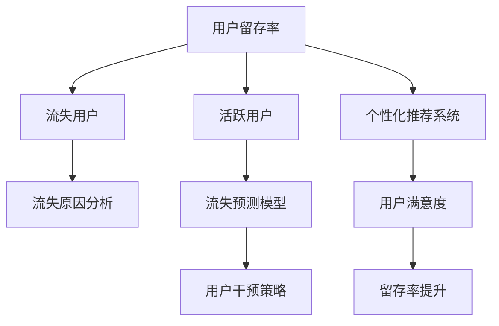

                 

# 知识付费平台的用户留存率提升策略

> 关键词：知识付费、用户留存率、策略分析、数据驱动、机器学习、深度学习、用户行为分析、A/B测试、行为建模、推荐系统、用户流失预测、个性化推荐、多渠道营销、CRM系统、数据中台

## 1. 背景介绍

### 1.1 问题由来

随着互联网和数字技术的迅猛发展，知识付费平台如雨后春笋般涌现，成为知识分享和消费的重要渠道。然而，知识付费行业的竞争日益激烈，用户流失率居高不下，严重影响了平台的生存和发展。据统计，许多平台的月度用户留存率在20%-30%之间，流失用户占总用户数的70%-80%。这一现象表明，知识付费平台不仅需要吸引新用户，更需要采取有效的用户留存策略，避免用户流失，从而实现长期稳定的盈利。

### 1.2 问题核心关键点

用户留存问题本质上是一个多维度的复杂问题，涉及用户心理、行为和偏好等多方面因素。因此，必须从多个角度出发，系统地分析问题，设计有针对性的解决方案。

**1.2.1 用户流失原因分析**
用户流失主要包括以下几个方面：

- 内容质量：用户对知识付费平台的核心需求是获取有价值、有趣味的知识内容。如果平台内容质量不高、更新不及时，或与用户需求不符，用户将选择离开。
- 用户体验：平台的用户界面、交互流程、功能设计等用户体验因素直接关系到用户的满意度。如果用户体验不佳，用户也会选择退出。
- 价格感知：价格是影响用户留存的重要因素。价格过高或过低，都可能导致用户流失。
- 忠诚度与粘性：用户对平台的忠诚度和粘性越高，其留存率也就越高。需要设计有效的忠诚度计划，提升用户的活跃度和忠诚度。

**1.2.2 用户留存率提升的关键点**
要提升用户留存率，需从以下几个方面入手：

- **内容优化**：提供高质量、多样化的内容，并确保内容的及时更新和持续优化。
- **用户体验改善**：提升平台的用户界面、交互流程、功能设计等，提供流畅的用户体验。
- **价格策略调整**：制定合理的价格策略，并适时进行价格调整，吸引和保留用户。
- **忠诚度计划设计**：设计有效的忠诚度计划，增强用户粘性和忠诚度。

## 2. 核心概念与联系

### 2.1 核心概念概述

为更好地理解知识付费平台的用户留存率提升策略，本节将介绍几个密切相关的核心概念：

- **用户留存率**：指在一定时间周期内，平台现有用户中继续使用该平台的比例。
- **流失用户**：指在某个时间周期内停止使用该平台的用户。
- **活跃用户**：指在一定时间周期内使用过该平台的用户。
- **终身价值(Lifetime Value, LTV)**：指一个用户在平台上的预期总消费金额。
- **流失用户预测**：通过分析用户行为数据，预测用户流失的可能性，提前采取干预措施。
- **个性化推荐系统**：利用用户行为数据，为每位用户推荐最适合的内容，提升用户满意度和留存率。

这些核心概念之间的逻辑关系可以通过以下Mermaid流程图来展示：



这个流程图展示了一系列提升用户留存率的流程和方法：

1. 通过流失用户分析，了解流失原因。
2. 通过流失预测模型，预测流失用户，提前采取干预措施。
3. 利用个性化推荐系统，提升用户满意度。
4. 用户满意度提升后，再通过流失干预策略，进一步提高留存率。

## 3. 核心算法原理 & 具体操作步骤
### 3.1 算法原理概述

知识付费平台的用户留存率提升，涉及到多个领域的算法和模型，包括但不限于以下几种：

- **用户行为分析**：利用用户行为数据，分析用户流失的原因和趋势。
- **流失用户预测**：构建流失预测模型，预测哪些用户可能流失，以及流失的时间点。
- **个性化推荐系统**：设计个性化推荐算法，根据用户偏好和历史行为，推荐适合的内容。
- **用户流失干预**：设计用户干预策略，如忠诚度计划、价格调整等，提升用户满意度和留存率。

这些算法和模型通常以数据驱动为前提，通过收集和分析用户行为数据，洞察用户需求和行为规律，从而制定有效的策略。

### 3.2 算法步骤详解

#### 3.2.1 用户行为分析

**3.2.1.1 数据收集**
收集平台的所有用户行为数据，包括但不限于：
- 用户注册信息
- 平台访问记录
- 课程订阅和购买记录
- 内容浏览记录
- 用户评价和反馈
- 用户反馈和投诉记录

**3.2.1.2 数据预处理**
对收集到的数据进行预处理，包括但不限于：
- 数据清洗：去除重复、异常、缺失数据
- 数据归一化：将数据归一化到0-1之间
- 特征工程：提取和构造有用的特征，如用户活跃度、内容偏好、时间戳等

**3.2.1.3 数据分析**
利用数据挖掘和统计分析工具，对用户行为数据进行分析，发现用户流失的原因和趋势。具体分析方法包括：
- 用户行为聚类分析：将用户分为不同的行为群体，分析不同群体的流失原因
- 时间序列分析：分析用户流失的时间规律，预测未来的流失趋势
- 关联规则分析：发现用户行为之间的关联关系，优化推荐系统

#### 3.2.2 流失用户预测

**3.2.2.1 数据准备**
准备流失用户预测所需的特征，包括但不限于：
- 用户注册时长
- 用户活跃度
- 用户购买频率
- 课程订阅记录
- 内容浏览时间
- 用户评价和反馈

**3.2.2.2 模型选择**
选择合适的流失预测模型，包括但不限于：
- 逻辑回归
- 随机森林
- 梯度提升树
- 神经网络
- 支持向量机

**3.2.2.3 模型训练**
利用历史流失用户数据和预测任务数据，训练流失预测模型。模型训练过程包括：
- 划分训练集和验证集
- 选择损失函数和优化算法
- 设置超参数，如学习率、正则化系数等
- 训练模型，并进行模型验证和调优

**3.2.2.4 模型评估**
使用测试集对模型进行评估，评估指标包括但不限于：
- 准确率
- 召回率
- F1值
- AUC

#### 3.2.3 个性化推荐系统

**3.2.3.1 数据收集**
收集用户的历史行为数据，包括但不限于：
- 用户浏览记录
- 用户购买记录
- 用户评价和反馈
- 用户互动记录

**3.2.3.2 数据预处理**
对收集到的数据进行预处理，包括但不限于：
- 数据清洗
- 数据归一化
- 特征工程

**3.2.3.3 推荐算法选择**
选择合适的推荐算法，包括但不限于：
- 协同过滤
- 内容推荐
- 基于矩阵分解的推荐
- 深度学习推荐模型（如FM、CARS、DNN等）

**3.2.3.4 模型训练**
利用用户历史行为数据，训练个性化推荐模型。模型训练过程包括：
- 划分训练集和验证集
- 选择损失函数和优化算法
- 设置超参数
- 训练模型，并进行模型验证和调优

**3.2.3.5 推荐结果输出**
利用训练好的模型，对用户进行个性化推荐。推荐结果包括但不限于：
- 推荐课程列表
- 推荐文章列表
- 推荐话题列表

#### 3.2.4 用户流失干预策略

**3.2.4.1 流失用户分析**
对流失用户进行详细分析，了解其流失原因。分析方法包括但不限于：
- 流失用户画像
- 流失用户的特征分析
- 流失用户的行为分析

**3.2.4.2 忠诚度计划设计**
设计有效的忠诚度计划，提升用户粘性和忠诚度。忠诚度计划包括但不限于：
- 积分奖励机制
- 会员特权
- 积分兑换
- 分级会员制

**3.2.4.3 价格策略调整**
根据市场和用户需求，适时进行价格调整，吸引和保留用户。价格策略包括但不限于：
- 会员制价格
- 限时优惠
- 套餐价
- 捆绑销售

**3.2.4.4 多渠道营销**
利用多渠道营销手段，提升用户对平台的关注度和粘性。多渠道营销包括但不限于：
- 社交媒体推广
- 搜索引擎优化
- 内容营销
- 广告投放

### 3.3 算法优缺点

#### 3.3.1 算法优点

用户留存率提升策略涉及多个算法的优点如下：

- **数据驱动**：利用数据驱动，准确分析和预测用户流失原因，制定有效的干预策略。
- **个性化推荐**：通过个性化推荐，提升用户满意度，增加平台粘性。
- **多渠道营销**：利用多渠道营销手段，提高用户对平台的关注度和活跃度。
- **预测模型优化**：通过预测模型优化，提前识别并干预流失用户，降低流失率。

#### 3.3.2 算法缺点

用户留存率提升策略涉及多个算法的缺点如下：

- **数据隐私问题**：数据收集和分析需要大量用户隐私数据，如何保护用户隐私是个重要问题。
- **模型复杂度**：多种算法需要大量计算资源和时间成本，模型维护和调优成本较高。
- **特征工程难度**：特征工程的复杂度较高，需要设计合理的特征提取和构造方法。
- **用户行为变化**：用户行为和需求可能随时变化，模型需要持续更新和优化。

## 4. 数学模型和公式 & 详细讲解  
### 4.1 数学模型构建

为更好地理解知识付费平台的用户留存率提升策略，本节将使用数学语言对用户行为分析、流失预测和个性化推荐等方法进行更加严格的刻画。

设平台用户总数为 $N$，在时间周期 $t$ 内，活跃用户数为 $A(t)$，流失用户数为 $L(t)$，新注册用户数为 $R(t)$。则用户留存率 $R(t)$ 定义为：

$$
R(t) = \frac{A(t)}{N}
$$

流失用户预测模型 $P$ 的输出为流失概率 $p_i$，其中 $i$ 表示用户 $i$。模型训练过程包括：

- 准备训练数据 $D=\{(x_j, y_j)\}_{j=1}^M$，其中 $x_j$ 为输入特征，$y_j$ 为流失标签（0表示未流失，1表示流失）
- 选择模型 $M$ 进行训练，最小化损失函数 $L$

流失用户预测模型的预测结果为 $p_i = M(x_i)$，其中 $x_i$ 为第 $i$ 用户的特征向量。预测结果用于评估用户流失风险。

个性化推荐系统 $R$ 的输出为推荐结果 $r_i = R(x_i)$，其中 $x_i$ 为第 $i$ 用户的特征向量。推荐结果用于提升用户满意度和留存率。

### 4.2 公式推导过程

#### 4.2.1 流失预测模型

以逻辑回归模型为例，进行用户流失预测模型的推导：

设流失预测模型为 $M(x) = \beta_0 + \sum_{k=1}^n \beta_k x_k$，其中 $x_k$ 为第 $k$ 个特征，$\beta_k$ 为对应的系数。训练样本 $D=\{(x_j, y_j)\}_{j=1}^M$，其中 $x_j = (x_{j1}, x_{j2}, ..., x_{jn})$，$y_j$ 为流失标签（0表示未流失，1表示流失）。

逻辑回归模型的损失函数为交叉熵损失，形式为：

$$
L = -\frac{1}{M}\sum_{j=1}^M y_j \log M(x_j) + (1-y_j) \log (1-M(x_j))
$$

利用梯度下降法，最小化损失函数，得到：

$$
\beta_k = \frac{1}{M}\sum_{j=1}^M (x_{jk} - \bar{x}_{jk}) y_j - \frac{1}{M}\sum_{j=1}^M (x_{jk} - \bar{x}_{jk}) (1-y_j)
$$

其中 $\bar{x}_{jk}$ 为特征 $x_k$ 的均值。

#### 4.2.2 个性化推荐模型

以协同过滤推荐模型为例，进行个性化推荐模型的推导：

设协同过滤推荐模型为 $R(x) = \sum_{i=1}^n \theta_i x_{ik}$，其中 $x_i$ 为第 $i$ 个用户的行为向量，$x_{ik}$ 为第 $k$ 个用户的行为向量。训练样本 $D=\{(x_j, y_j)\}_{j=1}^M$，其中 $x_j = (x_{j1}, x_{j2}, ..., x_{jn})$，$y_j$ 为推荐结果。

协同过滤推荐模型的损失函数为均方误差损失，形式为：

$$
L = \frac{1}{M}\sum_{j=1}^M (y_j - R(x_j))^2
$$

利用梯度下降法，最小化损失函数，得到：

$$
\theta_k = \frac{1}{M}\sum_{j=1}^M (x_{jk} - \bar{x}_{jk}) y_j
$$

其中 $\bar{x}_{jk}$ 为行为向量 $x_k$ 的均值。

## 5. 项目实践：代码实例和详细解释说明
### 5.1 开发环境搭建

在进行用户留存率提升策略的实践前，我们需要准备好开发环境。以下是使用Python进行Pandas和Scikit-learn开发的Python环境配置流程：

1. 安装Anaconda：从官网下载并安装Anaconda，用于创建独立的Python环境。

2. 创建并激活虚拟环境：
```bash
conda create -n pytorch-env python=3.8 
conda activate pytorch-env
```

3. 安装Pandas和Scikit-learn：
```bash
pip install pandas scikit-learn
```

4. 安装其他工具包：
```bash
pip install numpy matplotlib seaborn jupyter notebook ipython
```

完成上述步骤后，即可在`pytorch-env`环境中开始实践。

### 5.2 源代码详细实现

这里我们以流失用户预测和个性化推荐系统为例，给出使用Pandas和Scikit-learn实现的Python代码实现。

#### 5.2.1 流失用户预测

```python
from sklearn.linear_model import LogisticRegression
from sklearn.model_selection import train_test_split
from sklearn.metrics import classification_report

# 准备数据
X = df[['特征1', '特征2', '特征3']]
y = df['流失标签']

# 划分训练集和验证集
X_train, X_test, y_train, y_test = train_test_split(X, y, test_size=0.2, random_state=42)

# 训练逻辑回归模型
model = LogisticRegression()
model.fit(X_train, y_train)

# 预测并评估模型
y_pred = model.predict(X_test)
print(classification_report(y_test, y_pred))
```

#### 5.2.2 个性化推荐系统

```python
from scipy.spatial.distance import cosine
from sklearn.metrics.pairwise import cosine_similarity

# 准备数据
X = df[['特征1', '特征2', '特征3']]
y = df['推荐结果']

# 计算用户-内容相似度矩阵
similarity_matrix = cosine_similarity(X)

# 推荐结果
user_index = 0
top_n = 5
top_n_results = [(similarity_matrix[i][j], j) for i in range(X.shape[0]) for j in range(X.shape[0]) if i != j]
top_n_results.sort(reverse=True)
top_n_results = top_n_results[:top_n]

for result in top_n_results:
    print(f"推荐课程ID: {result[1]}, 相似度: {result[0]}")
```

### 5.3 代码解读与分析

让我们再详细解读一下关键代码的实现细节：

#### 5.3.1 流失用户预测

**代码解释**：

1. 首先，从数据集中提取流失预测模型的特征 $X$ 和标签 $y$。
2. 将数据集划分为训练集和验证集。
3. 使用逻辑回归模型对训练集进行训练。
4. 利用训练好的模型对测试集进行预测，并使用 classification_report 函数评估模型的性能。

**代码分析**：

1. 特征选择：用户流失预测模型的性能依赖于特征的选择。需要选择对用户流失有较强预测能力的特征，如用户注册时长、活跃度、购买频率等。
2. 模型选择：逻辑回归模型是一种常见的用户流失预测模型，适用于多分类任务，且模型简单，易于调参。
3. 模型评估：使用分类报告对模型进行评估，可以评估模型的准确率、召回率和 F1值等指标。

#### 5.3.2 个性化推荐系统

**代码解释**：

1. 首先，从数据集中提取个性化推荐系统的特征 $X$ 和标签 $y$。
2. 使用 cosine_similarity 函数计算用户-内容相似度矩阵。
3. 利用推荐结果对用户进行推荐，输出前 top_n 推荐结果。

**代码分析**：

1. 相似度计算：使用 cosine_similarity 函数计算用户行为向量的相似度，可以度量用户对不同内容的偏好程度。
2. 推荐算法：协同过滤推荐算法是一种基于用户行为相似度的推荐算法，适用于新用户和未评分物品较多的场景。
3. 推荐结果输出：通过相似度排序，选择相似度最高的前 top_n 内容进行推荐。

## 6. 实际应用场景
### 6.1 智能客服系统

基于用户留存率提升策略的智能客服系统，可以大幅提升用户满意度，减少流失率。具体实现如下：

1. 收集用户咨询记录，分析流失用户原因。
2. 设计流失用户预测模型，预测用户流失风险。
3. 设计个性化推荐系统，为用户推荐适合的客服机器人。
4. 设计流失干预策略，如积分奖励机制、会员特权等，提升用户粘性。

### 6.2 金融舆情监测

金融舆情监测平台可以利用用户留存率提升策略，提升用户留存率。具体实现如下：

1. 收集用户舆情数据，分析流失用户原因。
2. 设计流失用户预测模型，预测用户流失风险。
3. 设计个性化推荐系统，为用户推荐相关新闻和分析报告。
4. 设计流失干预策略，如专属分析报告、智能投顾等，提升用户粘性。

### 6.3 个性化推荐系统

个性化推荐系统可以利用用户留存率提升策略，提升用户满意度和留存率。具体实现如下：

1. 收集用户行为数据，分析流失用户原因。
2. 设计流失用户预测模型，预测用户流失风险。
3. 设计个性化推荐系统，为用户推荐适合的课程和内容。
4. 设计流失干预策略，如积分奖励机制、会员特权等，提升用户粘性。

### 6.4 未来应用展望

随着用户留存率提升策略的不断优化，其在知识付费平台中的应用将更加广泛。未来，基于该策略的系统将在更多场景下得到应用，为知识付费平台的健康发展提供有力支持。

## 7. 工具和资源推荐
### 7.1 学习资源推荐

为了帮助开发者系统掌握用户留存率提升策略的理论基础和实践技巧，这里推荐一些优质的学习资源：

1. 《Python数据科学手册》系列博文：由知名数据科学家撰写，深入浅出地介绍了数据科学的基本概念和应用方法。
2. 《数据科学实战》系列课程：由知名数据科学家在线开设，涵盖数据科学的全流程应用。
3. 《机器学习实战》系列书籍：详细介绍了机器学习的基本理论和算法，并提供了大量的代码示例。
4. Kaggle平台：提供在线数据集和竞赛平台，帮助开发者练习和提升数据分析和机器学习能力。
5. Coursera平台：提供各类数据科学和机器学习课程，涵盖从基础到高级的各个层次。

通过对这些资源的学习实践，相信你一定能够快速掌握用户留存率提升策略的精髓，并用于解决实际的业务问题。

### 7.2 开发工具推荐

高效的开发离不开优秀的工具支持。以下是几款用于用户留存率提升策略开发的常用工具：

1. Python：Python是一种简单易学的编程语言，拥有丰富的第三方库，适合数据科学和机器学习开发。
2. Pandas：用于数据处理和分析的Python库，提供了强大的数据操作和分析功能。
3. Scikit-learn：Python机器学习库，提供了多种常用的机器学习算法和工具。
4. TensorFlow：Google开发的深度学习框架，适合构建复杂神经网络。
5. Keras：基于TensorFlow的深度学习框架，提供了简单易用的API接口。
6. PyTorch：Facebook开发的深度学习框架，适合研究和应用。
7. Jupyter Notebook：Python开发和数据分析的交互式环境，适合快速迭代实验。

合理利用这些工具，可以显著提升用户留存率提升策略的开发效率，加快创新迭代的步伐。

### 7.3 相关论文推荐

用户留存率提升策略的研究源于学界的持续研究。以下是几篇奠基性的相关论文，推荐阅读：

1. "Churn Prediction Using Decision Trees"：介绍决策树模型用于用户流失预测。
2. "A Comparative Study of Machine Learning Techniques for Customer Churn Prediction"：比较多种机器学习算法在用户流失预测中的效果。
3. "Collaborative Filtering Recommendation"：介绍协同过滤推荐算法的基本原理和应用。
4. "A Survey of Collaborative Filtering Recommendation Algorithms"：综述协同过滤推荐算法的最新进展和应用。
5. "Personalization in Recommendation Systems"：介绍个性化推荐系统的基本原理和应用。

这些论文代表了大语言模型微调技术的发展脉络。通过学习这些前沿成果，可以帮助研究者把握学科前进方向，激发更多的创新灵感。

## 8. 总结：未来发展趋势与挑战

### 8.1 研究成果总结

本文对用户留存率提升策略进行了全面系统的介绍。首先，介绍了用户流失和用户留存的基本概念和重要性，明确了用户留存率提升的关键点。其次，从多个角度出发，详细讲解了用户行为分析、流失预测、个性化推荐系统等核心算法和模型。最后，结合实际应用场景，分析了用户留存率提升策略在智能客服、金融舆情监测、个性化推荐系统等多个领域的应用前景。

### 8.2 未来发展趋势

展望未来，用户留存率提升策略将呈现以下几个发展趋势：

1. 算法多样化：未来的用户留存率提升策略将结合多种算法，如决策树、随机森林、深度学习等，提升预测精度和推荐效果。
2. 数据实时化：利用实时数据，实现实时用户行为分析和预测，提升用户留存率。
3. 模型自动化：自动化模型选择和超参数调优，提高模型开发和优化效率。
4. 数据可视化：利用数据可视化工具，展示用户行为和流失趋势，辅助决策。
5. 跨领域应用：用户留存率提升策略将在更多领域得到应用，如金融、医疗、电商等。

### 8.3 面临的挑战

尽管用户留存率提升策略已经取得了一定的成效，但在迈向更加智能化、普适化应用的过程中，仍面临以下挑战：

1. 数据隐私问题：用户行为数据涉及隐私，如何保护用户隐私是个重要问题。
2. 模型复杂度：多种算法需要大量计算资源和时间成本，模型维护和调优成本较高。
3. 特征工程难度：特征工程的复杂度较高，需要设计合理的特征提取和构造方法。
4. 用户行为变化：用户行为和需求可能随时变化，模型需要持续更新和优化。

### 8.4 研究展望

未来的研究需要在以下几个方面寻求新的突破：

1. 探索无监督和半监督用户留存预测方法。摆脱对大规模标注数据的依赖，利用自监督学习、主动学习等无监督和半监督范式，最大限度利用非结构化数据，实现更加灵活高效的用户留存预测。
2. 研究参数高效和计算高效的推荐系统。开发更加参数高效的推荐方法，在固定大部分预训练参数的同时，只更新极少量的任务相关参数。同时优化推荐系统的计算图，减少前向传播和反向传播的资源消耗，实现更加轻量级、实时性的部署。
3. 引入因果分析和博弈论工具。将因果分析方法引入用户留存预测模型，识别出模型决策的关键特征，增强输出解释的因果性和逻辑性。借助博弈论工具刻画人机交互过程，主动探索并规避模型的脆弱点，提高系统稳定性。
4. 纳入伦理道德约束。在模型训练目标中引入伦理导向的评估指标，过滤和惩罚有偏见、有害的输出倾向。同时加强人工干预和审核，建立模型行为的监管机制，确保输出符合人类价值观和伦理道德。

这些研究方向的探索，必将引领用户留存率提升策略技术迈向更高的台阶，为构建安全、可靠、可解释、可控的智能系统铺平道路。面向未来，用户留存率提升策略还需要与其他人工智能技术进行更深入的融合，如知识表示、因果推理、强化学习等，多路径协同发力，共同推动自然语言理解和智能交互系统的进步。只有勇于创新、敢于突破，才能不断拓展用户留存率提升策略的边界，让智能技术更好地造福人类社会。

## 9. 附录：常见问题与解答

**Q1：用户流失分析的主要方法有哪些？**

A: 用户流失分析的主要方法包括：

- **用户行为聚类分析**：将用户分为不同的行为群体，分析不同群体的流失原因。
- **时间序列分析**：分析用户流失的时间规律，预测未来的流失趋势。
- **关联规则分析**：发现用户行为之间的关联关系，优化推荐系统。

**Q2：用户留存预测的主要算法有哪些？**

A: 用户留存预测的主要算法包括：

- **逻辑回归**：适用于多分类任务，简单易用。
- **随机森林**：适用于处理高维度数据，具有较好的鲁棒性。
- **梯度提升树**：适用于处理大规模数据，效果较好。
- **神经网络**：适用于处理复杂数据，具有较好的预测精度。
- **支持向量机**：适用于处理非线性数据，效果较好。

**Q3：个性化推荐系统的主要算法有哪些？**

A: 个性化推荐系统的主要算法包括：

- **协同过滤**：基于用户行为相似度的推荐算法，适用于新用户和未评分物品较多的场景。
- **内容推荐**：基于内容特征的推荐算法，适用于有丰富内容特征的场景。
- **基于矩阵分解的推荐**：利用矩阵分解的方法，提取用户和物品的潜在特征。
- **深度学习推荐模型**：如FM、CARS、DNN等，适用于处理大规模数据，具有较好的推荐效果。

**Q4：用户留存率提升策略的实施过程包括哪些步骤？**

A: 用户留存率提升策略的实施过程包括：

1. 数据收集：收集平台的所有用户行为数据，包括但不限于：用户注册信息、平台访问记录、课程订阅和购买记录、内容浏览记录、用户评价和反馈等。
2. 数据预处理：对收集到的数据进行预处理，包括但不限于：数据清洗、数据归一化、特征工程等。
3. 用户行为分析：利用数据挖掘和统计分析工具，对用户行为数据进行分析，发现用户流失的原因和趋势。
4. 流失用户预测：构建流失预测模型，预测哪些用户可能流失，以及流失的时间点。
5. 个性化推荐系统：设计个性化推荐算法，根据用户偏好和历史行为，推荐适合的内容。
6. 流失干预策略：设计有效的忠诚度计划，增强用户粘性和忠诚度；设计合理的价格策略，吸引和保留用户。

**Q5：用户留存率提升策略的实施效果如何评估？**

A: 用户留存率提升策略的实施效果评估包括：

1. 流失用户分析：通过分析流失用户的原因和特征，评估策略的效果。
2. 流失用户预测：通过评估流失预测模型的准确率和召回率，评估策略的效果。
3. 个性化推荐系统：通过评估推荐系统的推荐精度和用户满意度，评估策略的效果。
4. 流失干预策略：通过评估忠诚度计划和价格策略的实施效果，评估策略的效果。

通过以上问题与解答，相信你对用户留存率提升策略有了更加深入的理解。希望本文能够帮助你在实际应用中取得更好的效果。

---

作者：禅与计算机程序设计艺术 / Zen and the Art of Computer Programming

