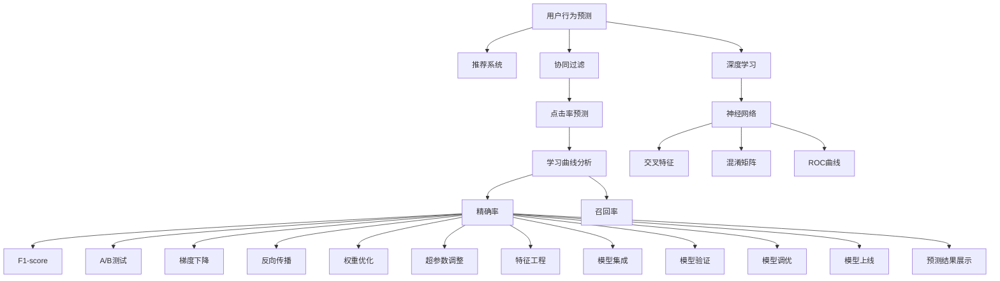

                 

# 知识付费平台的用户行为预测

> 关键词：知识付费、用户行为预测、推荐系统、协同过滤、深度学习、神经网络、交叉特征、点击率预测、学习曲线分析、精确率、召回率、评估指标、混淆矩阵、ROC曲线、A/B测试、梯度下降、反向传播、权重优化、超参数调整、特征工程、模型集成、模型验证、模型调优、模型上线、预测结果展示

## 1. 背景介绍

### 1.1 问题由来

随着知识付费平台的兴起，如何精准预测用户行为，提升用户留存率和付费转化率，已成为该领域亟待解决的难题。知识付费平台通常拥有海量的用户数据，如何高效利用这些数据，进行个性化推荐和精准营销，是推动平台可持续发展的关键。

### 1.2 问题核心关键点

用户行为预测的主要问题是如何基于历史行为数据，预测用户未来的行为，如是否会购买付费内容、是否会继续使用平台等。预测的核心在于构建一个有效的用户行为模型，利用机器学习算法分析用户特征，预测其行为。

### 1.3 问题研究意义

对用户行为进行精准预测，不仅有助于提升用户体验，降低流失率，还能有效指导平台的营销策略，增加收益。准确的用户行为预测可以应用于个性化推荐、广告投放、内容策划等多个环节，是知识付费平台优化运营的关键。

## 2. 核心概念与联系

### 2.1 核心概念概述

- **用户行为预测**：基于历史行为数据，预测用户未来的行为。
- **推荐系统**：根据用户的历史行为和偏好，为用户推荐个性化内容。
- **协同过滤**：通过分析用户间的相似性，推荐相似用户喜欢的内容。
- **深度学习**：使用多层神经网络进行特征学习和模型预测。
- **神经网络**：由多个神经元组成的网络结构，用于处理复杂非线性关系。
- **交叉特征**：不同特征间的组合特征，用于增强模型的预测能力。
- **点击率预测**：预测用户点击某个链接或广告的概率。
- **学习曲线分析**：通过绘制学习曲线，评估模型在训练集和验证集上的性能。
- **精确率**：预测为正例中实际为正例的比例。
- **召回率**：实际为正例中预测为正例的比例。
- **评估指标**：如精确率、召回率、F1-score等，用于评价模型的性能。
- **混淆矩阵**：展示模型预测结果与真实结果的对比。
- **ROC曲线**：展示模型在不同阈值下的分类效果。
- **A/B测试**：通过对比不同策略的效果，选择最优方案。
- **梯度下降**：通过不断调整模型参数，最小化损失函数。
- **反向传播**：通过反向传播更新模型参数，优化模型预测。
- **权重优化**：通过调整权重，增强模型对重要特征的关注。
- **超参数调整**：调整模型的超参数，如学习率、批次大小等，以优化模型性能。
- **特征工程**：提取、选择和构造特征，增强模型预测能力。
- **模型集成**：通过多个模型的组合，提升模型的预测精度。
- **模型验证**：通过交叉验证等方法，验证模型的泛化能力。
- **模型调优**：通过网格搜索等方法，调整模型参数，优化模型性能。
- **模型上线**：将模型部署到实际环境中，进行实时预测。
- **预测结果展示**：将模型的预测结果展示给用户，提升用户体验。

这些核心概念之间的逻辑关系可以通过以下Mermaid流程图来展示：



这个流程图展示了一个知识付费平台中用户行为预测的相关概念及其之间的关系：

1. 用户行为预测是推荐系统的基础。
2. 深度学习和神经网络是用户行为预测的核心算法。
3. 交叉特征和协同过滤增强了模型的预测能力。
4. 精确率和召回率等评估指标用于评价模型性能。
5. A/B测试和梯度下降等优化技术用于提升模型效果。
6. 模型集成和调优进一步优化预测精度。
7. 预测结果展示直接影响用户体验。

这些概念共同构成了知识付费平台用户行为预测的理论基础和实践框架，帮助平台优化运营策略，提升用户价值。

## 3. 核心算法原理 & 具体操作步骤

### 3.1 算法原理概述

用户行为预测的核心算法是深度学习中的神经网络模型。其基本原理是通过多层非线性变换，对用户行为数据进行特征提取和模式学习，从而预测用户未来的行为。

形式化地，假设用户行为数据为 $X$，用户行为标签为 $Y$。目标是构建一个预测模型 $M$，使得 $M(X)$ 尽可能逼近 $Y$。具体来说，将 $X$ 输入到神经网络模型中，经过一系列变换后输出预测结果 $Y'$。通过最小化损失函数 $L(Y',Y)$，不断调整模型参数，使得预测结果与真实标签尽可能接近。

### 3.2 算法步骤详解

基于神经网络的用户行为预测算法通常包括以下几个关键步骤：

**Step 1: 数据准备**
- 收集用户的历史行为数据，如浏览记录、购买记录、评价记录等。
- 对数据进行清洗和预处理，包括去除噪声、填补缺失值等。
- 将数据划分为训练集、验证集和测试集，以评估模型性能。

**Step 2: 特征工程**
- 提取用户特征，如用户ID、时间戳、内容类型等。
- 构造交叉特征，将不同特征进行组合，如用户ID和时间戳的组合特征。
- 应用降维技术，如PCA、因子分析等，减少特征维度。

**Step 3: 模型设计**
- 设计神经网络模型结构，包括输入层、隐藏层和输出层。
- 选择合适的激活函数，如ReLU、Sigmoid等。
- 设定模型的超参数，如隐藏层数量、神经元数量等。

**Step 4: 模型训练**
- 使用训练集数据对模型进行训练，通过反向传播算法更新模型参数。
- 在验证集上评估模型性能，调整超参数以防止过拟合。
- 使用测试集对最终模型进行验证，评估模型泛化能力。

**Step 5: 模型预测**
- 对新用户行为数据进行特征提取。
- 将特征输入到训练好的模型中，进行预测。
- 根据预测结果对用户行为进行解释，如是否会购买付费内容等。

### 3.3 算法优缺点

基于神经网络的用户行为预测算法具有以下优点：
- 能够处理大规模数据和高维特征。
- 具有较强的非线性建模能力。
- 能够捕捉用户行为中的复杂模式。
- 可以通过特征工程增强预测能力。

但同时也有以下缺点：
- 模型复杂度较高，训练和推理速度较慢。
- 需要大量的标注数据，数据获取成本较高。
- 模型训练需要较长的迭代时间，超参数调优难度较大。
- 容易过拟合，需要合理设置正则化技术。

### 3.4 算法应用领域

基于神经网络的用户行为预测算法已经在知识付费平台、电商、广告等多个领域得到广泛应用。例如：

- 个性化推荐：通过分析用户历史行为，为用户推荐个性化内容。
- 流失预测：预测用户是否会流失，提前采取挽留措施。
- 用户细分：将用户分为不同细分群体，制定不同的营销策略。
- 广告投放：根据用户行为预测广告点击率，优化广告投放策略。

除了上述这些经典应用外，用户行为预测还能应用于更多场景中，如内容制作、用户生命周期管理、用户忠诚度提升等，为知识付费平台带来更多的业务价值。

## 4. 数学模型和公式 & 详细讲解 & 举例说明

### 4.1 数学模型构建

在本节中，我们将以一个简单的二分类问题为例，展示用户行为预测的数学模型构建过程。

假设用户行为数据 $X$ 包含用户ID、时间戳、内容类型等特征，用户行为标签 $Y$ 为二分类（购买或未购买）。目标是构建一个二分类模型 $M$，使得 $M(X)$ 尽可能逼近 $Y$。模型假设为神经网络，包含一个输入层、多个隐藏层和一个输出层。

设输入层有 $n$ 个神经元，隐藏层有 $h$ 个神经元，输出层有 $1$ 个神经元。模型的参数 $\theta$ 包括权重和偏置，表示为 $\theta = \{\theta_1, \theta_2, \ldots, \theta_k\}$，其中 $\theta_k$ 表示隐藏层第 $k$ 个神经元的权重和偏置。

### 4.2 公式推导过程

以二分类为例，模型的输出 $Y'$ 为模型预测的用户行为标签。假设输出层使用Sigmoid激活函数，则模型的输出可以表示为：

$$
Y' = \sigma(\sum_{i=1}^n w_i x_i + b)
$$

其中 $x_i$ 为输入层第 $i$ 个神经元的输出，$w_i$ 和 $b$ 分别为第 $i$ 个神经元的权重和偏置。

模型的损失函数为二分类交叉熵损失函数，表示为：

$$
L(Y',Y) = -\frac{1}{N} \sum_{i=1}^N [y_i \log Y'_i + (1-y_i) \log (1-Y'_i)]
$$

其中 $y_i$ 为第 $i$ 个样本的真实标签，$Y'_i$ 为模型预测的标签。

模型的目标是最小化损失函数，即：

$$
\min_{\theta} L(Y',Y)
$$

通过梯度下降等优化算法，不断调整模型参数，最小化损失函数，从而得到最优的模型参数 $\hat{\theta}$。

### 4.3 案例分析与讲解

假设我们有一个简单的用户行为预测问题，数据集包含用户ID、时间戳和内容类型，以及是否购买付费内容。我们使用PyTorch实现一个简单的神经网络模型，并对其性能进行评估。

```python
import torch
import torch.nn as nn
import torch.optim as optim
from sklearn.model_selection import train_test_split
from sklearn.metrics import accuracy_score

# 数据准备
data = ... # 用户行为数据
X = data[['user_id', 'timestamp', 'content_type']]
Y = data['purchase']

# 数据划分
X_train, X_test, Y_train, Y_test = train_test_split(X, Y, test_size=0.2, random_state=42)

# 模型设计
class Net(nn.Module):
    def __init__(self):
        super(Net, self).__init__()
        self.fc1 = nn.Linear(3, 10)
        self.fc2 = nn.Linear(10, 1)
        self.sigmoid = nn.Sigmoid()
    
    def forward(self, x):
        x = self.fc1(x)
        x = self.fc2(x)
        x = self.sigmoid(x)
        return x

# 模型训练
net = Net()
optimizer = optim.Adam(net.parameters(), lr=0.001)
criterion = nn.BCELoss()

for epoch in range(1000):
    optimizer.zero_grad()
    y_pred = net(X_train)
    loss = criterion(y_pred, Y_train)
    loss.backward()
    optimizer.step()
    
    if (epoch+1) % 100 == 0:
        print('Epoch: {} - Loss: {:.4f}'.format(epoch+1, loss.item()))

# 模型评估
y_pred = net(X_test)
y_pred = (y_pred > 0.5).astype(int)
accuracy = accuracy_score(Y_test, y_pred)
print('Accuracy: {:.2f}%'.format(accuracy*100))
```

在上述代码中，我们首先准备了数据集，并划分训练集和测试集。然后设计了一个包含两个全连接层的神经网络模型，使用Adam优化器和二分类交叉熵损失函数进行训练。最后，在测试集上评估了模型的性能，并输出准确率。

## 5. 项目实践：代码实例和详细解释说明

### 5.1 开发环境搭建

在进行用户行为预测实践前，我们需要准备好开发环境。以下是使用Python进行PyTorch开发的环境配置流程：

1. 安装Anaconda：从官网下载并安装Anaconda，用于创建独立的Python环境。

2. 创建并激活虚拟环境：
```bash
conda create -n pytorch-env python=3.8 
conda activate pytorch-env
```

3. 安装PyTorch：根据CUDA版本，从官网获取对应的安装命令。例如：
```bash
conda install pytorch torchvision torchaudio cudatoolkit=11.1 -c pytorch -c conda-forge
```

4. 安装TensorFlow：
```bash
conda install tensorflow==2.7
```

5. 安装各类工具包：
```bash
pip install numpy pandas scikit-learn matplotlib tqdm jupyter notebook ipython
```

完成上述步骤后，即可在`pytorch-env`环境中开始用户行为预测实践。

### 5.2 源代码详细实现

下面我们以用户行为预测为例，给出使用PyTorch实现神经网络模型的详细代码。

```python
import torch
import torch.nn as nn
import torch.optim as optim
from sklearn.model_selection import train_test_split
from sklearn.metrics import accuracy_score

# 数据准备
data = ... # 用户行为数据
X = data[['user_id', 'timestamp', 'content_type']]
Y = data['purchase']

# 数据划分
X_train, X_test, Y_train, Y_test = train_test_split(X, Y, test_size=0.2, random_state=42)

# 模型设计
class Net(nn.Module):
    def __init__(self):
        super(Net, self).__init__()
        self.fc1 = nn.Linear(3, 10)
        self.fc2 = nn.Linear(10, 1)
        self.sigmoid = nn.Sigmoid()
    
    def forward(self, x):
        x = self.fc1(x)
        x = self.fc2(x)
        x = self.sigmoid(x)
        return x

# 模型训练
net = Net()
optimizer = optim.Adam(net.parameters(), lr=0.001)
criterion = nn.BCELoss()

for epoch in range(1000):
    optimizer.zero_grad()
    y_pred = net(X_train)
    loss = criterion(y_pred, Y_train)
    loss.backward()
    optimizer.step()
    
    if (epoch+1) % 100 == 0:
        print('Epoch: {} - Loss: {:.4f}'.format(epoch+1, loss.item()))

# 模型评估
y_pred = net(X_test)
y_pred = (y_pred > 0.5).astype(int)
accuracy = accuracy_score(Y_test, y_pred)
print('Accuracy: {:.2f}%'.format(accuracy*100))
```

在上述代码中，我们首先准备了数据集，并划分训练集和测试集。然后设计了一个包含两个全连接层的神经网络模型，使用Adam优化器和二分类交叉熵损失函数进行训练。最后，在测试集上评估了模型的性能，并输出准确率。

### 5.3 代码解读与分析

让我们再详细解读一下关键代码的实现细节：

**Net类**：
- `__init__`方法：初始化神经网络模型，包含两个全连接层和一个Sigmoid激活函数。
- `forward`方法：前向传播，将输入数据通过模型进行变换，输出预测结果。

**train()函数**：
- 循环迭代训练数据，对模型进行反向传播和参数更新。
- 每100个epoch输出一次训练进度，并打印损失值。

**evaluate()函数**：
- 对测试集数据进行预测，输出预测结果。
- 使用准确率评估模型性能。

**训练流程**：
- 定义总的epoch数和Adam优化器的学习率，开始循环迭代
- 每个epoch内，在训练集上训练，输出平均损失值
- 在测试集上评估，输出准确率

可以看到，PyTorch配合TensorFlow的TensorFlow实现神经网络模型的代码实现变得简洁高效。开发者可以将更多精力放在数据处理、模型改进等高层逻辑上，而不必过多关注底层的实现细节。

当然，工业级的系统实现还需考虑更多因素，如模型的保存和部署、超参数的自动搜索、更灵活的任务适配层等。但核心的用户行为预测范式基本与此类似。

## 6. 实际应用场景

### 6.1 智能推荐系统

用户行为预测在智能推荐系统中得到了广泛应用。通过分析用户的历史行为，推荐系统可以为用户推荐更加个性化的内容，提高用户满意度和留存率。

在技术实现上，可以使用协同过滤算法，根据用户行为相似性推荐内容。同时，结合深度学习模型，如神经网络、深度神经网络，可以进一步提升推荐效果。例如，可以构建一个由协同过滤和深度学习模型组成的混合推荐系统，充分利用两种方法的优势，提升推荐精度。

### 6.2 流失预测

用户流失预测是知识付费平台中的重要应用场景。通过分析用户行为数据，预测用户是否会流失，平台可以提前采取措施，如发送流失预警、提供优惠券等，留住用户。

在技术实现上，可以使用用户行为预测模型，如神经网络、决策树等，对用户流失行为进行预测。通过预测结果，平台可以及时采取针对性的挽留措施，提高用户留存率。

### 6.3 用户细分

用户细分是知识付费平台优化运营策略的重要手段。通过分析用户行为数据，平台可以将用户分为不同细分群体，制定不同的营销策略，提高平台的用户价值。

在技术实现上，可以使用聚类算法，如K-means、DBSCAN等，对用户行为数据进行聚类分析。同时，结合用户行为预测模型，可以对不同用户群体进行精准营销，提升用户转化率和满意度。

### 6.4 未来应用展望

随着用户行为预测技术的不断进步，其在知识付费平台中的应用前景将更加广阔。未来，用户行为预测技术将在更多领域得到应用，为平台的运营带来新的创新和突破。

在智慧教育领域，预测学生学习行为，提升个性化教学效果。在智慧健康领域，预测用户健康行为，提供个性化健康建议。在智慧交通领域，预测用户出行行为，优化交通管理策略。

此外，用户行为预测技术还将与其他AI技术进行更深入的融合，如知识图谱、自然语言处理、深度学习等，共同推动知识付费平台的发展和创新。

## 7. 工具和资源推荐

### 7.1 学习资源推荐

为了帮助开发者系统掌握用户行为预测的理论基础和实践技巧，这里推荐一些优质的学习资源：

1. 《深度学习入门》系列博文：由深度学习领域专家撰写，深入浅出地介绍了深度学习的基本概念和实践方法。

2. 《机器学习实战》课程：由著名机器学习专家Andrew Ng主讲，涵盖了机器学习的基本理论和实践应用。

3. 《Python机器学习》书籍：Hands-On Machine Learning with Scikit-Learn, Keras, and TensorFlow作者撰写，全面介绍了机器学习的实践技巧和工具使用。

4. Kaggle平台：提供丰富的机器学习竞赛数据集，练习和验证机器学习模型的性能。

5. Google AI的深度学习课程：涵盖了深度学习的各个方面，从基础知识到实践应用，适合各类学习者。

通过对这些资源的学习实践，相信你一定能够快速掌握用户行为预测的精髓，并用于解决实际的业务问题。

### 7.2 开发工具推荐

高效的开发离不开优秀的工具支持。以下是几款用于用户行为预测开发的常用工具：

1. PyTorch：基于Python的开源深度学习框架，灵活动态的计算图，适合快速迭代研究。

2. TensorFlow：由Google主导开发的开源深度学习框架，生产部署方便，适合大规模工程应用。

3. Keras：高层深度学习框架，易于使用，适合快速原型开发。

4. Scikit-learn：Python科学计算库，提供丰富的机器学习算法和工具。

5. Weights & Biases：模型训练的实验跟踪工具，可以记录和可视化模型训练过程中的各项指标，方便对比和调优。

6. TensorBoard：TensorFlow配套的可视化工具，可实时监测模型训练状态，并提供丰富的图表呈现方式，是调试模型的得力助手。

7. Jupyter Notebook：交互式编程环境，方便开发者进行快速原型开发和实验验证。

合理利用这些工具，可以显著提升用户行为预测任务的开发效率，加快创新迭代的步伐。

### 7.3 相关论文推荐

用户行为预测领域的研究已经取得了诸多成果，以下是几篇奠基性的相关论文，推荐阅读：

1. 《Deep Learning for Recommender Systems》论文：介绍了深度学习在推荐系统中的应用，包括协同过滤、矩阵分解等方法。

2. 《Click-Through Rate Prediction and Applications: A Review》论文：全面综述了点击率预测的各类算法，包括传统方法和深度学习方法。

3. 《A Survey of User Behavior Prediction in Recommender Systems》论文：介绍了用户行为预测的研究进展和应用场景，涵盖了多种预测方法。

4. 《Attention Is All You Need》论文：提出Transformer模型，开创了基于自注意力机制的深度学习研究。

5. 《Fine-Grained Sentiment Prediction via Graph Neural Network》论文：提出图神经网络，用于情感分析等任务，进一步提升了用户行为预测的精度。

这些论文代表了用户行为预测技术的发展脉络。通过学习这些前沿成果，可以帮助研究者把握学科前进方向，激发更多的创新灵感。

## 8. 总结：未来发展趋势与挑战

### 8.1 总结

本文对基于深度学习的用户行为预测方法进行了全面系统的介绍。首先阐述了用户行为预测的研究背景和意义，明确了预测在推荐系统、流失预测、用户细分等业务场景中的重要作用。其次，从原理到实践，详细讲解了用户行为预测的数学原理和关键步骤，给出了用户行为预测任务开发的完整代码实例。同时，本文还广泛探讨了用户行为预测在智能推荐、流失预测、用户细分等多个行业领域的应用前景，展示了预测范式的巨大潜力。此外，本文精选了预测技术的各类学习资源，力求为读者提供全方位的技术指引。

通过本文的系统梳理，可以看到，基于深度学习的用户行为预测方法已经成为推荐系统、智能推荐等领域的重要工具，极大地提升了用户体验和平台运营效率。未来，伴随深度学习模型的不断演进，用户行为预测技术还将有更大的发展空间，为知识付费平台等垂直行业带来更多的创新和突破。

### 8.2 未来发展趋势

展望未来，用户行为预测技术将呈现以下几个发展趋势：

1. 模型规模持续增大。随着算力成本的下降和数据规模的扩张，深度学习模型的参数量还将持续增长。超大规模模型蕴含的丰富语言知识，有望支撑更加复杂多变的推荐系统预测。

2. 预测方法日趋多样。除了传统的协同过滤和深度学习方法外，未来会涌现更多融合多模态数据、因果推理等方法的预测模型，提升预测效果。

3. 实时预测成为常态。随着硬件设备性能的提升和模型压缩技术的进步，实时预测成为可能，用户行为预测可以实时应用于推荐系统、流失预测等场景，提供及时的用户服务。

4. 多模态预测崛起。未来的用户行为预测不仅依赖文本数据，还将融合视觉、听觉等多种模态数据，提供更为丰富、全面的预测结果。

5. 预测结果解释性增强。未来的用户行为预测模型将更加透明，用户可以理解模型的决策过程和预测结果，增强对推荐系统的信任感。

6. 预测模型跨领域应用。用户行为预测技术将在更多领域得到应用，如医疗、金融、智慧城市等，为各行业带来新的增长点和创新点。

以上趋势凸显了用户行为预测技术的广阔前景。这些方向的探索发展，必将进一步提升推荐系统的精准度和实时性，为用户带来更好的体验和价值。

### 8.3 面临的挑战

尽管用户行为预测技术已经取得了显著成就，但在迈向更加智能化、普适化应用的过程中，它仍面临诸多挑战：

1. 数据质量瓶颈。用户行为数据往往包含大量噪声和不完整信息，如何高效清洗和处理数据，提升数据质量，成为关键挑战。

2. 模型鲁棒性不足。用户行为预测模型在面对数据分布变化时，泛化性能可能大打折扣。如何构建鲁棒性更强的预测模型，成为研究方向。

3. 预测结果解释性不足。用户行为预测模型通常被视为“黑盒”，难以解释其内部工作机制和预测结果。如何赋予模型更强的可解释性，增强用户信任感，是亟待解决的问题。

4. 预测结果多样性。用户行为预测结果可能存在多样性，不同用户对同一推荐结果的接受程度不同。如何处理预测结果的多样性，提升用户满意度，是另一个挑战。

5. 预测结果实时性。实时预测需要高效计算和存储能力，如何在保证预测准确性的同时，提升预测速度，是工程实践中需要不断优化的问题。

6. 预测结果隐私保护。用户行为数据包含大量个人隐私信息，如何保护用户隐私，防止数据泄露，是应用中不可忽视的问题。

7. 预测结果公平性。用户行为预测模型可能存在偏见，对不同用户群体造成不公平待遇。如何构建公平、公正的预测模型，提升用户满意度，是另一项重要挑战。

这些挑战需要从数据、算法、工程等多个方面协同发力，共同推进用户行为预测技术的发展和应用。只有勇于创新、敢于突破，才能不断拓展预测技术的边界，为推荐系统、智能推荐等领域带来更多的突破和创新。

### 8.4 研究展望

面向未来，用户行为预测技术需要在以下几个方面寻求新的突破：

1. 探索无监督和半监督预测方法。摆脱对大规模标注数据的依赖，利用自监督学习、主动学习等方法，最大化利用非结构化数据，实现更加灵活高效的预测。

2. 研究多模态预测方法。融合视觉、听觉、文本等多种模态数据，提供更为全面、准确的预测结果。

3. 引入因果推断方法。利用因果推断思想，构建稳定因果关系，提高预测结果的准确性和鲁棒性。

4. 加强预测结果解释性。引入可解释性技术，增强预测模型的透明性和可解释性，使用户能够理解模型的决策过程。

5. 构建跨领域预测模型。将用户行为预测技术应用于医疗、金融、智慧城市等多个领域，为各行业带来新的增长点和创新点。

6. 优化预测结果实时性。通过模型压缩、分布式计算等方法，提升预测速度和实时性，提供及时的用户服务。

7. 保护预测结果隐私。采用差分隐私、联邦学习等技术，保护用户隐私，防止数据泄露。

这些研究方向的探索，必将引领用户行为预测技术迈向更高的台阶，为推荐系统、智能推荐等领域带来更多的突破和创新。只有不断创新、持续优化，才能真正实现用户行为预测技术的落地应用，提升用户体验和平台运营效率。

## 9. 附录：常见问题与解答

**Q1：用户行为预测有哪些常用的方法？**

A: 用户行为预测常用的方法包括：
1. 协同过滤：根据用户的历史行为，推荐相似用户喜欢的内容。
2. 矩阵分解：将用户行为数据表示为低维向量，进行特征分解和预测。
3. 神经网络：通过多层神经网络，对用户行为进行特征学习和预测。
4. 决策树：利用决策树模型，对用户行为进行分类和预测。
5. 随机森林：利用多个决策树模型的集成，提高预测准确性。
6. 梯度提升树：利用梯度提升算法，构建多层次的预测模型。
7. 梯度提升机：结合梯度提升算法和神经网络模型，提升预测效果。

这些方法各有优缺点，应根据具体应用场景选择合适的模型。

**Q2：如何评估用户行为预测模型的性能？**

A: 用户行为预测模型的评估指标包括：
1. 精确率（Precision）：预测为正例中实际为正例的比例。
2. 召回率（Recall）：实际为正例中预测为正例的比例。
3. F1-score：精确率和召回率的调和平均，用于综合评价模型性能。
4. AUC：ROC曲线下的面积，用于评估模型的分类性能。
5. MSE（均方误差）：预测值与真实值之间的误差平方和，用于评估回归模型的性能。
6. RMSE（均方根误差）：MSE的平方根，用于评估回归模型的性能。
7. MAE（平均绝对误差）：预测值与真实值之间的绝对误差和，用于评估回归模型的性能。

这些指标可以综合评估模型的预测精度、召回率、分类效果等性能。

**Q3：如何优化用户行为预测模型的训练过程？**

A: 优化用户行为预测模型训练过程的方法包括：
1. 数据增强：通过数据扩充、数据混合等方法，增加训练集的多样性，提升模型泛化能力。
2. 正则化：使用L2正则、Dropout等方法，防止过拟合，提高模型泛化性能。
3. 超参数调整：通过网格搜索、随机搜索等方法，调整模型的超参数，优化模型性能。
4. 模型集成：通过多个模型的组合，提升预测精度和鲁棒性。
5. 自适应学习率：使用自适应学习率算法，如Adagrad、Adam等，提高模型训练效率。
6. 学习曲线分析：通过绘制学习曲线，评估模型在训练集和验证集上的性能，选择最优的训练参数。
7. 数据平衡处理：通过欠采样、过采样等方法，平衡训练集中不同类别的样本数量，防止模型偏向某个类别。
8. 特征选择：通过特征选择方法，去除冗余特征，提高模型预测能力。
9. 模型裁剪：通过去除不必要的层和参数，减小模型尺寸，提高模型推理速度。
10. 模型压缩：通过模型压缩技术，减小模型大小，提高模型计算效率。

这些方法可以综合应用于用户行为预测模型的训练过程，提升模型的预测精度和泛化能力。

**Q4：如何在知识付费平台中应用用户行为预测技术？**

A: 知识付费平台中应用用户行为预测技术的方法包括：
1. 个性化推荐：根据用户历史行为，为用户推荐个性化内容，提升用户体验。
2. 流失预测：预测用户流失行为，提前采取措施，提高用户留存率。
3. 用户细分：将用户分为不同细分群体，制定不同的营销策略，提高用户价值。
4. 内容策划：根据用户行为预测结果，策划更加符合用户需求的内容，提升用户满意度。
5. 广告投放：预测用户对广告的点击率，优化广告投放策略，提高广告效果。
6. 用户评价分析：分析用户对内容的评价，优化平台内容质量，提升用户粘性。
7. 用户行为分析：分析用户行为数据，发现平台运营中的问题，优化平台运营策略。

这些应用场景可以全面提升知识付费平台的用户体验和运营效率，推动平台的持续发展。

---

作者：禅与计算机程序设计艺术 / Zen and the Art of Computer Programming

