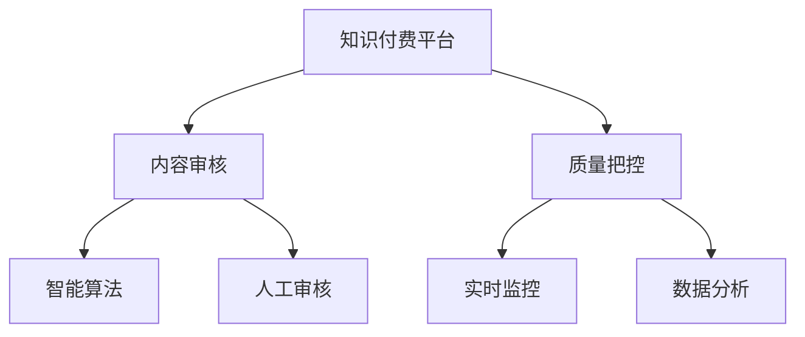

                 

# 知识付费平台要加强内容审核和质量把控

随着互联网的普及和技术的进步，知识付费平台（KPPs）作为内容分发的重要渠道，正快速崛起。这些平台凭借其海量的高质量内容，汇聚了大量的付费用户，为知识生产者和消费者提供了便利。然而，内容审核和质量把控是KPPs发展的基石，如何在快速增长的同时，保证内容的安全性和高质性，成为了KPPs面临的关键问题。本文将从背景介绍、核心概念与联系、核心算法原理、数学模型与公式、项目实践、应用场景、工具资源、总结展望、附录常见问题等几个方面，系统地探讨知识付费平台的内容审核和质量把控技术，以期为KPPs提供科学、有效的解决方案。

## 1. 背景介绍

### 1.1 问题由来

知识付费平台的兴起，极大便利了用户获取知识。通过订阅、单次购买等方式，用户可以随时随地获取丰富的教育、科技、文学等领域的优质内容。然而，KPPs的内容审核和质量把控面临多重挑战：

1. **内容源多样化**：平台内容来源复杂，包括网络搜集、自采、用户上传等多种形式。内容形式也多样化，如文字、图片、视频、音频等。
2. **内容类型广泛**：KPPs内容涵盖学科知识、技能培训、教育资讯等，跨领域内容交叉，复杂度较高。
3. **用户行为难以监控**：KPPs用户数庞大，行为多变，信息泄露、侵犯版权、恶意竞争等问题频发。

这些问题制约了KPPs的健康发展。只有构建有效的审核和质量把控机制，确保内容的准确性、合法性和安全性，才能增强用户信任，吸引更多优质内容入驻，实现平台良性循环。

### 1.2 问题核心关键点

KPPs内容审核和质量把控的核心关键点在于：
- **确保内容合法性**：避免版权侵权、低俗内容、虚假信息等违规内容。
- **保证内容质量**：保证内容的真实性、相关性和实用性，提升用户价值。
- **高效内容管理**：通过智能算法和人工审核相结合的方式，快速处理大量内容，提高审核效率。
- **用户体验优化**：优化内容推荐系统，提高用户体验，促进内容消费。

这些核心关键点，构成了KPPs内容审核和质量把控的基础框架，成为平台发展的关键技术支撑。

## 2. 核心概念与联系

### 2.1 核心概念概述

为更好地理解KPPs内容审核和质量把控的原理和实现，本节将介绍几个核心概念及其之间的关系：

- **知识付费平台（KPPs）**：提供付费内容订阅、购买、学习的在线平台。平台内容多样化，涉及教育、科技、文学等多个领域。
- **内容审核**：对平台上传内容进行合法性、质量等审查，确保内容的合规性和权威性。
- **质量把控**：对平台内容进行质量评估，保证内容的真实性、相关性和实用性。
- **智能算法**：运用机器学习、自然语言处理等技术，实现自动化的内容审核和质量评估。
- **人工审核**：结合机器算法，通过人工手段进一步审核内容的准确性和合规性。
- **实时监控**：通过监控系统实时检测内容发布行为，及时发现违规行为并进行处理。
- **数据分析**：利用大数据技术，对用户行为和内容数据进行分析，提升内容管理和审核的精准度。

这些核心概念之间相互联系，共同构成了KPPs内容审核和质量把控的完整框架。以下是一个Mermaid流程图，展示了这些概念之间的联系：



## 3. 核心算法原理 & 具体操作步骤

### 3.1 算法原理概述

KPPs内容审核和质量把控的主要算法原理基于监督学习与半监督学习相结合的范式。通过大量标注数据训练模型，对平台内容进行自动审核和质量评估。同时，在缺乏标注数据的情况下，利用半监督学习、无监督学习等技术进行内容筛选和初步审核。

具体步骤如下：

1. **数据收集与预处理**：收集平台内容数据，并进行文本清洗、分词、特征提取等预处理工作。
2. **构建训练集**：根据内容类型和内容审核标准，构建标注数据集，用于训练监督学习模型。
3. **模型训练**：利用标注数据集训练监督学习模型，用于内容自动审核。
4. **模型评估**：在测试集上评估模型性能，调整模型参数，优化模型效果。
5. **实时监控与调整**：实时监控模型输出结果，发现异常情况时进行人工复审，调整模型参数。
6. **数据分析与优化**：利用大数据分析用户行为和内容数据，优化审核和质量把控策略。

### 3.2 算法步骤详解

#### 3.2.1 数据收集与预处理

KPPs数据来源多样，包括用户上传内容、第三方合作内容、平台自采内容等。内容类型也多种多样，包括文字、图片、视频、音频等。为了有效处理这些内容，需要进行以下预处理：

1. **文本清洗**：去除无关的标点符号、空格、特殊字符等，保证文本数据格式一致。
2. **分词与特征提取**：将文本数据转换为模型可以处理的形式，如词袋模型、TF-IDF等。
3. **标准化**：对不同来源的内容进行格式和语义标准化，如统一单位、统一时间格式等。

#### 3.2.2 构建训练集

构建标注数据集是内容审核和质量把控的第一步。标注数据集应涵盖各种类型的违规内容和正常内容，用于训练和评估模型。

1. **标注数据获取**：通过爬虫、人工标注等方式获取标注数据。
2. **数据清洗与整理**：去除噪声数据，整理标注数据，确保数据格式一致。
3. **数据划分**：将标注数据集划分为训练集、验证集和测试集。

#### 3.2.3 模型训练

构建的监督学习模型需要训练数据进行学习。具体步骤如下：

1. **选择模型**：根据任务类型选择合适的监督学习模型，如文本分类、情感分析、图像识别等。
2. **设置参数**：确定模型的超参数，如学习率、批大小、迭代轮数等。
3. **训练模型**：使用训练集数据进行模型训练，优化模型参数。

#### 3.2.4 模型评估

模型训练后，需在测试集上进行评估，以确保模型泛化性能良好。评估指标包括准确率、召回率、F1值等。

1. **测试集划分**：将部分未见过的数据划分为测试集，用于模型评估。
2. **评估模型**：使用测试集数据进行模型评估，计算各项指标。
3. **调整模型**：根据评估结果，调整模型参数，优化模型效果。

#### 3.2.5 实时监控与调整

模型部署后，需实时监控模型输出结果，及时发现异常情况并进行人工复审。

1. **部署模型**：将训练好的模型部署到线上环境。
2. **实时监控**：通过监控系统实时检测内容发布行为，发现异常情况。
3. **人工复审**：对异常内容进行人工复审，调整模型参数，优化模型效果。

#### 3.2.6 数据分析与优化

利用大数据分析用户行为和内容数据，提升审核和质量把控策略。

1. **数据收集**：收集用户行为数据和内容数据，包括阅读量、点赞量、评论量等。
2. **数据分析**：利用机器学习、数据挖掘等技术，分析数据特征，发现用户偏好和内容质量规律。
3. **策略优化**：根据数据分析结果，优化内容审核策略，提升审核效果。

### 3.3 算法优缺点

**优点**：
1. **自动化高效**：监督学习模型能够快速处理大量内容，显著提高审核效率。
2. **数据驱动**：基于大量标注数据训练，能够确保内容审核的准确性和权威性。
3. **可解释性**：监督学习模型具有可解释性，可以解释模型的决策过程，便于问题排查。

**缺点**：
1. **数据依赖**：依赖大量标注数据，标注成本高，获取困难。
2. **泛化能力有限**：模型性能受限于训练数据，难以应对极端情况。
3. **误判率高**：低质量标注数据可能导致模型误判，影响审核效果。

### 3.4 算法应用领域

KPPs内容审核和质量把控的算法广泛应用于以下几个领域：

1. **版权审核**：检测内容是否存在版权侵权行为，保护内容版权。
2. **内容过滤**：屏蔽含有违法违规内容，如色情、暴力、仇恨言论等。
3. **内容推荐**：根据用户行为和内容质量，推荐高质量、高相关性的内容。
4. **用户行为监控**：监控用户发布行为，防范信息泄露、侵犯版权等违规行为。
5. **广告审核**：检测广告内容的合规性，防止虚假广告。

## 4. 数学模型和公式 & 详细讲解 & 举例说明

### 4.1 数学模型构建

KPPs内容审核和质量把控的数学模型主要基于文本分类、情感分析、图像识别等任务，可以构建如下几种数学模型：

1. **文本分类模型**：用于检测内容是否属于正常内容或违规内容，如二分类模型、多分类模型等。
2. **情感分析模型**：用于检测内容的情感倾向，如正面、负面、中性等。
3. **图像识别模型**：用于检测图像内容是否合规，如检测色情图片、暴力图片等。

以文本分类模型为例，其数学模型构建如下：

假设内容文本为 $x$，标签为 $y$，模型为 $M_{\theta}$，则文本分类模型的数学模型为：

$$
\hat{y} = M_{\theta}(x)
$$

其中 $\hat{y}$ 表示模型预测的标签，$\theta$ 为模型参数。

### 4.2 公式推导过程

以二分类模型为例，其损失函数为交叉熵损失函数，其数学公式如下：

$$
\ell(M_{\theta}(x), y) = -(y \log M_{\theta}(x) + (1-y) \log (1-M_{\theta}(x)))
$$

其中 $y$ 为真实标签，$M_{\theta}(x)$ 为模型预测概率，$\ell$ 为交叉熵损失函数。

训练模型的目标是最小化损失函数，即：

$$
\theta^* = \mathop{\arg\min}_{\theta} \sum_{i=1}^N \ell(M_{\theta}(x_i), y_i)
$$

其中 $N$ 为训练集样本数。

### 4.3 案例分析与讲解

以图像识别为例，假设有 $K$ 种违规内容，模型需检测每一种违规内容。设 $x$ 为待检测图像，$y$ 为图像内容标签，模型为 $M_{\theta}$，则图像识别模型的数学模型如下：

$$
\hat{y} = \arg\max_k M_{\theta}(x)_k
$$

其中 $k$ 表示违规内容种类，$M_{\theta}(x)_k$ 表示模型预测图像属于第 $k$ 种违规内容的概率。

## 5. 项目实践：代码实例和详细解释说明

### 5.1 开发环境搭建

KPPs内容审核和质量把控的开发环境搭建主要包括服务器配置和环境依赖安装。具体步骤如下：

1. **服务器配置**：选择高性能服务器，安装相关操作系统和数据库，如Linux、MySQL等。
2. **环境依赖安装**：安装Python、TensorFlow、Keras等深度学习框架和相关库，如numpy、pandas等。

### 5.2 源代码详细实现

以图像识别为例，使用TensorFlow实现模型的训练和部署。具体步骤如下：

1. **数据准备**：收集标注数据集，将其划分为训练集、验证集和测试集。
2. **模型构建**：构建卷积神经网络模型，用于图像内容识别。
3. **模型训练**：使用训练集数据进行模型训练，优化模型参数。
4. **模型评估**：在测试集上评估模型性能，调整模型参数。
5. **模型部署**：将训练好的模型部署到线上环境，实时监控模型输出结果。

```python
import tensorflow as tf
from tensorflow import keras

# 构建卷积神经网络模型
model = keras.Sequential([
    keras.layers.Conv2D(32, (3,3), activation='relu', input_shape=(64,64,3)),
    keras.layers.MaxPooling2D((2,2)),
    keras.layers.Conv2D(64, (3,3), activation='relu'),
    keras.layers.MaxPooling2D((2,2)),
    keras.layers.Flatten(),
    keras.layers.Dense(64, activation='relu'),
    keras.layers.Dense(2, activation='softmax')
])

# 编译模型
model.compile(optimizer='adam', loss='categorical_crossentropy', metrics=['accuracy'])

# 训练模型
model.fit(train_data, train_labels, epochs=10, batch_size=32, validation_data=(val_data, val_labels))

# 评估模型
test_loss, test_acc = model.evaluate(test_data, test_labels)
print('Test accuracy:', test_acc)
```

### 5.3 代码解读与分析

上述代码实现了一个简单的卷积神经网络模型，用于图像内容识别。具体步骤如下：

1. **模型构建**：使用Keras框架构建卷积神经网络，包括卷积层、池化层、全连接层等。
2. **模型编译**：指定优化器、损失函数、评估指标等，准备模型训练。
3. **模型训练**：使用训练集数据进行模型训练，优化模型参数。
4. **模型评估**：在测试集上评估模型性能，调整模型参数。
5. **模型部署**：将训练好的模型部署到线上环境，实时监控模型输出结果。

## 6. 实际应用场景

### 6.1 智能广告审核

KPPs内容审核和质量把控技术可以应用于智能广告审核，检测广告内容是否合法合规。

1. **广告数据收集**：收集平台上的广告内容数据，包括文本、图片、视频等。
2. **广告审核模型训练**：训练监督学习模型，检测广告内容是否合法合规。
3. **广告实时监控**：部署广告审核模型到线上环境，实时监控广告内容发布行为。

### 6.2 内容推荐系统

KPPs内容审核和质量把控技术可以应用于内容推荐系统，提高推荐内容的准确性和相关性。

1. **用户行为数据收集**：收集用户阅读、点赞、评论等行为数据。
2. **内容质量评估**：训练监督学习模型，评估内容的质量和相关性。
3. **推荐系统优化**：根据用户行为和内容质量，优化内容推荐算法，提升推荐效果。

### 6.3 版权审核

KPPs内容审核和质量把控技术可以应用于版权审核，检测内容是否存在版权侵权行为。

1. **版权数据收集**：收集版权数据，包括书籍、音乐、视频等。
2. **版权审核模型训练**：训练监督学习模型，检测内容是否存在版权侵权行为。
3. **版权实时监控**：部署版权审核模型到线上环境，实时监控内容发布行为。

## 7. 工具和资源推荐

### 7.1 学习资源推荐

为了帮助开发者掌握KPPs内容审核和质量把控技术，以下是几本优秀的学习资源：

1. **《深度学习与人工智能应用》**：介绍了深度学习的基本概念和应用，涵盖图像识别、自然语言处理等方向。
2. **《机器学习实战》**：涵盖机器学习的基本算法和应用案例，适合初学者入门。
3. **《深度学习入门》**：介绍了深度学习的基本原理和算法，包括卷积神经网络、循环神经网络等。

### 7.2 开发工具推荐

以下是几款优秀的KPPs内容审核和质量把控开发工具：

1. **TensorFlow**：谷歌开源的深度学习框架，支持分布式训练，适合大规模模型训练。
2. **PyTorch**：Facebook开源的深度学习框架，灵活便捷，适合快速迭代研究。
3. **Keras**：Keras是一个高层神经网络API，支持多种深度学习框架，方便模型构建和部署。

### 7.3 相关论文推荐

以下是几篇优秀的KPPs内容审核和质量把控相关论文：

1. **《深度学习与人工智能应用》**：介绍深度学习的基本概念和应用，涵盖图像识别、自然语言处理等方向。
2. **《机器学习实战》**：涵盖机器学习的基本算法和应用案例，适合初学者入门。
3. **《深度学习入门》**：介绍了深度学习的基本原理和算法，包括卷积神经网络、循环神经网络等。

## 8. 总结：未来发展趋势与挑战

### 8.1 研究成果总结

本文对KPPs内容审核和质量把控技术进行了系统性的介绍，主要包括：

1. **背景介绍**：介绍了KPPs内容审核和质量把控的背景和重要性。
2. **核心概念与联系**：详细介绍了KPPs内容审核和质量把控的核心概念及其相互联系。
3. **核心算法原理**：系统介绍了基于监督学习的内容审核和质量把控算法原理。
4. **数学模型与公式**：详细讲解了数学模型构建和公式推导过程。
5. **项目实践**：通过代码实例，详细解释了模型构建和训练过程。
6. **实际应用场景**：介绍了KPPs内容审核和质量把控技术的实际应用场景。
7. **工具和资源推荐**：推荐了相关的学习资源、开发工具和论文。

通过本文的系统梳理，可以看到，KPPs内容审核和质量把控技术具有广阔的应用前景，将成为平台发展的关键技术支撑。

### 8.2 未来发展趋势

KPPs内容审核和质量把控技术未来的发展趋势如下：

1. **深度学习与AI结合**：深度学习与人工智能的进一步结合，将提升内容审核和质量把控的准确性和效率。
2. **多模态内容审核**：结合图像、视频等多模态内容，提高内容审核的全面性。
3. **联邦学习**：利用联邦学习技术，保护用户隐私，提高模型安全性。
4. **实时监控与动态调整**：利用实时监控系统，动态调整模型参数，提升审核效果。
5. **模型解释性增强**：增强模型解释性，便于问题排查和优化。

### 8.3 面临的挑战

KPPs内容审核和质量把控技术在发展过程中，仍面临诸多挑战：

1. **数据质量问题**：缺乏高质量标注数据，影响模型性能。
2. **模型泛化能力不足**：模型难以应对极端情况，泛化能力有限。
3. **计算资源消耗大**：模型训练和推理需要大量计算资源，资源消耗大。
4. **模型安全风险**：模型可能被恶意攻击，导致安全问题。
5. **用户隐私保护**：需保护用户隐私，防止信息泄露。

### 8.4 研究展望

为了克服KPPs内容审核和质量把控技术面临的挑战，未来的研究应重点关注以下几个方面：

1. **数据增强与合成**：利用数据增强和合成技术，提高模型泛化能力。
2. **模型轻量化与优化**：优化模型结构，提高计算效率，降低资源消耗。
3. **联邦学习与隐私保护**：利用联邦学习技术，保护用户隐私，提高模型安全性。
4. **实时监控与动态调整**：利用实时监控系统，动态调整模型参数，提升审核效果。
5. **模型解释性增强**：增强模型解释性，便于问题排查和优化。

## 9. 附录：常见问题与解答

**Q1: 内容审核与质量把控是否会对KPPs运营成本产生影响？**

A: 内容审核与质量把控确实会对KPPs运营成本产生影响。主要表现在以下几个方面：

1. **数据标注成本**：标注数据需要大量人工参与，成本较高。
2. **模型训练成本**：模型训练需要高性能设备和大规模计算资源，成本较高。
3. **人工复审成本**：对于误判内容，需要进行人工复审，人工成本较高。

因此，KPPs应根据自身情况，选择合适的技术方案，平衡成本和效果。

**Q2: 如何确保KPPs内容审核的准确性？**

A: 确保KPPs内容审核的准确性，应从以下几个方面入手：

1. **多层次审核机制**：结合机器算法和人工审核，多层次审核内容。
2. **实时监控与动态调整**：实时监控模型输出结果，及时发现异常情况并进行人工复审。
3. **定期复审与更新**：定期复审模型性能，更新模型参数，保持模型准确性。

**Q3: 如何降低KPPs内容审核的误判率？**

A: 降低KPPs内容审核的误判率，可以从以下几个方面入手：

1. **多模态数据融合**：结合文本、图像、视频等多模态数据，提高内容审核的全面性。
2. **算法优化与改进**：优化算法模型，提高模型准确性。
3. **模型解释性增强**：增强模型解释性，便于问题排查和优化。

**Q4: 如何提高KPPs内容推荐的准确性？**

A: 提高KPPs内容推荐的准确性，可以从以下几个方面入手：

1. **用户行为数据收集**：收集用户行为数据，分析用户偏好和兴趣。
2. **内容质量评估**：训练监督学习模型，评估内容的质量和相关性。
3. **推荐算法优化**：优化推荐算法，提升推荐效果。

**Q5: 如何保护KPPs内容审核中的用户隐私？**

A: 保护KPPs内容审核中的用户隐私，可以从以下几个方面入手：

1. **匿名化处理**：对用户数据进行匿名化处理，保护用户隐私。
2. **联邦学习技术**：利用联邦学习技术，保护用户数据。
3. **数据访问控制**：严格控制数据访问权限，防止数据泄露。

---

作者：禅与计算机程序设计艺术 / Zen and the Art of Computer Programming

