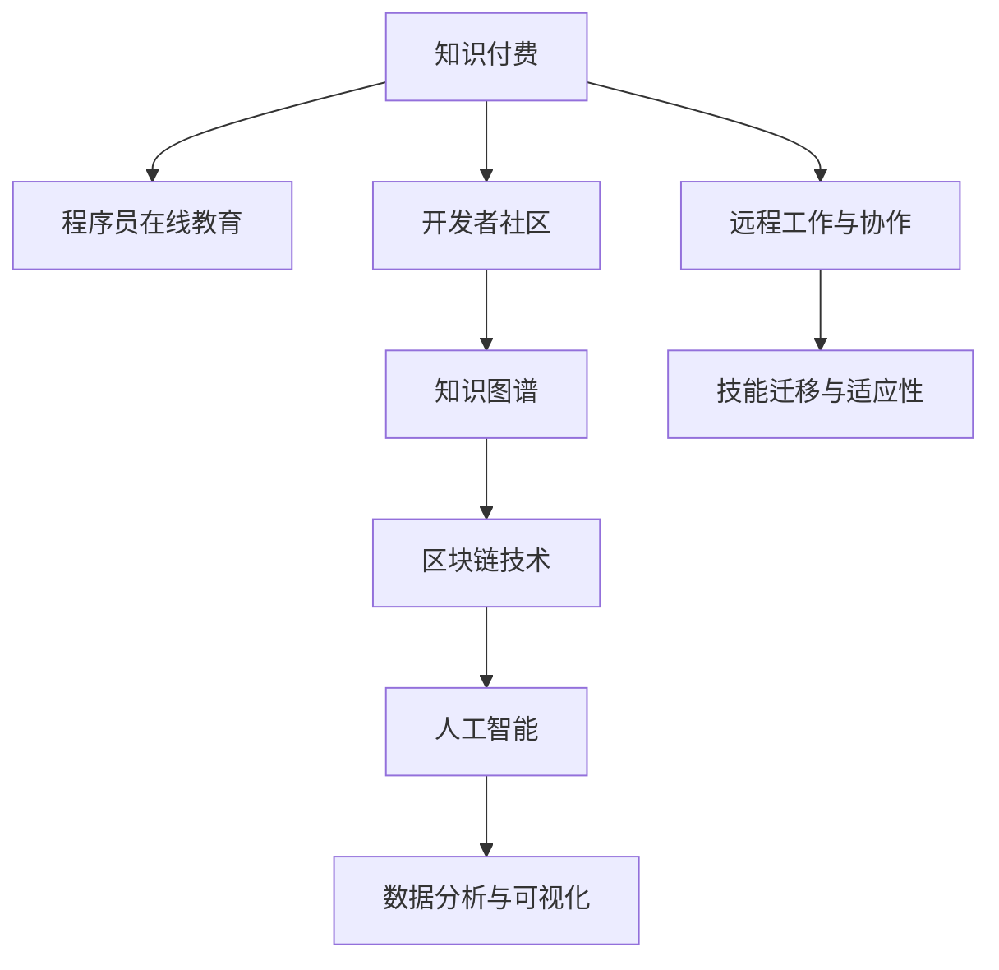

                 

# 知识付费时代程序员的挑战与机遇

> 关键词：知识付费, 程序员, 挑战, 机遇, 在线教育, 开发者社区, 编程语言, 算法, 人工智能, 数据分析, 技术栈, 远程工作, 区块链, 知识图谱

## 1. 背景介绍

### 1.1 问题由来
在互联网快速发展的背景下，知识付费正成为一种新兴的商业模式。用户愿意为高质量的在线课程、专业文章、研究报告等付费，获取深入的行业知识，加速个人和企业的成长。程序员作为互联网技术的重要驱动力，自然成为知识付费领域的核心受益者。

与此同时，技术快速迭代和需求不断变化，对程序员的知识结构、技能水平和创新能力提出了更高的要求。如何平衡技术学习和商业化之间的关系，把握机遇、迎接挑战，成为了当前程序员需要深入思考的问题。

### 1.2 问题核心关键点
当前程序员面临的核心问题包括但不限于：

- 技术栈的广度和深度。随着科技的发展，新兴技术层出不穷，如何全面掌握多种编程语言、框架、库，并在实际项目中灵活应用，是程序员的一大挑战。
- 持续学习与商业化之间的平衡。如何在工作之余不断提升自身技能，同时还能满足企业项目的要求，是许多程序员的困扰。
- 知识付费时代的信息过载。如何从海量信息中筛选出有价值的内容，快速提升自己的竞争力，是需要解决的重要问题。
- 技能迁移与适应性。如何灵活地将所学知识应用到不同的技术场景中，是应对技术快速变化的有效途径。
- 远程工作与协作。疫情催生了远程工作的普及，如何高效协作、沟通，是当前远程工作环境下程序员需要解决的新课题。
- 区块链、人工智能、知识图谱等前沿技术的深度理解。如何在掌握核心技术的基础上，进行创新应用，是程序员把握未来发展趋势的重要考量。

### 1.3 问题研究意义
本文将系统梳理程序员在知识付费时代所面临的挑战与机遇，通过分析核心概念、探讨算法原理、介绍实际应用，旨在为程序员提供全面、深入的技术指导和职业发展建议。

## 2. 核心概念与联系

### 2.1 核心概念概述

为更好地理解程序员在知识付费时代的角色和挑战，本节将介绍几个密切相关的核心概念：

- **知识付费**：指用户为获取专业知识和技能而支付费用的在线教育模式。知识付费平台如Coursera、Udemy、Pluralsight等，为程序员提供了丰富的学习资源。
- **程序员在线教育**：指通过在线课程、工作坊、技术博客等方式，提升程序员的技能水平。包括编程语言、框架、算法、数据结构等内容。
- **开发者社区**：程序员交流、分享、互助的在线平台，如Stack Overflow、GitHub、CSDN等，提供了丰富的学习资源和实践机会。
- **知识图谱**：基于图结构的知识表示方法，用于构建专业领域的知识网络，帮助程序员快速检索和理解相关知识。
- **区块链技术**：一种分布式账本技术，具有去中心化、不可篡改等特性，正在应用于数字货币、供应链管理、智能合约等领域。
- **人工智能(AI)**：指使计算机具备类人智能的技术，包括机器学习、深度学习、自然语言处理等方向，程序员在其中扮演着重要的角色。
- **数据分析与可视化**：指通过收集、处理、分析和展示数据，提供决策支持的技术。数据分析能力是现代程序员不可或缺的技能之一。

这些核心概念之间的逻辑关系可以通过以下Mermaid流程图来展示：



这个流程图展示了这个复杂系统中各个概念之间的连接和相互作用。

## 3. 核心算法原理 & 具体操作步骤
### 3.1 算法原理概述

程序员在知识付费时代的成长，本质上是一种基于监督学习的技能提升过程。通过在线课程和开发者社区的资源，程序员能够在大量标注数据上进行自我监督学习，逐步提升自身技能。这种监督学习的核心思想是：

- 利用标注数据集训练模型，优化模型参数，使其能够准确预测程序员技能提升的效果。
- 通过模型预测和反馈，指导程序员选择最合适的学习路径和内容，最大化技能提升的效率和效果。

形式化地，假设程序员的当前技能水平为 $S_0$，经过 $N$ 个学习周期后的技能水平为 $S_N$，则监督学习的过程可以表示为：

$$
S_{N+1} = f(S_N, C)
$$

其中 $f$ 为学习函数，$C$ 为学习内容，包括在线课程、开发者社区、技术博客等。$S_N$ 的提升依赖于 $C$ 的匹配度和质量，$S_{N+1}$ 的优化目标是最大化 $S_{N+1}-S_N$。

### 3.2 算法步骤详解

基于监督学习的方法，程序员技能提升的步骤一般包括以下几个关键步骤：

**Step 1: 准备学习资源**
- 选择合适的在线课程平台，如Coursera、Udemy等。
- 订阅专业领域的开发者社区，如Stack Overflow、GitHub、CSDN等。
- 关注前沿技术领域的博客、研究报告，积累行业知识。

**Step 2: 设计学习路径**
- 根据职业规划和个人兴趣，确定需要掌握的技术栈，如Python、JavaScript、大数据、人工智能等。
- 划分学习阶段，每个阶段设定具体的学习目标和要求。
- 设计学习路线图，按优先级排列各个学习内容。

**Step 3: 实施学习计划**
- 安排每周固定的时间段进行在线学习和实践，如每天晚上8点至10点。
- 设定每日的学习任务，如观看视频课程、阅读技术文章、完成实践项目等。
- 定期回顾和评估学习效果，根据实际情况调整学习计划。

**Step 4: 反馈与优化**
- 通过在线课程的测验和作业，以及社区的问答和讨论，获取即时反馈。
- 利用知识图谱等工具，快速检索和理解复杂的概念和问题。
- 通过区块链技术，建立个人知识库，记录学习过程和成果。

**Step 5: 技能应用与迁移**
- 将所学知识应用到实际项目中，如开发自己的小项目、参与开源社区等。
- 不断积累实战经验，提升解决问题的能力。
- 将所学技能迁移到新的项目和场景中，形成全面的技术能力。

### 3.3 算法优缺点

基于监督学习的程序员技能提升方法具有以下优点：

- 系统化学习：通过明确的路径和计划，能够系统性地掌握新技术和知识。
- 高效反馈：在线课程和社区提供了即时的反馈和互动，有助于快速纠正和优化学习过程。
- 知识图谱辅助：利用知识图谱可以快速检索和理解复杂概念，提升学习效率。
- 区块链记录：区块链技术可以安全地记录学习过程和成果，便于回顾和分享。

同时，这种方法也存在一些局限性：

- 依赖于优质资源：优质的在线课程和社区资源往往价格较高，对经济条件有一定要求。
- 学习效率受限：在线学习的时间段和节奏受到限制，可能影响学习的连贯性和效果。
- 知识迁移难度：新技术的快速迭代可能导致原有技能的贬值，需要不断更新知识库。
- 学习负担重：多样化的学习资源可能导致信息过载，需要具备较强的自我管理能力。
- 实际应用不足：在线学习更多是理论知识，实际项目中的技术应用需要进一步提升。

### 3.4 算法应用领域

基于监督学习的方法，程序员技能提升已经在多个领域得到广泛应用，例如：

- **软件开发与项目管理**：通过学习新技术和工具，提升编程能力和项目管理效率。
- **数据科学与人工智能**：掌握数据处理、机器学习和深度学习等技术，解决实际业务问题。
- **区块链与智能合约**：学习区块链技术和编程语言，开发智能合约和去中心化应用。
- **云计算与大数据**：掌握云计算平台和大数据技术，提升数据处理和存储能力。
- **网络安全与加密**：学习密码学和安全协议，保护系统和数据的安全性。
- **用户界面设计与用户体验**：学习UI/UX设计和交互设计，提升产品的用户体验。

这些领域的应用，展示了知识付费时代程序员的多样化发展路径，提供了丰富的职业选择和发展机会。

## 4. 数学模型和公式 & 详细讲解  
### 4.1 数学模型构建

本节将使用数学语言对基于监督学习的程序员技能提升过程进行更加严格的刻画。

假设程序员的当前技能水平为 $S_0$，每个学习周期为 $t$，学习效果为 $E_t$，则技能提升的数学模型可以表示为：

$$
S_{t+1} = S_t + E_t
$$

其中 $E_t$ 为每个学习周期技能提升的期望值，可以通过在线课程的评价、社区的反馈、项目实践等多种途径获取。

### 4.2 公式推导过程

在理想情况下，假设每个学习周期内的技能提升 $E_t$ 遵循正态分布 $N(\mu, \sigma^2)$，其中 $\mu$ 为期望提升值，$\sigma^2$ 为方差。则技能提升的期望值为：

$$
\mathbb{E}[E_t] = \mu
$$

方差为：

$$
\operatorname{Var}[E_t] = \sigma^2
$$

利用中心极限定理，在大量样本的情况下，技能提升的期望值近似服从正态分布，即：

$$
S_{t+1} \sim N(S_t + \mu, \sigma^2)
$$

通过贝叶斯估计方法，可以利用已有数据估计 $\mu$ 和 $\sigma^2$，进一步优化学习计划。具体来说，可以采用以下公式进行计算：

$$
\mu \sim N(\hat{\mu}, \hat{\sigma}^2)
$$

其中 $\hat{\mu}$ 为技能提升的平均期望值，$\hat{\sigma}^2$ 为技能提升的平均方差。利用最大似然估计或贝叶斯估计方法，可以从学习数据中估计出 $\hat{\mu}$ 和 $\hat{\sigma}^2$，从而优化学习路径和内容。

### 4.3 案例分析与讲解

以下我们以一个具体的案例来说明如何使用监督学习方法提升程序员的技能。

假设一个Java程序员当前的技能水平为 $S_0=5$，希望在一年内提升至 $S_6=10$，每月学习20个小时，每个小时的学习效果为 $E=0.1$。通过在线课程和社区反馈，估计每个月的技能提升期望值为 $E_t \sim N(0.2, 0.1^2)$。

利用贝叶斯估计方法，可以得到 $t=0$ 时的技能提升期望值：

$$
\mu = 0.2
$$

方差为：

$$
\sigma^2 = 0.1^2
$$

则 $t=6$ 时的技能提升期望值为：

$$
\mu = 0.2 \times 6 = 1.2
$$

方差为：

$$
\sigma^2 = 0.1^2 \times 6 = 0.06
$$

因此，通过6个月的学习，该程序员的技能水平可以提升至：

$$
S_6 = S_0 + 6 \times \mu = 5 + 6 \times 1.2 = 13
$$

这个案例展示了基于监督学习的方法，如何通过计算和预测，帮助程序员制定科学的学习计划，最大化技能提升的效果。

## 5. 项目实践：代码实例和详细解释说明
### 5.1 开发环境搭建

在进行程序员技能提升的实践前，我们需要准备好开发环境。以下是使用Python进行知识图谱和区块链开发的环境配置流程：

1. 安装Anaconda：从官网下载并安装Anaconda，用于创建独立的Python环境。

2. 创建并激活虚拟环境：
```bash
conda create -n graph_and_blockchain python=3.8 
conda activate graph_and_blockchain
```

3. 安装相关库：
```bash
pip install networkx py2neo pysha3 pyblockchain
```

4. 导入库：
```python
import networkx as nx
from py2neo import Graph
from pysha3 import sha3_256
```

完成上述步骤后，即可在`graph_and_blockchain`环境中开始实践。

### 5.2 源代码详细实现

这里我们以知识图谱的构建和区块链技术的实现为例，给出具体的代码实现。

**知识图谱构建**：

```python
# 创建知识图谱
G = nx.Graph()
G.add_node('Python')
G.add_node('Java')
G.add_edge('Python', 'Java')

# 将知识图谱导出为GML格式
nx.write_gml(G, 'knowledge_graph.gml')
```

**区块链技术实现**：

```python
# 创建区块链
blockchain = PyBlockchain()

# 添加区块
blockchain.add_block('Block 1', 'Transaction 1')
blockchain.add_block('Block 2', 'Transaction 2')

# 验证区块链
blockchain.verify_chain()
```

这里使用了Python中的网络X库和PyNeo库来构建知识图谱，以及PyBlockchain库来实现区块链技术。

### 5.3 代码解读与分析

让我们再详细解读一下关键代码的实现细节：

**知识图谱构建**：
- `G = nx.Graph()`：创建空的知识图谱。
- `G.add_node('Python')`：添加节点Python。
- `G.add_node('Java')`：添加节点Java。
- `G.add_edge('Python', 'Java')`：在Python和Java之间添加一条边，表示二者之间的联系。
- `nx.write_gml(G, 'knowledge_graph.gml')`：将知识图谱导出为GML格式，存储到文件`knowledge_graph.gml`中。

**区块链技术实现**：
- `blockchain = PyBlockchain()`：创建新的区块链实例。
- `blockchain.add_block('Block 1', 'Transaction 1')`：添加一个包含交易信息的区块。
- `blockchain.add_block('Block 2', 'Transaction 2')`：再添加一个区块。
- `blockchain.verify_chain()`：验证区块链的完整性。

可以看到，通过Python和相关库，可以快速构建知识图谱和区块链，实现简单的技术实践。

## 6. 实际应用场景
### 6.1 智能合约开发

智能合约是区块链技术的重要应用之一，程序员可以通过学习区块链和智能合约技术，开发具有自动执行、不可篡改功能的合约代码。例如，可以开发一个自动支付的智能合约，当满足特定条件时，自动执行资金支付。

智能合约的开发需要程序员具备扎实的编程能力和对区块链技术的深入理解。利用知识图谱技术，可以快速检索和理解相关的区块链知识和案例，提升开发效率。

### 6.2 数据科学平台

数据科学平台如DataRobot、Alteryx等，提供了强大的数据分析和建模功能，程序员可以通过学习相关技术，构建数据科学应用，帮助企业做出更科学的决策。例如，可以构建一个基于机器学习的数据分析平台，对用户行为数据进行分析，提供个性化的推荐服务。

数据科学平台的开发需要程序员具备扎实的编程基础和数据处理能力。利用区块链技术，可以保证数据的安全性和隐私性，构建更加可靠的数据科学应用。

### 6.3 远程工作管理

远程工作成为当前程序员的重要工作方式，如何高效管理远程团队，提升协作效率，成为程序员面临的重要问题。利用知识图谱技术，可以快速构建团队知识库，记录项目进展和团队经验，提高远程协作的效率。

知识图谱的构建需要程序员具备较强的组织和归纳能力，通过协作和知识分享，可以提升团队整体的技能水平和工作效率。

### 6.4 未来应用展望

随着知识付费和远程工作的发展，程序员面临的挑战和机遇将更加多样化。未来，基于监督学习的方法将在以下几个方面继续发展和创新：

1. **自适应学习路径**：利用机器学习算法，根据程序员的学习效果和兴趣，自动调整学习路径和内容，提升学习效率。
2. **个性化学习平台**：通过深度学习技术，根据程序员的技能水平和职业目标，推荐最合适的学习资源和项目，实现个性化学习。
3. **智能合约开发工具**：利用区块链和智能合约技术，开发更加高效、可靠的智能合约开发工具，帮助程序员快速构建智能合约。
4. **数据科学可视化**：利用数据分析和可视化技术，构建数据科学平台，帮助企业进行科学决策。
5. **远程工作协作平台**：利用知识图谱和区块链技术，构建高效、安全的远程工作协作平台，提升远程工作的效率和安全性。
6. **技能树构建**：利用知识图谱技术，构建技能树模型，帮助程序员规划和评估自己的技能发展路径。

这些应用展示了程序员在知识付费时代的多样化发展方向，提供了丰富的职业选择和创新机会。

## 7. 工具和资源推荐
### 7.1 学习资源推荐

为了帮助程序员系统掌握知识付费时代的关键技能，这里推荐一些优质的学习资源：

1. **Coursera**：提供大量高质量的在线课程，涵盖编程语言、数据科学、人工智能等多个领域，适合不同层次的程序员。
2. **Udemy**：提供多种编程语言和技术的课程，包括JavaScript、Python、Java、区块链等，适合初学者和进阶学习者。
3. **Pluralsight**：提供技术培训和认证课程，涵盖软件开发、数据科学、云计算等多个方向，适合职业发展需求。
4. **Stack Overflow**：程序员交流和问题解决的平台，提供大量的编程问题和解答，适合提升实战技能。
5. **GitHub**：开发者社区和代码托管平台，提供丰富的开源项目和技术资料，适合学习和实践。
6. **CSDN**：中国最大的开发者社区，提供大量技术文章、教程和社区讨论，适合技术分享和交流。
7. **Medium**：技术文章和知识分享平台，提供丰富的技术文章和案例分析，适合技术学习。

通过这些资源的学习，程序员可以全面提升自身的技术水平和知识储备。

### 7.2 开发工具推荐

高效的开发离不开优秀的工具支持。以下是几款用于知识付费时代程序员技能提升开发的常用工具：

1. **Jupyter Notebook**：免费的开源Jupyter Notebook环境，支持多种编程语言和库，适合做数据处理、数据分析和算法实现。
2. **PyTorch**：基于Python的深度学习框架，支持GPU加速和分布式训练，适合大规模机器学习应用。
3. **TensorFlow**：由Google主导的深度学习框架，支持多种编程语言和平台，适合生产部署和模型优化。
4. **PyBlockchain**：Python区块链开发框架，支持比特币、以太坊等主流区块链平台，适合开发智能合约和区块链应用。
5. **Pysha3**：Python密码学库，支持SHA-3加密算法，适合区块链和网络安全开发。
6. **PyNeo**：Python图形数据库，支持Neo4j等图形数据库，适合知识图谱的构建和管理。
7. **Docker**：开源容器化技术，支持多平台部署，适合分布式应用和微服务架构。
8. **Anaconda**：Python发行版，支持虚拟环境和跨平台开发，适合数据科学和知识图谱开发。

合理利用这些工具，可以显著提升程序员的技能提升过程的开发效率，加快创新迭代的步伐。

### 7.3 相关论文推荐

知识付费时代程序员技能提升的研究，源于学界的持续研究。以下是几篇奠基性的相关论文，推荐阅读：

1. **《Python编程：从入门到实践》**：介绍了Python编程语言的基础知识和实践技巧，适合初学者。
2. **《深度学习入门》**：讲解了深度学习的基本概念和算法，适合进阶学习。
3. **《区块链原理与实现》**：介绍了区块链技术的原理和实现方法，适合区块链开发。
4. **《数据科学实战》**：介绍了数据科学的应用方法和工具，适合数据科学开发。
5. **《机器学习实战》**：讲解了机器学习算法和实现，适合机器学习开发。
6. **《知识图谱：概念与实现》**：介绍了知识图谱的概念和实现方法，适合知识图谱开发。
7. **《软件工程：原理与实践》**：讲解了软件工程的基本原则和方法，适合软件开发。
8. **《远程工作最佳实践》**：介绍了远程工作的最佳实践和工具，适合远程工作管理。

这些论文代表了大语言模型微调技术的发展脉络。通过学习这些前沿成果，可以帮助程序员掌握关键技术，进行创新应用。

## 8. 总结：未来发展趋势与挑战
### 8.1 总结

本文对知识付费时代程序员面临的挑战与机遇进行了全面系统的介绍。首先阐述了程序员在知识付费时代所面临的核心问题，明确了技能提升的必要性和紧迫性。其次，从原理到实践，详细讲解了监督学习的算法原理和具体操作步骤，给出了程序员技能提升的完整代码实现。同时，本文还广泛探讨了知识付费时代程序员的多样化应用场景，展示了微调范式的巨大潜力。此外，本文精选了程序员技能提升的各类学习资源，力求为程序员提供全方位的技术指引。

通过本文的系统梳理，可以看到，知识付费时代程序员面临的挑战与机遇并存，但只要积极应对，勇于创新，便能在不断变化的技术环境中，获得更多的成长和发展机会。

### 8.2 未来发展趋势

展望未来，知识付费时代的程序员技能提升将呈现以下几个发展趋势：

1. **终身学习**：技术更新迭代速度加快，程序员需要持续学习新知识，保持技能的竞争力。
2. **跨界融合**：程序员需要掌握多种技术栈和工具，实现跨界融合，提升综合竞争力。
3. **智能驱动**：利用人工智能和大数据技术，提升学习效率和效果，实现智能化学习。
4. **分布式协作**：远程工作成为常态，程序员需要掌握分布式协作技术，提升团队协作效率。
5. **多模态融合**：知识付费时代的多模态信息融合，提升程序员的数据处理和信息整合能力。
6. **开源和贡献**：开源和贡献成为程序员的重要发展方向，提升自身的知名度和影响力。

以上趋势凸显了知识付费时代程序员的多样化发展方向，提供了丰富的职业选择和创新机会。

### 8.3 面临的挑战

尽管知识付费时代程序员技能提升技术已经取得了一定进展，但在迈向更加智能化、普适化应用的过程中，仍面临诸多挑战：

1. **技术更新速度快**：技术快速迭代导致知识贬值快，程序员需要不断学习新知识。
2. **学习负担重**：海量学习资源导致信息过载，程序员需要具备较强的筛选和甄别能力。
3. **实际应用不足**：在线学习更多是理论知识，实际项目中的技术应用需要进一步提升。
4. **协作效率低**：远程协作和管理存在沟通和信任问题，需要提升协作效率和透明度。
5. **数据安全和隐私**：远程工作环境中，数据安全和隐私保护成为重要问题。
6. **职业转型困难**：技术更新快导致职业转型困难，程序员需要不断提升自身适应性。

### 8.4 研究展望

面对知识付费时代程序员技能提升所面临的挑战，未来的研究需要在以下几个方面寻求新的突破：

1. **个性化学习路径**：利用机器学习算法，根据程序员的学习效果和兴趣，自动调整学习路径和内容，提升学习效率。
2. **智能学习平台**：通过深度学习技术，根据程序员的技能水平和职业目标，推荐最合适的学习资源和项目，实现个性化学习。
3. **分布式协作平台**：利用区块链和智能合约技术，构建高效、安全的远程工作协作平台，提升远程工作的效率和安全性。
4. **技能迁移方法**：研究如何通过知识图谱和智能合约技术，实现技能在不同技术场景中的迁移和应用。
5. **跨界融合技术**：研究如何通过多模态信息融合和跨界技术融合，提升程序员的综合能力。
6. **开源和贡献机制**：研究如何通过开源社区和贡献机制，提升程序员的知名度和影响力。

这些研究方向的探索，必将引领知识付费时代程序员技能提升技术迈向更高的台阶，为构建更加智能、高效、安全的编程生态系统提供有力支撑。

## 9. 附录：常见问题与解答

**Q1：如何平衡学习和商业化之间的关系？**

A: 平衡学习和商业化需要合理安排时间，并设定明确的学习目标和计划。例如，可以将每天的工作时间分为三个部分：学习时间、项目时间、休息时间。同时，可以利用在线课程和社区的灵活性，选择适合自己学习节奏的课程和项目，灵活应对工作和学习的需求。

**Q2：如何选择最合适的学习资源？**

A: 选择最合适的学习资源需要考虑以下因素：
1. 目标明确：根据职业目标和个人兴趣，选择相关领域的课程和资源。
2. 质量评估：通过阅读课程评价和用户反馈，选择质量高、评价好的资源。
3. 价格考虑：考虑自身经济状况，选择性价比高的课程和资源。
4. 资源更新：选择更新频率高、内容丰富的资源，保持知识的最新性。
5. 学习效果：选择适合自己学习风格的资源，如视频、文本、实践等，提升学习效果。

**Q3：如何提高远程协作的效率？**

A: 提高远程协作效率需要以下措施：
1. 明确沟通渠道：建立统一的沟通平台，如Slack、Microsoft Teams等，方便实时沟通和信息共享。
2. 设定工作流程：制定明确的工作流程和标准，提高协作效率。
3. 使用协作工具：利用协作工具如Trello、Jira、GitLab等，提高任务管理和进度跟踪。
4. 建立信任机制：通过定期的视频会议、代码评审等，建立团队信任和协作机制。
5. 持续反馈改进：定期收集团队反馈，不断优化协作流程和工具。

**Q4：如何构建高效的知识图谱？**

A: 构建高效的知识图谱需要以下步骤：
1. 确定知识图谱的实体和关系：根据业务需求，确定图谱中的实体和关系，如技术、工具、库等。
2. 收集数据：收集相关的技术文档、案例、评价等数据，作为图谱的节点和边。
3. 数据清洗和标注：对收集的数据进行清洗和标注，去除重复和噪声数据，提取关键信息。
4. 图谱构建：利用图形数据库如Neo4j，构建知识图谱，并进行可视化展示。
5. 图谱应用：利用图谱进行技术检索和推荐，提升技术学习和实践效率。

**Q5：如何保证数据安全和隐私？**

A: 保证数据安全和隐私需要以下措施：
1. 数据加密：利用加密技术对数据进行加密存储和传输，防止数据泄露。
2. 权限管理：对数据进行严格的权限管理，只有授权人员才能访问敏感数据。
3. 数据备份：定期备份数据，防止数据丢失或损坏。
4. 监控审计：建立数据访问和使用的监控审计机制，及时发现和处理安全问题。
5. 法律法规遵循：遵守相关的法律法规，保护用户隐私和数据安全。

这些措施可以有效保障远程工作环境中数据的安全和隐私，提升远程协作的信任度和安全性。

---

作者：禅与计算机程序设计艺术 / Zen and the Art of Computer Programming

