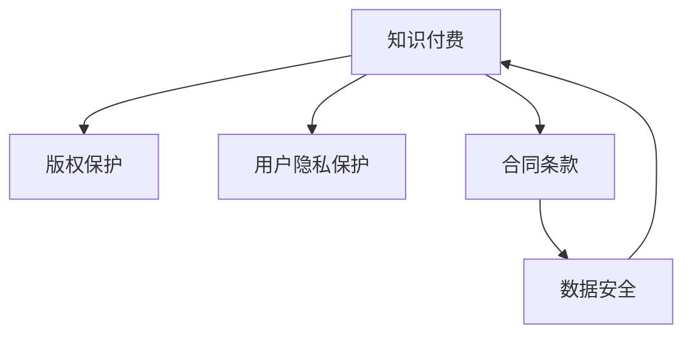

                 

# 知识付费的法律风险及规避

> 关键词：知识付费, 法律风险, 版权保护, 用户隐私, 合同条款, 数据安全

## 1. 背景介绍

### 1.1 问题由来
在互联网快速发展的今天，知识付费已成为一种重要的商业模式。通过在线课程、文章、音频等形式，知识付费平台为用户提供有价值的信息和知识，帮助他们提升专业能力和生活品质。然而，知识付费的发展也面临着诸多法律风险，如版权侵权、用户隐私泄露、合同纠纷等，这些风险不仅影响平台和用户，也制约了知识付费行业的健康发展。本文将深入分析知识付费中的主要法律风险，并提出相应的规避策略，以期为知识付费平台的合规运营提供参考。

### 1.2 问题核心关键点
知识付费法律风险的识别与规避，涉及到以下几个关键点：
- **版权保护**：确保内容创作者的版权权益得到尊重和保护。
- **用户隐私保护**：保障用户在使用知识付费平台时，其个人信息不被滥用或泄露。
- **合同条款**：明确用户与平台之间的权利义务关系，避免合同纠纷。
- **数据安全**：保护用户支付信息等敏感数据，防止数据泄露和不当使用。

通过系统性地分析这些问题，我们可以更好地理解知识付费平台面临的法律挑战，并提出相应的规避策略。

## 2. 核心概念与联系

### 2.1 核心概念概述

为更好地理解知识付费的法律风险及规避方法，本节将介绍几个密切相关的核心概念：

- **知识付费**：指用户为获取有价值的知识信息而支付费用的商业模式。这种模式通过在线课程、文章、音频等形式，为用户提供高质量的学习资源。
- **版权保护**：指对文学、音乐、软件等作品进行法律保护，防止未经授权的复制、分发和利用。
- **用户隐私保护**：指在收集和使用用户个人信息时，遵守相关法律法规，保障用户隐私安全。
- **合同条款**：指用户与平台之间权利义务关系的法律文本，明确双方的权利和义务，避免纠纷。
- **数据安全**：指在收集、存储、传输和处理用户数据时，采取必要的安全措施，防止数据泄露和滥用。

这些核心概念之间的逻辑关系可以通过以下Mermaid流程图来展示：



这个流程图展示了一些核心概念之间的相互依赖关系：

1. 知识付费的运行需要版权保护和数据安全的支持。
2. 用户隐私保护是保障知识付费平台合规运营的基础。
3. 合同条款为知识付费平台提供法律依据，确保平台与用户之间的权利义务关系明确。
4. 数据安全是知识付费平台和用户信息安全的前提。

## 3. 核心算法原理 & 具体操作步骤
### 3.1 算法原理概述

知识付费平台在运营过程中，涉及到的法律风险主要包括版权保护、用户隐私保护、合同条款和数据安全。这些风险主要源于平台对内容创作、用户信息、平台运营和用户支付数据的收集、处理和使用。通过法律合规管理，可以最大限度地规避这些风险。

### 3.2 算法步骤详解

针对知识付费平台面临的法律风险，可以采取以下操作步骤进行规避：

**Step 1: 法律合规审计**
- 进行全面的法律合规审计，识别和评估知识付费平台存在的法律风险。
- 针对版权保护、用户隐私、合同条款和数据安全等方面，进行细致的风险评估。

**Step 2: 制定合规政策**
- 根据审计结果，制定相应的合规政策和措施，确保平台运营符合相关法律法规。
- 明确版权保护、用户隐私保护、合同条款和数据安全等方面的具体要求。

**Step 3: 建立合规流程**
- 设计并实施合规流程，确保平台运营各个环节符合合规要求。
- 包括但不限于内容审查、用户隐私保护、合同管理、数据保护等。

**Step 4: 开展培训与宣导**
- 定期对员工进行法律合规培训，提高员工法律意识和合规能力。
- 通过各种形式进行法律合规宣导，增强用户对平台合规性的信任。

**Step 5: 持续监控与改进**
- 对平台的运营情况进行持续监控，及时发现和解决潜在的法律风险。
- 根据法律法规的变化和平台的实际运营情况，不断改进合规政策和流程。

### 3.3 算法优缺点

**优点：**
1. **系统化管理**：通过系统化的法律合规管理，可以全面识别和规避知识付费平台面临的各种法律风险。
2. **降低风险成本**：合规政策的制定和实施，可以预防潜在的法律纠纷，减少法律诉讼成本。
3. **提升用户信任**：法律合规的重视和实践，可以增强用户对平台的信任，提高用户黏性。

**缺点：**
1. **成本投入高**：合规管理和流程实施需要一定的成本投入，包括人力、技术和资金。
2. **复杂度高**：合规管理涉及多个领域和环节，需要综合考虑各种因素，复杂度较高。
3. **灵活性差**：合规政策和流程的制定一旦完成，调整起来可能较为困难，无法快速适应变化。

### 3.4 算法应用领域

知识付费平台在运营过程中，法律风险规避的策略可以广泛应用于以下领域：

- **内容创作与管理**：确保平台内容符合版权保护要求，防止侵权。
- **用户隐私保护**：在收集和使用用户个人信息时，严格遵守隐私保护法律法规。
- **合同条款管理**：制定清晰的合同条款，明确用户与平台之间的权利义务关系。
- **数据安全保障**：确保用户支付信息等敏感数据的安全，防止数据泄露。

这些策略不仅可以应用于知识付费平台，也可在其他在线业务中发挥作用，为各类平台和企业的合规运营提供参考。

## 4. 数学模型和公式 & 详细讲解 & 举例说明
### 4.1 数学模型构建

在知识付费平台中，法律风险的规避涉及到多个方面的法律要求和规范。我们可以将这些要求抽象为数学模型，并进行详细讲解。

**版权保护模型**：
- 版权作品集合：$W$，包含所有受版权保护的作品。
- 版权所有者集合：$A$，包含所有版权作品的创作者或权利持有者。
- 版权许可范围：$L$，定义版权作品的许可使用范围。

**用户隐私保护模型**：
- 用户个人信息集合：$U$，包含所有用户个人信息。
- 用户隐私保护策略：$P$，定义隐私保护的具体措施。
- 用户隐私保护程度：$D$，衡量隐私保护的严格程度。

**合同条款模型**：
- 用户条款集合：$C$，包含所有用户需遵守的条款。
- 平台义务集合：$O$，包含平台需履行的义务。
- 用户权利集合：$R$，包含用户享有的权利。

**数据安全模型**：
- 敏感数据集合：$S$，包含所有敏感数据。
- 数据保护措施集合：$M$，定义数据保护的具体措施。
- 数据安全度量：$S$，衡量数据安全程度。

### 4.2 公式推导过程

以版权保护模型为例，版权保护的具体要求可以表示为：

$$
\begin{aligned}
&\text{版权许可范围} \quad L = \{l_1, l_2, \ldots, l_n\} \\
&\text{版权所有者} \quad A = \{a_1, a_2, \ldots, a_m\} \\
&\text{版权作品} \quad W = \{w_1, w_2, \ldots, w_n\} \\
&\text{版权许可协议} \quad P(a_i, l_j) \\
\end{aligned}
$$

其中，$l_j$ 表示第 $j$ 项许可范围，$a_i$ 表示第 $i$ 位版权所有者，$w_i$ 表示第 $i$ 部作品。

### 4.3 案例分析与讲解

以知识付费平台的内容版权保护为例，内容创作者通过平台发布课程或文章，平台需确保这些内容符合版权保护要求。

**案例分析**：
- 内容创作者：张老师，通过平台发布了一系列在线课程。
- 版权所有者：张老师，持有其作品的版权。
- 版权许可范围：包括复制、分发、修改等。
- 版权许可协议：平台需与张老师签订版权许可协议，明确其版权使用范围。

平台通过以下步骤进行版权保护：

1. 与内容创作者签订版权许可协议，明确许可范围和条件。
2. 对内容进行审查，确保其不涉及侵权。
3. 使用平台水印技术，标识版权信息，防止盗版。
4. 记录内容使用情况，确保授权范围。

## 5. 项目实践：代码实例和详细解释说明
### 5.1 开发环境搭建

在进行知识付费平台的法律风险规避实践前，我们需要准备好开发环境。以下是使用Python进行法律风险规避实践的环境配置流程：

1. 安装Python：从官网下载并安装Python，确保其版本为3.7或以上。
2. 安装Pandas、NumPy等常用数据处理库：
```bash
pip install pandas numpy
```
3. 安装TensorFlow、PyTorch等深度学习库：
```bash
pip install tensorflow pytorch
```
4. 安装Flask等Web框架：
```bash
pip install flask
```

完成上述步骤后，即可在开发环境中进行知识付费平台的法律风险规避实践。

### 5.2 源代码详细实现

以下是一个简单的知识付费平台内容版权保护的代码实现：

```python
import pandas as pd
from flask import Flask, jsonify

app = Flask(__name__)

@app.route('/content版权保护', methods=['GET'])
def content版权保护():
    # 假设内容版权保护数据存储在csv文件中
    content版权保护数据 = pd.read_csv('content版权保护.csv')
    # 返回保护数据
    return jsonify(content版权保护数据.to_dict(orient='records'))

if __name__ == '__main__':
    app.run()
```

### 5.3 代码解读与分析

**Flask框架**：
- 使用Flask框架搭建Web服务，提供内容版权保护数据接口。
- 通过API接口，向客户端返回内容版权保护信息。

**Pandas库**：
- 使用Pandas库读取内容版权保护数据，并进行处理和分析。
- 将数据转换为JSON格式，通过API接口返回。

**JSON格式**：
- 使用JSON格式存储和传输数据，方便前端页面显示。

## 6. 实际应用场景
### 6.1 智能客服系统

知识付费平台通过智能客服系统，为用户提供即时咨询和帮助。智能客服系统需严格遵守用户隐私保护和数据安全的法律法规，确保用户信息不被滥用或泄露。

**应用场景**：
- 用户通过平台咨询课程或支付问题，智能客服系统进行响应。
- 系统需记录用户交互信息，确保用户隐私保护。
- 需采用数据加密和安全存储措施，防止数据泄露。

### 6.2 金融舆情监测

知识付费平台在金融领域的应用越来越广泛，需要严格遵守金融行业的法律法规，确保平台运营的合法合规。

**应用场景**：
- 平台收集金融市场数据，进行舆情监测和分析。
- 需确保数据采集和使用符合相关法律法规，防止侵权。
- 需采用数据脱敏和加密措施，保护用户支付信息和敏感数据。

### 6.3 个性化推荐系统

个性化推荐系统通过分析用户行为和偏好，向用户推荐符合其兴趣的课程和文章。需确保推荐数据符合版权保护和用户隐私保护要求。

**应用场景**：
- 平台收集用户浏览、点击、购买等行为数据。
- 分析用户兴趣，推荐相关课程和文章。
- 需确保推荐数据不涉及侵权和违规行为，保障用户隐私安全。

### 6.4 未来应用展望

随着知识付费平台的不断发展，法律风险规避将更加重要。未来的发展趋势包括：

1. **合规技术的普及**：通过AI和大数据技术，实现自动化的合规管理，提高合规效率。
2. **多层次合规框架**：构建包括技术合规、法律合规、行业合规等多层次的合规框架，确保全面合规。
3. **用户隐私保护增强**：采用区块链等技术，增强用户隐私保护，防止数据泄露和滥用。
4. **合规培训和宣导**：定期进行合规培训，增强员工法律意识和合规能力，提升用户对平台合规性的信任。

这些趋势将进一步推动知识付费平台的发展，为知识付费行业的健康发展提供有力保障。

## 7. 工具和资源推荐
### 7.1 学习资源推荐

为了帮助开发者系统掌握法律风险规避的理论基础和实践技巧，这里推荐一些优质的学习资源：

1. **《知识付费的法律风险及规避》系列博文**：由知识付费平台专家撰写，深入浅出地介绍了法律风险的识别与规避方法。
2. **《数据隐私保护》课程**：斯坦福大学开设的隐私保护课程，介绍了隐私保护的基本概念和实用技术。
3. **《合同法》教材**：国内高校使用的合同法教材，详细讲解了合同法的基本原理和条款。
4. **《数据安全保护》书籍**：全面介绍了数据安全保护的技术和法律要求，适合技术开发人员和合规管理人员。
5. **国家信息中心网站**：提供最新法律法规、政策文件和合规指南，是了解最新法律动态的权威平台。

通过对这些资源的学习实践，相信你一定能够系统地掌握法律风险规避的精髓，并用于解决实际问题。

### 7.2 开发工具推荐

高效的开发离不开优秀的工具支持。以下是几款用于法律风险规避开发的常用工具：

1. **Jupyter Notebook**：强大的数据处理和分析工具，支持Python等语言，适合编写代码和进行数据分析。
2. **GitHub**：版本控制系统，支持代码托管和协作开发，适合项目管理。
3. **Flask**：轻量级Web框架，支持快速开发和部署Web应用。
4. **TensorFlow**：深度学习框架，支持复杂的数据处理和分析任务。
5. **OpenSSL**：加密和解密工具，支持数据加密和安全存储。

合理利用这些工具，可以显著提升法律风险规避任务的开发效率，加快创新迭代的步伐。

### 7.3 相关论文推荐

法律风险规避的研究源于学界的持续研究。以下是几篇奠基性的相关论文，推荐阅读：

1. **《知识付费平台的内容版权保护策略》**：介绍知识付费平台的内容版权保护方法，结合实际案例进行详细讲解。
2. **《智能客服系统的隐私保护研究》**：探讨智能客服系统的隐私保护问题，提出相应的保护措施。
3. **《合同法的理论和实践》**：全面介绍合同法的理论基础和实践应用，适合法律专业人士阅读。
4. **《数据安全保护技术》**：介绍数据安全保护的技术方法，适合技术开发人员和合规管理人员。
5. **《知识付费平台的合规管理研究》**：介绍知识付费平台的合规管理策略，结合实际案例进行详细分析。

这些论文代表了大规模语言模型微调技术的发展脉络。通过学习这些前沿成果，可以帮助研究者把握学科前进方向，激发更多的创新灵感。

## 8. 总结：未来发展趋势与挑战
### 8.1 总结

本文对知识付费平台面临的法律风险及规避方法进行了全面系统的介绍。首先阐述了知识付费平台在运营过程中存在的法律风险，明确了版权保护、用户隐私保护、合同条款和数据安全等方面的具体要求。其次，从原理到实践，详细讲解了知识付费平台法律风险规避的数学模型和操作步骤，给出了具体代码实现。同时，本文还广泛探讨了知识付费平台在智能客服、金融舆情、个性化推荐等多个行业领域的应用前景，展示了知识付费范式的巨大潜力。此外，本文精选了法律风险规避的各类学习资源，力求为读者提供全方位的技术指引。

通过本文的系统梳理，可以看到，知识付费平台在运营过程中，法律风险规避是不可或缺的一部分。面对诸多法律挑战，知识付费平台需要从内容管理、用户隐私保护、合同条款和数据安全等方面进行全面优化，才能实现合规运营，保护各方利益。

### 8.2 未来发展趋势

展望未来，知识付费平台的法律风险规避技术将呈现以下几个发展趋势：

1. **合规技术的自动化**：通过AI和大数据技术，实现自动化的合规管理，提高合规效率。
2. **合规策略的多层次化**：构建包括技术合规、法律合规、行业合规等多层次的合规框架，确保全面合规。
3. **用户隐私保护的增强**：采用区块链等技术，增强用户隐私保护，防止数据泄露和滥用。
4. **合规培训和宣导的常态化**：定期进行合规培训，增强员工法律意识和合规能力，提升用户对平台合规性的信任。
5. **合规策略的国际化**：随着全球化的深入，知识付费平台需符合多国法律法规，实现全球合规。

这些趋势凸显了知识付费平台合规运营的重要性，为知识付费平台的健康发展提供了有力保障。

### 8.3 面临的挑战

尽管知识付费平台在合规管理方面已经取得了一定的进展，但在迈向更加智能化、普适化应用的过程中，仍面临诸多挑战：

1. **法规环境的复杂性**：各国的法律法规存在差异，知识付费平台需适应不同法规环境，增加了合规管理的复杂度。
2. **技术实现的难度**：合规策略的自动化和智能化，需要高水平的技术支持和数据处理能力，增加了技术实现的难度。
3. **用户隐私保护的需求增加**：随着用户对隐私保护意识的增强，平台需采取更严格的隐私保护措施，增加了技术成本。
4. **合同条款的复杂性**：合同条款的制定和执行，需充分考虑各方权益，增加了合同管理的复杂性。
5. **数据安全的风险**：数据泄露和滥用风险，增加了平台在数据安全方面的压力。

这些挑战需要知识付费平台在运营过程中不断优化合规策略，提高技术能力，增强用户信任，确保平台健康发展。

### 8.4 研究展望

面对知识付费平台面临的法律挑战，未来的研究需要在以下几个方面寻求新的突破：

1. **法律法规的国际统一**：推动国际法律法规的统一，减少合规管理的复杂度。
2. **合规技术的智能化**：开发智能化的合规管理系统，提高合规效率。
3. **隐私保护技术的创新**：采用前沿的隐私保护技术，增强用户隐私保护。
4. **合同管理系统的建设**：建立完善的合同管理系统，确保合同条款的制定和执行。
5. **数据安全技术的提升**：采用先进的数据安全技术，防止数据泄露和滥用。

这些研究方向的探索，必将引领知识付费平台法律风险规避技术迈向更高的台阶，为知识付费平台的健康发展提供有力保障。

## 9. 附录：常见问题与解答

**Q1：如何评估知识付费平台的内容版权保护效果？**

A: 内容版权保护效果可以通过以下方式进行评估：
1. 内容版权审查：定期对平台内容进行审查，确保不涉及侵权。
2. 版权许可协议：与内容创作者签订版权许可协议，明确许可范围和条件。
3. 平台水印技术：使用平台水印技术，标识版权信息，防止盗版。
4. 用户反馈机制：建立用户反馈机制，及时处理用户投诉和版权纠纷。

**Q2：如何保护知识付费平台的用户隐私？**

A: 用户隐私保护可以采取以下措施：
1. 数据加密：对用户数据进行加密，防止数据泄露。
2. 数据匿名化：对敏感数据进行匿名化处理，减少隐私风险。
3. 访问控制：设置严格的访问控制，确保只有授权人员可以访问用户数据。
4. 数据安全审计：定期进行数据安全审计，发现并修复安全漏洞。

**Q3：知识付费平台如何制定合理的合同条款？**

A: 合同条款的制定需要考虑以下因素：
1. 用户权益：明确用户享有的权益，保障用户利益。
2. 平台义务：明确平台需履行的义务，防止平台滥用权力。
3. 违约责任：明确违约责任和惩罚措施，确保合同条款的执行。
4. 争议解决：设置争议解决机制，避免纠纷升级。

**Q4：知识付费平台如何提升数据安全？**

A: 数据安全保护可以采取以下措施：
1. 数据加密：对敏感数据进行加密，防止数据泄露。
2. 数据备份：定期进行数据备份，防止数据丢失。
3. 访问控制：设置严格的访问控制，确保只有授权人员可以访问数据。
4. 安全审计：定期进行安全审计，发现并修复安全漏洞。

**Q5：如何提高知识付费平台的法律合规效率？**

A: 提高法律合规效率可以采取以下措施：
1. 自动化合规管理：通过AI和大数据技术，实现自动化的合规管理。
2. 多层次合规框架：构建包括技术合规、法律合规、行业合规等多层次的合规框架。
3. 合规培训和宣导：定期进行合规培训，增强员工法律意识和合规能力。
4. 合规工具和资源：采用先进的技术工具和资源，提高合规效率。

通过以上措施，知识付费平台可以在合法合规的基础上，实现高效运营，为用户提供优质的知识服务。

---

作者：禅与计算机程序设计艺术 / Zen and the Art of Computer Programming

