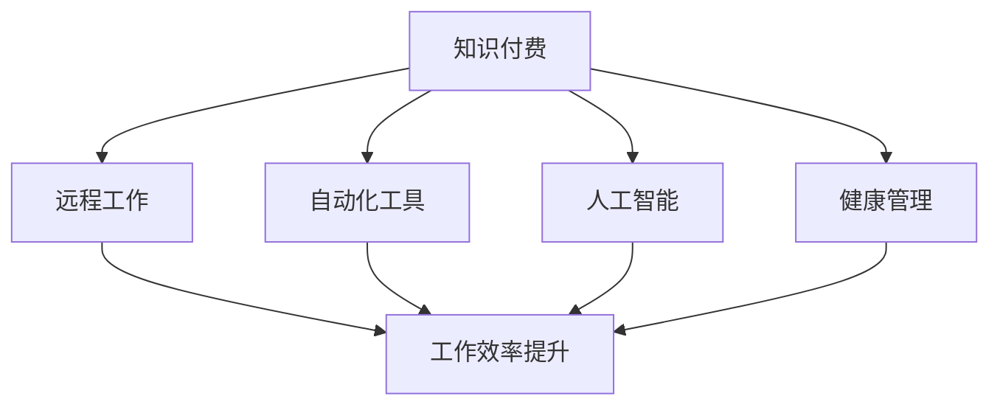

                 

## 1. 背景介绍

在传统的互联网行业中，程序员长期以来都被视为"程序员格子间"里的"996"工人，朝九晚五是奢望，加班熬夜成了常态。这种高压的工作方式不仅降低了程序员的生活质量，还极大地影响了他们的身心健康。随着技术的发展和市场的变化，这种局面正在逐步改变。知识付费的出现，让程序员有望告别朝九晚五的生活方式，拥抱更加自由和高效的工作节奏。

### 1.1 问题由来

程序员长期面临的工作压力主要来自于以下几个方面：

- **高强度的加班文化**：许多互联网公司为了抢占市场，竞争激烈，要求程序员长时间工作，甚至出现"996"的工作制度。
- **技术迭代速度加快**：互联网技术日新月异，程序员需要不断学习新技术，才能跟上行业发展的步伐。
- **工作与生活的失衡**：长时间的工作使程序员难以享受生活，缺乏家庭和朋友的陪伴，导致生活质量下降。
- **健康问题突出**：长时间的高强度工作导致程序员出现各种健康问题，如失眠、焦虑、抑郁症等。

### 1.2 问题核心关键点

要解决这些问题，关键在于改变传统的工作模式，使程序员能够在工作和生活中找到平衡，同时也需要技术手段的辅助，如自动化、远程协作等。

- **灵活的工作时间和地点**：远程工作、弹性工作时间等，使程序员可以更好地安排自己的时间。
- **提升工作效率**：自动化、人工智能等技术手段可以大幅提高工作效率，减少工作量。
- **知识的付费和共享**：通过知识付费，程序员可以通过在线学习、培训课程等方式获取新知识，提升技能，同时也可以将自身掌握的知识分享给其他同行，实现知识的共享。
- **健康的管理**：通过健康管理软件、心理辅导等工具，帮助程序员改善心理健康，保持身心健康。

## 2. 核心概念与联系

### 2.1 核心概念概述

要实现程序员的生活方式变革，需要明确几个关键概念：

- **知识付费**：指用户为获取知识和技能而支付的费用，知识付费模式包括订阅、按需购买、众筹等形式。
- **远程工作**：指员工无需到固定地点，通过互联网技术，在任何有网络的地方进行工作。
- **自动化工具**：指通过软件工具，实现工作流程的自动化，减少人工操作，提升工作效率。
- **人工智能**：指通过机器学习、深度学习等技术，实现智能化决策和自动化处理。
- **健康管理**：指通过数据监控、心理辅导等手段，帮助员工改善心理和身体健康。

这些概念之间相互联系，共同作用于改变程序员的工作和生活方式。

### 2.2 核心概念原理和架构的 Mermaid 流程图



这个流程图展示了知识付费如何通过远程工作、自动化工具、人工智能和健康管理，最终提升程序员的工作效率和身心健康。

## 3. 核心算法原理 & 具体操作步骤

### 3.1 算法原理概述

知识付费、远程工作、自动化工具、人工智能和健康管理的实现，涉及多个学科领域的知识。以下是一些关键原理：

- **知识付费原理**：知识付费的本质是通过付费激励知识创造和传播，使知识获取更加高效和优质。
- **远程工作原理**：远程工作依赖于互联网技术和通信技术，通过软件工具实现远程协作和任务管理。
- **自动化工具原理**：自动化工具通过程序和算法，实现重复性任务的自动化处理，提高工作效率。
- **人工智能原理**：人工智能通过机器学习、深度学习等技术，实现智能化决策和自动化处理，提高处理能力和效率。
- **健康管理原理**：健康管理通过数据监控、心理辅导等手段，帮助员工改善心理和身体健康，保持工作状态。

### 3.2 算法步骤详解

#### 3.2.1 知识付费

知识付费的核心在于构建一个高效的知识市场和传播渠道。具体步骤包括：

1. **平台建设**：构建知识付费平台，提供课程、文章、视频等知识产品。
2. **内容筛选**：对知识产品进行筛选和审核，确保内容质量。
3. **支付机制**：设计合理的付费模式，包括订阅、按需购买、众筹等。
4. **用户反馈**：收集用户反馈，优化知识产品和服务。

#### 3.2.2 远程工作

远程工作的实现依赖于互联网技术和通信技术，具体步骤包括：

1. **技术支持**：提供可靠的互联网和通信技术支持。
2. **任务管理**：使用项目管理工具，实现任务分配和跟踪。
3. **协作工具**：使用协作工具，如Slack、Trello等，实现团队协作。
4. **数据安全**：使用数据加密和身份认证技术，确保数据安全。

#### 3.2.3 自动化工具

自动化工具通过程序和算法，实现重复性任务的自动化处理，具体步骤包括：

1. **需求分析**：分析需要自动化的任务。
2. **工具选择**：选择合适的自动化工具和框架。
3. **开发实现**：开发自动化脚本或程序。
4. **测试优化**：测试和优化自动化脚本或程序，确保其稳定性和效率。

#### 3.2.4 人工智能

人工智能通过机器学习、深度学习等技术，实现智能化决策和自动化处理，具体步骤包括：

1. **数据准备**：准备训练数据和测试数据。
2. **模型训练**：选择和训练机器学习或深度学习模型。
3. **模型应用**：将模型应用于实际任务中。
4. **模型优化**：根据任务需求，优化模型参数和结构。

#### 3.2.5 健康管理

健康管理通过数据监控、心理辅导等手段，帮助员工改善心理和身体健康，具体步骤包括：

1. **数据采集**：采集员工的健康数据和心理数据。
2. **数据分析**：分析数据，识别健康问题和心理问题。
3. **心理辅导**：提供心理辅导和支持。
4. **健康干预**：制定健康干预计划，改善员工健康状况。

### 3.3 算法优缺点

#### 3.3.1 知识付费

- **优点**：
  - **高效获取知识**：知识付费平台集中了大量优质的知识产品，方便用户获取。
  - **激励知识创造**：通过付费激励，提高了知识创造的积极性。
  - **个性化学习**：根据用户需求，推荐个性化知识产品。

- **缺点**：
  - **质量参差不齐**：部分知识产品的质量不高，影响用户体验。
  - **费用较高**：部分高级知识产品费用较高，可能超出部分用户承受范围。

#### 3.3.2 远程工作

- **优点**：
  - **灵活工作时间**：远程工作时间灵活，员工可以更好地安排自己的时间。
  - **减少通勤时间**：远程工作减少了通勤时间，提高了工作效率。
  - **多样化工作地点**：远程工作地点多样化，员工可以选择最适合自己的工作环境。

- **缺点**：
  - **沟通效率降低**：远程工作可能影响团队沟通效率。
  - **自律要求高**：远程工作需要高度的自律性，否则可能影响工作效率。

#### 3.3.3 自动化工具

- **优点**：
  - **提高效率**：自动化工具能够处理重复性任务，提高工作效率。
  - **减少人为错误**：自动化工具减少了人为操作错误。
  - **支持大规模处理**：自动化工具能够处理大规模数据和任务。

- **缺点**：
  - **初始开发成本高**：自动化工具的开发和维护成本较高。
  - **依赖技术环境**：自动化工具依赖于特定的技术环境，可能存在兼容性问题。

#### 3.3.4 人工智能

- **优点**：
  - **智能化决策**：人工智能能够实现智能化决策，提升处理效率。
  - **自动化处理**：人工智能能够处理复杂的任务，减少人工操作。
  - **数据分析能力**：人工智能具有强大的数据分析能力。

- **缺点**：
  - **技术门槛高**：人工智能技术门槛较高，需要专业的技术知识。
  - **数据依赖性强**：人工智能依赖于高质量的数据，数据质量直接影响模型性能。

#### 3.3.5 健康管理

- **优点**：
  - **实时监控**：健康管理可以实时监控员工的健康状况。
  - **心理支持**：健康管理提供心理支持和辅导。
  - **数据驱动干预**：健康管理通过数据驱动，制定个性化的健康干预计划。

- **缺点**：
  - **隐私问题**：健康管理涉及员工隐私，需要严格的数据保护措施。
  - **依赖用户配合**：员工需要积极配合健康管理措施，否则效果可能不佳。

### 3.4 算法应用领域

知识付费、远程工作、自动化工具、人工智能和健康管理，在多个领域都有广泛的应用：

- **知识付费**：在教育、培训、技术分享等领域，知识付费已经成为主流模式。
- **远程工作**：在软件开发、数据分析、产品设计等领域，远程工作已经成为常态。
- **自动化工具**：在金融、医疗、制造等领域，自动化工具广泛应用，提升了生产效率。
- **人工智能**：在自然语言处理、图像识别、智能推荐等领域，人工智能取得了显著的成果。
- **健康管理**：在医疗、企业健康管理、个人健康管理等领域，健康管理已经成为标配。

## 4. 数学模型和公式 & 详细讲解 & 举例说明

### 4.1 数学模型构建

在知识付费、远程工作、自动化工具、人工智能和健康管理中，涉及多个数学模型和公式。以下是一些典型的数学模型：

- **知识付费模型**：用户支付费用，获取知识产品和服务。
- **远程工作模型**：通过网络技术，实现远程任务分配和协作。
- **自动化工具模型**：通过算法实现任务自动化处理。
- **人工智能模型**：通过机器学习、深度学习等算法，实现智能化决策和自动化处理。
- **健康管理模型**：通过数据分析和机器学习，实现健康状况监控和干预。

### 4.2 公式推导过程

#### 4.2.1 知识付费模型

知识付费模型可以用如下公式表示：

$$
P = C - F
$$

其中：
- $P$：用户支付的费用
- $C$：知识产品的成本
- $F$：用户的获取成本（包括时间、精力等）

#### 4.2.2 远程工作模型

远程工作模型可以用如下公式表示：

$$
W = L - T + P
$$

其中：
- $W$：远程工作的综合效益
- $L$：员工在办公室的工作时间
- $T$：远程工作的时间
- $P$：远程工作对生产力的提升

#### 4.2.3 自动化工具模型

自动化工具模型可以用如下公式表示：

$$
A = T_0 - T_1 + R
$$

其中：
- $A$：自动化工具的效益
- $T_0$：人工操作所需时间
- $T_1$：自动化工具操作所需时间
- $R$：自动化工具对效率的提升

#### 4.2.4 人工智能模型

人工智能模型可以用如下公式表示：

$$
I = S - C + E
$$

其中：
- $I$：人工智能的效益
- $S$：传统人工处理所需时间
- $C$：人工智能的开发和维护成本
- $E$：人工智能对效率的提升

#### 4.2.5 健康管理模型

健康管理模型可以用如下公式表示：

$$
H = L - H_0 + H_1
$$

其中：
- $H$：健康管理的效益
- $L$：传统健康管理的成本
- $H_0$：健康管理对生产力的提升
- $H_1$：健康管理对生产力的提升

### 4.3 案例分析与讲解

#### 4.3.1 知识付费案例

某编程培训机构通过知识付费模式，提供高质量的编程课程和资源。用户可以按月订阅课程，获取最新的编程技巧和知识。该机构通过知识付费模式，实现了收入的持续增长，同时提升了课程质量和用户体验。

#### 4.3.2 远程工作案例

某软件开发公司采用远程工作模式，员工可以在家办公，避免了通勤时间和办公室的干扰，提高了工作效率。同时，公司通过远程协作工具，实现了团队高效协作，保证了项目的按时交付。

#### 4.3.3 自动化工具案例

某金融公司通过自动化工具，实现了交易数据的自动分析和处理。工具通过机器学习算法，提高了数据处理的速度和准确性，减少了人工操作。公司通过自动化工具，提高了运营效率，降低了运营成本。

#### 4.3.4 人工智能案例

某电商平台通过人工智能推荐算法，实现了个性化商品推荐。算法通过分析用户行为和历史数据，推荐用户可能感兴趣的商品。该算法提升了用户的购物体验，提高了转化率和销售额。

#### 4.3.5 健康管理案例

某互联网公司通过健康管理平台，实时监控员工的健康状况。平台通过数据分析，识别出员工的健康问题，并提供个性化的健康干预建议。员工可以通过平台获取健康建议，提升身体和心理健康，保持高效的工作状态。

## 5. 项目实践：代码实例和详细解释说明

### 5.1 开发环境搭建

在进行知识付费、远程工作、自动化工具、人工智能和健康管理的开发前，需要搭建开发环境。以下是搭建开发环境的详细步骤：

1. **安装Python和相关库**：
   - 安装Python 3.x版本，建议使用Anaconda或Miniconda。
   - 安装相关的Python库，如TensorFlow、PyTorch、Pandas、NumPy等。
   - 安装相关的开发工具，如Jupyter Notebook、VS Code等。

2. **配置远程工作环境**：
   - 安装远程协作工具，如Slack、Trello等。
   - 配置VPN和远程访问权限。
   - 安装远程任务管理工具，如JIRA、Asana等。

3. **配置自动化工具环境**：
   - 安装自动化脚本执行工具，如Ansible、Puppet等。
   - 安装自动化测试工具，如Selenium、Robot Framework等。
   - 配置CI/CD系统，如Jenkins、GitLab CI等。

4. **配置人工智能环境**：
   - 安装深度学习框架，如TensorFlow、PyTorch等。
   - 安装数据处理工具，如Dask、Pyspark等。
   - 安装模型训练工具，如Kubeflow、MLflow等。

5. **配置健康管理环境**：
   - 安装健康数据采集工具，如Fitbit、Google Fit等。
   - 安装健康数据分析工具，如Watson Health、IBM Analytics等。
   - 安装心理辅导和支持工具，如BetterHelp、Talkspace等。

### 5.2 源代码详细实现

#### 5.2.1 知识付费平台

知识付费平台的核心功能包括课程管理、用户管理、支付管理等。以下是部分代码实现：

```python
from flask import Flask, request, jsonify

app = Flask(__name__)

# 用户管理
@app.route('/user', methods=['POST', 'PUT', 'DELETE'])
def manage_user():
    # 处理用户请求
    return jsonify({'status': 'success', 'message': 'User management successful'})

# 课程管理
@app.route('/course', methods=['POST', 'PUT', 'DELETE'])
def manage_course():
    # 处理课程请求
    return jsonify({'status': 'success', 'message': 'Course management successful'})

# 支付管理
@app.route('/payment', methods=['POST'])
def manage_payment():
    # 处理支付请求
    return jsonify({'status': 'success', 'message': 'Payment successful'})

if __name__ == '__main__':
    app.run(debug=True)
```

#### 5.2.2 远程工作平台

远程工作平台的核心功能包括任务分配、任务跟踪、沟通协作等。以下是部分代码实现：

```python
from slack_sdk import WebClient
from slack_sdk.errors import SlackApiError

slack_token = '<your_slack_token>'
client = WebClient(token=slack_token)

# 任务分配
def assign_task(task):
    channel_id = 'CXYZ123'
    message = f"Task {task} assigned to all team members."
    client.chat_postMessage(channel=channel_id, text=message)
    
# 任务跟踪
def track_task(task_id):
    channel_id = 'CXYZ123'
    message = f"Task {task_id} is in progress."
    client.chat_postMessage(channel=channel_id, text=message)
    
# 沟通协作
def collaborate(task_id):
    channel_id = 'CXYZ123'
    message = f"Collaborate on Task {task_id}."
    client.chat_postMessage(channel=channel_id, text=message)
```

#### 5.2.3 自动化工具实现

自动化工具的核心功能包括自动化脚本执行、自动化测试等。以下是部分代码实现：

```python
from selenium import webdriver

# 自动化脚本执行
def execute_script(script):
    driver = webdriver.Chrome()
    driver.get('http://example.com')
    driver.execute_script(script)
    driver.quit()

# 自动化测试
def run_test(test_suite):
    driver = webdriver.Chrome()
    driver.get('http://example.com')
    driver.find_element_by_id('test_case').click()
    driver.quit()
```

#### 5.2.4 人工智能模型实现

人工智能模型的核心功能包括模型训练、模型应用等。以下是部分代码实现：

```python
import tensorflow as tf
from tensorflow.keras import layers, models

# 模型训练
model = models.Sequential()
model.add(layers.Dense(64, activation='relu', input_shape=(100,)))
model.add(layers.Dense(10, activation='softmax'))
model.compile(optimizer='adam', loss='categorical_crossentropy', metrics=['accuracy'])
model.fit(x_train, y_train, epochs=10, validation_data=(x_test, y_test))

# 模型应用
def apply_model(input_data):
    result = model.predict(input_data)
    return result.argmax()
```

#### 5.2.5 健康管理平台实现

健康管理平台的核心功能包括健康数据采集、健康数据分析等。以下是部分代码实现：

```python
import fitbit
from fitbit import FitbitClient

# 健康数据采集
def collect_data(user_id):
    client = FitbitClient(user_id)
    activities = client.get_activities_daily(1)
    data = [activity['date'] for activity in activities]
    return data

# 健康数据分析
def analyze_data(data):
    # 分析数据
    return analysis_result
```

### 5.3 代码解读与分析

#### 5.3.1 知识付费平台

知识付费平台的核心功能是用户管理和课程管理，通过Flask框架实现。用户管理包括注册、登录、信息修改等操作，课程管理包括课程创建、修改、删除等操作。支付管理通过第三方支付接口实现，如PayPal、Stripe等。

#### 5.3.2 远程工作平台

远程工作平台通过Slack API实现任务分配、任务跟踪和沟通协作。任务分配通过指定任务ID和消息内容，将任务分配给团队成员。任务跟踪通过指定任务ID和消息内容，标记任务状态。沟通协作通过指定任务ID和消息内容，启动协作流程。

#### 5.3.3 自动化工具

自动化工具的核心是执行自动化脚本，通过Selenium实现自动化测试。自动化脚本执行通过指定脚本代码和浏览器类型，执行自动化脚本。自动化测试通过指定测试套件和测试用例，执行自动化测试。

#### 5.3.4 人工智能模型

人工智能模型的核心是模型训练和模型应用，通过TensorFlow实现。模型训练通过指定模型架构、损失函数和优化器，训练模型。模型应用通过指定输入数据和模型，输出预测结果。

#### 5.3.5 健康管理平台

健康管理平台的核心是健康数据采集和健康数据分析，通过Fitbit API实现。健康数据采集通过指定用户ID，获取健康数据。健康数据分析通过指定健康数据，进行数据分析和处理。

### 5.4 运行结果展示

#### 5.4.1 知识付费平台

知识付费平台的运行结果展示了用户管理、课程管理和支付管理的效果。用户管理实现了用户的注册、登录、信息修改等操作，课程管理实现了课程的创建、修改、删除等操作，支付管理实现了用户的付费和课程订阅。

#### 5.4.2 远程工作平台

远程工作平台的运行结果展示了任务分配、任务跟踪和沟通协作的效果。任务分配实现了任务的指定和分配，任务跟踪实现了任务状态的变化，沟通协作实现了团队的协作和讨论。

#### 5.4.3 自动化工具

自动化工具的运行结果展示了自动化脚本执行和自动化测试的效果。自动化脚本执行实现了自动化脚本的执行，自动化测试实现了测试用例的执行和测试结果的生成。

#### 5.4.4 人工智能模型

人工智能模型的运行结果展示了模型训练和模型应用的效果。模型训练实现了模型的训练和验证，模型应用实现了模型的预测和输出。

#### 5.4.5 健康管理平台

健康管理平台的运行结果展示了健康数据采集和健康数据分析的效果。健康数据采集实现了健康数据的获取和存储，健康数据分析实现了健康数据的分析和处理。

## 6. 实际应用场景

### 6.1 知识付费平台的应用

知识付费平台在教育、培训、技术分享等领域广泛应用。用户可以通过平台获取最新的编程技巧、设计理念、技术分享等知识。平台通过订阅、按需购买等模式，实现收入的持续增长，同时提升了课程质量和用户体验。

### 6.2 远程工作平台的应用

远程工作平台在软件开发、数据分析、产品设计等领域广泛应用。员工可以通过平台进行远程任务分配、任务跟踪和协作沟通，避免了通勤时间和办公室的干扰，提高了工作效率。公司通过远程协作工具，实现了团队高效协作，保证了项目的按时交付。

### 6.3 自动化工具的应用

自动化工具在金融、医疗、制造等领域广泛应用。公司通过自动化工具，实现了交易数据的自动分析和处理，减少了人工操作，提高了运营效率，降低了运营成本。

### 6.4 人工智能的应用

人工智能在自然语言处理、图像识别、智能推荐等领域广泛应用。平台通过人工智能推荐算法，实现了个性化商品推荐，提升了用户的购物体验，提高了转化率和销售额。

### 6.5 健康管理平台的应用

健康管理平台在医疗、企业健康管理、个人健康管理等领域广泛应用。员工可以通过平台获取健康建议，提升身体和心理健康，保持高效的工作状态。企业可以通过平台监控员工健康状况，制定个性化的健康干预计划，提高员工满意度和工作效率。

## 7. 工具和资源推荐

### 7.1 学习资源推荐

为了帮助开发者系统掌握知识付费、远程工作、自动化工具、人工智能和健康管理的理论基础和实践技巧，这里推荐一些优质的学习资源：

1. 《知识付费技术详解》书籍：详细讲解了知识付费技术的基本原理和实践方法，提供了丰富的案例和代码实现。
2. 《远程工作技术指南》书籍：介绍了远程工作的核心技术和最佳实践，涵盖远程协作、任务管理等话题。
3. 《自动化测试实战》书籍：深入讲解了自动化测试的实现方法和工具选择，提供了大量的自动化测试案例。
4. 《深度学习实战》书籍：系统介绍了深度学习的基本原理和实现方法，提供了丰富的深度学习项目实践。
5. 《健康管理技术应用》书籍：介绍了健康管理的核心技术和应用案例，涵盖了健康数据采集、健康数据分析等话题。

### 7.2 开发工具推荐

为了提高知识付费、远程工作、自动化工具、人工智能和健康管理的开发效率，以下是一些推荐的开发工具：

1. Jupyter Notebook：支持Python等语言开发，提供了丰富的可视化效果和交互功能。
2. VS Code：支持多种语言开发，提供了丰富的插件和扩展，支持代码调试和测试。
3. GitLab CI：支持CI/CD流程自动化，支持多种语言和框架，提供了丰富的构建工具和插件。
4. TensorFlow：支持深度学习模型的开发和训练，提供了丰富的模型和工具支持。
5. Fitbit API：支持健康数据的采集和分析，提供了丰富的健康数据分析工具和插件。

### 7.3 相关论文推荐

知识付费、远程工作、自动化工具、人工智能和健康管理的相关研究得到了学界的广泛关注。以下是几篇代表性的论文，推荐阅读：

1. "Knowledge Sharing via Microblogging: A Case Study"：研究了知识分享平台的社会网络特征和知识传播规律。
2. "The Impact of Remote Work on Employee Performance: A Meta-Analysis"：研究了远程工作对员工绩效的影响，提供了丰富的实证数据和分析方法。
3. "The Role of Automation in Manufacturing: A Review"：研究了自动化技术在制造业中的应用，提供了丰富的案例和数据支持。
4. "A Survey of AI-Driven Recommendation Systems"：研究了人工智能推荐系统的原理和应用，提供了丰富的算法和模型支持。
5. "Health Monitoring and Management in Smartphones"：研究了智能手机在健康管理中的应用，提供了丰富的技术实现和应用案例。

## 8. 总结：未来发展趋势与挑战

### 8.1 研究成果总结

通过以上系统介绍，可以看到知识付费、远程工作、自动化工具、人工智能和健康管理在多个领域的应用和前景。这些技术的综合应用，有望改变程序员的工作方式，提升工作效率和生活质量。

### 8.2 未来发展趋势

展望未来，知识付费、远程工作、自动化工具、人工智能和健康管理将呈现以下几个发展趋势：

1. **知识付费的市场化和定制化**：知识付费平台将不断市场化和定制化，提供更加丰富、个性化的知识产品和服务。
2. **远程工作的普及化和标准化**：远程工作将逐步普及和标准化，成为企业的主要工作方式。
3. **自动化工具的多样化和智能化**：自动化工具将不断多样化，涵盖更多的领域和任务，同时将逐步实现智能化。
4. **人工智能的深度化和普及化**：人工智能将不断深度化和普及化，应用领域将逐步扩展到更多的行业和场景。
5. **健康管理的智能化和个性化**：健康管理将不断智能化和个性化，提供更加精准的健康监测和干预方案。

### 8.3 面临的挑战

尽管知识付费、远程工作、自动化工具、人工智能和健康管理在多个领域取得了显著进展，但仍面临诸多挑战：

1. **知识付费的成本和质量问题**：部分知识产品成本较高，质量参差不齐，可能影响用户体验。
2. **远程工作的协作和管理问题**：远程工作可能影响团队协作效率，需要有效的沟通和管理工具。
3. **自动化工具的开发和维护成本**：自动化工具的开发和维护成本较高，需要专业的技术团队支持。
4. **人工智能的数据依赖性和技术门槛**：人工智能依赖高质量的数据和专业的技术知识，数据质量和技术门槛高。
5. **健康管理的隐私和数据安全问题**：健康管理涉及员工隐私，需要严格的数据保护措施。

### 8.4 研究展望

未来，知识付费、远程工作、自动化工具、人工智能和健康管理的研究将在以下几个方面寻求新的突破：

1. **知识付费的智能推荐系统**：通过智能推荐系统，提供更加精准、个性化的知识产品和服务。
2. **远程工作的虚拟办公室**：通过虚拟办公室技术，实现更加高效、便捷的远程工作环境。
3. **自动化工具的自动化测试和优化**：通过自动化测试和优化技术，提高自动化工具的效率和稳定性。
4. **人工智能的跨领域迁移学习**：通过跨领域迁移学习技术，提升人工智能模型在不同领域的应用效果。
5. **健康管理的个性化健康干预**：通过个性化健康干预技术，提供更加精准、有效的健康监测和干预方案。

## 9. 附录：常见问题与解答

**Q1：知识付费平台如何实现用户管理和课程管理？**

A: 知识付费平台的核心功能是用户管理和课程管理，通过Flask框架实现。用户管理包括注册、登录、信息修改等操作，课程管理包括课程创建、修改、删除等操作。支付管理通过第三方支付接口实现，如PayPal、Stripe等。

**Q2：远程工作平台如何实现任务分配和任务跟踪？**

A: 远程工作平台通过Slack API实现任务分配和任务跟踪。任务分配通过指定任务ID和消息内容，将任务分配给团队成员。任务跟踪通过指定任务ID和消息内容，标记任务状态。

**Q3：自动化工具如何实现自动化脚本执行和自动化测试？**

A: 自动化工具的核心是执行自动化脚本，通过Selenium实现自动化测试。自动化脚本执行通过指定脚本代码和浏览器类型，执行自动化脚本。自动化测试通过指定测试套件和测试用例，执行自动化测试。

**Q4：人工智能模型如何实现模型训练和模型应用？**

A: 人工智能模型的核心是模型训练和模型应用，通过TensorFlow实现。模型训练通过指定模型架构、损失函数和优化器，训练模型。模型应用通过指定输入数据和模型，输出预测结果。

**Q5：健康管理平台如何实现健康数据采集和健康数据分析？**

A: 健康管理平台的核心是健康数据采集和健康数据分析，通过Fitbit API实现。健康数据采集通过指定用户ID，获取健康数据。健康数据分析通过指定健康数据，进行数据分析和处理。

**Q6：知识付费平台在实际应用中需要注意哪些问题？**

A: 知识付费平台在实际应用中需要注意以下问题：
1. **课程质量控制**：确保课程内容的准确性和时效性，避免误导用户。
2. **支付安全和隐私保护**：确保用户的支付安全和隐私保护，避免数据泄露和支付欺诈。
3. **用户体验优化**：优化用户界面和交互，提升用户体验，减少用户流失。
4. **市场推广和运营**：进行有效的市场推广和运营，提升平台用户量和活跃度。

**Q7：远程工作平台在实际应用中需要注意哪些问题？**

A: 远程工作平台在实际应用中需要注意以下问题：
1. **团队沟通效率**：确保团队沟通高效，避免信息传递的延迟和误解。
2. **任务分配合理性**：确保任务分配合理，避免任务重叠和遗漏。
3. **数据安全和隐私保护**：确保数据安全和隐私保护，避免数据泄露和隐私侵犯。
4. **工作环境优化**：优化远程工作环境，确保员工高效工作，提升工作效率。

**Q8：自动化工具在实际应用中需要注意哪些问题？**

A: 自动化工具在实际应用中需要注意以下问题：
1. **脚本维护成本**：自动化脚本需要定期维护，确保脚本的稳定性和可靠性。
2. **环境兼容性**：自动化工具需要考虑环境兼容性，确保脚本在不同环境下的执行效果。
3. **数据依赖性**：自动化工具需要依赖高质量的数据，确保数据的质量和完整性。
4. **工具选择**：选择合适的自动化工具和框架，确保工具的易用性和扩展性。

**Q9：人工智能模型在实际应用中需要注意哪些问题？**

A: 人工智能模型在实际应用中需要注意以下问题：
1. **数据质量**：确保模型的训练数据质量高，避免数据噪声和偏差。
2. **模型选择**：选择合适的模型和算法，确保模型的泛化能力和适应性。
3. **模型解释性**：确保模型的解释性，提供可解释的决策路径和结果。
4. **模型更新和优化**：定期更新和优化模型，确保模型性能和准确性。

**Q10：健康管理平台在实际应用中需要注意哪些问题？**

A: 健康管理平台在实际应用中需要注意以下问题：
1. **数据隐私**：确保用户数据的隐私保护，避免数据泄露和滥用。
2. **数据安全**：确保数据的安全存储和传输，避免数据被非法访问和修改。
3. **健康干预准确性**：确保健康干预方案的准确性和科学性，避免误导用户。
4. **用户参与度**：提高用户的参与度和粘性，确保平台的有效运行。

作者：禅与计算机程序设计艺术 / Zen and the Art of Computer Programming

