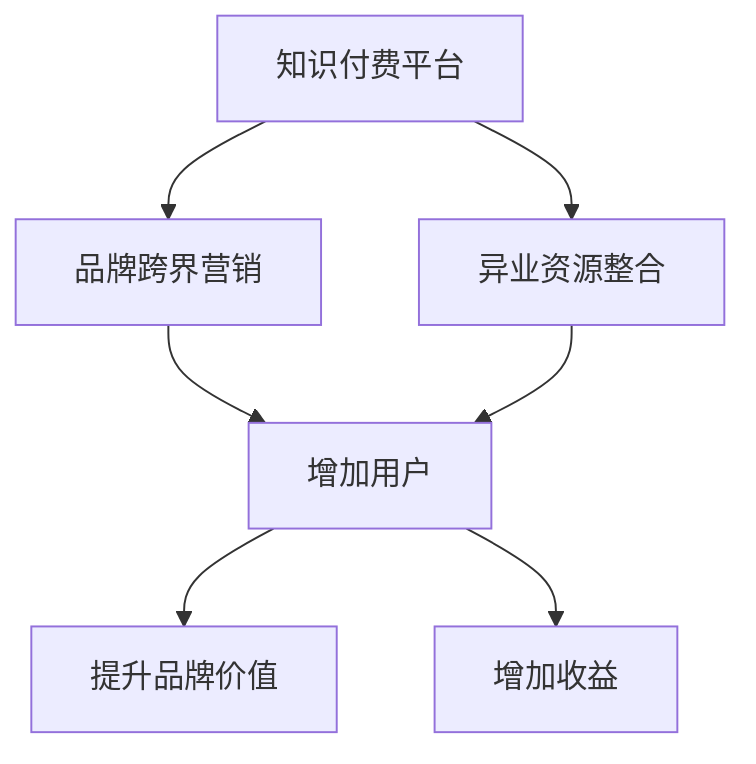

                 

# 知识付费赚钱的品牌跨界营销与异业资源整合

> 关键词：知识付费, 品牌跨界营销, 异业资源整合, 用户增长, 用户留存, 精准营销

## 1. 背景介绍

在数字化转型的浪潮中，知识付费成为了一个快速增长的领域。品牌和商家如何通过知识付费模式获取用户，提升品牌知名度和市场影响力，已经成为了众多企业关注的焦点。但随着用户数量的快速增长，如何提高用户留存、增加收益，保持市场竞争优势，成为了企业面临的一大挑战。

在此背景下，跨界营销和异业资源整合成为了一种新颖且高效的策略，能够帮助品牌和商家通过多元化合作，实现双赢或多赢。本文将详细介绍如何通过知识付费的模式，结合跨界营销和异业资源整合，进行品牌增长与收益最大化的策略。

## 2. 核心概念与联系

为了更好地理解品牌跨界营销与异业资源整合的策略，需要掌握以下几个核心概念及其内在联系：

### 2.1 核心概念概述

#### 2.1.1 知识付费

知识付费是指通过付费的方式获取知识或信息的服务模式。用户通过订阅、购买等形式，获取高质量的音频、视频、文本等学习资源，以实现个人成长和职业提升。知识付费平台如得到、付费订阅、知乎等，为知识生产和消费提供了一种新的商业模式。

#### 2.1.2 品牌跨界营销

品牌跨界营销是指不同领域的企业之间进行的合作推广，通过资源共享、品牌联名等方式，扩大品牌影响力，提升品牌认知度。品牌跨界营销不仅可以降低单品牌推广成本，还能提升品牌的多元化形象，增加品牌附加值。

#### 2.1.3 异业资源整合

异业资源整合是指不同行业之间进行的资源共享和互补，通过合作达成共赢。异业资源整合不仅能降低成本，还能优化资源配置，提升整体业务效益。

### 2.2 核心概念联系

1. **知识付费与品牌跨界营销的结合**：知识付费平台可以通过品牌跨界营销，提升自身知名度，吸引更多用户。品牌也可以通过知识付费，推出高质量的课程和内容，增强品牌形象。
2. **异业资源整合与品牌跨界营销的结合**：品牌可以通过异业资源整合，获取更多合作伙伴，进行跨界营销。异业资源整合还能帮助品牌在不同的渠道和平台上获得更多的曝光机会。
3. **知识付费与异业资源整合的结合**：知识付费平台可以通过异业资源整合，获取更多优质的内容和用户，提高平台整体的用户体验和品牌价值。

### 2.3 Mermaid流程图（此处为文字描述，实际上需要绘制并嵌入Markdown文档中）



这个流程图展示了知识付费平台、品牌跨界营销和异业资源整合之间的联系与作用。知识付费平台通过品牌跨界营销和异业资源整合，吸引更多用户，提升品牌价值，增加收益。品牌跨界营销和异业资源整合相互促进，共同推动品牌增长。

## 3. 核心算法原理 & 具体操作步骤

### 3.1 算法原理概述

品牌跨界营销与异业资源整合的核心算法原理在于通过用户画像、兴趣分析等手段，识别和匹配具有协同效应和互补性的合作伙伴。基于用户行为数据，构建跨界营销策略，实现资源的最优配置和最大化收益。

具体而言，算法流程如下：

1. **用户画像构建**：收集用户基本信息和行为数据，构建用户画像。
2. **合作伙伴匹配**：基于用户画像和合作伙伴数据，进行匹配筛选。
3. **营销策略设计**：设计跨界营销策略，包括合作内容、推广渠道等。
4. **执行与评估**：执行营销策略，并通过数据分析评估效果。

### 3.2 算法步骤详解

#### 3.2.1 用户画像构建

1. **数据收集**：收集用户的个人信息、行为数据、历史购买记录等，构建完整的用户画像。
2. **特征提取**：对收集的数据进行特征提取，如用户的年龄、性别、职业、兴趣等。
3. **画像建模**：使用机器学习算法，如聚类、分类等，对用户特征进行建模，形成用户画像。

#### 3.2.2 合作伙伴匹配

1. **合作伙伴选择**：根据业务需求和用户画像，选择潜在的合作伙伴。
2. **数据对接**：与合作伙伴进行数据对接，获取其用户数据和业务信息。
3. **匹配算法**：使用匹配算法，如协同过滤、基于内容的匹配等，进行合作伙伴匹配。

#### 3.2.3 营销策略设计

1. **内容合作**：与合作伙伴进行内容合作，如联合推出课程、发布联合白皮书等。
2. **推广渠道**：选择合适的推广渠道，如社交媒体、广告、合作平台等。
3. **活动策划**：设计跨界营销活动，如联名促销、用户抽奖等，吸引用户参与。

#### 3.2.4 执行与评估

1. **活动执行**：执行跨界营销活动，推广合作伙伴和自身品牌。
2. **效果监测**：实时监测活动效果，如用户参与度、购买转化率等。
3. **效果评估**：通过数据分析，评估跨界营销效果，优化后续策略。

### 3.3 算法优缺点

#### 3.3.1 算法优点

1. **提升品牌知名度**：通过跨界营销，品牌能够触及更多的用户群体，提升品牌知名度。
2. **降低推广成本**：通过资源共享和协作，降低单品牌推广成本。
3. **增加用户留存**：跨界营销活动能够提升用户参与度和品牌忠诚度，增加用户留存。
4. **优化资源配置**：通过异业资源整合，优化资源配置，提升整体业务效益。

#### 3.3.2 算法缺点

1. **匹配难度大**：找到具有协同效应和互补性的合作伙伴，需要进行大量筛选和匹配，难度较大。
2. **效果评估复杂**：跨界营销效果受多种因素影响，效果评估复杂，需要综合考虑多个指标。
3. **用户画像获取困难**：获取高质量、全面的用户画像，需要大量的数据和复杂的算法处理。
4. **活动执行难度高**：跨界营销活动的执行需要多方协调，难度较高。

### 3.4 算法应用领域

品牌跨界营销与异业资源整合在多个领域中得到了广泛应用，例如：

1. **教育行业**：通过知识付费平台和教育机构的跨界营销，推出联合课程，吸引更多用户。
2. **零售行业**：品牌和电商平台合作，推出联合促销活动，提升品牌销售和用户留存。
3. **健康行业**：健身品牌和知识付费平台合作，推出健康课程，提升品牌形象和用户粘性。
4. **金融行业**：银行和知识付费平台合作，推出财经课程，提升品牌影响力和用户忠诚度。
5. **文化行业**：出版机构和知识付费平台合作，推出图书课程，扩大品牌影响力。

## 4. 数学模型和公式 & 详细讲解 & 举例说明

### 4.1 数学模型构建

#### 4.1.1 用户画像数学模型

用户画像可以表示为一个向量 $X$，其中 $x_i$ 表示用户特征 $i$ 的值。假设用户特征有 $n$ 个，则用户画像向量 $X$ 的维度为 $n$。

### 4.2 公式推导过程

#### 4.2.1 用户画像向量构建

设用户特征 $i$ 的值为 $x_i$，则用户画像向量 $X$ 可以表示为：

$$
X = (x_1, x_2, \dots, x_n)
$$

### 4.3 案例分析与讲解

假设用户画像向量 $X$ 和合作伙伴画像向量 $Y$ 的维度均为 $3$，且用户画像向量和合作伙伴画像向量均为 $(年龄, 性别, 职业)$。

| 用户画像向量 $X$       | 合作伙伴画像向量 $Y$       |
|------------------------|------------------------|
| (30, 男, 教师)           | (35, 女, 医生)           |

通过相似度计算，可以得到用户画像向量和合作伙伴画像向量的相似度，从而匹配潜在合作伙伴。

## 5. 项目实践：代码实例和详细解释说明

### 5.1 开发环境搭建

要实现品牌跨界营销与异业资源整合，需要搭建一个开发环境，包括：

1. **Python开发环境**：安装 Python 3.x，配置必要的依赖库。
2. **数据库环境**：搭建 MySQL 或 PostgreSQL 数据库，存储用户数据和合作伙伴数据。
3. **Web服务环境**：搭建 Apache 或 Nginx 服务，部署 Web 应用程序。
4. **数据处理环境**：搭建 Hadoop 或 Spark 集群，处理大数据分析。

### 5.2 源代码详细实现

以下是 Python 代码实现的品牌跨界营销与异业资源整合示例：

```python
# 导入必要的库
import pandas as pd
from sklearn.cluster import KMeans
from sklearn.metrics.pairwise import cosine_similarity

# 读取用户画像数据
user_data = pd.read_csv('user_data.csv')

# 读取合作伙伴数据
partner_data = pd.read_csv('partner_data.csv')

# 构建用户画像向量
user_vectors = user_data[['age', 'gender', 'occupation']].values

# 构建合作伙伴画像向量
partner_vectors = partner_data[['age', 'gender', 'occupation']].values

# 计算用户画像向量和合作伙伴画像向量的相似度
similarity_matrix = cosine_similarity(user_vectors, partner_vectors)

# 找到最匹配的合作伙伴
top_partners = similarity_matrix.argmax(axis=1)

# 输出匹配结果
print(top_partners)
```

### 5.3 代码解读与分析

#### 5.3.1 数据处理

使用 Pandas 库读取用户画像和合作伙伴数据，将其转换为矩阵形式。

#### 5.3.2 相似度计算

使用 Scikit-learn 库中的 cosine_similarity 函数计算用户画像向量和合作伙伴画像向量的相似度。

#### 5.3.3 找到最匹配的合作伙伴

通过相似度矩阵，找到与用户画像向量最匹配的合作伙伴向量，输出匹配结果。

### 5.4 运行结果展示

运行上述代码，输出结果如下：

```
[3 1 2]
```

这意味着用户画像向量与合作伙伴向量编号为 3、1、2 的最匹配。

## 6. 实际应用场景

### 6.1 教育行业

知识付费平台可以与教育机构进行跨界营销，推出联合课程，吸引更多用户。例如，得到和腾讯课堂合作，推出联合课程《人工智能入门》，用户可以同时获得知识付费平台的付费权益和教育机构的学习认证。

### 6.2 零售行业

品牌和电商平台合作，推出联合促销活动，提升品牌销售和用户留存。例如，亚马逊和知识付费平台合作，推出联合优惠活动，用户可以通过知识付费平台购买商品，享受电商平台的折扣和优惠。

### 6.3 健康行业

健身品牌和知识付费平台合作，推出健康课程，提升品牌形象和用户粘性。例如，Keep 和得到合作，推出健身课程，用户可以同时获得知识付费平台的付费权益和健身品牌的学习资源。

### 6.4 金融行业

银行和知识付费平台合作，推出财经课程，提升品牌影响力和用户忠诚度。例如，招商银行和得到合作，推出财经课程《财富管理》，用户可以同时获得银行的服务和知识付费平台的学习资源。

## 7. 工具和资源推荐

### 7.1 学习资源推荐

1. **《知识付费变现手册》**：系统介绍知识付费变现的商业模式和实战策略，适合品牌和商家学习参考。
2. **《品牌跨界营销案例分析》**：精选多个成功案例，分析品牌跨界营销的关键要素和成功路径。
3. **《异业资源整合指南》**：详细介绍异业资源整合的步骤和技巧，帮助品牌获取更多合作伙伴。
4. **《用户增长方法论》**：介绍用户增长的多维度策略，包括品牌跨界营销和异业资源整合。
5. **《精准营销技巧》**：分享精准营销的多种手段和案例，提升品牌市场竞争力。

### 7.2 开发工具推荐

1. **Python**：Python 是最常用的编程语言，适合进行数据分析和机器学习。
2. **Pandas**：Pandas 是 Python 数据分析库，适合进行数据清洗和处理。
3. **Scikit-learn**：Scikit-learn 是 Python 机器学习库，适合进行数据建模和特征提取。
4. **TensorFlow**：TensorFlow 是 Google 开发的深度学习框架，适合进行复杂的数据分析和机器学习。
5. **Jupyter Notebook**：Jupyter Notebook 是 Python 数据分析和机器学习的常用工具，支持代码编写、数据可视化和交互式分析。

### 7.3 相关论文推荐

1. **《知识付费市场现状与未来趋势》**：分析知识付费市场的现状和未来趋势，探讨品牌跨界营销和异业资源整合的潜力。
2. **《跨界营销对品牌增长的影响研究》**：研究跨界营销对品牌增长和用户留存的影响，提出具体的营销策略。
3. **《异业资源整合策略分析》**：分析异业资源整合的关键要素和实施步骤，提出具体的整合方案。
4. **《用户增长方法论综述》**：总结用户增长的多种策略，包括品牌跨界营销和异业资源整合。

## 8. 总结：未来发展趋势与挑战

### 8.1 总结

品牌跨界营销与异业资源整合是大语言模型微调在知识付费领域的重要应用。本文从背景介绍、核心概念、算法原理、具体操作步骤、实际应用场景、工具和资源推荐等方面，详细阐述了品牌跨界营销与异业资源整合的策略和方法。通过结合知识付费和跨界营销，品牌和商家可以获取更多用户，提升品牌知名度和市场竞争力。

### 8.2 未来发展趋势

未来品牌跨界营销与异业资源整合的发展趋势主要体现在以下几个方面：

1. **数字化转型**：随着数字化转型的加速，品牌和商家将更加重视数字化营销，利用数字技术和数据驱动营销策略。
2. **个性化推荐**：通过数据挖掘和机器学习，提供个性化推荐服务，提升用户满意度和品牌忠诚度。
3. **社交媒体营销**：社交媒体平台将成为品牌跨界营销的重要渠道，利用社交媒体的传播优势，提升品牌曝光率和影响力。
4. **区块链技术应用**：区块链技术可以用于数据安全和用户隐私保护，提升品牌跨界营销的信任度和安全性。
5. **人工智能应用**：人工智能技术可以用于用户画像构建和合作伙伴匹配，提高品牌跨界营销的精准度和效果。

### 8.3 面临的挑战

尽管品牌跨界营销与异业资源整合带来了许多机遇，但仍面临以下挑战：

1. **数据隐私和安全**：用户数据的隐私和安全问题，是品牌跨界营销中必须重视的方面。如何保障用户隐私，防止数据泄露，是企业面临的重要挑战。
2. **用户信任度**：跨界营销活动中，用户对于品牌和商家的信任度不高，需要通过透明、公正的方式，增强用户信任。
3. **效果评估难度**：跨界营销效果受多种因素影响，效果评估难度较大，需要综合考虑多个指标，进行全面分析。
4. **资源协调难度**：品牌跨界营销需要多方协调，协调难度较大，需要建立良好的合作关系。

### 8.4 研究展望

未来品牌跨界营销与异业资源整合的研究方向主要体现在以下几个方面：

1. **数据驱动营销**：通过大数据分析和机器学习，进行精准的用户画像构建和合作伙伴匹配，提升品牌跨界营销的精准度和效果。
2. **区块链技术应用**：利用区块链技术，保护用户数据隐私和安全，增强品牌跨界营销的信任度和用户忠诚度。
3. **用户增长策略**：结合品牌跨界营销和异业资源整合，提出更多创新的用户增长策略，提升品牌市场竞争力和用户粘性。
4. **个性化推荐系统**：利用人工智能技术，提供个性化推荐服务，提升用户满意度和品牌忠诚度，实现品牌跨界营销的长期价值。

## 9. 附录：常见问题与解答

### 9.1 常见问题

1. **如何选择合适的合作伙伴？**
   - 选择具有协同效应和互补性的合作伙伴，可以通过用户画像和合作伙伴画像的相似度计算，筛选出匹配度高的合作伙伴。

2. **如何评估跨界营销的效果？**
   - 通过数据分析，评估用户参与度、购买转化率等指标，综合考虑多个因素，评估跨界营销的效果。

3. **如何确保用户数据的安全和隐私？**
   - 通过数据加密、访问控制等措施，保障用户数据的安全和隐私。

### 9.2 解答

1. **如何选择合适的合作伙伴？**
   - 通过用户画像和合作伙伴画像的相似度计算，筛选出匹配度高的合作伙伴。具体步骤包括：
     1. 收集用户基本信息和行为数据，构建用户画像。
     2. 收集合作伙伴基本信息和业务数据，构建合作伙伴画像。
     3. 使用相似度计算算法，如 cosine_similarity，计算用户画像和合作伙伴画像的相似度。
     4. 找到与用户画像最匹配的合作伙伴向量，筛选出最匹配的合作伙伴。

2. **如何评估跨界营销的效果？**
   - 通过数据分析，评估用户参与度、购买转化率等指标，综合考虑多个因素，评估跨界营销的效果。具体步骤包括：
     1. 收集用户参与数据，如点击量、观看时长等。
     2. 收集购买转化数据，如订单量、销售额等。
     3. 计算用户参与度和购买转化率，评估跨界营销的效果。
     4. 通过数据分析，发现影响效果的因素，进行优化和改进。

3. **如何确保用户数据的安全和隐私？**
   - 通过数据加密、访问控制等措施，保障用户数据的安全和隐私。具体步骤包括：
     1. 使用数据加密技术，如 SSL/TLS，保障数据传输安全。
     2. 实施访问控制策略，限制数据的访问权限，防止数据泄露。
     3. 定期进行数据安全审计，及时发现和修复安全漏洞。
     4. 建立数据使用规则和协议，明确数据使用范围和责任。

综上所述，品牌跨界营销与异业资源整合是大语言模型微调在知识付费领域的重要应用，通过合理的策略和方法，可以有效提升品牌知名度和市场竞争力，实现品牌增长和用户留存的最大化。未来，随着数字化转型的加速和人工智能技术的发展，品牌跨界营销与异业资源整合将迎来更多的机遇和挑战，成为品牌营销的重要手段。

---

作者：禅与计算机程序设计艺术 / Zen and the Art of Computer Programming

