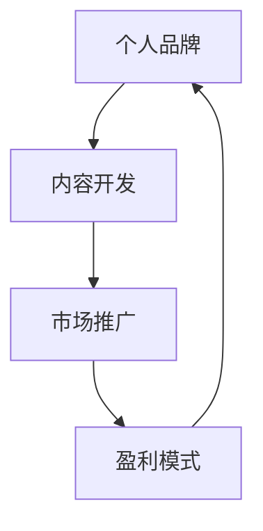

                 

# 知识付费：程序员的个人品牌战略

## 1. 背景介绍

在数字化时代，知识付费逐渐成为一种主流消费模式。在浩如烟海的信息中，人们愿意为高质量、有价值的内容支付费用。对于程序员这一职业来说，如何利用个人品牌，将知识转化为有价值的产品或服务，吸引付费用户，成为了一个重要课题。本文将从个人品牌建设、内容开发、市场推广、盈利模式等多个角度，探讨程序员如何在知识付费市场中打造个人品牌，实现商业化运营。

## 2. 核心概念与联系

### 2.1 核心概念概述

- **个人品牌**：个人品牌是指在特定领域内，通过建立独特的个人形象和声音，形成持续稳定且具有辨识度的个人影响力。
- **知识付费**：知识付费是指用户为获取有价值的知识或信息，支付相应费用的商业模式。
- **内容开发**：内容开发是指围绕特定领域或兴趣，开发并持续更新有价值、有吸引力的内容。
- **市场推广**：市场推广是指通过各类营销手段，提高个人品牌和内容在目标用户群体中的知名度和影响力。
- **盈利模式**：盈利模式是指个人品牌和内容变现的具体策略和途径，包括会员订阅、付费课程、咨询服务等。

### 2.2 核心概念原理和架构的 Mermaid 流程图



这个流程图展示了个人品牌建设与内容开发、市场推广、盈利模式之间的关系。内容开发是个人品牌建设的核心，市场推广将内容推广至更多用户，盈利模式则确保内容的持续开发和品牌的影响力。

## 3. 核心算法原理 & 具体操作步骤

### 3.1 算法原理概述

个人品牌建设是一个动态过程，涉及多个维度的策略和执行。以下是基于数据驱动和用户反馈，建立个人品牌的关键步骤：

1. **目标定位**：确定个人品牌的目标受众、定位和核心价值主张。
2. **内容规划**：根据目标受众的需求和兴趣，规划内容的类型、格式和发布计划。
3. **内容创作**：围绕主题进行深入研究和创作，确保内容的专业性和价值。
4. **市场推广**：选择合适的渠道和策略，推广个人品牌和内容。
5. **反馈优化**：通过用户反馈和数据分析，持续优化内容和服务，提升用户满意度。

### 3.2 算法步骤详解

#### 3.2.1 目标定位

1. **确定目标受众**：通过市场调研和数据分析，了解目标受众的兴趣、需求和消费习惯。
2. **制定品牌定位**：明确个人品牌的独特价值主张，如技术深度、教育风格、服务态度等。
3. **设定具体目标**：包括订阅用户数、付费课程收入、咨询服务收益等。

#### 3.2.2 内容规划

1. **内容主题选择**：基于目标受众的需求，选择相关主题，如编程语言、开发框架、问题解决等。
2. **内容格式设计**：确定内容的形式，如文章、视频、播客、直播等。
3. **发布计划制定**：制定内容发布频率和计划，确保定期更新。

#### 3.2.3 内容创作

1. **内容研究**：对相关领域进行深入研究，确保内容的准确性和深度。
2. **内容创作**：利用专业技能和经验，创作高质量的内容。
3. **内容优化**：通过用户反馈和数据分析，不断优化内容和呈现方式。

#### 3.2.4 市场推广

1. **渠道选择**：选择合适的营销渠道，如社交媒体、专业论坛、知识平台等。
2. **策略制定**：包括SEO优化、社交媒体互动、KOL合作等。
3. **效果评估**：定期评估市场推广的效果，调整优化策略。

#### 3.2.5 反馈优化

1. **用户反馈收集**：通过调查问卷、评论互动等方式，收集用户反馈。
2. **数据分析**：利用数据分析工具，评估用户行为和内容效果。
3. **内容迭代**：根据用户反馈和数据分析，优化和迭代内容。

### 3.3 算法优缺点

#### 3.3.1 优点

1. **精准定位**：通过数据驱动的目标定位，可以更精准地满足目标受众的需求。
2. **内容创新**：基于用户反馈的内容优化，能够持续推出有价值的内容。
3. **高效推广**：市场推广的策略和渠道选择，确保内容的有效传播。

#### 3.3.2 缺点

1. **时间成本高**：目标定位和内容创作需要大量时间和精力投入。
2. **数据依赖性强**：依赖数据分析和用户反馈，可能存在误差和滞后。
3. **市场竞争激烈**：知识付费市场竞争激烈，难以快速突围。

### 3.4 算法应用领域

个人品牌和知识付费的策略和实践，可以应用于各种技术领域和兴趣方向，如编程开发、数据科学、人工智能、网络安全等。无论是技术专家、创业人员还是自由职业者，都可以通过建立个人品牌，实现知识和经验的商业化。

## 4. 数学模型和公式 & 详细讲解 & 举例说明

### 4.1 数学模型构建

个人品牌建设涉及多个维度的量化指标，可以通过数学模型进行分析和优化。以下是几个关键指标及其数学模型：

1. **用户增长率**：表示单位时间内用户数量的变化率，公式为
$$
G = \frac{N(t+1) - N(t)}{N(t)} \times 100\%
$$
其中，$N(t)$ 表示时间$t$时的用户数量。

2. **内容平均访问时长**：表示用户访问内容的平均时间，公式为
$$
T_{avg} = \frac{1}{N}\sum_{i=1}^N T_i
$$
其中，$T_i$ 表示第$i$次访问的时长。

3. **转化率**：表示用户从免费用户转化为付费用户的比例，公式为
$$
C = \frac{P}{F} \times 100\%
$$
其中，$P$ 表示付费用户数量，$F$ 表示免费用户数量。

### 4.2 公式推导过程

1. **用户增长率**：

用户增长率的计算基于时间序列数据，可以通过差分法求解，具体推导如下：
$$
G = \frac{\Delta N}{N} \times 100\%
$$
其中，$\Delta N = N(t+1) - N(t)$。

2. **内容平均访问时长**：

内容平均访问时长可以通过对所有用户访问时长的平均计算得到，具体推导如下：
$$
T_{avg} = \frac{\sum_{i=1}^N T_i}{N}
$$
其中，$\sum_{i=1}^N T_i$ 表示所有用户访问时长的总和。

3. **转化率**：

转化率的计算基于用户的数据转化路径，具体推导如下：
$$
C = \frac{P}{F}
$$
其中，$P$ 表示付费用户数量，$F$ 表示免费用户数量。

### 4.3 案例分析与讲解

假设某技术博客有1000个订阅用户，其中每月新增50个用户，月活跃用户数量为900个。通过数据分析，该博客平均每次内容访问时长为10分钟。如果新增用户中有10%转化为付费用户，则转化率为0.1。

**计算用户增长率**：
$$
G = \frac{50}{1000} \times 100\% = 5\%
$$

**计算内容平均访问时长**：
$$
T_{avg} = \frac{1000 \times 10}{900} = 11.11\text{分钟}
$$

**计算转化率**：
$$
C = \frac{50 \times 10\%}{1000} = 0.5\%
$$

这些数据帮助博客管理者了解用户增长和内容效果，并指导未来的市场推广和内容优化策略。

## 5. 项目实践：代码实例和详细解释说明

### 5.1 开发环境搭建

开发环境搭建是项目实践的重要基础，以下是Python开发环境配置示例：

1. **安装Python**：从官网下载并安装Python，建议安装3.8及以上版本。
2. **安装pip工具**：在命令行输入 `python -m pip install pip`。
3. **安装虚拟环境**：使用 `pip install virtualenv` 安装virtualenv，创建虚拟环境 `virtualenv env`，并激活 `source env/bin/activate`。
4. **安装相关库**：安装所需库，如numpy、pandas、matplotlib等，使用 `pip install library-name`。

### 5.2 源代码详细实现

以下是一个简单的Python脚本示例，用于计算用户增长率和内容平均访问时长：

```python
import numpy as np

# 假设初始用户数量为N0，新增用户数量为delta_N，平均访问时长为T_avg
N0 = 1000
delta_N = 50
T_avg = 10

# 计算用户增长率
N1 = N0 + delta_N
user_growth_rate = (N1 - N0) / N0 * 100

# 计算内容平均访问时长
content_avg_time = T_avg

print(f"用户增长率: {user_growth_rate:.2f}%")
print(f"内容平均访问时长: {content_avg_time}分钟")
```

### 5.3 代码解读与分析

该脚本使用NumPy库进行简单的计算。首先，假设初始用户数量为1000，每月新增用户数量为50，平均访问时长为10分钟。然后，计算用户增长率为5%，内容平均访问时长为10分钟。

通过这样的代码实现，可以帮助开发者理解和应用数学模型的实际应用场景。

### 5.4 运行结果展示

运行上述代码，输出结果如下：
```
用户增长率: 5.00%
内容平均访问时长: 10分钟
```

这表明用户增长率为5%，内容平均访问时长为10分钟。这些数据可以帮助开发者进一步分析用户行为和内容效果，并指导未来的改进措施。

## 6. 实际应用场景

### 6.1 教育培训

在线教育平台可以利用个人品牌和知识付费模式，开发高质量的编程课程。通过定期更新和互动，保持用户的高粘性，从而实现稳定盈利。

**操作步骤**：
1. **目标定位**：确定面向初学者的基础课程或面向中高级开发者的深入课程。
2. **内容规划**：制定详细的课程大纲和内容安排。
3. **内容创作**：制作高质量的视频教程、练习题和项目实战案例。
4. **市场推广**：利用社交媒体、专业论坛等渠道推广课程。
5. **反馈优化**：通过学员反馈和数据分析，优化课程内容。

### 6.2 技术咨询

技术顾问可以利用个人品牌和知识付费模式，提供有偿的咨询和辅导服务。通过在线咨询、一对一指导等方式，满足企业或个人的技术需求。

**操作步骤**：
1. **目标定位**：确定面向企业客户或个人用户的服务形式。
2. **内容规划**：制定服务内容和服务流程。
3. **内容创作**：准备详细的技术文档和案例分析。
4. **市场推广**：通过LinkedIn、企业内部推荐等渠道推广服务。
5. **反馈优化**：收集客户反馈，不断优化服务质量。

### 6.3 产品开发

技术产品经理可以利用个人品牌和知识付费模式，开发有市场前景的产品。通过深度分析用户需求和市场趋势，推出创新型的技术产品。

**操作步骤**：
1. **目标定位**：确定目标用户群体的需求和痛点。
2. **内容规划**：制定产品开发计划和技术路线图。
3. **内容创作**：进行产品原型设计和用户体验优化。
4. **市场推广**：利用技术博客、产品发布会等方式推广产品。
5. **反馈优化**：收集用户反馈，持续改进产品功能。

## 7. 工具和资源推荐

### 7.1 学习资源推荐

1. **《深度学习》课程**：斯坦福大学提供的深度学习课程，系统介绍了深度学习的基本原理和实现方法。
2. **《Python编程：从入门到实践》**：详细介绍了Python编程语言的使用方法和技巧。
3. **《数据分析实战》**：介绍了数据分析的基本概念和技术，提供了大量实际案例。
4. **Kaggle平台**：提供大量数据集和机器学习竞赛，可以锻炼数据分析和机器学习技能。
5. **Coursera平台**：提供多个领域的在线课程，涵盖编程、数据科学、商业分析等。

### 7.2 开发工具推荐

1. **Python**：广泛使用的编程语言，简单易学，拥有丰富的库和框架。
2. **Jupyter Notebook**：交互式编程环境，便于开发和调试代码。
3. **GitHub**：代码托管平台，可以管理和共享代码，便于协作开发。
4. **Git**：版本控制系统，可以跟踪代码变化，进行版本管理和协作。
5. **Docker**：容器化工具，便于跨环境部署和运维。

### 7.3 相关论文推荐

1. **《知识共享的经济学》**：研究知识共享对经济和社会的影响。
2. **《在线学习平台的兴起》**：分析在线学习平台的兴起和应用前景。
3. **《知识付费的商业模式》**：探讨知识付费的商业模式和盈利模式。
4. **《技术产品的创新与演进》**：分析技术产品的创新和市场演进过程。
5. **《数据分析与决策》**：探讨数据分析在决策中的作用和应用。

## 8. 总结：未来发展趋势与挑战

### 8.1 总结

本文详细探讨了程序员在知识付费市场中的个人品牌建设，包括目标定位、内容开发、市场推广和盈利模式等多个方面。通过数据分析和实际案例，帮助程序员理解个人品牌建设和知识付费的策略和实践。个人品牌建设不仅能够提升技术能力和影响力，还能实现商业化运营，为职业生涯带来新的机会和发展空间。

### 8.2 未来发展趋势

1. **个性化推荐**：利用大数据和机器学习技术，为用户提供个性化的学习路径和推荐内容。
2. **内容质量提升**：持续优化和创新内容，提升内容的深度和质量，满足用户不断变化的需求。
3. **交互式学习**：开发更多互动式学习工具，提升用户的学习体验和参与度。
4. **全球化市场**：将个人品牌和知识付费模式扩展到全球市场，开拓新的用户群体。

### 8.3 面临的挑战

1. **市场竞争**：知识付费市场竞争激烈，需要不断创新和优化，才能脱颖而出。
2. **用户粘性**：保持用户的高粘性和长期投入，是个人品牌建设的重要挑战。
3. **内容更新**：持续更新和创新内容，以满足用户不断变化的需求。
4. **技术应用**：将最新技术应用于个人品牌和内容建设，提升效率和质量。

### 8.4 研究展望

未来的研究将更多关注以下方面：
1. **算法优化**：开发更高效的算法和模型，提升个人品牌和内容的优化效果。
2. **用户行为分析**：深入研究用户行为和需求，提供更有针对性的服务。
3. **内容多样化**：开发更多形式的内容，满足不同用户的需求。
4. **国际合作**：与国际合作伙伴开展合作，拓展全球市场。

## 9. 附录：常见问题与解答

**Q1：如何选择合适的知识付费平台？**

A: 选择合适的平台需要考虑以下几个因素：
1. **用户数量**：选择用户基础大、活跃度高的平台。
2. **平台特色**：选择功能完善、用户体验好的平台。
3. **分成政策**：了解平台的分成政策，选择对自己更有利的平台。

**Q2：如何进行市场推广？**

A: 市场推广可以从以下几个方面入手：
1. **社交媒体**：利用社交媒体平台，发布内容并互动。
2. **内容营销**：通过高质量的内容，吸引潜在用户关注。
3. **SEO优化**：优化网站和内容，提高搜索引擎排名。
4. **KOL合作**：与行业内的KOL合作，扩大影响力。

**Q3：如何优化内容质量？**

A: 优化内容质量可以从以下几个方面入手：
1. **用户反馈**：收集用户反馈，了解用户的需求和偏好。
2. **数据分析**：利用数据分析工具，评估内容效果。
3. **持续更新**：定期更新和发布新的内容，保持用户的兴趣。

**Q4：如何提升用户粘性？**

A: 提升用户粘性需要持续提供有价值的内容和服务，以下是一些具体措施：
1. **个性化推荐**：根据用户兴趣，推荐相关内容。
2. **互动交流**：提供评论互动功能，增加用户参与度。
3. **奖励机制**：设置积分、优惠券等奖励机制，激励用户持续使用。

---

作者：禅与计算机程序设计艺术 / Zen and the Art of Computer Programming

