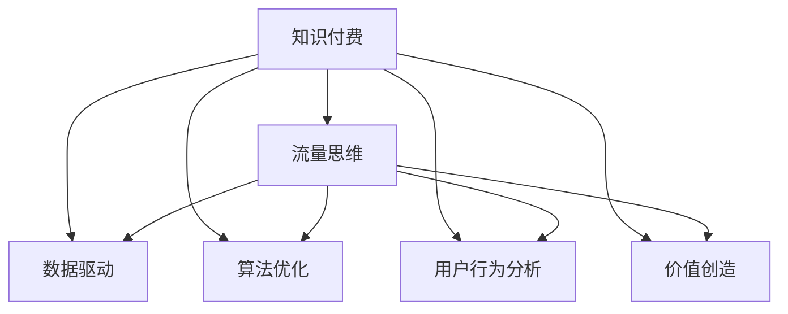

                 

# 知识付费：程序员的流量思维

## 1. 背景介绍

### 1.1 问题由来
在过去十年中，知识付费现象在全球范围内兴起，并迅速成为数字经济的重要组成部分。无论是技术文章、培训课程、在线研讨会还是短视频内容，越来越多的知识资源被包装成付费产品，以获取经济回报。这背后，有技术进步、市场需求、消费者习惯等因素的推动。

知识付费已经成为程序员获取新知识、技能的重要渠道。与传统的书籍、论坛相比，知识付费内容更加灵活、实时更新，能够更直接地满足程序员的学习需求。然而，知识付费的崛起也带来了新的挑战：如何高效筛选和利用海量知识资源，提升学习效果和转化率。

### 1.2 问题核心关键点
本文将重点探讨程序员如何运用流量思维，高效利用知识付费平台提供的资源，最大化个人和企业的收益。流量思维，即通过数据驱动的方法，优化资源配置，提升价值创造效率，是一种有效的市场运营策略。

通过探讨知识付费和流量思维的结合，本文将揭示如何利用大数据和算法技术，将知识流量转化为实际价值，推动知识付费行业的健康发展，促进知识共享与创新。

## 2. 核心概念与联系

### 2.1 核心概念概述

为了更好地理解程序员如何运用流量思维进行知识付费，本节将介绍几个核心概念：

- **知识付费 (Knowledge Paywall)**：指通过付费方式获取特定知识内容，旨在提高知识分享者的收入和促进消费者高效获取所需知识的方式。
- **流量思维 (Traffic Mindset)**：一种市场运营策略，旨在通过数据分析和优化，提升用户访问量，增加交易转化，实现收益最大化。
- **数据驱动 (Data-Driven)**：利用数据来指导决策，提升决策效率和准确性，是流量思维的核心方法。
- **算法优化 (Algorithm Optimization)**：通过算法模型对数据进行分析和预测，以优化资源配置和用户行为。
- **用户行为分析 (User Behavior Analysis)**：通过分析用户行为数据，理解用户需求和偏好，提供更个性化的内容和体验。
- **价值创造 (Value Creation)**：通过优化资源配置和用户体验，实现知识付费平台的可持续发展，创造更大价值。

这些概念之间的联系可以用以下Mermaid流程图来展示：



## 3. 核心算法原理 & 具体操作步骤
### 3.1 算法原理概述

知识付费平台通过数据驱动和算法优化，优化用户行为，提高知识内容的转化率。核心算法原理包括以下几个方面：

- **推荐算法**：利用协同过滤、内容推荐、混合推荐等技术，为每个用户推荐最相关的知识内容。
- **用户画像构建**：通过分析用户行为数据，构建用户画像，了解用户兴趣、职业背景等信息。
- **个性化推荐**：根据用户画像，提供个性化的知识内容推荐，提升用户满意度和留存率。
- **行为预测**：利用机器学习算法，预测用户的行为路径和交易转化概率，实现精准营销。
- **多维度优化**：通过A/B测试、多臂赌博机等方法，优化广告投放、内容推送策略，最大化平台收益。

### 3.2 算法步骤详解

基于上述核心算法原理，知识付费平台的数据流和算法流程可以概括为以下步骤：

1. **数据收集与处理**：收集用户行为数据，包括点击、购买、浏览、评论等行为。
2. **数据存储与清洗**：存储数据到数据库，并进行数据清洗，去除噪声和异常值。
3. **特征工程与提取**：从清洗后的数据中提取有意义的特征，如用户兴趣标签、知识内容标签等。
4. **算法训练与优化**：利用机器学习算法对数据进行训练，不断优化推荐算法和用户画像模型。
5. **结果验证与迭代**：通过A/B测试、用户满意度调查等方式，验证算法效果，不断迭代优化。

### 3.3 算法优缺点

知识付费平台的算法优化方法具有以下优点：
- **提高转化率**：通过个性化推荐，提升知识内容的转化率，增加平台收入。
- **提升用户体验**：根据用户画像，提供个性化推荐，提高用户满意度，增加用户粘性。
- **降低运营成本**：通过数据驱动的方法，优化资源配置，降低广告和内容生产成本。

同时，这些方法也存在一些缺点：
- **数据隐私问题**：大量收集用户行为数据可能涉及隐私问题，需要采取数据保护措施。
- **算法偏见**：算法模型可能存在偏见，导致某些用户或内容被忽视。
- **动态环境挑战**：用户行为和市场环境变化快，算法模型需要频繁更新和优化。

### 3.4 算法应用领域

基于知识付费的流量思维和算法优化，已经广泛应用于以下几个领域：

- **在线教育**：利用推荐算法和用户画像，推荐适合用户的专业课程，提升学习效果。
- **技术社区**：通过个性化推荐和用户行为分析，增加社区活跃度，推动知识分享。
- **行业报告**：提供行业趋势报告和专题分析，帮助用户了解最新技术动态，推动市场发展。
- **培训课程**：针对企业需求，推荐适合的培训课程，提升员工技能，推动企业发展。

## 4. 数学模型和公式 & 详细讲解  
### 4.1 数学模型构建

知识付费平台的推荐算法和用户画像构建可以基于以下数学模型：

- **协同过滤算法**：基于用户之间的相似性，推荐用户可能感兴趣的知识内容。
- **内容推荐算法**：基于知识内容之间的关联性，推荐可能满足用户需求的内容。
- **混合推荐算法**：结合协同过滤和内容推荐，提供更精准的推荐结果。

用户画像的构建可以基于以下数学模型：

- **K-means聚类算法**：将用户行为数据聚类，识别出具有相似兴趣的用户群体。
- **随机森林分类器**：利用决策树集成方法，构建用户兴趣标签。

### 4.2 公式推导过程

协同过滤算法的核心公式为：

$$
r_{ui} = \frac{\sum_{j=1}^{n}r_{uj} \times a_{ij}}{\sqrt{\sum_{j=1}^{n}a_{uj}^2} \times \sqrt{\sum_{j=1}^{n}a_{ij}^2}}
$$

其中，$r_{ui}$表示用户$u$对知识内容$i$的评分，$n$表示用户和知识内容的总数，$a_{uj}$表示用户$u$和知识内容$j$的相似度，$r_{uj}$表示用户$u$对知识内容$j$的评分。

内容推荐算法可以利用TF-IDF算法，计算知识内容$i$和用户$u$之间的相关性：

$$
r_{ui} = \text{TF}_i \times \text{IDF}_i \times \text{TF}_u
$$

其中，$\text{TF}$和$\text{IDF}$分别表示知识内容和用户的TF-IDF值。

用户画像的K-means聚类算法通过计算用户行为数据的欧式距离，进行聚类：

$$
d_{ij} = \sum_{k=1}^{d} (x_{ik} - y_{jk})^2
$$

其中，$d_{ij}$表示用户$i$和用户$j$在行为数据$d$维空间中的欧式距离，$x$表示用户$i$的行为数据，$y$表示用户$j$的行为数据。

### 4.3 案例分析与讲解

以一个在线教育平台为例，该平台利用协同过滤算法为用户推荐课程。平台首先收集用户的历史点击、购买、浏览等行为数据，构建用户画像。然后，利用协同过滤算法计算用户$u$和内容$i$的相似度，推荐与用户兴趣最接近的课程。

通过这种推荐机制，平台能够提高课程的转化率，增加用户粘性，提升平台收入。同时，平台可以通过用户反馈和行为数据，不断优化推荐算法，提高推荐效果。

## 5. 项目实践：代码实例和详细解释说明
### 5.1 开发环境搭建

知识付费平台的开发环境需要具备以下几个条件：

1. 服务器：需要高性能服务器，支持大数据处理和算法优化。
2. 数据库：选择关系型数据库如MySQL、PostgreSQL，或分布式数据库如Hive、Hadoop。
3. 大数据工具：使用Spark、Hadoop等大数据工具，处理海量数据。
4. 算法框架：使用Scikit-learn、TensorFlow、PyTorch等算法框架，实现推荐算法和用户画像。

### 5.2 源代码详细实现

以下是一个基于Python的在线教育平台推荐算法实现示例：

```python
import pandas as pd
import numpy as np
from sklearn.decomposition import TruncatedSVD
from scipy.spatial.distance import cosine

# 加载用户行为数据
data = pd.read_csv('user_behavior.csv')

# 构建用户画像
user_profile = pd.DataFrame(data.groupby('user_id')['course_id'].agg(lambda x: x.value_counts().index.tolist()))
user_profile.columns = ['courses']
user_profile = user_profile.reset_index()

# 构建知识内容画像
course_profile = pd.DataFrame(data.groupby('course_id')['user_id'].agg(lambda x: x.value_counts().index.tolist()))
course_profile.columns = ['users']
course_profile = course_profile.reset_index()

# 用户画像和知识内容画像合并
user_course_profile = pd.merge(user_profile, course_profile, on='course_id', how='outer')

# 构建用户相似度矩阵
similarity_matrix = np.zeros((len(user_course_profile), len(user_course_profile)))
for i, row1 in user_course_profile.iterrows():
    for j, row2 in user_course_profile.iterrows():
        similarity_matrix[i][j] = 1 - cosine(row1['courses'].tolist(), row2['courses'].tolist())

# 协同过滤算法
svd = TruncatedSVD(n_components=10)
svd.fit(similarity_matrix)

# 获取用户$u$对知识内容$i$的评分
def get_user_course_score(user_id, course_id):
    user_idx = user_course_profile[user_course_profile['user_id'] == user_id].index[0]
    course_idx = user_course_profile[user_course_profile['course_id'] == course_id].index[0]
    return svd.transform(similarity_matrix)[user_idx][course_idx]

# 推荐知识内容
def recommend_course(user_id, num_courses):
    scores = []
    for course_id in course_profile.index:
        score = get_user_course_score(user_id, course_id)
        scores.append((course_id, score))
    scores.sort(key=lambda x: x[1], reverse=True)
    return scores[:num_courses]
```

### 5.3 代码解读与分析

上述代码实现了基于协同过滤算法的课程推荐系统。具体步骤如下：

1. 加载用户行为数据，构建用户画像和知识内容画像。
2. 合并用户画像和知识内容画像，构建用户相似度矩阵。
3. 使用TruncatedSVD算法对相似度矩阵进行奇异值分解，得到用户对知识内容的评分矩阵。
4. 根据评分矩阵，为用户推荐最感兴趣的课程。

## 6. 实际应用场景
### 6.1 在线教育

在线教育平台利用流量思维和算法优化，实现课程推荐、用户画像构建、行为预测等功能，提高用户满意度和转化率。通过推荐系统，平台能够精准推荐用户感兴趣和匹配的课程，提升用户学习效果和平台收入。

### 6.2 技术社区

技术社区利用推荐算法和用户行为分析，提升社区活跃度和知识分享质量。通过个性化推荐，社区能够推荐相关文章、技术博客、培训课程等内容，帮助用户高效获取所需知识。

### 6.3 行业报告

行业报告平台利用数据驱动和算法优化，提供精准的市场分析和趋势预测。通过分析用户行为数据，平台能够预测行业趋势和热点，帮助用户制定发展策略。

### 6.4 未来应用展望

未来，知识付费平台将进一步整合多模态数据，如语音、图像、视频等，提供更丰富的学习体验。利用增强现实、虚拟现实等技术，平台将实现沉浸式学习，提升学习效果和用户体验。

## 7. 工具和资源推荐
### 7.1 学习资源推荐

1. **《Python数据科学手册》**：一本全面介绍Python数据科学库的书籍，适合初学者和进阶者。
2. **Coursera在线课程**：提供大规模在线课程，涵盖数据科学、机器学习、算法优化等主题。
3. **Kaggle竞赛平台**：提供数据科学和机器学习竞赛，帮助你提升实践能力，拓展视野。
4. **DeepLearning.AI的MOOC课程**：由Andrew Ng教授主讲，涵盖深度学习基础和算法优化等内容。
5. **《算法竞赛入门经典》**：一本适合算法初学者的入门书籍，涵盖多种算法和数据结构。

### 7.2 开发工具推荐

1. **Jupyter Notebook**：一个强大的交互式开发环境，支持Python和其他语言的开发。
2. **Git和GitHub**：版本控制工具和代码托管平台，支持代码版本管理和协作开发。
3. **AWS、GCP和Azure**：云服务提供商，提供强大的计算和存储资源。
4. **TensorFlow、PyTorch**：深度学习框架，支持多种算法和模型优化。
5. **Scikit-learn、XGBoost**：常用的机器学习库，支持多种算法和模型优化。

### 7.3 相关论文推荐

1. **《深度学习与推荐系统》**：一本详细介绍深度学习和推荐系统的书籍，适合技术爱好者。
2. **《在线学习与个性化推荐》**：一篇深度学习领域的经典论文，介绍推荐算法的优化方法。
3. **《用户行为数据分析与挖掘》**：一本介绍用户行为分析方法的书籍，涵盖多种数据分析技术和算法。

## 8. 总结：未来发展趋势与挑战
### 8.1 总结

本文探讨了知识付费与程序员流量思维的结合，深入分析了知识付费平台的推荐算法和用户画像构建，揭示了数据驱动和算法优化的重要价值。通过详细的数学模型和代码实现，本文展示了如何高效利用知识付费平台，提升用户满意度和平台收入。

未来，知识付费平台将进一步利用大数据和算法技术，提供更精准、个性化的推荐服务，推动知识付费行业的发展。

### 8.2 未来发展趋势

1. **数据智能化**：利用智能算法和大数据分析，提升用户画像的精度和推荐效果。
2. **个性化推荐**：基于用户行为和偏好，提供更精准、个性化的内容推荐，提升用户体验。
3. **多模态融合**：整合多模态数据，提供更丰富的学习体验和推荐服务。
4. **实时预测**：利用实时数据和算法，实现动态预测和推荐，提升用户满意度。
5. **生态合作**：与其他平台和服务合作，提供更全面、多样化的知识服务。

### 8.3 面临的挑战

1. **数据隐私问题**：大规模数据收集可能涉及隐私问题，需要采取严格的隐私保护措施。
2. **算法偏见**：算法模型可能存在偏见，需要不断优化和校准。
3. **动态环境变化**：市场和用户行为变化快，需要及时更新算法和模型。
4. **资源配置**：需要优化资源配置，降低运营成本，提升平台收益。

### 8.4 研究展望

未来，知识付费平台需要进一步探索多模态数据融合、实时预测算法、生态合作等前沿技术，推动行业的发展。同时，需要加强对数据隐私和算法偏见的研究，确保平台的可持续发展。

## 9. 附录：常见问题与解答

**Q1: 数据驱动和算法优化在知识付费中如何发挥作用？**

A: 数据驱动和算法优化在知识付费中发挥了重要作用，具体体现在以下方面：
1. 个性化推荐：通过用户行为数据和算法优化，提供个性化推荐，提升用户满意度和转化率。
2. 用户画像构建：利用数据和算法，构建用户画像，了解用户需求和偏好。
3. 行为预测：利用机器学习算法预测用户行为，实现精准营销和动态优化。

**Q2: 如何利用流量思维优化知识付费平台？**

A: 利用流量思维优化知识付费平台的关键在于：
1. 数据驱动：通过收集和分析用户行为数据，了解用户需求和行为模式。
2. 算法优化：利用机器学习算法优化推荐算法和用户画像模型。
3. 多维度优化：通过A/B测试和算法实验，优化广告投放、内容推送策略，提高平台收益。
4. 用户反馈：根据用户反馈不断优化算法和模型，提升用户满意度和留存率。

**Q3: 在知识付费平台中，如何构建用户画像？**

A: 构建用户画像的过程包括：
1. 数据收集：收集用户的历史行为数据，包括点击、购买、浏览等行为。
2. 数据清洗：去除噪声和异常值，确保数据的准确性。
3. 特征提取：从清洗后的数据中提取有意义的特征，如兴趣标签、职业背景等。
4. 聚类分析：利用聚类算法对用户进行分组，识别出具有相似兴趣的用户群体。
5. 标签生成：利用分类器生成用户兴趣标签，便于推荐和分析。

**Q4: 如何在知识付费平台中实现精准推荐？**

A: 实现精准推荐的关键在于：
1. 数据收集：收集用户行为数据，了解用户需求和偏好。
2. 特征工程：从用户行为数据中提取有意义的特征，如兴趣标签、浏览历史等。
3. 算法选择：选择适合的推荐算法，如协同过滤、内容推荐等。
4. 模型训练：利用历史数据训练推荐模型，不断优化算法效果。
5. 实时更新：根据用户反馈和行为数据，动态更新推荐模型，提升推荐效果。

**Q5: 在知识付费平台中，如何处理数据隐私问题？**

A: 处理数据隐私问题的关键在于：
1. 数据匿名化：对用户行为数据进行匿名化处理，保护用户隐私。
2. 数据加密：利用加密技术保护数据存储和传输。
3. 数据访问控制：设置严格的数据访问权限，确保数据安全。
4. 用户同意：在数据收集和使用前，获得用户同意，尊重用户隐私。

**Q6: 如何在知识付费平台中实现行为预测？**

A: 实现行为预测的过程包括：
1. 数据收集：收集用户行为数据，包括点击、购买、浏览等行为。
2. 特征提取：从用户行为数据中提取有意义的特征，如行为序列、购买频率等。
3. 算法选择：选择适合的机器学习算法，如随机森林、深度学习等。
4. 模型训练：利用历史数据训练预测模型，不断优化算法效果。
5. 实时预测：根据用户实时行为数据，动态预测用户行为，实现精准营销。

作者：禅与计算机程序设计艺术 / Zen and the Art of Computer Programming

