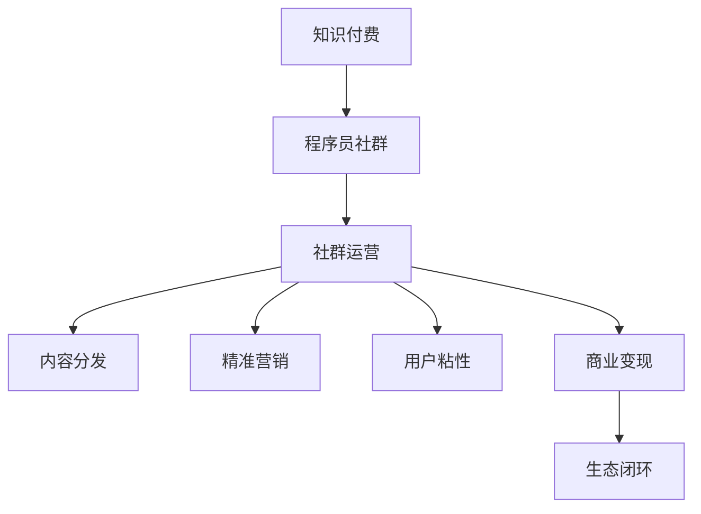

                 

# 知识付费：程序员的社群运营指南

> 关键词：知识付费, 程序员社群, 社群运营, 内容分发, 精准营销, 用户粘性, 商业变现

## 1. 背景介绍

### 1.1 问题由来
随着互联网的迅猛发展和数字经济的崛起，知识付费成为了一个新兴且快速成长的领域。随着全球疫情的蔓延和远程办公模式的普及，更多人选择在线学习和工作，知识付费市场迎来了爆发式增长。然而，面对海量信息、复杂用户需求以及激烈的市场竞争，知识付费平台如何吸引用户、提升用户粘性、实现商业变现，成为了当下亟需解决的重要问题。

### 1.2 问题核心关键点
知识付费平台的核心挑战在于如何构建一个有价值、有黏性、可持续运营的社群生态。该问题可以细化为以下几个关键点：
- 如何吸引并沉淀优质用户。
- 如何提升社群活跃度和粘性。
- 如何实现用户增长与商业变现的平衡。
- 如何构建生态闭环，实现自我循环。

本文将通过探讨知识付费平台中程序员社群的运营策略，提供实用的运营指南，助力平台吸引和培养优质用户，增强社群活跃度和粘性，实现商业变现，最终形成自我循环的良性生态。

### 1.3 问题研究意义
深入研究知识付费平台中程序员社群的运营策略，对于提升平台的用户吸引力和粘性，推动知识付费业务发展，具有重要意义：

1. **提升平台竞争力**：优质的程序员社群能够吸引和沉淀更多技术型用户，为平台提供核心竞争力。
2. **增强用户黏性**：通过精准的社群运营策略，持续提升用户活跃度和粘性，保持平台的生命力。
3. **促进商业变现**：社群中沉淀的用户可以转化为付费用户，实现平台的商业价值最大化。
4. **构建生态闭环**：打造良性循环的社群生态，平台和用户互利共赢。

## 2. 核心概念与联系

### 2.1 核心概念概述
为更好地理解知识付费平台中程序员社群的运营策略，本节将介绍几个核心概念：

- **知识付费**：指通过付费的方式，获取特定知识和信息的服务模式，如在线课程、电子书、音频讲座等。
- **程序员社群**：由一群热爱编程、技术分享和交流的程序员组成的网络社群。
- **社群运营**：指通过多种手段和策略，吸引和维护社群成员，提升社群活跃度和粘性，实现商业变现的过程。
- **内容分发**：指将知识内容精准推送给目标用户，提升内容触及率，优化用户体验。
- **精准营销**：通过数据分析和算法，实现用户画像的精准定位，提升营销效果。
- **用户粘性**：指用户对社群的依赖和忠诚度，反映社群的整体吸引力。
- **商业变现**：指通过用户付费、广告、会员等多种方式，实现平台的商业盈利。
- **生态闭环**：指平台、用户、内容创作者之间的良性循环，实现多方共赢。

这些核心概念之间的逻辑关系可以通过以下Mermaid流程图来展示：



这个流程图展示了知识付费平台中程序员社群的核心概念及其之间的关系：

1. 知识付费为程序员社群提供了平台和资源。
2. 社群运营通过多种策略吸引和维护社群成员。
3. 内容分发和精准营销提升用户体验和触达率。
4. 用户粘性体现社群的吸引力和忠诚度。
5. 商业变现实现平台盈利。
6. 生态闭环体现平台、用户和内容创作者的共赢。

## 3. 核心算法原理 & 具体操作步骤
### 3.1 算法原理概述

知识付费平台中程序员社群的运营，主要依赖于算法和策略的精准实施。其核心思想是通过数据分析、模型训练和策略优化，实现对用户行为的精准预测和优化，从而提升社群的活跃度和粘性，实现商业变现。

形式化地，假设程序员社群的运营目标是最大化用户活跃度和商业收益，记用户活跃度为 $A$，商业收益为 $C$，则运营目标可以表示为：

$$
\mathop{\max}_{策略\ S} A \times C
$$

其中 $S$ 表示一系列的社群运营策略，如内容分发、精准营销、用户互动等。

为了实现上述目标，我们需要设计和实施一系列基于数据驱动的运营策略。这些策略可以细化为以下几个关键步骤：

1. **数据收集与处理**：收集用户行为数据，如浏览记录、互动数据、付费行为等，进行数据清洗和预处理。
2. **用户画像构建**：基于用户行为数据，构建用户画像，识别用户的兴趣、需求和行为特征。
3. **内容推荐与分发**：根据用户画像，推荐个性化的内容，提升内容触达率和用户满意度。
4. **精准营销与互动**：通过精准营销策略，提升用户活跃度和转化率。
5. **用户粘性提升**：通过用户互动、社区建设等手段，增强用户粘性，提升用户留存率。
6. **商业变现优化**：根据用户行为和需求，优化商业变现策略，实现平台的商业盈利。

### 3.2 算法步骤详解

知识付费平台中程序员社群的运营策略主要包括以下几个关键步骤：

**Step 1: 数据收集与处理**
- 收集用户行为数据，如浏览记录、互动数据、付费行为等。
- 进行数据清洗和预处理，去除噪音数据和异常值。
- 使用数据仓库技术，存储和管理用户数据。

**Step 2: 用户画像构建**
- 使用机器学习算法，如K-means聚类、LDA主题模型等，构建用户画像。
- 分析用户画像，识别用户的兴趣、需求和行为特征。
- 定期更新用户画像，保持用户画像的时效性和准确性。

**Step 3: 内容推荐与分发**
- 使用协同过滤、基于内容的推荐算法等，推荐个性化的内容。
- 使用A/B测试等方法，优化内容推荐的算法和策略。
- 定期评估内容推荐的效果，调整推荐策略。

**Step 4: 精准营销与互动**
- 使用精准营销算法，如推荐系统、广告投放等，提升用户转化率。
- 设计互动策略，如问答、讨论、直播等，增强用户粘性。
- 定期分析和优化营销策略，提升营销效果。

**Step 5: 用户粘性提升**
- 通过社区建设、活动策划等手段，增强用户互动和社区氛围。
- 引入KOL、专家等权威人物，提升社群权威性和吸引力。
- 定期发布优质内容，保持社群活跃度。

**Step 6: 商业变现优化**
- 设计多渠道变现策略，如付费课程、广告投放、会员服务等。
- 使用数据分析和A/B测试，优化变现策略和定价模型。
- 定期评估商业变现效果，调整变现策略。

### 3.3 算法优缺点

基于数据驱动的程序员社群运营策略具有以下优点：
1. 精准高效：通过数据分析和算法优化，实现对用户行为的精准预测和优化，提升社群的活跃度和粘性。
2. 灵活多变：能够根据用户反馈和市场变化，灵活调整运营策略，适应快速变化的市场环境。
3. 成本可控：通过精准营销和内容推荐，降低用户获取和维护成本，提升运营效率。
4. 数据驱动：通过数据驱动的运营决策，提升决策的科学性和准确性。

但这些策略也存在一定的局限性：
1. 数据隐私：在数据收集和处理过程中，可能面临用户隐私和数据安全的问题。
2. 算法复杂度：需要复杂的算法和模型进行用户画像构建和推荐算法优化，对技术要求较高。
3. 用户依赖：过度依赖数据和算法，可能忽视用户的主观感受和个性化需求。
4. 用户粘性：过度追求商业变现，可能降低用户对平台的粘性和忠诚度。

尽管存在这些局限性，但就目前而言，基于数据驱动的运营策略仍是最主流和有效的社群运营方式。未来相关研究的重点在于如何进一步优化数据收集和处理，提升算法模型的泛化能力和可解释性，同时兼顾用户的主观感受和个性化需求，保持社群的良性互动和商业变现的平衡。

### 3.4 算法应用领域

基于数据驱动的程序员社群运营策略，已经在知识付费平台中得到了广泛应用，覆盖了内容推荐、精准营销、用户互动等多个环节，具体如下：

1. **内容推荐系统**：通过用户画像和协同过滤算法，实现个性化内容推荐，提升用户满意度。
2. **精准营销广告**：通过数据分析和推荐系统，实现精准投放广告，提升用户转化率。
3. **用户互动社区**：通过社区建设、活动策划等手段，增强用户互动和社区氛围。
4. **用户粘性提升**：通过KOL、专家等权威人物，提升社群权威性和吸引力。
5. **商业变现策略**：通过多渠道变现策略，实现平台的商业盈利。

这些应用领域展示了数据驱动运营策略的强大应用前景，为知识付费平台提供了全面的运营支持。

## 4. 数学模型和公式 & 详细讲解 & 举例说明

### 4.1 数学模型构建

本节将使用数学语言对知识付费平台中程序员社群的运营策略进行更加严格的刻画。

记用户活跃度为 $A$，商业收益为 $C$，用户行为数据为 $\mathcal{D}$。假设用户行为数据与用户画像 $\mathbf{u}$ 和社群内容 $\mathbf{c}$ 之间存在线性关系，则用户活跃度和商业收益可以表示为：

$$
A = f(\mathbf{u}, \mathbf{c})
$$
$$
C = g(\mathbf{u}, \mathbf{c})
$$

其中 $f(\cdot)$ 和 $g(\cdot)$ 为非线性映射函数。

### 4.2 公式推导过程

以下我们以内容推荐系统的用户活跃度为例，推导用户活跃度的计算公式。

假设用户画像 $\mathbf{u}$ 和社群内容 $\mathbf{c}$ 之间的关联度为 $\theta$，则用户活跃度可以表示为：

$$
A = \phi(\mathbf{u}, \mathbf{c}) = \mathbf{u}^T \theta \mathbf{c}
$$

其中 $\phi(\cdot)$ 为非线性映射函数，$\theta$ 为关联度系数矩阵。

根据上述模型，用户活跃度与用户画像和社群内容之间的关系可以通过矩阵乘法表达，即：

$$
A = \mathbf{u}^T \theta \mathbf{c} = \mathbf{A}
$$

将上述公式代入目标函数，得到：

$$
\mathop{\max}_{策略\ S} \mathbf{A}
$$

通过最大化用户活跃度，实现社群运营目标。

### 4.3 案例分析与讲解

以知识付费平台中的课程推荐系统为例，我们分析推荐算法的设计和实现。

假设平台收集了用户浏览、订阅、评论等行为数据，使用协同过滤算法构建用户画像 $\mathbf{u}$ 和课程画像 $\mathbf{c}$。课程画像可以通过课程的标签、作者、评分等特征向量表示。

根据上述公式，我们可以使用矩阵分解技术，将用户画像 $\mathbf{u}$ 和课程画像 $\mathbf{c}$ 分解为低秩矩阵，然后计算关联度系数矩阵 $\theta$：

$$
\theta = \mathbf{U}\mathbf{V}^T
$$

其中 $\mathbf{U}$ 和 $\mathbf{V}$ 分别为用户画像和课程画像的低秩矩阵。

通过上述模型，平台可以计算用户画像与课程画像之间的关联度，从而实现个性化课程推荐。实际应用中，可以通过调整关联度系数矩阵 $\theta$ 的元素，提升推荐效果。

## 5. 项目实践：代码实例和详细解释说明
### 5.1 开发环境搭建

在进行知识付费平台中的程序员社群运营策略实践前，我们需要准备好开发环境。以下是使用Python进行Python脚本开发的配置流程：

1. 安装Python：从官网下载并安装Python，建议选择最新稳定版本。
2. 安装PyTorch：作为深度学习框架，用于实现推荐算法和数据分析模型。
3. 安装NumPy：用于科学计算和矩阵运算。
4. 安装Pandas：用于数据处理和分析。
5. 安装Scikit-learn：用于构建用户画像和推荐算法模型。
6. 安装Flask：用于开发社区互动和营销服务。

完成上述步骤后，即可在开发环境中开始运营策略的实践。

### 5.2 源代码详细实现

下面我们以知识付费平台中的课程推荐系统为例，给出使用PyTorch和Flask实现推荐算法和社区互动服务的Python代码实现。

```python
import torch
import torch.nn as nn
import torch.nn.functional as F
import pandas as pd
import numpy as np
from sklearn.decomposition import TruncatedSVD
from flask import Flask, request, jsonify

class CourseRecommendation(nn.Module):
    def __init__(self, num_users, num_courses, embedding_dim=64):
        super(CourseRecommendation, self).__init__()
        self.user_embedding = nn.Embedding(num_users, embedding_dim)
        self.course_embedding = nn.Embedding(num_courses, embedding_dim)
        self.layer1 = nn.Linear(embedding_dim * 2, 32)
        self.layer2 = nn.Linear(32, num_courses)

    def forward(self, user_id, course_id):
        user_embed = self.user_embedding(user_id)
        course_embed = self.course_embedding(course_id)
        hidden = torch.cat([user_embed, course_embed], dim=1)
        hidden = F.relu(self.layer1(hidden))
        logits = self.layer2(hidden)
        return logits

# 加载数据
data = pd.read_csv('user_course_data.csv')

# 构建用户画像和课程画像
users = set(data['user_id'])
courses = set(data['course_id'])
num_users = len(users)
num_courses = len(courses)
user_matrix = np.zeros((num_users, num_courses))
course_matrix = np.zeros((num_courses, num_users))

for user_id, course_id in data.iterrows():
    user_matrix[user_id - 1][course_id - 1] = 1
    course_matrix[course_id - 1][user_id - 1] = 1

# 矩阵分解
svd = TruncatedSVD(n_components=64)
user_pca = svd.fit_transform(user_matrix)
course_pca = svd.transform(course_matrix)

# 训练模型
model = CourseRecommendation(num_users, num_courses)
criterion = nn.CrossEntropyLoss()
optimizer = torch.optim.Adam(model.parameters(), lr=0.001)

for epoch in range(10):
    for user_id, course_id in data.iterrows():
        optimizer.zero_grad()
        output = model(user_id - 1, course_id - 1)
        loss = criterion(output, course_id - 1)
        loss.backward()
        optimizer.step()

# 保存模型
torch.save(model.state_dict(), 'course_recommendation_model.pth')

# 使用Flask搭建社区互动服务
app = Flask(__name__)

@app.route('/recommend_courses', methods=['POST'])
def recommend_courses():
    user_id = int(request.form['user_id'])
    courses = []
    with torch.no_grad():
        for course_id in range(1, num_courses + 1):
            output = model(user_id - 1, course_id - 1)
            courses.append((course_id, output.argmax().item() + 1))
    return jsonify(courses)

if __name__ == '__main__':
    app.run(debug=True)
```

以上代码实现了基于协同过滤算法的课程推荐系统，并使用Flask搭建了社区互动服务。通过API接口，用户可以获取个性化推荐课程列表，实现社区互动和反馈收集。

### 5.3 代码解读与分析

让我们再详细解读一下关键代码的实现细节：

**CourseRecommendation类**：
- `__init__`方法：初始化用户嵌入和课程嵌入，定义全连接层。
- `forward`方法：定义前向传播，计算课程推荐分数。

**数据加载与处理**：
- 使用Pandas加载用户行为数据。
- 构建用户画像和课程画像，使用TruncatedSVD进行矩阵分解。

**模型训练**：
- 定义协同过滤推荐模型，使用PyTorch实现。
- 定义损失函数和优化器，使用交叉熵损失和Adam优化器进行模型训练。
- 训练模型10个epoch，保存模型参数。

**社区互动服务**：
- 使用Flask搭建API服务，实现用户ID到推荐课程的映射。
- 通过API接口获取用户ID，返回推荐课程列表。

通过上述代码，我们实现了基于协同过滤的课程推荐系统，并搭建了社区互动服务。开发者可以根据具体需求，进一步优化模型和API设计，提升推荐效果和用户体验。

## 6. 实际应用场景
### 6.1 智能客服系统

在知识付费平台中，智能客服系统可以应用于用户咨询、问题解答、课程推荐等多个环节。通过智能客服，平台能够及时响应用户需求，提升用户满意度。

智能客服系统可以通过用户输入的问题，调用推荐算法和营销策略，实时提供个性化答案和推荐课程。同时，平台可以收集用户的互动数据，进行行为分析和用户画像构建，提升智能客服的准确性和用户粘性。

### 6.2 课程内容推荐

课程推荐是知识付费平台的核心功能之一，通过精准推荐，提升用户满意度和课程销量。课程推荐系统可以使用协同过滤、基于内容的推荐算法等，实现个性化课程推荐。

推荐系统通过分析用户画像和课程画像，计算关联度系数矩阵，计算推荐分数，实时更新推荐结果。同时，平台可以通过A/B测试等方法，优化推荐算法和策略，提升推荐效果。

### 6.3 精准营销活动

精准营销是知识付费平台的重要变现方式，通过精准营销活动，平台可以吸引和沉淀更多用户。精准营销活动可以设计成问答、抽奖、直播等多种形式，提升用户参与度和转化率。

精准营销活动可以通过数据分析和用户画像构建，精准定位目标用户，实现高效营销。同时，平台可以收集用户反馈和互动数据，进行行为分析和用户画像更新，提升营销效果和用户粘性。

### 6.4 未来应用展望

随着知识付费平台的不断发展，基于数据驱动的社群运营策略将呈现以下几个发展趋势：

1. **个性化推荐**：推荐算法将更加精准，结合用户画像和行为数据，实现个性化推荐，提升用户满意度。
2. **多模态数据融合**：引入语音、图像、视频等多模态数据，提升推荐效果和用户体验。
3. **实时互动**：通过实时互动技术，提升社区互动和用户粘性。
4. **自动化营销**：引入自动化营销工具，提升营销效果和运营效率。
5. **情感分析**：通过情感分析技术，识别用户情绪和需求，实现更精准的用户画像构建。
6. **用户反馈**：引入用户反馈机制，提升平台体验和用户满意度。

这些趋势展示了知识付费平台中程序员社群运营策略的未来发展方向，将为平台带来更广阔的应用前景和更高的商业价值。

## 7. 工具和资源推荐
### 7.1 学习资源推荐

为了帮助开发者系统掌握知识付费平台中程序员社群的运营策略，这里推荐一些优质的学习资源：

1. **《Python数据分析与机器学习》**：介绍Python数据分析和机器学习的基础知识和常用工具，适合初学者和中级开发者。
2. **《深度学习入门：基于Python的理论与实现》**：深入讲解深度学习的基本理论和常用模型，适合有一定编程基础的学习者。
3. **Coursera和edX的课程**：提供系统化的课程，涵盖机器学习、数据分析、深度学习等多个领域，适合想要全面提升技能的学习者。
4. **Kaggle竞赛平台**：提供丰富的数据集和比赛任务，通过实战提升数据分析和机器学习技能。
5. **GitHub开源项目**：搜索和参考优秀的开源项目，学习实用的开发技术和代码实现。

通过对这些资源的学习实践，相信你一定能够快速掌握知识付费平台中程序员社群的运营策略，并用于解决实际的NLP问题。

### 7.2 开发工具推荐

高效的开发离不开优秀的工具支持。以下是几款用于知识付费平台中程序员社群运营策略开发的常用工具：

1. **Jupyter Notebook**：提供交互式的代码执行环境，方便进行数据处理和模型训练。
2. **Pandas**：用于数据处理和分析，支持多种数据格式和操作。
3. **NumPy**：用于科学计算和矩阵运算，支持高效的数组操作。
4. **PyTorch**：基于Python的深度学习框架，支持高效的模型训练和优化。
5. **Flask**：用于搭建Web服务，实现API接口和社区互动。
6. **TensorBoard**：可视化工具，实时监测模型训练状态，帮助调试和优化。

合理利用这些工具，可以显著提升知识付费平台中程序员社群运营策略的开发效率，加快创新迭代的步伐。

### 7.3 相关论文推荐

知识付费平台中程序员社群运营策略的发展，离不开学界的持续研究。以下是几篇奠基性的相关论文，推荐阅读：

1. **《个性化推荐系统：研究现状与挑战》**：系统回顾了个性化推荐系统的研究现状和挑战，提供了实用的推荐算法和策略。
2. **《基于协同过滤的推荐系统》**：介绍协同过滤算法的基本原理和实现方法，适合入门学习者。
3. **《深度学习在推荐系统中的应用》**：深入讲解深度学习在推荐系统中的应用，适合有一定理论基础的开发者。
4. **《大规模推荐系统》**：介绍大规模推荐系统的设计和实现方法，适合解决复杂推荐问题。
5. **《社交媒体平台中的精准营销》**：分析社交媒体平台中的精准营销策略，提供了实用的营销方法和工具。

这些论文代表了大语言模型微调技术的发展脉络。通过学习这些前沿成果，可以帮助研究者把握学科前进方向，激发更多的创新灵感。

## 8. 总结：未来发展趋势与挑战
### 8.1 总结

本文对知识付费平台中程序员社群的运营策略进行了全面系统的介绍。首先阐述了知识付费平台中程序员社群运营策略的研究背景和意义，明确了社群运营在用户吸引、用户粘性、商业变现等方面的关键作用。其次，从原理到实践，详细讲解了数据驱动的社群运营策略，给出了完整的代码实例。同时，本文还广泛探讨了社群运营策略在智能客服、课程推荐、精准营销等多个领域的应用前景，展示了数据驱动运营策略的强大应用前景。最后，本文精选了社群运营策略的学习资源和开发工具，力求为读者提供全方位的技术指引。

通过本文的系统梳理，可以看到，数据驱动的程序员社群运营策略在知识付费平台中具有广泛的应用前景，能够显著提升平台的用户吸引力和粘性，推动知识付费业务的发展。未来，伴随数据和算法的不断进步，基于数据驱动的运营策略将成为知识付费平台的核心竞争力，推动平台迈向更高的发展台阶。

### 8.2 未来发展趋势

展望未来，知识付费平台中程序员社群运营策略将呈现以下几个发展趋势：

1. **数据驱动**：数据驱动的运营策略将更加精准和高效，通过数据分析和算法优化，提升社群的活跃度和粘性。
2. **多模态融合**：结合语音、图像、视频等多模态数据，提升推荐效果和用户体验。
3. **实时互动**：通过实时互动技术，提升社区互动和用户粘性。
4. **自动化营销**：引入自动化营销工具，提升营销效果和运营效率。
5. **情感分析**：通过情感分析技术，识别用户情绪和需求，实现更精准的用户画像构建。
6. **用户反馈**：引入用户反馈机制，提升平台体验和用户满意度。

这些趋势展示了知识付费平台中程序员社群运营策略的未来发展方向，将为平台带来更广阔的应用前景和更高的商业价值。

### 8.3 面临的挑战

尽管数据驱动的程序员社群运营策略已经取得了显著效果，但在迈向更加智能化、普适化应用的过程中，仍面临诸多挑战：

1. **数据隐私**：在数据收集和处理过程中，可能面临用户隐私和数据安全的问题。
2. **算法复杂度**：需要复杂的算法和模型进行用户画像构建和推荐算法优化，对技术要求较高。
3. **用户依赖**：过度依赖数据和算法，可能忽视用户的主观感受和个性化需求。
4. **用户粘性**：过度追求商业变现，可能降低用户对平台的粘性和忠诚度。
5. **用户反馈**：如何高效收集和处理用户反馈，及时调整运营策略，提升用户满意度。

尽管存在这些挑战，但通过不断优化和改进，数据驱动的运营策略仍是最有效和可行的解决方案。未来相关研究的重点在于如何进一步优化数据收集和处理，提升算法模型的泛化能力和可解释性，同时兼顾用户的主观感受和个性化需求，保持社群的良性互动和商业变现的平衡。

### 8.4 研究展望

面对知识付费平台中程序员社群运营策略所面临的挑战，未来的研究需要在以下几个方面寻求新的突破：

1. **数据隐私保护**：通过数据脱敏和匿名化技术，保护用户隐私和数据安全。
2. **算法模型优化**：开发更加高效和可解释的算法模型，提升算法的泛化能力和可解释性。
3. **用户互动增强**：引入更多互动形式，如直播、问答等，提升用户参与度和粘性。
4. **情感分析**：通过情感分析技术，识别用户情绪和需求，实现更精准的用户画像构建。
5. **用户反馈机制**：建立高效的用户反馈机制，提升用户满意度和平台体验。

这些研究方向的探索，必将引领知识付费平台中程序员社群运营策略迈向更高的台阶，为平台带来更广阔的应用前景和更高的商业价值。

## 9. 附录：常见问题与解答

**Q1：数据驱动的社群运营策略有哪些优势和劣势？**

A: 数据驱动的社群运营策略具有以下优势：
1. 精准高效：通过数据分析和算法优化，实现对用户行为的精准预测和优化，提升社群的活跃度和粘性。
2. 灵活多变：能够根据用户反馈和市场变化，灵活调整运营策略，适应快速变化的市场环境。
3. 成本可控：通过精准营销和内容推荐，降低用户获取和维护成本，提升运营效率。
4. 数据驱动：通过数据驱动的运营决策，提升决策的科学性和准确性。

但这些策略也存在一定的劣势：
1. 数据隐私：在数据收集和处理过程中，可能面临用户隐私和数据安全的问题。
2. 算法复杂度：需要复杂的算法和模型进行用户画像构建和推荐算法优化，对技术要求较高。
3. 用户依赖：过度依赖数据和算法，可能忽视用户的主观感受和个性化需求。
4. 用户粘性：过度追求商业变现，可能降低用户对平台的粘性和忠诚度。

尽管存在这些劣势，但就目前而言，数据驱动的运营策略仍是最主流和有效的社群运营方式。未来相关研究的重点在于如何进一步优化数据收集和处理，提升算法模型的泛化能力和可解释性，同时兼顾用户的主观感受和个性化需求，保持社群的良性互动和商业变现的平衡。

**Q2：如何优化数据驱动的社群运营策略？**

A: 优化数据驱动的社群运营策略可以从以下几个方面入手：
1. 数据质量提升：通过数据清洗和预处理，提升数据质量，降低噪音数据和异常值的影响。
2. 算法模型优化：引入更高效和可解释的算法模型，提升算法的泛化能力和可解释性。
3. 用户画像构建：通过多种数据源和算法，构建更全面和准确的用户画像，识别用户的兴趣、需求和行为特征。
4. 内容推荐优化：通过A/B测试和用户反馈，不断优化推荐算法和策略，提升推荐效果。
5. 用户互动增强：引入更多互动形式，如直播、问答等，提升用户参与度和粘性。
6. 用户反馈机制：建立高效的用户反馈机制，及时调整运营策略，提升用户满意度和平台体验。

通过这些优化措施，可以进一步提升数据驱动的社群运营策略的效果，增强用户粘性和平台竞争力。

**Q3：数据驱动的社群运营策略如何平衡商业变现和用户粘性？**

A: 数据驱动的社群运营策略需要在商业变现和用户粘性之间寻找平衡，主要通过以下几个方面实现：
1. 精准营销：通过精准营销策略，提升用户转化率，增加平台收入。
2. 内容推荐：通过个性化内容推荐，提升用户满意度和留存率。
3. 用户互动：通过社区建设、活动策划等手段，增强用户互动和社区氛围。
4. 用户反馈：通过用户反馈机制，及时调整运营策略，提升用户满意度。

通过精准营销和个性化内容推荐，可以提升商业变现效率。同时，通过社区建设、活动策划等手段，增强用户互动和社区氛围，提升用户粘性。用户反馈机制可以帮助平台及时调整运营策略，平衡商业变现和用户粘性。

通过以上措施，可以构建一个良性循环的社群生态，实现平台、用户和内容创作者的共赢。

