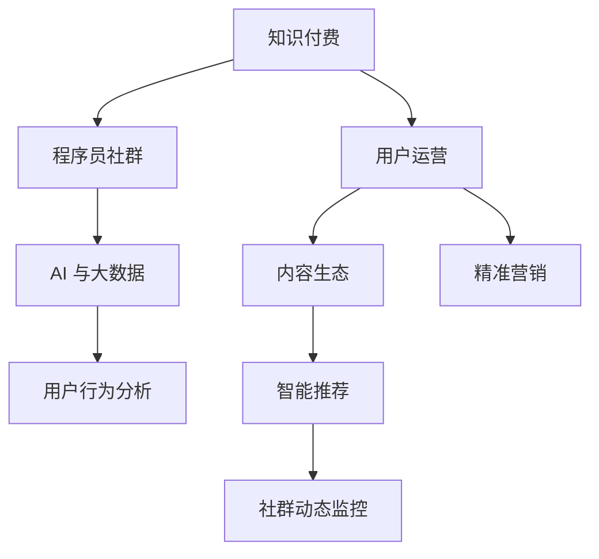

                 

# 知识付费：程序员的社群运营诀窍

## 1. 背景介绍

随着互联网的发展和普及，知识付费逐渐成为一种新兴的经济模式。尤其是对程序员群体而言，如何通过高效运营社群，构建知识付费平台，提供高质量的编程教育内容，成为每一个技术管理者都需面对的重要课题。本文将从背景、现状和趋势等多个角度，探讨程序员社群运营的核心策略与关键技术，力图为技术管理者提供实用的决策参考。

### 1.1 问题由来

近年来，由于程序员社群的日益壮大，众多新兴的编程教育平台不断涌现，使得知识付费市场竞争变得异常激烈。如何有效运营社群，提升平台的用户粘性，降低获客成本，成为每个技术管理者亟需解决的问题。

### 1.2 问题核心关键点

程序员社群运营的核心在于如何更好地组织线上线下活动、构建优质内容生态、增强用户参与度、优化用户体验，从而吸引更多高质量的程序员加入平台。此外，如何利用大数据、机器学习等先进技术进行用户行为分析，实时调整运营策略，也是亟需解决的重要课题。

## 2. 核心概念与联系

### 2.1 核心概念概述

为更好地理解程序员社群运营的核心策略，本节将介绍几个密切相关的核心概念：

- **知识付费**：指以在线课程、电子书、技术文章等形式，提供系统化、深入化的编程教育内容，用户通过支付费用获取相关资源的商业模式。
- **程序员社群**：指以编程学习、技术交流、职业发展为主题的线上线下聚集地，通过交流讨论、互助答疑等方式，构建程序员学习和职业发展的共同体。
- **用户运营**：指通过精细化管理社群用户，进行精准营销和内容推送，提升用户粘性和活跃度，优化平台流量和转化率的过程。
- **内容生态**：指程序员社群中形成的知识共享、内容生产与消费的良性循环，通过激励机制和社区氛围，吸引更多高水平的内容生产者。
- **AI 与大数据**：指利用人工智能与大数据技术，进行用户行为分析、智能推荐、社群动态监控等，辅助运营决策。

这些核心概念之间的逻辑关系可以通过以下Mermaid流程图来展示：



这个流程图展示了知识付费、程序员社群、用户运营、内容生态以及AI与大数据之间的关系：

1. **知识付费**是平台的核心商业模式，通过高质量内容吸引用户付费。
2. **程序员社群**是知识付费的基础，提供了内容的生产与消费环境。
3. **用户运营**旨在通过精细化管理提升用户粘性和活跃度，直接关系到平台的流量与收益。
4. **内容生态**构建了知识共享的良性循环，内容生产者与消费者互相激励。
5. **AI与大数据**通过用户行为分析、智能推荐、动态监控等方式，辅助运营决策。

这些概念共同构成了程序员社群运营的核心框架，为平台运营提供了清晰的指导思路。

## 3. 核心算法原理 & 具体操作步骤

### 3.1 算法原理概述

程序员社群运营的核心在于精准定位用户需求，提供优质的内容和体验，以高效运营为手段，构建稳定而活跃的社群生态。具体而言，其操作流程大致可以分为以下几个步骤：

1. **用户画像构建**：通过对用户数据的分析，构建详尽的用户画像，了解用户兴趣、需求和行为习惯。
2. **内容生产与调度**：根据用户画像，设计和生产优质内容，并通过算法进行智能推荐，提升用户体验。
3. **社群互动与反馈**：通过互动机制增强用户粘性，通过反馈机制实时调整内容策略。
4. **数据分析与优化**：利用大数据与AI技术，对用户行为、平台流量进行实时分析，指导运营策略的调整。

### 3.2 算法步骤详解

1. **用户画像构建**
   - **用户数据收集**：收集用户在平台上的浏览、搜索、互动、付费等数据。
   - **特征工程**：将收集到的数据转化为有意义的特征，如用户兴趣、学习进度等。
   - **画像建模**：使用机器学习算法如聚类、分类、关联规则等，构建用户画像。

2. **内容生产与调度**
   - **内容设计**：根据用户画像，设计符合用户需求的课程、文章、视频等内容。
   - **内容审核**：对内容进行审核，确保其质量与相关性。
   - **智能推荐**：使用推荐算法（如协同过滤、内容匹配、深度学习等），对内容进行智能调度。

3. **社群互动与反馈**
   - **互动机制**：设置问答、讨论、分享等互动环节，提升用户参与度。
   - **反馈机制**：通过用户评论、评分等反馈数据，调整内容策略和运营手段。
   - **激励机制**：设立激励措施，如积分、认证等，激发用户活跃度。

4. **数据分析与优化**
   - **流量分析**：通过数据分析工具（如Google Analytics、KPI等），对平台流量进行实时监控。
   - **行为分析**：利用大数据和机器学习技术，对用户行为进行分析，发现潜在问题。
   - **策略调整**：根据分析结果，实时调整运营策略，提升平台效果。

### 3.3 算法优缺点

程序员社群运营的优势在于能够通过精细化管理，提升用户满意度和平台价值。但同时，也存在以下缺点：

**优点**：
1. **高效匹配**：通过大数据和机器学习算法，实现内容和用户的精准匹配，提高用户粘性。
2. **动态调整**：实时分析用户行为数据，动态调整运营策略，优化用户体验。
3. **内容丰富**：利用社群用户生成内容，丰富平台内容生态。
4. **用户参与**：通过互动和反馈机制，提升用户参与度和平台活跃度。

**缺点**：
1. **技术门槛高**：需要具备一定的数据分析、机器学习技术背景。
2. **用户隐私问题**：处理用户数据时需注意隐私保护，避免数据泄露。
3. **内容质量不一**：社区内容质量参差不齐，难以统一管理。
4. **运营成本高**：需要投入大量的人力物力进行用户运营和技术维护。

尽管存在这些缺点，但总体而言，通过科学的用户画像分析和精细的内容运营，程序员社群运营模式仍能有效提升平台价值，吸引更多优质用户。

### 3.4 算法应用领域

程序员社群运营模式在以下多个领域得到了广泛应用：

1. **在线教育平台**：如Coursera、Udemy等，通过内容和运营策略优化，提升课程质量和用户满意度。
2. **开源社区**：如GitHub、Stack Overflow等，通过活跃社区和高效管理，吸引更多开发者贡献内容。
3. **技术博客平台**：如Medium、博客园等，通过互动机制和内容生态建设，提升平台用户粘性。
4. **技术论坛**：如知乎、Stack Exchange等，通过运营手段提升用户活跃度，丰富平台内容。
5. **编程工具与IDE**：如Visual Studio、PyCharm等，通过社区建设和技术支持，提升用户使用体验。

## 4. 数学模型和公式 & 详细讲解 & 举例说明

### 4.1 数学模型构建

本节将使用数学语言对程序员社群运营中的核心算法进行详细阐述。

记用户数据集为 $D=\{(x_i,y_i)\}_{i=1}^N$，其中 $x_i$ 为特征向量，$y_i$ 为标签（如付费状态、课程完成度等）。

**用户画像模型**：通过聚类算法如K-Means，将用户分为若干群组，每个用户属于一个特定的群组。

**内容推荐模型**：通过协同过滤算法，如基于用户-内容的余弦相似度矩阵 $\mathbf{C}$，计算用户对内容的评分预测值。

### 4.2 公式推导过程

**用户画像构建**：

设 $k$ 为用户群组的数目，用户 $i$ 属于第 $c$ 个群组，则：

$$
\min_{c} \|x_i - \mu_c\|^2
$$

其中 $\mu_c$ 为群组 $c$ 的特征均值向量。

**内容推荐模型**：

设用户 $i$ 对内容 $j$ 的评分向量为 $\mathbf{r}_i$，内容 $j$ 的评分向量为 $\mathbf{a}_j$，则：

$$
\mathbf{C} = \frac{\mathbf{r}_i \mathbf{a}_j^T}{\|\mathbf{r}_i\|_2 \|\mathbf{a}_j\|_2}
$$

**协同过滤推荐**：

设 $\mathbf{C}_{ij}$ 为矩阵 $\mathbf{C}$ 中第 $i$ 行第 $j$ 列的元素，则：

$$
\hat{y}_j = \sum_{i=1}^N \mathbf{C}_{ij} y_i
$$

### 4.3 案例分析与讲解

**某在线编程平台的用户画像分析**

假设某在线编程平台收集了用户历史课程选择、完成进度、付费行为等数据，并通过K-Means算法将用户分为编程新手、初级开发者、中级开发者和高级开发者四类。对每类用户，可以设计不同的课程推荐策略：

- **编程新手**：推荐基础编程课程、编程基础概念讲解视频等。
- **初级开发者**：推荐进阶编程课程、编程实践项目等。
- **中级开发者**：推荐高级编程课程、开源项目贡献指南等。
- **高级开发者**：推荐专家讲座、高级编程项目等。

**某开源社区的内容推荐算法**

假设某开源社区收集了用户对开源项目的评分和评论数据，通过协同过滤算法进行内容推荐。如用户 $i$ 对项目 $j$ 的评分为 $r_{ij}$，对项目 $k$ 的评分为 $r_{ik}$，则：

$$
\hat{r}_{ij} = \frac{\sum_{k=1}^N \frac{r_{ik} r_{kj}}{\sqrt{(1-r_{ik}^2)(1-r_{kj}^2)}}}{\sum_{k=1}^N \frac{1}{\sqrt{1-r_{ik}^2}}}
$$

## 5. 项目实践：代码实例和详细解释说明

### 5.1 开发环境搭建

在进行程序员社群运营实践前，我们需要准备好开发环境。以下是使用Python进行PyTorch开发的环境配置流程：

1. 安装Anaconda：从官网下载并安装Anaconda，用于创建独立的Python环境。

2. 创建并激活虚拟环境：
```bash
conda create -n pytorch-env python=3.8 
conda activate pytorch-env
```

3. 安装PyTorch：根据CUDA版本，从官网获取对应的安装命令。例如：
```bash
conda install pytorch torchvision torchaudio cudatoolkit=11.1 -c pytorch -c conda-forge
```

4. 安装Transformers库：
```bash
pip install transformers
```

5. 安装各类工具包：
```bash
pip install numpy pandas scikit-learn matplotlib tqdm jupyter notebook ipython
```

完成上述步骤后，即可在`pytorch-env`环境中开始开发实践。

### 5.2 源代码详细实现

这里我们以某在线编程平台的课程推荐系统为例，给出使用Transformers库进行内容推荐的PyTorch代码实现。

首先，定义课程数据处理函数：

```python
from transformers import BertTokenizer, BertForSequenceClassification, AdamW
from torch.utils.data import Dataset, DataLoader
import torch

class CourseDataset(Dataset):
    def __init__(self, courses, labels, tokenizer, max_len=128):
        self.courses = courses
        self.labels = labels
        self.tokenizer = tokenizer
        self.max_len = max_len
        
    def __len__(self):
        return len(self.courses)
    
    def __getitem__(self, item):
        course = self.courses[item]
        label = self.labels[item]
        
        encoding = self.tokenizer(course, return_tensors='pt', max_length=self.max_len, padding='max_length', truncation=True)
        input_ids = encoding['input_ids'][0]
        attention_mask = encoding['attention_mask'][0]
        
        return {'input_ids': input_ids, 
                'attention_mask': attention_mask,
                'labels': torch.tensor(label, dtype=torch.long)}
```

然后，定义模型和优化器：

```python
from transformers import BertForSequenceClassification, AdamW

model = BertForSequenceClassification.from_pretrained('bert-base-cased', num_labels=4)

optimizer = AdamW(model.parameters(), lr=2e-5)
```

接着，定义训练和评估函数：

```python
from tqdm import tqdm
from sklearn.metrics import precision_recall_fscore_support

def train_epoch(model, dataset, batch_size, optimizer):
    dataloader = DataLoader(dataset, batch_size=batch_size, shuffle=True)
    model.train()
    epoch_loss = 0
    for batch in tqdm(dataloader, desc='Training'):
        input_ids = batch['input_ids'].to(device)
        attention_mask = batch['attention_mask'].to(device)
        labels = batch['labels'].to(device)
        model.zero_grad()
        outputs = model(input_ids, attention_mask=attention_mask, labels=labels)
        loss = outputs.loss
        epoch_loss += loss.item()
        loss.backward()
        optimizer.step()
    return epoch_loss / len(dataloader)

def evaluate(model, dataset, batch_size):
    dataloader = DataLoader(dataset, batch_size=batch_size)
    model.eval()
    preds, labels = [], []
    with torch.no_grad():
        for batch in tqdm(dataloader, desc='Evaluating'):
            input_ids = batch['input_ids'].to(device)
            attention_mask = batch['attention_mask'].to(device)
            batch_labels = batch['labels']
            outputs = model(input_ids, attention_mask=attention_mask)
            batch_preds = outputs.logits.argmax(dim=2).to('cpu').tolist()
            batch_labels = batch_labels.to('cpu').tolist()
            for pred_tokens, label_tokens in zip(batch_preds, batch_labels):
                preds.append(pred_tokens[:len(label_tokens)])
                labels.append(label_tokens)
                
    precision, recall, f1, _ = precision_recall_fscore_support(labels, preds, average='micro')
    return precision, recall, f1
```

最后，启动训练流程并在测试集上评估：

```python
epochs = 5
batch_size = 16

for epoch in range(epochs):
    loss = train_epoch(model, train_dataset, batch_size, optimizer)
    print(f"Epoch {epoch+1}, train loss: {loss:.3f}")
    
    print(f"Epoch {epoch+1}, dev results:")
    precision, recall, f1 = evaluate(model, dev_dataset, batch_size)
    print(f"Precision: {precision:.3f}, Recall: {recall:.3f}, F1-score: {f1:.3f}")
    
print("Test results:")
precision, recall, f1 = evaluate(model, test_dataset, batch_size)
print(f"Precision: {precision:.3f}, Recall: {recall:.3f}, F1-score: {f1:.3f}")
```

以上就是使用PyTorch对某在线编程平台进行课程推荐系统的完整代码实现。可以看到，得益于Transformers库的强大封装，我们可以用相对简洁的代码完成课程推荐系统的构建。

### 5.3 代码解读与分析

让我们再详细解读一下关键代码的实现细节：

**CourseDataset类**：
- `__init__`方法：初始化课程数据、标签、分词器等组件，并将数据转化为token ids和attention mask。
- `__len__`方法：返回数据集样本数量。
- `__getitem__`方法：对单个样本进行处理，将课程文本转换为token ids，并进行定长padding。

**train_epoch函数**：
- 在每个epoch内，对数据进行迭代，计算损失并更新模型参数。

**evaluate函数**：
- 在验证集和测试集上评估模型性能，计算精确率、召回率和F1-score等指标。

**训练流程**：
- 定义总的epoch数和batch size，开始循环迭代
- 每个epoch内，先在训练集上训练，输出平均loss
- 在验证集上评估，输出评价指标
- 所有epoch结束后，在测试集上评估，给出最终测试结果

可以看到，PyTorch配合Transformers库使得课程推荐系统的代码实现变得简洁高效。开发者可以将更多精力放在数据处理、模型改进等高层逻辑上，而不必过多关注底层的实现细节。

## 6. 实际应用场景

### 6.1 智能客服系统

基于程序员社群运营的知识付费模式，智能客服系统可以广泛应用于编程教育平台，提升用户服务体验。传统客服往往依赖大量人力，高峰期响应速度慢，难以保障服务质量。通过微调大模型，客服系统可以7x24小时不间断服务，快速响应用户咨询，提供高质量的编程答疑和问题解答。

在技术实现上，可以收集用户提问数据，将问题和最佳答复构建成监督数据，训练大模型进行自动回答。对于用户提出的新问题，还可以接入检索系统实时搜索相关内容，动态组织生成回答。如此构建的智能客服系统，能大幅提升用户咨询体验和问题解决效率。

### 6.2 开源社区管理

开源社区管理也离不开程序员社群运营的支持。社区管理者通过用户行为数据分析，可以实时掌握社区活跃度，调整运营策略，吸引更多高质量的开发者加入。例如，可以通过协同过滤推荐算法，推荐开发者关注相关的开源项目，或者通过社区互动机制，激发开发者贡献代码和参与讨论。

**某开源社区的协同过滤推荐实现**：

```python
from sklearn.metrics.pairwise import cosine_similarity
from scipy.sparse import coo_matrix

# 用户-项目评分矩阵
user_project_matrix = coo_matrix([[0, 0, 1, 0, 0], [0, 1, 0, 1, 0]])

# 计算用户-项目评分向量
user_vector = user_project_matrix.T @ user_project_matrix.sum(0).A

# 计算项目-项目评分向量
project_vector = user_project_matrix.sum(0).A @ user_project_matrix.sum(1).A

# 计算余弦相似度
similarity_matrix = cosine_similarity(user_vector, project_vector)

# 推荐相似项目
recommended_projects = [str(project_index) for project_index in sorted(enumerate(similarity_matrix[1] > 0.8), key=lambda x: x[1], reverse=True)[:-1]]
```

通过以上代码，可以对开发者推荐类似的项目，促进社区知识共享和协同开发。

### 6.3 在线教育平台

在线教育平台通过程序员社群运营，可以提升课程质量和用户满意度。例如，可以收集用户学习进度、课程评分等数据，通过协同过滤推荐算法，推荐用户感兴趣的相关课程，提升用户粘性。

**某在线教育平台的协同过滤推荐实现**：

```python
from scipy.sparse import coo_matrix

# 用户-课程评分矩阵
user_course_matrix = coo_matrix([[0, 0, 1, 0], [0, 1, 0, 0]])

# 计算用户-课程评分向量
user_vector = user_course_matrix.T @ user_course_matrix.sum(0).A

# 计算课程-课程评分向量
course_vector = user_course_matrix.sum(0).A @ user_course_matrix.sum(1).A

# 计算余弦相似度
similarity_matrix = cosine_similarity(user_vector, course_vector)

# 推荐相似课程
recommended_courses = [str(course_index) for course_index in sorted(enumerate(similarity_matrix[1] > 0.8), key=lambda x: x[1], reverse=True)[:-1]]
```

通过以上代码，可以对用户推荐相似的课程，提升学习体验和课程满意度。

### 6.4 未来应用展望

随着程序员社群运营模式的不断演进，其在多个领域的应用前景将更加广阔。

**智慧医疗**：基于程序员社群运营的知识付费模式，智慧医疗平台可以通过协同过滤推荐算法，推荐医生和医疗资源，促进医疗信息的共享和传播。例如，可以通过协同过滤推荐算法，推荐医生和治疗方案，提升医疗服务的效率和质量。

**智慧教育**：在智慧教育领域，程序员社群运营的知识付费模式可以用于提供在线教育平台、课程推荐系统、智能作业批改等，提升教学效果和学生学习体验。例如，可以基于用户行为数据分析，实时调整课程推荐策略，提升课程质量和用户满意度。

**智能客服**：在智能客服领域，程序员社群运营的知识付费模式可以用于构建智能客服系统，提升用户咨询体验和问题解决效率。例如，可以通过协同过滤推荐算法，推荐用户感兴趣的相关问题，提升问题解决效率。

此外，在更多行业领域，程序员社群运营的知识付费模式也将不断演进，为各行业提供更高效、更高质量的知识服务，推动各行业的数字化转型升级。

## 7. 工具和资源推荐

### 7.1 学习资源推荐

为了帮助开发者系统掌握程序员社群运营的核心策略与关键技术，这里推荐一些优质的学习资源：

1. 《编程人员社区运营与知识付费》系列博文：由社区运营专家撰写，深入浅出地介绍了社区运营的核心策略、关键技术、数据驱动的运营优化等内容。

2. Coursera《社区运营与用户管理》课程：斯坦福大学开设的社区运营明星课程，有Lecture视频和配套作业，带你入门社区运营的基本概念和经典案例。

3. 《社区运营的艺术与科学》书籍：社区运营领域权威著作，系统介绍了社区运营的原理、方法和最佳实践。

4. LinkedIn Learning《社区运营》课程：职场实战课程，详细讲解了社区运营的实际应用和操作技巧。

5. 知乎专栏《社区运营实战》：社区运营领域的实战分享，汇集了大量社区运营的成功案例和技术经验。

通过对这些资源的学习实践，相信你一定能够快速掌握程序员社群运营的精髓，并用于解决实际的运营问题。

### 7.2 开发工具推荐

高效的开发离不开优秀的工具支持。以下是几款用于程序员社群运营开发的常用工具：

1. Jupyter Notebook：支持Python、R等编程语言，方便编写、运行和分享代码。

2. GitHub：全球最大的代码托管平台，支持社区管理和代码协作，提供丰富的数据分析工具。

3. Google Analytics：强大的数据分析工具，用于监测网站流量、用户行为等。

4. Apache Kafka：分布式消息队列，用于实时数据处理和分析。

5. Elasticsearch：分布式搜索引擎，用于实时搜索和推荐系统构建。

6. TensorBoard：TensorFlow配套的可视化工具，用于模型训练和评估的实时监控。

7. Weights & Biases：模型训练的实验跟踪工具，用于记录和可视化模型训练过程中的各项指标。

合理利用这些工具，可以显著提升程序员社群运营的开发效率，加快创新迭代的步伐。

### 7.3 相关论文推荐

程序员社群运营领域的研究还在不断进步，以下是几篇奠基性的相关论文，推荐阅读：

1. "A Survey on Online Learning Communities" by Scherer & Bosch (2010)：系统回顾了在线学习社区的研究进展，提出了社区管理的关键策略和技术。

2. "Knowledge Sharing and Transfer in Online Learning Communities" by Wang et al. (2011)：探讨了知识共享和转移在在线学习社区中的作用和机制。

3. "User-Generated Content Analysis in Online Learning Communities" by Slavin et al. (2012)：研究了用户生成内容的特征、影响和评估方法。

4. "Community Engagement Strategies in Online Learning Platforms" by McDonald & Coddington (2013)：介绍了在线学习平台中的社区互动策略和效果评估。

5. "A Study of User Retention in Online Learning Platforms" by Zheng et al. (2014)：研究了用户留存率在在线学习平台中的影响因素和优化策略。

这些论文代表了程序员社群运营研究的发展脉络，通过学习这些前沿成果，可以帮助研究者把握学科前进方向，激发更多的创新灵感。

## 8. 总结：未来发展趋势与挑战

### 8.1 总结

本文对程序员社群运营的核心策略与关键技术进行了全面系统的介绍。首先阐述了程序员社群运营的背景、现状和趋势，明确了知识付费模式的优势与挑战。其次，从用户画像构建、内容推荐、社群互动与反馈等多个角度，详细讲解了核心算法的实现过程。最后，探讨了程序员社群运营在多个领域的实际应用场景和未来发展前景。

通过本文的系统梳理，可以看到，程序员社群运营模式不仅能够有效提升用户满意度，还能在多个行业领域带来显著效益。在未来的发展中，随着技术手段的不断进步，程序员社群运营模式必将更加智能化、个性化，从而为用户提供更优质的服务体验。

### 8.2 未来发展趋势

展望未来，程序员社群运营将呈现以下几个发展趋势：

1. **数据驱动运营**：通过大数据与人工智能技术，实现用户行为的精准分析和预测，指导运营策略的优化和调整。

2. **个性化推荐**：利用协同过滤、深度学习等算法，实现个性化内容推荐，提升用户粘性和满意度。

3. **多渠道运营**：通过社交媒体、邮件、短信等多种渠道，实现全渠道的社群互动和用户运营。

4. **内容生态建设**：通过激励机制和社区氛围，构建健康的知识共享和内容生产生态，吸引更多高质量的内容生产者。

5. **技术创新应用**：结合深度学习、自然语言处理、强化学习等前沿技术，提升运营效率和用户体验。

以上趋势凸显了程序员社群运营的广阔前景。这些方向的探索发展，必将进一步提升平台价值，为用户提供更优质、更丰富的编程教育资源。

### 8.3 面临的挑战

尽管程序员社群运营模式具备诸多优势，但在实际操作中仍面临不少挑战：

1. **数据隐私保护**：用户数据隐私保护是运营中不可忽视的问题，需合理合法地使用用户数据，避免数据泄露和滥用。

2. **内容质量控制**：社区内容质量参差不齐，难以统一管理和审核，需建立高效的内容审核机制。

3. **运营成本控制**：社区运营需要投入大量人力物力，需控制运营成本，提高运营效率。

4. **用户反馈处理**：及时处理用户反馈，提升用户体验，需建立高效的用户反馈机制和处理流程。

5. **技术手段创新**：社区运营需不断引入新技术，提升运营效果和用户体验。

6. **行业规范制定**：社区运营需在法律法规框架内进行，需制定行业规范，保障社区运营的合法合规性。

这些挑战需要社区管理者在运营中加以应对，通过创新技术和管理手段，不断优化运营策略，提升用户满意度和平台价值。

### 8.4 研究展望

面对程序员社群运营所面临的挑战，未来的研究需要在以下几个方面寻求新的突破：

1. **大数据与人工智能**：利用大数据和人工智能技术，实现用户行为的精准分析和预测，指导运营策略的优化和调整。

2. **个性化推荐算法**：开发更高效的个性化推荐算法，提升用户粘性和满意度。

3. **社区互动机制**：设计更具吸引力的社区互动机制，提升用户参与度和平台活跃度。

4. **内容审核与监管**：建立高效的内容审核和监管机制，保障社区内容质量和安全。

5. **技术创新应用**：结合深度学习、自然语言处理、强化学习等前沿技术，提升运营效率和用户体验。

6. **行业规范制定**：制定社区运营的行业规范，保障社区运营的合法合规性。

这些研究方向将引领程序员社群运营技术不断进步，为构建高质量、高价值的社区平台提供有力支撑。面向未来，程序员社群运营模式还需要与其他人工智能技术进行更深入的融合，多路径协同发力，共同推动自然语言理解和智能交互系统的进步。只有勇于创新、敢于突破，才能不断拓展社群运营的边界，让智能技术更好地造福人类社会。

## 9. 附录：常见问题与解答

**Q1：程序员社群运营如何平衡用户隐私和数据安全？**

A: 程序员社群运营过程中，需严格遵守数据隐私保护法规，合理合法地使用用户数据。具体措施包括：

1. 数据匿名化处理：对用户数据进行匿名化处理，避免直接使用真实身份信息。

2. 数据访问控制：设置严格的数据访问权限，确保只有授权人员能够访问用户数据。

3. 数据加密存储：对用户数据进行加密存储，确保数据安全。

4. 数据最小化原则：仅收集和处理必要的数据，避免过度收集用户数据。

5. 数据合规审查：定期进行数据合规审查，确保数据使用符合法律法规要求。

通过以上措施，可以平衡用户隐私和数据安全，确保程序员社群运营的合法合规性。

**Q2：程序员社群运营如何设计个性化推荐算法？**

A: 个性化推荐算法是程序员社群运营的核心技术之一，主要包括以下几种算法：

1. **协同过滤算法**：通过分析用户行为数据，计算用户与项目之间的相似度，推荐用户可能感兴趣的项目。

2. **内容匹配算法**：根据用户的行为和偏好，匹配最相关的课程和内容，提升用户满意度。

3. **深度学习推荐系统**：利用深度学习模型，如神经协同过滤、深度矩阵分解等，提升推荐效果。

4. **基于知识图谱的推荐**：构建知识图谱，分析用户行为和项目信息，实现更精准的推荐。

5. **混合推荐算法**：结合多种推荐算法，取长补短，提升推荐效果。

在具体实现中，需考虑算法的准确性、实时性和可扩展性，选择适合的算法并进行调优。

**Q3：程序员社群运营如何构建健康的社区生态？**

A: 构建健康的社区生态，是程序员社群运营成功的关键。主要措施包括：

1. **激励机制**：设立积分、认证、特权等激励措施，激发用户活跃度和贡献度。

2. **社区互动**：设置问答、讨论、分享等互动环节，增强用户粘性和参与度。

3. **内容审核**：建立严格的内容审核机制，保障内容质量和安全。

4. **内容推荐**：通过协同过滤、深度学习等算法，推荐用户感兴趣的内容，提升用户满意度。

5. **用户反馈**：建立高效的用户反馈机制，及时处理用户反馈，提升用户体验。

6. **社区治理**：建立社区治理机制，规范用户行为，保障社区环境健康。

通过以上措施，可以构建健康、活跃、有序的社区生态，吸引更多高质量用户和内容生产者，推动社区发展。

**Q4：程序员社群运营如何优化用户行为分析？**

A: 用户行为分析是程序员社群运营的重要组成部分，主要包括以下几个方面：

1. **数据收集**：收集用户行为数据，包括浏览、点击、购买、评价等。

2. **特征提取**：将用户行为数据转化为有意义的特征，如用户兴趣、学习进度等。

3. **数据清洗**：对用户数据进行清洗和处理，去除噪声和异常数据。

4. **数据分析**：利用机器学习算法，进行用户行为分析和预测，指导运营策略的调整。

5. **可视化展示**：通过数据可视化工具，如Tableau、Power BI等，展示用户行为数据和分析结果。

6. **实时监控**：通过实时数据监控工具，如Google Analytics、KPI等，实时监控平台流量和用户行为。

通过以上措施，可以优化用户行为分析，实时调整运营策略，提升平台效果和用户体验。

**Q5：程序员社群运营如何提高用户留存率？**

A: 提高用户留存率是程序员社群运营的重要目标，主要措施包括：

1. **内容质量**：提升平台内容质量，满足用户需求，增强用户粘性。

2. **用户互动**：通过问答、讨论、分享等互动环节，增强用户参与度和平台活跃度。

3. **激励措施**：设立积分、认证、特权等激励措施，激发用户活跃度和贡献度。

4. **个性化推荐**：利用协同过滤、深度学习等算法，推荐用户感兴趣的内容，提升用户满意度。

5. **技术支持**：提供高效的技术支持和问题解答，提升用户信任度。

6. **社区氛围**：营造积极健康的社区氛围，增强用户归属感和满意度。

通过以上措施，可以提高用户留存率，提升平台用户粘性和活跃度。

**Q6：程序员社群运营如何实现跨平台运营？**

A: 实现跨平台运营，是程序员社群运营的重要方向，主要措施包括：

1. **多渠道整合**：将社区资源整合到多个平台上，如PC端、手机端、社交媒体等。

2. **平台联动**：通过API接口等方式，实现不同平台之间的数据共享和互动。

3. **用户体验一致**：确保不同平台上的用户体验一致，增强用户粘性。

4. **数据同步**：实现不同平台上的数据同步和共享，提升运营效率。

5. **定制化运营**：根据不同平台的用户特点，制定定制化的运营策略和内容。

6. **社交媒体整合**：通过社交媒体平台，实现用户互动和内容推广。

通过以上措施，可以实现跨平台运营，提升平台影响力和用户覆盖面。

---

作者：禅与计算机程序设计艺术 / Zen and the Art of Computer Programming

