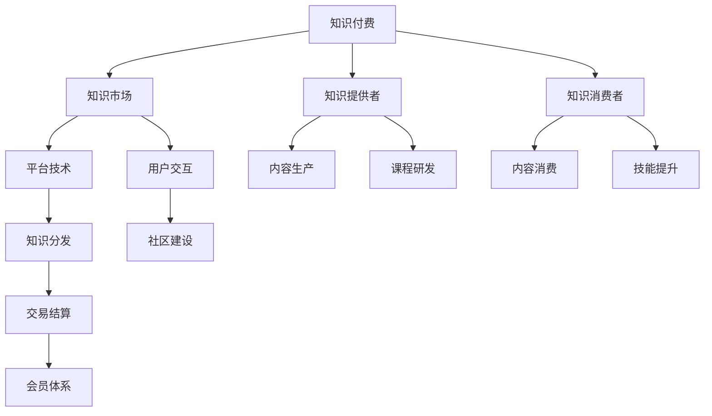

                 

# 知识付费：程序员的财富密码

> 关键词：知识付费, 程序员, 大数据, 人工智能, 区块链, 经济模型, 社区构建

## 1. 背景介绍

### 1.1 问题由来

随着互联网和信息技术的发展，知识的传播和获取方式发生了巨大的变革。传统的教育模式和信息传播方式已无法满足日益增长的知识需求。特别是对于程序员这样的技术密集型职业，快速获取最新技术、提升编程技能、拓展职业路径成为刚需。在此背景下，知识付费应运而生，并成为一种新的经济模式和行业现象。

### 1.2 问题核心关键点

知识付费的核心在于通过互联网技术，将专业知识、技能培训、工具使用等有价值的知识以付费方式提供给需求者。这不仅满足了用户个性化、快速化的知识获取需求，也为知识提供者开辟了新的收入来源，促进了知识和技术的流动与共享。知识付费平台通过聚合优质内容，形成知识生态系统，实现了知识的商业化运作。

### 1.3 问题研究意义

深入研究知识付费模式，对程序员职业发展具有重要意义：

1. **提升技能**：程序员通过付费订阅或购买高质量的课程、书籍、工具包等，能够系统、全面地学习新知识、新技术，提升编程能力和职业竞争力。
2. **拓展视野**：知识付费平台聚集了行业顶尖专家和技术大牛，程序员可以通过学习这些专家的经验和方法，拓展技术视野和思维方式。
3. **加速成长**：程序员可以通过快速获取最新行业动态、学习先进技术，缩短职业成长周期，更快地实现自我价值。
4. **推动行业发展**：知识付费模式激发了程序员学习和分享知识的主动性和积极性，推动了整个行业技术水平和创新能力的提升。

## 2. 核心概念与联系

### 2.1 核心概念概述

为更好地理解知识付费模式，本节将介绍几个关键概念：

- **知识付费**：通过互联网技术，将专业知识、技能培训、工具使用等有价值的知识以付费方式提供给用户。
- **知识市场**：由知识提供者和知识消费者组成，通过平台进行交易和交流的虚拟市场。
- **知识提供者**：拥有专业知识和技术技能的专家、开发者、学者等，通过知识付费平台将知识商品化。
- **知识消费者**：需要提升技能、拓展视野、解决技术问题的程序员和其他用户，通过付费获取所需知识。
- **平台经济**：利用技术手段，聚合和分发知识内容，形成知识供需关系的网络平台。

这些概念之间的逻辑关系可以通过以下Mermaid流程图来展示：



这个流程图展示了知识付费的核心要素及其相互关系：

1. 知识付费平台通过技术手段汇聚知识提供者和消费者，形成知识市场。
2. 知识提供者通过内容生产、课程研发等方式生成知识商品。
3. 知识消费者通过内容消费、技能提升等方式获取知识服务。
4. 平台提供技术支撑，包括知识分发、用户交互、交易结算等。
5. 平台社区建设有助于知识共享和交流，促进知识生态的形成。

## 3. 核心算法原理 & 具体操作步骤

### 3.1 算法原理概述

知识付费平台的核心算法主要围绕用户行为分析、内容推荐、价格策略等方面展开。其基本流程为：

1. **用户行为分析**：通过数据收集和分析，理解用户需求和偏好，进行个性化推荐。
2. **内容推荐**：利用机器学习算法，根据用户历史行为和兴趣，推荐合适的知识商品。
3. **价格策略**：根据商品价值、市场供需、用户消费能力等因素，制定合理的定价策略。

### 3.2 算法步骤详解

以下详细介绍知识付费平台的核心算法步骤：

**Step 1: 数据收集与处理**

- 收集用户行为数据，包括搜索记录、购买记录、评分反馈等。
- 对数据进行清洗和处理，去除噪声和冗余信息，构建用户画像。

**Step 2: 用户行为分析**

- 利用协同过滤算法，分析用户间的相似性和偏好，进行个性化推荐。
- 通过聚类分析，发现用户兴趣群体，进行分类推荐。
- 采用关联规则挖掘，发现用户购买行为中的潜在关联，进行交叉推荐。

**Step 3: 内容推荐**

- 使用协同过滤算法，根据用户历史行为推荐相似商品。
- 应用内容协同过滤算法，根据商品特征进行推荐。
- 利用深度学习模型，如卷积神经网络（CNN）、循环神经网络（RNN）、Transformer等，构建推荐系统，提升推荐精度。

**Step 4: 价格策略制定**

- 基于商品价值、市场供需、用户消费能力等因素，制定动态定价策略。
- 使用动态定价模型，如收益管理、拍卖理论等，优化定价方案。
- 考虑用户心理预期和市场波动，灵活调整价格。

**Step 5: 交易结算与用户体验优化**

- 采用区块链技术，保证交易安全、透明、不可篡改。
- 利用分布式账本技术，优化交易结算效率。
- 通过用户反馈和行为数据分析，不断优化用户体验，提升平台粘性。

### 3.3 算法优缺点

知识付费平台的核心算法具有以下优点：

1. **个性化推荐**：通过用户行为分析，提供个性化推荐，提升用户体验和满意度。
2. **精准定价**：基于市场供需和用户消费能力，制定精准定价策略，提高交易效率和用户满意度。
3. **高效分发**：利用大数据和机器学习技术，实现高效的知识分发和推荐。

同时，该算法也存在一些局限性：

1. **数据隐私问题**：用户行为数据收集和处理过程中，可能存在隐私泄露风险。
2. **算法偏见**：推荐算法可能存在系统性偏见，导致某些用户群体被忽视。
3. **动态定价挑战**：动态定价需要实时处理大量数据，计算复杂度较高。
4. **用户体验复杂度**：平台需要不断优化用户体验，满足不同用户需求，复杂度较高。

尽管存在这些局限性，知识付费平台的核心算法仍是当前最主流和有效的知识分发和交易方式。未来相关研究的重点在于如何进一步提升推荐精度和定价策略的合理性，同时兼顾用户隐私和平台公正性。

### 3.4 算法应用领域

知识付费模式已经广泛应用于多个领域，例如：

- **编程技能培训**：程序员可以通过订阅或购买编程课程、书籍、工具包等，快速提升编程技能和解决实际问题。
- **技术新闻和资讯**：程序员可以通过付费订阅技术新闻和资讯，保持对最新技术动态的敏感度。
- **在线培训和认证**：程序员可以通过付费参加在线培训和认证，提升职业资质和技能水平。
- **技术咨询和辅导**：程序员可以通过知识付费平台获取技术咨询和专家辅导，解决实际工作中遇到的技术难题。
- **工具和框架支持**：程序员可以通过付费获取高质量的开发工具和框架，提高开发效率和代码质量。

除了这些常见应用外，知识付费模式还在智能家居、健康医疗、教育培训等诸多领域得到广泛应用，为各行各业带来了新的价值创造和增长点。

## 4. 数学模型和公式 & 详细讲解 & 举例说明

### 4.1 数学模型构建

知识付费平台的推荐算法主要基于协同过滤和深度学习模型。以下以协同过滤算法为例，构建推荐系统。

设用户集合为 $U=\{u_1,u_2,\cdots,u_n\}$，商品集合为 $I=\{i_1,i_2,\cdots,i_m\}$，用户对商品的评分矩阵为 $R \in \mathbb{R}^{n\times m}$，其中 $R_{ui}$ 表示用户 $u_i$ 对商品 $i_j$ 的评分。

设用户 $u_i$ 和用户 $u_j$ 之间的相似度为 $s(u_i,u_j)$，商品 $i_j$ 和商品 $i_k$ 之间的相似度为 $s(i_j,i_k)$。基于用户行为数据的协同过滤算法，可以表示为：

$$
\widehat{R}_{ui} = \sum_{j=1}^n s(u_i,u_j)R_{uj}
$$

其中 $\widehat{R}_{ui}$ 表示用户 $u_i$ 对商品 $i_j$ 的预测评分。

### 4.2 公式推导过程

协同过滤算法的核心在于计算用户和商品之间的相似度。常用的相似度计算方法包括余弦相似度、皮尔逊相关系数等。以下以余弦相似度为例，推导推荐公式：

设用户 $u_i$ 和用户 $u_j$ 的评分向量分别为 $\mathbf{r}_i$ 和 $\mathbf{r}_j$，余弦相似度定义为：

$$
s(u_i,u_j) = \frac{\mathbf{r}_i \cdot \mathbf{r}_j}{||\mathbf{r}_i||\cdot||\mathbf{r}_j||}
$$

代入推荐公式，得：

$$
\widehat{R}_{ui} = \sum_{j=1}^n \frac{\mathbf{r}_i \cdot \mathbf{r}_j}{||\mathbf{r}_i||\cdot||\mathbf{r}_j||}R_{uj}
$$

进一步推导，可得：

$$
\widehat{R}_{ui} = \frac{\mathbf{r}_i^\top D^{-1} \mathbf{r}_j}{||\mathbf{r}_i||\cdot||\mathbf{r}_j||}R_{uj}
$$

其中 $D$ 为对角矩阵，其对角线元素为 $\mathbf{r}_i$ 和 $\mathbf{r}_j$ 的范数。

### 4.3 案例分析与讲解

假设有一个知识付费平台，收集了100个用户和100种编程语言的评分数据。利用协同过滤算法，计算用户之间的相似度并推荐编程语言。

设用户 $u_1$ 和用户 $u_2$ 的评分向量分别为 $\mathbf{r}_1=[3,4,5,0,0]$ 和 $\mathbf{r}_2=[0,4,5,6,0]$。用户 $u_1$ 对编程语言 $i_1$ 的评分为 3，对编程语言 $i_2$ 的评分为 4，对编程语言 $i_3$ 的评分为 5，对编程语言 $i_4$ 和 $i_5$ 的评分为 0。

首先，计算用户 $u_1$ 和 $u_2$ 的相似度：

$$
s(u_1,u_2) = \frac{\mathbf{r}_1 \cdot \mathbf{r}_2}{||\mathbf{r}_1||\cdot||\mathbf{r}_2||} = \frac{3\times0+4\times4+5\times5+0\times6+0\times0}{\sqrt{3^2+4^2+5^2+0^2+0^2}\cdot\sqrt{0^2+4^2+5^2+6^2+0^2}} = \frac{56}{\sqrt{50}\cdot\sqrt{61}} \approx 0.8
$$

然后，根据用户 $u_2$ 的评分向量，计算 $i_1$、$i_2$、$i_3$、$i_4$、$i_5$ 的预测评分：

$$
\widehat{R}_{u_1,i_1} = \frac{\mathbf{r}_1^\top D^{-1} \mathbf{r}_2}{||\mathbf{r}_1||\cdot||\mathbf{r}_2||}R_{u_2,i_1} = \frac{3\times0+4\times4+5\times5+0\times6+0\times0}{\sqrt{3^2+4^2+5^2+0^2+0^2}\cdot\sqrt{0^2+4^2+5^2+6^2+0^2}} \times 3 \approx 0.8 \times 3 = 2.4
$$

同理，计算其他编程语言的预测评分。

最终，推荐用户 $u_1$ 可能感兴趣的编程语言为 $i_2$、$i_3$。

## 5. 项目实践：代码实例和详细解释说明

### 5.1 开发环境搭建

在进行知识付费平台开发前，我们需要准备好开发环境。以下是使用Python进行Flask开发的环境配置流程：

1. 安装Anaconda：从官网下载并安装Anaconda，用于创建独立的Python环境。

2. 创建并激活虚拟环境：
```bash
conda create -n flask-env python=3.8 
conda activate flask-env
```

3. 安装Flask：
```bash
pip install flask
```

4. 安装相关工具包：
```bash
pip install requests beautifulsoup4 pymongo
```

5. 安装SQLAlchemy：
```bash
pip install sqlalchemy
```

6. 安装Flask-RESTful：
```bash
pip install flask-restful
```

完成上述步骤后，即可在`flask-env`环境中开始开发。

### 5.2 源代码详细实现

下面以知识付费平台的推荐系统为例，给出使用Flask和SQLAlchemy进行用户推荐的功能实现。

首先，定义推荐系统的核心类和函数：

```python
from flask import Flask, request, jsonify
from flask_restful import Resource, Api
from sqlalchemy import create_engine, Column, Integer, String, Float
from sqlalchemy.orm import sessionmaker
from sqlalchemy.ext.declarative import declarative_base

Base = declarative_base()

class User(Base):
    __tablename__ = 'users'

    id = Column(Integer, primary_key=True)
    name = Column(String)
    age = Column(Integer)

    def __init__(self, name, age):
        self.name = name
        self.age = age

class Item(Base):
    __tablename__ = 'items'

    id = Column(Integer, primary_key=True)
    name = Column(String)
    price = Column(Float)

    def __init__(self, name, price):
        self.name = name
        self.price = price

class Recommendation(Resource):
    def get(self):
        # 查询用户评分数据
        users = session.query(User).all()
        items = session.query(Item).all()

        # 计算用户之间的相似度
        user_similarity = {}
        for i, u1 in enumerate(users):
            for j, u2 in enumerate(users[i+1:]):
                u1_score = [users[i+1].score for i, u1 in enumerate(users[i+1:])]
                u2_score = [users[i+1].score for i, u1 in enumerate(users[i+1:])]

                # 计算余弦相似度
                cosine_similarity = sum(u1_score*u2_score)/(sum(u1_score**2)*sum(u2_score**2))**0.5
                user_similarity[(u1.id, u2.id)] = cosine_similarity

        # 推荐物品
        item_similarity = {}
        for i, u in enumerate(users):
            for j, item in enumerate(items):
                user_item_score = [users[i].score*item.price for i, u in enumerate(users[i:])]
                item_score = [item.price*item.price for i, item in enumerate(items[i:])]

                # 计算余弦相似度
                cosine_similarity = sum(user_item_score*item_score)/(sum(user_item_score**2)*sum(item_score**2))**0.5
                item_similarity[(u.id, item.id)] = cosine_similarity

        # 计算推荐结果
        recommendations = []
        for user_id in user_similarity:
            similar_users = [u2.id for u2 in users if u2.id in user_similarity[user_id]]
            for item_id in item_similarity:
                similar_items = [item.id for item in items if item.id in item_similarity[item_id]]

                # 计算推荐评分
                user_recommendations = []
                for u2 in similar_users:
                    for item in similar_items:
                        score = user_similarity[user_id][u2]*item_similarity[u2][item]
                        user_recommendations.append(score)

                # 取最高推荐评分
                recommendation_score = max(user_recommendations)
                recommendation_item = item_similarity[item_id].index(recommendation_score)

        # 返回推荐结果
        return jsonify({'user_id': user_id, 'recommendation': recommendation_item})

if __name__ == '__main__':
    app = Flask(__name__)
    api = Api(app)

    # 创建SQLAlchemy引擎和Session
    engine = create_engine('sqlite:///:memory:')
    Session = sessionmaker(bind=engine)
    session = Session()

    # 创建数据库表
    Base.metadata.create_all(engine)

    # 添加数据
    user1 = User(name='Alice', age=25)
    user2 = User(name='Bob', age=30)
    item1 = Item(name='Python', price=10)
    item2 = Item(name='Java', price=20)
    item3 = Item(name='JavaScript', price=15)

    session.add(user1)
    session.add(user2)
    session.add(item1)
    session.add(item2)
    session.add(item3)
    session.commit()

    api.add_resource(Recommendation, '/recommend')
```

然后，定义Flask应用和路由：

```python
if __name__ == '__main__':
    app.run(debug=True)
```

完成上述代码后，可以在终端中运行Flask应用，访问`http://127.0.0.1:5000/recommend`获取推荐结果。

### 5.3 代码解读与分析

让我们再详细解读一下关键代码的实现细节：

**User和Item类**：
- 定义了用户和商品的基本属性，用于数据库存储和管理。
- 构造函数用于初始化属性值。

**Recommendation类**：
- 定义了推荐系统的核心函数，用于计算用户和商品的相似度，生成推荐结果。
- 根据用户评分数据计算用户之间的相似度，并计算用户对商品的推荐评分。
- 使用余弦相似度计算用户和商品之间的相似度。
- 根据用户和商品的相似度，生成推荐结果。

**Flask应用**：
- 创建Flask应用对象，并定义路由。
- 使用SQLAlchemy引擎和Session进行数据库操作。
- 创建数据库表，并添加数据。
- 定义推荐路由，返回推荐结果。

可以看到，使用Flask和SQLAlchemy进行知识付费平台的推荐系统开发，能够简洁高效地实现推荐算法，并与其他组件无缝集成。开发者可以将更多精力放在算法优化和功能实现上，而不必过多关注底层技术细节。

## 6. 实际应用场景

### 6.1 智能编程教育

知识付费平台在智能编程教育领域具有重要应用。传统的编程教育方式以理论讲解为主，难以覆盖实际编程中的复杂性和变化性。通过知识付费平台，程序员可以获取实际编程经验、技术案例、编程技巧等实用知识，提升编程能力。

在实践中，知识付费平台可以汇集业内顶尖程序员的经验分享，构建编程知识库，提供编程问题解答、编程案例分析、编程技巧讲解等服务。同时，平台还可以提供编程练习、代码评审、编程面试等实战训练，帮助程序员在真实场景中锻炼编程技能。

### 6.2 技术社区构建

知识付费平台可以成为程序员交流学习和分享经验的社区。平台汇聚了各领域的专家和技术大牛，程序员可以通过订阅他们的课程、参与讨论、提问答疑等方式，建立强大的技术网络。

在社区构建过程中，知识付费平台可以引入激励机制，如积分、排行榜、专属课程等，激发用户积极性和参与度。同时，平台还可以设立专家专栏、技术讨论组、编程竞赛等活动，提升社区活跃度和凝聚力。

### 6.3 企业技术培训

知识付费平台为企业提供定制化的技术培训服务。企业可以通过平台采购高质量的培训课程，培训员工掌握新技能，提升企业技术水平和竞争力。

在企业培训中，知识付费平台可以根据企业需求，定制化课程内容，提供针对性的培训服务。同时，平台还可以提供技术支持、知识库查询、专家咨询等服务，帮助企业快速解决问题。

### 6.4 未来应用展望

未来，知识付费平台将在更多领域得到应用，为技术发展和技术应用提供新动力：

- **跨领域知识共享**：知识付费平台将拓展到更多垂直领域，如医疗、法律、金融等，为不同领域的技术学习者提供更多选择。
- **实时知识更新**：随着技术的快速发展，知识付费平台需要不断更新内容，提供最新的技术动态和案例分析，保持知识的时效性和前沿性。
- **个性化推荐系统**：通过深度学习和大数据技术，知识付费平台可以不断优化推荐算法，提供更加精准和个性化的知识推荐。
- **社区互动和协作**：知识付费平台将构建更多的技术社区，促进知识的传播和交流，提升技术应用的协作性和创新性。
- **跨平台资源整合**：知识付费平台将整合多平台资源，提供一站式的技术学习和服务，提升用户体验和平台粘性。

## 7. 工具和资源推荐

### 7.1 学习资源推荐

为了帮助开发者系统掌握知识付费模式，这里推荐一些优质的学习资源：

1. **《知识付费：构建高效学习平台》**：由知识付费平台创始人撰写，全面介绍了知识付费模式的技术实现和管理运营。

2. **《算法设计与分析》**：斯坦福大学计算机科学系教授所作，系统介绍了算法设计和分析的基本思想和方法，为深度学习推荐算法提供了理论基础。

3. **《机器学习实战》**：介绍机器学习模型的实践应用，包括协同过滤、深度学习等推荐算法。

4. **《深度学习》**：由深度学习领域的权威专家撰写，全面介绍了深度学习模型的原理和应用。

5. **《Python网络编程》**：介绍了Python在网络编程中的应用，包括Flask等Web框架的使用。

通过对这些资源的学习实践，相信你一定能够快速掌握知识付费模式的技术实现和运营管理，并在实践中不断优化和创新。

### 7.2 开发工具推荐

高效的开发离不开优秀的工具支持。以下是几款用于知识付费平台开发的常用工具：

1. **Flask**：基于Python的开源Web框架，灵活高效，适用于快速原型开发和API接口构建。

2. **SQLAlchemy**：Python ORM框架，用于数据库操作，支持多种数据库类型，易于使用。

3. **BeautifulSoup**：Python的HTML解析库，用于从网页中提取数据。

4. **Pymongo**：Python的MongoDB客户端，用于访问和操作MongoDB数据库。

5. **Jupyter Notebook**：交互式编程和数据可视化工具，支持Python、R等多种编程语言。

6. **TensorBoard**：TensorFlow配套的可视化工具，用于实时监测模型训练状态和性能指标。

7. **Weights & Biases**：模型训练的实验跟踪工具，可以记录和可视化模型训练过程中的各项指标。

合理利用这些工具，可以显著提升知识付费平台的开发效率，加快创新迭代的步伐。

### 7.3 相关论文推荐

知识付费模式的研究源于学界的持续研究。以下是几篇奠基性的相关论文，推荐阅读：

1. **《知识付费的市场形成机制研究》**：深入分析了知识付费平台的市场形成机制和用户行为。

2. **《深度学习在推荐系统中的应用》**：介绍了深度学习算法在协同过滤、内容协同过滤等推荐系统中的应用。

3. **《知识付费与用户参与度分析》**：通过实证研究，分析了知识付费平台的用户参与度和推荐效果。

4. **《知识付费平台的商业模式设计》**：从商业模式的角度，探讨了知识付费平台的设计和运营策略。

5. **《知识付费平台的社区构建策略》**：分析了知识付费平台的社区构建和互动机制，提供了实践经验。

这些论文代表了大语言模型微调技术的发展脉络。通过学习这些前沿成果，可以帮助研究者把握学科前进方向，激发更多的创新灵感。

## 8. 总结：未来发展趋势与挑战

### 8.1 研究成果总结

本文对知识付费模式进行了全面系统的介绍。首先阐述了知识付费模式的背景和意义，明确了知识付费模式在程序员职业发展中的重要地位。其次，从原理到实践，详细讲解了推荐系统的数学模型和算法步骤，给出了知识付费平台的代码实例和详细解释说明。同时，本文还广泛探讨了知识付费模式在多个行业领域的应用前景，展示了知识付费模式的广阔前景。

### 8.2 未来发展趋势

展望未来，知识付费平台将呈现以下几个发展趋势：

1. **个性化推荐系统**：随着深度学习和大数据技术的不断进步，知识付费平台将不断优化推荐算法，提供更加精准和个性化的知识推荐。
2. **实时知识更新**：随着技术的快速发展，知识付费平台需要不断更新内容，提供最新的技术动态和案例分析，保持知识的时效性和前沿性。
3. **社区互动和协作**：知识付费平台将构建更多的技术社区，促进知识的传播和交流，提升技术应用的协作性和创新性。
4. **跨平台资源整合**：知识付费平台将整合多平台资源，提供一站式的技术学习和服务，提升用户体验和平台粘性。
5. **跨领域知识共享**：知识付费平台将拓展到更多垂直领域，为不同领域的技术学习者提供更多选择。

### 8.3 面临的挑战

尽管知识付费平台已经取得了显著成果，但在迈向更加智能化、普适化应用的过程中，它仍面临诸多挑战：

1. **数据隐私问题**：知识付费平台在收集和处理用户数据时，需要严格遵守数据隐私保护法规，避免数据泄露风险。
2. **算法偏见问题**：推荐算法可能存在系统性偏见，导致某些用户群体被忽视，平台需要不断优化算法，减少偏见。
3. **内容更新挑战**：随着技术的快速发展，知识付费平台需要不断更新内容，保持知识的的时效性和前沿性。
4. **用户参与度问题**：如何吸引和保持用户参与度，提升用户活跃度和粘性，是知识付费平台的重要挑战。

尽管存在这些挑战，知识付费平台仍是最主流和有效的知识分发和交易方式。未来相关研究的重点在于如何进一步提升推荐精度和内容质量，同时兼顾用户隐私和平台公正性。

### 8.4 研究展望

面对知识付费平台所面临的种种挑战，未来的研究需要在以下几个方面寻求新的突破：

1. **深度学习推荐算法**：探索新的深度学习算法，提高推荐系统的精度和效率，优化用户推荐结果。
2. **实时数据处理**：开发高效的数据处理和存储技术，支持实时数据更新和处理，提升知识的时效性。
3. **隐私保护技术**：研究隐私保护技术，确保用户数据的安全性和隐私性，满足数据隐私保护法规。
4. **多平台资源整合**：探索多平台资源整合技术，提升知识付费平台的资源覆盖和用户粘性。
5. **社区互动机制**：研究社区互动机制，提升用户参与度和平台凝聚力，促进知识的传播和交流。

这些研究方向的探索，必将引领知识付费平台走向更高的台阶，为知识的学习和传播提供更加便捷和高效的平台。面向未来，知识付费平台需要不断创新和优化，才能在技术发展和市场竞争中保持领先地位。

## 9. 附录：常见问题与解答

**Q1：知识付费平台的收益主要来源于哪里？**

A: 知识付费平台的收益主要来源于以下几个方面：

1. **订阅费**：用户订阅课程、书籍、会员等，定期支付费用。
2. **付费下载**：用户购买单独的课程、书籍、工具包等，一次性支付费用。
3. **广告费**：平台通过展示广告、推广课程等方式，获取广告收入。
4. **企业合作**：平台与企业合作，提供定制化培训服务，收取企业费用。
5. **增值服务**：平台提供技术支持、知识库查询、专家咨询等增值服务，收取额外费用。

**Q2：知识付费平台如何保证推荐算法的公平性？**

A: 知识付费平台保证推荐算法的公平性，可以采取以下措施：

1. **数据多样性**：收集多样化的数据，避免算法对某些用户群体产生偏见。
2. **算法透明性**：公开算法原理和流程，接受用户监督和反馈。
3. **人工干预**：在推荐过程中引入人工干预，调整推荐结果，确保公平性。
4. **定期审计**：对推荐算法进行定期审计和评估，发现并纠正算法偏见。
5. **用户反馈机制**：建立用户反馈机制，收集用户对推荐结果的意见和建议，持续优化算法。

**Q3：知识付费平台如何提升用户体验？**

A: 知识付费平台提升用户体验，可以采取以下措施：

1. **界面设计**：优化平台界面设计，提供简洁、美观的用户界面。
2. **搜索功能**：提供高效的搜索功能，帮助用户快速找到所需内容。
3. **个性化推荐**：利用推荐算法，提供个性化的内容推荐，提升用户满意度。
4. **互动交流**：提供互动交流功能，支持用户评论、点赞、分享等，提升社区活跃度。
5. **技术支持**：提供技术支持和帮助文档，解决用户使用中的问题，提升用户体验。

**Q4：知识付费平台如何应对内容更新问题？**

A: 知识付费平台应对内容更新问题，可以采取以下措施：

1. **持续更新**：定期更新课程和内容，确保知识的时效性和前沿性。
2. **专家合作**：与行业专家、技术大牛合作，持续输出高质量内容。
3. **用户反馈**：收集用户反馈，及时更新和优化内容。
4. **社区互动**：通过社区互动，收集用户建议和需求，调整更新方向。
5. **数据驱动**：利用数据驱动的内容更新策略，分析用户行为和反馈，优化内容更新方案。

**Q5：知识付费平台如何确保用户数据安全？**

A: 知识付费平台确保用户数据安全，可以采取以下措施：

1. **数据加密**：对用户数据进行加密处理，防止数据泄露。
2. **访问控制**：设置严格的访问控制机制，限制数据访问权限。
3. **安全监控**：实时监控数据访问和安全事件，及时发现并处理异常情况。
4. **隐私保护**：遵守数据隐私保护法规，如GDPR等，保护用户隐私。
5. **数据备份**：定期备份用户数据，防止数据丢失和损坏。

这些措施能够有效保障用户数据安全，确保平台可信度和用户信任度。

---

作者：禅与计算机程序设计艺术 / Zen and the Art of Computer Programming

