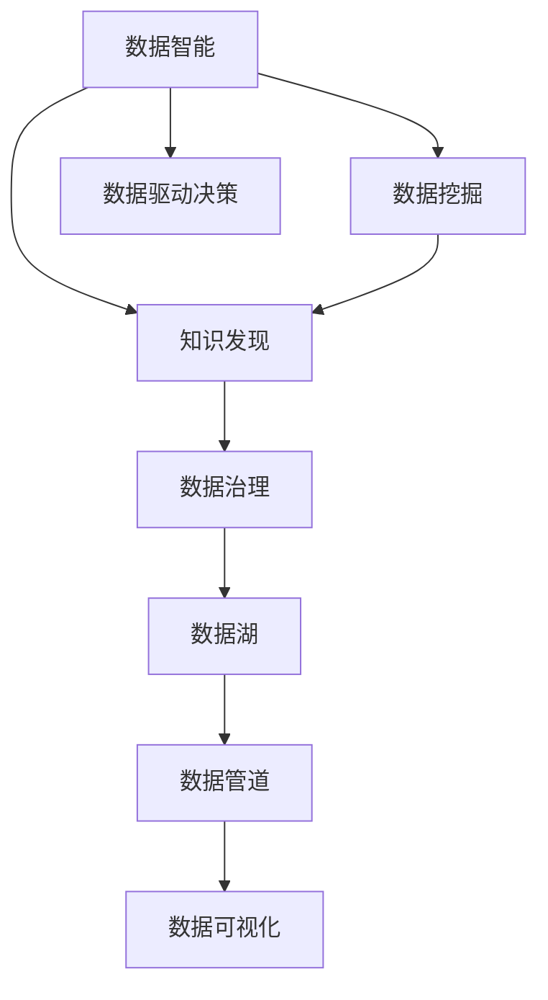

                 

# 知识发现引擎助力程序员职业转型

> 关键词：知识发现引擎, 程序员职业转型, 数据挖掘, 数据智能, 数据驱动决策, 数据治理

## 1. 背景介绍

在科技日新月异的今天，程序员这一职业正面临着前所未有的挑战与机遇。技术的迭代升级，使得传统的软件开发、系统维护等职责变得不再纯粹，程序员需不断学习新知识、新技能以应对变化。同时，人工智能、大数据等新兴技术的应用，也使得程序员的工作内容更加多样化，不仅需要编程，还需要数据处理、智能决策等多方面的技能。

### 1.1 问题由来

在当前的信息时代，数据无处不在。无论是企业内部业务系统、社交媒体、还是公共数据集，每天都在产生海量数据。如何从这些数据中提取有用信息，形成决策依据，成为了企业管理者、开发者共同关注的课题。传统的数据查询、报表生成等方式已经无法满足数据驱动决策的需求，数据智能、知识发现等技术应运而生。

### 1.2 问题核心关键点

知识发现引擎(Knowledge Discovery Engine, KDE)是数据智能技术的核心组成部分，它通过先进的数据挖掘和机器学习算法，自动从大量数据中发现潜在的模式、趋势和关联，为决策提供支持。

- **数据挖掘(Data Mining)**：指从大量数据中自动提取有用信息的过程。常见的数据挖掘算法包括分类、聚类、关联规则挖掘等。
- **知识发现(Knowledge Discovery)**：基于数据挖掘，发现数据背后的知识、规律和关系，为业务决策提供有力依据。
- **数据智能(Data Intelligence)**：通过数据挖掘、机器学习等技术，实现数据驱动的业务决策，推动企业智能转型。

知识发现引擎通常包括以下几个关键环节：

1. **数据预处理**：清洗、转换、规整数据，以便后续分析。
2. **特征工程**：提取、选择、组合数据特征，提升模型性能。
3. **模型训练**：选择合适的算法和模型，训练得到预测或分类模型。
4. **结果解释**：对模型输出结果进行解释，形成可理解、可操作的洞察。
5. **应用部署**：将模型嵌入业务流程，实现智能决策。

这些环节相辅相成，共同构成了一个完整的知识发现流程。在实际应用中，通过知识发现引擎，程序员可以自动化的进行数据处理、模型训练和决策支持，大幅提升工作效率和决策质量。

## 2. 核心概念与联系

### 2.1 核心概念概述

为了更好地理解知识发现引擎的核心概念及其应用，本节将介绍几个密切相关的核心概念：

- **数据智能(Data Intelligence)**：通过数据挖掘、知识发现等技术，实现数据驱动的业务决策。
- **数据治理(Data Governance)**：对企业数据进行标准化、规范化的管理，确保数据质量、安全性和一致性。
- **数据湖(Data Lake)**：构建海量数据存储平台，支持大规模数据的存储、处理和分析。
- **数据管道(PipeLine)**：用于数据的抽取、清洗、转换和加载等，确保数据的高效流通。
- **数据可视化(Data Visualization)**：将数据通过图形化展示，帮助人们更直观地理解数据。
- **数据驱动决策(Data-Driven Decision)**：基于数据洞察，做出科学、高效的业务决策。

这些概念之间的逻辑关系可以通过以下Mermaid流程图来展示：



这个流程图展示了数据智能技术的各个环节及其联系：

1. 数据智能通过数据挖掘、知识发现等技术，形成数据洞察。
2. 数据治理确保数据的质量和一致性，为数据智能奠定基础。
3. 数据湖用于海量数据的存储和管理，支持数据智能。
4. 数据管道实现数据的抽取、清洗和加载，保证数据的高效流通。
5. 数据可视化将数据洞察图形化展示，便于理解和应用。
6. 数据驱动决策基于数据洞察，做出科学高效的决策。

## 3. 核心算法原理 & 具体操作步骤

### 3.1 算法原理概述

知识发现引擎的核心算法原理主要包括数据挖掘、机器学习和统计学等技术。这些技术共同构成了知识发现的算法基础。

- **数据挖掘算法**：通过算法从数据中提取模式、趋势和关联，常见的算法包括分类、聚类、关联规则挖掘等。
- **机器学习算法**：利用数据训练模型，对新数据进行预测或分类。常用的算法有决策树、支持向量机、神经网络等。
- **统计学方法**：通过统计学分析，提取数据的分布、均值、方差等特征，为数据洞察提供依据。

### 3.2 算法步骤详解

一个典型的知识发现引擎通常包括以下几个关键步骤：

**Step 1: 数据预处理**
- **清洗数据**：去除噪声、错误和重复数据，保证数据的质量。
- **规整数据**：对数据进行统一格式、单位转换，以便后续处理。
- **采样处理**：根据业务需求，进行随机或分层抽样，选取合适的数据集。

**Step 2: 特征工程**
- **特征提取**：从原始数据中提取有意义的特征，如统计特征、文本特征、图像特征等。
- **特征选择**：对提取的特征进行筛选，去除无关或冗余特征，提升模型性能。
- **特征组合**：将不同特征组合成新的特征，增加模型复杂度。

**Step 3: 模型训练**
- **选择合适的算法**：根据任务类型选择不同的算法，如分类、回归、聚类等。
- **模型训练**：使用历史数据训练模型，得到初始模型参数。
- **模型调优**：通过交叉验证等方法，调整模型参数，优化模型性能。

**Step 4: 结果解释**
- **模型输出**：对模型预测或分类结果进行解释，形成可理解、可操作的洞察。
- **结果可视化**：将数据洞察通过图形展示，帮助用户更好地理解数据。
- **报告生成**：将数据洞察整理成报告，供决策者参考。

**Step 5: 应用部署**
- **模型集成**：将训练好的模型嵌入业务系统，实现自动化的决策支持。
- **实时更新**：根据新数据，定期更新模型，保证数据洞察的时效性。
- **监控评估**：实时监控模型性能，及时调整和优化。

### 3.3 算法优缺点

知识发现引擎具有以下优点：
- **自动化高效**：自动化数据处理和模型训练，提高工作效率。
- **智能洞察**：从海量数据中发现潜在的模式和趋势，提供智能决策依据。
- **灵活应用**：支持多种业务场景，如销售预测、客户细分、推荐系统等。

同时，知识发现引擎也存在一些局限性：
- **数据质量要求高**：高质量的数据是知识发现的前提，数据质量问题可能导致误导性的结论。
- **模型复杂度高**：复杂的数据挖掘和机器学习模型需要较高的计算资源和时间。
- **结果解释困难**：模型输出的结果往往难以解释，缺乏透明度。
- **应用场景限制**：某些场景下，可能无法获得足够的标注数据，导致模型效果不佳。

### 3.4 算法应用领域

知识发现引擎在多个领域都得到了广泛应用，以下是几个典型的应用场景：

- **销售预测与客户细分**：利用历史销售数据，通过数据挖掘和机器学习算法，预测未来销售趋势，对客户进行细分，实现精准营销。
- **客户行为分析**：通过分析客户的历史行为数据，挖掘客户的偏好和需求，为产品和服务设计提供依据。
- **推荐系统**：基于用户行为数据和物品特征，通过机器学习算法，为用户推荐个性化的商品或内容。
- **信用风险评估**：通过分析客户的金融交易记录，发现潜在的信用风险，为银行和金融公司提供风险评估支持。
- **舆情监测**：通过分析社交媒体和新闻数据，监测舆情动态，为政府和企业提供决策支持。
- **医疗数据分析**：通过分析患者的电子病历和基因数据，发现疾病的潜在风险和关联，为医生和研究者提供支持。

这些应用场景展示了知识发现引擎的强大功能，以及在企业决策和管理中的广泛应用。随着数据智能技术的不断发展，知识发现引擎将会在更多领域发挥其重要作用。

## 4. 数学模型和公式 & 详细讲解 & 举例说明

### 4.1 数学模型构建

本节将使用数学语言对知识发现引擎的构建过程进行严格刻画。

设原始数据集为 $D=\{(x_i, y_i)\}_{i=1}^N, x_i \in \mathbb{R}^d, y_i \in \mathbb{R}^{k}$，其中 $d$ 为输入特征维度，$k$ 为输出标签维度。知识发现引擎的目标是从数据集中学习出一个函数 $f: \mathbb{R}^d \rightarrow \mathbb{R}^k$，使得模型在新的数据集上具有较好的泛化能力。

定义模型 $f_{\theta}$ 为 $f: \mathbb{R}^d \rightarrow \mathbb{R}^k$ 的映射函数，其中 $\theta$ 为模型参数。模型 $f_{\theta}$ 的损失函数为 $\mathcal{L}(f_{\theta},D)$。假设 $f_{\theta}$ 采用决策树模型，则损失函数为：

$$
\mathcal{L}(f_{\theta},D)=\frac{1}{N}\sum_{i=1}^N \ell(f_{\theta}(x_i),y_i)
$$

其中 $\ell$ 为损失函数，常见的有均方误差损失、交叉熵损失等。

### 4.2 公式推导过程

以决策树模型为例，推导其损失函数的计算公式。

假设决策树模型为 $f_{\theta}(x)=\sum_{t=1}^T \theta_t h_t(x)$，其中 $h_t(x)$ 为第 $t$ 个决策树的输出，$\theta_t$ 为对应的权重。则损失函数 $\mathcal{L}(f_{\theta},D)$ 可以表示为：

$$
\mathcal{L}(f_{\theta},D)=\frac{1}{N}\sum_{i=1}^N \ell(\sum_{t=1}^T \theta_t h_t(x_i),y_i)
$$

将 $\ell$ 损失函数代入上式，得：

$$
\mathcal{L}(f_{\theta},D)=\frac{1}{N}\sum_{i=1}^N [\ell(\sum_{t=1}^T \theta_t h_t(x_i),y_i)]
$$

通过梯度下降等优化算法，最小化损失函数，更新模型参数 $\theta$，得到最终的决策树模型 $f_{\theta}$。

### 4.3 案例分析与讲解

以客户细分为例，展示知识发现引擎的实际应用。

假设某电商公司有大量历史交易数据，需要根据用户行为进行客户细分，以便提供个性化的服务。原始数据包括用户ID、商品ID、购买时间、购买金额、购买频率等。通过数据预处理，去除异常数据和缺失值，规整数据格式，得到一个干净的数据集 $D$。

接下来，进行特征工程，提取用户购买行为、商品类别、购买时间等特征，并使用PCA等方法进行特征降维。假设选择了分类算法，训练得到一个决策树模型 $f_{\theta}$。将模型应用到新的数据集上，对用户进行细分，形成客户群体。

## 5. 项目实践：代码实例和详细解释说明

### 5.1 开发环境搭建

在进行知识发现引擎的实践时，需要准备好开发环境。以下是使用Python进行Scikit-Learn开发的环境配置流程：

1. 安装Anaconda：从官网下载并安装Anaconda，用于创建独立的Python环境。

2. 创建并激活虚拟环境：
```bash
conda create -n kde-env python=3.8 
conda activate kde-env
```

3. 安装Scikit-Learn：
```bash
conda install scikit-learn
```

4. 安装各类工具包：
```bash
pip install numpy pandas matplotlib seaborn scikit-image
```

5. 安装数据集：
```bash
wget https://archive.ics.uci.edu/ml/machine-learning-databases/iris/iris.data
```

完成上述步骤后，即可在`kde-env`环境中开始知识发现引擎的实践。

### 5.2 源代码详细实现

下面以客户细分为例，展示知识发现引擎的完整代码实现。

首先，定义数据处理函数：

```python
import pandas as pd
from sklearn.model_selection import train_test_split
from sklearn.preprocessing import StandardScaler
from sklearn.tree import DecisionTreeClassifier
from sklearn.metrics import classification_report

def preprocess_data(data_path):
    data = pd.read_csv(data_path, header=None)
    features = data.iloc[:, :-1].values
    labels = data.iloc[:, -1].values
    features = StandardScaler().fit_transform(features)
    features_train, features_test, labels_train, labels_test = train_test_split(features, labels, test_size=0.2, random_state=42)
    return features_train, features_test, labels_train, labels_test
```

然后，定义模型训练和评估函数：

```python
def train_model(features_train, features_test, labels_train, labels_test):
    model = DecisionTreeClassifier()
    model.fit(features_train, labels_train)
    preds = model.predict(features_test)
    return model, preds

def evaluate_model(model, preds, labels_test):
    print(classification_report(labels_test, preds))
```

接着，启动训练流程并在测试集上评估：

```python
features_train, features_test, labels_train, labels_test = preprocess_data('data/iris.data')

model, preds = train_model(features_train, features_test, labels_train, labels_test)
evaluate_model(model, preds, labels_test)
```

以上就是使用Scikit-Learn进行客户分类的完整代码实现。可以看到，得益于Scikit-Learn的强大封装，我们可以用相对简洁的代码完成决策树模型的构建和评估。

### 5.3 代码解读与分析

让我们再详细解读一下关键代码的实现细节：

**preprocess_data函数**：
- 定义了数据预处理流程：读取CSV文件，清洗数据，规整格式，进行标准化处理，并分割成训练集和测试集。

**train_model函数**：
- 定义了模型训练流程：选择决策树模型，进行训练，并返回模型和预测结果。

**evaluate_model函数**：
- 定义了模型评估流程：计算分类精度、召回率和F1-score，并打印结果。

**主流程**：
- 在主流程中，调用preprocess_data函数获取数据集，调用train_model函数训练模型，调用evaluate_model函数评估模型性能。

在实际应用中，知识发现引擎的构建还需要根据具体任务的特点进行优化设计，如改进特征工程、选择更适合的模型、优化模型参数等。但核心的知识发现范式基本与此类似。

## 6. 实际应用场景

### 6.1 智能推荐系统

基于知识发现引擎的推荐系统能够通过分析用户的历史行为数据和物品特征，为用户推荐个性化的商品或内容。通过数据挖掘和机器学习算法，系统能够发现用户偏好和兴趣，预测用户的未来行为，从而实现精准推荐。

在技术实现上，知识发现引擎可以将用户的浏览记录、购买记录、评分数据等作为输入，通过聚类、关联规则挖掘等方法，发现用户的兴趣群体和购买行为模式。然后将这些信息用于推荐模型的训练，形成个性化推荐列表。

### 6.2 金融风险管理

在金融领域，知识发现引擎可以用于风险评估和管理。通过分析客户的交易记录、信用历史、社交行为等数据，系统可以识别出潜在的风险客户，提前采取措施进行预警。

具体而言，知识发现引擎可以通过分类算法，对客户进行风险等级划分。根据历史数据训练模型，利用新的交易数据进行实时评估，及时发现异常交易行为，防范金融风险。

### 6.3 医疗数据分析

在医疗领域，知识发现引擎可以用于疾病诊断和治疗方案优化。通过分析患者的电子病历、基因数据等，系统可以发现疾病的潜在风险和关联，为医生提供决策支持。

具体而言，知识发现引擎可以通过分类、聚类等算法，对患者的病情进行预测和分类。然后结合医生的临床经验，为患者推荐个性化的治疗方案，提升诊疗效果。

### 6.4 未来应用展望

随着知识发现引擎技术的不断发展，其应用前景将更加广阔。未来，知识发现引擎将在更多领域得到应用，为企业的智能转型和决策支持提供强有力的支持。

- **智能制造**：通过分析生产设备的数据，优化生产流程，提高生产效率。
- **智慧城市**：通过分析城市运行数据，优化城市管理，提升市民生活质量。
- **智能交通**：通过分析交通流量数据，优化交通管理，提升交通效率。
- **能源管理**：通过分析能源消耗数据，优化能源利用，实现节能减排。

随着大数据、云计算等技术的发展，知识发现引擎的应用场景将更加多样，为各行各业带来更大的价值。

## 7. 工具和资源推荐

### 7.1 学习资源推荐

为了帮助开发者系统掌握知识发现引擎的理论基础和实践技巧，这里推荐一些优质的学习资源：

1. 《Python数据科学手册》系列博文：由Python数据科学社区提供，深入浅出地介绍了数据挖掘、机器学习等前沿话题。

2. 《数据挖掘：概念与技术》课程：由Coursera平台提供，由著名数据挖掘专家讲授，涵盖数据挖掘的基本概念和算法。

3. 《数据智能：从数据到智能》书籍：由知名数据科学家撰写，全面介绍了数据智能的原理、技术和应用。

4. Kaggle竞赛平台：全球最大的数据科学竞赛平台，提供海量数据集和经典案例，帮助开发者实践数据智能技术。

通过对这些资源的学习实践，相信你一定能够快速掌握知识发现引擎的精髓，并用于解决实际的数据挖掘问题。

### 7.2 开发工具推荐

高效的开发离不开优秀的工具支持。以下是几款用于知识发现引擎开发的常用工具：

1. Python：作为数据科学的主流语言，Python提供了丰富的数据处理和机器学习库，如Pandas、Scikit-Learn、TensorFlow等。

2. R：另一种广泛用于数据科学的数据处理语言，具有强大的统计分析和数据可视化能力。

3. Scikit-Learn：基于Python的机器学习库，提供了丰富的数据挖掘和机器学习算法。

4. TensorFlow：由Google主导开发的深度学习框架，支持大规模数据处理和模型训练。

5. Weights & Biases：模型训练的实验跟踪工具，可以记录和可视化模型训练过程中的各项指标，方便对比和调优。

6. Tableau：数据可视化工具，支持复杂的数据图表展示，便于数据分析和理解。

合理利用这些工具，可以显著提升知识发现引擎的开发效率，加快创新迭代的步伐。

### 7.3 相关论文推荐

知识发现引擎的研究源于学界的持续研究。以下是几篇奠基性的相关论文，推荐阅读：

1. "Knowledge Discovery in Databases: Concepts and Techniques"：介绍知识发现的定义、目标、方法和应用，是数据挖掘领域的经典之作。

2. "A Survey of Data Mining Techniques"：综述了数据挖掘的基本技术和方法，适合初学者入门。

3. "An Introduction to Statistical Learning"：介绍了统计学在数据挖掘中的应用，适合理解数据挖掘的统计基础。

4. "Learning with Local and Global Consistency"：探讨了数据挖掘中的局部一致性和全局一致性问题，为知识发现提供了新的思路。

5. "Anomaly Detection: A Survey"：综述了异常检测的基本方法和应用，为知识发现中的异常检测提供了理论支持。

这些论文代表了大数据挖掘技术的发展脉络。通过学习这些前沿成果，可以帮助研究者把握学科前进方向，激发更多的创新灵感。

## 8. 总结：未来发展趋势与挑战

### 8.1 研究成果总结

本文对知识发现引擎的理论基础和实际应用进行了全面系统的介绍。首先阐述了知识发现引擎的定义、原理和应用场景，明确了其在数据智能中的核心地位。其次，从原理到实践，详细讲解了知识发现引擎的数学模型和算法步骤，给出了知识发现引擎的完整代码实现。同时，本文还广泛探讨了知识发现引擎在多个行业领域的应用前景，展示了其强大的潜力。

通过本文的系统梳理，可以看到，知识发现引擎正在成为数据智能技术的核心组成部分，极大地推动了企业智能化转型和决策科学化的进程。未来，伴随着大数据、云计算等技术的不断进步，知识发现引擎将会在更多领域发挥其重要作用，为人类认知智能的进化带来深远影响。

### 8.2 未来发展趋势

展望未来，知识发现引擎技术将呈现以下几个发展趋势：

1. **数据规模化处理**：随着数据量的爆炸性增长，知识发现引擎需要处理更大规模的数据集，提升数据处理效率。

2. **模型智能化优化**：通过深度学习和强化学习等技术，实现模型的自动化优化，提升模型性能。

3. **多模态融合**：将视觉、语音、文本等多模态数据融合，提升模型的综合感知能力。

4. **实时处理**：通过流式处理和分布式计算技术，实现知识的实时挖掘和更新。

5. **跨领域应用**：在医疗、金融、智能制造等更多领域得到应用，推动跨领域知识发现。

6. **自动化决策**：通过人工智能辅助决策，实现自动化的决策支持和策略优化。

以上趋势凸显了知识发现引擎技术的广阔前景。这些方向的探索发展，必将进一步提升知识发现引擎的性能和应用范围，为人类认知智能的进化带来深远影响。

### 8.3 面临的挑战

尽管知识发现引擎技术已经取得了瞩目成就，但在迈向更加智能化、普适化应用的过程中，它仍面临着诸多挑战：

1. **数据质量问题**：高质量的数据是知识发现的保障，数据缺失、噪声和偏差等问题仍需要解决。

2. **模型复杂度**：复杂的算法和模型需要更高的计算资源和时间，限制了应用范围。

3. **结果可解释性**：知识发现引擎的输出往往难以解释，缺乏透明度。

4. **应用场景限制**：某些场景下，可能无法获得足够的标注数据，导致模型效果不佳。

5. **隐私和安全问题**：知识发现过程需要处理大量敏感数据，隐私和安全问题需要重视。

6. **实时性问题**：对于实时数据流，如何实现高效、稳定的知识发现，是一个难题。

这些挑战需要通过技术创新和应用实践不断克服，才能使知识发现引擎技术真正落地应用，带来更大的价值。

### 8.4 研究展望

面对知识发现引擎面临的种种挑战，未来的研究需要在以下几个方面寻求新的突破：

1. **数据治理和标准化**：通过数据治理和标准化技术，确保数据质量和安全。

2. **模型自动化优化**：开发自动化模型优化算法，提升模型性能和应用效率。

3. **多模态数据融合**：探索多模态数据融合方法，提升模型的感知能力和决策准确性。

4. **实时数据处理**：研究实时数据流处理技术，提升知识发现的实时性。

5. **可解释性和透明性**：引入可解释性和透明性技术，提高知识发现过程的透明度。

6. **隐私和安全保护**：采用隐私保护技术，确保知识发现过程中的数据安全和隐私保护。

这些研究方向的探索，必将引领知识发现引擎技术迈向更高的台阶，为人类认知智能的进化提供强有力的技术支持。面向未来，知识发现引擎需要在技术深度和应用广度上不断突破，才能真正实现人工智能技术的广泛落地。

## 9. 附录：常见问题与解答

**Q1：知识发现引擎是否适用于所有行业领域？**

A: 知识发现引擎可以应用于几乎所有行业领域，只要有数据支持的业务场景。但不同行业的数据特点和业务需求不同，需要根据具体情况进行优化。

**Q2：知识发现引擎的输出结果如何解释？**

A: 知识发现引擎的输出结果通常需要通过专家分析和业务理解进行解释。常见的解释方法包括可视化展示、文本报告等，有助于业务人员理解和应用。

**Q3：知识发现引擎的效率如何提升？**

A: 知识发现引擎的效率可以通过优化算法、改进数据处理流程、采用分布式计算等方法提升。合理利用数据压缩、数据分片等技术，可以进一步提高效率。

**Q4：知识发现引擎在实时场景下如何应用？**

A: 在实时场景下，知识发现引擎需要采用流式处理和分布式计算技术，以实现实时数据流的处理和分析。同时，需要设计高效的数据管道和模型训练机制，确保实时性。

**Q5：知识发现引擎在企业中的应用有哪些？**

A: 知识发现引擎在企业中的应用包括客户细分、销售预测、风险评估、舆情监测等。通过数据挖掘和机器学习算法，可以为企业提供智能决策支持。

**Q6：知识发现引擎面临哪些伦理和法律问题？**

A: 知识发现引擎在应用过程中需要遵守数据隐私保护、知识产权保护等相关法律法规，避免侵犯个人隐私和企业利益。

---

作者：禅与计算机程序设计艺术 / Zen and the Art of Computer Programming

