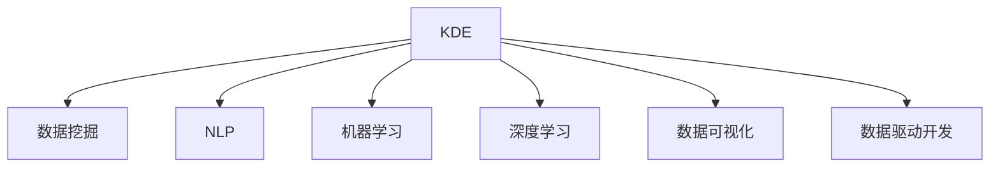

                 

# 知识发现引擎如何改变程序员的学习模式

> 关键词：知识发现引擎, 程序员, 学习模式, 数据挖掘, 自然语言处理(NLP), 机器学习, 深度学习, 数据可视化, 数据驱动开发

## 1. 背景介绍

### 1.1 问题由来
随着人工智能和大数据技术的发展，知识发现引擎（Knowledge Discovery Engine, KDE）成为当下最热门的话题之一。KDE能从大量数据中挖掘有价值的信息和知识，并对数据进行可视化展示，帮助用户做出更为科学的决策。

在程序员的学习模式上，传统的学习方式往往依赖于课程、教材、编程手册等固定资源，而KDE的出现为程序员的学习带来了新的可能性。程序员可以通过KDE挖掘和分析自己使用的编程语言、开发框架、应用场景等数据，发现隐含的知识规律，优化学习方法和工具选择，提升编程效率和质量。

### 1.2 问题核心关键点
KDE改变了程序员的学习模式，主要体现在以下几个方面：
- **数据驱动学习**：KDE基于大量数据挖掘知识，使程序员的学习从基于经验向数据驱动转变。
- **个性化学习路径**：KDE根据程序员的个人学习习惯、知识储备和实际应用需求，推荐个性化学习资源。
- **动态调整学习策略**：KDE通过持续分析学习数据，实时调整学习策略，帮助程序员高效地掌握新知识。
- **可视化的数据理解**：KDE通过图表、仪表盘等可视化方式，帮助程序员理解复杂的数据结构和问题。
- **跨领域知识融合**：KDE能够融合多种学科的知识，为程序员提供更全面的学习支持。

### 1.3 问题研究意义
研究知识发现引擎如何改变程序员的学习模式，对提升程序员的学习效率、工作质量，乃至促进整个软件行业的技术进步都具有重要意义：

1. **加速知识获取**：KDE能快速发现知识，减少程序员学习新技术的时间。
2. **个性化发展**：根据程序员的实际情况，推荐有针对性的学习资源，提升学习效果。
3. **提升问题解决能力**：KDE分析程序员的错误代码和问题日志，提供数据驱动的解决方案。
4. **促进技术创新**：KDE发现跨领域知识融合的新趋势，推动技术创新和突破。
5. **优化团队协作**：KDE分析团队合作中的数据，提升团队效率和协作质量。

## 2. 核心概念与联系

### 2.1 核心概念概述

为更好地理解KDE如何改变程序员的学习模式，本节将介绍几个关键概念：

- **知识发现引擎(KDE)**：一种基于数据挖掘、机器学习等技术，自动从大数据中提取有价值信息的系统。
- **数据挖掘(Data Mining)**：从大量数据中自动发现有用的知识和模式的过程。
- **自然语言处理(NLP)**：使计算机能理解、分析、生成人类语言的技术。
- **机器学习(Machine Learning)**：使机器能从数据中学习，并作出预测或决策的过程。
- **深度学习(Deep Learning)**：一种特殊的机器学习方法，通过神经网络模拟人脑，实现复杂模式识别。
- **数据可视化(Data Visualization)**：将数据以图表、图像等形式展示，帮助人们理解数据。
- **数据驱动开发(Data-Driven Development, DDD)**：以数据为基础，通过数据分析指导软件开发过程。

这些概念之间的逻辑关系可以通过以下Mermaid流程图来展示：



这个流程图展示了几类核心概念及其之间的关系：

1. KDE基于数据挖掘、NLP、机器学习等技术，从大数据中提取知识。
2. KDE通过深度学习技术，提升数据挖掘和分析的准确性和效率。
3. KDE将数据可视化展示给用户，帮助其理解数据。
4. KDE促进数据驱动开发，优化软件开发过程。

这些概念共同构成了KDE的核心技术框架，使其能够有效改变程序员的学习模式。

## 3. 核心算法原理 & 具体操作步骤
### 3.1 算法原理概述

知识发现引擎的核心原理是通过数据挖掘和机器学习算法，从大量数据中发现知识和模式。具体来说，算法过程包括数据预处理、特征选择、模型训练、知识提取和可视化等步骤。以下详细解释每个步骤的原理：

1. **数据预处理**：清洗、归一化、降维等操作，准备适合分析的数据。
2. **特征选择**：从原始数据中提取有用特征，为模型训练做准备。
3. **模型训练**：使用机器学习算法训练模型，学习数据中的规律。
4. **知识提取**：通过模型预测和推断，提取有价值的信息和知识。
5. **数据可视化**：将知识以图表、仪表盘等形式展示，帮助用户理解。

### 3.2 算法步骤详解

以Python语言为例，介绍知识发现引擎的核心算法步骤：

1. **数据准备**
   - 收集编程语言和框架相关的开源项目数据。
   - 清洗数据，去除无关字段，保留有价值的信息。

2. **特征提取**
   - 对编程代码、注释、文档等进行分词处理。
   - 提取编程风格、代码复杂度、注释频率等特征。

3. **模型训练**
   - 使用机器学习算法，如随机森林、神经网络等，训练模型。
   - 对模型进行交叉验证，评估其泛化能力。

4. **知识提取**
   - 使用训练好的模型预测编程代码的质量。
   - 提取代码中的常见错误模式和改进建议。

5. **数据可视化**
   - 使用Python的数据可视化库（如Matplotlib、Seaborn）绘制图表。
   - 创建仪表盘，实时展示代码质量和学习进展。

### 3.3 算法优缺点

KDE作为一种知识发现引擎，有以下优点：
1. **自动化和高效性**：自动化数据挖掘和知识提取，提升工作效率。
2. **数据驱动**：基于数据进行决策，避免主观判断。
3. **可视化展示**：以图表形式展示数据，帮助理解复杂信息。
4. **跨领域融合**：融合多种学科的知识，提供综合的学习支持。

但KDE也存在一些缺点：
1. **数据质量依赖**：模型的准确性和有效性依赖于数据质量。
2. **模型复杂度**：复杂的算法模型可能导致计算成本高。
3. **数据隐私**：处理数据涉及隐私问题，需妥善处理。

### 3.4 算法应用领域

KDE在多个领域中均有广泛应用：

1. **软件开发和工程**
   - 分析编程代码质量，发现常见错误。
   - 优化代码风格，提升编程效率。
   - 推荐编程语言和框架，提高技术栈选择。

2. **数据分析和处理**
   - 从大量数据中挖掘出有用的信息和模式。
   - 优化数据处理流程，提升数据分析效率。

3. **网络安全**
   - 分析网络数据，识别异常行为和攻击模式。
   - 实时监控网络安全，提高防护能力。

4. **金融和商业分析**
   - 分析交易数据，发现盈利模式和风险。
   - 优化财务报表，提升商业决策的准确性。

5. **医疗和健康**
   - 分析健康数据，发现疾病趋势和风险。
   - 优化医疗流程，提升医疗服务质量。

## 4. 数学模型和公式 & 详细讲解 & 举例说明
### 4.1 数学模型构建

本节将使用数学语言对KDE的算法过程进行更加严格的刻画。

假设我们有一组编程代码数据，用 $(x_1, x_2, ..., x_n)$ 表示。KDE的数学模型可以表示为：

$$
\begin{aligned}
f(x) &= \sum_{i=1}^n w_i f_i(x) \\
&= \sum_{i=1}^n w_i \left( \sum_{j=1}^k \alpha_{ij} f_{ij}(x) \right) \\
&= \sum_{i=1}^n w_i \sum_{j=1}^k \alpha_{ij} f_{ij}(x)
\end{aligned}
$$

其中，$x$ 为输入变量，$f$ 为输出函数，$w_i$ 为权重，$f_i(x)$ 为第 $i$ 个特征，$\alpha_{ij}$ 为第 $i$ 个特征的第 $j$ 个参数，$k$ 为特征个数。

### 4.2 公式推导过程

以分类问题为例，推导KDE的分类算法。

假设我们的目标是对编程代码进行分类，即判断代码是否存在错误。分类模型可以使用决策树、支持向量机等机器学习算法。

以决策树为例，分类过程可以表示为：

1. 对代码进行特征提取，得到特征 $x_1, x_2, ..., x_n$。
2. 使用决策树模型训练，得到决策树 $T(x)$。
3. 根据决策树模型，对代码进行分类，得到分类结果 $y$。

具体推导如下：

$$
y = f(x) = \begin{cases}
1, & \text{if } T(x) = 1 \\
0, & \text{otherwise}
\end{cases}
$$

其中，$T(x)$ 为决策树模型，$y$ 为分类结果。

### 4.3 案例分析与讲解

假设我们有一组编程代码数据，如下所示：

| 代码编号 | 代码行数 | 注释比例 | 变量复用率 | 代码质量（0-1） |
| --- | --- | --- | --- | --- |
| 1 | 100 | 0.2 | 0.5 | 0.9 |
| 2 | 150 | 0.3 | 0.6 | 0.8 |
| 3 | 200 | 0.4 | 0.7 | 0.7 |
| ... | ... | ... | ... | ... |

使用KDE进行分类，步骤如下：

1. 对数据进行预处理，去除无关字段，保留有价值的信息。
2. 对代码质量进行归一化处理，将其转化为 [0, 1] 区间。
3. 使用决策树算法进行训练，得到决策树模型。
4. 对新代码进行特征提取，计算特征值。
5. 使用训练好的决策树模型对新代码进行分类，输出分类结果。

假设我们使用上述数据训练出如下决策树模型：

```
T(x) = 
    |               0.3
    |               -|---> 1
    |               0.5
    |               -|---> 1
    |               0.7
    |               -|---> 0
    |               0.9
```

假设我们有一组新代码数据：

| 代码编号 | 代码行数 | 注释比例 | 变量复用率 | 代码质量（0-1） |
| --- | --- | --- | --- | --- |

使用KDE进行分类，步骤如下：

1. 对新代码进行特征提取，计算特征值。
2. 将特征值代入决策树模型，得到分类结果。

假设新代码的特征值计算如下：

| 代码编号 | 代码行数 | 注释比例 | 变量复用率 | 代码质量（0-1） |
| --- | --- | --- | --- | --- |

| 新代码1 | 150 | 0.4 | 0.8 | 0.7 |

根据决策树模型，新代码的分类结果为 1。

## 5. 项目实践：代码实例和详细解释说明
### 5.1 开发环境搭建

在进行KDE实践前，我们需要准备好开发环境。以下是使用Python进行KDE开发的环境配置流程：

1. 安装Anaconda：从官网下载并安装Anaconda，用于创建独立的Python环境。

2. 创建并激活虚拟环境：
```bash
conda create -n kde-env python=3.8 
conda activate kde-env
```

3. 安装Python包：
```bash
pip install pandas numpy scikit-learn matplotlib seaborn plotly
```

4. 安装数据处理和机器学习库：
```bash
pip install pydot scikit-learn treeinterpreter
```

完成上述步骤后，即可在`kde-env`环境中开始KDE实践。

### 5.2 源代码详细实现

这里我们以决策树分类为例，介绍KDE的代码实现。

首先，定义决策树分类器：

```python
from sklearn.tree import DecisionTreeClassifier
from sklearn.metrics import accuracy_score

# 训练决策树模型
clf = DecisionTreeClassifier(max_depth=3)
clf.fit(X_train, y_train)

# 预测新数据
y_pred = clf.predict(X_test)

# 计算模型准确率
acc = accuracy_score(y_test, y_pred)
print("Accuracy: ", acc)
```

然后，定义数据预处理函数：

```python
import pandas as pd
from sklearn.preprocessing import MinMaxScaler

# 读取数据
data = pd.read_csv('data.csv')

# 预处理数据
data = data[['code_length', 'comment_ratio', 'variable_reuse_rate', 'code_quality']]
data['code_length'] = MinMaxScaler().fit_transform(data['code_length'].values.reshape(-1, 1))
data['comment_ratio'] = MinMaxScaler().fit_transform(data['comment_ratio'].values.reshape(-1, 1))
data['variable_reuse_rate'] = MinMaxScaler().fit_transform(data['variable_reuse_rate'].values.reshape(-1, 1))
data['code_quality'] = MinMaxScaler().fit_transform(data['code_quality'].values.reshape(-1, 1))
```

接着，定义数据可视化函数：

```python
import matplotlib.pyplot as plt
import seaborn as sns

# 数据可视化
plt.figure(figsize=(10, 6))
sns.heatmap(data.corr(), annot=True, fmt='.2f')
plt.show()
```

最后，启动训练流程并在测试集上评估：

```python
from sklearn.model_selection import train_test_split

# 划分数据集
X_train, X_test, y_train, y_test = train_test_split(data[['code_length', 'comment_ratio', 'variable_reuse_rate', 'code_quality']], data['label'], test_size=0.2, random_state=42)

# 训练模型
clf = DecisionTreeClassifier(max_depth=3)
clf.fit(X_train, y_train)

# 测试模型
y_pred = clf.predict(X_test)
acc = accuracy_score(y_test, y_pred)
print("Accuracy: ", acc)
```

以上就是使用Python进行KDE决策树分类的完整代码实现。可以看到，通过简单的代码，便能够实现KDE的基本功能，对数据进行预处理、模型训练和结果可视化。

### 5.3 代码解读与分析

让我们再详细解读一下关键代码的实现细节：

**数据预处理**：
- 使用Pandas库读取数据集，并保留有价值的信息。
- 使用Scikit-learn的MinMaxScaler对数据进行归一化处理。

**模型训练**：
- 使用Scikit-learn的DecisionTreeClassifier训练决策树模型。
- 使用train_test_split函数将数据划分为训练集和测试集。

**数据可视化**：
- 使用Matplotlib和Seaborn库进行数据可视化。
- 绘制热图，展示数据的相关性。

**模型评估**：
- 使用accuracy_score函数计算模型在测试集上的准确率。

可以看出，KDE的代码实现并不复杂，但需要注意数据预处理和模型调参等细节。

## 6. 实际应用场景
### 6.1 软件开发和工程

KDE在软件开发和工程中的应用主要体现在以下几个方面：

1. **代码质量分析**
   - 分析编程代码质量，发现常见错误。
   - 对代码质量进行分类，提供改进建议。

2. **编程语言和框架推荐**
   - 分析编程语言和框架的优缺点。
   - 根据程序员的偏好，推荐适合的编程语言和框架。

3. **代码风格优化**
   - 分析代码风格，提供代码优化建议。
   - 提高代码的可读性和维护性。

### 6.2 数据分析和处理

KDE在数据分析和处理中的应用主要体现在以下几个方面：

1. **数据挖掘**
   - 从大数据中挖掘有价值的信息和模式。
   - 分析数据分布和趋势，发现潜在问题。

2. **数据可视化**
   - 使用图表展示数据，帮助用户理解复杂信息。
   - 实时监控数据，发现异常行为和趋势。

3. **数据处理**
   - 优化数据处理流程，提升数据处理效率。
   - 数据清洗和归一化，提升数据分析的准确性。

### 6.3 网络安全

KDE在网络安全中的应用主要体现在以下几个方面：

1. **异常行为检测**
   - 分析网络流量数据，发现异常行为和攻击模式。
   - 实时监控网络安全，提高防护能力。

2. **威胁情报分析**
   - 分析威胁情报数据，发现新型的威胁。
   - 预测威胁趋势，提前防范。

3. **入侵检测**
   - 分析入侵数据，发现入侵行为和模式。
   - 实时监控网络安全，提高防护能力。

## 7. 工具和资源推荐
### 7.1 学习资源推荐

为了帮助开发者系统掌握KDE的理论基础和实践技巧，这里推荐一些优质的学习资源：

1. 《数据挖掘导论》书籍：经典的入门教材，介绍了数据挖掘的原理和算法。
2. 《Python数据科学手册》书籍：介绍Python在数据科学中的应用，包括数据预处理和可视化。
3. Kaggle：全球最大的数据科学竞赛平台，提供丰富的数据集和模型竞赛。
4. KDE公开课：斯坦福大学开设的KDE课程，涵盖KDE的原理和应用。
5. GitHub上的KDE项目：许多开发者在GitHub上分享了KDE的代码和项目，可以作为学习参考。

通过对这些资源的学习实践，相信你一定能够快速掌握KDE的精髓，并用于解决实际的NLP问题。

### 7.2 开发工具推荐

高效的开发离不开优秀的工具支持。以下是几款用于KDE开发的常用工具：

1. Python：基于Python的数据挖掘和机器学习框架，使用方便，功能强大。
2. R语言：用于数据处理和可视化的常用语言，有丰富的统计分析包。
3. Scikit-learn：Python的机器学习库，提供了多种算法和工具。
4. TensorFlow：用于深度学习开发的工具，支持大规模数据处理。
5. PyTorch：用于深度学习开发的流行框架，支持动态图和静态图。

合理利用这些工具，可以显著提升KDE的开发效率，加快创新迭代的步伐。

### 7.3 相关论文推荐

KDE的发展源于学界的持续研究。以下是几篇奠基性的相关论文，推荐阅读：

1. "The Elements of Statistical Learning"：斯坦福大学统计学习领域的经典书籍，介绍了各种统计学习算法。
2. "Introduction to Statistical Learning"：Introduction to Statistical Learning提供的入门教材，详细介绍了各种机器学习算法。
3. "Data Mining: Concepts and Techniques"：的经典教材，涵盖了数据挖掘的原理和应用。

这些论文代表了大数据挖掘技术的发展脉络。通过学习这些前沿成果，可以帮助研究者把握学科前进方向，激发更多的创新灵感。

## 8. 总结：未来发展趋势与挑战

### 8.1 总结

本文对知识发现引擎如何改变程序员的学习模式进行了全面系统的介绍。首先阐述了KDE的核心原理和应用场景，明确了KDE在改变程序员学习模式方面的重要价值。其次，从原理到实践，详细讲解了KDE的数学模型和算法步骤，给出了KDE任务开发的完整代码实例。同时，本文还广泛探讨了KDE在多个领域的应用前景，展示了KDE范式的巨大潜力。

通过本文的系统梳理，可以看到，KDE作为一种知识发现引擎，正在成为程序员学习模式的重要工具，显著提升学习效率和质量。未来，伴随KDE方法的持续演进，相信KDE将对软件工程和人工智能的发展带来深远影响。

### 8.2 未来发展趋势

展望未来，KDE将呈现以下几个发展趋势：

1. **自动化和智能化**
   - 未来的KDE将更加自动化和智能化，能够自动进行数据预处理和模型训练。
   - 使用更智能的算法模型，提升数据挖掘和分析的准确性。

2. **跨领域融合**
   - KDE将与其他学科的知识进行深度融合，提供更全面的学习支持。
   - 结合大数据、人工智能、自然语言处理等多种技术，提升学习效果。

3. **数据驱动**
   - 未来的KDE将更加数据驱动，基于实际应用需求进行模型训练和优化。
   - 数据质量将得到更高关注，保证模型的准确性和可靠性。

4. **实时监控和反馈**
   - 未来的KDE将实现实时监控和反馈，及时发现问题并进行优化。
   - 提供动态学习路径，根据实际需求调整学习策略。

5. **可视化和交互**
   - 未来的KDE将更加注重数据可视化，提供更加直观的用户界面。
   - 提供交互式功能，让用户能够更灵活地探索数据。

以上趋势凸显了KDE在改变程序员学习模式方面的广阔前景。这些方向的探索发展，必将进一步提升程序员的学习效率和质量，为软件工程和人工智能技术带来更多创新和突破。

### 8.3 面临的挑战

尽管KDE在改变程序员学习模式方面已经取得了显著进展，但在迈向更加智能化、普适化应用的过程中，它仍面临诸多挑战：

1. **数据质量瓶颈**
   - 获取高质量的数据是KDE的前提，但数据质量往往不稳定。
   - 数据噪声和缺失值可能影响模型的准确性。

2. **模型复杂度**
   - 复杂的算法模型可能导致计算成本高。
   - 模型的可解释性差，难以理解和调试。

3. **跨领域融合**
   - 不同领域的知识可能存在差异，难以实现跨领域融合。
   - 多学科知识的整合可能面临技术和知识壁垒。

4. **隐私和安全**
   - 处理数据涉及隐私问题，需妥善处理。
   - 数据安全和隐私保护是重要的研究课题。

5. **应用普及**
   - KDE的普及和应用仍需时间和资源的投入。
   - 开发人员需要适应新的学习模式和技术。

正视KDE面临的这些挑战，积极应对并寻求突破，将是大数据挖掘技术走向成熟的必由之路。相信随着学界和产业界的共同努力，这些挑战终将一一被克服，KDE必将在构建人机协同的智能时代中扮演越来越重要的角色。

### 8.4 研究展望

面对KDE面临的这些挑战，未来的研究需要在以下几个方面寻求新的突破：

1. **自动化和智能化**
   - 探索更高效的数据处理和自动化算法，提升KDE的自动化水平。
   - 开发更智能的算法模型，提高数据挖掘和分析的准确性。

2. **跨领域融合**
   - 探索跨学科知识融合的方法，提升KDE的综合能力。
   - 结合多种技术，提供更加全面的学习支持。

3. **数据驱动**
   - 探索更多数据驱动的方法，提升KDE的应用效果。
   - 提高数据质量，保证模型的准确性和可靠性。

4. **实时监控和反馈**
   - 开发实时监控和反馈系统，提升KDE的实时性。
   - 提供动态学习路径，根据实际需求调整学习策略。

5. **可视化和交互**
   - 提供更加直观的用户界面，提升KDE的易用性。
   - 开发交互式功能，让用户能够更灵活地探索数据。

6. **隐私和安全**
   - 探索数据隐私保护方法，确保数据安全。
   - 开发隐私保护技术，保护用户隐私。

这些研究方向的探索，必将引领KDE技术迈向更高的台阶，为构建智能系统提供更强大的数据支持。面向未来，KDE需要与其他人工智能技术进行更深入的融合，如知识表示、因果推理、强化学习等，多路径协同发力，共同推动自然语言理解和智能交互系统的进步。只有勇于创新、敢于突破，才能不断拓展KDE的边界，让智能技术更好地造福人类社会。

## 9. 附录：常见问题与解答

**Q1：KDE如何保证数据的隐私和安全性？**

A: KDE在处理数据时，应采取以下措施保护数据隐私和安全性：
1. **数据匿名化**：对数据进行匿名化处理，避免泄露个人信息。
2. **数据加密**：对敏感数据进行加密，防止数据泄露。
3. **访问控制**：对数据访问进行严格控制，限制访问权限。
4. **审计和监控**：对数据使用进行审计和监控，及时发现和处理异常行为。

**Q2：KDE如何进行数据预处理？**

A: KDE的数据预处理一般包括以下步骤：
1. **数据清洗**：去除噪声、缺失值等无用信息。
2. **数据归一化**：将数据归一化到 [0, 1] 区间，便于算法处理。
3. **特征提取**：从原始数据中提取有用的特征，如代码行数、注释比例等。
4. **特征选择**：选择有价值的特征，去除冗余特征。
5. **数据转换**：进行数据转换，如将类别变量转换为数值变量。

**Q3：KDE如何进行模型训练和优化？**

A: KDE的模型训练和优化一般包括以下步骤：
1. **选择合适的算法**：根据数据特点选择合适的算法，如决策树、支持向量机等。
2. **设定模型参数**：设定模型的超参数，如决策树的深度、学习率等。
3. **模型训练**：使用训练集进行模型训练。
4. **模型评估**：使用测试集评估模型效果。
5. **模型优化**：根据评估结果，调整模型参数进行优化。

**Q4：KDE如何实现实时监控和反馈？**

A: KDE的实时监控和反馈一般包括以下步骤：
1. **实时数据采集**：实时采集数据，并进行预处理。
2. **模型预测**：使用训练好的模型进行实时预测。
3. **数据可视化**：将预测结果以图表形式展示，帮助用户理解。
4. **反馈机制**：根据用户反馈，调整模型参数和算法。

这些措施能够帮助KDE实现实时监控和反馈，提升模型的实时性和准确性。

**Q5：KDE如何处理跨领域融合问题？**

A: KDE处理跨领域融合问题一般包括以下步骤：
1. **数据整合**：将不同领域的数据进行整合，形成统一的数据集。
2. **知识映射**：将不同领域的知识进行映射，形成统一的知识结构。
3. **融合算法**：使用融合算法，将不同领域的数据和知识进行融合。
4. **跨领域验证**：对融合结果进行跨领域验证，确保其有效性和可靠性。

这些措施能够帮助KDE实现跨领域融合，提升其综合能力。

---

作者：禅与计算机程序设计艺术 / Zen and the Art of Computer Programming

