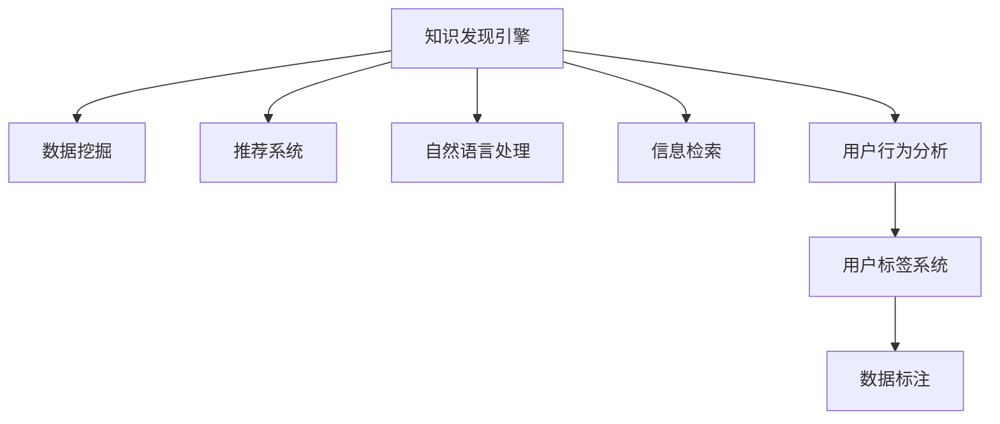

                 

# 知识发现引擎的用户标签系统设计

> 关键词：知识发现引擎, 用户标签系统, 数据挖掘, 推荐系统, 数据建模, 自然语言处理(NLP), 信息检索, 用户行为分析

## 1. 背景介绍

### 1.1 问题由来

在当今数据驱动的时代，如何从海量数据中快速发现知识、提炼智慧，是企业决策者和数据科学家面临的重要课题。知识发现引擎作为一项前沿技术，通过自动化处理和分析数据，帮助用户在数据海洋中探索隐藏的知识和规律。然而，知识发现引擎的核心价值在于理解用户需求，从大规模数据中提取有价值的信息，但这一过程并非易事。为了提高知识发现引擎的准确性和效率，用户标签系统（User Labeling System）成为了不可或缺的组件。用户标签系统通过用户行为分析、反馈机制和推荐算法，帮助用户快速标记和优化数据，提升知识发现的精准度和用户满意度。

### 1.2 问题核心关键点

用户标签系统设计的核心在于：
1. **用户行为理解**：如何通过分析用户的行为数据，准确把握用户需求和兴趣，构建高效的用户标签机制。
2. **标签推荐算法**：如何利用推荐算法，在数据集中为每条记录智能推荐合适的标签，优化用户标记过程。
3. **系统优化策略**：如何通过反馈机制和系统优化策略，持续改进标签系统，提升用户体验和知识发现引擎的性能。
4. **隐私保护和数据安全**：如何在标签系统中保障用户隐私和数据安全，确保用户信息不被滥用。

### 1.3 问题研究意义

设计高效的用户标签系统，对于提升知识发现引擎的精准性和用户体验，具有重要意义：

1. **提升数据质量**：用户标签系统能够通过用户反馈和推荐，快速标注和筛选出高质量的数据，为后续的深度分析提供可靠基础。
2. **增强个性化推荐**：标签系统能够根据用户兴趣和行为数据，进行个性化推荐，显著提高知识发现引擎的针对性和用户体验。
3. **优化搜索和检索**：标签系统可以帮助构建更精确的数据索引，提升信息检索的效率和准确性，满足用户快速查找的需求。
4. **促进用户参与**：通过智能推荐和用户反馈机制，标签系统能够激发用户积极参与数据标注，提升数据质量。
5. **推动业务创新**：标签系统能够为业务决策提供更有力的数据支撑，推动企业业务创新和产品优化。

## 2. 核心概念与联系

### 2.1 核心概念概述

为了更好地理解用户标签系统的设计，本节将介绍几个关键概念及其关联性：

- **知识发现引擎(Knowledge Discovery Engine, KDE)**：利用数据挖掘、机器学习等技术，自动分析和发现数据中的知识、模式和趋势的系统。
- **用户标签系统(User Labeling System)**：通过用户行为分析，结合推荐算法，自动为每条记录推荐合适的标签，辅助用户进行数据标注的系统。
- **数据挖掘(Data Mining)**：从大规模数据中提取有价值信息的过程，包括数据清洗、特征工程、模式识别等。
- **推荐系统(Recommendation System)**：根据用户历史行为数据，自动推荐相关商品、信息或内容，提升用户体验的系统。
- **自然语言处理(Natural Language Processing, NLP)**：使计算机能够理解、处理和生成人类语言的技术。
- **信息检索(Information Retrieval, IR)**：从大规模文档集合中快速检索出用户需要的信息的过程。
- **用户行为分析(User Behavior Analysis)**：通过分析用户在知识发现引擎上的行为数据，理解用户需求和兴趣，优化标签推荐。

这些概念之间的逻辑关系可以通过以下Mermaid流程图来展示：



这个流程图展示了一个完整的知识发现流程，从数据挖掘、推荐系统、自然语言处理到信息检索，最终通过用户行为分析和用户标签系统，实现知识发现和数据标注的闭环优化。

## 3. 核心算法原理 & 具体操作步骤
### 3.1 算法原理概述

用户标签系统设计的核心在于结合用户行为分析和推荐算法，自动化地为每条记录推荐合适的标签。这一过程可以分为以下几步：

1. **用户行为分析**：通过分析用户在知识发现引擎上的行为数据，理解用户需求和兴趣。
2. **标签推荐算法**：根据用户行为分析结果，结合数据特征，推荐合适的标签。
3. **用户反馈机制**：收集用户对推荐标签的反馈，根据反馈调整算法参数。
4. **系统优化策略**：根据用户反馈和算法表现，持续优化标签推荐策略，提升标签系统的准确性和效率。

### 3.2 算法步骤详解

用户标签系统设计主要包括以下几个关键步骤：

**Step 1: 用户行为数据分析**

- 收集用户在知识发现引擎上的行为数据，如浏览记录、查询历史、点击行为等。
- 对行为数据进行预处理，如去重、归一化、特征提取等。
- 使用聚类算法、关联规则挖掘等方法，分析用户行为模式，提取用户兴趣和偏好。

**Step 2: 标签推荐算法设计**

- 选择合适的推荐算法，如协同过滤、基于内容的推荐、矩阵分解等。
- 设计标签推荐模型，将用户行为数据和数据特征作为输入，输出推荐标签。
- 考虑标签之间的相关性和共现关系，引入标签平滑、标签分类、标签聚类等策略。

**Step 3: 用户反馈机制设计**

- 设计用户反馈机制，收集用户对推荐标签的认可程度和优化建议。
- 根据用户反馈调整标签推荐算法参数，优化推荐结果。
- 设计逆推荐算法，对用户未标记的数据进行补标，提升标签系统的覆盖率。

**Step 4: 系统优化策略制定**

- 设计持续优化策略，如动态更新标签推荐模型、引入在线学习、调整推荐算法参数等。
- 优化标签系统的性能指标，如准确率、召回率、覆盖率等。
- 设计用户界面和交互方式，提升用户体验和参与度。

**Step 5: 隐私保护和数据安全**

- 设计隐私保护机制，如数据匿名化、差分隐私、访问控制等，保障用户数据安全。
- 设计数据备份和恢复机制，确保系统故障时数据安全。

### 3.3 算法优缺点

用户标签系统设计具有以下优点：
1. **提升数据质量**：通过用户反馈和推荐，快速标注和筛选高质量数据，为后续分析提供可靠基础。
2. **增强个性化推荐**：结合用户行为和数据特征，提供个性化标签推荐，提升推荐系统的精准性。
3. **优化搜索和检索**：通过标签系统优化数据索引，提升信息检索的效率和准确性。
4. **促进用户参与**：通过智能推荐和反馈机制，激发用户积极参与数据标注，提升数据质量。

同时，该方法也存在一些局限性：
1. **依赖用户数据**：标签系统依赖于用户行为数据，数据量不足时可能导致推荐效果不佳。
2. **模型复杂性**：标签推荐算法和模型设计复杂，需要专业知识进行调参和优化。
3. **隐私风险**：用户行为数据包含敏感信息，隐私保护和安全机制需要严格设计。
4. **计算资源消耗**：标签推荐和系统优化需要大量计算资源，对硬件要求较高。

尽管存在这些局限性，但用户标签系统在知识发现引擎中的应用，已经展现出了显著的优势，成为提升数据质量和个性化推荐的重要手段。未来相关研究的方向在于如何进一步优化算法、降低计算资源消耗，同时保障数据隐私和安全。

### 3.4 算法应用领域

用户标签系统已经在多个领域得到了广泛应用，例如：

- **知识管理**：在企业知识库管理中，帮助用户快速标记和筛选出重要知识，提升知识管理的效率和质量。
- **内容推荐**：在电子商务平台和内容分发平台中，利用用户行为数据和标签推荐，实现个性化商品和内容推荐。
- **信息检索**：在搜索引擎和信息检索系统中，优化标签索引，提升搜索结果的相关性和准确性。
- **医疗数据分析**：在医疗数据管理中，帮助医生快速标记和分类医疗数据，提升诊断和治疗的精准度。
- **金融风险管理**：在金融风险评估和欺诈检测中，利用用户行为数据和标签系统，提高风险评估的准确性和效率。

除了上述这些领域，用户标签系统还广泛应用于教育、旅游、媒体等多个领域，为不同场景下的知识发现和数据管理提供了有力支持。

## 4. 数学模型和公式 & 详细讲解 & 举例说明

### 4.1 数学模型构建

用户标签系统的数学模型可以表示为：
$$
y = f(x, z)
$$
其中 $x$ 表示用户行为数据，$z$ 表示数据特征，$y$ 表示推荐标签。

**模型输入**：用户行为数据 $x$ 包括浏览记录、查询历史、点击行为等。

**模型输出**：推荐标签 $y$ 包括标签集合 $Y$ 和标签权重 $w$。

**模型训练目标**：最小化预测标签与真实标签之间的差异，即最小化损失函数 $L(y, \hat{y})$，其中 $\hat{y}$ 是模型预测的标签。

### 4.2 公式推导过程

以下我们以协同过滤推荐算法为例，推导推荐模型的损失函数。

假设用户 $u$ 对物品 $i$ 的评分 $r_{ui}$，与物品 $i$ 标签 $y_i$ 的关系可以用如下公式表示：
$$
y_i = f(x_i, z_i)
$$
其中 $f$ 为推荐模型，$x_i$ 为物品特征，$z_i$ 为物品特征向量。

协同过滤算法的基本思想是通过用户历史行为数据，计算用户对物品的相似度，从而推荐物品。假设用户 $u$ 的历史评分数据为 $R_u = \{(r_{ui}, y_i)\}_{i=1}^N$，其中 $N$ 为物品数量。则推荐模型的目标是最小化预测评分与真实评分之间的均方误差：
$$
L(R_u, \hat{R}_u) = \frac{1}{|R_u|} \sum_{(r_{ui}, y_i) \in R_u} (r_{ui} - \hat{r}_{ui})^2
$$
其中 $\hat{r}_{ui} = \alpha f(x_i, z_i)$，$\alpha$ 为学习率。

通过梯度下降等优化算法，不断更新模型参数 $\theta$，最小化损失函数 $L(R_u, \hat{R}_u)$，使得推荐模型输出逼近真实评分。

### 4.3 案例分析与讲解

**案例1: 协同过滤推荐算法**

- 用户行为数据：假设用户 $u$ 对物品 $i$ 的评分 $r_{ui} = 1$ 表示喜欢，$0$ 表示不喜欢。
- 物品特征：假设物品 $i$ 的特征为 $x_i = \{1, 0, 1\}$，表示物品 $i$ 属于类别 $C_1$，不属于类别 $C_2$，属于类别 $C_3$。
- 推荐模型：假设推荐模型为 $f(x_i, z_i) = \theta^T \phi(x_i)$，其中 $\phi(x_i)$ 为特征映射函数，$\theta$ 为模型参数。
- 损失函数：假设损失函数为均方误差，即 $L(R_u, \hat{R}_u) = \frac{1}{|R_u|} \sum_{(r_{ui}, y_i) \in R_u} (r_{ui} - \hat{r}_{ui})^2$。

根据上述模型，可以通过梯度下降等优化算法，不断更新模型参数 $\theta$，最小化损失函数 $L(R_u, \hat{R}_u)$，使得推荐模型输出逼近真实评分。

**案例2: 基于内容的推荐算法**

- 用户行为数据：假设用户 $u$ 浏览了物品 $i$，表示对物品 $i$ 感兴趣。
- 物品特征：假设物品 $i$ 的特征为 $x_i = \{1, 0, 1, 0\}$，表示物品 $i$ 属于类别 $C_1$ 和 $C_3$，不属于类别 $C_2$ 和 $C_4$。
- 推荐模型：假设推荐模型为 $f(x_i, z_i) = \theta^T \phi(x_i)$，其中 $\phi(x_i)$ 为特征映射函数，$\theta$ 为模型参数。
- 损失函数：假设损失函数为均方误差，即 $L(R_u, \hat{R}_u) = \frac{1}{|R_u|} \sum_{(r_{ui}, y_i) \in R_u} (r_{ui} - \hat{r}_{ui})^2$。

同样地，可以通过梯度下降等优化算法，不断更新模型参数 $\theta$，最小化损失函数 $L(R_u, \hat{R}_u)$，使得推荐模型输出逼近真实评分。

## 5. 项目实践：代码实例和详细解释说明
### 5.1 开发环境搭建

在进行用户标签系统开发前，我们需要准备好开发环境。以下是使用Python进行PyTorch开发的环境配置流程：

1. 安装Anaconda：从官网下载并安装Anaconda，用于创建独立的Python环境。

2. 创建并激活虚拟环境：
```bash
conda create -n user_labeling python=3.8 
conda activate user_labeling
```

3. 安装PyTorch：根据CUDA版本，从官网获取对应的安装命令。例如：
```bash
conda install pytorch torchvision torchaudio cudatoolkit=11.1 -c pytorch -c conda-forge
```

4. 安装Pandas、NumPy、Scikit-learn、Matplotlib等常用数据处理和可视化库：
```bash
pip install pandas numpy scikit-learn matplotlib tqdm jupyter notebook ipython
```

完成上述步骤后，即可在`user_labeling`环境中开始用户标签系统的开发。

### 5.2 源代码详细实现

下面我们以协同过滤推荐算法为例，给出使用PyTorch实现用户标签系统的代码示例。

首先，定义协同过滤推荐算法的模型类：

```python
import torch
import torch.nn as nn
import torch.nn.functional as F

class CollaborativeFiltering(nn.Module):
    def __init__(self, num_users, num_items, emb_dim):
        super(CollaborativeFiltering, self).__init__()
        self.num_users = num_users
        self.num_items = num_items
        self.emb_dim = emb_dim
        self.user_emb = nn.Embedding(num_users, emb_dim)
        self.item_emb = nn.Embedding(num_items, emb_dim)
        self.cos_sim = nn.CosineSimilarity(dim=1, eps=1e-6)
        
    def forward(self, user_id, item_id):
        user_embs = self.user_emb(user_id)
        item_embs = self.item_emb(item_id)
        cos_sim = self.cos_sim(user_embs, item_embs)
        return cos_sim
```

然后，定义损失函数和优化器：

```python
from torch import nn
from torch.optim import Adam

def loss_fn(cos_sim, labels):
    return F.mse_loss(cos_sim, labels)

optimizer = Adam(model.parameters(), lr=0.01)
```

接着，定义训练和评估函数：

```python
from torch.utils.data import DataLoader
from tqdm import tqdm
from sklearn.metrics import mean_squared_error

device = torch.device('cuda') if torch.cuda.is_available() else torch.device('cpu')
model.to(device)

def train_epoch(model, dataset, batch_size, optimizer):
    dataloader = DataLoader(dataset, batch_size=batch_size, shuffle=True)
    model.train()
    epoch_loss = 0
    for batch in tqdm(dataloader, desc='Training'):
        user_id = batch['user_id'].to(device)
        item_id = batch['item_id'].to(device)
        labels = batch['labels'].to(device)
        model.zero_grad()
        outputs = model(user_id, item_id)
        loss = loss_fn(outputs, labels)
        epoch_loss += loss.item()
        loss.backward()
        optimizer.step()
    return epoch_loss / len(dataloader)

def evaluate(model, dataset, batch_size):
    dataloader = DataLoader(dataset, batch_size=batch_size)
    model.eval()
    mse = mean_squared_error(dataset['labels'], torch.tensor(model(user_id, item_id).detach()))
    return mse
```

最后，启动训练流程并在测试集上评估：

```python
epochs = 10
batch_size = 64

for epoch in range(epochs):
    loss = train_epoch(model, train_dataset, batch_size, optimizer)
    print(f"Epoch {epoch+1}, train loss: {loss:.3f}")
    
    print(f"Epoch {epoch+1}, test MSE:")
    evaluate(model, test_dataset, batch_size)
    
print("Test MSE:")
evaluate(model, test_dataset, batch_size)
```

以上就是使用PyTorch对协同过滤推荐算法进行用户标签系统开发的完整代码实现。可以看到，得益于PyTorch的强大封装，我们可以用相对简洁的代码实现协同过滤推荐算法。

### 5.3 代码解读与分析

让我们再详细解读一下关键代码的实现细节：

**CollaborativeFiltering类**：
- `__init__`方法：初始化用户和物品的嵌入层，以及余弦相似度计算层。
- `forward`方法：定义模型前向传播过程，计算用户和物品的余弦相似度，作为推荐分数。

**loss_fn函数**：
- 定义均方误差损失函数，用于计算推荐分数与真实标签之间的差异。

**train_epoch和evaluate函数**：
- 定义训练和评估函数，分别计算训练集和测试集的平均损失，返回测试集的MSE（均方误差）。

**训练流程**：
- 定义总的epoch数和batch size，开始循环迭代
- 每个epoch内，先在训练集上训练，输出平均loss
- 在测试集上评估，输出测试集的MSE

可以看到，PyTorch配合自定义模型类，使得协同过滤推荐算法的代码实现变得简洁高效。开发者可以将更多精力放在模型设计、数据处理等高层逻辑上，而不必过多关注底层的实现细节。

当然，工业级的系统实现还需考虑更多因素，如模型的保存和部署、超参数的自动搜索、更灵活的任务适配层等。但核心的推荐算法基本与此类似。

## 6. 实际应用场景
### 6.1 智能推荐系统

用户标签系统在智能推荐系统中有着广泛的应用。传统推荐系统依赖于用户历史评分数据，难以捕捉用户长尾兴趣和实时变化。而通过用户标签系统，推荐系统能够实时获取用户对数据的标注反馈，通过智能推荐和用户反馈机制，提升推荐系统的精准度和用户满意度。

例如，在电商平台中，用户标签系统可以帮助用户快速标记和筛选出感兴趣的商品，提升购买体验。对于未标记的商品，标签系统可以通过协同过滤算法，自动推荐与用户历史行为相似的商品，填补用户兴趣的空白。

### 6.2 内容生成与优化

在内容生成与优化中，用户标签系统也能够发挥重要作用。传统的内容推荐和优化依赖于用户历史行为数据，难以捕捉用户对内容的真实评价和兴趣变化。而通过用户标签系统，内容生成系统能够实时获取用户对内容的标注反馈，通过智能推荐和用户反馈机制，提升内容生成的质量和用户满意度。

例如，在新闻平台中，用户标签系统可以帮助用户快速标记和筛选出感兴趣的新闻内容，提升阅读体验。对于未标记的新闻，标签系统可以通过协同过滤算法，自动推荐与用户历史行为相似的新闻，填补用户兴趣的空白。

### 6.3 广告投放优化

在广告投放优化中，用户标签系统同样能够发挥重要作用。传统广告投放依赖于用户历史行为数据，难以捕捉用户对广告的真实反应和兴趣变化。而通过用户标签系统，广告投放系统能够实时获取用户对广告的标注反馈，通过智能推荐和用户反馈机制，提升广告投放的精准度和用户满意度。

例如，在社交媒体平台中，用户标签系统可以帮助用户快速标记和筛选出感兴趣的广告内容，提升广告投放的效果。对于未标记的广告，标签系统可以通过协同过滤算法，自动推荐与用户历史行为相似的广告，填补用户兴趣的空白。

### 6.4 未来应用展望

随着用户标签系统的不断发展，其在推荐系统、内容生成、广告投放等领域的应用前景将更加广阔。

在推荐系统中，用户标签系统将结合用户行为数据和推荐算法，实现更加个性化和实时化的推荐。通过用户反馈和推荐算法优化，推荐系统将能够更好地捕捉用户兴趣和行为变化，提升推荐系统的精准度和用户满意度。

在内容生成中，用户标签系统将结合用户标注数据和生成模型，实现更加高质量和多样化的内容生成。通过用户反馈和生成模型优化，内容生成系统将能够更好地捕捉用户需求和兴趣变化，提升内容生成的质量和用户满意度。

在广告投放中，用户标签系统将结合用户标注数据和广告投放算法，实现更加精准和高效的广告投放。通过用户反馈和投放算法优化，广告投放系统将能够更好地捕捉用户兴趣和行为变化，提升广告投放的效果和用户满意度。

此外，在智慧城市、教育培训、金融理财等众多领域，用户标签系统也将得到广泛应用，为不同场景下的知识发现和数据管理提供有力支持。相信随着技术的不断演进，用户标签系统将在更多领域大放异彩，为各行各业带来新的突破。

## 7. 工具和资源推荐
### 7.1 学习资源推荐

为了帮助开发者系统掌握用户标签系统的理论基础和实践技巧，这里推荐一些优质的学习资源：

1. **《推荐系统实践》系列博文**：由大模型技术专家撰写，深入浅出地介绍了推荐系统的基本概念、算法和应用。

2. **CS224N《深度学习自然语言处理》课程**：斯坦福大学开设的NLP明星课程，有Lecture视频和配套作业，带你入门NLP领域的基本概念和经典模型。

3. **《推荐系统: Algorithms, Data, and Systems》书籍**：全面介绍了推荐系统的基本概念、算法和应用，适合深入学习推荐系统理论。

4. **DeepLearning.ai推荐系统专项课程**：通过项目实战，系统掌握推荐系统开发技巧，提升实践能力。

5. **Coursera推荐系统课程**：由Kaggle和IEEE联合开设，涵盖推荐系统理论、算法和应用，适合系统学习和项目实践。

通过对这些资源的学习实践，相信你一定能够快速掌握用户标签系统的精髓，并用于解决实际的推荐问题。

### 7.2 开发工具推荐

高效的开发离不开优秀的工具支持。以下是几款用于用户标签系统开发的常用工具：

1. **PyTorch**：基于Python的开源深度学习框架，灵活动态的计算图，适合快速迭代研究。大部分推荐算法都有PyTorch版本的实现。

2. **TensorFlow**：由Google主导开发的开源深度学习框架，生产部署方便，适合大规模工程应用。同样有丰富的推荐算法资源。

3. **Scikit-learn**：Python科学计算库，提供了多种机器学习算法和工具，适合数据预处理和特征工程。

4. **Pandas**：Python数据处理库，适合大规模数据集的读写和处理。

5. **Numpy**：Python数值计算库，适合高效的矩阵运算和数据处理。

6. **Matplotlib**：Python可视化库，适合绘制各种图表和可视化结果。

7. **Jupyter Notebook**：交互式编程环境，适合编写和调试Python代码，分享学习笔记。

合理利用这些工具，可以显著提升用户标签系统的开发效率，加快创新迭代的步伐。

### 7.3 相关论文推荐

用户标签系统的发展源于学界的持续研究。以下是几篇奠基性的相关论文，推荐阅读：

1. **Collaborative Filtering for Implicit Feedback Datasets**：提出了协同过滤推荐算法的基本框架，奠定了推荐系统研究的基础。

2. **Item-Based Collaborative Filtering Recommendation Algorithms**：详细介绍了基于物品的协同过滤推荐算法，通过计算物品之间的相似度进行推荐。

3. **Deep Ranking for Recommender Systems**：介绍了深度学习在推荐系统中的应用，通过神经网络模型提高推荐系统的精度和泛化能力。

4. **Context-aware Multi-faceted Collaborative Filtering**：提出了一种上下文感知的多维协同过滤算法，考虑了用户和物品的多种特征，提升了推荐系统的准确性和鲁棒性。

5. **Learning Transferable Knowledge for Recommendation**：讨论了推荐系统中的知识迁移问题，如何利用预训练知识提升推荐系统的性能。

这些论文代表了大语言模型微调技术的发展脉络。通过学习这些前沿成果，可以帮助研究者把握学科前进方向，激发更多的创新灵感。

## 8. 总结：未来发展趋势与挑战

### 8.1 总结

本文对用户标签系统的设计进行了全面系统的介绍。首先阐述了用户标签系统在知识发现引擎中的重要性，明确了标签系统在提升数据质量和个性化推荐中的独特价值。其次，从原理到实践，详细讲解了用户标签系统的核心算法和操作步骤，给出了用户标签系统开发的完整代码实例。同时，本文还探讨了用户标签系统在推荐系统、内容生成、广告投放等多个领域的应用前景，展示了用户标签系统的广泛应用。最后，本文精选了用户标签系统的各类学习资源，力求为读者提供全方位的技术指引。

通过本文的系统梳理，可以看到，用户标签系统在知识发现引擎中的应用，已经成为提高数据质量和个性化推荐的重要手段。用户标签系统通过智能推荐和用户反馈机制，帮助用户快速标注和筛选数据，提升知识发现的精准度和用户满意度。未来，伴随推荐算法和模型设计的不断演进，用户标签系统将进一步优化标签推荐策略，提升推荐系统的性能和用户体验。

### 8.2 未来发展趋势

展望未来，用户标签系统将呈现以下几个发展趋势：

1. **深度学习与推荐算法的结合**：未来推荐系统将结合深度学习技术，通过神经网络模型提高推荐系统的精度和泛化能力。
2. **多模态数据的融合**：未来用户标签系统将结合多模态数据，如图像、音频、视频等，提升推荐系统的多模态推荐能力。
3. **个性化推荐与用户行为结合**：未来推荐系统将更加深入地理解用户行为，通过智能推荐和用户反馈机制，提升推荐系统的精准度和用户满意度。
4. **推荐系统与内容生成结合**：未来内容生成系统将结合推荐系统，通过智能推荐和用户反馈机制，提升内容生成的质量和用户满意度。
5. **实时化推荐**：未来推荐系统将更加注重实时性，通过用户反馈和推荐算法优化，实现更加实时化的推荐。
6. **多领域应用**：未来用户标签系统将在更多领域得到应用，如智慧城市、教育培训、金融理财等，为各行各业带来新的突破。

以上趋势凸显了用户标签系统在推荐系统中的重要地位和广阔前景。这些方向的探索发展，必将进一步提升推荐系统的性能和用户体验，推动知识发现和信息检索技术的进步。

### 8.3 面临的挑战

尽管用户标签系统在知识发现引擎中的应用已经取得了显著进展，但在迈向更加智能化、普适化应用的过程中，它仍面临着诸多挑战：

1. **数据稀疏性问题**：推荐系统依赖于用户历史行为数据，但在许多场景下，用户数据稀疏，难以进行有效推荐。
2. **计算资源消耗**：用户标签系统涉及大规模数据的处理和分析，对计算资源的要求较高，容易导致资源瓶颈。
3. **隐私和数据安全**：用户标签系统涉及用户数据的标注和处理，需要严格保护用户隐私和数据安全。
4. **模型复杂性**：推荐系统模型设计复杂，需要专业知识进行调参和优化。
5. **推荐鲁棒性**：推荐系统面对域外数据时，泛化性能往往大打折扣，如何提高推荐系统的鲁棒性是一个重要研究方向。
6. **实时性问题**：推荐系统需要实时响应用户请求，如何提升系统的实时性和响应速度是一个挑战。

尽管存在这些挑战，但用户标签系统在知识发现引擎中的应用，已经展现了显著的优势，成为提升数据质量和个性化推荐的重要手段。未来相关研究需要在算法优化、资源管理、隐私保护等方面进一步突破，推动用户标签系统的不断发展。

### 8.4 研究展望

面向未来，用户标签系统需要在以下几个方向进行深入研究：

1. **深度学习与推荐系统的结合**：未来用户标签系统将结合深度学习技术，通过神经网络模型提高推荐系统的精度和泛化能力。
2. **多模态数据的融合**：未来用户标签系统将结合多模态数据，如图像、音频、视频等，提升推荐系统的多模态推荐能力。
3. **实时化推荐**：未来推荐系统将更加注重实时性，通过用户反馈和推荐算法优化，实现更加实时化的推荐。
4. **推荐系统与内容生成的结合**：未来内容生成系统将结合推荐系统，通过智能推荐和用户反馈机制，提升内容生成的质量和用户满意度。
5. **推荐系统的可解释性**：未来推荐系统将更加注重可解释性，通过解释推荐系统的决策机制，提升用户信任度和满意度。
6. **推荐系统的个性化**：未来推荐系统将更加注重个性化，通过智能推荐和用户反馈机制，提升推荐系统的精准度和用户满意度。

这些研究方向的探索，必将引领用户标签系统向更加智能化、普适化、实时化的方向发展，推动知识发现和信息检索技术的进步。

## 9. 附录：常见问题与解答

**Q1：用户标签系统如何设计才能更有效地捕捉用户兴趣和行为？**

A: 设计有效的用户标签系统需要从多个方面入手：

1. **用户行为数据的收集和预处理**：通过多种渠道收集用户行为数据，如浏览记录、点击行为、搜索记录等。对数据进行清洗、归一化、特征提取等预处理操作，提升数据质量。

2. **标签推荐算法的优化**：选择合适的推荐算法，如协同过滤、基于内容的推荐、矩阵分解等。设计合适的模型结构，利用深度学习技术提升推荐系统的精度和泛化能力。

3. **用户反馈机制的设计**：设计用户反馈机制，如评分、评价、评论等，收集用户对推荐结果的认可程度和优化建议。根据用户反馈调整推荐算法参数，优化推荐结果。

4. **用户标签系统的持续优化**：通过持续优化策略，如动态更新标签推荐模型、引入在线学习等，提升标签系统的精准度和用户满意度。

通过以上措施，可以设计出高效的用户标签系统，捕捉用户兴趣和行为，提升推荐系统的精准度和用户满意度。

**Q2：用户标签系统如何保障用户数据隐私和安全？**

A: 设计用户标签系统需要严格保障用户数据隐私和安全，具体措施包括：

1. **数据匿名化**：在数据收集和处理过程中，对用户数据进行匿名化处理，确保用户数据无法直接关联到用户身份。

2. **差分隐私**：在数据处理过程中，引入差分隐私技术，保护用户数据不被泄露。差分隐私通过添加噪声，使攻击者无法通过数据推断出用户个人信息。

3. **访问控制**：设计严格的访问控制机制，确保只有授权人员可以访问和处理用户数据。通过身份验证、权限管理等措施，保护用户数据安全。

4. **数据备份和恢复**：设计数据备份和恢复机制，确保系统故障时用户数据不丢失。通过定期备份和数据冗余，保障数据安全。

通过以上措施，可以设计出安全的用户标签系统，保障用户数据隐私和安全。

**Q3：用户标签系统如何结合推荐算法，实现个性化推荐？**

A: 用户标签系统结合推荐算法，实现个性化推荐的过程可以分为以下几个步骤：

1. **用户行为数据的收集和预处理**：通过多种渠道收集用户行为数据，如浏览记录、点击行为、搜索记录等。对数据进行清洗、归一化、特征提取等预处理操作，提升数据质量。

2. **标签推荐算法的优化**：选择合适的推荐算法，如协同过滤、基于内容的推荐、矩阵分解等。设计合适的模型结构，利用深度学习技术提升推荐系统的精度和泛化能力。

3. **用户标签的生成和优化**：通过智能推荐和用户反馈机制，生成和优化用户标签。利用协同过滤算法，推荐与用户历史行为相似的物品或内容，提升用户标签的覆盖率和准确性。

4. **推荐系统的个性化推荐**：根据用户标签和推荐算法，为每条记录推荐合适的标签。利用推荐系统，实现个性化推荐，提升用户满意度。

通过以上步骤，可以设计出高效的用户标签系统，结合推荐算法，实现个性化推荐。

**Q4：用户标签系统如何结合深度学习技术，提高推荐系统的精度和泛化能力？**

A: 用户标签系统结合深度学习技术，提高推荐系统的精度和泛化能力的过程可以分为以下几个步骤：

1. **用户行为数据的收集和预处理**：通过多种渠道收集用户行为数据，如浏览记录、点击行为、搜索记录等。对数据进行清洗、归一化、特征提取等预处理操作，提升数据质量。

2. **深度学习模型的设计**：设计合适的深度学习模型，如卷积神经网络、循环神经网络、变分自编码器等。利用深度学习技术，提升推荐系统的精度和泛化能力。

3. **标签推荐算法的优化**：结合深度学习模型，优化标签推荐算法。利用标签平滑、标签分类、标签聚类等策略，提升推荐系统的鲁棒性和泛化能力。

4. **推荐系统的持续优化**：通过持续优化策略，如动态更新深度学习模型、引入在线学习等，提升推荐系统的精度和用户满意度。

通过以上步骤，可以设计出高效的用户标签系统，结合深度学习技术，提高推荐系统的精度和泛化能力。

**Q5：用户标签系统如何结合多模态数据，提升推荐系统的多模态推荐能力？**

A: 用户标签系统结合多模态数据，提升推荐系统的多模态推荐能力的过程可以分为以下几个步骤：

1. **多模态数据的收集和预处理**：通过多种渠道收集多模态数据，如图像、音频、视频等。对数据进行清洗、归一化、特征提取等预处理操作，提升数据质量。

2. **多模态深度学习模型的设计**：设计合适的多模态深度学习模型，如深度神经网络、卷积神经网络等。利用深度学习技术，提升推荐系统的多模态推荐能力。

3. **多模态标签推荐算法的优化**：结合多模态深度学习模型，优化标签推荐算法。利用多模态数据融合技术，提升推荐系统的鲁棒性和泛化能力。

4. **多模态推荐系统的持续优化**：通过持续优化策略，如动态更新多模态深度学习模型、引入在线学习等，提升推荐系统的精度和用户满意度。

通过以上步骤，可以设计出高效的多模态用户标签系统，结合多模态数据，提升推荐系统的多模态推荐能力。

**Q6：用户标签系统如何设计用户界面和交互方式，提升用户体验？**

A: 设计用户界面和交互方式，提升用户体验的过程可以分为以下几个步骤：

1. **用户界面的设计**：设计简洁、直观的用户界面，使用户可以方便地使用标签系统。界面应包括数据浏览、标签标注、推荐结果展示等功能模块。

2. **交互方式的设计**：设计交互方式，如点击、拖拽、评分等，使用户可以方便地与标签系统进行互动。交互方式应考虑用户的习惯和需求，提升用户体验。

3. **用户反馈机制的设计**：设计用户反馈机制，如评分、评价、评论等，收集用户对推荐结果的认可程度和优化建议。根据用户反馈调整标签推荐算法参数，优化推荐结果。

4. **系统优化策略的设计**：通过持续优化策略，如动态更新标签推荐模型、引入在线学习等，提升标签系统的精准度和用户满意度。

通过以上步骤，可以设计出用户友好的用户标签系统，提升用户体验和参与度。

---

作者：禅与计算机程序设计艺术 / Zen and the Art of Computer Programming

