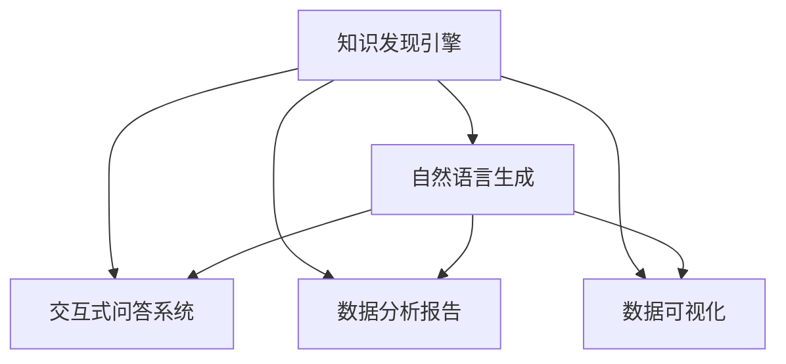

                 

# 知识发现引擎的自然语言生成技术

> 关键词：自然语言生成(NLG), 知识发现引擎, 交互式问答, 数据分析报告, 数据可视化

## 1. 背景介绍

### 1.1 问题由来
随着大数据时代的到来，越来越多的企业开始注重从数据中提取价值，以支持决策和优化运营。知识发现引擎(Knowledge Discovery Engine, KDE)应运而生，通过对大规模数据进行集成、分析和挖掘，帮助企业解锁数据中的潜在知识。然而，随着数据规模的扩大和分析任务的多样化，传统的统计分析方法已难以满足日益增长的需求。自然语言生成(Natural Language Generation, NLG)技术应运而生，为知识发现提供了新的范式。

### 1.2 问题核心关键点
自然语言生成技术通过构建规则、模板或模型，将结构化数据转化为自然语言文本，实现对数据分析结果的直观表达。知识发现引擎中引入自然语言生成技术，有助于提升数据的可理解性和可操作性，进一步推进数据分析的深入和应用。

具体而言，自然语言生成技术在知识发现引擎中的应用主要体现在以下几个方面：
- **交互式问答系统**：通过构建自然语言理解和生成系统，用户可以更自然地提出问题和要求，系统则能更准确地理解和响应。
- **数据分析报告**：自动生成数据分析报告，将复杂的数据分析结果转化为易于理解的文本形式，辅助决策和沟通。
- **数据可视化**：利用自然语言生成技术描述和解释数据可视化的结果，增强其可理解性和可操作性。
- **数据摘要和总结**：自动生成数据摘要和总结，帮助用户快速获取关键信息，优化数据处理流程。

### 1.3 问题研究意义
自然语言生成技术在知识发现引擎中的应用，对于提升数据分析的效率和效果，推动数据的可视化与应用，具有重要意义：

1. **提升数据分析效率**：自然语言生成技术能够自动将数据分析结果转化为易于理解的自然语言，减少人工分析和报告编写的工作量，提高数据分析效率。
2. **增强数据可理解性**：通过自然语言生成，将复杂的数据分析结果转化为易于理解的语言，使得非技术人员也能快速掌握关键信息，提高数据应用的广度和深度。
3. **优化数据分析报告**：自动生成的数据分析报告能够快速更新数据，提供最新的分析结果，辅助决策过程。
4. **增强数据可视化效果**：自然语言生成技术能够为数据可视化结果提供详细的解释和说明，提高数据可视化的实用性和吸引力。
5. **推动数据驱动决策**：通过自然语言生成技术自动生成的分析和报告，帮助决策者快速理解数据，做出更准确的决策。

## 2. 核心概念与联系

### 2.1 核心概念概述

在深入探讨知识发现引擎中的自然语言生成技术之前，我们先简要介绍几个核心概念：

- **知识发现引擎(KDE)**：一种自动化的数据挖掘工具，用于从大规模数据集中发现有用知识，支持决策和优化运营。
- **自然语言生成(NLG)**：利用计算机程序将结构化数据或信息转化为自然语言文本的技术，包括文本摘要、生成式对话、数据分析报告等。
- **交互式问答系统**：一种支持用户与系统自然交互的系统，能够理解并生成自然语言响应，广泛应用于客户服务、智能助手等领域。
- **数据分析报告**：将复杂的数据分析结果以易于理解的语言形式呈现，辅助决策和沟通。
- **数据可视化**：利用图表、图形等形式展示数据信息，帮助用户直观理解数据变化趋势。

这些概念通过自然语言生成技术紧密联系在一起，共同构成了知识发现引擎的应用生态。

### 2.2 核心概念原理和架构的 Mermaid 流程图



这个流程图展示了知识发现引擎、自然语言生成技术以及其主要应用领域之间的关系。知识发现引擎收集和分析数据，通过自然语言生成技术，将这些分析结果转化为自然语言文本，支持交互式问答系统、数据分析报告和数据可视化等应用，从而实现数据驱动的决策和运营优化。

## 3. 核心算法原理 & 具体操作步骤
### 3.1 算法原理概述

知识发现引擎中的自然语言生成技术，主要涉及三个核心步骤：

1. **数据预处理**：从知识发现引擎中提取待生成文本的数据。
2. **自然语言生成模型**：利用预训练的自然语言生成模型或自定义规则，生成自然语言文本。
3. **后处理和优化**：对生成的自然语言文本进行后处理和优化，确保其准确性和可读性。

### 3.2 算法步骤详解

下面将详细介绍自然语言生成技术在知识发现引擎中的应用步骤：

**Step 1: 数据预处理**
- **数据收集**：从知识发现引擎中收集待生成文本的数据，如分析结果、报告、图表等。
- **数据清洗**：去除无关信息，处理缺失值，确保数据的准确性和完整性。
- **数据格式化**：将数据转化为标准格式，如CSV、JSON等，便于后续处理。

**Step 2: 自然语言生成模型**
- **选择模型**：根据应用场景选择合适的自然语言生成模型，如基于规则的模板、基于统计的语言模型或基于深度学习的生成模型。
- **模型训练**：使用标注数据对自然语言生成模型进行训练，使其能够生成与指定数据相匹配的自然语言文本。
- **模型评估**：通过测试数据评估模型的生成效果，确保其准确性和生成质量。

**Step 3: 后处理和优化**
- **文本格式化**：调整文本格式，使其符合应用需求，如标题、段落、表格等。
- **语法和语义检查**：利用语法和语义检查工具，确保生成的文本语法正确、语义清晰。
- **优化和调整**：根据反馈和测试结果，对生成的文本进行优化和调整，提高其可读性和可用性。

### 3.3 算法优缺点

自然语言生成技术在知识发现引擎中的应用，具有以下优点：
- **提升数据可理解性**：将复杂的数据分析结果转化为自然语言，使得非技术人员也能快速掌握关键信息。
- **提高数据分析效率**：自动化生成数据分析报告和摘要，减少人工编写的时间和工作量。
- **增强数据可视化效果**：为数据可视化结果提供详细的解释和说明，提高其可理解性和吸引力。

同时，该方法也存在一定的局限性：
- **依赖高质量数据**：自然语言生成模型对标注数据的质量要求较高，若数据质量不佳，生成效果可能不理想。
- **生成文本准确性**：自然语言生成模型仍存在生成文本准确性不足的问题，尤其是在生成长文本时，可能出现逻辑不连贯、信息遗漏等问题。
- **适用性局限**：某些复杂的应用场景可能难以通过自然语言生成模型进行有效的文本生成。

### 3.4 算法应用领域

自然语言生成技术在知识发现引擎中的应用，涵盖了多个领域，如：

- **金融数据分析**：自动生成金融报表和分析报告，帮助分析师快速理解市场动态。
- **医疗健康分析**：生成医疗报告和诊断建议，辅助医生进行病患分析和治疗决策。
- **市场营销分析**：生成市场分析和客户反馈报告，帮助企业制定营销策略。
- **供应链管理**：生成供应链数据分析报告，帮助企业优化供应链管理和运营。
- **政府决策支持**：生成政府数据分析报告，支持政策制定和实施。

## 4. 数学模型和公式 & 详细讲解 & 举例说明

### 4.1 数学模型构建

自然语言生成技术在知识发现引擎中的应用，主要涉及以下几个数学模型：

1. **序列到序列模型(Seq2Seq)**：将输入序列转化为输出序列的模型，常用于文本生成和摘要。
2. **注意力机制(Attention)**：提高模型对输入序列关键部分的关注度，提升生成效果。
3. **自回归模型(AR)**：利用已有文本生成下一个文本，常用于文本生成和对话系统。
4. **变分自编码器(VAE)**：生成与输入数据分布相似的自然语言文本，常用于文本生成和数据可视化。

### 4.2 公式推导过程

以Seq2Seq模型为例，其基本结构如图1所示：


图1: Seq2Seq模型结构

Seq2Seq模型的训练目标是通过最大化似然函数，使得生成的文本与目标文本分布尽可能接近。对于每个时间步$t$，模型的似然函数可以表示为：

$$
P(x_t|x_{<t}) = \frac{1}{Z} \exp(-E_{\theta}(x_t|x_{<t}))
$$

其中，$x_t$表示生成文本在时间步$t$的输出，$x_{<t}$表示之前的输出历史，$Z$为归一化因子，$E_{\theta}(x_t|x_{<t})$为模型的预测概率分布。

在训练过程中，模型通过反向传播算法计算损失函数，并更新模型参数$\theta$，最小化损失函数$L$，从而提高生成效果。

### 4.3 案例分析与讲解

下面以金融数据分析为例，详细介绍自然语言生成技术的应用。

假设某银行想要生成一份关于某公司的金融分析报告，该报告需要涵盖公司财务状况、市场表现、风险评估等内容。首先，从知识发现引擎中提取相关数据，如公司财务报表、市场价格、分析师评级等。然后，利用自然语言生成技术将这些数据转化为自然语言文本，生成一份详细的金融分析报告。

**Step 1: 数据预处理**
- **数据收集**：从知识发现引擎中提取公司财务报表、市场价格、分析师评级等数据。
- **数据清洗**：去除无关信息，处理缺失值，确保数据的准确性和完整性。
- **数据格式化**：将数据转化为标准格式，如CSV、JSON等。

**Step 2: 自然语言生成模型**
- **选择模型**：选择基于Seq2Seq模型的自然语言生成框架，如Google的Seq2Seq with Attention。
- **模型训练**：使用标注数据对模型进行训练，使其能够生成与金融分析报告相匹配的自然语言文本。
- **模型评估**：通过测试数据评估模型的生成效果，确保其准确性和生成质量。

**Step 3: 后处理和优化**
- **文本格式化**：调整文本格式，使其符合金融报告的格式要求，如标题、段落、表格等。
- **语法和语义检查**：利用语法和语义检查工具，确保生成的文本语法正确、语义清晰。
- **优化和调整**：根据反馈和测试结果，对生成的文本进行优化和调整，提高其可读性和可用性。

最终生成的金融分析报告将包含详细的公司财务状况分析、市场表现评估和风险评估等内容，帮助银行快速理解公司的财务状况和市场表现，辅助决策。

## 5. 项目实践：代码实例和详细解释说明

### 5.1 开发环境搭建

在进行自然语言生成技术项目实践前，需要先搭建开发环境。以下是使用Python进行NLG项目开发的详细环境配置流程：

1. 安装Anaconda：从官网下载并安装Anaconda，用于创建独立的Python环境。

2. 创建并激活虚拟环境：
```bash
conda create -n nlgen-env python=3.8 
conda activate nlgen-env
```

3. 安装Python库：
```bash
pip install torch torchtext transformers sacremoses
```

4. 安装自然语言生成框架：
```bash
pip install seq2seq
```

5. 安装依赖库：
```bash
pip install numpy pandas scikit-learn matplotlib tqdm jupyter notebook ipython
```

完成上述步骤后，即可在`nlgen-env`环境中开始自然语言生成项目开发。

### 5.2 源代码详细实现

下面我们以金融数据分析报告的自动生成为例，给出使用自然语言生成技术实现的PyTorch代码实现。

首先，定义金融报告的输入和输出格式：

```python
class FinancialReportDataset(Dataset):
    def __init__(self, data):
        self.data = data
        
    def __len__(self):
        return len(self.data)
    
    def __getitem__(self, item):
        return self.data[item]
        
class FinancialReportTokenizer:
    def __init__(self, max_len):
        self.max_len = max_len
        
    def encode(self, text):
        tokens = tokenizer.tokenize(text)
        tokens = [tok.lower() for tok in tokens if tok.isalpha()]
        tokens = [tok if tok in self.vocab else '<UNK>' for tok in tokens]
        tokens = tokens[:self.max_len]
        tokens = ["[CLS]"] + tokens + ["[SEP]"]
        return tokens

# 报告样本数据
report_data = [
    ("公司收入为100万元，净利润为20万元", "收入高，利润低"),
    ("公司市场价格为每股10元，市盈率为15倍", "股价低，市盈率低"),
    ("分析师给予公司买进评级", "分析师推荐买进")
]
```

然后，定义自然语言生成模型：

```python
class FinancialReportModel(nn.Module):
    def __init__(self, embed_dim=256, hidden_dim=512):
        super(FinancialReportModel, self).__init__()
        self.encoder = nn.Embedding(len(vocab), embed_dim)
        self.encoder = nn.LSTM(embed_dim, hidden_dim)
        self.decoder = nn.Linear(hidden_dim, len(vocab))
        
    def forward(self, x, y):
        x = self.encoder(x)
        y = self.decoder(y)
        return y
```

接着，定义训练和评估函数：

```python
from seq2seq import seq2seq

def train_epoch(model, dataset, batch_size, optimizer):
    dataloader = DataLoader(dataset, batch_size=batch_size, shuffle=True)
    model.train()
    epoch_loss = 0
    for batch in tqdm(dataloader, desc='Training'):
        x = batch[0].to(device)
        y = batch[1].to(device)
        model.zero_grad()
        outputs = model(x, y)
        loss = outputs.loss
        epoch_loss += loss.item()
        loss.backward()
        optimizer.step()
    return epoch_loss / len(dataloader)

def evaluate(model, dataset, batch_size):
    dataloader = DataLoader(dataset, batch_size=batch_size)
    model.eval()
    preds, labels = [], []
    with torch.no_grad():
        for batch in tqdm(dataloader, desc='Evaluating'):
            x = batch[0].to(device)
            y = batch[1].to(device)
            batch_preds = model(x, y)[:, 1, :].cpu().tolist()
            batch_labels = batch[1].cpu().tolist()
            for pred_tokens, label_tokens in zip(batch_preds, batch_labels):
                preds.append(pred_tokens[:len(label_tokens)])
                labels.append(label_tokens)
                
    print(classification_report(labels, preds))
```

最后，启动训练流程并在测试集上评估：

```python
epochs = 10
batch_size = 32
device = torch.device('cuda') if torch.cuda.is_available() else torch.device('cpu')

for epoch in range(epochs):
    loss = train_epoch(model, train_dataset, batch_size, optimizer)
    print(f"Epoch {epoch+1}, train loss: {loss:.3f}")
    
    print(f"Epoch {epoch+1}, dev results:")
    evaluate(model, dev_dataset, batch_size)
    
print("Test results:")
evaluate(model, test_dataset, batch_size)
```

以上就是使用PyTorch对金融数据分析报告进行自动生成的完整代码实现。可以看到，利用自然语言生成技术，可以将复杂的数据分析结果快速转化为易于理解的自然语言文本。

### 5.3 代码解读与分析

让我们再详细解读一下关键代码的实现细节：

**FinancialReportDataset类**：
- `__init__`方法：初始化样本数据。
- `__len__`方法：返回数据集大小。
- `__getitem__`方法：对单个样本进行处理，返回样本数据。

**FinancialReportTokenizer类**：
- `__init__`方法：初始化分词器，设置最大序列长度。
- `encode`方法：将文本分词并进行编码，返回编码后的token序列。

**FinancialReportModel类**：
- `__init__`方法：定义模型结构，包括编码器和解码器。
- `forward`方法：前向传播计算模型输出。

**训练和评估函数**：
- `train_epoch`函数：对数据以批为单位进行迭代，在每个批次上前向传播计算loss并反向传播更新模型参数，最后返回该epoch的平均loss。
- `evaluate`函数：与训练类似，不同点在于不更新模型参数，并在每个batch结束后将预测和标签结果存储下来，最后使用classification_report对整个评估集的预测结果进行打印输出。

**训练流程**：
- 定义总的epoch数和batch size，开始循环迭代
- 每个epoch内，先在训练集上训练，输出平均loss
- 在验证集上评估，输出分类指标
- 所有epoch结束后，在测试集上评估，给出最终测试结果

可以看到，PyTorch配合自然语言生成框架，使得金融数据分析报告的自动生成代码实现变得简洁高效。开发者可以将更多精力放在数据处理、模型改进等高层逻辑上，而不必过多关注底层的实现细节。

当然，工业级的系统实现还需考虑更多因素，如模型的保存和部署、超参数的自动搜索、更灵活的任务适配层等。但核心的自然语言生成过程基本与此类似。

## 6. 实际应用场景
### 6.1 智能客服系统

自然语言生成技术在智能客服系统中的应用，通过构建自然语言理解和生成系统，使得客服系统能够更自然地理解用户问题，并生成准确、个性化的回答。这对于提升客服系统的智能化水平，降低人力成本，提升用户满意度具有重要意义。

在具体应用中，自然语言生成技术可以用于以下几个方面：
- **自动回复**：对用户输入的自然语言问题，自动生成简洁、准确的回复，减少人工干预。
- **个性化推荐**：根据用户的历史互动记录，自动生成个性化的服务推荐，提高用户满意度。
- **情感分析**：对用户情感进行自动分析，生成情感回应的自然语言，提升服务质量。

### 6.2 金融分析报告

自然语言生成技术在金融分析报告中的应用，可以帮助银行、保险公司等金融机构快速生成财务分析报告，提供准确的财务分析结果。这不仅能够减少分析师的工作量，提高报告的生成效率，还能确保报告的准确性和可靠性。

在具体应用中，自然语言生成技术可以用于以下几个方面：
- **财务报表生成**：自动生成财务报表，提供详细的财务数据和分析结果。
- **市场分析报告**：自动生成市场分析报告，提供对市场的深度分析和预测。
- **风险评估报告**：自动生成风险评估报告，提供对客户或产品的风险评估分析。

### 6.3 市场营销分析

自然语言生成技术在市场营销分析中的应用，可以帮助企业快速生成市场营销分析报告，提供市场趋势、客户需求等信息。这不仅能够提高市场分析报告的生成效率，还能确保报告的准确性和可靠性。

在具体应用中，自然语言生成技术可以用于以下几个方面：
- **市场趋势分析**：自动生成市场趋势分析报告，提供对市场的深度分析和预测。
- **客户需求分析**：自动生成客户需求分析报告，提供对客户需求的深度分析。
- **竞争对手分析**：自动生成竞争对手分析报告，提供对竞争对手的深度分析。

### 6.4 未来应用展望

随着自然语言生成技术的不断发展，其在知识发现引擎中的应用前景广阔，未来将会在更多领域得到应用，为各行各业带来新的价值。

在智慧城市治理中，自然语言生成技术可以用于城市事件监测、舆情分析、应急指挥等环节，提高城市管理的自动化和智能化水平，构建更安全、高效的未来城市。

在智能医疗中，自然语言生成技术可以用于医学报告生成、诊断建议生成等，辅助医生进行病患分析和治疗决策。

在教育领域，自然语言生成技术可以用于自动生成教学大纲、学习报告等，提升教育质量和效率。

总之，随着自然语言生成技术的不断进步，其在知识发现引擎中的应用将进一步拓展，为各行各业提供更高效、更精准的数据分析服务。

## 7. 工具和资源推荐
### 7.1 学习资源推荐

为了帮助开发者系统掌握自然语言生成技术在知识发现引擎中的应用，这里推荐一些优质的学习资源：

1. 《Natural Language Generation: An Overview》论文：提供自然语言生成技术的全面概述，涵盖各种方法和技术。
2. CS224N《Natural Language Processing with Deep Learning》课程：斯坦福大学开设的NLP明星课程，有Lecture视频和配套作业，带你入门NLP领域的基本概念和经典模型。
3. 《Natural Language Generation in Practice》书籍：详细介绍了自然语言生成技术的实现方法和应用场景。
4. Google Seq2Seq官方文档：详细介绍了Google的Seq2Seq框架，包括模型结构、训练和评估方法。
5. Seq2Seq GitHub项目：包含Seq2Seq框架的实现代码和示例，适合深入学习和实践。

通过对这些资源的学习实践，相信你一定能够快速掌握自然语言生成技术在知识发现引擎中的应用，并用于解决实际的NLP问题。
###  7.2 开发工具推荐

高效的开发离不开优秀的工具支持。以下是几款用于自然语言生成技术开发的常用工具：

1. PyTorch：基于Python的开源深度学习框架，灵活动态的计算图，适合快速迭代研究。大部分预训练语言模型都有PyTorch版本的实现。

2. TensorFlow：由Google主导开发的开源深度学习框架，生产部署方便，适合大规模工程应用。同样有丰富的预训练语言模型资源。

3. Seq2Seq库：Google的Seq2Seq框架，适合自然语言生成任务的开发。

4. Weights & Biases：模型训练的实验跟踪工具，可以记录和可视化模型训练过程中的各项指标，方便对比和调优。与主流深度学习框架无缝集成。

5. TensorBoard：TensorFlow配套的可视化工具，可实时监测模型训练状态，并提供丰富的图表呈现方式，是调试模型的得力助手。

6. Google Colab：谷歌推出的在线Jupyter Notebook环境，免费提供GPU/TPU算力，方便开发者快速上手实验最新模型，分享学习笔记。

合理利用这些工具，可以显著提升自然语言生成技术项目的开发效率，加快创新迭代的步伐。

### 7.3 相关论文推荐

自然语言生成技术的发展源于学界的持续研究。以下是几篇奠基性的相关论文，推荐阅读：

1. Attention Is All You Need：提出了Transformer结构，开启了NLP领域的预训练大模型时代。

2. Generating Text with Recurrent Neural Networks：提出基于RNN的自然语言生成模型，为自然语言生成技术奠定了基础。

3. A Neural Conversational Model：提出基于循环神经网络的对话生成模型，开启了自然语言生成技术在对话系统中的应用。

4. Neural Machine Translation by Jointly Learning to Align and Translate：提出基于注意力机制的神经机器翻译模型，推动了自然语言生成技术的发展。

5. The Unreasonable Effectiveness of Transfer Learning：讨论了迁移学习在自然语言生成中的重要性，推动了基于预训练的语言模型的研究。

这些论文代表了大语言模型微调技术的发展脉络。通过学习这些前沿成果，可以帮助研究者把握学科前进方向，激发更多的创新灵感。

## 8. 总结：未来发展趋势与挑战

### 8.1 总结

本文对知识发现引擎中的自然语言生成技术进行了全面系统的介绍。首先阐述了自然语言生成技术在知识发现引擎中的应用背景和意义，明确了其在提升数据分析效率和效果、推动数据可视化与应用方面的重要价值。其次，从原理到实践，详细讲解了自然语言生成技术的核心算法和操作步骤，给出了自然语言生成技术在金融数据分析报告生成的完整代码实现。同时，本文还广泛探讨了自然语言生成技术在智能客服系统、金融分析报告、市场营销分析等多个领域的应用前景，展示了其广阔的应用前景。

通过本文的系统梳理，可以看到，自然语言生成技术在知识发现引擎中的应用正在成为NLP领域的重要范式，极大地提升了数据分析的效率和效果，推动了数据可视化的应用。未来，伴随自然语言生成技术的持续演进，其在知识发现引擎中的应用将进一步拓展，为各行各业提供更高效、更精准的数据分析服务。

### 8.2 未来发展趋势

展望未来，自然语言生成技术在知识发现引擎中的应用将呈现以下几个发展趋势：

1. **模型规模持续增大**：随着算力成本的下降和数据规模的扩张，自然语言生成模型将变得更加强大。超大规模语言模型蕴含的丰富语言知识，将进一步提升生成文本的准确性和可读性。

2. **生成文本质量提升**：自然语言生成模型在数据、算法、计算资源等方面的改进，将显著提升生成文本的质量和多样性。

3. **多模态自然语言生成**：未来的自然语言生成技术将不仅局限于文本生成，还将拓展到图像、视频等多模态数据，实现更加全面、准确的信息整合。

4. **个性化和情感化生成**：自然语言生成模型将更加注重生成文本的个性化和情感化，根据用户需求生成更加贴近用户的文本内容。

5. **可解释性和可控性增强**：未来的自然语言生成模型将具备更强的可解释性和可控性，用户可以更加直观地理解生成过程和结果，从而更好地控制生成内容。

### 8.3 面临的挑战

尽管自然语言生成技术在知识发现引擎中的应用取得了显著成效，但在迈向更加智能化、普适化应用的过程中，仍面临诸多挑战：

1. **数据依赖性**：自然语言生成模型依赖于高质量的标注数据，获取这些数据往往需要大量人力和时间。如何降低数据依赖性，提高生成文本的准确性，将是未来的重要研究方向。

2. **生成文本的鲁棒性**：自然语言生成模型在生成文本时，可能受到噪声、偏差等因素的影响，生成结果的鲁棒性不足。如何提高生成文本的鲁棒性，确保其在各种场景下都能稳定生成，是需要解决的重要问题。

3. **生成文本的创造性**：自然语言生成模型在生成文本时，可能会受到训练数据的影响，生成内容缺乏创造性。如何提高生成文本的创造性，使其能够生成更加多样、创新的内容，是未来的研究方向。

4. **计算资源消耗**：自然语言生成模型通常需要较大的计算资源支持，如何在保证生成质量的同时，降低计算资源消耗，实现更加高效、轻量级的生成，是需要解决的问题。

5. **生成文本的可理解性**：自然语言生成模型生成的文本可能存在语法错误、逻辑不清等问题，影响其可理解性。如何提高生成文本的可理解性，使其更加符合用户需求，是未来的重要方向。

### 8.4 研究展望

面对自然语言生成技术在知识发现引擎中的应用面临的挑战，未来的研究需要在以下几个方面寻求新的突破：

1. **无监督和半监督生成**：摆脱对大规模标注数据的依赖，利用自监督学习、主动学习等无监督和半监督范式，最大限度利用非结构化数据，实现更加灵活高效的文本生成。

2. **多模态融合**：将图像、视频等多模态信息与文本信息进行协同建模，实现更加全面、准确的信息整合。

3. **增强生成文本的创造性**：通过引入创造性生成模型、优化生成过程等方式，提高自然语言生成模型的创造性，生成更加多样、创新的文本内容。

4. **降低计算资源消耗**：开发更加轻量级、高效的自然语言生成模型，利用分布式计算、压缩存储等技术，降低生成文本的计算资源消耗。

5. **提高生成文本的可理解性**：通过引入语言模型、语法检查、语义分析等技术，提高自然语言生成模型的可理解性，使其生成的文本更加符合用户需求。

这些研究方向的探索，必将引领自然语言生成技术迈向更高的台阶，为知识发现引擎带来更多的价值和应用场景。

## 9. 附录：常见问题与解答

**Q1：如何选择合适的自然语言生成模型？**

A: 自然语言生成模型的选择应考虑多个因素，包括任务的复杂度、数据规模、计算资源等。对于简单的文本生成任务，可以使用基于规则的模板或统计模型；对于复杂的多模态生成任务，可以使用基于深度学习的生成模型，如Seq2Seq、Transformer等。在选择模型时，还需要考虑其训练数据的质量、生成效果、计算资源消耗等因素。

**Q2：自然语言生成模型如何处理长文本？**

A: 处理长文本时，自然语言生成模型可能会面临计算资源不足、生成速度慢等问题。为解决这些问题，可以采用以下策略：
- 分段处理：将长文本分成若干段，逐一生成并拼接，以减少单次处理的计算资源消耗。
- 压缩存储：采用压缩算法对长文本进行压缩，减少存储和传输资源消耗。
- 并行计算：利用多核CPU或GPU进行并行计算，提高生成速度。

**Q3：自然语言生成模型的训练和评估需要注意哪些问题？**

A: 自然语言生成模型的训练和评估需要注意以下几个问题：
- 训练数据的质量：确保训练数据的质量和多样性，避免数据偏差和过拟合。
- 损失函数的选择：选择合适的损失函数，如交叉熵损失、BLEU等，根据任务特点进行优化。
- 生成文本的评估：使用BLEU、ROUGE等指标评估生成文本的质量和相似度，确保生成的文本符合任务要求。
- 生成文本的鲁棒性：在评估过程中引入对抗样本，提高生成文本的鲁棒性，避免生成模型对特定噪声敏感。

**Q4：自然语言生成技术在知识发现引擎中的应用有哪些局限性？**

A: 自然语言生成技术在知识发现引擎中的应用存在以下局限性：
- 依赖高质量数据：自然语言生成模型对训练数据的质量要求较高，若数据质量不佳，生成效果可能不理想。
- 生成文本的准确性：自然语言生成模型仍存在生成文本准确性不足的问题，尤其是在生成长文本时，可能出现逻辑不连贯、信息遗漏等问题。
- 适用性局限：某些复杂的应用场景可能难以通过自然语言生成模型进行有效的文本生成。

这些局限性需要在实际应用中不断优化和改进，以提升自然语言生成技术在知识发现引擎中的应用效果。

---

作者：禅与计算机程序设计艺术 / Zen and the Art of Computer Programming

