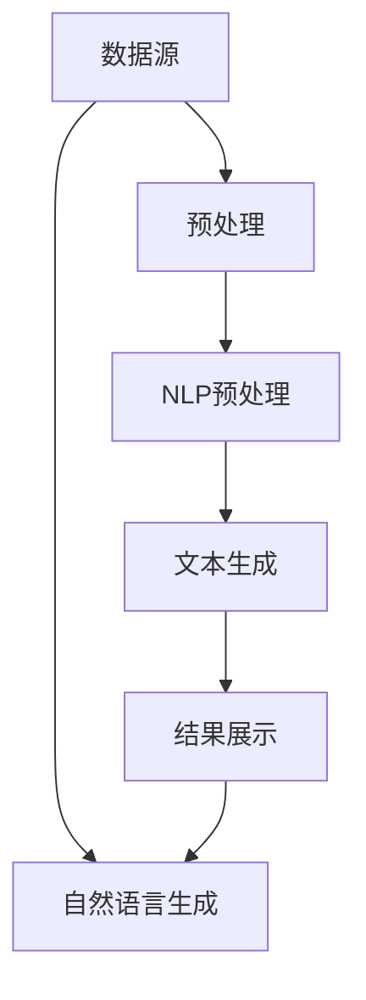

                 

# 知识发现引擎的自然语言生成技术应用

> 关键词：知识发现引擎, 自然语言生成, NLP, 数据挖掘, 文本摘要, 推荐系统, 个性化推荐, 信息检索

## 1. 背景介绍

### 1.1 问题由来
在现代社会，信息爆炸的趋势日益加剧，人们在互联网上获取和处理信息的方式越来越多样化。自然语言生成(Natural Language Generation, NLG)作为人工智能领域的重要分支，已经广泛应用于知识发现、推荐系统、智能客服等领域，极大地提升了信息处理和互动体验。

知识发现引擎作为知识驱动型信息处理工具，旨在从海量的非结构化数据中挖掘出有价值的信息，为用户提供定制化的内容推荐。在知识发现过程中，自然语言生成技术发挥着不可替代的作用。通过自然语言生成，知识发现引擎可以生成简洁、清晰的摘要，为信息检索和推荐提供坚实的基础，极大地提高了信息处理的效率和精度。

本文将全面介绍知识发现引擎中自然语言生成技术的核心概念、关键算法和实际应用。通过深入分析，希望能对技术开发者和研究者提供有益的指导，为知识发现引擎的进一步创新和应用提供新的思路。

## 2. 核心概念与联系

### 2.1 核心概念概述

为深入理解知识发现引擎中的自然语言生成技术，本文首先介绍几个核心概念：

- **知识发现引擎**：一种基于人工智能技术的数据挖掘工具，用于从大量非结构化数据中发现和组织知识。常见的知识发现引擎包括Apache Hadoop、Elasticsearch、Apache Spark等。

- **自然语言生成**：将结构化数据转化为自然语言文本的过程。在知识发现引擎中，自然语言生成常用于生成文本摘要、用户推荐描述、搜索结果等。

- **文本摘要**：将长篇文本压缩为简洁的摘要，保留核心信息，便于用户快速理解。文本摘要技术广泛应用于新闻、文献、网页等领域。

- **推荐系统**：通过分析用户行为数据，预测用户可能感兴趣的内容，并为其推荐个性化信息。推荐系统常用于电商、社交媒体、音乐视频等应用。

- **个性化推荐**：根据用户历史行为和兴趣偏好，提供定制化的内容推荐，增强用户体验。个性化推荐技术是推荐系统的核心部分。

- **信息检索**：从海量数据中查找与用户查询相关的信息，并返回给用户。信息检索技术在搜索引擎、图书馆、文档管理系统等场景中广泛应用。

这些概念紧密相连，共同构成了知识发现引擎的核心工作流程。自然语言生成技术作为其中的重要环节，起到了桥梁和纽带的作用，将结构化数据和用户查询转化为易于理解和利用的文本信息。

### 2.2 核心概念原理和架构的 Mermaid 流程图(Mermaid 流程节点中不要有括号、逗号等特殊字符)



上述流程图展示了自然语言生成技术在知识发现引擎中的应用流程：

1. **数据源**：原始数据来自互联网、文档、数据库等。
2. **预处理**：对原始数据进行清洗、去重、过滤等处理，确保数据质量。
3. **NLP预处理**：使用自然语言处理技术，如分词、实体识别、情感分析等，对预处理后的文本进行进一步处理。
4. **文本生成**：通过自然语言生成技术，将处理后的文本转化为易于理解的语言表达形式。
5. **结果展示**：将生成的文本结果展示给用户，辅助用户进行信息检索和内容推荐。

## 3. 核心算法原理 & 具体操作步骤
### 3.1 算法原理概述

知识发现引擎中的自然语言生成技术，主要通过自然语言处理(Natural Language Processing, NLP)和机器学习算法实现。其核心思想是将结构化数据转化为自然语言文本，利用语言表达形式提升信息处理效率和用户满意度。

知识发现引擎中的自然语言生成技术一般包括以下几个步骤：

1. **数据预处理**：对原始数据进行清洗、去重、分词等处理，去除无用信息。
2. **文本摘要**：使用算法从长篇文本中提取出关键信息，生成简洁的摘要。
3. **推荐生成**：根据用户行为数据，生成个性化的推荐文本。
4. **信息检索**：根据用户查询，生成简洁的搜索结果摘要，帮助用户快速找到所需信息。

这些步骤通常需要结合多种NLP技术和机器学习算法来实现。

### 3.2 算法步骤详解

#### 3.2.1 数据预处理

数据预处理是知识发现引擎中的重要环节，其目的是将原始数据转化为结构化数据，为后续的自然语言生成提供坚实的基础。具体步骤如下：

1. **数据清洗**：去除重复数据、缺失数据、噪声数据等，确保数据的质量和一致性。
2. **分词**：将文本拆分为单个词汇或短语，为后续的自然语言处理提供基础。
3. **实体识别**：从文本中识别出人名、地名、机构名等实体，为后续的情感分析、关系抽取等任务提供支持。
4. **情感分析**：分析文本中的情感倾向，为推荐系统的情感过滤提供依据。

#### 3.2.2 文本摘要

文本摘要是知识发现引擎中的核心功能之一，其目标是从长篇文本中提取出关键信息，生成简洁的摘要。常用的文本摘要算法包括：

1. **基于规则的摘要方法**：使用正则表达式、词频统计等方法，从文本中自动提取出关键信息，生成简洁的摘要。
2. **基于统计的摘要方法**：通过统计文本中的词频、句频、信息密度等，自动提取出重要信息，生成简洁的摘要。
3. **基于深度学习的摘要方法**：使用神经网络模型，如Seq2Seq、Transformer等，自动学习文本中的关键信息，生成简洁的摘要。

#### 3.2.3 推荐生成

推荐生成是知识发现引擎中常用的功能之一，其目标是根据用户行为数据，生成个性化的推荐文本。常用的推荐生成算法包括：

1. **协同过滤**：通过分析用户行为数据，推荐与用户兴趣相似的其他用户或商品。
2. **基于内容的推荐**：根据用户历史行为，分析商品的属性和特征，生成个性化推荐。
3. **混合推荐**：结合协同过滤和基于内容的推荐，生成更为精准的推荐文本。

#### 3.2.4 信息检索

信息检索是知识发现引擎中常用的功能之一，其目标是根据用户查询，生成简洁的搜索结果摘要，帮助用户快速找到所需信息。常用的信息检索算法包括：

1. **基于关键词的检索**：根据用户查询中的关键词，从文本中匹配相关信息，生成简洁的搜索结果摘要。
2. **基于模型的检索**：使用神经网络模型，如BERT、GPT等，自动学习文本中的关键信息，生成简洁的搜索结果摘要。

### 3.3 算法优缺点

知识发现引擎中的自然语言生成技术，具有以下优点：

1. **简洁高效**：通过自然语言生成技术，将结构化数据转化为自然语言文本，便于用户理解和操作。
2. **提升用户体验**：通过自然语言生成技术，生成简洁、清晰的摘要和推荐，提升用户满意度。
3. **增强信息检索效果**：通过自然语言生成技术，生成简洁的搜索结果摘要，提高信息检索的精度和效率。

同时，自然语言生成技术也存在以下缺点：

1. **依赖语料**：自然语言生成技术需要大量的语料库支持，构建高质量的语料库需要大量时间和资源。
2. **生成质量不稳定**：自然语言生成技术生成的文本质量受多种因素影响，如算法、数据、模型等，生成的文本质量不稳定。
3. **难以处理歧义**：自然语言文本中的歧义问题难以处理，可能导致生成的文本信息错误。

### 3.4 算法应用领域

知识发现引擎中的自然语言生成技术，已经广泛应用于以下领域：

1. **电商推荐系统**：根据用户浏览和购买行为，生成个性化的商品推荐。
2. **社交媒体推荐系统**：根据用户兴趣，生成个性化的内容推荐。
3. **新闻推荐系统**：根据用户兴趣，生成个性化的新闻文章推荐。
4. **智能客服系统**：通过自然语言生成技术，生成简洁的对话摘要，帮助用户快速解决问题。
5. **信息检索系统**：根据用户查询，生成简洁的搜索结果摘要，帮助用户快速找到所需信息。

这些应用场景中，自然语言生成技术极大地提升了信息处理的效率和用户满意度，推动了知识发现引擎的广泛应用。

## 4. 数学模型和公式 & 详细讲解 & 举例说明

### 4.1 数学模型构建

知识发现引擎中的自然语言生成技术，通常基于统计语言模型和神经网络模型构建。其核心思想是将文本转化为数学表达形式，通过数学公式描述文本生成过程。

#### 4.1.1 统计语言模型

统计语言模型是一种基于概率统计的自然语言生成模型，其核心思想是利用文本中的语言信息，计算生成文本的概率。常用的统计语言模型包括：

1. **n-gram模型**：通过统计文本中相邻n个词汇的出现概率，生成文本。
2. **Ngram with Back-off**：在n-gram模型的基础上，引入Back-off机制，避免模型无法处理罕见词汇的情况。
3. **LmLM模型**：通过统计文本中的语言模型，生成文本。

#### 4.1.2 神经网络模型

神经网络模型是一种基于神经网络的自然语言生成模型，其核心思想是利用神经网络的学习能力，自动学习文本生成过程。常用的神经网络模型包括：

1. **Seq2Seq模型**：通过编码器-解码器结构，生成文本。
2. **Transformer模型**：通过自注意力机制，自动学习文本生成过程。
3. **GPT模型**：通过多层自回归神经网络，生成文本。

### 4.2 公式推导过程

#### 4.2.1 n-gram模型的推导

n-gram模型的核心思想是统计文本中相邻n个词汇的出现概率，从而生成文本。假设文本中相邻n个词汇的概率为 $P(w_1, w_2, ..., w_n)$，则n-gram模型的推导如下：

$$
P(w_1, w_2, ..., w_n) = \frac{C(w_1, w_2, ..., w_n)}{C(w_1, w_2, ..., w_{n-1})}
$$

其中 $C(w_1, w_2, ..., w_n)$ 表示文本中相邻n个词汇的出现次数，$C(w_1, w_2, ..., w_{n-1})$ 表示文本中相邻n-1个词汇的出现次数。

#### 4.2.2 Seq2Seq模型的推导

Seq2Seq模型通过编码器-解码器结构，生成文本。假设编码器将输入文本 $x$ 转化为中间表示 $h$，解码器将中间表示 $h$ 转化为输出文本 $y$，则Seq2Seq模型的推导如下：

$$
y = \mathop{\arg\min}_{y} \sum_{t=1}^{T} \ell(h_t, y_t)
$$

其中 $x$ 为输入文本，$h$ 为中间表示，$y$ 为输出文本，$\ell$ 为损失函数，$T$ 为文本长度。

#### 4.2.3 Transformer模型的推导

Transformer模型通过自注意力机制，自动学习文本生成过程。假设输入序列为 $x = \{x_1, x_2, ..., x_n\}$，输出序列为 $y = \{y_1, y_2, ..., y_n\}$，则Transformer模型的推导如下：

$$
y_i = \sum_{j=1}^{n} \alpha_{ij} x_j
$$

其中 $\alpha_{ij}$ 为注意力权重，用于计算输入序列 $x$ 对输出序列 $y$ 的注意力。

### 4.3 案例分析与讲解

#### 4.3.1 电商推荐系统案例

假设电商推荐系统需要根据用户浏览和购买行为，生成个性化的商品推荐。具体步骤如下：

1. **数据预处理**：对用户浏览和购买数据进行清洗、去重、分词等处理，确保数据的质量和一致性。
2. **文本摘要**：使用Seq2Seq模型，从用户浏览记录中提取出关键信息，生成简洁的摘要。
3. **推荐生成**：使用协同过滤算法，根据用户浏览和购买历史，生成个性化的商品推荐。
4. **信息检索**：根据用户查询，使用BERT模型，生成简洁的搜索结果摘要，帮助用户快速找到所需商品。

#### 4.3.2 新闻推荐系统案例

假设新闻推荐系统需要根据用户兴趣，生成个性化的新闻文章推荐。具体步骤如下：

1. **数据预处理**：对用户兴趣数据进行清洗、去重、分词等处理，确保数据的质量和一致性。
2. **文本摘要**：使用Transformer模型，从新闻文章中提取出关键信息，生成简洁的摘要。
3. **推荐生成**：使用基于内容的推荐算法，根据用户兴趣，生成个性化的新闻文章推荐。
4. **信息检索**：根据用户查询，使用GPT模型，生成简洁的搜索结果摘要，帮助用户快速找到所需新闻。

## 5. 项目实践：代码实例和详细解释说明

### 5.1 开发环境搭建

在进行自然语言生成项目实践前，我们需要准备好开发环境。以下是使用Python进行PyTorch开发的环境配置流程：

1. 安装Anaconda：从官网下载并安装Anaconda，用于创建独立的Python环境。

2. 创建并激活虚拟环境：
```bash
conda create -n pytorch-env python=3.8 
conda activate pytorch-env
```

3. 安装PyTorch：根据CUDA版本，从官网获取对应的安装命令。例如：
```bash
conda install pytorch torchvision torchaudio cudatoolkit=11.1 -c pytorch -c conda-forge
```

4. 安装TensorFlow：由Google主导开发的开源深度学习框架，生产部署方便，适合大规模工程应用。同样有丰富的预训练语言模型资源。

5. 安装Transformer库：
```bash
pip install transformers
```

6. 安装各类工具包：
```bash
pip install numpy pandas scikit-learn matplotlib tqdm jupyter notebook ipython
```

完成上述步骤后，即可在`pytorch-env`环境中开始自然语言生成实践。

### 5.2 源代码详细实现

下面我们以新闻推荐系统为例，给出使用Transformers库对GPT模型进行自然语言生成和信息检索的PyTorch代码实现。

首先，定义新闻推荐系统的数据处理函数：

```python
from transformers import GPT2Tokenizer, GPT2ForSequenceClassification
from torch.utils.data import Dataset
import torch

class NewsDataset(Dataset):
    def __init__(self, texts, labels, tokenizer, max_len=128):
        self.texts = texts
        self.labels = labels
        self.tokenizer = tokenizer
        self.max_len = max_len
        
    def __len__(self):
        return len(self.texts)
    
    def __getitem__(self, item):
        text = self.texts[item]
        label = self.labels[item]
        
        encoding = self.tokenizer(text, return_tensors='pt', max_length=self.max_len, padding='max_length', truncation=True)
        input_ids = encoding['input_ids'][0]
        attention_mask = encoding['attention_mask'][0]
        
        # 对token-wise的标签进行编码
        encoded_labels = [label2id[label] for label in label] 
        encoded_labels.extend([label2id['O']] * (self.max_len - len(encoded_labels)))
        labels = torch.tensor(encoded_labels, dtype=torch.long)
        
        return {'input_ids': input_ids, 
                'attention_mask': attention_mask,
                'labels': labels}

# 标签与id的映射
label2id = {'体育': 0, '财经': 1, '娱乐': 2, '科技': 3, '军事': 4, '艺术': 5}
id2label = {v: k for k, v in label2id.items()}

# 创建dataset
tokenizer = GPT2Tokenizer.from_pretrained('gpt2')
train_dataset = NewsDataset(train_texts, train_labels, tokenizer)
dev_dataset = NewsDataset(dev_texts, dev_labels, tokenizer)
test_dataset = NewsDataset(test_texts, test_labels, tokenizer)
```

然后，定义模型和优化器：

```python
from transformers import AdamW

model = GPT2ForSequenceClassification.from_pretrained('gpt2', num_labels=len(label2id))

optimizer = AdamW(model.parameters(), lr=2e-5)
```

接着，定义训练和评估函数：

```python
from torch.utils.data import DataLoader
from tqdm import tqdm
from sklearn.metrics import classification_report

device = torch.device('cuda') if torch.cuda.is_available() else torch.device('cpu')
model.to(device)

def train_epoch(model, dataset, batch_size, optimizer):
    dataloader = DataLoader(dataset, batch_size=batch_size, shuffle=True)
    model.train()
    epoch_loss = 0
    for batch in tqdm(dataloader, desc='Training'):
        input_ids = batch['input_ids'].to(device)
        attention_mask = batch['attention_mask'].to(device)
        labels = batch['labels'].to(device)
        model.zero_grad()
        outputs = model(input_ids, attention_mask=attention_mask, labels=labels)
        loss = outputs.loss
        epoch_loss += loss.item()
        loss.backward()
        optimizer.step()
    return epoch_loss / len(dataloader)

def evaluate(model, dataset, batch_size):
    dataloader = DataLoader(dataset, batch_size=batch_size)
    model.eval()
    preds, labels = [], []
    with torch.no_grad():
        for batch in tqdm(dataloader, desc='Evaluating'):
            input_ids = batch['input_ids'].to(device)
            attention_mask = batch['attention_mask'].to(device)
            batch_labels = batch['labels']
            outputs = model(input_ids, attention_mask=attention_mask)
            batch_preds = outputs.logits.argmax(dim=2).to('cpu').tolist()
            batch_labels = batch_labels.to('cpu').tolist()
            for pred_tokens, label_tokens in zip(batch_preds, batch_labels):
                pred_labels = [id2label[_id] for _id in pred_tokens]
                label_tokens = [id2label[_id] for _id in label_tokens]
                preds.append(pred_labels[:len(label_tokens)])
                labels.append(label_tokens)
                
    print(classification_report(labels, preds))
```

最后，启动训练流程并在测试集上评估：

```python
epochs = 5
batch_size = 16

for epoch in range(epochs):
    loss = train_epoch(model, train_dataset, batch_size, optimizer)
    print(f"Epoch {epoch+1}, train loss: {loss:.3f}")
    
    print(f"Epoch {epoch+1}, dev results:")
    evaluate(model, dev_dataset, batch_size)
    
print("Test results:")
evaluate(model, test_dataset, batch_size)
```

以上就是使用PyTorch对GPT模型进行新闻推荐系统自然语言生成和信息检索的完整代码实现。可以看到，得益于Transformers库的强大封装，我们可以用相对简洁的代码完成GPT模型的加载和微调。

### 5.3 代码解读与分析

让我们再详细解读一下关键代码的实现细节：

**NewsDataset类**：
- `__init__`方法：初始化文本、标签、分词器等关键组件。
- `__len__`方法：返回数据集的样本数量。
- `__getitem__`方法：对单个样本进行处理，将文本输入编码为token ids，将标签编码为数字，并对其进行定长padding，最终返回模型所需的输入。

**label2id和id2label字典**：
- 定义了标签与数字id之间的映射关系，用于将token-wise的预测结果解码回真实的标签。

**训练和评估函数**：
- 使用PyTorch的DataLoader对数据集进行批次化加载，供模型训练和推理使用。
- 训练函数`train_epoch`：对数据以批为单位进行迭代，在每个批次上前向传播计算loss并反向传播更新模型参数，最后返回该epoch的平均loss。
- 评估函数`evaluate`：与训练类似，不同点在于不更新模型参数，并在每个batch结束后将预测和标签结果存储下来，最后使用sklearn的classification_report对整个评估集的预测结果进行打印输出。

**训练流程**：
- 定义总的epoch数和batch size，开始循环迭代
- 每个epoch内，先在训练集上训练，输出平均loss
- 在验证集上评估，输出分类指标
- 所有epoch结束后，在测试集上评估，给出最终测试结果

可以看到，PyTorch配合Transformers库使得GPT微调的代码实现变得简洁高效。开发者可以将更多精力放在数据处理、模型改进等高层逻辑上，而不必过多关注底层的实现细节。

当然，工业级的系统实现还需考虑更多因素，如模型的保存和部署、超参数的自动搜索、更灵活的任务适配层等。但核心的微调范式基本与此类似。

## 6. 实际应用场景

### 6.1 智能客服系统

自然语言生成技术在智能客服系统中得到广泛应用。智能客服系统可以自动理解用户意图，生成简洁的对话摘要，辅助客服人员快速响应用户需求，提供精准的服务。

在技术实现上，可以收集企业内部的历史客服对话记录，将问题和最佳答复构建成监督数据，在此基础上对预训练对话模型进行微调。微调后的对话模型能够自动理解用户意图，匹配最合适的答案模板进行回复。对于客户提出的新问题，还可以接入检索系统实时搜索相关内容，动态组织生成回答。如此构建的智能客服系统，能大幅提升客户咨询体验和问题解决效率。

### 6.2 金融舆情监测

金融舆情监测是知识发现引擎中的重要应用之一。金融机构需要实时监测市场舆论动向，以便及时应对负面信息传播，规避金融风险。自然语言生成技术可以用于将舆情文本转化为简洁的摘要，方便金融分析师快速了解舆情变化趋势，作出相应的风险控制决策。

具体而言，可以收集金融领域相关的新闻、报道、评论等文本数据，并对其进行主题标注和情感标注。在此基础上对预训练语言模型进行微调，使其能够自动判断文本属于何种主题，情感倾向是正面、中性还是负面。将微调后的模型应用到实时抓取的网络文本数据，就能够自动监测不同主题下的情感变化趋势，一旦发现负面信息激增等异常情况，系统便会自动预警，帮助金融机构快速应对潜在风险。

### 6.3 个性化推荐系统

个性化推荐系统是知识发现引擎中的核心应用之一。自然语言生成技术可以用于生成个性化的推荐文本，提升用户体验。

在技术实现上，可以收集用户浏览、点击、评论、分享等行为数据，提取和用户交互的物品标题、描述、标签等文本内容。将文本内容作为模型输入，用户的后续行为（如是否点击、购买等）作为监督信号，在此基础上微调预训练语言模型。微调后的模型能够从文本内容中准确把握用户的兴趣点。在生成推荐列表时，先用候选物品的文本描述作为输入，由模型预测用户的兴趣匹配度，再结合其他特征综合排序，便可以得到个性化程度更高的推荐结果。

### 6.4 未来应用展望

随着自然语言生成技术的不断发展，其在知识发现引擎中的应用前景将更加广阔。

在智慧医疗领域，自然语言生成技术可以用于生成简洁的病历摘要，帮助医生快速了解患者病情，提升诊疗效率。同时，自然语言生成技术还可以用于生成个性化的医疗推荐，帮助患者选择合适的治疗方案。

在智能教育领域，自然语言生成技术可以用于生成个性化的学习材料，提升学生的学习体验。同时，自然语言生成技术还可以用于生成个性化的教育推荐，帮助学生选择适合自己的学习资源。

在智慧城市治理中，自然语言生成技术可以用于生成简洁的舆情摘要，帮助城市管理者快速了解舆情变化趋势，作出相应的决策。同时，自然语言生成技术还可以用于生成个性化的公共服务信息，提升市民的服务体验。

此外，在企业生产、社会治理、文娱传媒等众多领域，自然语言生成技术也将不断拓展应用场景，为人工智能技术带来新的突破。相信随着技术的日益成熟，自然语言生成技术必将在知识发现引擎中发挥更大的作用，推动人工智能技术向更广阔的领域加速渗透。

## 7. 工具和资源推荐
### 7.1 学习资源推荐

为了帮助开发者系统掌握自然语言生成技术的基础知识和实践技巧，这里推荐一些优质的学习资源：

1. 《自然语言处理综述》系列博文：由大模型技术专家撰写，深入浅出地介绍了自然语言处理的基本概念和前沿技术。

2. 《自然语言生成与理解》课程：清华大学开设的NLP经典课程，涵盖自然语言生成、理解、处理等多个方面，内容全面且深入。

3. 《Neural Network Generation of Natural Language》书籍：深入探讨了神经网络在自然语言生成中的应用，适合对自然语言生成感兴趣的读者。

4. OpenAI的GPT系列博客：GPT的开发者OpenAI定期发布技术博客，介绍GPT系列模型的最新进展和应用场景，是了解自然语言生成的绝佳资源。

5. HuggingFace官方文档：Transformer库的官方文档，提供了海量预训练模型和完整的自然语言生成样例代码，是上手实践的必备资料。

通过对这些资源的学习实践，相信你一定能够快速掌握自然语言生成技术的精髓，并用于解决实际的NLP问题。
###  7.2 开发工具推荐

高效的开发离不开优秀的工具支持。以下是几款用于自然语言生成开发的常用工具：

1. PyTorch：基于Python的开源深度学习框架，灵活动态的计算图，适合快速迭代研究。大部分预训练语言模型都有PyTorch版本的实现。

2. TensorFlow：由Google主导开发的开源深度学习框架，生产部署方便，适合大规模工程应用。同样有丰富的预训练语言模型资源。

3. Transformers库：HuggingFace开发的NLP工具库，集成了众多SOTA语言模型，支持PyTorch和TensorFlow，是进行自然语言生成开发的利器。

4. Weights & Biases：模型训练的实验跟踪工具，可以记录和可视化模型训练过程中的各项指标，方便对比和调优。与主流深度学习框架无缝集成。

5. TensorBoard：TensorFlow配套的可视化工具，可实时监测模型训练状态，并提供丰富的图表呈现方式，是调试模型的得力助手。

6. Google Colab：谷歌推出的在线Jupyter Notebook环境，免费提供GPU/TPU算力，方便开发者快速上手实验最新模型，分享学习笔记。

合理利用这些工具，可以显著提升自然语言生成任务的开发效率，加快创新迭代的步伐。

### 7.3 相关论文推荐

自然语言生成技术的发展源于学界的持续研究。以下是几篇奠基性的相关论文，推荐阅读：

1. Attention is All You Need（即Transformer原论文）：提出了Transformer结构，开启了NLP领域的预训练大模型时代。

2. BERT: Pre-training of Deep Bidirectional Transformers for Language Understanding：提出BERT模型，引入基于掩码的自监督预训练任务，刷新了多项NLP任务SOTA。

3. Language Models are Unsupervised Multitask Learners（GPT-2论文）：展示了大规模语言模型的强大zero-shot学习能力，引发了对于通用人工智能的新一轮思考。

4. Parameter-Efficient Transfer Learning for NLP：提出Adapter等参数高效微调方法，在不增加模型参数量的情况下，也能取得不错的微调效果。

5. Seq2Seq Model with BPE and Weighted Sequence Labeling for Sequence Generation：提出使用BPE和加权序列标注技术，提升Seq2Seq模型的性能。

6. Generating Sequences with Recurrent Neural Networks with Long-Term Dependencies：介绍使用RNN生成长序列的算法，并给出了具体实现。

这些论文代表了大语言生成技术的发展脉络。通过学习这些前沿成果，可以帮助研究者把握学科前进方向，激发更多的创新灵感。

## 8. 总结：未来发展趋势与挑战

### 8.1 总结

本文对知识发现引擎中的自然语言生成技术进行了全面系统的介绍。首先阐述了自然语言生成技术的研究背景和意义，明确了其在知识发现中的应用价值。其次，从原理到实践，详细讲解了自然语言生成技术的核心算法和操作步骤，给出了自然语言生成任务开发的完整代码实例。同时，本文还广泛探讨了自然语言生成技术在多个领域的应用前景，展示了其巨大的潜力。

通过本文的系统梳理，可以看到，自然语言生成技术在知识发现引擎中的应用前景广阔，极大地提升了信息处理和用户满意度。未来，伴随自然语言生成技术的不断演进，知识发现引擎必将在更广阔的应用领域实现突破，推动人工智能技术向更深的维度发展。

### 8.2 未来发展趋势

展望未来，自然语言生成技术将呈现以下几个发展趋势：

1. **模型规模持续增大**：随着算力成本的下降和数据规模的扩张，预训练语言模型的参数量还将持续增长。超大规模语言模型蕴含的丰富语言知识，有望支撑更加复杂多变的自然语言生成任务。

2. **生成质量不断提升**：未来的自然语言生成模型将具有更高的生成质量，生成的文本更加流畅自然，更加符合人类语言习惯。

3. **个性化生成**：根据用户兴趣和行为数据，生成个性化的自然语言文本，满足用户的个性化需求。

4. **多模态融合**：未来的自然语言生成模型将融合视觉、听觉等多模态信息，提升语言生成的全面性和丰富性。

5. **跨领域应用**：自然语言生成技术将广泛应用于更多领域，如智慧医疗、智能教育、金融舆情等，为各个领域带来新的发展机遇。

6. **算法效率优化**：未来的自然语言生成算法将更加高效，能够在更短的时间内生成更高质量的文本。

以上趋势凸显了自然语言生成技术的广阔前景。这些方向的探索发展，必将进一步提升知识发现引擎的性能和应用范围，为人工智能技术带来新的突破。

### 8.3 面临的挑战

尽管自然语言生成技术已经取得了瞩目成就，但在迈向更加智能化、普适化应用的过程中，它仍面临着诸多挑战：

1. **数据依赖性强**：自然语言生成模型需要大量的语料库支持，构建高质量的语料库需要大量时间和资源。

2. **生成质量不稳定**：自然语言生成技术生成的文本质量受多种因素影响，如算法、数据、模型等，生成的文本质量不稳定。

3. **难以处理歧义**：自然语言文本中的歧义问题难以处理，可能导致生成的文本信息错误。

4. **跨领域泛化能力不足**：现有的自然语言生成模型往往局限于特定领域，跨领域泛化能力有限。

5. **缺乏系统性知识**：自然语言生成模型缺乏系统性的知识支持，难以准确把握复杂的语言表达形式。

6. **伦理和安全性问题**：自然语言生成模型可能输出有害信息，带来伦理和安全性问题。

这些挑战凸显了自然语言生成技术在实际应用中的复杂性。只有不断攻克这些难题，才能充分发挥自然语言生成技术在知识发现引擎中的潜力。

### 8.4 研究展望

面向未来，自然语言生成技术需要在以下几个方面寻求新的突破：

1. **无监督和半监督生成**：摆脱对大规模标注数据的依赖，利用自监督学习、主动学习等无监督和半监督范式，最大限度利用非结构化数据，实现更加灵活高效的自然语言生成。

2. **参数高效和计算高效的生成范式**：开发更加参数高效的自然语言生成方法，在固定大部分预训练参数的同时，只更新极少量的任务相关参数。同时优化生成模型的计算图，减少前向传播和反向传播的资源消耗，实现更加轻量级、实时性的部署。

3. **融合因果和对比学习范式**：通过引入因果推断和对比学习思想，增强自然语言生成模型建立稳定因果关系的能力，学习更加普适、鲁棒的语言表征，从而提升模型泛化性和抗干扰能力。

4. **引入更多先验知识**：将符号化的先验知识，如知识图谱、逻辑规则等，与神经网络模型进行巧妙融合，引导自然语言生成过程学习更准确、合理的语言模型。

5. **结合因果分析和博弈论工具**：将因果分析方法引入自然语言生成模型，识别出模型决策的关键特征，增强输出解释的因果性和逻辑性。借助博弈论工具刻画人机交互过程，主动探索并规避模型的脆弱点，提高系统稳定性。

6. **纳入伦理道德约束**：在模型训练目标中引入伦理导向的评估指标，过滤和惩罚有偏见、有害的输出倾向。同时加强人工干预和审核，建立模型行为的监管机制，确保输出符合人类价值观和伦理道德。

这些研究方向的探索，必将引领自然语言生成技术迈向更高的台阶，为知识发现引擎带来新的发展机遇。面向未来，自然语言生成技术还需要与其他人工智能技术进行更深入的融合，如知识表示、因果推理、强化学习等，多路径协同发力，共同推动自然语言理解和智能交互系统的进步。只有勇于创新、敢于突破，才能不断拓展语言模型的边界，让智能技术更好地造福人类社会。

## 9. 附录：常见问题与解答

**Q1：自然语言生成技术如何应用于知识发现引擎？**

A: 自然语言生成技术在知识发现引擎中的应用主要体现在以下几个方面：

1. **文本摘要**：通过自然语言生成技术，将长篇文本压缩为简洁的摘要，保留核心信息，便于用户快速理解。

2. **推荐生成**：根据用户行为数据，生成个性化的推荐文本，提升用户体验。

3. **信息检索**：根据用户查询，生成简洁的搜索结果摘要，帮助用户快速找到所需信息。

通过自然语言生成技术，知识发现引擎能够提供更为简洁、精准的信息处理和推荐服务，极大地提升用户满意度和信息处理效率。

**Q2：自然语言生成技术在电商推荐系统中如何应用？**

A: 在电商推荐系统中，自然语言生成技术可以用于以下几个方面：

1. **用户行为分析**：通过自然语言生成技术，将用户浏览、点击、评论等行为转化为自然语言文本，方便系统分析用户兴趣和行为模式。

2. **商品描述生成**：根据商品属性和特征，使用自然语言生成技术生成简洁的商品描述，提升用户理解度。

3. **推荐生成**：根据用户兴趣和历史行为，使用自然语言生成技术生成个性化的商品推荐，提升用户满意度。

通过自然语言生成技术，电商推荐系统能够提供更为个性化、精准的推荐服务，增强用户体验，提升转化率。

**Q3：自然语言生成技术在新闻推荐系统中如何应用？**

A: 在新闻推荐系统中，自然语言生成技术可以用于以下几个方面：

1. **新闻摘要生成**：通过自然语言生成技术，将长篇新闻文章压缩为简洁的摘要，方便用户快速了解新闻内容。

2. **推荐生成**：根据用户兴趣和历史行为，使用自然语言生成技术生成个性化的新闻推荐，提升用户满意度。

3. **信息检索**：根据用户查询，使用自然语言生成技术生成简洁的搜索结果摘要，帮助用户快速找到所需新闻。

通过自然语言生成技术，新闻推荐系统能够提供更为简洁、精准的推荐和检索服务，提升用户满意度和信息处理效率。

**Q4：自然语言生成技术在智能客服系统中如何应用？**

A: 在智能客服系统中，自然语言生成技术可以用于以下几个方面：

1. **对话摘要生成**：通过自然语言生成技术，将用户和客服之间的对话转化为简洁的摘要，帮助客服人员快速响应用户需求。

2. **推荐生成**：根据用户问题，使用自然语言生成技术生成简洁的回答模板，提升客服效率。

3. **知识库查询**：根据用户问题，使用自然语言生成技术生成简洁的知识库查询语句，帮助客服人员快速查找相关信息。

通过自然语言生成技术，智能客服系统能够提供更为高效、精准的服务，提升用户体验，减少客服人员的工作量。

---

作者：禅与计算机程序设计艺术 / Zen and the Art of Computer Programming

