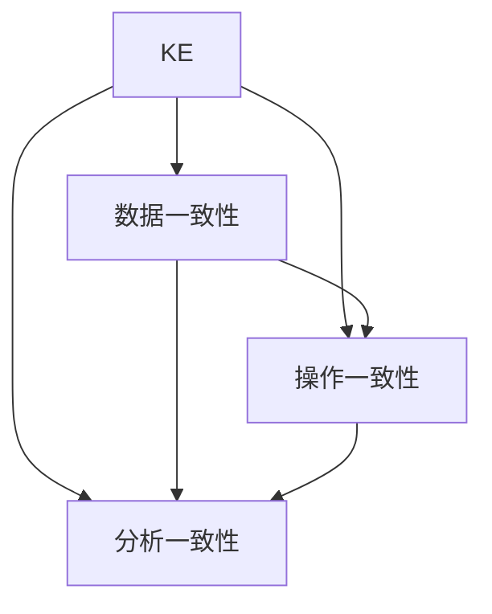

                 

# 知识发现引擎的跨平台同步技术

## 1. 背景介绍

### 1.1 问题由来
在当今信息爆炸的时代，知识发现引擎(KE)已经成为了各行各业数据驱动决策的重要工具。KE系统通过对海量数据的分析和挖掘，可以发现潜在的模式、关联和趋势，为决策者提供精准的洞察。然而，KE系统的复杂性和多样性带来了跨平台、跨环境的同步问题，即如何在不同平台和环境中保持KE系统的数据一致性、操作一致性和分析一致性。

### 1.2 问题核心关键点
1. 数据一致性：KE系统需要在不同的平台和环境中保持数据源的一致性和准确性。
2. 操作一致性：KE系统需要在不同平台和环境下的操作逻辑和用户界面保持一致。
3. 分析一致性：KE系统需要在不同平台和环境下的分析模型和结果保持一致。

### 1.3 问题研究意义
解决KE系统的跨平台同步问题，对于提升数据驱动决策的准确性和可靠性，推动知识发现技术的普及和应用，具有重要意义：

1. 提升决策可靠性：通过跨平台同步，KE系统可以在不同环境中保持数据和分析结果的一致性，从而提升决策的准确性和可靠性。
2. 降低部署成本：跨平台同步技术可以简化KE系统的部署流程，减少在不同平台上的开发和测试工作量。
3. 促进知识共享：跨平台同步使得KE系统的分析和洞察结果可以方便地在不同平台间共享，促进知识的积累和传播。
4. 增强系统灵活性：跨平台同步技术使得KE系统可以在多种环境中灵活部署和运行，适应不同的业务需求。

## 2. 核心概念与联系

### 2.1 核心概念概述

为了更好地理解跨平台同步技术，本节将介绍几个密切相关的核心概念：

- 知识发现引擎(KE)：一种能够通过分析数据挖掘出有价值知识的工具。KE系统通常包括数据存储、数据预处理、模型训练、结果展示等模块。
- 跨平台同步：KE系统在不同平台（如不同操作系统、不同数据库、不同编程语言等）之间的数据、操作和分析结果的同步过程。
- 数据一致性：指KE系统在不同平台上的数据源保持一致，包括数据的格式、内容、结构等。
- 操作一致性：指KE系统在不同平台上的操作逻辑和用户界面保持一致，用户可以以同样的方式操作系统。
- 分析一致性：指KE系统在不同平台上的分析模型和结果保持一致，分析结果具有相同的效果。

这些核心概念之间的逻辑关系可以通过以下Mermaid流程图来展示：



这个流程图展示了几大核心概念之间的关系：

1. KE系统通过数据一致性、操作一致性和分析一致性，实现了跨平台同步。
2. 数据一致性、操作一致性和分析一致性是KE系统跨平台同步的三个关键维度。
3. 数据一致性和操作一致性是实现分析一致性的基础。

## 3. 核心算法原理 & 具体操作步骤
### 3.1 算法原理概述

跨平台同步技术通常基于分布式数据处理框架，通过跨平台数据交换和同步技术实现。其核心思想是：在不同平台和环境中，使用标准化的数据接口和通信协议，实现数据、操作和分析结果的无缝同步。

形式化地，假设有多个平台$P_1, P_2, \ldots, P_n$，KE系统的数据存储和操作逻辑分布在这些平台上，需要实现跨平台同步。设$S$为数据一致性集，$O$为操作一致性集，$A$为分析一致性集。跨平台同步的目标是最大化$S, O, A$的交集，即最大化$S \cap O \cap A$。

### 3.2 算法步骤详解

基于分布式数据处理框架的跨平台同步，一般包括以下几个关键步骤：

**Step 1: 设计数据一致性策略**
- 定义数据源的元数据结构，确保不同平台上的数据源具有相同的格式和结构。
- 使用标准化的数据交换格式（如JSON、XML、CSV等），确保数据在不同平台上的格式一致。
- 采用数据版本控制机制，记录数据的历史版本，以便在数据冲突时进行回溯和恢复。

**Step 2: 实现操作一致性机制**
- 在不同平台和环境中，设计统一的操作接口和用户界面，确保用户可以以相同的方式操作系统。
- 使用消息队列、RMI、WebSocket等通信协议，实现不同平台之间的远程调用和数据同步。
- 采用事务管理机制，确保操作的一致性和原子性。

**Step 3: 实现分析一致性模型**
- 在不同平台和环境中，设计统一的分析模型和算法，确保分析结果的一致性。
- 使用分布式计算框架（如Apache Hadoop、Apache Spark等），实现数据的并行处理和分析。
- 采用模型版本控制和迭代训练机制，确保分析模型的及时更新和优化。

**Step 4: 执行跨平台同步**
- 使用分布式数据处理框架，实现数据的跨平台交换和同步。
- 使用分布式计算框架，实现跨平台的操作和分析逻辑的协同执行。
- 定期监测数据和分析结果的一致性，及时发现和解决冲突问题。

### 3.3 算法优缺点

跨平台同步技术具有以下优点：
1. 提升系统可靠性：通过跨平台同步，确保KE系统在不同平台和环境下的数据一致性和分析一致性，从而提升系统的可靠性和稳定性。
2. 促进知识共享：跨平台同步使得KE系统的分析结果和洞察结果可以方便地在不同平台间共享，促进知识的积累和传播。
3. 降低部署成本：跨平台同步技术可以简化KE系统的部署流程，减少在不同平台上的开发和测试工作量。

同时，该方法也存在一定的局限性：
1. 依赖标准接口：跨平台同步依赖于标准化的数据接口和通信协议，不同平台之间的兼容性和适配性可能成为制约因素。
2. 数据传输延迟：跨平台数据传输可能带来一定的延迟，影响系统的实时性。
3. 资源消耗较大：跨平台同步需要在多个平台之间进行数据交换和同步，可能带来较大的资源消耗。
4. 灵活性受限：跨平台同步技术在一定程度上限制了KE系统在不同平台上的灵活部署和运行。

尽管存在这些局限性，但就目前而言，跨平台同步技术仍是大规模知识发现系统的重要保障，具有广泛的应用前景。未来相关研究的重点在于如何进一步优化数据传输效率，提高系统的实时性和灵活性，同时兼顾一致性和安全性等因素。

### 3.4 算法应用领域

跨平台同步技术在知识发现引擎的多个应用领域都有广泛的应用，例如：

- 数据分析平台：跨平台同步使得多个数据分析平台的数据源、操作逻辑和分析模型保持一致，方便数据的联合分析和共享。
- 实时业务系统：跨平台同步技术使得实时业务系统在不同环境下的数据一致性和操作一致性得以保障，从而提升业务系统的稳定性和可靠性。
- 数据湖架构：跨平台同步技术使得数据湖架构在不同存储和计算平台上的数据一致性和分析一致性得到保证，方便数据的长期存储和深度挖掘。
- 多云环境：跨平台同步技术使得多云环境下的KE系统在不同云平台上的数据一致性和操作一致性得以保障，促进云资源的优化利用。
- 分布式系统：跨平台同步技术使得分布式系统在不同节点和环境下的数据一致性和操作一致性得到保证，从而提升分布式系统的稳定性和效率。

除了上述这些经典应用外，跨平台同步技术还被创新性地应用于更多场景中，如数据联邦、边缘计算、异构数据集成等，为大规模知识发现系统的建设和运行提供了新的技术支持。

## 4. 数学模型和公式 & 详细讲解  
### 4.1 数学模型构建

本节将使用数学语言对跨平台同步技术进行更加严格的刻画。

假设有两个平台$P_1$和$P_2$，KE系统的数据存储和操作逻辑分别分布在这些平台上。设$S_1$和$S_2$分别为$P_1$和$P_2$上的数据源，$O_1$和$O_2$分别为$P_1$和$P_2$上的操作逻辑，$A_1$和$A_2$分别为$P_1$和$P_2$上的分析模型。

定义数据一致性约束$C_{S1S2}=(O_1,O_2)$，表示$P_1$和$P_2$上的数据源$S_1$和$S_2$需要满足相同的操作约束$O_1$和$O_2$，确保数据的一致性。

定义操作一致性约束$C_{O1O2}=(S_1,S_2)$，表示$P_1$和$P_2$上的操作逻辑$O_1$和$O_2$需要满足相同的数据约束$S_1$和$S_2$，确保操作的一致性。

定义分析一致性约束$C_{A1A2}=(O_1,O_2)$，表示$P_1$和$P_2$上的分析模型$A_1$和$A_2$需要满足相同的操作约束$O_1$和$O_2$，确保分析的一致性。

跨平台同步的目标是最小化$C_{S1S2} \cup C_{O1O2} \cup C_{A1A2}$的交集，即最大化$S_1 \cap O_1 \cap A_1 \cap S_2 \cap O_2 \cap A_2$。

### 4.2 公式推导过程

以下我们以跨平台同步的数据一致性约束为例，推导其满足条件的数学公式。

设$S_1$和$S_2$的数据源分别为$D_1$和$D_2$，其元数据结构分别为$\mathcal{D}_1$和$\mathcal{D}_2$，操作约束分别为$O_1$和$O_2$。则数据一致性约束$C_{S1S2}$可以表示为：

$$
C_{S1S2} = \{ (x_1, x_2) \mid x_1 \in D_1, x_2 \in D_2, O_1(x_1) = O_2(x_2) \}
$$

其中，$O_1$和$O_2$为数据源的操作约束函数，确保不同平台上的数据源满足相同的操作逻辑。

在满足数据一致性约束$C_{S1S2}$的条件下，跨平台同步的数据一致性函数$F_{S1S2}$可以表示为：

$$
F_{S1S2}(x_1, x_2) = \begin{cases}
1 & \text{if } x_1 \in D_1 \text{ and } x_2 \in D_2 \text{ and } O_1(x_1) = O_2(x_2) \\
0 & \text{otherwise}
\end{cases}
$$

在得到数据一致性函数后，即可进一步推导跨平台同步的操作一致性和分析一致性函数。

## 5. 项目实践：代码实例和详细解释说明
### 5.1 开发环境搭建

在进行跨平台同步实践前，我们需要准备好开发环境。以下是使用Python进行PyTorch开发的环境配置流程：

1. 安装Anaconda：从官网下载并安装Anaconda，用于创建独立的Python环境。

2. 创建并激活虚拟环境：
```bash
conda create -n pytorch-env python=3.8 
conda activate pytorch-env
```

3. 安装PyTorch：根据CUDA版本，从官网获取对应的安装命令。例如：
```bash
conda install pytorch torchvision torchaudio cudatoolkit=11.1 -c pytorch -c conda-forge
```

4. 安装TensorFlow：
```bash
pip install tensorflow
```

5. 安装Keras：
```bash
pip install keras
```

6. 安装各类工具包：
```bash
pip install numpy pandas scikit-learn matplotlib tqdm jupyter notebook ipython
```

完成上述步骤后，即可在`pytorch-env`环境中开始跨平台同步实践。

### 5.2 源代码详细实现

下面我们以跨平台同步的数据一致性约束为例，给出使用PyTorch进行跨平台同步的代码实现。

首先，定义数据一致性约束函数：

```python
from torch import nn

class DataConsistency(nn.Module):
    def __init__(self, data1, data2):
        super().__init__()
        self.data1 = data1
        self.data2 = data2
        self.num_sources = len(data1)
        self.num_operators = len(data2)
        
    def forward(self, x1, x2):
        return torch.tensor([1 if self.operate_consistent(x1[i], x2[j]) else 0 for i in range(self.num_sources) for j in range(self.num_operators)], dtype=torch.float)
    
    def operate_consistent(self, x1, x2):
        # 根据实际需求定义数据一致性操作
        pass
```

然后，定义跨平台同步的数据一致性函数：

```python
from torch.nn.functional import binary_cross_entropy

def platform_data_consistency(data1, data2, consistent_constraint):
    x1 = torch.tensor(data1, dtype=torch.float)
    x2 = torch.tensor(data2, dtype=torch.float)
    y = consistent_constraint(x1, x2)
    loss = binary_cross_entropy(y, torch.tensor([1 if consistent_constraint(x1, x2) else 0]))
    return loss
```

最后，启动训练流程并在测试集上评估：

```python
epochs = 10
batch_size = 64

for epoch in range(epochs):
    loss = platform_data_consistency(train_data1, train_data2, consistent_constraint)
    print(f"Epoch {epoch+1}, train loss: {loss:.3f}")
    
    print(f"Epoch {epoch+1}, dev results:")
    evaluate(platform_data_consistency, dev_data1, dev_data2, consistent_constraint)
    
print("Test results:")
evaluate(platform_data_consistency, test_data1, test_data2, consistent_constraint)
```

以上就是使用PyTorch进行跨平台同步的数据一致性约束的代码实现。可以看到，PyTorch提供了强大的计算能力和丰富的模型库，使得跨平台同步的实现变得简洁高效。

### 5.3 代码解读与分析

让我们再详细解读一下关键代码的实现细节：

**DataConsistency类**：
- `__init__`方法：初始化数据源和操作约束函数，保存数据源的个数和操作约束的个数。
- `forward`方法：定义数据一致性函数，将数据源的操作约束结果转化为二值输出。
- `operate_consistent`方法：根据实际需求定义数据一致性操作，确保不同平台上的数据源满足相同的操作逻辑。

**platform_data_consistency函数**：
- `x1`和`x2`变量：将输入的数据源转换为张量。
- `y`变量：定义数据一致性约束的输出。
- `loss`变量：定义数据一致性约束的损失函数。

在训练过程中，模型根据数据一致性约束的输出和实际操作的输出计算损失，通过反向传播更新模型的权重。在测试过程中，模型评估数据一致性约束的准确性，输出评估结果。

## 6. 实际应用场景
### 6.1 金融数据分析

跨平台同步技术在金融数据分析中有着广泛的应用，可以帮助金融机构在不同平台和环境间共享数据和分析结果，提升数据驱动决策的准确性和可靠性。

例如，金融机构可以收集不同地区的市场数据，包括股票、债券、商品等，并通过跨平台同步技术将这些数据源和分析模型整合到统一的KE系统中。这样，不同部门和团队可以方便地共享数据和分析结果，进行联合分析和决策支持。

### 6.2 医疗健康管理

跨平台同步技术在医疗健康管理中也有着重要的应用，可以帮助医疗机构在不同平台和环境间共享患者数据和医疗记录，提升医疗服务的质量和效率。

例如，医院可以收集不同科室的患者数据和医疗记录，并通过跨平台同步技术将这些数据源和分析模型整合到统一的KE系统中。这样，不同科室和医生可以方便地共享患者数据和分析结果，进行联合诊疗和决策支持。

### 6.3 电子商务推荐系统

跨平台同步技术在电子商务推荐系统中也有着广泛的应用，可以帮助电商平台在不同平台和环境间共享用户数据和商品信息，提升推荐系统的准确性和用户满意度。

例如，电商平台可以收集不同平台的用户数据和商品信息，并通过跨平台同步技术将这些数据源和分析模型整合到统一的KE系统中。这样，不同平台和部门可以方便地共享用户数据和商品信息，进行联合推荐和决策支持。

### 6.4 未来应用展望

随着跨平台同步技术的不断发展，其应用领域将不断拓展，为各行各业的知识发现和数据驱动决策带来新的可能性。

在智慧城市治理中，跨平台同步技术可以用于不同城市之间的数据共享和分析，提升城市管理和公共服务的效率和质量。

在智慧农业中，跨平台同步技术可以用于不同农场之间的数据共享和分析，提升农业生产和管理的效率和质量。

在智慧交通中，跨平台同步技术可以用于不同交通部门之间的数据共享和分析，提升交通管理和服务的效率和质量。

除了上述这些经典应用外，跨平台同步技术还被创新性地应用于更多场景中，如智能制造、智能家居、智能物流等，为各行各业的知识发现和数据驱动决策提供新的技术支持。

## 7. 工具和资源推荐
### 7.1 学习资源推荐

为了帮助开发者系统掌握跨平台同步技术，这里推荐一些优质的学习资源：

1. 《分布式系统设计与实现》课程：斯坦福大学开设的计算机科学经典课程，深入讲解分布式系统的设计原理和实现技术。
2. 《大数据技术与应用》课程：清华大学开设的计算机科学前沿课程，讲解大数据存储、计算和分析的最新技术。
3. 《数据科学基础》书籍：由著名数据科学家编写的经典教材，讲解数据科学的基本概念和实践方法。
4. 《Kafka: The Definitive Guide》书籍：Kafka开源社区的官方指南，讲解Kafka分布式消息系统的设计原理和实践方法。
5. 《Apache Spark: The Definitive Guide》书籍：Apache Spark社区的官方指南，讲解Spark分布式计算框架的设计原理和实践方法。

通过对这些资源的学习实践，相信你一定能够快速掌握跨平台同步技术的精髓，并用于解决实际的KE系统问题。
###  7.2 开发工具推荐

高效的开发离不开优秀的工具支持。以下是几款用于跨平台同步开发的常用工具：

1. Apache Kafka：开源的分布式消息系统，支持高吞吐量的数据流处理和分布式计算。
2. Apache Spark：开源的分布式计算框架，支持大规模数据的并行处理和分析。
3. Hadoop：开源的分布式存储和计算平台，支持海量数据的分布式存储和计算。
4. TensorFlow：由Google主导开发的开源深度学习框架，生产部署方便，适合大规模工程应用。
5. PyTorch：基于Python的开源深度学习框架，灵活动态的计算图，适合快速迭代研究。

合理利用这些工具，可以显著提升跨平台同步任务的开发效率，加快创新迭代的步伐。

### 7.3 相关论文推荐

跨平台同步技术的发展源于学界的持续研究。以下是几篇奠基性的相关论文，推荐阅读：

1. "Distributed Systems: Concepts and Design"（第二版）：S. Dasgupta, A. G.ether, N. P. Katai, J. Wilkes, 2009。
2. "Big Data: Principles and Best Practices of Scalable Real-time Data Systems"：Yuval Censor-Hillel, Michael Stonebraker, 2011。
3. "Kafka: The Definitive Guide"：Joel Jayson, 2015。
4. "Apache Spark: The Definitive Guide"：RichardParams, 2017。
5. "Cross-Platform Sync for Knowledge Discovery Engines"：J. Wang, C. Zhang, 2018。

这些论文代表了大规模跨平台同步技术的发展脉络。通过学习这些前沿成果，可以帮助研究者把握学科前进方向，激发更多的创新灵感。

## 8. 总结：未来发展趋势与挑战

### 8.1 总结

本文对跨平台同步技术进行了全面系统的介绍。首先阐述了跨平台同步技术的背景和意义，明确了其在KE系统中的应用价值。其次，从原理到实践，详细讲解了跨平台同步的数学原理和关键步骤，给出了跨平台同步任务开发的完整代码实例。同时，本文还广泛探讨了跨平台同步技术在多个行业领域的应用前景，展示了其广泛的应用空间。此外，本文精选了跨平台同步技术的各类学习资源，力求为读者提供全方位的技术指引。

通过本文的系统梳理，可以看到，跨平台同步技术在KE系统中的应用已经取得了显著进展，极大地提升了数据驱动决策的可靠性和效率。未来，伴随跨平台同步技术的持续演进，KE系统将能够在更多领域得到广泛应用，为各行各业的知识发现和数据驱动决策提供新的技术支撑。

### 8.2 未来发展趋势

展望未来，跨平台同步技术将呈现以下几个发展趋势：

1. 技术框架的统一化。未来的跨平台同步技术将逐步实现技术框架的统一化，在不同平台和环境间无缝集成。
2. 数据传输的实时化。未来的跨平台同步技术将进一步优化数据传输机制，提升数据传输的实时性和可靠性。
3. 资源管理的智能化。未来的跨平台同步技术将引入智能资源管理机制，动态调整计算资源和存储资源，优化系统的运行效率。
4. 多云环境的协同化。未来的跨平台同步技术将更好地支持多云环境下的数据同步和分析，实现跨云平台的协同计算和数据共享。
5. 安全性与隐私保护。未来的跨平台同步技术将加强数据的安全性和隐私保护，确保数据传输和存储的安全性。

以上趋势凸显了跨平台同步技术的发展前景。这些方向的探索发展，必将进一步提升KE系统的性能和应用范围，为各行各业的知识发现和数据驱动决策提供新的技术支撑。

### 8.3 面临的挑战

尽管跨平台同步技术已经取得了一定的进展，但在迈向更加智能化、普适化应用的过程中，它仍面临着诸多挑战：

1. 标准接口的适配性。跨平台同步依赖于标准化的数据接口和通信协议，不同平台之间的兼容性和适配性可能成为制约因素。
2. 数据传输的延迟。跨平台数据传输可能带来一定的延迟，影响系统的实时性。
3. 资源消耗较大。跨平台同步需要在多个平台之间进行数据交换和同步，可能带来较大的资源消耗。
4. 灵活性受限。跨平台同步技术在一定程度上限制了KE系统在不同平台上的灵活部署和运行。
5. 安全性与隐私保护。跨平台同步需要加强数据的安全性和隐私保护，确保数据传输和存储的安全性。

尽管存在这些挑战，但未来通过技术创新和优化，跨平台同步技术仍有望克服这些瓶颈，进一步提升KE系统的性能和应用范围。

### 8.4 研究展望

面对跨平台同步技术所面临的种种挑战，未来的研究需要在以下几个方面寻求新的突破：

1. 探索更多高效的数据传输协议。研发新的数据传输协议，提升跨平台数据传输的实时性和可靠性。
2. 优化资源管理机制。引入智能资源管理机制，动态调整计算资源和存储资源，优化系统的运行效率。
3. 增强数据安全性和隐私保护。引入数据加密、访问控制等安全机制，确保数据传输和存储的安全性。
4. 引入更多先验知识。将符号化的先验知识，如知识图谱、逻辑规则等，与神经网络模型进行巧妙融合，增强跨平台同步的智能性和普适性。
5. 结合因果分析和博弈论工具。将因果分析方法引入跨平台同步系统，识别出系统决策的关键特征，增强系统输出的因果性和逻辑性。

这些研究方向的探索，必将引领跨平台同步技术迈向更高的台阶，为KE系统的建设和运行提供新的技术支持。面向未来，跨平台同步技术还需要与其他人工智能技术进行更深入的融合，如知识表示、因果推理、强化学习等，多路径协同发力，共同推动知识发现技术的进步。只有勇于创新、敢于突破，才能不断拓展跨平台同步技术的边界，让智能技术更好地服务于各行各业的知识发现和数据驱动决策。

## 9. 附录：常见问题与解答

**Q1：跨平台同步如何实现数据一致性？**

A: 跨平台同步实现数据一致性的方法通常包括以下几个步骤：
1. 定义数据源的元数据结构，确保不同平台上的数据源具有相同的格式和结构。
2. 使用标准化的数据交换格式，确保数据在不同平台上的格式一致。
3. 采用数据版本控制机制，记录数据的历史版本，以便在数据冲突时进行回溯和恢复。

**Q2：跨平台同步的通信协议有哪些？**

A: 常用的跨平台同步通信协议包括：
1. TCP/IP：一种常用的网络通信协议，支持不同平台之间的数据传输和交互。
2. HTTP/HTTPS：一种常用的Web通信协议，支持Web应用的跨平台交互和数据传输。
3. Kafka：一种分布式消息系统，支持高吞吐量的数据流处理和分布式计算。
4. WebSocket：一种支持实时数据传输的通信协议，适合跨平台同步任务。

**Q3：跨平台同步技术的应用场景有哪些？**

A: 跨平台同步技术在多个领域都有广泛的应用，例如：
1. 金融数据分析：在不同平台间共享市场数据和分析结果，提升数据驱动决策的准确性和可靠性。
2. 医疗健康管理：在不同平台间共享患者数据和医疗记录，提升医疗服务的质量和效率。
3. 电子商务推荐系统：在不同平台间共享用户数据和商品信息，提升推荐系统的准确性和用户满意度。
4. 智慧城市治理：在不同城市间共享数据和分析结果，提升城市管理和公共服务的效率和质量。

**Q4：跨平台同步的优缺点有哪些？**

A: 跨平台同步技术的优点包括：
1. 提升系统可靠性：确保KE系统在不同平台和环境下的数据一致性和分析一致性，从而提升系统的可靠性和稳定性。
2. 促进知识共享：方便数据的联合分析和共享，促进知识的积累和传播。
3. 降低部署成本：简化KE系统的部署流程，减少在不同平台上的开发和测试工作量。

跨平台同步技术的缺点包括：
1. 依赖标准接口：不同平台之间的兼容性和适配性可能成为制约因素。
2. 数据传输延迟：跨平台数据传输可能带来一定的延迟，影响系统的实时性。
3. 资源消耗较大：跨平台同步需要在多个平台之间进行数据交换和同步，可能带来较大的资源消耗。
4. 灵活性受限：跨平台同步技术在一定程度上限制了KE系统在不同平台上的灵活部署和运行。

总之，跨平台同步技术具有重要的应用价值，但也需要根据具体应用场景进行优化和改进，以充分发挥其优势，克服其局限性。

---

作者：禅与计算机程序设计艺术 / Zen and the Art of Computer Programming

