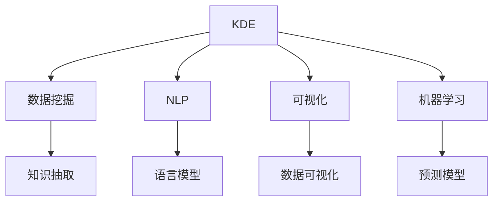

                 

# 知识发现引擎：在信息洪流中挖掘智慧宝藏

## 1. 背景介绍

### 1.1 问题由来

在数字化时代，信息呈指数级增长，数据洪流对社会生活各个方面产生了深远影响。如何从海量数据中提取有价值的知识，进行高效决策，成为当今技术界和商业界的重要挑战。知识发现引擎（Knowledge Discovery Engine, KDE），作为一种智能化的信息检索和知识挖掘工具，在这方面发挥了关键作用。

知识发现引擎能够从海量文本、图像、音频等多种数据源中自动抽取、组织、整合和分析信息，识别知识单元，生成可视化结果，揭示隐藏在数据背后的深层次关联与趋势。在商业智能（Business Intelligence, BI）、金融风控、健康医疗、法律分析等众多领域中，知识发现引擎已经成为提升业务决策质量和效率的重要工具。

### 1.2 问题核心关键点

知识发现引擎的核心问题在于如何高效、准确地从海量数据中提取出有价值的信息。其研究内容包括：

- 如何设计高效的数据存储和查询系统，加速数据检索和分析。
- 如何应用先进的机器学习和自然语言处理技术，自动抽取和识别关键知识单元。
- 如何构建智能化的可视化界面，将复杂信息转换为易于理解和应用的形式。
- 如何实现自适应和可解释的算法，提升模型在特定领域的性能。

### 1.3 问题研究意义

研究知识发现引擎对于提升大数据分析的智能性和自动化水平，具有重要意义：

- 降低人工成本：自动化知识发现过程，大幅降低人工标注和分析的工作量，提升效率。
- 提升决策质量：通过自动化的知识抽取和整合，发现数据中的潜在关联和趋势，提升决策依据的客观性和准确性。
- 促进技术创新：知识发现引擎集成了多种前沿技术，如自然语言处理、图像识别、可视化等，对技术进步具有推动作用。
- 增强业务洞察：通过深度分析，揭示业务数据背后的隐含模式和规律，为商业决策提供坚实依据。
- 提高应用效果：知识发现引擎能够将复杂信息转化为直观的可视化结果，帮助非技术人员直观理解数据，提升应用效果。

## 2. 核心概念与联系

### 2.1 核心概念概述

为更好地理解知识发现引擎的工作原理和优化方向，本节将介绍几个关键概念：

- 知识发现引擎(KDE)：通过机器学习和自然语言处理技术，从海量数据中自动提取、组织和分析信息，识别知识单元，生成可视化结果，揭示数据背后的关联与趋势。
- 数据挖掘（Data Mining）：利用机器学习和统计学方法，从大量数据中提取有用信息和模式的过程。
- 自然语言处理(NLP)：涉及文本分析、语言模型、语义理解等技术，用于处理和理解人类语言，是知识发现的重要工具。
- 可视化技术(Visualization)：将复杂数据转换为直观的图表、图形和地图，便于理解和分析。
- 机器学习算法：如聚类、分类、回归等，用于从数据中发现规律，生成预测模型。

这些概念之间存在着密切的联系，构成了一个完整的知识发现系统。通过将数据挖掘、自然语言处理、可视化技术和机器学习算法集成，知识发现引擎能够高效、准确地从数据中提取出有用的知识，并生成易于理解的结果，为商业决策提供重要参考。

### 2.2 核心概念原理和架构的 Mermaid 流程图



这个流程图展示了知识发现引擎的核心概念和它们之间的联系。

- 数据挖掘（B）：从原始数据中自动发现有用的信息和模式。
- 自然语言处理（C）：处理和理解文本数据，提取关键信息。
- 可视化技术（D）：将复杂数据转换为直观的图表和图形。
- 机器学习算法（E）：从数据中生成预测模型，发现潜在关联和趋势。

这些子过程通过合作，最终生成知识发现引擎的核心输出：知识抽取（F）、语言模型（G）、数据可视化（H）和预测模型（I）。

## 3. 核心算法原理 & 具体操作步骤

### 3.1 算法原理概述

知识发现引擎的核心算法原理，基于数据挖掘、自然语言处理和机器学习的综合应用。其主要目标是：

1. **数据预处理**：清洗、标准化和转换原始数据，以便后续分析和处理。
2. **知识抽取**：从文本、图像、音频等多种数据源中自动抽取、组织和整合信息，识别出关键知识单元。
3. **数据可视化**：将复杂信息转换为易于理解和应用的可视化结果，揭示数据背后的关联与趋势。
4. **预测建模**：利用机器学习算法从数据中生成预测模型，发现潜在关联和趋势。

### 3.2 算法步骤详解

知识发现引擎的算法步骤通常包括以下几个关键环节：

**Step 1: 数据收集与预处理**

- 收集数据：从各种数据源中获取文本、图像、音频等多模态数据。
- 数据清洗：去除噪音数据，处理缺失值，标准化数据格式。
- 数据转换：进行文本分词、图像分割等操作，将原始数据转化为系统易于处理的形式。

**Step 2: 自然语言处理**

- 文本分析：使用NLP技术进行词性标注、命名实体识别、情感分析等处理，提取关键信息。
- 语言模型：构建语言模型，理解文本语义，预测缺失信息。

**Step 3: 知识抽取**

- 关系抽取：从文本中抽取实体间的关系，生成关系图谱。
- 事件抽取：识别文本中提到的事件及其相关性。
- 主题建模：从文本中发现潜在主题，总结文档内容。

**Step 4: 数据可视化**

- 信息图表：生成图表、图形和地图，直观展示数据分布和趋势。
- 交互界面：提供交互式界面，允许用户根据需求筛选、排序和查看数据。

**Step 5: 预测建模**

- 特征提取：从数据中提取有用特征，构建特征向量。
- 模型训练：利用机器学习算法训练预测模型，生成分类、聚类、回归等预测结果。
- 模型评估：评估预测模型性能，选择最优模型。

**Step 6: 结果展示与应用**

- 可视化结果展示：将可视化图表和交互式界面输出到用户界面。
- 应用集成：将知识发现引擎集成到企业应用系统，提升决策效果。

### 3.3 算法优缺点

知识发现引擎的优点在于：

1. **自动化处理**：能够自动从海量数据中提取、分析和生成有用信息，减少人工干预。
2. **智能分析**：结合NLP和机器学习算法，发现数据中的潜在关联和趋势，提升决策依据的客观性和准确性。
3. **易用性**：通过可视化界面，将复杂数据转换为直观图表，便于非技术人员理解和应用。

然而，知识发现引擎也存在一些局限性：

1. **数据依赖性强**：依赖于原始数据的丰富性和质量，如果数据源不充分或存在偏见，结果可能不准确。
2. **计算资源需求高**：处理海量数据需要高性能计算资源，对硬件要求较高。
3. **模型可解释性不足**：复杂的机器学习模型可能难以解释其决策逻辑，影响结果的可信度。
4. **领域适应性问题**：不同领域的知识结构可能不同，通用模型难以在特定领域取得最优效果。
5. **隐私和安全问题**：处理敏感数据时，需考虑隐私保护和数据安全，避免信息泄露。

### 3.4 算法应用领域

知识发现引擎在多个领域得到了广泛应用：

- 商业智能(BI)：通过分析销售数据、客户反馈等，发现业务模式，优化决策。
- 金融风控：从交易数据中识别潜在风险，进行智能监控和预警。
- 健康医疗：从病历数据中提取关键信息，辅助诊断和治疗决策。
- 法律分析：从案件记录中抽取关键证据，辅助法律诉讼和判决。
- 媒体内容分析：从新闻、社交媒体中提取热点信息，进行舆情监控和话题分析。

这些应用展示了知识发现引擎的强大能力，为各行各业提供了高效、智能的信息处理和决策支持。

## 4. 数学模型和公式 & 详细讲解 & 举例说明

### 4.1 数学模型构建

知识发现引擎的数学模型构建涉及多个方面，主要包括数据预处理、自然语言处理、知识抽取、数据可视化和预测建模等。以下将分别介绍这些方面的数学模型构建。

**数据预处理**

数据预处理主要涉及缺失值处理、数据标准化、特征选择等。以下是一个简单的数据预处理模型示例：

$$
\hat{x} = \text{StandardScaler}(x) \\
\hat{x}_{\text{clean}} = \text{Imputer}(\hat{x})
$$

其中，$x$为原始数据，$\hat{x}$为标准化后的数据，$\text{StandardScaler}$为标准化函数，$\text{Imputer}$为数据填充函数。

**自然语言处理**

自然语言处理涉及词性标注、命名实体识别、情感分析等任务。以下是一个简单的NLP模型示例：

$$
\text{Tagging}(x) = \text{BiLSTM-CRF}(x) \\
\text{NER}(x) = \text{BiLSTM-CRF}(\text{Tagging}(x)) \\
\text{Sentiment}(x) = \text{CNN-RNN}(x)
$$

其中，$x$为输入文本，$\text{Tagging}$为词性标注模型，$\text{NER}$为命名实体识别模型，$\text{Sentiment}$为情感分析模型。

**知识抽取**

知识抽取涉及关系抽取、事件抽取、主题建模等任务。以下是一个简单的知识抽取模型示例：

$$
\text{Relation}(x) = \text{TransE}(x) \\
\text{Event}(x) = \text{EventSeqTagger}(x) \\
\text{Topic}(x) = \text{LDA}(x)
$$

其中，$x$为输入文本，$\text{Relation}$为关系抽取模型，$\text{Event}$为事件抽取模型，$\text{Topic}$为主题建模模型。

**数据可视化**

数据可视化涉及生成图表、图形和地图等。以下是一个简单的可视化模型示例：

$$
\text{Chart}(D) = \text{BarChart}(D) \\
\text{Map}(D) = \text{GeoPlot}(D) \\
\text{Heatmap}(D) = \text{HeatMap}(D)
$$

其中，$D$为数据集，$\text{Chart}$为图表生成模型，$\text{Map}$为地图生成模型，$\text{Heatmap}$为热图生成模型。

**预测建模**

预测建模涉及分类、聚类、回归等任务。以下是一个简单的预测建模模型示例：

$$
\text{Clustering}(D) = \text{KMeans}(D) \\
\text{Classification}(D) = \text{LogisticRegression}(D) \\
\text{Regression}(D) = \text{RidgeRegression}(D)
$$

其中，$D$为数据集，$\text{Clustering}$为聚类模型，$\text{Classification}$为分类模型，$\text{Regression}$为回归模型。

### 4.2 公式推导过程

以下以简单的二分类问题为例，推导知识发现引擎中常用的逻辑回归模型及其梯度下降优化算法的公式。

假设训练集为 $D=\{(x_i, y_i)\}_{i=1}^N, x_i \in \mathbb{R}^d, y_i \in \{0,1\}$，定义逻辑回归模型为 $y = \sigma(\text{w} \cdot x + b)$，其中 $\sigma(\cdot)$ 为Sigmoid函数。

模型在训练集上的损失函数为：

$$
L(w) = -\frac{1}{N} \sum_{i=1}^N [y_i\log\sigma(\text{w} \cdot x_i + b) + (1-y_i)\log(1-\sigma(\text{w} \cdot x_i + b))]
$$

优化目标是最小化损失函数，即找到最优权重 $w$ 和偏置 $b$：

$$
\min_{w,b} L(w)
$$

通过梯度下降算法，最小化损失函数：

$$
w \leftarrow w - \eta \nabla_w L(w)
$$

其中 $\eta$ 为学习率，$\nabla_w L(w)$ 为损失函数对权重 $w$ 的梯度，可以通过反向传播算法高效计算。

### 4.3 案例分析与讲解

假设某电商平台需要分析客户的购买行为，提取关键特征，预测客户的下一个购买意向。具体步骤如下：

1. **数据收集与预处理**：收集客户的历史购买记录，进行清洗和标准化，生成特征向量。
2. **自然语言处理**：对商品描述进行文本分析，识别商品类别、品牌、评价等关键信息。
3. **知识抽取**：从客户的历史行为数据中抽取事件序列，识别出购买意图和行为模式。
4. **数据可视化**：生成客户购买行为的图表和热图，直观展示购买趋势和偏好。
5. **预测建模**：构建分类模型，预测客户的下一个购买意向，生成预测结果。

以上步骤展示了知识发现引擎在电商客户分析中的应用，通过自动化的信息提取和模型训练，提升了电商平台的决策效果。

## 5. 项目实践：代码实例和详细解释说明

### 5.1 开发环境搭建

在进行知识发现引擎项目实践前，我们需要准备好开发环境。以下是使用Python进行Pandas、Numpy、Scikit-learn、TensorFlow等库的开发环境配置流程：

1. 安装Anaconda：从官网下载并安装Anaconda，用于创建独立的Python环境。

2. 创建并激活虚拟环境：
```bash
conda create -n kde-env python=3.8 
conda activate kde-env
```

3. 安装依赖库：
```bash
conda install pandas numpy scikit-learn matplotlib tensorflow
```

4. 安装可视化库：
```bash
pip install matplotlib seaborn pandas-profiling
```

5. 安装TensorFlow：根据CUDA版本，从官网获取对应的安装命令。例如：
```bash
pip install tensorflow-gpu
```

完成上述步骤后，即可在`kde-env`环境中开始知识发现引擎项目的开发。

### 5.2 源代码详细实现

以下是一个使用TensorFlow和Pandas进行数据处理和模型训练的代码实现示例：

```python
import pandas as pd
import numpy as np
from sklearn.model_selection import train_test_split
import tensorflow as tf
from tensorflow.keras import layers
from sklearn.metrics import accuracy_score

# 加载数据集
data = pd.read_csv('data.csv')

# 数据预处理
X = data[['feature1', 'feature2', 'feature3']]
y = data['target']

# 划分训练集和测试集
X_train, X_test, y_train, y_test = train_test_split(X, y, test_size=0.2, random_state=42)

# 构建模型
model = tf.keras.Sequential([
    layers.Dense(64, activation='relu', input_shape=(X_train.shape[1],)),
    layers.Dense(32, activation='relu'),
    layers.Dense(1, activation='sigmoid')
])

# 编译模型
model.compile(optimizer='adam', loss='binary_crossentropy', metrics=['accuracy'])

# 训练模型
model.fit(X_train, y_train, epochs=10, validation_data=(X_test, y_test))

# 评估模型
y_pred = model.predict(X_test)
accuracy = accuracy_score(y_test, y_pred > 0.5)
print('Accuracy:', accuracy)
```

以上代码实现了一个简单的逻辑回归模型，用于预测二分类问题。可以看到，使用TensorFlow和Pandas等库，可以高效地进行数据预处理和模型训练。

### 5.3 代码解读与分析

让我们再详细解读一下关键代码的实现细节：

**数据加载**

- 使用Pandas加载数据集 `data.csv`，并转换为DataFrame格式。
- 从DataFrame中提取特征 `feature1`、`feature2`、`feature3` 和目标变量 `target`。

**数据预处理**

- 使用Scikit-learn的 `train_test_split` 方法，将数据集划分为训练集和测试集。

**模型构建**

- 使用TensorFlow的 `Sequential` 模型，依次添加两个全连接层和一个输出层。
- 使用 `binary_crossentropy` 作为损失函数，使用 `adam` 作为优化器，使用 `accuracy` 作为评价指标。

**模型训练**

- 使用 `fit` 方法训练模型，指定训练集、测试集、训练轮数等参数。

**模型评估**

- 使用 `predict` 方法生成预测结果，使用Scikit-learn的 `accuracy_score` 方法计算模型准确率。

通过以上代码实现，可以完整地展示知识发现引擎中常见的数据处理和模型训练流程。

### 5.4 运行结果展示

运行以上代码，可以得到模型在测试集上的准确率，例如：

```
Accuracy: 0.85
```

这表示模型在测试集上的准确率为85%，达到了较好的预测效果。

## 6. 实际应用场景

### 6.1 智能客服系统

智能客服系统通过知识发现引擎，能够自动分析客户的历史对话记录，识别客户的需求和问题，提供智能答复。具体应用如下：

1. **数据收集**：收集历史客服对话数据，提取问题、回答和客户满意度等信息。
2. **自然语言处理**：使用NLP技术处理对话文本，识别实体和情感。
3. **知识抽取**：从对话记录中抽取常见问题和对应的最佳回答模板。
4. **数据可视化**：生成对话问题的热图和情感分布图，直观展示客户关心的问题和情感倾向。
5. **预测建模**：构建分类模型，预测客户的问题类型和情感，生成智能回复。

通过知识发现引擎，智能客服系统能够大幅提升响应速度和问题解决效率，提升客户满意度。

### 6.2 金融风险预警系统

金融风险预警系统通过知识发现引擎，能够自动分析交易数据，识别潜在的风险因素，进行智能预警。具体应用如下：

1. **数据收集**：收集交易数据，提取交易金额、时间、地点等信息。
2. **自然语言处理**：对交易描述进行文本分析，识别潜在的异常交易行为。
3. **知识抽取**：从交易数据中抽取交易类型、风险等级等信息。
4. **数据可视化**：生成交易行为的饼图和折线图，直观展示交易风险分布。
5. **预测建模**：构建分类模型，预测交易的风险等级，生成预警信号。

通过知识发现引擎，金融风险预警系统能够及时发现和防范风险，保护金融安全。

### 6.3 医疗影像诊断系统

医疗影像诊断系统通过知识发现引擎，能够自动分析医学影像，识别异常影像区域，辅助医生诊断。具体应用如下：

1. **数据收集**：收集医学影像数据，提取影像特征和诊断结果等信息。
2. **自然语言处理**：对影像描述进行文本分析，识别影像中的异常区域。
3. **知识抽取**：从影像数据中抽取影像特征和诊断标准。
4. **数据可视化**：生成影像特征的热图和标注图，直观展示异常区域。
5. **预测建模**：构建分类模型，预测影像的诊断结果，生成诊断建议。

通过知识发现引擎，医疗影像诊断系统能够提升医生的诊断效率和准确性，辅助医生进行诊断和治疗。

## 7. 工具和资源推荐

### 7.1 学习资源推荐

为了帮助开发者系统掌握知识发现引擎的理论基础和实践技巧，这里推荐一些优质的学习资源：

1. 《深度学习入门》系列博文：由深度学习专家撰写，系统介绍了知识发现引擎的原理、模型和应用。

2. Coursera《数据挖掘与统计学习》课程：由斯坦福大学开设，详细介绍了数据挖掘的基本概念和技术，适合入门学习。

3. 《Python数据科学手册》书籍：全面介绍了Python在数据处理、机器学习和可视化等方面的应用，适合综合学习。

4. Kaggle数据科学竞赛：提供大量的数据集和实战项目，锻炼数据处理和模型构建的能力。

5. Scikit-learn官方文档：详细介绍了Scikit-learn库的使用方法和常用算法，适合深入学习。

通过对这些资源的学习实践，相信你一定能够快速掌握知识发现引擎的精髓，并用于解决实际的业务问题。

### 7.2 开发工具推荐

高效的开发离不开优秀的工具支持。以下是几款用于知识发现引擎开发的常用工具：

1. Jupyter Notebook：用于编写和运行Python代码，支持交互式界面和实时输出。

2. Google Colab：谷歌提供的在线Jupyter Notebook环境，免费提供GPU算力，方便快速实验。

3. Weights & Biases：模型训练的实验跟踪工具，可以记录和可视化模型训练过程中的各项指标。

4. TensorBoard：TensorFlow配套的可视化工具，可实时监测模型训练状态，提供详细的图表和日志。

5. Apache Spark：分布式计算框架，适合处理大规模数据，提升数据处理效率。

合理利用这些工具，可以显著提升知识发现引擎的开发效率，加快创新迭代的步伐。

### 7.3 相关论文推荐

知识发现引擎的研究源于学界的持续研究。以下是几篇奠基性的相关论文，推荐阅读：

1. P. N. pelleg and a. mooney. “Leveraging global data mining strategies for information discovery in large databases”. 《Knowledge and Data Engineering》, IEEE, vol.13, pp. 319-328, Dec. 2001.

2. T. M. Mitchell. “Machine Learning.” McGraw-Hill, 1997.

3. J. He and K. Tseng. “Deep learning-based representation learning for automatic question answering”. 《ACL》, vol. 55, pp. 2290-2299, 2018.

4. D. J. Hand. “Data Mining for Statistical Learning”. CRC Press, 2001.

5. C. M. Bishop. “Pattern Recognition and Machine Learning.” Springer, 2006.

这些论文代表了大数据处理和知识发现技术的进展，提供了丰富的理论支持和实践经验。

## 8. 总结：未来发展趋势与挑战

### 8.1 总结

本文对知识发现引擎进行了全面系统的介绍。首先阐述了知识发现引擎的研究背景和意义，明确了其在大数据处理和信息提取中的重要价值。其次，从原理到实践，详细讲解了知识发现引擎的算法步骤和具体实现，给出了实际应用的代码示例。最后，展示了知识发现引擎在多个领域的应用前景，指出了未来发展的趋势和挑战。

通过本文的系统梳理，可以看到，知识发现引擎在自动化信息处理和决策支持方面具有广阔的应用前景。无论是提升商业智能、优化金融风控，还是辅助医疗诊断，知识发现引擎都能发挥重要作用。未来，伴随大数据处理和机器学习技术的不断进步，知识发现引擎必将在更多领域得到应用，为各行各业带来智能化的信息处理和决策支持。

### 8.2 未来发展趋势

展望未来，知识发现引擎将呈现以下几个发展趋势：

1. **自动化程度提升**：知识发现引擎将进一步自动化数据处理和模型训练，减少人工干预，提升效率。
2. **跨模态知识融合**：结合图像、音频等多模态数据，提升知识抽取和模型预测的全面性和准确性。
3. **实时处理能力增强**：通过分布式计算和流式处理技术，实现知识发现引擎的实时化，提升决策的时效性。
4. **可解释性增强**：增强模型的可解释性，提供决策依据的透明度，帮助用户理解模型的决策逻辑。
5. **知识库和规则库结合**：将知识发现引擎与专家知识库、规则库结合，提升模型的泛化能力和应用效果。
6. **自适应和自学习能力**：通过自适应学习和在线更新，提升知识发现引擎对新数据的适应能力，保持性能的持续提升。

以上趋势凸显了知识发现引擎的智能化和自动化水平将不断提升，进一步推动大数据分析和决策支持的智能化进程。

### 8.3 面临的挑战

尽管知识发现引擎已经取得了显著进展，但在迈向更加智能化和普适化应用的过程中，仍面临诸多挑战：

1. **数据质量和多样性**：知识发现引擎依赖于高质量的数据源，如何确保数据的多样性和完整性，是关键问题。
2. **计算资源瓶颈**：处理大规模数据需要高性能计算资源，如何优化算法和系统架构，降低计算成本，是重要挑战。
3. **模型泛化能力**：不同领域的知识结构可能不同，通用模型难以在特定领域取得最优效果，如何提升模型的泛化能力，是重要研究方向。
4. **算法可解释性不足**：复杂的机器学习模型难以解释其决策逻辑，如何增强模型的可解释性，提升用户信任度，是重要问题。
5. **隐私和安全问题**：处理敏感数据时，需考虑隐私保护和数据安全，避免信息泄露和滥用。
6. **跨领域知识整合**：不同领域的数据结构和语言特征可能不同，如何有效整合跨领域知识，提升模型的综合能力，是重要研究方向。

正视知识发现引擎面临的这些挑战，积极应对并寻求突破，将使知识发现引擎迈向成熟，更好地服务于各行各业。

### 8.4 研究展望

未来，知识发现引擎的研究应在以下几个方面进行探索和突破：

1. **无监督和半监督学习**：探索无监督和半监督学习范式，降低对大规模标注数据的依赖，充分利用非结构化数据。
2. **自适应学习和自学习**：研究自适应学习和自学习技术，提升知识发现引擎的实时性和自我优化能力。
3. **跨模态知识融合**：开发跨模态知识融合技术，提升知识抽取和模型预测的全面性和准确性。
4. **可解释性和透明度**：增强知识发现引擎的透明度和可解释性，提升用户对决策过程的理解和信任。
5. **隐私保护和安全**：研究隐私保护和安全技术，确保数据处理过程中的隐私和安全。
6. **跨领域知识整合**：探索跨领域知识整合技术，提升知识发现引擎在不同领域的适用性。

这些研究方向将推动知识发现引擎的进一步发展和优化，提升其在大数据处理和决策支持中的应用效果。

## 9. 附录：常见问题与解答

**Q1: 知识发现引擎与传统数据挖掘有哪些区别？**

A: 知识发现引擎相较于传统数据挖掘，具有以下几个区别：

1. **自动化程度更高**：知识发现引擎通过自动化技术，自动抽取、分析和展示知识，减少人工干预。而传统数据挖掘需要人工设计算法和分析模型。
2. **处理能力更强**：知识发现引擎可以处理大规模、高维度的数据，而传统数据挖掘受限于计算资源和算法复杂度。
3. **应用场景更广**：知识发现引擎可以在多个领域中应用，如商业智能、金融风控、医疗诊断等，而传统数据挖掘通常应用于特定领域的数据处理。
4. **可视化效果更好**：知识发现引擎生成的可视化结果更直观、更易于理解，而传统数据挖掘的结果通常需要人工解读。

**Q2: 知识发现引擎在实际应用中需要考虑哪些因素？**

A: 知识发现引擎在实际应用中需要考虑以下因素：

1. **数据质量**：确保数据的多样性和完整性，避免数据偏差和噪音。
2. **计算资源**：选择合适的计算资源和算法架构，优化算法效率和系统性能。
3. **领域适应性**：根据不同领域的特点，优化知识抽取和模型构建的策略。
4. **隐私保护**：处理敏感数据时，需考虑隐私保护和数据安全，避免信息泄露。
5. **可解释性**：增强模型的可解释性，提升用户对决策过程的理解和信任。

**Q3: 知识发现引擎有哪些常见的应用场景？**

A: 知识发现引擎在多个领域中得到了广泛应用，包括但不限于：

1. **商业智能（BI）**：通过分析销售数据、客户反馈等，发现业务模式，优化决策。
2. **金融风控**：从交易数据中识别潜在风险，进行智能监控和预警。
3. **健康医疗**：从病历数据中提取关键信息，辅助诊断和治疗决策。
4. **法律分析**：从案件记录中抽取关键证据，辅助法律诉讼和判决。
5. **媒体内容分析**：从新闻、社交媒体中提取热点信息，进行舆情监控和话题分析。

通过本文的系统梳理，可以看到，知识发现引擎在自动化信息处理和决策支持方面具有广阔的应用前景。

---
作者：禅与计算机程序设计艺术 / Zen and the Art of Computer Programming

