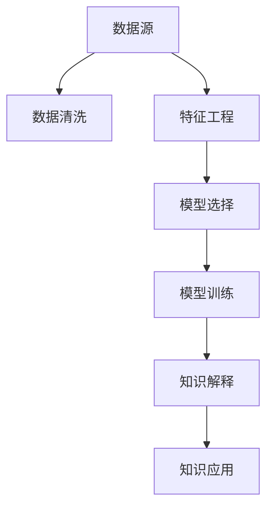

                 

# 知识发现引擎：开启人类知识新篇章

> 关键词：知识发现引擎,数据挖掘,机器学习,人工智能,大数据,深度学习

## 1. 背景介绍

### 1.1 问题由来
随着信息技术的高速发展，人类积累了大量数据。据国际数据公司(IDC)统计，全球数据量每年以约40%的速度增长，预计到2025年，数据总量将达到175ZB。这些数据中蕴含着巨大的知识宝库，等待被挖掘和利用。如何从海量数据中提取有价值的信息，帮助人们做出更明智的决策，成为当下最紧迫的挑战之一。

为此，知识发现(Knowledge Discovery)领域应运而生。知识发现是利用计算机技术从数据中挖掘和发现知识的过程。知识发现不仅包括数据挖掘，还涵盖了人工智能、机器学习、自然语言处理等前沿技术。知识发现的应用范围非常广泛，如金融风控、医疗诊断、市场营销、智能客服等，能够显著提升企业的决策效率和竞争力。

### 1.2 问题核心关键点
知识发现的核心目标是利用大数据和人工智能技术，从数据中提取和发现知识，并应用于具体业务场景中。知识发现的核心任务包括：

1. **数据清洗**：处理数据缺失、噪声、异常等问题，提升数据质量。
2. **特征工程**：提取、选择、组合和转换数据特征，提高模型预测准确率。
3. **模型选择与训练**：选择合适机器学习算法，并使用数据集进行模型训练和调优。
4. **知识解释**：对模型预测结果进行解释和可视化，增强可理解性。
5. **知识应用**：将挖掘到的知识应用于实际业务场景，实现决策支持。

本文将重点介绍知识发现引擎的核心概念和技术原理，并结合实际案例，展示知识发现如何被应用于不同行业，提升业务决策的智能化水平。

## 2. 核心概念与联系

### 2.1 核心概念概述

知识发现引擎是将大数据、机器学习和人工智能技术紧密结合的高级应用系统。它从海量数据中自动挖掘和发现知识，并将知识应用于业务决策和预测，提升企业决策效率和业务价值。

### 2.2 核心概念原理和架构的 Mermaid 流程图



这个流程图展示了知识发现引擎的基本架构和工作流程。

1. **数据源**：包括企业内部的业务数据、市场数据、社交媒体数据等。
2. **数据清洗**：处理数据缺失、异常值、重复值等，确保数据质量。
3. **特征工程**：从原始数据中提取、选择和组合特征，形成可供模型学习的输入。
4. **模型选择**：选择合适的机器学习算法，如分类、回归、聚类、关联规则等。
5. **模型训练**：使用清洗和特征工程后的数据集进行模型训练和调优。
6. **知识解释**：对模型预测结果进行解释，提供可理解的业务洞察。
7. **知识应用**：将知识应用于具体业务场景，如信用评估、客户细分、市场营销等。

## 3. 核心算法原理 & 具体操作步骤

### 3.1 算法原理概述

知识发现引擎的核心算法包括机器学习、深度学习、数据挖掘等。这些算法能够从数据中提取和发现模式、关联和规则，最终形成可供应用的知识。

### 3.2 算法步骤详解

知识发现引擎的核心步骤包括：

1. **数据预处理**：清洗数据，处理缺失值、噪声和异常值，生成特征。
2. **模型选择与训练**：选择合适的机器学习算法，如决策树、随机森林、神经网络等，使用数据集进行训练和调优。
3. **特征选择与降维**：从大量特征中筛选出最具预测能力的特征，并进行特征降维，减少计算复杂度。
4. **模型评估与优化**：评估模型的性能，调整模型参数，提升模型精度。
5. **知识发现与解释**：利用模型对新数据进行预测，并对预测结果进行解释和可视化。
6. **知识应用**：将知识应用于实际业务场景，提升决策效率和业务价值。

### 3.3 算法优缺点

知识发现引擎具有以下优点：

1. **自动化程度高**：自动化地从数据中提取和发现知识，减少了人工干预的环节。
2. **覆盖范围广**：涵盖大数据、机器学习和人工智能技术，应用范围广泛。
3. **可解释性强**：对模型预测结果进行解释和可视化，增强了知识的可理解性。
4. **灵活性高**：可以根据具体业务需求，定制化的选择和训练模型，满足不同场景下的需求。

同时，知识发现引擎也存在一些缺点：

1. **计算资源需求高**：需要处理大规模数据和复杂模型，计算资源需求较大。
2. **数据隐私问题**：在数据挖掘过程中，需要注意保护用户隐私和数据安全。
3. **结果解释性不足**：复杂模型和高维数据的解释性较差，可能存在黑盒问题。
4. **数据质量要求高**：数据质量直接影响知识发现的精度，数据清洗和处理难度较大。

### 3.4 算法应用领域

知识发现引擎在多个领域得到了广泛应用，包括：

1. **金融风控**：利用机器学习算法对客户信用进行评估，识别潜在的违约风险。
2. **医疗诊断**：使用深度学习模型对医学影像进行识别和分析，辅助医生进行诊断。
3. **市场营销**：通过数据挖掘和特征工程，细分客户群体，实现精准营销。
4. **智能客服**：利用自然语言处理技术，自动分析客户需求，提供智能客服解决方案。
5. **推荐系统**：基于用户行为数据，推荐相关商品或服务，提升用户体验。
6. **社交媒体分析**：分析社交媒体数据，挖掘热门话题和趋势，指导品牌营销策略。

## 4. 数学模型和公式 & 详细讲解

### 4.1 数学模型构建

知识发现引擎的数学模型主要基于统计学、概率论和优化理论。常见的数学模型包括：

1. **回归模型**：用于预测数值型数据，如线性回归、逻辑回归、决策树回归等。
2. **分类模型**：用于预测离散型数据，如KNN、决策树、随机森林等。
3. **聚类模型**：用于发现数据之间的自然分群，如K-Means、层次聚类、DBSCAN等。
4. **关联规则模型**：用于发现数据项之间的关联关系，如Apriori算法、FP-Growth算法等。

### 4.2 公式推导过程

以线性回归模型为例，公式推导如下：

设自变量为 $x_1,x_2,\ldots,x_n$，因变量为 $y$，回归模型为 $y=w_0+w_1x_1+w_2x_2+\ldots+w_nx_n+\epsilon$。最小二乘法求解回归系数 $w$，使得预测值与实际值之差的平方和最小：

$$
\min \sum_{i=1}^N (y_i - w_0 - \sum_{j=1}^n w_j x_{ij})^2
$$

求解该优化问题，得到回归系数 $w$：

$$
w = (X^TX)^{-1}X^Ty
$$

其中 $X=[x_1,x_2,\ldots,x_n]$，$y=[y_1,y_2,\ldots,y_n]$。

### 4.3 案例分析与讲解

以金融风控为例，展示知识发现引擎的应用过程：

1. **数据预处理**：清洗数据，处理缺失值、噪声和异常值，生成特征。
2. **特征工程**：从客户交易记录中提取特征，如消费金额、消费频次、信用评分等。
3. **模型选择与训练**：选择随机森林算法，使用历史数据进行训练和调优。
4. **模型评估与优化**：评估模型性能，调整模型参数，提升模型精度。
5. **知识发现与解释**：利用模型对新客户进行风险评估，并对评估结果进行解释和可视化。
6. **知识应用**：根据风险评估结果，制定信贷策略，控制风险。

## 5. 项目实践：代码实例和详细解释说明

### 5.1 开发环境搭建

知识发现引擎的开发需要以下环境：

1. **编程语言**：Python是最常用的知识发现工具语言，具有丰富的数据处理和机器学习库。
2. **数据处理库**：Pandas、NumPy、SciPy等，用于数据清洗、处理和特征工程。
3. **机器学习库**：Scikit-learn、TensorFlow、PyTorch等，用于模型训练和评估。
4. **可视化工具**：Matplotlib、Seaborn、Plotly等，用于结果可视化。
5. **数据预处理工具**：Spark、Hadoop等，用于处理大规模数据。

### 5.2 源代码详细实现

以下是一个简单的线性回归代码实现：

```python
import numpy as np
from sklearn.linear_model import LinearRegression

# 创建数据
X = np.array([[1, 2], [3, 4], [5, 6]])
y = np.array([2, 4, 6])

# 创建模型
model = LinearRegression()

# 训练模型
model.fit(X, y)

# 预测
y_pred = model.predict(X)

# 打印结果
print("回归系数：", model.coef_)
print("截距：", model.intercept_)
print("预测值：", y_pred)
```

### 5.3 代码解读与分析

这段代码展示了如何使用Scikit-learn库实现线性回归模型：

1. **数据创建**：创建自变量和因变量数据。
2. **模型创建**：使用LinearRegression类创建线性回归模型。
3. **模型训练**：使用fit方法训练模型。
4. **模型预测**：使用predict方法预测新数据。
5. **结果打印**：打印回归系数、截距和预测值。

## 6. 实际应用场景

### 6.1 智能推荐系统

智能推荐系统是知识发现引擎的重要应用之一。通过对用户行为数据的分析，推荐系统能够为用户推荐相关商品或服务，提升用户体验。

例如，电商平台可以利用用户购买记录、浏览记录和评分数据，训练推荐模型，对新用户进行商品推荐。通过不断地调整模型参数，提升推荐精度和效果，实现个性化推荐。

### 6.2 医疗诊断系统

医疗诊断系统利用知识发现引擎对医学影像、病历数据进行分析，辅助医生进行诊断和治疗决策。

例如，利用深度学习模型对医学影像进行分类和识别，辅助医生诊断疾病；利用关联规则模型发现患者之间的关联症状，制定个性化的治疗方案。这些应用能够显著提升医疗诊断的准确性和效率。

### 6.3 金融风险控制

金融风控系统利用知识发现引擎对客户信用进行评估，识别潜在的违约风险。通过分析客户的交易记录、信用评分和行为特征，训练信用评估模型，预测客户的违约概率。这些应用能够帮助金融机构降低坏账风险，提升业务效率。

### 6.4 客户关系管理

客户关系管理系统利用知识发现引擎对客户数据进行分析，细分客户群体，实现精准营销和客户关怀。

例如，通过对客户交易记录、行为数据和社交媒体数据的分析，发现客户的需求和偏好，制定个性化的营销策略。这些应用能够显著提升客户满意度和忠诚度，增加企业收益。

## 7. 工具和资源推荐

### 7.1 学习资源推荐

1. 《Python数据科学手册》：全面介绍Python数据科学库的使用，包括Pandas、NumPy、SciPy等。
2. 《深度学习》（Ian Goodfellow、Yoshua Bengio、Aaron Courville著）：深度学习领域的经典教材，涵盖各种深度学习算法和应用。
3. 《机器学习实战》（Peter Harrington著）：机器学习领域的实战教程，涵盖各种经典算法和实践案例。
4. 《数据挖掘与统计学习》（Trevor Hastie、Robert Tibshirani、Jerome Friedman著）：数据挖掘领域的经典教材，涵盖各种统计学习算法和应用。
5. 《Python数据可视化基础》：介绍Python数据可视化工具的使用，包括Matplotlib、Seaborn、Plotly等。

### 7.2 开发工具推荐

1. Jupyter Notebook：交互式数据处理和代码编写工具，支持Python、R、MATLAB等语言。
2. PyCharm：Python IDE，支持代码编辑、调试和版本控制。
3. RStudio：R语言IDE，支持R语言的数据处理和分析。
4. Hadoop和Spark：大数据处理工具，支持大规模数据处理和分析。
5. TensorFlow和PyTorch：深度学习框架，支持各种深度学习模型的训练和部署。

### 7.3 相关论文推荐

1. 《数据挖掘：概念与技术》（Jerry K. shot、Joseph K. Asuncion著）：数据挖掘领域的经典教材，涵盖各种数据挖掘算法和应用。
2. 《机器学习》（Tom Mitchell著）：机器学习领域的经典教材，涵盖各种机器学习算法和应用。
3. 《深度学习》（Ian Goodfellow、Yoshua Bengio、Aaron Courville著）：深度学习领域的经典教材，涵盖各种深度学习算法和应用。
4. 《数据科学：方法、实践与思考》（Joel Grus著）：数据科学领域的实战教程，涵盖各种数据科学工具和技术。
5. 《数据挖掘与统计学习：方法与技术》（Trevor Hastie、Robert Tibshirani、Jerome Friedman著）：数据挖掘领域的经典教材，涵盖各种统计学习算法和应用。

## 8. 总结：未来发展趋势与挑战

### 8.1 研究成果总结

知识发现引擎是一个集大数据、机器学习和人工智能于一体的高级应用系统。通过自动化地从数据中提取和发现知识，知识发现引擎在多个领域得到了广泛应用。

### 8.2 未来发展趋势

知识发现引擎的未来发展趋势包括：

1. **自动化程度提升**：随着自动化技术和算法的不断进步，知识发现引擎的自动化程度将进一步提升。
2. **跨领域应用扩展**：知识发现引擎将在更多领域得到应用，如医疗、金融、市场营销等。
3. **实时化处理增强**：知识发现引擎将支持实时数据处理和分析，提升决策效率。
4. **知识解释性增强**：知识发现引擎将更加注重结果解释性，增强用户信任和接受度。
5. **隐私保护和数据安全**：知识发现引擎将更加注重数据隐私和安全性，保护用户数据。
6. **人机协同交互**：知识发现引擎将与人工干预相结合，实现人机协同智能决策。

### 8.3 面临的挑战

知识发现引擎在发展过程中面临以下挑战：

1. **计算资源需求高**：知识发现引擎需要处理大规模数据和复杂模型，计算资源需求较大。
2. **数据隐私问题**：在数据挖掘过程中，需要注意保护用户隐私和数据安全。
3. **结果解释性不足**：复杂模型和高维数据的解释性较差，可能存在黑盒问题。
4. **数据质量要求高**：数据质量直接影响知识发现的精度，数据清洗和处理难度较大。
5. **跨领域应用难度大**：不同领域的知识发现问题存在较大差异，跨领域应用难度大。
6. **结果可解释性不足**：复杂模型和高维数据的解释性较差，可能存在黑盒问题。

### 8.4 研究展望

未来的研究将从以下几个方面寻求新的突破：

1. **自动化程度提升**：提升自动化技术和算法的自动化程度，减少人工干预。
2. **跨领域应用扩展**：研究跨领域应用的方法和策略，实现更广泛的应用。
3. **实时化处理增强**：研究实时数据处理和分析的方法，提升决策效率。
4. **知识解释性增强**：研究结果解释性增强的方法，增强用户信任和接受度。
5. **隐私保护和数据安全**：研究数据隐私和安全性保护的方法，保护用户数据。
6. **人机协同交互**：研究人机协同智能决策的方法，提升决策效果。

## 9. 附录：常见问题与解答

### Q1：知识发现引擎和数据挖掘的区别是什么？

A: 知识发现引擎是数据挖掘的一种高级应用，它不仅涵盖数据挖掘的基本方法，还包括机器学习和人工智能技术。知识发现引擎的目标是从数据中挖掘和发现知识，并将其应用于具体业务场景中。

### Q2：知识发现引擎的优点是什么？

A: 知识发现引擎具有自动化程度高、应用范围广、结果可解释性强、灵活性高等优点。它能够自动化地从数据中提取和发现知识，减少人工干预，提升决策效率和业务价值。

### Q3：知识发现引擎的缺点是什么？

A: 知识发现引擎存在计算资源需求高、数据隐私问题、结果解释性不足、数据质量要求高等缺点。需要处理大规模数据和复杂模型，计算资源需求较大；在数据挖掘过程中，需要注意保护用户隐私和数据安全；复杂模型和高维数据的解释性较差，可能存在黑盒问题；数据质量直接影响知识发现的精度，数据清洗和处理难度较大。

### Q4：知识发现引擎的未来发展趋势是什么？

A: 知识发现引擎的未来发展趋势包括自动化程度提升、跨领域应用扩展、实时化处理增强、知识解释性增强、隐私保护和数据安全、人机协同交互等。这些趋势将进一步提升知识发现引擎的自动化程度、应用范围和决策效果。

### Q5：如何克服知识发现引擎的挑战？

A: 知识发现引擎的挑战可以通过提升自动化技术和算法、研究跨领域应用方法、研究实时数据处理和分析方法、研究结果解释性增强方法、研究数据隐私和安全性保护方法、研究人机协同智能决策方法等来克服。这些措施将提升知识发现引擎的性能和可靠性，实现更广泛的应用。

---

作者：禅与计算机程序设计艺术 / Zen and the Art of Computer Programming

