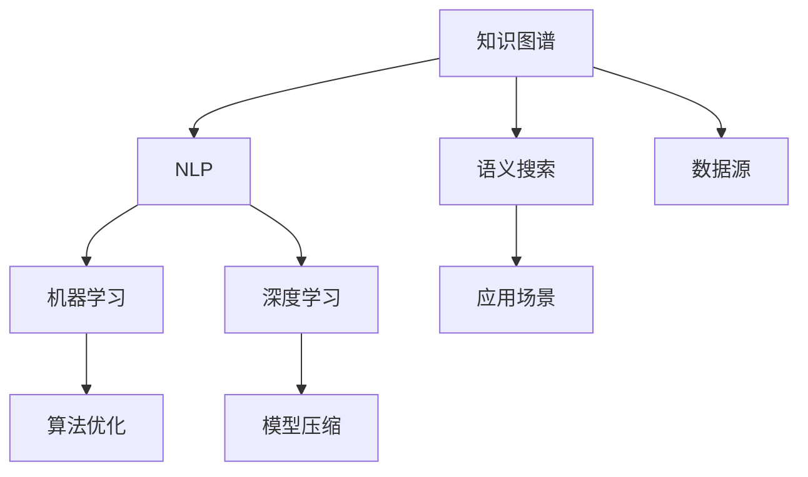

                 

# 知识发现引擎：开启人类知识新篇章

> 关键词：知识图谱,知识发现引擎,语义搜索,自然语言处理,机器学习,深度学习

## 1. 背景介绍

### 1.1 问题由来

随着大数据时代的到来，信息爆炸已经成为了一个普遍现象。据统计，全球每年产生的数据量已经超出了传统存储介质的处理能力。如何在如此海量的数据中，快速、准确地发现有价值的信息，已经成为当前社会的一项重大挑战。

数据本身是无意义的，其价值需要通过有效的信息提取和分析才能体现。随着人工智能技术的不断发展，从海量数据中挖掘知识，进而指导决策和行动，已经成为了现代信息工程的核心方向。

### 1.2 问题核心关键点

知识发现引擎（Knowledge Discovery Engine, KDE）是一种结合了信息提取、数据分析、机器学习、自然语言处理（NLP）等多种技术的综合性工具。其核心目标是：

1. **高效信息抽取**：从大规模非结构化文本、图像、音频等多源数据中，快速提取出有用的实体、关系等信息。
2. **深度语义理解**：通过上下文关联、实体间关系推理等技术，实现对知识语义的深入理解。
3. **智能推理与推理**：结合人工智能算法，进行知识推理和预测，挖掘知识间的内在联系。
4. **自动化工作流程**：通过自动化工具，优化数据预处理、模型训练、结果展示等流程，提升工作效率。

知识发现引擎的出现，使得从海量数据中发现知识变得更加高效、准确、智能化。

### 1.3 问题研究意义

知识发现引擎的研究，具有重要理论意义和实际应用价值：

1. **理论意义**：知识的发现、理解和应用是人工智能的核心问题，研究知识发现引擎可以更好地理解知识的本质和特性。
2. **实际应用价值**：知识发现引擎能够应用于多个领域，如金融、医疗、教育、商业等，通过挖掘知识，辅助决策和行动，提升业务效率和竞争优势。

## 2. 核心概念与联系

### 2.1 核心概念概述

为更好地理解知识发现引擎的工作原理和结构，本节将介绍几个关键概念：

- **知识图谱(Knowledge Graph)**：通过实体、关系、属性等结构化的方式，描述现实世界中的知识。知识图谱通常以图数据库或三元组的形式存储，支持高效查询和推理。
- **语义搜索(Semantic Search)**：结合自然语言处理和知识图谱技术，实现对查询语义的理解和匹配，提升搜索结果的相关性和精度。
- **自然语言处理(NLP)**：涉及语言理解、语义分析、情感计算、机器翻译等多个子领域，是知识发现引擎的重要组成部分。
- **机器学习(ML)**：通过数据驱动的学习方法，自动发现和构建模型，以支持知识发现和推理任务。
- **深度学习(DL)**：一种特殊的机器学习技术，通过多层次的神经网络模型，实现对复杂数据的深度学习，提升知识发现的效果。

这些核心概念之间的联系可以通过以下Mermaid流程图来展示：



这个流程图展示了几大核心概念之间的相互作用关系：

1. 数据源为知识图谱提供数据支持。
2. NLP技术从文本数据中提取实体和关系，支持知识图谱的构建。
3. 机器学习和深度学习技术用于构建和优化模型，提升知识推理和预测的精度。
4. 语义搜索技术用于查询和匹配，支持应用场景中的知识应用。
5. 算法优化和模型压缩技术用于提升知识发现引擎的效率和鲁棒性。

## 3. 核心算法原理 & 具体操作步骤
### 3.1 算法原理概述

知识发现引擎的核心算法原理主要基于以下步骤：

1. **数据预处理**：对原始数据进行清洗、去重、分词、实体识别等预处理，准备数据源。
2. **实体关系抽取**：利用NLP技术，从文本中识别出实体、关系等知识单元，构建知识图谱。
3. **知识图谱构建**：将抽取的实体和关系存储到知识图谱中，形成结构化的知识表示。
4. **语义推理**：利用机器学习和深度学习技术，进行知识推理，挖掘知识间的内在联系。
5. **知识应用**：将推理出的知识用于支持查询、推荐、预测等应用场景，提升决策和行动的效果。

### 3.2 算法步骤详解

知识发现引擎的具体操作步骤可以分为以下几个阶段：

#### 3.2.1 数据预处理

数据预处理是知识发现引擎的基础步骤，主要包括以下内容：

1. **数据清洗**：去除数据中的噪声、冗余和不一致信息，保证数据的质量和一致性。
2. **数据归一化**：将数据统一到标准格式，便于后续处理和分析。
3. **实体识别**：从文本中识别出具体的实体，如人名、地名、组织名等。
4. **关系抽取**：分析实体之间的关系，如父子关系、上下级关系等。

#### 3.2.2 实体关系抽取

实体关系抽取是知识图谱构建的核心步骤，主要利用NLP技术：

1. **分词**：将文本切分为单个词语，便于后续处理。
2. **词性标注**：对分词结果进行词性标注，识别出名词、动词等实体类别。
3. **命名实体识别**：利用NLP技术，识别出具体的实体，如人名、地名、组织名等。
4. **关系抽取**：通过语法分析、上下文理解等方式，识别实体之间的关系，如父子关系、上下级关系等。

#### 3.2.3 知识图谱构建

知识图谱构建是知识发现引擎的核心步骤，主要包括以下内容：

1. **三元组存储**：将抽取的实体和关系存储为三元组形式，如<实体,关系,实体>。
2. **图数据库管理**：利用图数据库（如Neo4j、OrientDB等），高效存储和管理知识图谱。
3. **实体链接**：将抽取的实体与知识图谱中的已有实体进行链接，保证实体的一致性。

#### 3.2.4 语义推理

语义推理是知识发现引擎的重要环节，主要利用机器学习和深度学习技术：

1. **知识图谱嵌入**：利用Word2Vec、GraRep、TransE等技术，将知识图谱中的实体和关系转化为向量表示，便于机器学习算法处理。
2. **知识推理算法**：结合逻辑推理、符号计算、概率推理等多种算法，进行知识推理和预测。
3. **模型优化**：利用深度学习技术，构建多层神经网络模型，提升知识推理的效果。

#### 3.2.5 知识应用

知识应用是知识发现引擎的最终目标，主要包括以下内容：

1. **查询优化**：结合语义搜索技术，优化查询方式，提升搜索结果的相关性和精度。
2. **推荐系统**：利用知识推理结果，进行个性化推荐，提升用户体验。
3. **预测分析**：结合知识推理和机器学习技术，进行预测分析，支持业务决策。

### 3.3 算法优缺点

知识发现引擎的主要优点包括：

1. **高效信息抽取**：通过自动化技术，快速从大规模数据中抽取有价值的信息。
2. **深度语义理解**：结合NLP和知识图谱技术，实现对知识语义的深入理解。
3. **智能推理与推理**：利用机器学习和深度学习技术，挖掘知识间的内在联系。
4. **自动化工作流程**：通过自动化工具，优化数据预处理、模型训练、结果展示等流程，提升工作效率。

同时，知识发现引擎也存在一些局限性：

1. **数据源依赖**：需要大规模、高质量的数据源，对数据质量和完整性要求较高。
2. **计算资源需求高**：大规模数据和复杂模型的训练需要大量的计算资源，对硬件和算法优化要求较高。
3. **算法复杂性高**：需要多种技术和算法的结合，算法设计和优化难度较大。
4. **解释性不足**：深度学习模型通常是黑盒系统，难以解释其内部工作机制和决策逻辑。

尽管存在这些局限性，知识发现引擎在大数据时代仍然具有巨大的应用前景。

### 3.4 算法应用领域

知识发现引擎在多个领域中得到了广泛的应用，例如：

- **金融行业**：通过挖掘金融数据中的知识，进行市场分析、风险评估、投资决策等。
- **医疗行业**：从医疗数据中提取知识，支持临床决策、疾病预测、药物研发等。
- **教育行业**：利用知识发现引擎进行课程推荐、学习效果评估、智能辅导等。
- **电商行业**：通过用户行为数据分析，进行个性化推荐、流量预测、市场营销等。
- **政府行业**：支持公共安全、城市管理、环境监测等，利用大数据提升决策和管理水平。

## 4. 数学模型和公式 & 详细讲解  
### 4.1 数学模型构建

知识发现引擎的数学模型主要基于知识图谱的构建和语义推理，以下介绍其主要数学模型：

1. **知识图谱嵌入模型**：利用Word2Vec、GraRep、TransE等算法，将知识图谱中的实体和关系转化为向量表示。设知识图谱中实体的向量表示为$ \mathbf{x} $，关系的向量表示为$ \mathbf{r} $，则知识图谱嵌入模型可以表示为：

   $$
   \mathbf{x} = \text{embedding}(\mathbf{r}, \mathbf{y})
   $$

   其中，$ \mathbf{y} $为知识图谱中与实体$ \mathbf{x} $相关的实体向量。

2. **知识推理模型**：结合逻辑推理、符号计算、概率推理等多种算法，进行知识推理和预测。常用的推理算法包括：

   - 逻辑推理：基于一阶逻辑，推理知识图谱中的实体关系。
   - 符号计算：使用数学符号进行推理，如布尔代数、逻辑等。
   - 概率推理：利用贝叶斯网络、概率图模型等进行推理。

3. **查询优化模型**：结合语义搜索技术，优化查询方式，提升搜索结果的相关性和精度。查询优化模型通常采用基于向量空间模型的算法，如Latent Semantic Analysis (LSA)、Latent Dirichlet Allocation (LDA)等。

### 4.2 公式推导过程

以下是知识图谱嵌入模型的详细推导过程：

设知识图谱中实体的向量表示为$ \mathbf{x} $，关系的向量表示为$ \mathbf{r} $，则知识图谱嵌入模型可以表示为：

$$
\mathbf{x} = \text{embedding}(\mathbf{r}, \mathbf{y})
$$

其中，$ \mathbf{y} $为知识图谱中与实体$ \mathbf{x} $相关的实体向量。常用的知识图谱嵌入算法包括：

1. **Word2Vec算法**：基于共现矩阵，将知识图谱中的实体和关系转化为向量表示。公式为：

   $$
   \mathbf{x} = \mathbf{W}^T \mathbf{u}
   $$

   其中，$ \mathbf{u} $为实体的共现矩阵，$ \mathbf{W} $为向量空间映射矩阵。

2. **GraRep算法**：利用随机行走的方式，将知识图谱中的实体和关系转化为向量表示。公式为：

   $$
   \mathbf{x} = \mathbf{A} \mathbf{v}
   $$

   其中，$ \mathbf{v} $为随机行走的概率向量，$ \mathbf{A} $为图邻接矩阵。

3. **TransE算法**：利用三角变换的方式，将知识图谱中的实体和关系转化为向量表示。公式为：

   $$
   \mathbf{x} = \mathbf{W} (\mathbf{r} - \mathbf{b})
   $$

   其中，$ \mathbf{r} $为关系的向量表示，$ \mathbf{b} $为偏置向量，$ \mathbf{W} $为向量空间映射矩阵。

### 4.3 案例分析与讲解

以金融行业为例，介绍知识发现引擎的具体应用。

假设某金融机构收集了大量的金融交易数据，目标是发现其中的金融风险和潜在的投资机会。具体步骤如下：

1. **数据预处理**：清洗和归一化交易数据，识别出具体的实体（如股票、基金等）和关系（如买入、卖出等）。
2. **知识图谱构建**：利用NLP技术，将交易数据转化为知识图谱中的实体和关系。
3. **知识图谱嵌入**：利用Word2Vec算法，将知识图谱中的实体和关系转化为向量表示。
4. **知识推理**：结合逻辑推理和概率推理算法，进行知识推理和预测。例如，可以分析历史交易数据，预测股票的未来涨跌情况。
5. **知识应用**：利用查询优化技术，支持快速查询和匹配，支持业务决策。例如，可以通过查询交易数据，找到潜在的投资机会。

## 5. 项目实践：代码实例和详细解释说明
### 5.1 开发环境搭建

在进行知识发现引擎的开发前，需要准备好开发环境。以下是使用Python进行PyTorch开发的环境配置流程：

1. 安装Anaconda：从官网下载并安装Anaconda，用于创建独立的Python环境。

2. 创建并激活虚拟环境：
```bash
conda create -n kde-env python=3.8 
conda activate kde-env
```

3. 安装PyTorch：根据CUDA版本，从官网获取对应的安装命令。例如：
```bash
conda install pytorch torchvision torchaudio cudatoolkit=11.1 -c pytorch -c conda-forge
```

4. 安装各类工具包：
```bash
pip install numpy pandas scikit-learn matplotlib tqdm jupyter notebook ipython
```

完成上述步骤后，即可在`kde-env`环境中开始知识发现引擎的开发。

### 5.2 源代码详细实现

这里以知识图谱嵌入模型的实现为例，介绍知识发现引擎的代码实现。

首先，定义知识图谱嵌入模型的类：

```python
import torch
import torch.nn as nn
import torch.nn.functional as F

class KnowledgeGraphEmbedding(nn.Module):
    def __init__(self, num_entities, num_relations, embed_dim):
        super(KnowledgeGraphEmbedding, self).__init__()
        self.W_e = nn.Embedding(num_entities, embed_dim)
        self.W_r = nn.Embedding(num_relations, embed_dim)
        self.W_b = nn.Embedding(num_entities, embed_dim)
    
    def forward(self, entities, relations):
        e = self.W_e(entities)
        r = self.W_r(relations)
        b = self.W_b(entities)
        x = e - r + b
        return F.normalize(x)
```

然后，定义数据集和训练过程：

```python
from torch.utils.data import Dataset, DataLoader

class KnowledgeGraphDataset(Dataset):
    def __init__(self, graph, num_entities, num_relations, embed_dim):
        self.graph = graph
        self.num_entities = num_entities
        self.num_relations = num_relations
        self.embed_dim = embed_dim
        
    def __len__(self):
        return len(self.graph)
    
    def __getitem__(self, item):
        entities = self.graph.nodes[item]['entity']
        relations = self.graph.nodes[item]['relation']
        
        entities = torch.tensor(entities)
        relations = torch.tensor(relations)
        x = self.model(entities, relations)
        return x

# 定义训练过程
def train_model(model, data_loader, optimizer, num_epochs):
    model.train()
    for epoch in range(num_epochs):
        for batch in data_loader:
            optimizer.zero_grad()
            x = model(batch['entities'], batch['relations'])
            loss = F.mse_loss(x, batch['target'])
            loss.backward()
            optimizer.step()
        print('Epoch %d, loss: %.4f' % (epoch+1, loss.item()))
```

最后，启动训练流程：

```python
# 定义数据集和训练过程
dataset = KnowledgeGraphDataset(graph, num_entities, num_relations, embed_dim)
data_loader = DataLoader(dataset, batch_size=32, shuffle=True)

# 定义模型和优化器
model = KnowledgeGraphEmbedding(num_entities, num_relations, embed_dim)
optimizer = torch.optim.Adam(model.parameters(), lr=0.01)

# 启动训练
train_model(model, data_loader, optimizer, num_epochs=10)
```

以上就是使用PyTorch进行知识图谱嵌入模型的代码实现。可以看到，利用深度学习技术，可以高效地实现知识图谱的嵌入。

### 5.3 代码解读与分析

让我们再详细解读一下关键代码的实现细节：

**KnowledgeGraphEmbedding类**：
- `__init__`方法：初始化模型参数，定义嵌入矩阵和偏置向量。
- `forward`方法：定义模型的前向传播过程，计算实体的向量表示。

**KnowledgeGraphDataset类**：
- `__init__`方法：初始化数据集，定义实体、关系、嵌入维度等参数。
- `__len__`方法：返回数据集的样本数量。
- `__getitem__`方法：对单个样本进行处理，将实体和关系转换为模型输入。

**训练过程**：
- 定义训练数据集、优化器和训练轮数。
- 在每个epoch中，对每个批次的数据进行训练，计算损失函数并反向传播更新模型参数。
- 输出每个epoch的平均损失，展示训练效果。

可以看到，PyTorch配合深度学习技术，使得知识图谱嵌入模型的代码实现变得简洁高效。开发者可以将更多精力放在数据处理、模型改进等高层逻辑上，而不必过多关注底层的实现细节。

当然，工业级的系统实现还需考虑更多因素，如模型的保存和部署、超参数的自动搜索、更灵活的任务适配层等。但核心的知识图谱嵌入模型基本与此类似。

## 6. 实际应用场景
### 6.1 智能客服系统

知识发现引擎可以广泛应用于智能客服系统的构建。传统的客服系统需要配备大量人力，高峰期响应缓慢，且一致性和专业性难以保证。通过知识发现引擎，可以构建智能客服系统，快速响应客户咨询，用自然流畅的语言解答各类常见问题。

在技术实现上，可以收集企业内部的历史客服对话记录，将问题和最佳答复构建成监督数据，在此基础上对知识图谱进行微调。微调后的知识图谱能够自动理解用户意图，匹配最合适的答复模板，从而实现智能客服。对于客户提出的新问题，还可以接入检索系统实时搜索相关内容，动态组织生成回答。

### 6.2 金融舆情监测

金融机构需要实时监测市场舆论动向，以便及时应对负面信息传播，规避金融风险。传统的舆情监测方式成本高、效率低，难以应对网络时代海量信息爆发的挑战。通过知识发现引擎，可以从金融领域相关的新闻、报道、评论等文本数据中，挖掘出重要的舆情信息，并进行实时监控和预警。

具体而言，可以收集金融领域相关的新闻、报道、评论等文本数据，并对其进行主题标注和情感标注。在此基础上对知识图谱进行微调，使其能够自动判断文本属于何种主题，情感倾向是正面、中性还是负面。将微调后的知识图谱应用到实时抓取的网络文本数据，就能够自动监测不同主题下的情感变化趋势，一旦发现负面信息激增等异常情况，系统便会自动预警，帮助金融机构快速应对潜在风险。

### 6.3 个性化推荐系统

当前的推荐系统往往只依赖用户的历史行为数据进行物品推荐，无法深入理解用户的真实兴趣偏好。通过知识发现引擎，可以更好地挖掘用户行为背后的语义信息，从而提供更精准、多样的推荐内容。

在实践中，可以收集用户浏览、点击、评论、分享等行为数据，提取和用户交互的物品标题、描述、标签等文本内容。将文本内容作为模型输入，用户的后续行为（如是否点击、购买等）作为监督信号，在此基础上微调知识图谱。微调后的知识图谱能够从文本内容中准确把握用户的兴趣点。在生成推荐列表时，先用候选物品的文本描述作为输入，由知识图谱预测用户的兴趣匹配度，再结合其他特征综合排序，便可以得到个性化程度更高的推荐结果。

### 6.4 未来应用展望

随着知识图谱和知识发现引擎技术的发展，其在多个领域的应用前景将更加广阔。

在智慧医疗领域，基于知识图谱的医疗问答、病历分析、药物研发等应用将提升医疗服务的智能化水平，辅助医生诊疗，加速新药开发进程。

在智能教育领域，知识发现引擎可以应用于作业批改、学情分析、知识推荐等方面，因材施教，促进教育公平，提高教学质量。

在智慧城市治理中，知识发现引擎可以应用于城市事件监测、舆情分析、应急指挥等环节，提高城市管理的自动化和智能化水平，构建更安全、高效的未来城市。

此外，在企业生产、社会治理、文娱传媒等众多领域，基于知识发现引擎的人工智能应用也将不断涌现，为NLP技术带来新的突破。相信随着技术的日益成熟，知识图谱和知识发现引擎必将在构建人机协同的智能时代中扮演越来越重要的角色。

## 7. 工具和资源推荐
### 7.1 学习资源推荐

为了帮助开发者系统掌握知识发现引擎的理论基础和实践技巧，这里推荐一些优质的学习资源：

1. 《Knowledge Discovery: Concepts, Methods, and Techniques》书籍：全面介绍知识发现引擎的基本概念、方法论和技术实现，适合初学者和中级读者。

2. 《Semantic Web: Concepts, Reasoning, and Rule-based Applications》书籍：详细讲解语义网技术及其在知识发现中的应用，适合进阶读者。

3 《Natural Language Processing with Python》书籍：利用Python实现NLP和知识图谱技术，适合实战开发者。

4 《Knowledge Graphs: Concepts, Approaches, Applications》书籍：全面介绍知识图谱的构建、查询和推理技术，适合深度学习开发者。

5 《Machine Learning with PyTorch》书籍：利用PyTorch实现机器学习和深度学习算法，适合对深度学习感兴趣的开发者。

通过对这些资源的学习实践，相信你一定能够快速掌握知识发现引擎的精髓，并用于解决实际的NLP问题。
###  7.2 开发工具推荐

高效的开发离不开优秀的工具支持。以下是几款用于知识发现引擎开发的常用工具：

1. PyTorch：基于Python的开源深度学习框架，灵活动态的计算图，适合快速迭代研究。大部分知识图谱模型都有PyTorch版本的实现。

2. TensorFlow：由Google主导开发的开源深度学习框架，生产部署方便，适合大规模工程应用。同样有丰富的知识图谱模型资源。

3. Neo4j：广泛使用的图数据库，支持高效存储和管理知识图谱，并提供丰富的查询和推理功能。

4. Cypher：Neo4j的查询语言，用于表达复杂的数据查询和推理逻辑。

5. Gephi：开源网络分析软件，用于可视化知识图谱中的实体关系。

6. Elasticsearch：开源搜索引擎，支持基于语义搜索的查询优化。

合理利用这些工具，可以显著提升知识发现引擎的开发效率，加快创新迭代的步伐。

### 7.3 相关论文推荐

知识发现引擎的研究源于学界的持续研究。以下是几篇奠基性的相关论文，推荐阅读：

1. The Anatomy of a Large-Scale Knowledge Graph: Construction, Evaluation, and Application of the Freebase Knowledge Graph：介绍Freebase知识图谱的构建和应用，是知识图谱研究的重要里程碑。

2. Reasoning About Entities, Attributes, and Relations in Knowledge Bases：提出基于逻辑和符号推理的知识推理方法，为知识图谱提供了基础支持。

3. Deep Architectures for Semi-Supervised Entity Recognition Based on Knowledge Graph Embeddings：利用深度学习技术，构建知识图谱嵌入模型，提升了知识发现的效果。

4. Knowledge Discovery in Databases: Algorithms and Systems：系统介绍知识发现的算法和技术，适合对知识图谱技术感兴趣的读者。

5. Deep Learning for Knowledge Graph Embedding：总结深度学习在知识图谱嵌入中的最新进展，适合深度学习开发者。

这些论文代表了大语言模型微调技术的发展脉络。通过学习这些前沿成果，可以帮助研究者把握学科前进方向，激发更多的创新灵感。

## 8. 总结：未来发展趋势与挑战

### 8.1 总结

本文对知识发现引擎的理论基础和实际应用进行了全面系统的介绍。首先阐述了知识图谱和知识发现引擎的研究背景和意义，明确了知识发现引擎在多个领域的应用价值。其次，从原理到实践，详细讲解了知识发现引擎的数学模型和操作步骤，给出了知识图谱嵌入模型的代码实现。同时，本文还广泛探讨了知识发现引擎在智能客服、金融舆情、个性化推荐等多个领域的应用前景，展示了知识发现引擎的巨大潜力。此外，本文精选了知识发现引擎的学习资源、开发工具和相关论文，力求为读者提供全方位的技术指引。

通过本文的系统梳理，可以看到，知识发现引擎的研究正在成为人工智能技术发展的重要方向，极大地拓展了人工智能技术的应用边界，催生了更多的落地场景。知识图谱和语义搜索技术的发展，使得知识发现引擎在现实世界的应用前景更加广阔，可以更好地服务于社会发展和人类进步。

### 8.2 未来发展趋势

展望未来，知识发现引擎的发展将呈现以下几个趋势：

1. **数据源的多样化**：随着互联网、物联网等技术的普及，知识图谱的数据源将更加丰富和多样化，涵盖更多的领域和语义信息。
2. **知识推理的深度化**：结合逻辑推理、符号计算、概率推理等多种算法，进行更深入的知识推理和预测，提升知识图谱的应用价值。
3. **应用场景的广泛化**：知识发现引擎将应用于更多领域，如医疗、教育、城市管理等，推动社会各行业的智能化转型。
4. **技术工具的集成化**：知识发现引擎将与大数据、云计算、区块链等技术结合，形成更全面、高效的解决方案。
5. **用户体验的个性化**：利用知识发现引擎，实现个性化推荐、智能客服、智能辅导等功能，提升用户的使用体验。

这些趋势展示了知识发现引擎的巨大潜力，将为未来的人工智能技术发展提供更广阔的应用空间。

### 8.3 面临的挑战

尽管知识发现引擎在多个领域中取得了显著成果，但在应用过程中仍面临以下挑战：

1. **数据质量和完整性**：知识图谱的数据质量和完整性直接影响知识发现引擎的效果，需要大规模、高质量的数据源支持。
2. **算法复杂性和资源需求**：知识发现引擎的实现涉及多种技术和算法，算法复杂性和资源需求较高，对硬件和算法优化要求较高。
3. **解释性和可解释性**：深度学习模型通常是黑盒系统，难以解释其内部工作机制和决策逻辑，需要进一步提高模型的可解释性。
4. **安全性与隐私保护**：知识图谱的应用涉及到大量的个人和企业数据，需要确保数据的安全和隐私保护，防止数据滥用。

尽管存在这些挑战，知识发现引擎在人工智能技术发展中仍具有不可替代的重要作用，未来的研究需要在这些方面寻求新的突破。

### 8.4 研究展望

面向未来，知识发现引擎的研究需要在以下几个方面寻求新的突破：

1. **跨领域知识融合**：结合不同领域知识图谱的数据，构建跨领域的知识图谱，提升知识的泛化能力。
2. **多模态数据融合**：结合文本、图像、视频、音频等多模态数据，构建更全面、丰富的知识图谱。
3. **自动化知识抽取**：利用自动化技术，从非结构化数据中自动抽取实体和关系，提升知识发现的效率。
4. **增强学习算法**：结合增强学习技术，自动优化知识推理和预测算法，提升知识发现引擎的性能。
5. **模型压缩与优化**：优化知识图谱嵌入模型，减少计算资源消耗，提升知识发现引擎的实时性和可扩展性。
6. **知识可视化**：利用可视化技术，展示知识图谱中的实体关系，提升用户的使用体验。

这些研究方向将进一步推动知识发现引擎的发展，提升其在多个领域的应用效果，为人工智能技术的普及和应用提供更强大的支持。

## 9. 附录：常见问题与解答

**Q1：知识发现引擎如何与机器学习结合？**

A: 知识发现引擎可以与机器学习结合，通过知识图谱嵌入模型和语义推理算法，将知识图谱中的实体和关系转化为向量表示，用于机器学习算法的训练和预测。例如，可以将知识图谱嵌入模型作为特征提取器，输入到分类、回归、聚类等机器学习算法中，提升模型的性能和效果。

**Q2：知识发现引擎在应用中需要注意哪些问题？**

A: 知识发现引擎在应用中需要注意以下问题：

1. 数据质量和完整性：确保知识图谱的数据质量和完整性，避免数据噪声和缺失对知识发现效果的影响。
2. 算法复杂性和资源需求：结合多种技术和算法，优化知识图谱嵌入和推理算法，降低算法复杂性和资源需求。
3. 解释性和可解释性：提高知识发现引擎的解释性和可解释性，便于用户理解和信任模型的决策。
4. 安全性与隐私保护：确保数据的安全和隐私保护，防止数据滥用和泄露。

**Q3：知识发现引擎在金融行业的应用前景如何？**

A: 知识发现引擎在金融行业的应用前景非常广阔。通过挖掘金融数据中的知识，可以支持市场分析、风险评估、投资决策等。例如，可以构建知识图谱，抽取交易数据中的实体和关系，进行金融舆情监测和投资预测，提升金融机构的风险控制和收益预测能力。

**Q4：知识发现引擎如何实现知识图谱嵌入？**

A: 知识发现引擎可以通过多种算法实现知识图谱嵌入，例如：

1. Word2Vec算法：基于共现矩阵，将知识图谱中的实体和关系转化为向量表示。
2. GraRep算法：利用随机行走的方式，将知识图谱中的实体和关系转化为向量表示。
3. TransE算法：利用三角变换的方式，将知识图谱中的实体和关系转化为向量表示。

这些算法都是基于图数据库或三元组的形式，通过向量表示进行知识的编码和表示。

**Q5：知识发现引擎在智能客服系统中的应用如何？**

A: 知识发现引擎可以应用于智能客服系统，通过知识图谱和语义推理技术，实现智能客服。具体而言，可以构建知识图谱，抽取客服对话中的实体和关系，进行实体链接和关系推理。利用推理结果，匹配最合适的回答模板，生成自然流畅的客服回复，提升客服系统的智能化水平。

以上问题与解答展示了知识发现引擎在多个领域的应用前景和实现方法。通过不断探索和创新，知识发现引擎必将在更多领域发挥重要作用，推动人工智能技术的普及和应用。

