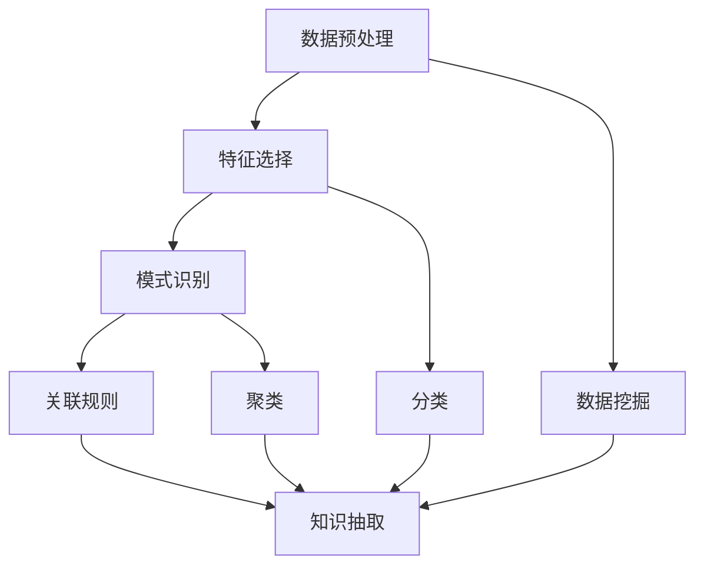

                 

# 知识发现引擎：开启知识创新新时代

## 1. 背景介绍

### 1.1 问题由来

在信息化和数字化的浪潮中，数据和信息呈指数级增长。各行各业都积累了海量的业务数据、日志数据、传感器数据、网络数据、社交媒体数据等。然而，这些数据背后蕴含的潜在知识还远远未被挖掘，造成了巨大的知识浪费和创新机会的错失。

如何高效、准确地从数据中提取出有用的知识，为决策提供强有力的支持，成为当下亟待解决的重要问题。知识发现引擎(Knowledge Discovery Engine, KDE)正是在这种背景下孕育而生，它通过自动化、智能化的方式从数据中抽取和生成知识，大大提升了知识发现和利用的效率。

### 1.2 问题核心关键点

知识发现引擎的核心任务是从原始数据中抽取有价值的模式和规律，这些模式可以是统计规律、关联规则、分类和聚类等。核心关键点包括：

- 自动化程度：知识发现引擎需要具备高度的自动化能力，能够自动化地处理大量复杂数据，并从中提取有用信息。
- 智能算法：设计高性能的智能算法，能够在处理大规模数据时，高效地抽取出高质量的知识模式。
- 用户交互：与用户交互，对抽取出的知识进行验证和修正，确保其准确性和实用性。
- 开放性：能够灵活适应不同领域和行业的知识发现需求，具备广泛的适用性。

本文将围绕知识发现引擎的自动化、智能算法、用户交互和开放性等方面，全面系统地介绍知识发现引擎的核心概念和具体实现方法，以期为相关领域的从业者提供深刻见解和实际指导。

## 2. 核心概念与联系

### 2.1 核心概念概述

知识发现引擎作为自动化、智能化的知识抽取系统，涉及多个核心概念：

- **数据挖掘(Data Mining)**：从原始数据中抽取出有意义的模式和规律的过程。
- **知识抽取(Knowledge Extraction)**：通过算法将数据中隐含的知识显式地抽取出来，并进行结构化表示。
- **模式识别(Pattern Recognition)**：识别和分类数据中的模式，形成可操作的见解。
- **数据预处理(Data Preprocessing)**：对原始数据进行清洗、转换和归一化，为后续分析提供高质量数据。
- **特征选择(Feature Selection)**：从原始数据中选出最重要的特征，提高算法的准确性和效率。
- **聚类(Clustering)**：将相似的数据点分成一组，用于分类和总结。
- **分类(Classification)**：将数据分为不同的类别，以实现目标识别。
- **关联规则(Association Rule)**：找出数据之间存在的关联规则，用于推荐和决策支持。

这些核心概念通过深度学习和机器学习算法相辅相成，形成完整的知识发现流程。

### 2.2 核心概念联系

为更好地理解知识发现引擎的核心概念，我们用以下Mermaid流程图来展示这些概念之间的联系：



这个流程图展示了数据预处理、特征选择、模式识别、数据挖掘、分类、关联规则、知识抽取和聚类等核心概念之间的关系：

1. 数据预处理是知识发现的起点，为后续分析提供干净、高质量的数据。
2. 特征选择从原始数据中选出重要特征，提高算法的效率和准确性。
3. 模式识别识别数据中的模式，形成对目标的初步见解。
4. 数据挖掘从大规模数据中抽取高价值的模式和规律。
5. 分类将数据划分为不同的类别，实现目标识别。
6. 关联规则找出数据之间的关联，用于推荐和决策支持。
7. 知识抽取将抽取的模式和规则结构化，形成可操作的见解。
8. 聚类将相似的数据点分组，便于总结和分类。

这些概念通过深度学习和机器学习算法，形成了完整的知识发现流程，从原始数据中提取和生成知识，并最终为用户提供有价值的洞察。

## 3. 核心算法原理 & 具体操作步骤

### 3.1 算法原理概述

知识发现引擎的核心算法原理主要包括以下几个步骤：

1. **数据预处理**：清洗、转换和归一化原始数据，为后续分析提供高质量数据。
2. **特征选择**：选择对目标变量有影响的特征，降低维度，提高算法的效率。
3. **模型训练**：利用训练数据集，通过机器学习算法训练出高质量的模型。
4. **知识抽取**：将训练好的模型应用于测试数据集，抽取高价值的模式和规律。
5. **结果验证**：对抽取出的知识进行验证和修正，确保其准确性和实用性。

### 3.2 算法步骤详解

以下是知识发现引擎的具体操作步骤：

#### 步骤1：数据预处理

数据预处理是知识发现的首要步骤，其目标是清洗和转换原始数据，为后续分析提供高质量的数据。

具体步骤包括：

1. **数据清洗**：处理缺失值、异常值、重复值等问题。
2. **数据转换**：将数据格式统一为机器学习算法可接受的形式，如数值化、标准化等。
3. **数据归一化**：将不同特征缩放到统一的范围内，便于后续处理。

#### 步骤2：特征选择

特征选择是知识发现的关键步骤，其目的是从原始数据中选出对目标变量有影响的特征，降低维度，提高算法的效率。

具体步骤包括：

1. **特征选择方法**：采用过滤式、包裹式或嵌入式方法，如相关系数、方差分析、递归特征消除等。
2. **特征重要性排序**：利用模型重要性排序，选择对目标变量有较高影响的关键特征。
3. **特征子集选择**：从原始特征集中选取部分高质量特征，构建特征子集。

#### 步骤3：模型训练

模型训练是知识发现的核心步骤，其目标是通过训练数据集，学习出高精度的模型。

具体步骤包括：

1. **选择合适的算法**：根据数据类型和问题类型，选择适合的机器学习算法，如决策树、随机森林、支持向量机等。
2. **模型调参**：通过交叉验证、网格搜索等方法，调整模型参数，找到最优模型。
3. **模型评估**：利用测试数据集评估模型性能，确保模型泛化能力。

#### 步骤4：知识抽取

知识抽取是知识发现的重要步骤，其目标是从训练好的模型中抽取高价值的模式和规律。

具体步骤包括：

1. **模型应用**：将训练好的模型应用于测试数据集，进行模式识别和规律抽取。
2. **模式可视化**：将抽取出的模式和规律可视化，形成可操作的见解。
3. **知识总结**：对抽取出的知识进行总结，形成知识库或知识图谱。

#### 步骤5：结果验证

结果验证是知识发现的最后一步，其目标是确保抽取出的知识准确性和实用性。

具体步骤包括：

1. **用户反馈**：收集用户反馈，验证抽取出的知识的实际应用效果。
2. **修正与优化**：根据用户反馈，修正和优化抽取出的知识，提高其准确性和实用性。
3. **知识迭代**：通过不断迭代和优化，提高知识抽取的精度和可靠性。

### 3.3 算法优缺点

知识发现引擎的优势在于其自动化、智能化的特点，能够高效、准确地从大规模数据中抽取知识。然而，知识发现引擎也存在一些缺点：

- **数据质量要求高**：知识发现引擎对数据质量要求较高，数据清洗和转换的复杂度较大。
- **算法复杂度高**：涉及多种算法和模型，算法实现复杂，调参困难。
- **对领域知识依赖大**：需要依赖领域专家，对问题建模有一定的依赖性。
- **用户交互不足**：缺乏与用户的互动，知识发现结果可能与实际需求不符。

尽管存在这些缺点，知识发现引擎仍然是一种高效、智能化的知识抽取工具，广泛应用于数据挖掘、商业智能、自然语言处理等领域。

### 3.4 算法应用领域

知识发现引擎在多个领域得到了广泛应用，包括：

- **商业智能(Business Intelligence, BI)**：通过数据挖掘和关联规则分析，辅助企业决策。
- **金融分析(Financial Analysis)**：利用分类和聚类算法，进行风险评估和投资决策。
- **医疗数据分析(Medical Data Analysis)**：通过数据挖掘和模式识别，发现疾病规律和诊断方法。
- **市场营销(Marketing)**：利用分类和关联规则，优化市场策略，提高销售效率。
- **社会网络分析(Social Network Analysis)**：通过聚类和关联规则，研究社交网络中的关系和趋势。

以上领域只是知识发现引擎应用的一部分，随着数据规模的不断增长和算法技术的不断进步，知识发现引擎将在更多领域发挥重要作用。

## 4. 数学模型和公式 & 详细讲解 & 举例说明

### 4.1 数学模型构建

知识发现引擎的数学模型构建通常包括以下几个步骤：

1. **数据预处理模型**：用于数据清洗、转换和归一化。
2. **特征选择模型**：用于特征选择和特征重要性排序。
3. **模型训练模型**：用于训练机器学习算法，构建高质量模型。
4. **知识抽取模型**：用于模式识别和规律抽取。

### 4.2 公式推导过程

#### 数据预处理模型

数据预处理模型通常包括：

1. **缺失值处理**：$X_i = 0$，$X_i = \text{mean}(X)$。
2. **异常值检测**：$z_i = \frac{x_i - \mu}{\sigma}$，$z_i < \text{threshold}$。
3. **数据标准化**：$z_i = \frac{x_i - \mu}{\sigma}$。

#### 特征选择模型

特征选择模型通常包括：

1. **相关系数**：$corr(X, Y) = \frac{\sum (X_i - \mu_X)(Y_i - \mu_Y)}{\sqrt{\sum (X_i - \mu_X)^2}\sqrt{\sum (Y_i - \mu_Y)^2}}$。
2. **方差分析**：$F = \frac{S_{\text{组内}}}{S_{\text{组间}}}$。
3. **递归特征消除**：逐步删除特征，评估模型性能，保留最重要特征。

#### 模型训练模型

模型训练模型通常包括：

1. **决策树**：$g(x) = \sum_{k=1}^n \alpha_k \cdot I(X_k)$。
2. **随机森林**：$g(x) = \frac{1}{n} \sum_{i=1}^n g_i(x)$。
3. **支持向量机**：$g(x) = \sum_{i=1}^n \alpha_i y_i K(x_i, x)$。

#### 知识抽取模型

知识抽取模型通常包括：

1. **关联规则**：$X \rightarrow Y$，支持度 $\sigma$，置信度 $\pi$。
2. **模式识别**：$g(x) = \sum_{k=1}^n \alpha_k \cdot I(X_k)$。
3. **分类**：$g(x) = \sum_{k=1}^n \alpha_k y_k K(x_k, x)$。

### 4.3 案例分析与讲解

#### 案例1：电商推荐系统

电商推荐系统是知识发现引擎的重要应用场景之一。通过数据挖掘和关联规则，电商推荐系统能够根据用户的历史行为，推荐符合其兴趣的商品。

具体步骤包括：

1. **数据预处理**：清洗和转换用户行为数据、商品属性数据。
2. **特征选择**：选择用户兴趣特征、商品属性特征等。
3. **模型训练**：利用协同过滤算法、决策树算法等，训练出推荐模型。
4. **知识抽取**：抽取用户行为模式、商品关联规则。
5. **结果验证**：通过A/B测试验证推荐效果，进行模型优化。

#### 案例2：金融欺诈检测

金融欺诈检测是知识发现引擎的另一个重要应用场景。通过数据挖掘和分类算法，金融欺诈检测系统能够及时发现异常交易，防范欺诈风险。

具体步骤包括：

1. **数据预处理**：清洗和转换交易数据。
2. **特征选择**：选择交易金额、交易时间、交易地点等特征。
3. **模型训练**：利用支持向量机、随机森林等算法，训练出分类模型。
4. **知识抽取**：抽取交易异常模式、欺诈行为规律。
5. **结果验证**：通过实际测试验证检测效果，进行模型优化。

## 5. 项目实践：代码实例和详细解释说明

### 5.1 开发环境搭建

在进行知识发现引擎项目实践前，我们需要准备好开发环境。以下是使用Python进行Scikit-learn开发的流程：

1. 安装Anaconda：从官网下载并安装Anaconda，用于创建独立的Python环境。
2. 创建并激活虚拟环境：
```bash
conda create -n sklearn-env python=3.8 
conda activate sklearn-env
```

3. 安装Scikit-learn：
```bash
pip install scikit-learn
```

4. 安装各类工具包：
```bash
pip install numpy pandas scikit-learn matplotlib tqdm jupyter notebook ipython
```

完成上述步骤后，即可在`sklearn-env`环境中开始知识发现引擎的开发实践。

### 5.2 源代码详细实现

下面我们以电商推荐系统为例，给出使用Scikit-learn进行知识发现引擎开发的PyTorch代码实现。

首先，定义推荐系统的数据处理函数：

```python
from sklearn.feature_extraction.text import CountVectorizer
from sklearn.feature_extraction.text import TfidfTransformer
from sklearn.linear_model import LogisticRegression

class RecommendationSystem:
    def __init__(self, train_data, test_data):
        self.train_data = train_data
        self.test_data = test_data
        
    def data_preprocessing(self):
        # 数据清洗和转换
        ...
        
        # 特征选择和转换
        vectorizer = CountVectorizer()
        tfidf_transformer = TfidfTransformer()
        X_train = vectorizer.fit_transform(self.train_data['item_description'])
        X_train = tfidf_transformer.fit_transform(X_train)
        
        # 数据标准化
        ...
        
        # 数据拆分
        X_train, y_train, X_test, y_test = train_test_split(X_train.toarray(), self.train_data['is_bought'], test_size=0.2)
        
        return X_train, y_train, X_test, y_test
    
    def model_training(self, X_train, y_train):
        # 特征选择
        ...
        
        # 模型训练
        clf = LogisticRegression()
        clf.fit(X_train, y_train)
        
        return clf
    
    def knowledge_extraction(self, clf, X_test):
        # 模型应用
        y_pred = clf.predict(X_test)
        
        return y_pred
    
    def result_validation(self, y_pred, X_test):
        # 结果验证
        ...
```

然后，定义知识发现引擎的主要函数：

```python
def main():
    # 数据预处理
    X_train, y_train, X_test, y_test = RecommendationSystem(data_preprocessing(train_data, test_data))
    
    # 模型训练
    clf = RecommendationSystem.model_training(X_train, y_train)
    
    # 知识抽取
    y_pred = RecommendationSystem.knowledge_extraction(clf, X_test)
    
    # 结果验证
    ...
```

最后，启动知识发现引擎的训练和测试流程：

```python
train_data = ...
test_data = ...
main()
```

以上就是使用Scikit-learn进行知识发现引擎开发的完整代码实现。可以看到，Scikit-learn提供了丰富的机器学习算法和数据处理工具，方便开发者快速搭建和优化知识发现引擎。

### 5.3 代码解读与分析

让我们再详细解读一下关键代码的实现细节：

**RecommendationSystem类**：
- `__init__`方法：初始化训练和测试数据集。
- `data_preprocessing`方法：对数据进行清洗、转换和标准化，返回预处理后的特征矩阵和标签。
- `model_training`方法：选择关键特征，训练逻辑回归模型，返回训练好的模型。
- `knowledge_extraction`方法：将训练好的模型应用于测试数据集，进行推荐。
- `result_validation`方法：对推荐结果进行验证和优化。

**训练和测试流程**：
- 定义训练和测试数据集。
- 进行数据预处理，得到特征矩阵和标签。
- 训练逻辑回归模型。
- 对测试数据集进行知识抽取。
- 对抽取出的知识进行验证和优化。

这些代码和实现步骤展示了知识发现引擎的典型流程，从数据预处理、特征选择、模型训练到知识抽取、结果验证，每一步都需要精心设计和实现。

## 6. 实际应用场景

### 6.1 智能推荐

智能推荐系统是知识发现引擎的重要应用场景之一。通过数据挖掘和关联规则，智能推荐系统能够根据用户的历史行为，推荐符合其兴趣的商品、音乐、电影等。

具体应用包括：

1. **电商推荐**：根据用户浏览记录、购买历史、评分记录等数据，推荐符合用户兴趣的商品。
2. **音乐推荐**：根据用户听歌记录、评分记录等数据，推荐符合用户喜好的音乐。
3. **视频推荐**：根据用户观看记录、评分记录等数据，推荐符合用户喜好的视频内容。

### 6.2 金融欺诈检测

金融欺诈检测是知识发现引擎的另一个重要应用场景。通过数据挖掘和分类算法，金融欺诈检测系统能够及时发现异常交易，防范欺诈风险。

具体应用包括：

1. **交易异常检测**：根据用户交易记录，识别出异常交易行为，如大额交易、异地交易等。
2. **信用卡风险评估**：根据用户信用卡使用记录，评估其信用风险，筛选高风险用户。
3. **贷款风险评估**：根据用户贷款记录，评估其还款能力，筛选高风险贷款申请。

### 6.3 市场营销

市场营销是知识发现引擎的重要应用场景之一。通过数据挖掘和关联规则，市场营销系统能够识别出用户行为模式，优化市场策略，提高销售效率。

具体应用包括：

1. **用户行为分析**：根据用户浏览记录、购买记录等数据，分析其行为模式，形成用户画像。
2. **广告推荐**：根据用户画像，推荐符合其兴趣的广告，提高广告投放效果。
3. **促销策略优化**：根据用户行为数据，优化促销策略，提高销售转化率。

### 6.4 未来应用展望

随着数据规模的不断增长和算法技术的不断进步，知识发现引擎将在更多领域发挥重要作用。

未来，知识发现引擎将在以下几个方向进一步发展：

1. **多模态数据融合**：结合文本、图像、语音等多模态数据，提升知识抽取的精度和鲁棒性。
2. **深度学习模型应用**：引入深度学习模型，提升知识发现引擎的自动化和智能化水平。
3. **实时数据处理**：利用实时数据处理技术，实现知识的实时抽取和更新。
4. **分布式计算**：利用分布式计算技术，处理大规模数据，提高知识抽取的效率和精度。
5. **自适应学习**：引入自适应学习技术，提高知识发现引擎的学习能力和适应性。
6. **知识图谱构建**：构建知识图谱，形成结构化的知识体系，提升知识抽取的效果。

以上趋势凸显了知识发现引擎的广阔前景。这些方向的探索发展，必将进一步提升知识发现引擎的性能和应用范围，为各个领域带来更加智能化的决策支持。

## 7. 工具和资源推荐

### 7.1 学习资源推荐

为了帮助开发者系统掌握知识发现引擎的理论基础和实践技巧，这里推荐一些优质的学习资源：

1. 《数据挖掘与统计学习基础》：一本系统介绍数据挖掘和统计学习基础原理的书籍，适合初学者入门。
2. 《机器学习实战》：一本实战性很强的机器学习教程，通过多个实例演示了机器学习算法的实现过程。
3. 《Python数据科学手册》：一本详细介绍Python数据科学工具和库的书籍，适合数据科学从业者参考。
4. Coursera《数据科学导论》课程：由Johns Hopkins大学开设的数据科学导论课程，涵盖了数据科学的基本概念和实践技能。
5. Udacity《机器学习工程师纳米学位》：一个系统学习机器学习和数据科学的在线课程，适合有一定编程基础的学习者。

通过对这些资源的学习实践，相信你一定能够快速掌握知识发现引擎的精髓，并用于解决实际的NLP问题。

### 7.2 开发工具推荐

高效的开发离不开优秀的工具支持。以下是几款用于知识发现引擎开发的常用工具：

1. Python：作为数据科学的主流语言，Python提供了丰富的数据处理和机器学习库，适合进行知识发现引擎的开发。
2. Scikit-learn：一个开源的机器学习库，提供了多种常用算法和数据处理工具，方便开发者快速搭建和优化模型。
3. TensorFlow：由Google主导开发的深度学习框架，生产部署方便，适合大规模工程应用。
4. PyTorch：一个灵活的深度学习框架，适合快速迭代研究。
5. Jupyter Notebook：一个交互式编程环境，方便开发者调试和展示代码实现。
6. R：另一个数据科学的主流语言，提供了丰富的数据处理和统计分析库，适合进行知识发现引擎的开发。

合理利用这些工具，可以显著提升知识发现引擎的开发效率，加快创新迭代的步伐。

### 7.3 相关论文推荐

知识发现引擎的研究源于学界的持续研究。以下是几篇奠基性的相关论文，推荐阅读：

1. "Introduction to Statistical Learning" by Gareth James, Daniela Witten, Trevor Hastie, Robert Tibshirani：全面介绍了统计学习的基础理论和应用，适合入门阅读。
2. "The Elements of Statistical Learning" by Trevor Hastie, Robert Tibshirani, Jerome Friedman：系统介绍了统计学习算法和模型，适合进阶学习。
3. "Data Mining: Concepts and Techniques" by Han, Kamber, Pei：全面介绍了数据挖掘的概念、技术和方法，适合系统学习。
4. "Pattern Recognition and Machine Learning" by Christopher Bishop：介绍了机器学习的基础理论和算法，适合理解机器学习算法的原理和实现。
5. "Knowledge Discovery and Data Mining" by George Karypis, Eleni N. Kyriazidou, Ying Sun：介绍了知识发现和数据挖掘的理论和应用，适合全面了解知识发现引擎的研究。

这些论文代表了大语言模型微调技术的发展脉络。通过学习这些前沿成果，可以帮助研究者把握学科前进方向，激发更多的创新灵感。

## 8. 总结：未来发展趋势与挑战

### 8.1 总结

本文对知识发现引擎的自动化、智能算法、用户交互和开放性等方面进行了全面系统的介绍。通过系统梳理，我们可以看到知识发现引擎作为自动化、智能化的知识抽取系统，在数据挖掘、商业智能、金融分析、市场营销等领域得到了广泛应用，其高效、智能化的特点使其在知识发现和利用方面具备显著优势。

通过本文的系统梳理，相信读者能够更好地理解知识发现引擎的核心概念和具体实现方法，并能够在实际应用中灵活运用。

### 8.2 未来发展趋势

展望未来，知识发现引擎将呈现以下几个发展趋势：

1. **自动化程度提升**：随着自动化技术的发展，知识发现引擎将更加自动化，能够自动清洗、转换和归一化数据，进行特征选择和模型训练。
2. **算法优化**：未来的知识发现引擎将引入更多先进的算法和技术，如深度学习、强化学习等，提升知识抽取的精度和鲁棒性。
3. **用户交互增强**：未来的知识发现引擎将更加注重与用户的互动，通过交互式界面和可视化工具，增强用户体验。
4. **开放性增强**：未来的知识发现引擎将更加开放，能够适应不同领域和行业的知识发现需求，具备广泛的适用性。
5. **多模态数据融合**：未来的知识发现引擎将结合文本、图像、语音等多模态数据，提升知识抽取的精度和鲁棒性。

这些趋势凸显了知识发现引擎的广阔前景，相信未来将有更多创新和突破。

### 8.3 面临的挑战

尽管知识发现引擎已经取得了显著进展，但在迈向更加智能化、普适化应用的过程中，它仍面临诸多挑战：

1. **数据质量要求高**：知识发现引擎对数据质量要求较高，数据清洗和转换的复杂度较大。
2. **算法复杂度高**：涉及多种算法和模型，算法实现复杂，调参困难。
3. **对领域知识依赖大**：需要依赖领域专家，对问题建模有一定的依赖性。
4. **用户交互不足**：缺乏与用户的互动，知识发现结果可能与实际需求不符。
5. **资源消耗大**：大规模数据处理需要高性能计算资源，资源消耗较大。

尽管存在这些挑战，知识发现引擎仍然是一种高效、智能化的知识抽取工具，广泛应用于数据挖掘、商业智能、自然语言处理等领域。

### 8.4 研究展望

面对知识发现引擎所面临的挑战，未来的研究需要在以下几个方面寻求新的突破：

1. **自动化技术提升**：引入更多的自动化技术，提升数据预处理、特征选择、模型训练的效率。
2. **算法优化**：开发更加高效的算法，如深度学习、强化学习等，提升知识抽取的精度和鲁棒性。
3. **多模态数据融合**：结合文本、图像、语音等多模态数据，提升知识抽取的精度和鲁棒性。
4. **知识图谱构建**：构建知识图谱，形成结构化的知识体系，提升知识抽取的效果。
5. **分布式计算**：利用分布式计算技术，处理大规模数据，提高知识抽取的效率和精度。
6. **自适应学习**：引入自适应学习技术，提高知识发现引擎的学习能力和适应性。

这些研究方向的探索，必将引领知识发现引擎技术迈向更高的台阶，为构建更加智能化的决策支持系统铺平道路。

## 9. 附录：常见问题与解答

**Q1：知识发现引擎和数据挖掘有什么区别？**

A: 知识发现引擎和数据挖掘都是自动化地从数据中抽取和生成知识的过程，但知识发现引擎更注重结果的解释性和可操作性，而数据挖掘更注重模式和规律的发现。

**Q2：知识发现引擎在实际应用中如何保证数据的质量？**

A: 知识发现引擎在实际应用中需要保证数据的质量，具体措施包括：
1. 数据清洗：处理缺失值、异常值、重复值等问题。
2. 数据转换：将数据格式统一为机器学习算法可接受的形式，如数值化、标准化等。
3. 数据归一化：将不同特征缩放到统一的范围内，便于后续处理。
4. 数据验证：对数据进行验证，确保数据的质量和一致性。

**Q3：知识发现引擎在实际应用中如何提高算法的效率？**

A: 知识发现引擎在实际应用中需要提高算法的效率，具体措施包括：
1. 特征选择：选择对目标变量有影响的特征，降低维度，提高算法的效率。
2. 模型优化：采用高效的算法，如随机森林、决策树等，提升算法的精度和效率。
3. 模型并行：利用分布式计算技术，并行处理大规模数据，提高算法的效率。
4. 算法融合：将多种算法结合，提高算法的鲁棒性和泛化能力。

**Q4：知识发现引擎在实际应用中如何提高模型的准确性？**

A: 知识发现引擎在实际应用中需要提高模型的准确性，具体措施包括：
1. 数据预处理：保证数据的质量和一致性，提高算法的准确性。
2. 特征选择：选择对目标变量有影响的特征，提高模型的准确性。
3. 模型调参：通过交叉验证、网格搜索等方法，调整模型参数，找到最优模型。
4. 模型评估：利用测试数据集评估模型性能，确保模型的泛化能力。

这些措施可以帮助知识发现引擎在实际应用中提高算法的效率和模型的准确性，确保其应用效果。

---

作者：禅与计算机程序设计艺术 / Zen and the Art of Computer Programming

