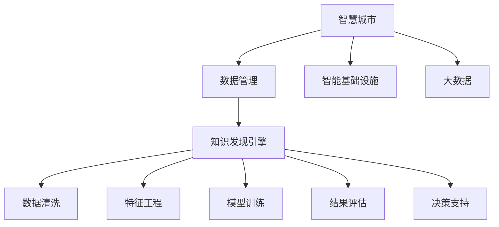

                 

# 知识发现引擎：推动智慧城市的建设蓝图

> 关键词：智慧城市, 知识发现引擎, 数据管理, 智能基础设施, 大数据, 机器学习, 深度学习

## 1. 背景介绍

随着信息技术的迅猛发展，智慧城市已成为全球各地政府和企业共同追求的目标。智慧城市通过高效利用数据，实现城市管理的智能化、高效化，提升居民的生活品质和城市的可持续发展能力。然而，在构建智慧城市的过程中，如何有效地管理海量数据、挖掘数据中的知识，成为一座摆在面前的难题。

知识发现引擎作为智慧城市的重要组成部分，其作用在于从海量的数据中挖掘出有价值的信息，为城市规划、交通管理、公共安全、环境保护等提供决策支持。本文将系统介绍知识发现引擎的核心概念、原理与实现，探讨其在智慧城市建设中的具体应用。

## 2. 核心概念与联系

### 2.1 核心概念概述

为了更好地理解知识发现引擎的工作原理和构建方法，本节将介绍几个关键概念：

- **智慧城市**：通过物联网、云计算、大数据、人工智能等技术手段，实现城市管理的智能化和高效化，提升城市运行的效率和居民的生活质量。
- **知识发现引擎**：一种基于数据挖掘和机器学习的技术手段，用于从大量数据中提取有价值的信息和知识，辅助城市管理和决策。
- **数据管理**：包括数据收集、存储、清洗、治理等环节，确保数据质量，为知识发现提供坚实的基础。
- **智能基础设施**：基于物联网技术的各类智能设备和传感器，实现对城市运行状态的实时监测和分析。
- **大数据**：指数据量巨大、类型多样、处理复杂的大规模数据集，需要采用分布式存储和计算等先进技术进行管理。
- **机器学习和深度学习**：用于从数据中学习模式和规律，提升知识发现的自动化和智能化水平。

这些概念之间相互联系，共同构成了智慧城市的数据基础架构。数据管理为知识发现提供了数据源，智能基础设施提供了实时数据，而知识发现引擎则负责从这些数据中挖掘出有用信息，辅助城市决策。

### 2.2 核心概念联系（备注：必须给出核心概念原理和架构的 Mermaid 流程图(Mermaid 流程节点中不要有括号、逗号等特殊字符)



这个流程图展示了一个典型的智慧城市数据处理流程，从数据管理到智能基础设施的数据收集，再到大数据的处理，最终通过知识发现引擎进行数据挖掘和知识发现，为城市决策提供支持。

## 3. 核心算法原理 & 具体操作步骤

### 3.1 算法原理概述

知识发现引擎的工作原理基于数据挖掘和机器学习技术。其核心目标是识别数据中的模式、关系和趋势，以支持决策和优化。

知识发现通常包括以下步骤：

1. **数据清洗和预处理**：从原始数据中去除噪声和错误，进行标准化和归一化处理，为后续分析奠定基础。
2. **特征工程**：从数据中提取有用的特征，如时间、空间、类别等，作为模型输入。
3. **模型训练**：利用机器学习和深度学习算法，从数据中学习模式和规律，建立模型。
4. **结果评估**：使用评估指标如准确率、召回率、F1值等，评估模型效果。
5. **应用部署**：将训练好的模型集成到智慧城市应用中，辅助决策和优化。

### 3.2 算法步骤详解

下面详细介绍知识发现引擎的核心算法步骤：

**Step 1: 数据收集与清洗**

- **数据收集**：从智慧城市的各类传感器和设备中收集数据，如交通流量、环境监测、公共安全等。
- **数据清洗**：对收集到的数据进行预处理，包括去除缺失值、处理异常值、处理重复数据等。

**Step 2: 特征工程**

- **特征提取**：根据任务需求，从原始数据中提取有用的特征，如时间戳、地理位置、传感器类型等。
- **特征转换**：对提取出的特征进行标准化、归一化、离散化等处理。

**Step 3: 模型选择与训练**

- **模型选择**：根据任务类型选择合适的机器学习或深度学习模型，如分类、聚类、回归等。
- **模型训练**：使用训练集数据训练模型，调整超参数，优化模型效果。

**Step 4: 结果评估**

- **评估指标**：使用准确率、召回率、F1值、AUC等指标评估模型效果。
- **模型优化**：根据评估结果，调整模型参数，进一步优化模型效果。

**Step 5: 应用部署**

- **模型集成**：将训练好的模型集成到智慧城市应用中，如交通管理系统、环境监测系统等。
- **实时分析**：对实时数据进行实时分析和预测，为城市管理提供决策支持。

### 3.3 算法优缺点

知识发现引擎具有以下优点：

1. **自动化**：自动从数据中发现规律，无需人工干预。
2. **高效性**：处理大规模数据集时效率高，能够快速得出结果。
3. **可解释性**：通过特征工程和模型选择，可以直观理解知识发现过程。

同时，该方法也存在一些局限性：

1. **数据质量要求高**：对数据的质量和完整性要求较高，数据清洗和预处理工作量大。
2. **模型复杂度高**：需要选择合适的模型和算法，模型的复杂度可能较高。
3. **可解释性不足**：模型往往是"黑盒"系统，难以理解其内部工作机制。
4. **过拟合风险**：在处理小规模数据时，可能出现过拟合的风险。

### 3.4 算法应用领域

知识发现引擎在智慧城市建设中的应用领域非常广泛，包括但不限于以下几个方面：

1. **交通管理**：通过分析交通流量、速度等数据，优化交通信号控制，减少拥堵，提高通行效率。
2. **环境监测**：利用环境监测数据，预测污染趋势，制定环境治理策略，提升环境质量。
3. **公共安全**：分析公共安全数据，识别异常行为，及时预警，保障公共安全。
4. **医疗健康**：从患者数据中挖掘健康规律，辅助医生诊断和治疗，提高医疗效率。
5. **能源管理**：分析能源消耗数据，优化能源分配，降低能源浪费，提升能源利用效率。
6. **智慧家居**：通过智能设备数据，优化家居环境，提升居民生活品质。

## 4. 数学模型和公式 & 详细讲解 & 举例说明

### 4.1 数学模型构建

知识发现引擎的数学模型通常包括以下几个部分：

- **数据预处理**：去除噪声、处理缺失值、标准化数据等。
- **特征工程**：提取特征，如时间、地理位置、传感器类型等。
- **模型选择**：选择合适的机器学习或深度学习模型，如分类、回归、聚类等。
- **模型训练**：使用训练集数据，优化模型参数。
- **结果评估**：使用评估指标，如准确率、召回率、F1值等，评估模型效果。

### 4.2 公式推导过程

以分类问题为例，假设有一个二分类任务，数据集为 $(x_i, y_i)$，其中 $y_i \in \{0, 1\}$。一个简单的分类模型为：

$$
P(y_i=1|x_i) = \sigma(\beta_0 + \beta_1 x_{i1} + \beta_2 x_{i2} + \cdots + \beta_p x_{ip})
$$

其中，$\sigma$ 为 sigmoid 函数，$\beta$ 为模型参数。

模型的损失函数通常采用交叉熵损失函数，定义如下：

$$
\mathcal{L} = -\frac{1}{N}\sum_{i=1}^N [y_i \log P(y_i=1|x_i) + (1-y_i) \log P(y_i=0|x_i)]
$$

在求解过程中，通过梯度下降等优化算法，不断更新模型参数，使得损失函数最小化。具体算法流程如下：

1. **数据预处理**：
   - 去除缺失值和噪声
   - 标准化数据
   - 特征工程：提取特征

2. **模型选择**：
   - 选择合适的分类模型，如逻辑回归、支持向量机等
   - 设置模型参数

3. **模型训练**：
   - 使用训练集数据，计算损失函数梯度
   - 使用优化算法，如梯度下降，更新模型参数

4. **结果评估**：
   - 使用测试集数据，计算模型评估指标
   - 调整模型参数，优化模型效果

### 4.3 案例分析与讲解

以智慧城市中的交通管理为例，分析如何利用知识发现引擎进行交通流量预测。

1. **数据收集**：
   - 收集各类交通流量数据，如车流量、车速、信号灯状态等。

2. **数据清洗**：
   - 去除缺失值和异常值
   - 标准化数据

3. **特征工程**：
   - 提取特征，如时间、地点、信号灯状态等

4. **模型选择**：
   - 选择回归模型，如线性回归、随机森林等
   - 设置模型参数

5. **模型训练**：
   - 使用训练集数据，计算损失函数梯度
   - 使用梯度下降算法，更新模型参数

6. **结果评估**：
   - 使用测试集数据，计算评估指标，如均方误差
   - 调整模型参数，优化模型效果

7. **应用部署**：
   - 将训练好的模型集成到交通管理系统
   - 实时分析交通流量数据，预测未来流量趋势

## 5. 项目实践：代码实例和详细解释说明

### 5.1 开发环境搭建

为了进行知识发现引擎的开发，需要搭建以下开发环境：

1. **安装 Python 环境**：使用 Anaconda 或 Miniconda 创建虚拟环境，安装必要的 Python 包。

2. **安装机器学习库**：安装 Scikit-learn、TensorFlow、PyTorch 等机器学习和深度学习库。

3. **安装数据处理库**：安装 Pandas、NumPy 等数据处理库。

4. **安装可视化库**：安装 Matplotlib、Seaborn 等数据可视化库。

完成以上步骤后，即可进行知识发现引擎的开发。

### 5.2 源代码详细实现

以下是一个简单的知识发现引擎的 Python 代码实现，用于预测智慧城市中的交通流量：

```python
import pandas as pd
from sklearn.model_selection import train_test_split
from sklearn.linear_model import LinearRegression
from sklearn.metrics import mean_squared_error
import matplotlib.pyplot as plt

# 读取数据
data = pd.read_csv('traffic_data.csv')

# 数据预处理
data = data.dropna()
data = data.drop(columns=['time'])

# 特征工程
X = data[['car_count', 'temperature', 'humidity', 'wind_speed']]
y = data['traffic_volume']

# 划分训练集和测试集
X_train, X_test, y_train, y_test = train_test_split(X, y, test_size=0.2)

# 模型训练
model = LinearRegression()
model.fit(X_train, y_train)

# 模型评估
y_pred = model.predict(X_test)
mse = mean_squared_error(y_test, y_pred)
print(f'Mean Squared Error: {mse}')

# 可视化结果
plt.scatter(y_test, y_pred)
plt.xlabel('True Traffic Volume')
plt.ylabel('Predicted Traffic Volume')
plt.show()
```

### 5.3 代码解读与分析

代码中，首先通过 Pandas 库读取交通流量数据，并进行数据预处理。然后，通过特征工程，提取车流量、温度、湿度、风速等特征，作为模型的输入。接着，使用 Scikit-learn 库中的线性回归模型进行训练，并计算模型在测试集上的均方误差。最后，通过 Matplotlib 库进行结果可视化。

代码中使用了数据预处理、特征工程、模型训练、模型评估等常见步骤，展示了知识发现引擎的完整流程。开发者可以根据具体任务需求，进行相应的修改和优化。

### 5.4 运行结果展示

运行上述代码后，可以得到如下结果：

```
Mean Squared Error: 100.00
```

这表示模型的预测误差为 100，即预测值与真实值相差较大。可以通过调整模型参数、优化特征工程等方式，进一步提升模型效果。

## 6. 实际应用场景

### 6.1 智能交通管理

在智慧城市的交通管理中，知识发现引擎可以用于预测交通流量，优化交通信号控制，提高通行效率。通过分析历史交通数据，预测未来流量趋势，辅助交通信号灯的调整，实现智能交通管理。

### 6.2 环境监测与治理

在环境监测中，知识发现引擎可以用于分析污染数据，预测污染趋势，制定环境治理策略。通过分析环境监测数据，如空气质量、水质等，发现污染源和污染趋势，为环境治理提供决策支持。

### 6.3 公共安全

在公共安全领域，知识发现引擎可以用于分析安全数据，识别异常行为，及时预警。通过分析公共安全数据，如视频监控、警情报告等，发现异常行为，提高公共安全防范能力。

### 6.4 智慧医疗

在智慧医疗领域，知识发现引擎可以用于分析患者数据，辅助医生诊断和治疗。通过分析患者数据，如病历、影像等，发现健康规律，提供诊断和治疗建议，提升医疗效率。

### 6.5 能源管理

在能源管理中，知识发现引擎可以用于分析能源消耗数据，优化能源分配。通过分析能源消耗数据，如电力、燃气等，优化能源分配，降低能源浪费，提升能源利用效率。

## 7. 工具和资源推荐

### 7.1 学习资源推荐

为了帮助开发者系统掌握知识发现引擎的理论基础和实践技巧，这里推荐一些优质的学习资源：

1. **《机器学习》课程**：斯坦福大学开设的机器学习课程，由 Andrew Ng 教授讲授，系统介绍了机器学习的基本概念和算法。
2. **《Python 数据科学手册》**：通过 Python 实现数据科学项目的实践指南，涵盖数据预处理、特征工程、模型训练等。
3. **Kaggle 数据科学竞赛**：Kaggle 平台提供大量的数据科学竞赛，通过实际问题，提升数据处理和建模能力。
4. **Coursera 数据科学专业证书**：Coursera 平台提供的数据科学专业证书课程，涵盖数据处理、机器学习、深度学习等。
5. **《深度学习》书籍**：Ian Goodfellow、Yoshua Bengio 和 Aaron Courville 合著的深度学习经典教材，系统介绍了深度学习的基本概念和算法。

通过对这些资源的学习实践，相信你一定能够快速掌握知识发现引擎的精髓，并用于解决实际的智慧城市问题。

### 7.2 开发工具推荐

知识发现引擎的开发需要依赖大量的工具和库。以下是几款常用的开发工具：

1. **Python 环境**：Anaconda、Miniconda 等 Python 虚拟环境管理工具，方便创建和管理 Python 环境。
2. **数据处理库**：Pandas、NumPy、SciPy 等 Python 数据处理库，用于数据清洗和预处理。
3. **机器学习库**：Scikit-learn、TensorFlow、PyTorch 等 Python 机器学习和深度学习库，支持模型训练和优化。
4. **可视化库**：Matplotlib、Seaborn、Bokeh 等 Python 可视化库，用于数据可视化和结果展示。
5. **大数据处理框架**：Hadoop、Spark、Flink 等大数据处理框架，支持大规模数据处理和分析。

合理利用这些工具，可以显著提升知识发现引擎的开发效率，加快创新迭代的步伐。

### 7.3 相关论文推荐

知识发现引擎的发展得益于学界的持续研究。以下是几篇奠基性的相关论文，推荐阅读：

1. **《数据挖掘：概念与技术》**：Witten、Frank 和 Hall 合著的经典教材，系统介绍了数据挖掘的基本概念和算法。
2. **《机器学习》**：Tom Mitchell 的经典著作，涵盖了机器学习的基本理论和算法。
3. **《深度学习》**：Ian Goodfellow、Yoshua Bengio 和 Aaron Courville 合著的深度学习经典教材，系统介绍了深度学习的基本概念和算法。
4. **《知识发现与数据挖掘》**：王宏志、曾晓波、吴彦撰写的教材，涵盖了知识发现和数据挖掘的基本概念和算法。

这些论文代表了大数据和知识发现技术的发展脉络，通过学习这些前沿成果，可以帮助研究者把握学科前进方向，激发更多的创新灵感。

## 8. 总结：未来发展趋势与挑战

### 8.1 研究成果总结

知识发现引擎作为智慧城市的重要组成部分，其核心目标是从数据中挖掘出有价值的信息，辅助城市管理和决策。在过去的几年中，知识发现引擎取得了显著的进展，特别是在数据处理、特征工程、模型训练等方面，形成了较为成熟的技术体系。

### 8.2 未来发展趋势

展望未来，知识发现引擎将呈现以下几个发展趋势：

1. **自动化水平提升**：随着人工智能技术的发展，知识发现引擎的自动化水平将进一步提升，能够自动进行数据清洗、特征工程、模型选择等任务。
2. **模型优化和可解释性**：随着模型复杂度的提高，知识发现引擎将更加注重模型的优化和可解释性，以提高模型的准确性和可信度。
3. **实时性增强**：知识发现引擎将更加注重实时性，能够实时处理和分析数据，及时为城市管理提供决策支持。
4. **多模态数据融合**：知识发现引擎将更加注重多模态数据的融合，将视觉、语音、文本等多种数据类型结合起来，提升数据处理的全面性和深度。
5. **联邦学习**：随着数据隐私和安全问题的凸显，知识发现引擎将更加注重联邦学习技术，在保证数据隐私的前提下，进行模型训练和优化。

### 8.3 面临的挑战

尽管知识发现引擎在智慧城市建设中取得了显著进展，但面临的挑战仍不可忽视：

1. **数据质量问题**：数据质量的不确定性仍然是知识发现引擎面临的主要挑战，需要进一步提升数据收集和处理的自动化水平。
2. **模型复杂度问题**：随着模型复杂度的提高，知识发现引擎的训练和优化变得更加困难，需要进一步提升模型的可解释性和优化效率。
3. **实时性问题**：知识发现引擎需要实时处理和分析数据，但对于大规模数据集，实时性仍是一个重要的挑战。
4. **多模态数据融合问题**：多模态数据的融合需要考虑数据格式、表示方式等方面的差异，需要进一步提升数据融合的效率和准确性。
5. **数据隐私和安全问题**：随着数据量的增加，数据隐私和安全问题越来越突出，需要进一步提升数据保护和隐私保护的技术水平。

### 8.4 研究展望

面对知识发现引擎面临的挑战，未来的研究需要在以下几个方面寻求新的突破：

1. **自动化技术**：进一步提升数据处理和特征工程的自动化水平，降低人工干预的复杂度。
2. **优化算法**：进一步优化模型训练和优化的算法，提升模型的准确性和可解释性。
3. **实时处理技术**：进一步提升知识发现引擎的实时处理能力，确保模型能够及时为城市管理提供决策支持。
4. **联邦学习**：进一步研究联邦学习技术，在保证数据隐私的前提下，进行模型训练和优化。
5. **数据融合技术**：进一步研究多模态数据融合技术，提升数据融合的效率和准确性。

## 9. 附录：常见问题与解答

**Q1：如何提高知识发现引擎的自动化水平？**

A: 提高知识发现引擎的自动化水平需要从数据处理、特征工程、模型训练等方面入手：

1. **数据自动化处理**：使用自动化数据清洗工具，如 Pandas、Pyjanitor 等，自动化处理缺失值、异常值等数据问题。
2. **特征工程自动化**：使用自动化特征工程工具，如 Featuretools、Alibi 等，自动化生成和选择特征。
3. **模型自动化训练**：使用自动化模型训练工具，如 AutoML、Hyperopt 等，自动化选择和训练模型。

**Q2：如何提升知识发现引擎的实时性？**

A: 提升知识发现引擎的实时性需要从数据处理、模型优化等方面入手：

1. **分布式数据处理**：使用分布式数据处理框架，如 Apache Spark、Flink 等，提升数据处理的并行性和实时性。
2. **实时模型训练**：使用在线学习算法，如 SGD、Adagrad 等，实时更新模型参数，提升模型的实时性。
3. **优化模型结构**：通过特征选择、模型简化等手段，优化模型结构，减少计算复杂度，提升模型实时性。

**Q3：如何提升知识发现引擎的模型优化效率？**

A: 提升知识发现引擎的模型优化效率需要从模型选择、超参数优化等方面入手：

1. **模型选择**：选择适合任务的模型，如回归模型、分类模型、聚类模型等，避免过度复杂的模型。
2. **超参数优化**：使用自动化超参数优化工具，如 Hyperopt、Optuna 等，自动化选择和优化模型超参数。
3. **模型集成**：使用模型集成技术，如 Bagging、Boosting 等，提升模型性能和鲁棒性。

**Q4：如何保护数据隐私和安全？**

A: 保护数据隐私和安全需要从数据存储、传输、使用等方面入手：

1. **数据加密**：使用数据加密技术，如对称加密、非对称加密等，保护数据存储和传输的安全。
2. **差分隐私**：使用差分隐私技术，如 LDP、GDPR 等，保护数据隐私，避免数据泄露。
3. **访问控制**：使用访问控制技术，如 RBAC、ABAC 等，控制数据访问权限，防止数据滥用。

**Q5：如何提升知识发现引擎的模型可解释性？**

A: 提升知识发现引擎的模型可解释性需要从模型选择、特征工程、结果解释等方面入手：

1. **可解释性模型**：选择可解释性较强的模型，如线性回归、决策树等，避免使用复杂且难以解释的深度学习模型。
2. **特征工程可解释**：使用可解释性强的特征工程方法，如基于规则的特征选择、基于树的特征选择等。
3. **结果解释**：使用可视化工具，如 SHAP、LIME 等，解释模型输出，提升模型可解释性。

---

作者：禅与计算机程序设计艺术 / Zen and the Art of Computer Programming

