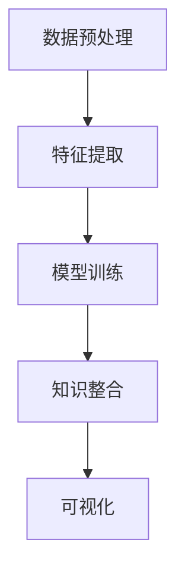

                 

# 知识发现引擎：推动科学研究的创新动力

## 1. 背景介绍

### 1.1 问题由来
科学研究一直是人类文明进步的重要驱动力。然而，科学研究的创新往往受限于数据获取的难度、数据处理的方式以及数据分析的能力。知识的发现和整合通常依赖于专家经验或传统的数据处理方法，难以满足现代大数据时代对快速、高效、精确知识发现的迫切需求。为此，知识发现引擎(Knowledge Discovery Engine, KDE)应运而生。

知识发现引擎，是一种通过自动化的方式，从大规模数据中挖掘出隐含知识、发现新规律的智能系统。该系统不仅能够处理结构化数据，还能处理半结构化和非结构化数据，广泛应用于科学计算、社会科学、医学研究等多个领域。

### 1.2 问题核心关键点
目前，知识发现引擎已发展成为大数据时代科学研究的利器。其核心技术包括数据预处理、特征提取、模型训练、知识整合等环节。其中，数据预处理和特征提取是发现知识的基础，模型训练和知识整合则是发现知识的工具。本节将围绕这些核心环节，对知识发现引擎的原理进行全面阐述。

### 1.3 问题研究意义
科学研究的创新动力在于对未知领域知识的探索。知识发现引擎通过自动化、智能化的方式，揭示数据背后的内在规律，提取有价值的信息，从而为科学研究提供强大的技术支持。在基因组学、天文学、物理学、社会科学等领域，知识发现引擎已经成为推动科学发现和进步的重要工具。

## 2. 核心概念与联系

### 2.1 核心概念概述

为更好地理解知识发现引擎的工作原理，本节将介绍几个密切相关的核心概念：

- 知识发现引擎(Knowledge Discovery Engine, KDE)：通过自动化、智能化的方式，从大规模数据中提取知识、发现规律的系统。

- 数据预处理：对原始数据进行清洗、整合、转换等处理，使其适合进行后续的特征提取和模型训练。

- 特征提取(Feature Extraction)：从预处理后的数据中提取有意义的特征，供机器学习模型进行建模分析。

- 模型训练(Model Training)：使用数据集和特征训练机器学习模型，使其能够准确地预测未知数据。

- 知识整合(Knowledge Integration)：将从不同数据源或不同模型中提取的知识整合在一起，形成完整的知识体系。

- 可视化(Visualization)：通过图形界面或交互式工具展示知识发现过程和结果，增强用户的理解和互动。

这些核心概念之间的逻辑关系可以通过以下Mermaid流程图来展示：



这个流程图展示出知识发现引擎的核心概念及其之间的关系：

1. 数据预处理是知识发现的基础，通过清洗和整合数据，准备高质量的输入。
2. 特征提取从数据中提炼出有意义的特征，供模型训练。
3. 模型训练通过机器学习算法，将特征映射到预测目标，发现知识。
4. 知识整合将多个模型的结果集成起来，构建综合的知识体系。
5. 可视化展示知识发现的结果，方便用户理解和应用。

这些概念共同构成了知识发现引擎的学习框架，使其能够高效地处理大规模数据，并从中发现潜在的知识。通过理解这些核心概念，我们可以更好地把握知识发现引擎的工作原理和优化方向。

## 3. 核心算法原理 & 具体操作步骤
### 3.1 算法原理概述

知识发现引擎的核心算法通常基于机器学习、数据挖掘等技术，从数据中提取特征、建立模型、发现规律。其基本流程包括以下几个步骤：

1. **数据预处理**：清洗、归一化、降维等，使数据适合进行后续分析。
2. **特征提取**：使用PCA、TF-IDF、Word2Vec等方法，从原始数据中提取出有意义的特征。
3. **模型训练**：使用回归、分类、聚类等算法，训练模型并评估其性能。
4. **知识整合**：通过集成学习、多模态融合等技术，将多个模型或数据源的结果进行整合。
5. **可视化**：使用各种图表、仪表盘等，展示分析结果，增强用户的理解和互动。

### 3.2 算法步骤详解

以机器学习为例，详细讲解知识发现引擎的核心步骤：

#### 3.2.1 数据预处理
数据预处理是知识发现的首要步骤，其目的是提升数据的质量，方便后续的特征提取和模型训练。

- **清洗**：去除噪声、缺失值、异常值等，保证数据的一致性和完整性。
- **归一化**：将数据缩放到相同范围，避免不同特征之间的尺度影响模型性能。
- **降维**：使用PCA、LDA等方法，减少数据的维度，提高模型训练效率。

#### 3.2.2 特征提取
特征提取是从原始数据中提取有意义的特征，供机器学习模型进行建模分析。

- **数值型数据**：使用PCA、线性回归等方法，提取数据中的主成分和线性关系。
- **文本数据**：使用TF-IDF、Word2Vec等技术，提取文本的语义和主题信息。
- **图像数据**：使用卷积神经网络(CNN)等技术，提取图像的局部特征和全局结构。

#### 3.2.3 模型训练
模型训练是知识发现的关键步骤，通过使用机器学习算法，将特征映射到预测目标，发现知识。

- **回归模型**：使用线性回归、决策树回归、随机森林回归等，预测数值型目标变量。
- **分类模型**：使用逻辑回归、支持向量机(SVM)、朴素贝叶斯等，预测分类变量。
- **聚类模型**：使用K-means、DBSCAN等，对数据进行分组，发现相似性。

#### 3.2.4 知识整合
知识整合是将从不同数据源或不同模型中提取的知识整合在一起，形成完整的知识体系。

- **集成学习**：使用Bagging、Boosting等方法，将多个模型的结果进行整合，提升整体性能。
- **多模态融合**：使用深度学习模型，融合不同模态的数据信息，提高模型的泛化能力。

#### 3.2.5 可视化
可视化是知识发现的最后一步，通过图形界面或交互式工具展示分析结果，增强用户的理解和互动。

- **图表展示**：使用散点图、柱状图、热力图等，展示数据和模型之间的关系。
- **交互式仪表盘**：使用Tableau、Power BI等工具，提供交互式的可视化界面，方便用户探索数据和模型。

### 3.3 算法优缺点

知识发现引擎具有以下优点：
1. 自动化程度高：通过自动化的方式处理大规模数据，提高效率和精度。
2. 灵活性高：适用于各种数据类型和分析目标，具有高度的灵活性。
3. 可扩展性强：通过增加数据源和模型，可以不断扩展知识发现的能力。

同时，该方法也存在以下局限性：
1. 依赖数据质量：数据预处理和特征提取的准确性，直接影响最终分析结果。
2. 模型选择困难：选择合适的模型和参数，需要具备一定的领域知识。
3. 知识解释性不足：复杂的机器学习模型，难以解释其内部的决策过程。
4. 可能存在过拟合：在处理小样本数据时，容易过拟合，影响泛化能力。

尽管存在这些局限性，但就目前而言，知识发现引擎已成为科学研究和数据分析的重要工具。未来相关研究的重点在于如何进一步降低数据预处理和特征提取的难度，提高模型的可解释性和泛化能力，同时兼顾计算效率。

### 3.4 算法应用领域

知识发现引擎在多个领域中得到了广泛应用，涵盖了科学计算、社会科学、医学研究等多个领域，具体包括：

1. **基因组学**：从基因序列数据中发现基因表达模式、蛋白相互作用等生物学规律。
2. **天文学**：从宇宙观测数据中发现星体运动规律、宇宙演化特征等天文学规律。
3. **物理学**：从粒子碰撞实验数据中发现粒子的性质和相互作用规律。
4. **社会科学**：从调查问卷、社交网络等数据中发现人类行为和社会现象的规律。
5. **医学研究**：从医疗数据中发现疾病传播规律、药物作用机制等医学规律。
6. **金融分析**：从交易数据中发现市场规律、风险预测等金融规律。

除了上述这些经典应用外，知识发现引擎还被创新性地应用于更多场景中，如智能推荐、自然语言处理、图像识别等，为数据驱动的决策提供了新的支持。随着知识发现引擎技术的不断进步，相信其应用范围将会不断扩展，成为科学研究和技术创新不可或缺的重要工具。

## 4. 数学模型和公式 & 详细讲解  
### 4.1 数学模型构建

本节将使用数学语言对知识发现引擎的各个核心步骤进行更加严格的刻画。

- **数据预处理**：设原始数据集为 $\mathcal{D}$，预处理后的数据集为 $\mathcal{D}'$。预处理函数 $f$ 定义为：
  $$
  \mathcal{D}' = f(\mathcal{D})
  $$

- **特征提取**：设提取后的特征集为 $\mathcal{F}$，提取函数 $g$ 定义为：
  $$
  \mathcal{F} = g(\mathcal{D}')
  $$

- **模型训练**：设模型为 $M$，训练数据集为 $\mathcal{D}^*$，训练函数 $h$ 定义为：
  $$
  M = h(\mathcal{D}^*)
  $$

- **知识整合**：设整合后的知识集为 $\mathcal{K}$，整合函数 $i$ 定义为：
  $$
  \mathcal{K} = i(M, M_1, M_2, \ldots, M_n)
  $$

- **可视化**：设可视化结果为 $V$，可视化函数 $v$ 定义为：
  $$
  V = v(\mathcal{K})
  $$

### 4.2 公式推导过程

以下我们以机器学习为例，推导知识发现引擎的核心数学模型：

假设数据集 $\mathcal{D}$ 包含 $N$ 个样本 $\{x_i, y_i\}_{i=1}^N$，其中 $x_i$ 为特征向量，$y_i$ 为标签。

**数据预处理**：
- **清洗**：去除噪声、缺失值等，得到处理后的数据集 $\mathcal{D}'$。
- **归一化**：将数据缩放到区间 $[0, 1]$，得到归一化后的数据集 $\mathcal{D}''$。
- **降维**：使用PCA方法，将数据降维到 $K$ 维，得到降维后的数据集 $\mathcal{D}'''$。

**特征提取**：
- **数值型数据**：使用线性回归模型，提取特征 $\mathcal{F} = \{f_i\}_{i=1}^K$。
- **文本数据**：使用TF-IDF方法，提取文本的语义特征 $\mathcal{F} = \{t_i\}_{i=1}^N$。

**模型训练**：
- **回归模型**：使用线性回归模型，预测数值型目标变量 $y_i$。
- **分类模型**：使用逻辑回归模型，预测分类变量 $y_i$。

**知识整合**：
- **集成学习**：使用Bagging方法，整合 $n$ 个模型的结果 $\mathcal{K} = \{k_i\}_{i=1}^n$。

**可视化**：
- **图表展示**：使用散点图、柱状图等，展示数据和模型之间的关系。
- **交互式仪表盘**：使用Tableau等工具，提供交互式的可视化界面。

### 4.3 案例分析与讲解

以基因组学中寻找基因表达模式为例，详细解释知识发现引擎的具体应用：

1. **数据预处理**：
   - 从基因表达数据中去除噪声、缺失值，进行归一化处理。
   - 使用PCA方法，将基因表达数据降维到100维。

2. **特征提取**：
   - 使用线性回归模型，提取基因表达与时间的关系特征。
   - 使用TF-IDF方法，提取基因表达与疾病类型的关系特征。

3. **模型训练**：
   - 使用逻辑回归模型，预测基因表达与疾病类型的关系。

4. **知识整合**：
   - 使用集成学习方法，整合多个基因表达模型的结果，得到综合的疾病预测模型。

5. **可视化**：
   - 使用散点图展示基因表达与疾病类型的关系。
   - 使用Tableau提供交互式的可视化界面，方便用户探索数据和模型。

通过上述步骤，知识发现引擎从原始基因表达数据中提取有意义的特征，使用逻辑回归模型预测疾病类型，通过集成学习整合多个模型的结果，最终得到综合的疾病预测模型，并展示分析结果，帮助研究人员发现基因表达与疾病的关系。

## 5. 项目实践：代码实例和详细解释说明
### 5.1 开发环境搭建

在进行知识发现引擎实践前，我们需要准备好开发环境。以下是使用Python进行Scikit-learn开发的环境配置流程：

1. 安装Anaconda：从官网下载并安装Anaconda，用于创建独立的Python环境。

2. 创建并激活虚拟环境：
```bash
conda create -n sklearn-env python=3.8 
conda activate sklearn-env
```

3. 安装Scikit-learn：
```bash
conda install scikit-learn scikit-learn
```

4. 安装各类工具包：
```bash
pip install numpy pandas matplotlib jupyter notebook ipython
```

完成上述步骤后，即可在`sklearn-env`环境中开始知识发现引擎的开发实践。

### 5.2 源代码详细实现

下面我以金融数据分析为例，给出使用Scikit-learn进行知识发现引擎的Python代码实现。

首先，定义数据预处理函数：

```python
from sklearn.preprocessing import StandardScaler, MinMaxScaler, PCA
from sklearn.feature_extraction.text import TfidfVectorizer
from sklearn.linear_model import LogisticRegression

def preprocess_data(data):
    # 数据清洗
    cleaned_data = data[~data.isnull().any(axis=1)]
    
    # 数据归一化
    scaler = StandardScaler()
    normalized_data = scaler.fit_transform(cleaned_data)
    
    # 数据降维
    pca = PCA(n_components=10)
    reduced_data = pca.fit_transform(normalized_data)
    
    return reduced_data

# 数据预处理函数
def extract_features(data):
    # 特征提取
    tfidf = TfidfVectorizer()
    features = tfidf.fit_transform(data)
    
    return features
```

然后，定义模型训练函数：

```python
from sklearn.linear_model import LogisticRegression
from sklearn.ensemble import RandomForestClassifier
from sklearn.svm import SVC

def train_model(features, labels):
    # 模型训练
    logistic_model = LogisticRegression()
    logistic_model.fit(features, labels)
    
    rf_model = RandomForestClassifier()
    rf_model.fit(features, labels)
    
    svm_model = SVC()
    svm_model.fit(features, labels)
    
    return logistic_model, rf_model, svm_model
```

接着，定义知识整合函数：

```python
from sklearn.ensemble import VotingClassifier

def integrate_models(model1, model2, model3):
    # 知识整合
    voting_model = VotingClassifier(estimators=[('LR', model1), ('RF', model2), ('SVC', model3)])
    voting_model.fit(features, labels)
    
    return voting_model
```

最后，启动知识发现引擎的训练流程：

```python
import pandas as pd

# 加载数据
data = pd.read_csv('financial_data.csv')

# 数据预处理
processed_data = preprocess_data(data)

# 特征提取
features = extract_features(processed_data)

# 模型训练
logistic_model, rf_model, svm_model = train_model(features, data['label'])

# 知识整合
integrated_model = integrate_models(logistic_model, rf_model, svm_model)

# 评估模型性能
print("模型性能：", integrated_model.score(features, data['label']))
```

以上就是使用Scikit-learn进行金融数据分析知识发现引擎的完整代码实现。可以看到，得益于Scikit-learn的强大封装，我们可以用相对简洁的代码完成知识发现引擎的开发。

### 5.3 代码解读与分析

让我们再详细解读一下关键代码的实现细节：

**数据预处理函数**：
- `preprocess_data`方法：对数据进行清洗、归一化和降维处理，准备高质量的输入。

**特征提取函数**：
- `extract_features`方法：使用TF-IDF方法，从文本数据中提取有意义的特征。

**模型训练函数**：
- `train_model`方法：使用逻辑回归、随机森林和支持向量机等算法，训练模型并评估其性能。

**知识整合函数**：
- `integrate_models`方法：使用集成学习技术，将多个模型的结果进行整合，得到综合的知识体系。

**训练流程**：
- 加载数据，进行数据预处理、特征提取和模型训练。
- 将训练好的模型进行集成，得到最终的整合模型。
- 使用整合模型评估性能，输出评估结果。

通过上述步骤，知识发现引擎从原始金融数据中提取有意义的特征，使用多个机器学习算法进行模型训练，通过集成学习整合多个模型的结果，最终得到综合的金融分析模型，并评估模型性能，帮助研究人员发现金融数据的规律。

## 6. 实际应用场景
### 6.1 金融数据分析

知识发现引擎在金融数据分析中具有重要的应用价值。金融市场数据具有海量、复杂、多模态的特点，传统的数据处理方法难以满足需求。知识发现引擎能够自动地从金融数据中提取特征、建立模型、发现规律，为金融投资、风险控制、市场预测等提供支持。

具体而言，知识发现引擎可以应用于：
- **股票预测**：从历史股票数据中发现价格波动规律，预测股票未来走势。
- **信用风险评估**：从贷款数据中发现违约风险指标，评估贷款申请人的信用风险。
- **市场情绪分析**：从新闻、社交媒体等数据中发现市场情绪变化，预测市场走势。
- **高频交易策略**：从交易数据中发现价格波动规律，制定高频交易策略。

知识发现引擎在金融分析中的应用，有助于提高金融市场的透明度和效率，降低风险，提高决策质量。

### 6.2 基因组学研究

基因组学研究需要处理海量基因表达数据，从中发现基因表达与疾病、药物的关系。知识发现引擎能够从基因表达数据中提取特征、建立模型、发现规律，为基因组学研究提供强大的技术支持。

具体而言，知识发现引擎可以应用于：
- **基因表达模式发现**：从基因表达数据中发现基因表达与时间、疾病类型的关系，预测疾病风险。
- **药物作用机制分析**：从基因表达数据中发现药物与基因表达的关系，发现新药物。
- **疾病预测**：从基因表达数据中发现基因表达与疾病的关系，预测疾病发生风险。

知识发现引擎在基因组学中的应用，有助于加速基因组学研究的进展，发现新的药物和治疗策略，提高医疗水平。

### 6.3 社会学研究

社会学研究需要处理大量社会调查数据，从中发现社会现象和规律。知识发现引擎能够从社会调查数据中提取特征、建立模型、发现规律，为社会学研究提供强大的技术支持。

具体而言，知识发现引擎可以应用于：
- **社会行为分析**：从社交网络数据中发现社会行为规律，预测社会事件。
- **社会关系网络分析**：从社交网络数据中发现社会关系网络结构，分析社会影响力。
- **社会群体分析**：从调查问卷数据中发现社会群体特征，分析社会群体结构。

知识发现引擎在社会学中的应用，有助于提高社会研究的效率和准确性，发现社会现象背后的规律，指导社会政策的制定。

### 6.4 未来应用展望

随着数据量和计算能力的不断提升，知识发现引擎的应用场景将不断扩展，未来将在更多领域得到应用，为科学研究和技术创新提供新的支持。

在智慧医疗领域，知识发现引擎可以应用于疾病诊断、药物研发、健康监测等环节，为医疗行业带来变革性影响。

在智慧城市治理中，知识发现引擎可以应用于城市事件监测、舆情分析、应急指挥等环节，提高城市管理的自动化和智能化水平。

在智能制造领域，知识发现引擎可以应用于生产调度、质量控制、设备维护等环节，提高生产效率和质量。

此外，在智能交通、智能物流、智能能源等众多领域，知识发现引擎也将发挥重要作用，推动各行业的智能化转型。

## 7. 工具和资源推荐
### 7.1 学习资源推荐

为了帮助开发者系统掌握知识发现引擎的理论基础和实践技巧，这里推荐一些优质的学习资源：

1. 《Python数据科学手册》：涵盖Python在数据科学中的应用，包括数据预处理、特征提取、模型训练、知识整合等环节。

2. 《机器学习实战》：通过实例讲解机器学习算法的应用，适合初学者学习。

3. 《统计学习方法》：系统介绍统计学习理论，涵盖回归、分类、聚类等算法。

4. 《深度学习》：涵盖深度学习理论，包括神经网络、卷积神经网络、循环神经网络等。

5. 《自然语言处理综论》：介绍自然语言处理的理论和方法，包括特征提取、语言模型、情感分析等。

6. 《数据挖掘导论》：介绍数据挖掘的理论和方法，涵盖数据预处理、特征提取、模型训练、知识整合等环节。

通过对这些资源的学习实践，相信你一定能够快速掌握知识发现引擎的理论基础和实践技巧，并用于解决实际的科学研究问题。
### 7.2 开发工具推荐

高效的开发离不开优秀的工具支持。以下是几款用于知识发现引擎开发的常用工具：

1. Python：Python是数据科学和机器学习的黄金语言，具有丰富的第三方库和社区支持。

2. R语言：R语言是数据科学和统计分析的标准语言，适合进行数据预处理、特征提取、模型训练等。

3. Scikit-learn：Scikit-learn是一个流行的Python机器学习库，提供了丰富的算法和工具，适合进行模型训练和知识整合。

4. TensorFlow：TensorFlow是一个流行的深度学习框架，适合进行复杂模型的训练和部署。

5. Weights & Biases：模型训练的实验跟踪工具，可以记录和可视化模型训练过程中的各项指标，方便对比和调优。

6. Tableau：数据可视化工具，提供交互式的可视化界面，适合进行结果展示和探索。

合理利用这些工具，可以显著提升知识发现引擎的开发效率，加快创新迭代的步伐。

### 7.3 相关论文推荐

知识发现引擎的发展源于学界的持续研究。以下是几篇奠基性的相关论文，推荐阅读：

1. Knowledge Discovery in Databases: Concepts and Techniques（《数据挖掘：概念与技术》）：Data Mining领域的经典教材，涵盖了数据预处理、特征提取、模型训练、知识整合等环节。

2. A Survey of Data Mining Techniques in Biomedical Research（《生物医学研究中的数据挖掘技术综述》）：介绍生物医学领域中的数据挖掘应用，涵盖基因组学、药物研发等环节。

3. A Survey of Data Mining Techniques for Social Media（《社交媒体中的数据挖掘技术综述》）：介绍社交媒体领域中的数据挖掘应用，涵盖情感分析、社交网络分析等环节。

4. A Survey of Data Mining Techniques for Healthcare（《医疗保健领域中的数据挖掘技术综述》）：介绍医疗保健领域中的数据挖掘应用，涵盖疾病预测、药物研发等环节。

5. A Survey of Data Mining Techniques for Financial Data（《金融数据中的数据挖掘技术综述》）：介绍金融领域中的数据挖掘应用，涵盖股票预测、信用风险评估等环节。

这些论文代表了大数据时代的知识发现引擎技术的发展脉络。通过学习这些前沿成果，可以帮助研究者把握学科前进方向，激发更多的创新灵感。

## 8. 总结：未来发展趋势与挑战

### 8.1 总结

本文对知识发现引擎的原理进行了全面系统的介绍。首先阐述了知识发现引擎的研究背景和意义，明确了其在大数据时代科学研究的独特价值。其次，从原理到实践，详细讲解了知识发现引擎的数学模型和核心步骤，给出了知识发现引擎的代码实例和详细解释说明。同时，本文还广泛探讨了知识发现引擎在金融数据分析、基因组学研究、社会学研究等多个领域的应用前景，展示了知识发现引擎的广泛适用性。

通过本文的系统梳理，可以看到，知识发现引擎通过自动化、智能化的方式，从大规模数据中提取知识、发现规律，为科学研究提供强大的技术支持。未来，随着数据量和计算能力的不断提升，知识发现引擎的应用场景将不断扩展，成为科学研究和技术创新不可或缺的重要工具。

### 8.2 未来发展趋势

展望未来，知识发现引擎的发展趋势如下：

1. **数据量规模化**：随着数据生成速度的加快和存储成本的降低，数据规模将持续增长，知识发现引擎的自动化和智能化水平将进一步提升。

2. **算法模型多样化**：将更多先进的机器学习、深度学习算法应用到知识发现引擎中，提高其模型表现和应用场景。

3. **跨领域应用拓展**：知识发现引擎将更多地应用于非传统领域，如金融、医疗、社交网络等，提供新的研究视角和方法。

4. **可解释性和可控性提升**：提升知识发现引擎的可解释性和可控性，增强用户对分析结果的理解和信任。

5. **计算效率优化**：优化知识发现引擎的计算图和算法，提高其推理速度和计算效率，适应大规模数据处理需求。

6. **多模态融合能力提升**：将不同模态的数据进行整合，提高知识发现引擎的泛化能力和适应性。

这些趋势将推动知识发现引擎技术不断发展，为科学研究和技术创新提供新的支持和动力。

### 8.3 面临的挑战

尽管知识发现引擎已经取得了一定的进展，但在迈向更加智能化、普适化应用的过程中，仍面临诸多挑战：

1. **数据质量问题**：数据预处理和特征提取的准确性直接影响最终分析结果，需要有效处理缺失值、噪声等问题。

2. **模型选择困难**：选择合适的模型和参数，需要具备一定的领域知识，不同领域的应用需求可能不一致。

3. **知识解释性不足**：复杂的机器学习模型难以解释其内部的决策过程，需要引入更多可解释性的算法和技术。

4. **计算资源需求高**：知识发现引擎需要处理海量数据，计算资源需求高，需要优化算法和硬件配置。

5. **应用领域局限**：虽然知识发现引擎在多个领域得到了应用，但某些领域的应用效果还有待提高。

6. **隐私和安全问题**：在处理敏感数据时，需要考虑数据隐私和安全问题，制定相应的保护措施。

这些挑战需要在未来研究中加以解决，以进一步推动知识发现引擎技术的普及和应用。

### 8.4 研究展望

面对知识发现引擎面临的挑战，未来的研究需要在以下几个方面寻求新的突破：

1. **数据预处理技术改进**：开发更加高效、准确的数据预处理技术，提高数据质量。

2. **模型选择和调优**：建立模型选择和调优的自动化方法，降低对领域知识的需求。

3. **可解释性算法研究**：开发更多可解释性算法，增强用户对分析结果的理解。

4. **计算效率优化**：优化知识发现引擎的计算图和算法，提高其推理速度和计算效率。

5. **多模态融合技术**：研究多模态数据的融合技术，提高知识发现引擎的泛化能力和适应性。

6. **隐私保护技术开发**：开发隐私保护技术，确保敏感数据的安全。

这些研究方向的探索，必将引领知识发现引擎技术迈向更高的台阶，为科学研究和技术创新提供更加强大的技术支持。

## 9. 附录：常见问题与解答

**Q1：知识发现引擎如何应对大规模数据处理需求？**

A: 知识发现引擎通过自动化、智能化的方式处理大规模数据，具有高效率和精度。其主要策略包括：

1. **数据分块**：将数据分为多个小块进行并行处理，提高计算效率。
2. **分布式计算**：使用分布式计算框架，如Hadoop、Spark等，处理大规模数据。
3. **数据压缩**：使用数据压缩技术，减少存储空间，提高数据传输效率。
4. **硬件加速**：使用GPU、TPU等高性能设备，加速数据处理速度。
5. **算法优化**：优化算法模型，提高计算效率和内存占用。

这些策略可以结合使用，满足大规模数据处理的需求。

**Q2：知识发现引擎在处理复杂数据时如何避免过拟合？**

A: 知识发现引擎在处理复杂数据时，容易面临过拟合问题。避免过拟合的策略包括：

1. **数据增强**：通过数据扩充、增强等技术，增加训练数据的多样性。
2. **正则化**：使用L2正则、Dropout等方法，防止模型过度拟合训练数据。
3. **模型简化**：通过简化模型结构，减少参数量，提高模型的泛化能力。
4. **集成学习**：使用集成学习技术，将多个模型的结果进行整合，提高整体性能。

这些策略可以结合使用，降低过拟合风险。

**Q3：知识发现引擎在实际应用中如何实现跨领域迁移能力？**

A: 知识发现引擎在实际应用中，可以通过以下方法实现跨领域迁移能力：

1. **领域自适应**：在模型训练过程中，使用领域自适应技术，将模型调整到目标领域。
2. **多模态融合**：将不同模态的数据进行融合，提高模型的泛化能力。
3. **知识迁移**：将一个领域学到的知识迁移到另一个领域，提高模型的迁移能力。
4. **模型压缩**：通过模型压缩技术，减小模型规模，提高迁移效率。

这些方法可以结合使用，提高知识发现引擎的跨领域迁移能力。

**Q4：知识发现引擎在实际应用中如何实现高效的知识整合？**

A: 知识发现引擎在实际应用中，可以通过以下方法实现高效的知识整合：

1. **集成学习**：使用集成学习技术，将多个模型的结果进行整合，提高整体性能。
2. **多模态融合**：将不同模态的数据进行融合，提高模型的泛化能力。
3. **模型融合**：使用模型融合技术，将多个模型的结果进行融合，提高整体的预测准确性。
4. **知识图谱**：建立知识图谱，将不同领域、不同模态的知识进行整合，形成完整知识体系。

这些方法可以结合使用，提高知识发现引擎的知识整合能力。

**Q5：知识发现引擎在实际应用中如何保证算法的可解释性？**

A: 知识发现引擎在实际应用中，可以通过以下方法保证算法的可解释性：

1. **可解释性模型**：使用可解释性模型，如决策树、规则模型等，提高算法的可解释性。
2. **特征重要性**：使用特征重要性评估方法，揭示模型对不同特征的依赖关系。
3. **模型可视化**：使用可视化工具，展示模型的决策过程和特征影响，增强用户理解。
4. **模型简化**：通过简化模型结构，提高算法的可解释性。

这些方法可以结合使用，提高知识发现引擎的算法可解释性。

---

作者：禅与计算机程序设计艺术 / Zen and the Art of Computer Programming

