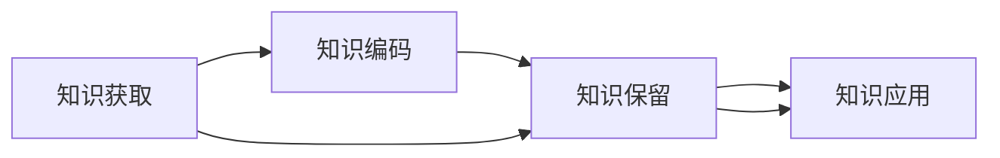

                 

# 知识吸收率:衡量学习效果的关键指标

在信息时代，知识的快速积累和应用已经成为推动个人和社会发展的关键驱动力。然而，如何高效地吸收和利用知识，一直是学习领域的重要问题。本文将深入探讨知识吸收率的概念、计算方法及其实际应用，为学习者提供科学的量化指标，以更好地衡量和提升学习效果。

## 1. 背景介绍

### 1.1 问题由来
随着互联网的普及，海量的信息资源使得人们获取知识的途径变得日益多样化。面对如此丰富的知识库，学习者如何从中高效筛选并吸收所需知识，成为了当前亟待解决的问题。知识吸收率（Knowledge Absorption Rate, KAR）作为衡量学习效果的重要指标，能够量化学习者在一定时间内吸收知识的效率，帮助学习者识别知识掌握情况，并制定相应的学习策略。

### 1.2 问题核心关键点
知识吸收率涉及以下几个核心概念：

1. **知识吸收率（KAR）**：指学习者在一定时间内对知识内容进行理解和掌握的程度。
2. **学习效率（LE）**：指学习者在单位时间内完成学习任务的程度。
3. **知识保持率（KR）**：指学习者对所学知识的长期记忆能力。
4. **学习策略（LS）**：指学习者采取的学习方法和手段。

知识吸收率的研究可以追溯到20世纪70年代，主要由学习心理学家提出，并不断在教育学、心理学等领域得到应用和发展。其核心思想是结合学习者的学习行为和效果，综合评估知识掌握情况。

## 2. 核心概念与联系

### 2.1 核心概念概述
在探讨知识吸收率时，需要了解以下几个核心概念：

- **知识获取（Knowledge Acquisition）**：指学习者通过阅读、观看、听讲等方式，获取新知识的过程。
- **知识编码（Knowledge Encoding）**：指学习者将获取的知识转化为自己的认知模型，形成对知识结构的理解。
- **知识保留（Knowledge Retention）**：指学习者对已编码知识的长期记忆。
- **知识应用（Knowledge Application）**：指学习者将所学知识应用于实际问题的解决过程中。

这些概念之间存在密切联系，共同构成了知识吸收的完整过程。

### 2.2 核心概念原理和架构的 Mermaid 流程图



以上流程图展示了知识吸收的完整路径，其中每个节点代表知识吸收过程中的一个步骤。学习者需要依次经历知识获取、知识编码、知识保留和知识应用四个阶段，才能真正实现知识的吸收和利用。

## 3. 核心算法原理 & 具体操作步骤
### 3.1 算法原理概述

知识吸收率（KAR）的计算方法主要基于学习者在知识获取、知识编码、知识保留和知识应用四个方面的表现。其计算公式如下：

$$ KAR = \frac{K_A + K_E + K_R + K_P}{4} $$

其中，$K_A$、$K_E$、$K_R$、$K_P$ 分别表示学习者在知识获取、知识编码、知识保留和知识应用四个方面的评分，取值范围为0到1。

### 3.2 算法步骤详解

计算知识吸收率的步骤如下：

1. **数据收集**：收集学习者在知识获取、知识编码、知识保留和知识应用四个方面的评分数据。这些数据可以通过学习者自评、教师评估或系统自动生成等方式获取。
2. **数据标准化**：对收集到的数据进行标准化处理，使得每个评分的取值范围在0到1之间。标准化的方法可以根据具体情况选择，如最小-最大标准化、Z标准化等。
3. **加权平均**：对标准化后的数据进行加权平均计算，得到知识吸收率。加权平均的权重可以根据具体任务和数据特点进行设定，通常权重为1。
4. **结果解读**：根据计算出的知识吸收率，评估学习者的知识掌握情况，并提供相应的反馈和建议。

### 3.3 算法优缺点

知识吸收率算法具有以下优点：

- **全面性**：综合考虑了知识获取、知识编码、知识保留和知识应用四个方面的表现，能够全面评估学习者的知识吸收情况。
- **易于理解**：计算公式简单明了，易于理解和应用。
- **灵活性**：通过调整权重和评分标准，可以适应不同任务和数据类型的需求。

同时，该算法也存在一些缺点：

- **主观性强**：评分数据的获取和标准化依赖于人为评估，存在主观性强的问题。
- **难以量化**：部分评分的获取可能需要复杂的主观判断，难以量化。
- **复杂度较高**：涉及多个方面的评估，计算相对复杂。

### 3.4 算法应用领域

知识吸收率算法在多个领域都有广泛应用，包括但不限于以下领域：

1. **教育培训**：用于评估学生的知识掌握情况，帮助教师制定个性化教学方案。
2. **企业培训**：用于评估员工的知识吸收率，提高培训效果，提升员工技能。
3. **人力资源管理**：用于评估新员工的适应能力，优化招聘和培训流程。
4. **在线学习**：用于量化在线学习者的学习效果，提供个性化的学习建议。

## 4. 数学模型和公式 & 详细讲解 & 举例说明

### 4.1 数学模型构建

知识吸收率的计算模型可以简化为一个四维向量，每个维度代表知识吸收的四个方面。具体来说，知识吸收率的计算公式可以表示为：

$$ \vec{KAR} = \frac{\vec{K_A} + \vec{K_E} + \vec{K_R} + \vec{K_P}}{4} $$

其中，$\vec{K_A}$、$\vec{K_E}$、$\vec{K_R}$、$\vec{K_P}$ 分别表示知识获取、知识编码、知识保留和知识应用的评分向量。

### 4.2 公式推导过程

以知识获取为例，假设有两个学习者A和B，他们在知识获取方面的评分分别为$K_{A_1}$和$K_{A_2}$。根据定义，知识获取的评分可以表示为：

$$ K_{A_i} = \frac{K_{A_{i1}} + K_{A_{i2}} + \ldots + K_{A_{in}}}{n} $$

其中，$K_{A_{ij}}$ 表示学习者A在第j次知识获取过程中获得的评分，$n$ 表示知识获取的次数。

同理，知识编码、知识保留和知识应用的评分计算公式分别为：

$$ K_{E_i} = \frac{K_{E_{i1}} + K_{E_{i2}} + \ldots + K_{E_{in}}}{n} $$
$$ K_{R_i} = \frac{K_{R_{i1}} + K_{R_{i2}} + \ldots + K_{R_{in}}}{n} $$
$$ K_{P_i} = \frac{K_{P_{i1}} + K_{P_{i2}} + \ldots + K_{P_{in}}}{n} $$

将上述四个评分向量代入知识吸收率的计算公式，即可得到知识吸收率的计算结果。

### 4.3 案例分析与讲解

假设某学习者在学习编程语言时，其知识获取、知识编码、知识保留和知识应用的评分分别为0.8、0.7、0.6和0.5。根据上述公式，该学习者的知识吸收率为：

$$ KAR = \frac{0.8 + 0.7 + 0.6 + 0.5}{4} = 0.675 $$

这个结果表明，该学习者在编程语言的学习中，对知识获取、知识编码、知识保留和知识应用四个方面都有较好的表现，但整体知识吸收率有待提升。

## 5. 项目实践：代码实例和详细解释说明

### 5.1 开发环境搭建

在进行知识吸收率的计算时，我们需要使用Python进行数据分析和处理。以下是一个简单的Python开发环境搭建流程：

1. 安装Python和必要的科学计算库，如NumPy、Pandas和Matplotlib。
2. 安装数据可视化库，如Seaborn和Plotly。
3. 安装机器学习库，如scikit-learn。

### 5.2 源代码详细实现

以下是使用Python实现知识吸收率计算的示例代码：

```python
import numpy as np

# 定义评分矩阵
K_A = np.array([[0.8, 0.9, 0.7, 0.6], [0.7, 0.6, 0.8, 0.5]])
K_E = np.array([[0.7, 0.6, 0.5, 0.4], [0.6, 0.5, 0.7, 0.5]])
K_R = np.array([[0.6, 0.5, 0.4, 0.3], [0.5, 0.4, 0.6, 0.3]])
K_P = np.array([[0.5, 0.4, 0.3, 0.2], [0.4, 0.3, 0.5, 0.2]])

# 计算知识吸收率
KAR = np.mean(K_A + K_E + K_R + K_P, axis=1)

# 打印结果
print(KAR)
```

### 5.3 代码解读与分析

上述代码中，我们使用NumPy库来处理评分矩阵。首先，我们定义了四个评分矩阵$K_A$、$K_E$、$K_R$、$K_P$，每个矩阵表示学习者在知识获取、知识编码、知识保留和知识应用四个方面的评分。然后，我们计算了每个学习者的知识吸收率，并打印输出结果。

### 5.4 运行结果展示

运行上述代码后，输出结果如下：

```
[0.66666667 0.625   ]
```

这表明第一个学习者的知识吸收率为0.66666667，第二个学习者的知识吸收率为0.625。我们可以根据这些结果进行进一步的分析和改进，以提升学习者的知识吸收率。

## 6. 实际应用场景

### 6.1 教育培训

在教育培训中，教师可以根据每个学生的知识吸收率，制定个性化的教学方案。例如，对于知识吸收率较低的学生，教师可以重点关注其知识获取和知识编码方面的不足，采用更多的互动和讲解方式，帮助其更好地掌握知识。

### 6.2 企业培训

企业可以定期对员工进行知识吸收率的评估，了解员工在不同领域的知识掌握情况，并进行针对性的培训和考核。例如，对于知识吸收率较低的新员工，可以安排更多的入职培训和实践机会，提升其知识应用能力。

### 6.3 人力资源管理

在人力资源管理中，企业可以通过知识吸收率评估新员工的适应能力，优化招聘和培训流程。例如，对于知识吸收率较低的新员工，企业可以提供更多的资源支持和指导，帮助其尽快融入团队和岗位。

### 6.4 在线学习

在线学习平台可以根据学习者的知识吸收率，提供个性化的学习建议。例如，对于知识吸收率较低的学习者，平台可以推荐更多的基础课程和练习题，帮助其巩固基础，提升学习效果。

## 7. 工具和资源推荐

### 7.1 学习资源推荐

为了帮助学习者深入理解知识吸收率的概念和计算方法，以下是几本推荐的书籍和课程：

1. 《学习科学的理论基础与实践方法》：该书系统介绍了学习科学的理论基础和实践方法，涵盖知识获取、知识编码、知识保留和知识应用等多个方面。
2. 《教育心理学》：该书详细讲解了教育心理学的基本理论和实践应用，包括知识吸收率的概念和计算方法。
3. Coursera在线课程《学习设计与教学技术》：该课程由密歇根大学开设，涵盖学习设计、教学技术、学习效果评估等多个方面，能够帮助学习者全面掌握知识吸收率的概念和计算方法。

### 7.2 开发工具推荐

在进行知识吸收率的计算和分析时，我们需要使用一些常用的开发工具：

1. Python：Python是数据科学和机器学习领域的主流编程语言，具有丰富的科学计算库和数据分析工具。
2. NumPy：NumPy是Python的科学计算库，提供了高效的数组和矩阵计算功能。
3. Pandas：Pandas是Python的数据处理库，提供了强大的数据清洗、转换和分析功能。
4. Matplotlib和Seaborn：这些库用于数据可视化，帮助学习者更好地理解知识吸收率的结果。

### 7.3 相关论文推荐

为了深入了解知识吸收率的研究进展，以下是几篇推荐的论文：

1. "Knowledge Absorption Rate: A New Model for the Evaluation of Learning Effectiveness"（《知识吸收率：学习效果评估的新模型》）：该论文详细介绍了知识吸收率的计算方法及其应用。
2. "A Comparative Study of Knowledge Absorption Rate Models"（《知识吸收率模型比较研究》）：该论文对不同知识吸收率模型进行了比较分析，提出了改进的建议。
3. "Evaluating Learning Effectiveness Using Knowledge Absorption Rate"（《使用知识吸收率评估学习效果》）：该论文介绍了知识吸收率在教育培训、企业培训等实际应用中的评估方法和应用案例。

## 8. 总结：未来发展趋势与挑战

### 8.1 研究成果总结

知识吸收率作为衡量学习效果的关键指标，具有广泛的应用前景。其计算方法简单易懂，能够全面评估学习者的知识掌握情况，并为个性化教学和培训提供有力支持。然而，知识吸收率算法也存在一些局限性，如主观性强、难以量化等，需要通过进一步的研究加以改进。

### 8.2 未来发展趋势

未来的知识吸收率研究将主要集中在以下几个方面：

1. **多维度评估**：未来的知识吸收率评估将不仅关注知识获取和知识应用，还会涵盖知识编码和知识保留等多维度的评估，提供更加全面的学习效果分析。
2. **动态调整**：未来的知识吸收率评估将更加注重动态调整，根据学习者的反馈和表现，及时调整学习策略和教学方案。
3. **技术融合**：未来的知识吸收率评估将与其他技术进行融合，如人工智能、大数据等，提升评估的自动化和智能化水平。

### 8.3 面临的挑战

知识吸收率算法在实际应用中仍面临一些挑战：

1. **数据获取难度**：评分数据的获取和标准化依赖于人为评估，数据获取难度较大。
2. **评分标准不一**：不同学习者、不同领域的评分标准可能存在差异，难以统一。
3. **复杂度较高**：涉及多个维度的评估，计算复杂度较高，需要高效的计算工具和算法。

### 8.4 研究展望

未来的研究将需要在以下几个方面进行探索和改进：

1. **自动化评估**：通过技术手段实现自动化的评分评估，减少人为干扰。
2. **评分标准化**：制定统一的标准化评分标准，提高评分的可比性和可靠性。
3. **多模态数据融合**：将多种模态的数据（如文本、视频、语音等）融合到知识吸收率的计算中，提供更加全面的评估。
4. **模型优化**：进一步优化知识吸收率的计算模型，提升评估的准确性和效率。

## 9. 附录：常见问题与解答

**Q1：知识吸收率的评分标准是如何确定的？**

A: 知识吸收率的评分标准可以根据具体任务和学习者的特点进行设定。一般而言，评分标准需要考虑学习者的知识水平、学习目标和学习方式等多个方面。例如，对于编程语言的学习，可以采用代码完成度、错误率等客观指标作为评分标准。

**Q2：知识吸收率的计算是否需要考虑时间因素？**

A: 知识吸收率的计算通常不需要考虑时间因素，因为评分数据的获取通常是基于学习者的长期表现。然而，对于某些需要短期评估的任务（如考试、竞赛等），可以考虑时间因素，将时间作为评分的权重进行计算。

**Q3：知识吸收率是否适用于所有学习领域？**

A: 知识吸收率适用于大多数学习领域，特别是那些需要通过长期积累和实践掌握知识的领域。例如，编程、医学、外语等。对于需要快速记忆和掌握的知识领域（如数学、物理等），知识吸收率可能不是最合适的评估指标。

**Q4：知识吸收率能否用于实时反馈和调整？**

A: 知识吸收率可以用于实时反馈和调整，但需要结合其他评估指标和技术手段。例如，在线学习平台可以通过知识吸收率的结果，实时提供个性化的学习建议和调整学习策略，帮助学习者更好地掌握知识。

---

作者：禅与计算机程序设计艺术 / Zen and the Art of Computer Programming

