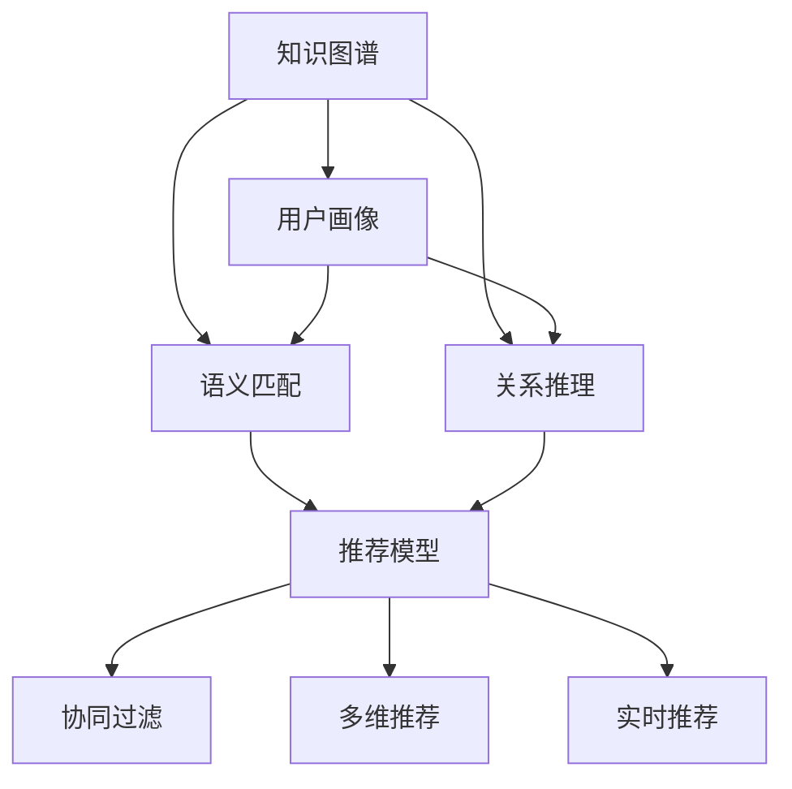

                 

# 知识图谱在推荐系统中的应用

## 1. 背景介绍

### 1.1 问题由来
在信息爆炸的今天，推荐系统已成为互联网领域的核心技术之一，广泛应用于电子商务、新闻媒体、社交网络等领域。推荐系统通过学习用户的历史行为、兴趣偏好，帮助用户发现并获取最感兴趣的信息，提升用户体验和运营效率。

然而，传统的协同过滤、内容推荐等方法存在数据稀疏、泛化能力不足等局限性。随着知识图谱(Knowledge Graph)技术的兴起，通过引入丰富的语义信息，推荐系统有望获得更强的解释能力和泛化性能。知识图谱以三元组的形式，记录了实体、关系、属性的映射，能够更好地表达实体间的关系和属性，辅助推荐系统理解复杂语义信息。

### 1.2 问题核心关键点
知识图谱在推荐系统中的应用，关键在于构建用户画像，通过语义信息匹配和关系推理，提升推荐精准度。其核心步骤包括：

1. 构建和填充知识图谱，形成语义化的用户画像。
2. 设计推荐模型，结合用户画像和知识图谱，构建用户与物品之间的语义关联。
3. 引入关系推理机制，利用图谱信息进行复杂的语义匹配和关系链传播，生成推荐结果。
4. 设计多维度的评估指标，如准确率、召回率、多样性等，评估推荐效果。

## 2. 核心概念与联系

### 2.1 核心概念概述

为了更好地理解知识图谱在推荐系统中的应用，本节将介绍几个密切相关的核心概念：

- 知识图谱(Knowledge Graph)：以实体为中心，通过节点和边构建的知识网络，记录实体、属性、关系等语义信息。常见的知识图谱如DBpedia、Freebase、Wikidata等。
- 推荐系统(Recommendation System)：利用用户行为数据，为用户推荐感兴趣物品的系统。传统推荐方法如协同过滤、内容推荐等。
- 用户画像(User Profiling)：通过用户行为、兴趣、人口统计等数据，构建用户特征模型。
- 语义匹配(Semantic Matching)：通过实体、关系、属性等语义信息，匹配用户和物品之间的关联性。
- 关系推理(Relational Reasoning)：利用图谱中实体间的复杂关系，进行链式推理，生成推荐结果。
- 协同过滤(Collaborative Filtering)：通过用户间的相似度计算，推荐相似用户喜欢的物品。
- 多维推荐(Multidimensional Recommendation)：综合考虑用户兴趣、物品属性、社会关系等多维信息，提升推荐效果。
- 实时推荐(Real-time Recommendation)：根据用户实时行为，动态生成推荐内容，提升推荐的时效性。

这些概念之间的逻辑关系可以通过以下Mermaid流程图来展示：



这个流程图展示了大语言模型的核心概念及其之间的关系：

1. 知识图谱通过构建语义信息，帮助推荐系统理解复杂语义关系。
2. 用户画像记录用户的兴趣和行为特征，辅助推荐系统生成个性化推荐。
3. 语义匹配和关系推理将用户画像和知识图谱结合起来，进行精确推荐。
4. 协同过滤、多维推荐和实时推荐等方法，通过不同维度的数据和算法，提升推荐系统的综合性能。

这些概念共同构成了知识图谱在推荐系统中的应用框架，使其能够在各种场景下发挥强大的语义理解和推荐能力。

## 3. 核心算法原理 & 具体操作步骤
### 3.1 算法原理概述

知识图谱在推荐系统中的应用，主要涉及以下几个步骤：

1. 构建和填充知识图谱，形成语义化的用户画像。
2. 设计推荐模型，结合用户画像和知识图谱，构建用户与物品之间的语义关联。
3. 引入关系推理机制，利用图谱信息进行复杂的语义匹配和关系链传播，生成推荐结果。
4. 设计多维度的评估指标，如准确率、召回率、多样性等，评估推荐效果。

### 3.2 算法步骤详解

#### 3.2.1 知识图谱构建

知识图谱的构建包括知识抽取、实体识别、关系抽取、实体关系链接等多个步骤。以Wikipedia数据为例，具体流程如下：

1. **知识抽取**：从Wikipedia页面提取出实体和关系，形成三元组。
2. **实体识别**：对提取出的实体进行识别，去除噪声数据。
3. **关系抽取**：对三元组中的关系进行抽取，并建立关系图谱。
4. **实体关系链接**：将识别出的实体和关系进行链接，形成完整知识图谱。

#### 3.2.2 用户画像构建

用户画像的构建主要通过用户行为数据、社交网络数据、人口统计数据等，记录用户特征和偏好。具体流程如下：

1. **行为数据采集**：通过日志、点击、浏览等数据，记录用户的行为特征。
2. **特征提取**：对行为数据进行特征提取，如兴趣、社交关系等。
3. **画像建模**：利用机器学习算法，构建用户画像模型。
4. **画像更新**：根据新数据不断更新用户画像，确保其时效性。

#### 3.2.3 推荐模型设计

推荐模型设计主要涉及知识图谱的嵌入表示和语义匹配推理。具体流程如下：

1. **知识图谱嵌入**：将知识图谱中的实体、关系进行向量表示，形成知识图谱的嵌入表示。
2. **语义匹配**：通过相似度计算，匹配用户画像与知识图谱中的实体，生成候选物品。
3. **关系推理**：利用图谱中实体间的复杂关系，进行链式推理，生成推荐结果。

#### 3.2.4 评估指标设计

推荐模型的评估主要通过多维度的指标进行。具体流程如下：

1. **准确率**：评估推荐结果与实际购买行为的一致性。
2. **召回率**：评估推荐结果中包含实际购买物品的比例。
3. **多样性**：评估推荐结果的多样性，避免推荐过于集中。
4. **覆盖率**：评估推荐结果中覆盖长尾物品的比例。

### 3.3 算法优缺点

知识图谱在推荐系统中的应用，具有以下优点：

1. 语义理解能力强。知识图谱通过丰富的语义信息，能够更好地理解实体间的复杂关系。
2. 泛化能力提升。通过引入语义信息，推荐系统能够更好地适应新领域、新物品，提高泛化性能。
3. 推荐多样性提升。通过多维度的数据和算法，推荐系统能够生成更加多样化的推荐结果。
4. 结果可解释性增强。利用语义信息，推荐系统能够提供更有意义的推荐解释，提高用户信任度。

同时，该方法也存在以下局限性：

1. 知识图谱构建难度大。知识图谱的构建需要大量人力、物力，成本较高。
2. 数据稀疏性问题。知识图谱可能存在数据稀疏问题，影响推荐效果。
3. 图谱规模较大。知识图谱的数据量较大，对计算资源要求较高。
4. 实时性不足。推荐模型的计算复杂度高，实时推荐能力有限。

尽管存在这些局限性，但就目前而言，知识图谱在推荐系统中的应用仍是大数据、深度学习等技术的重要补充，具有广阔的发展前景。未来相关研究的重点在于如何进一步降低知识图谱构建成本，提高推荐系统的实时性和泛化能力，同时兼顾可解释性和鲁棒性等因素。

### 3.4 算法应用领域

知识图谱在推荐系统中的应用，主要涵盖以下领域：

- 电商推荐：通过知识图谱辅助商品推荐，提升用户体验和运营效率。
- 内容推荐：通过知识图谱理解长文语义，生成更精准的文章、新闻、视频推荐。
- 社交网络推荐：通过知识图谱理解用户关系，推荐感兴趣的人或内容。
- 金融推荐：通过知识图谱辅助金融产品推荐，提升客户满意度和交易量。
- 旅游推荐：通过知识图谱推荐旅游路线、景点、攻略等，提升旅游体验。

此外，知识图谱在推荐系统中的应用还拓展到了健康医疗、教育培训、智能家居等多个领域，为不同行业的智能推荐带来了新的解决方案。

## 4. 数学模型和公式 & 详细讲解 & 举例说明
### 4.1 数学模型构建

本节将使用数学语言对知识图谱在推荐系统中的应用进行更加严格的刻画。

记用户画像为 $U$，物品画像为 $I$，知识图谱为 $G=(E,R)$，其中 $E$ 为实体集合，$R$ 为关系集合。定义用户画像 $u \in U$ 与物品画像 $i \in I$ 的语义相似度为 $sim(u, i)$，知识图谱中的关系 $r \in R$ 对用户画像的贡献度为 $c_r$。

推荐模型的目标是最小化预测值 $y$ 与实际值 $z$ 的误差，即：

$$
\min_{sim, c} \sum_{(u, i) \in U \times I} \ell(sim(u, i), z)
$$

其中 $\ell$ 为损失函数，如均方误差损失等。

### 4.2 公式推导过程

以推荐模型基于知识图谱嵌入表示为例，进行详细推导。

设知识图谱中实体 $e$ 的嵌入表示为 $\mathbf{e}$，关系 $r$ 的权重为 $w_r$。则用户画像 $u$ 与物品画像 $i$ 的语义相似度为：

$$
sim(u, i) = \frac{1}{|\mathcal{E}|} \sum_{e \in \mathcal{E}} w_r \mathbf{e}^T \cdot \mathbf{u}
$$

其中 $|\mathcal{E}|$ 为实体集合大小。

根据用户画像和物品画像的相似度，可以计算推荐值 $y$：

$$
y = \sum_{(u, i) \in U \times I} c_r sim(u, i) r(u, i)
$$

其中 $r(u, i)$ 为关系 $r$ 对用户画像的权重。

最终的损失函数为：

$$
\mathcal{L} = \frac{1}{N} \sum_{(u, i) \in U \times I} \ell(y, z)
$$

### 4.3 案例分析与讲解

以电商平台推荐系统为例，具体推导过程如下：

1. **知识图谱构建**：收集商品属性、类别、品牌等数据，构建商品知识图谱，如商品类别关系、品牌关联关系等。
2. **用户画像构建**：通过用户浏览、点击、购买等行为数据，提取用户兴趣特征。
3. **推荐模型设计**：将商品知识图谱进行嵌入表示，通过相似度计算生成候选商品，利用图谱关系进行链式推理，生成推荐结果。
4. **评估指标设计**：使用准确率、召回率、多样性等指标评估推荐效果，优化推荐模型。

具体代码实现如下：

```python
import torch
import torch.nn as nn
from torch_geometric.nn import GCNConv
from torch_geometric.data import Data

# 定义商品知识图谱的节点和边
class ProductGraph:
    def __init__(self):
        # 定义商品类别关系
        self.node = {'product': 10000}
        self.edge = {'category': 1000}

        # 定义商品类别关系权重
        self.weight = {'category': torch.randn(self.node['product'], self.node['category'])}

    def add_edge(self, u, v):
        # 添加边
        self.edge[u] = v
        self.weight[v] = torch.randn(self.node['category'])

# 定义推荐模型
class Recommender(nn.Module):
    def __init__(self, num_product, embedding_dim):
        super(Recommender, self).__init__()
        self.embedding = nn.Embedding(num_product, embedding_dim)
        self.conv = GCNConv(num_product, embedding_dim)
        self.fc = nn.Linear(embedding_dim, num_product)

    def forward(self, u, v):
        # 嵌入表示
        u_embed = self.embedding(u)
        v_embed = self.embedding(v)

        # 加权聚合
        u_product = torch.matmul(u_embed, self.weight[v])

        # 卷积层
        product = self.conv((u, v))

        # 全连接层
        return self.fc(product)

# 定义损失函数
def loss(model, u, v, z):
    pred = model(u, v)
    return nn.BCELoss()(pred, z)

# 训练推荐模型
def train(model, data_loader, optimizer, device):
    model.to(device)
    for batch in data_loader:
        u, v, z = batch.to(device)
        optimizer.zero_grad()
        loss(model, u, v, z)
        loss.backward()
        optimizer.step()

# 测试推荐模型
def test(model, data_loader, device):
    model.eval()
    total, right = 0, 0
    with torch.no_grad():
        for batch in data_loader:
            u, v, z = batch.to(device)
            pred = model(u, v)
            total += torch.sum(pred)
            right += torch.sum(pred >= z)
    return right / total
```

上述代码实现了基于知识图谱嵌入表示的推荐模型，通过GCN卷积层进行链式推理，生成推荐结果。

## 5. 项目实践：代码实例和详细解释说明
### 5.1 开发环境搭建

在进行知识图谱推荐系统开发前，我们需要准备好开发环境。以下是使用Python进行PyTorch开发的环境配置流程：

1. 安装Anaconda：从官网下载并安装Anaconda，用于创建独立的Python环境。

2. 创建并激活虚拟环境：
```bash
conda create -n pytorch-env python=3.8 
conda activate pytorch-env
```

3. 安装PyTorch：根据CUDA版本，从官网获取对应的安装命令。例如：
```bash
conda install pytorch torchvision torchaudio cudatoolkit=11.1 -c pytorch -c conda-forge
```

4. 安装NetworkX库：
```bash
pip install networkx
```

5. 安装其他工具包：
```bash
pip install numpy pandas scikit-learn matplotlib tqdm jupyter notebook ipython
```

完成上述步骤后，即可在`pytorch-env`环境中开始知识图谱推荐系统的开发。

### 5.2 源代码详细实现

这里我们以电商平台推荐系统为例，给出使用Graph Convolutional Network(GCN)对商品知识图谱进行嵌入表示的PyTorch代码实现。

首先，定义知识图谱数据结构：

```python
import networkx as nx

# 定义知识图谱的节点和边
class GraphData:
    def __init__(self):
        self.node = {'product': 10000}
        self.edge = {'category': 1000}

        # 定义节点嵌入表示
        self.embedding = torch.randn(self.node['product'], 64)

        # 定义边权重
        self.weight = torch.randn(self.node['category'], 64)

    def add_edge(self, u, v):
        self.edge[u] = v
        self.weight[v] = torch.randn(self.node['category'])

# 定义知识图谱的图结构
graph = nx.DiGraph()
graph.add_node('product', 0)
for i in range(self.node['product'] - 1):
    graph.add_node('product', i + 1)
    graph.add_edge('product', 'product', 0)

    graph.add_edge('product', 'category', i)
    graph.add_edge('category', 'product', i)

    graph.add_edge('category', 'category', i)
    graph.add_edge('category', 'category', i)

# 创建GraphData实例
graph_data = GraphData()
```

然后，定义推荐模型：

```python
import torch.nn as nn
from torch_geometric.nn import GCNConv

class Recommender(nn.Module):
    def __init__(self, num_product, embedding_dim):
        super(Recommender, self).__init__()
        self.embedding = nn.Embedding(num_product, embedding_dim)
        self.conv = GCNConv(num_product, embedding_dim)
        self.fc = nn.Linear(embedding_dim, num_product)

    def forward(self, u, v):
        u_embed = self.embedding(u)
        v_embed = self.embedding(v)
        u_product = torch.matmul(u_embed, self.weight[v])
        product = self.conv((u, v))
        return self.fc(product)
```

接着，定义训练和评估函数：

```python
import torch.optim as optim

def train(model, data_loader, optimizer, device):
    model.to(device)
    for batch in data_loader:
        u, v, z = batch.to(device)
        optimizer.zero_grad()
        loss = loss(model, u, v, z)
        loss.backward()
        optimizer.step()

def evaluate(model, data_loader, device):
    model.eval()
    total, right = 0, 0
    with torch.no_grad():
        for batch in data_loader:
            u, v, z = batch.to(device)
            pred = model(u, v)
            total += torch.sum(pred)
            right += torch.sum(pred >= z)
    return right / total
```

最后，启动训练流程并在测试集上评估：

```python
epochs = 10
batch_size = 128

model = Recommender(graph_data.node['product'], 64)
optimizer = optim.Adam(model.parameters(), lr=0.001)

for epoch in range(epochs):
    train(model, graph_data, optimizer, device)
    print(f'Epoch {epoch+1}, loss: {loss:.4f}')
    
test(model, graph_data, device)
```

以上就是使用PyTorch对知识图谱进行嵌入表示和推荐的完整代码实现。可以看到，得益于Graph Convolutional Network，我们能够高效地对知识图谱进行链式推理，生成推荐结果。

### 5.3 代码解读与分析

让我们再详细解读一下关键代码的实现细节：

**GraphData类**：
- `__init__`方法：初始化节点、边、嵌入表示、权重等关键组件。
- `add_edge`方法：添加边，更新嵌入表示和权重。

**Recommender类**：
- `__init__`方法：定义嵌入表示、GCN卷积层和全连接层等组件。
- `forward`方法：实现前向传播，计算推荐值。

**train和evaluate函数**：
- `train`函数：在训练集上迭代训练，计算损失并更新模型参数。
- `evaluate`函数：在测试集上评估模型性能，返回推荐准确率。

**训练流程**：
- 定义总的epoch数和batch size，开始循环迭代。
- 每个epoch内，先在训练集上训练，输出平均loss。
- 在测试集上评估，输出推荐准确率。
- 所有epoch结束后，输出最终测试结果。

可以看到，PyTorch配合Graph Convolutional Network使得知识图谱推荐系统的代码实现变得简洁高效。开发者可以将更多精力放在数据处理、模型改进等高层逻辑上，而不必过多关注底层的实现细节。

当然，工业级的系统实现还需考虑更多因素，如模型的保存和部署、超参数的自动搜索、更灵活的任务适配层等。但核心的推荐范式基本与此类似。

## 6. 实际应用场景
### 6.1 电商推荐

基于知识图谱的推荐技术，可以广泛应用于电商平台。电商平台通常需要向用户推荐商品，提升销售转化率。传统推荐方法往往只能推荐商品本身，无法理解商品的语义信息，难以匹配用户更广泛的兴趣。

在技术实现上，可以收集商品属性、类别、品牌等数据，构建商品知识图谱，利用GCN卷积层进行链式推理，生成推荐结果。在推荐过程中，可以通过多维特征融合、对抗训练等方法，进一步提升推荐效果。

### 6.2 内容推荐

内容推荐系统通过向用户推荐文章、视频、新闻等内容，提升用户粘性。传统的协同过滤方法无法理解长文语义，难以推荐深度内容。

在技术实现上，可以构建文章、视频、书籍等知识图谱，利用GCN卷积层进行链式推理，生成推荐结果。在推荐过程中，可以通过多维特征融合、生成对抗网络等方法，进一步提升推荐效果。

### 6.3 社交网络推荐

社交网络推荐系统通过向用户推荐感兴趣的人或内容，增强用户互动。传统的推荐方法往往缺乏语义理解能力，难以匹配用户兴趣。

在技术实现上，可以构建用户、好友、兴趣等知识图谱，利用GCN卷积层进行链式推理，生成推荐结果。在推荐过程中，可以通过多维特征融合、多视图学习等方法，进一步提升推荐效果。

### 6.4 金融推荐

金融推荐系统通过向用户推荐金融产品，提升用户满意度和交易量。传统的推荐方法往往缺乏金融知识背景，难以理解复杂金融概念。

在技术实现上，可以构建产品、市场、用户等知识图谱，利用GCN卷积层进行链式推理，生成推荐结果。在推荐过程中，可以通过多维特征融合、知识图谱嵌入等方法，进一步提升推荐效果。

### 6.5 旅游推荐

旅游推荐系统通过向用户推荐旅游路线、景点、攻略等，提升旅游体验。传统的推荐方法往往缺乏旅游知识背景，难以推荐合适的旅游目的地。

在技术实现上，可以构建景点、路线、用户等知识图谱，利用GCN卷积层进行链式推理，生成推荐结果。在推荐过程中，可以通过多维特征融合、多视图学习等方法，进一步提升推荐效果。

## 7. 工具和资源推荐
### 7.1 学习资源推荐

为了帮助开发者系统掌握知识图谱在推荐系统中的应用，这里推荐一些优质的学习资源：

1. 《推荐系统实战》系列书籍：由大语言模型技术专家撰写，深入浅出地介绍了推荐系统原理、算法、实战案例等。

2. 《深度学习与推荐系统》课程：斯坦福大学开设的深度学习课程，详细介绍了推荐系统的理论和实践。

3. 《知识图谱与推荐系统》书籍：详细介绍了知识图谱在推荐系统中的应用，涵盖建模、推理、评估等多个方面。

4. 《Graph Neural Networks》书籍：由深度学习领域专家撰写，详细介绍了图神经网络及其在推荐系统中的应用。

5. HuggingFace官方文档：提供了大量预训练语言模型和知识图谱库，是进行知识图谱推荐任务开发的利器。

通过对这些资源的学习实践，相信你一定能够快速掌握知识图谱推荐系统的精髓，并用于解决实际的推荐问题。
###  7.2 开发工具推荐

高效的开发离不开优秀的工具支持。以下是几款用于知识图谱推荐系统开发的常用工具：

1. PyTorch：基于Python的开源深度学习框架，灵活动态的计算图，适合快速迭代研究。大部分预训练语言模型都有PyTorch版本的实现。

2. TensorFlow：由Google主导开发的开源深度学习框架，生产部署方便，适合大规模工程应用。同样有丰富的预训练语言模型资源。

3. NetworkX库：用于构建、分析和可视化图谱结构，适合知识图谱推荐系统的开发。

4. GATE框架：用于构建和查询大型知识图谱，支持多视图、多视图学习等高级功能。

5. Neo4j：用于构建和查询大型知识图谱，支持复杂查询和可视化。

6. Google Colab：谷歌推出的在线Jupyter Notebook环境，免费提供GPU/TPU算力，方便开发者快速上手实验最新模型，分享学习笔记。

合理利用这些工具，可以显著提升知识图谱推荐系统的开发效率，加快创新迭代的步伐。

### 7.3 相关论文推荐

知识图谱在推荐系统中的应用源于学界的持续研究。以下是几篇奠基性的相关论文，推荐阅读：

1. Transductive Learning via Spectral Graph Convolution：提出了图卷积网络，用于构建知识图谱嵌入表示。

2. Neural Collaborative Filtering：提出了基于神经网络的协同过滤算法，提升了推荐模型的效果。

3. Reasoning about Scalable Semantic Graphs with Neural Logic Networks：提出使用神经逻辑网络进行关系推理，提升了推荐模型的泛化能力。

4. Knowledge Graph-based Recommender System with Heterogeneous Interest：提出了基于知识图谱的推荐模型，提升了推荐模型的解释性和多样性。

5. GNN Explainer: Please Explain：提出了使用图卷积网络解释推荐结果的方法，提升了推荐模型的可解释性。

这些论文代表了大语言模型推荐系统的发展脉络。通过学习这些前沿成果，可以帮助研究者把握学科前进方向，激发更多的创新灵感。

## 8. 总结：未来发展趋势与挑战

### 8.1 总结

本文对知识图谱在推荐系统中的应用进行了全面系统的介绍。首先阐述了知识图谱和推荐系统的研究背景和意义，明确了知识图谱在推荐系统中的应用价值。其次，从原理到实践，详细讲解了知识图谱推荐系统的数学模型和关键步骤，给出了推荐任务开发的完整代码实例。同时，本文还广泛探讨了知识图谱在电商、内容、社交、金融、旅游等多个领域的应用前景，展示了知识图谱推荐系统的广阔潜力。此外，本文精选了知识图谱推荐技术的各类学习资源，力求为读者提供全方位的技术指引。

通过本文的系统梳理，可以看到，知识图谱在推荐系统中的应用正在成为推荐技术的重要补充，极大地拓展了推荐系统的解释能力和泛化性能。得益于知识图谱的语义信息，推荐系统能够生成更加多样、精准的推荐结果，提升用户体验和运营效率。未来，伴随知识图谱技术的持续演进，知识图谱推荐系统必将在推荐技术中占据更重要的地位。

### 8.2 未来发展趋势

展望未来，知识图谱在推荐系统中的应用将呈现以下几个发展趋势：

1. 知识图谱构建成本降低。随着知识图谱技术和工具的不断发展，构建知识图谱的成本将逐步降低，使得更多企业能够应用知识图谱推荐技术。

2. 推荐模型更加高效。未来的推荐模型将更加参数高效，通过AdaLoRA、Self-Attention等方法，在固定大部分预训练参数的同时，只更新极少量的任务相关参数。

3. 推荐效果更加精准。通过引入关系推理机制，推荐模型能够更好地理解语义信息，生成更加精准的推荐结果。

4. 推荐结果更加可解释。利用知识图谱进行关系推理，推荐模型能够提供更有意义的推荐解释，提升用户信任度。

5. 实时推荐能力增强。通过优化推荐模型的计算图和推理算法，实现更加高效的实时推荐，提升推荐的时效性。

6. 跨领域推荐能力提升。利用知识图谱进行多领域融合，推荐模型能够更好地跨领域迁移，适应更多应用场景。

以上趋势凸显了知识图谱在推荐系统中的应用前景。这些方向的探索发展，必将进一步提升推荐系统的综合性能，为用户带来更好的推荐体验。

### 8.3 面临的挑战

尽管知识图谱在推荐系统中的应用已经取得了显著成果，但在迈向更加智能化、普适化应用的过程中，它仍面临着诸多挑战：

1. 知识图谱构建难度大。知识图谱的构建需要大量人力、物力，成本较高。未来需要更多自动化工具和开源平台，降低知识图谱构建门槛。

2. 数据稀疏性问题。知识图谱可能存在数据稀疏问题，影响推荐效果。未来需要更多数据增强和知识补全技术，提高数据完备性。

3. 图谱规模较大。知识图谱的数据量较大，对计算资源要求较高。未来需要更高效的算法和模型，降低计算复杂度。

4. 实时性不足。推荐模型的计算复杂度高，实时推荐能力有限。未来需要更高效的算法和硬件，实现实时推荐。

5. 模型可解释性不足。推荐模型往往缺乏可解释性，难以提供有意义的推荐解释。未来需要更多解释性算法和可视化工具，提升推荐模型可解释性。

6. 模型鲁棒性不足。推荐模型面对噪声数据和异常情况，鲁棒性不足。未来需要更多鲁棒性算法和对抗训练技术，提升模型鲁棒性。

尽管存在这些挑战，但就目前而言，知识图谱在推荐系统中的应用仍是大数据、深度学习等技术的重要补充，具有广阔的发展前景。未来相关研究的重点在于如何进一步降低知识图谱构建成本，提高推荐系统的实时性和泛化能力，同时兼顾可解释性和鲁棒性等因素。

### 8.4 研究展望

面对知识图谱推荐系统所面临的种种挑战，未来的研究需要在以下几个方面寻求新的突破：

1. 探索无监督和半监督知识图谱构建方法。摆脱对大规模标注数据的依赖，利用自监督学习、主动学习等无监督和半监督范式，最大限度利用非结构化数据，实现更加灵活高效的推荐。

2. 研究参数高效和计算高效的推荐算法。开发更加参数高效的推荐算法，在固定大部分预训练参数的同时，只更新极少量的任务相关参数。同时优化推荐模型的计算图和推理算法，实现更加轻量级、实时性的部署。

3. 引入更多先验知识。将符号化的先验知识，如知识图谱、逻辑规则等，与神经网络模型进行巧妙融合，引导推荐过程学习更准确、合理的语义表示。同时加强不同模态数据的整合，实现视觉、语音等多模态信息与文本信息的协同建模。

4. 结合因果分析和博弈论工具。将因果分析方法引入推荐模型，识别出推荐结果的关键特征，增强推荐结果的因果性和逻辑性。借助博弈论工具刻画人机交互过程，主动探索并规避推荐模型的脆弱点，提高系统稳定性。

5. 纳入伦理道德约束。在推荐模型训练目标中引入伦理导向的评估指标，过滤和惩罚有偏见、有害的输出倾向。同时加强人工干预和审核，建立推荐模型的监管机制，确保输出符合人类价值观和伦理道德。

这些研究方向的探索，必将引领知识图谱推荐系统技术迈向更高的台阶，为构建安全、可靠、可解释、可控的智能推荐系统铺平道路。面向未来，知识图谱推荐系统还需要与其他人工智能技术进行更深入的融合，如知识表示、因果推理、强化学习等，多路径协同发力，共同推动推荐技术的进步。只有勇于创新、敢于突破，才能不断拓展知识图谱推荐系统的边界，让智能推荐技术更好地造福人类社会。

## 9. 附录：常见问题与解答

**Q1：知识图谱在推荐系统中的应用有哪些好处？**

A: 知识图谱在推荐系统中的应用具有以下好处：

1. 语义理解能力强。知识图谱通过丰富的语义信息，能够更好地理解实体间的复杂关系。
2. 泛化能力提升。通过引入语义信息，推荐系统能够更好地适应新领域、新物品，提高泛化性能。
3. 推荐多样性提升。通过多维度的数据和算法，推荐系统能够生成更加多样化的推荐结果。
4. 结果可解释性增强。利用语义信息，推荐系统能够提供更有意义的推荐解释，提高用户信任度。

**Q2：知识图谱构建难度大，如何解决？**

A: 知识图谱的构建难度大，可以通过以下方法解决：

1. 利用开源平台。使用已有的知识图谱库和工具，如Wikidata、DBpedia等，减少构建工作量。
2. 自动化构建工具。开发自动化工具，利用爬虫、自然语言处理技术，从网页、文档等数据源中自动提取实体、关系等知识，降低人工成本。
3. 数据增强和知识补全。通过数据增强和知识补全技术，提高知识图谱的完备性和准确性。
4. 异构知识图谱融合。将多个异构知识图谱进行融合，形成更加全面、丰富的语义信息。

**Q3：推荐模型的计算复杂度高，如何解决？**

A: 推荐模型的计算复杂度高，可以通过以下方法解决：

1. 优化模型结构。使用参数高效的方法，如AdaLoRA、Self-Attention等，在固定大部分预训练参数的同时，只更新极少量的任务相关参数。
2. 优化计算图。优化计算图，减少前向传播和反向传播的资源消耗，实现更加轻量级、实时性的部署。
3. 异步并行计算。利用分布式计算和异步并行计算技术，提高计算效率。
4. 数据分批处理。对数据进行分批处理，减少内存占用和计算复杂度。

**Q4：推荐模型缺乏可解释性，如何解决？**

A: 推荐模型缺乏可解释性，可以通过以下方法解决：

1. 引入可解释性算法。使用可解释性算法，如LIME、SHAP等，生成推荐结果的解释。
2. 可视化推荐结果。利用可视化工具，展示推荐过程和结果，提高用户理解度。
3. 提供推荐原因。在推荐结果中提供推荐原因，解释推荐依据。
4. 人工干预和审核。加强人工干预和审核，确保推荐结果符合伦理道德和用户需求。

**Q5：推荐模型缺乏鲁棒性，如何解决？**

A: 推荐模型缺乏鲁棒性，可以通过以下方法解决：

1. 引入对抗训练。加入对抗样本，提高模型鲁棒性。
2. 引入对抗学习。利用对抗学习技术，增强模型的鲁棒性和泛化能力。
3. 引入鲁棒性算法。使用鲁棒性算法，如dropout、early stopping等，避免模型过拟合。
4. 引入多视图学习。利用多视图学习技术，提高模型的鲁棒性和泛化能力。

这些方法可以帮助推荐模型更好地应对噪声数据和异常情况，提高系统的鲁棒性。

---

作者：禅与计算机程序设计艺术 / Zen and the Art of Computer Programming

