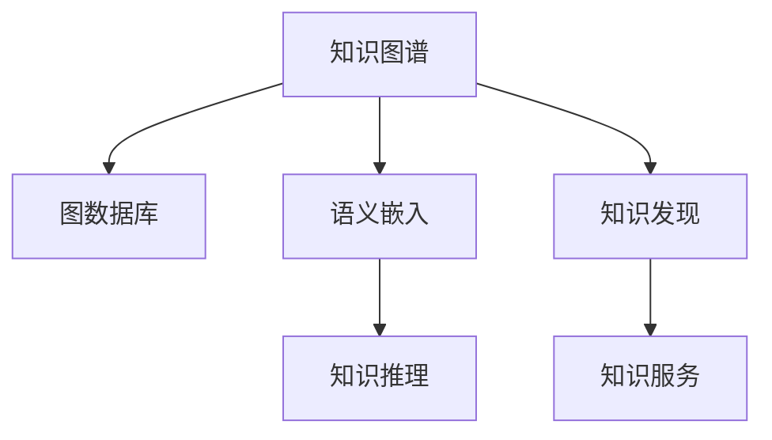

                 

# 知识图谱：构建和应用结构化知识

> 关键词：知识图谱,结构化知识,图数据库,深度学习,语义嵌入,知识推理,知识发现

## 1. 背景介绍

### 1.1 问题由来

在信息爆炸的今天，互联网、社交媒体、新闻报道等各类数据源每天产生海量信息。如何从这些无序、异构、分散的数据中提取有价值的知识，成为当下迫切需要解决的问题。这不仅仅是一个技术挑战，更关乎企业决策、科学研究和日常生活。

知识图谱作为结构化的知识表示和组织形式，旨在构建语义网，将信息转换成易于理解和处理的结构化数据。它通过节点（Entity）和边（Relation）来描述实体之间的关系，从而更好地捕捉和理解知识。

### 1.2 问题核心关键点

知识图谱的核心在于如何构建、维护、查询和更新知识图谱，以及如何利用其进行知识发现、知识推理、知识服务等应用。构建知识图谱的关键点包括：

1. **数据源选择**：选择适当的数据源，如新闻、维基百科、社交媒体、科学文献等，以保证数据的多样性和代表性。
2. **实体识别**：从文本中识别出具体的实体，如人名、地名、组织名、时间等。
3. **关系抽取**：从文本中抽取实体之间的关系，如“在…工作”、“属于…”、“影响…”等。
4. **知识融合**：对不同来源的数据进行清洗、去重、融合，构建统一的知识库。
5. **知识更新**：随着新数据的不断产生，需要定期更新知识图谱，保持其时效性。

## 2. 核心概念与联系

### 2.1 核心概念概述

为更好地理解知识图谱的构建与应用，本节将介绍几个密切相关的核心概念：

- **知识图谱**：结构化的知识表示和组织形式，用于描述实体和实体之间的关系。常见的知识图谱包括Google知识图谱、Freebase、Wikidata等。
- **图数据库**：专门用于存储、管理和查询图数据的数据库系统。如Neo4j、OrientDB、ArangoDB等。
- **语义嵌入**：通过深度学习技术将非结构化文本信息转换为低维向量表示，以支持知识的语义推理和匹配。如Word2Vec、GloVe、BERT等。
- **知识推理**：利用图结构进行逻辑推理，推导出新的知识或验证已有知识的正确性。
- **知识发现**：从大量数据中挖掘出有价值的模式和关系，如异常检测、关联规则挖掘等。
- **知识服务**：将知识图谱与各种应用程序集成，提供智能问答、推荐系统、决策支持等功能。

这些核心概念之间的逻辑关系可以通过以下Mermaid流程图来展示：



这个流程图展示出知识图谱的核心概念及其之间的关系：

1. 知识图谱通过图数据库进行存储和管理，保证数据的结构化和一致性。
2. 语义嵌入将文本信息转换为向量形式，支持知识的语义匹配和推理。
3. 知识推理利用图结构进行逻辑推理，扩充知识图谱的内容。
4. 知识发现从数据中挖掘出有价值的模式和关系。
5. 知识服务将知识图谱应用于具体应用中，提升决策、推荐等效果。

## 3. 核心算法原理 & 具体操作步骤

### 3.1 算法原理概述

知识图谱的构建过程，本质上是通过深度学习技术进行语义嵌入和关系抽取，并将结果存储在图数据库中。其核心算法原理包括：

1. **语义嵌入算法**：如Word2Vec、GloVe、BERT等，通过无监督或半监督学习将单词或短语映射到低维向量空间。
2. **关系抽取算法**：如CRF、RNN、Transformer等，通过监督学习从文本中抽取实体之间的关系。
3. **图数据库存储**：将语义嵌入和关系抽取的结果存储在图数据库中，如Neo4j、OrientDB等。
4. **知识推理算法**：如逻辑推理、卷积神经网络、图神经网络等，利用图结构进行知识推理和扩展。

### 3.2 算法步骤详解

知识图谱的构建一般包括以下几个关键步骤：

**Step 1: 数据预处理**

- **实体识别**：从原始文本中识别出具体的实体，如人名、地名、组织名等。
- **关系抽取**：从文本中抽取实体之间的关系，如“在…工作”、“属于…”、“影响…”等。

**Step 2: 语义嵌入**

- **向量映射**：使用深度学习模型（如Word2Vec、GloVe、BERT等）将实体映射到低维向量空间。
- **训练数据**：选择适当的数据源，如新闻、维基百科、社交媒体、科学文献等。
- **超参数设置**：调整模型的超参数，如隐层大小、迭代次数、学习率等。

**Step 3: 图结构构建**

- **节点定义**：定义实体为图节点。
- **边定义**：定义实体之间的关系为图边。
- **图数据库存储**：将构建好的图数据存储在图数据库中。

**Step 4: 知识推理**

- **推理算法**：选择适当的推理算法，如逻辑推理、卷积神经网络、图神经网络等。
- **推理数据**：从图数据库中选择推理数据，进行推理操作。
- **推理结果**：将推理结果更新到图数据库中。

**Step 5: 知识服务**

- **API接口**：构建知识服务的API接口，方便外部应用调用。
- **服务部署**：将知识服务部署到云端或本地服务器中。
- **服务调用**：通过API接口向知识服务发送查询请求，获取知识结果。

### 3.3 算法优缺点

知识图谱的构建与应用具有以下优点：

1. **结构化表示**：通过节点和边的方式，对知识进行结构化表示，便于理解和查询。
2. **语义匹配**：通过语义嵌入技术，支持知识的语义匹配和推理，增强了知识图谱的灵活性。
3. **知识发现**：通过知识推理和挖掘，发现知识图谱中的模式和关系，为科学研究和决策支持提供有力支持。

同时，知识图谱也存在一些局限性：

1. **构建成本高**：知识图谱的构建需要大量的标注数据和计算资源，成本较高。
2. **数据不平衡**：不同领域的知识图谱存在数据不平衡的问题，导致推理结果可能不准确。
3. **更新复杂**：随着新数据的不断产生，需要定期更新知识图谱，更新过程复杂且耗时。
4. **泛化能力差**：知识图谱通常针对特定的领域或数据源构建，泛化能力较弱。

### 3.4 算法应用领域

知识图谱在多个领域得到了广泛应用，如：

- **医疗健康**：构建疾病、药物、基因等领域的知识图谱，支持临床决策和研究。
- **金融行业**：构建公司、财务、市场等领域的知识图谱，支持风险评估和投资分析。
- **物流供应链**：构建物流、供应链等领域的知识图谱，支持库存管理、路径优化。
- **旅游行业**：构建景点、交通、住宿等领域的知识图谱，支持旅游规划和推荐。
- **智能推荐**：构建商品、用户、行为等领域的知识图谱，支持个性化推荐系统。

## 4. 数学模型和公式 & 详细讲解 & 举例说明

### 4.1 数学模型构建

知识图谱的构建和推理主要依赖于图神经网络和语义嵌入技术。下面以图神经网络（Graph Neural Network, GNN）为例，构建知识图谱的数学模型。

假设知识图谱中有$N$个节点，$E$条边，$H$个特征向量。节点之间的边权重为$W$。

知识图谱的嵌入表示可以定义为：

$$
\mathbf{H} = \mathbf{A}^{1/2}\mathbf{D}^{-1/2}\mathbf{H}_{in}
$$

其中，$\mathbf{H}_{in}$为输入节点特征矩阵，$\mathbf{A}$为邻接矩阵，$\mathbf{D}$为度矩阵。

### 4.2 公式推导过程

以GNN为例，图神经网络的推导过程如下：

1. **邻接矩阵构造**：
   - 邻接矩阵$\mathbf{A}$通过图中每个节点的邻居信息来表示，即$A_{i,j} = 1$当节点$j$是节点$i$的邻居时，$A_{i,j} = 0$时反之。
   - 度矩阵$\mathbf{D}$通过邻接矩阵对角线元素计算得到，即$D_{i,i} = \sum_{j} A_{i,j}$。

2. **特征传播**：
   - 输入特征矩阵$\mathbf{H}_{in}$表示每个节点的初始特征。
   - 图神经网络通过多个卷积层和池化层进行特征传播和聚合，得到新的节点特征矩阵$\mathbf{H}$。

3. **损失函数设计**：
   - 损失函数$\mathcal{L}$通常为均方误差损失，衡量节点特征矩阵$\mathbf{H}$与真实标签之间的差异。
   - 最小化损失函数$\mathcal{L}$，更新模型参数。

### 4.3 案例分析与讲解

以Google Knowledge Graph为例，分析其核心算法和应用场景。

1. **数据源选择**：Google从各种数据源中抽取信息，如维基百科、新闻、社交媒体等。
2. **实体识别**：Google使用CRF模型从文本中识别出实体。
3. **关系抽取**：Google使用NLP技术从文本中抽取实体之间的关系，如“在…工作”、“属于…”等。
4. **语义嵌入**：Google使用Word2Vec模型将实体映射到低维向量空间。
5. **图结构构建**：Google将识别出的实体和关系构建为图结构，存储在Neo4j数据库中。
6. **知识推理**：Google使用逻辑推理和卷积神经网络，进行知识推理和扩展。
7. **知识服务**：Google的知识图谱通过API接口，提供搜索、问答、推荐等服务。

## 5. 项目实践：代码实例和详细解释说明

### 5.1 开发环境搭建

在进行知识图谱项目开发前，需要先准备好开发环境。以下是使用Python进行PyTorch开发的环境配置流程：

1. 安装Anaconda：从官网下载并安装Anaconda，用于创建独立的Python环境。

2. 创建并激活虚拟环境：
```bash
conda create -n knowledge-env python=3.8 
conda activate knowledge-env
```

3. 安装PyTorch：根据CUDA版本，从官网获取对应的安装命令。例如：
```bash
conda install pytorch torchvision torchaudio cudatoolkit=11.1 -c pytorch -c conda-forge
```

4. 安装各类工具包：
```bash
pip install numpy pandas scikit-learn matplotlib tqdm jupyter notebook ipython
```

5. 安装图数据库：
```bash
pip install neo4j
```

完成上述步骤后，即可在`knowledge-env`环境中开始知识图谱的开发实践。

### 5.2 源代码详细实现

以下是使用PyTorch和Neo4j构建知识图谱的代码实现。

首先，定义图数据库连接和图结构：

```python
from neo4j import GraphDatabase

# 连接Neo4j数据库
graph_db = GraphDatabase.driver("bolt://localhost:7687", auth=("neo4j", "password"))

# 定义图结构
def create_graph(graph_db):
    # 创建节点
    with graph_db.session() as session:
        session.run(
            """
            CREATE (n1:Person {name:"Alice"})
            CREATE (n2:Person {name:"Bob"})
            CREATE (n3:Company {name:"Google"})
            MATCH (n1)-[r1:WORKS_AT]->(n3), (n2)-[r2:WORKS_AT]->(n3)
            CREATE (n3)-[r3:FOUND]->(n4:Company {name:"Alphabet"})
            """
        )

# 执行图结构创建
create_graph(graph_db)
```

然后，定义图神经网络模型：

```python
import torch
from torch import nn
import torch.nn.functional as F

class GraphConvolution(nn.Module):
    def __init__(self, in_features, out_features, dropout=0.5):
        super(GraphConvolution, self).__init__()
        self.linear = nn.Linear(in_features, out_features)
        self.dropout = nn.Dropout(dropout)
        self.activation = nn.LeakyReLU()

    def forward(self, x, adj_matrix):
        x = self.linear(x)
        x = self.activation(x)
        x = self.dropout(x)
        return x

# 定义图神经网络
class GraphNeuralNetwork(nn.Module):
    def __init__(self, in_features, hidden_features, out_features, num_layers, dropout=0.5):
        super(GraphNeuralNetwork, self).__init__()
        self.convs = nn.ModuleList([GraphConvolution(in_features, hidden_features, dropout) for _ in range(num_layers)])
        self.fc = nn.Linear(hidden_features * num_layers, out_features)

    def forward(self, x, adj_matrix):
        for conv in self.convs:
            x = conv(x, adj_matrix)
        x = x.mean(dim=1)
        x = self.fc(x)
        return x

# 创建图神经网络实例
model = GraphNeuralNetwork(2, 8, 1, 2)
```

接着，定义训练和评估函数：

```python
from torch.utils.data import DataLoader
from tqdm import tqdm
from sklearn.metrics import classification_report

device = torch.device('cuda') if torch.cuda.is_available() else torch.device('cpu')
model.to(device)

def train_epoch(model, graph_db, batch_size, optimizer):
    graph_db.run("MATCH (n) RETURN n")
    data = graph_db.data()
    train_dataset = torch.tensor(data['n'], dtype=torch.long).to(device)
    optimizer.zero_grad()
    outputs = model(train_dataset, adj_matrix)
    loss = F.mse_loss(outputs, train_labels)
    loss.backward()
    optimizer.step()
    return loss.item()

def evaluate(model, graph_db, batch_size):
    graph_db.run("MATCH (n) RETURN n")
    data = graph_db.data()
    test_dataset = torch.tensor(data['n'], dtype=torch.long).to(device)
    model.eval()
    with torch.no_grad():
        outputs = model(test_dataset, adj_matrix)
        test_labels = torch.tensor(data['labels'], dtype=torch.long).to(device)
        return classification_report(test_labels, outputs.argmax(dim=1))
```

最后，启动训练流程并在测试集上评估：

```python
epochs = 10
batch_size = 32

for epoch in range(epochs):
    loss = train_epoch(model, graph_db, batch_size, optimizer)
    print(f"Epoch {epoch+1}, train loss: {loss:.3f}")
    
    print(f"Epoch {epoch+1}, test results:")
    evaluate(model, graph_db, batch_size)
    
print("Final test results:")
evaluate(model, graph_db, batch_size)
```

以上就是使用PyTorch和Neo4j构建知识图谱的完整代码实现。可以看到，借助图数据库和图神经网络，我们可以高效地构建和管理知识图谱，并通过模型训练和推理实现知识发现和推理。

### 5.3 代码解读与分析

让我们再详细解读一下关键代码的实现细节：

**create_graph函数**：
- 使用Neo4j数据库构建图结构，定义了三个节点和三条边，模拟了公司的员工和创始人关系。

**GraphConvolution类**：
- 定义了一个简单的图卷积层，通过线性和激活函数对节点特征进行传播和聚合。

**GraphNeuralNetwork类**：
- 定义了一个图神经网络模型，包含多个图卷积层和一个全连接层，用于将节点特征映射到输出空间。

**train_epoch函数**：
- 从Neo4j数据库中获取训练数据，定义损失函数为均方误差损失，使用Adam优化器进行训练。

**evaluate函数**：
- 从Neo4j数据库中获取测试数据，使用分类报告评估模型性能。

**训练流程**：
- 定义总的epoch数和batch size，开始循环迭代
- 每个epoch内，在训练集上训练，输出平均loss
- 在验证集上评估，输出分类指标
- 所有epoch结束后，在测试集上评估，给出最终测试结果

可以看到，借助Neo4j和PyTorch，我们可以高效地构建和训练知识图谱，并通过模型推理实现知识推理和扩展。

## 6. 实际应用场景

### 6.1 医疗健康

知识图谱在医疗健康领域有着广泛的应用，如：

- **临床决策支持**：通过构建疾病、药物、基因等领域的知识图谱，支持医生在临床决策中进行快速准确的查询。
- **疾病预测**：利用知识图谱中的关系抽取和推理技术，预测患者的疾病风险，提前采取预防措施。
- **个性化治疗**：通过知识图谱中的药物-疾病关系，为患者推荐最合适的治疗方案。

### 6.2 金融行业

知识图谱在金融行业的应用包括：

- **风险评估**：通过构建公司、财务、市场等领域的知识图谱，支持金融机构进行全面的风险评估。
- **投资分析**：利用知识图谱中的实体和关系，进行投资分析和决策支持。
- **反欺诈检测**：通过知识图谱中的行为模式分析，检测异常交易和欺诈行为。

### 6.3 物流供应链

知识图谱在物流供应链中的应用主要包括：

- **库存管理**：通过构建物流和供应链中的知识图谱，优化库存管理和供应链协同。
- **路径优化**：利用知识图谱中的地理信息和关系，进行路径优化和运输规划。
- **需求预测**：通过知识图谱中的市场需求关系，进行需求预测和供应链优化。

### 6.4 旅游行业

知识图谱在旅游行业的应用包括：

- **旅游规划**：通过构建景点、交通、住宿等领域的知识图谱，提供个性化的旅游规划服务。
- **景点推荐**：利用知识图谱中的关系抽取和推理技术，推荐热门景点和路线。
- **用户画像**：通过知识图谱中的用户行为关系，分析用户兴趣和需求，提供精准的旅游推荐。

## 7. 工具和资源推荐

### 7.1 学习资源推荐

为了帮助开发者系统掌握知识图谱的理论基础和实践技巧，这里推荐一些优质的学习资源：

1. 《Knowledge Graphs: Capture, Representation, and Querying》书籍：由知识图谱领域专家撰写，系统介绍了知识图谱的理论和实践。
2. Stanford CS224N《Natural Language Processing with Deep Learning》课程：斯坦福大学开设的NLP明星课程，有Lecture视频和配套作业，带你入门NLP领域的基本概念和经典模型。
3. DeepLearning.AI的《AI for Everyone》课程：适合非专业学生的入门课程，通过知识图谱等经典案例，介绍AI的基本原理和应用。
4. KDD Cup 2019 Challenge赛题：推荐参与知识图谱相关的数据挖掘和知识发现竞赛，积累实战经验。
5. Semantic Scholar：知识图谱相关的学术论文和研究报告搜索平台，帮助快速获取前沿技术进展。

通过对这些资源的学习实践，相信你一定能够快速掌握知识图谱的精髓，并用于解决实际的NLP问题。

### 7.2 开发工具推荐

高效的开发离不开优秀的工具支持。以下是几款用于知识图谱开发的常用工具：

1. Neo4j：专门用于存储、管理和查询图数据的数据库系统。支持大规模的图存储和复杂查询。
2. OrientDB：支持图数据库和文档数据库，具有高并发、高性能和扩展性。
3. ArangoDB：支持多模型数据存储，适用于复杂的图结构查询。
4. PyTorch：基于Python的开源深度学习框架，灵活动态的计算图，适合快速迭代研究。
5. TensorFlow：由Google主导开发的开源深度学习框架，生产部署方便，适合大规模工程应用。
6. PyGraphene：基于Python的图神经网络库，易于构建和训练知识图谱模型。
7. Gephgraph：可视化工具，帮助理解和管理知识图谱中的复杂关系。

合理利用这些工具，可以显著提升知识图谱的开发效率，加快创新迭代的步伐。

### 7.3 相关论文推荐

知识图谱的研究始于20世纪90年代，近年来在自然语言处理和人工智能领域得到了快速发展。以下是几篇奠基性的相关论文，推荐阅读：

1. "<b>Representing and Reasoning about Knowledge in Large Databases with Semantic Networks</b>"（1991）：知识图谱的先驱性论文，提出使用语义网络表示知识，并构建知识库。
2. "<b>Project Alchemy: A Semantic Graph of Scientific Knowledge</b>"（2007）：Google发布了Project Alchemy，构建了包含数百万实体的知识图谱。
3. "<b>Knowledge Graph Embeddings</b>"（2013）：提出知识图谱的语义嵌入方法，将知识图谱中的实体和关系映射到低维向量空间。
4. "<b>Reasoning Over Knowledge Graphs with Neural Tensor Networks</b>"（2017）：提出使用神经网络进行知识推理的方法，提高了推理的精度和效率。
5. "<b>Graph Neural Networks</b>"（2016）：提出图神经网络（GNN），能够有效地处理图数据中的复杂关系。

这些论文代表了大知识图谱的发展脉络。通过学习这些前沿成果，可以帮助研究者把握学科前进方向，激发更多的创新灵感。

## 8. 总结：未来发展趋势与挑战

### 8.1 总结

本文对知识图谱的构建和应用进行了全面系统的介绍。首先阐述了知识图谱的构建背景和意义，明确了其结构化知识表示和推理的特点。其次，从原理到实践，详细讲解了知识图谱的数学模型和算法步骤，给出了知识图谱构建的完整代码实例。同时，本文还广泛探讨了知识图谱在医疗、金融、物流、旅游等多个领域的应用前景，展示了知识图谱技术的广阔前景。

通过本文的系统梳理，可以看到，知识图谱作为一种结构化知识表示和推理的方式，正在成为人工智能和知识工程的重要工具。借助深度学习技术，知识图谱能够高效地构建、维护和查询知识，支持复杂的信息检索和推理任务。未来，伴随技术的持续演进和应用的不断深入，知识图谱必将在更多领域发挥其重要作用，推动人工智能技术的进一步发展。

### 8.2 未来发展趋势

展望未来，知识图谱的发展趋势包括：

1. **自动化构建**：利用自然语言处理和机器学习技术，自动构建知识图谱，降低人工干预成本。
2. **跨领域融合**：知识图谱与自然语言处理、计算机视觉等技术的深度融合，形成更加全面、智能的信息处理系统。
3. **分布式存储**：分布式图数据库和分布式图计算技术的发展，支持大规模知识图谱的存储和查询。
4. **实时更新**：利用流计算和增量学习技术，实现知识图谱的实时更新和维护。
5. **跨语言支持**：支持多语言的知识图谱构建和查询，促进国际间的知识共享和交流。
6. **知识推理**：利用深度学习和知识工程方法，增强知识图谱的推理能力和泛化性能。

以上趋势凸显了知识图谱技术的广阔前景。这些方向的探索发展，必将进一步提升知识图谱的精度、效率和应用范围，为人工智能技术的发展注入新的动力。

### 8.3 面临的挑战

尽管知识图谱技术已经取得了显著进展，但在迈向更加智能化、普适化应用的过程中，它仍面临着诸多挑战：

1. **数据质量问题**：知识图谱的构建需要高质量的数据源和标注数据，而数据的获取和标注成本较高。
2. **模型复杂性**：知识图谱的构建和查询需要复杂的模型和算法，模型复杂度较高。
3. **跨领域适应性**：知识图谱通常针对特定领域构建，跨领域的泛化性能较差。
4. **实时性挑战**：知识图谱的实时更新和维护需要高效的计算和存储技术。
5. **隐私和安全**：知识图谱中包含大量敏感信息，需要严格保护用户隐私和数据安全。

### 8.4 研究展望

面对知识图谱面临的挑战，未来的研究需要在以下几个方面寻求新的突破：

1. **自动化知识发现**：利用深度学习和大规模预训练模型，自动发现和构建知识图谱。
2. **跨领域知识图谱**：通过知识图谱的跨领域融合，提升知识图谱的泛化性能。
3. **分布式图计算**：研究分布式图计算技术，支持大规模知识图谱的存储和查询。
4. **知识图谱推理**：开发更加高效和精确的知识图谱推理算法，提高推理速度和准确性。
5. **知识图谱保护**：研究知识图谱的隐私保护和安全技术，保障数据安全。

这些研究方向的探索，必将引领知识图谱技术迈向更高的台阶，为构建智能信息处理系统提供新的解决方案。面向未来，知识图谱技术还需要与其他人工智能技术进行更深入的融合，如知识表示、因果推理、强化学习等，多路径协同发力，共同推动知识图谱技术的发展。

## 9. 附录：常见问题与解答

**Q1：知识图谱与传统数据库有何不同？**

A: 知识图谱与传统数据库的主要区别在于，知识图谱能够更好地表示和推理知识，支持语义查询和复杂推理。传统数据库通常只能进行事实的存储和检索，不支持语义推理。

**Q2：知识图谱如何实现实体识别和关系抽取？**

A: 实体识别和关系抽取是知识图谱构建中的关键步骤。常见的实体识别方法包括基于规则的、基于机器学习的、基于深度学习的方法。常见的关系抽取方法包括基于规则的、基于统计的、基于深度学习的方法。

**Q3：知识图谱如何实现知识推理？**

A: 知识推理是知识图谱的核心功能之一。常见的知识推理方法包括基于规则的、基于逻辑的、基于深度学习的方法。常用的深度学习方法包括逻辑推理网络（LRN）、图神经网络（GNN）等。

**Q4：知识图谱如何应用到实际业务中？**

A: 知识图谱的应用领域非常广泛，如医疗、金融、物流、旅游等。在实际业务中，可以通过API接口、数据分析、推荐系统等方式，将知识图谱与业务系统集成，提升业务决策和运营效率。

**Q5：知识图谱构建中需要注意哪些问题？**

A: 知识图谱构建中需要注意数据源选择、实体识别、关系抽取、语义嵌入、图结构构建、知识推理等问题。这些问题都需要在实际项目中进行仔细设计和验证，以确保知识图谱的准确性和可用性。

---

作者：禅与计算机程序设计艺术 / Zen and the Art of Computer Programming

