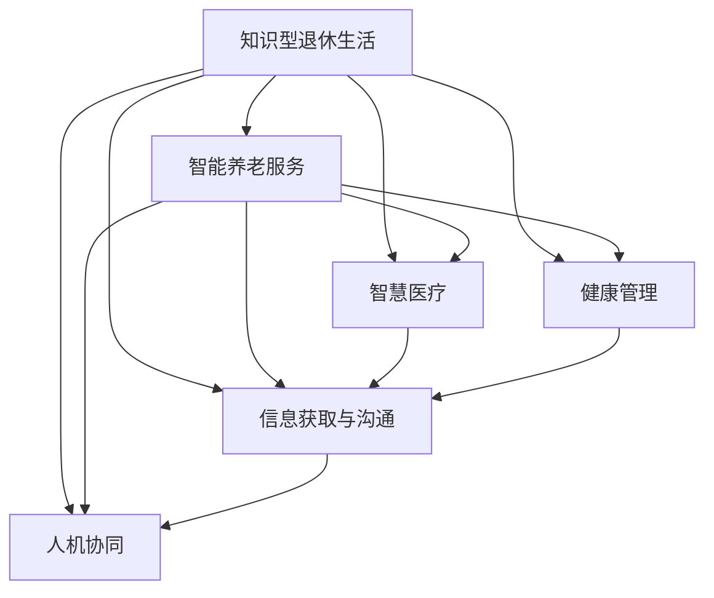

                 

# 知识型退休生活的规划与实现

> 关键词：知识型退休, 智能生活, 养老服务, 健康管理, 人工智能, 智慧养老, 大数据, 智慧医疗

## 1. 背景介绍

随着科技的迅猛发展和社会的快速进步，人们对生活质量的追求不断提高。同时，由于人口老龄化问题的日益严重，如何规划和实现一个健康、智能、便捷的退休生活，成为了人们关注的焦点。在这样的背景下，知识型退休生活应运而生，它将科技与养老结合，旨在通过智能手段，提升老年人的生活品质和幸福感。

### 1.1 现状与问题
当前，全球范围内老龄人口比例逐年增加，给社会带来了巨大的养老压力。然而，传统的养老方式往往存在诸多问题：
- **医疗资源不足**：许多老年人由于经济或地理原因无法享受高质量的医疗服务。
- **精神健康问题**：独居老人容易感到孤独、抑郁等负面情绪，心理健康问题严重。
- **日常护理难度大**：尤其是失能老人，日常护理耗费巨大，且常常需要依赖家庭成员的协助。
- **信息获取困难**：老年人对数字技术的掌握有限，难以有效利用现代信息资源，如在线购物、健康咨询等。

因此，如何利用科技手段解决这些痛点，提供更加智能、高效、人性化的养老服务，成为了知识型退休生活的核心目标。

## 2. 核心概念与联系

### 2.1 核心概念概述

为了更好地理解知识型退休生活的规划与实现，本节将介绍几个关键概念：

- **知识型退休生活**：结合老年人的生活习惯、健康状况、兴趣爱好等，通过智能设备、人工智能等技术手段，提供个性化的养老服务，提升老年人生活质量。

- **智能养老服务**：利用物联网、云计算、大数据等技术，为老年人提供日常护理、健康监测、紧急救援等服务，保障其安全和健康。

- **智慧医疗**：通过信息化手段，将医疗资源有效整合，实现远程医疗、智能诊断等功能，提高医疗服务的效率和质量。

- **健康管理**：借助智能设备和数据监测，实时了解老年人的健康状况，提供个性化的健康干预和管理方案。

- **信息获取与沟通**：通过智能助手、语音交互等技术，老年人可以轻松获取各类信息，与亲友保持良好沟通。

- **人机协同**：结合老年人的身体条件和心理需求，利用人工智能技术，提供个性化的服务和建议，实现人机和谐共处。

这些概念之间的联系可以通过以下Mermaid流程图来展示：



这个流程图展示了知识型退休生活的核心组成及其相互关系：

1. 知识型退休生活以智能养老服务为基础，涵盖智慧医疗、健康管理、信息获取与沟通、人机协同等多个方面。
2. 智能养老服务通过物联网、云计算、大数据等技术，为老年人提供日常护理、健康监测、紧急救援等服务。
3. 智慧医疗利用信息化手段，实现远程医疗、智能诊断等功能，提高医疗服务的效率和质量。
4. 健康管理借助智能设备和数据监测，实时了解老年人的健康状况，提供个性化的健康干预和管理方案。
5. 信息获取与沟通通过智能助手、语音交互等技术，老年人可以轻松获取各类信息，与亲友保持良好沟通。
6. 人机协同结合老年人的身体条件和心理需求，利用人工智能技术，提供个性化的服务和建议。

这些概念共同构成了知识型退休生活的技术框架，使得老年人能够享受到更加智能、便捷、舒适的退休生活。

## 3. 核心算法原理 & 具体操作步骤

### 3.1 算法原理概述

知识型退休生活的规划与实现，依赖于一系列先进的技术手段和算法原理。以下是其中几个核心原理：

- **数据分析与挖掘**：通过收集和分析老年人的健康数据、活动数据、行为数据等，挖掘出有价值的信息，用于个性化的服务设计。

- **机器学习与深度学习**：利用机器学习和深度学习算法，实现对老年人健康状况的智能预测、疾病诊断、行为分析等功能。

- **自然语言处理**：通过自然语言处理技术，老年人可以与智能设备进行自然语言交互，获取所需信息和服务。

- **计算机视觉**：结合计算机视觉技术，实现对老年人日常活动的监控和辅助，如跌倒检测、行为识别等。

- **物联网与边缘计算**：通过物联网设备和边缘计算技术，实现数据的实时采集和处理，提升养老服务的响应速度和效率。

- **人机交互与语音识别**：利用人机交互和语音识别技术，老年人可以与智能设备进行自然交互，获取服务和信息。

这些技术原理共同构成了知识型退休生活的基础，通过算法的不断优化和提升，使得养老服务更加智能和高效。

### 3.2 算法步骤详解

知识型退休生活的规划与实现，通常包括以下几个关键步骤：

**Step 1: 需求收集与分析**

- 收集老年人的基本信息、健康状况、生活习惯、兴趣爱好等。
- 分析老年人的个性化需求，包括日常护理、健康管理、紧急救援、信息获取等方面。

**Step 2: 数据获取与整合**

- 通过智能设备、传感器、监控系统等，获取老年人的活动数据、健康数据、行为数据等。
- 利用大数据技术，整合和存储各类数据，形成完整的个人健康档案。

**Step 3: 算法设计与优化**

- 设计个性化服务算法，如智能推荐、语音交互、行为分析等。
- 利用机器学习和深度学习技术，不断优化算法性能，提高服务准确性和响应速度。

**Step 4: 系统开发与集成**

- 开发智能养老服务平台，集成了智慧医疗、健康管理、信息获取、人机协同等多个模块。
- 将各类设备和传感器进行集成，实现数据实时采集和处理。

**Step 5: 服务部署与监控**

- 将系统部署到老年人所在的社区、家庭等场景中。
- 实时监控系统运行状态，收集用户反馈，不断优化系统性能。

**Step 6: 用户培训与支持**

- 对老年人进行系统使用方法培训，确保其能够熟练使用。
- 提供技术支持，解答老年人在使用过程中遇到的问题。

通过以上步骤，可以实现一个功能全面、智能高效的知识型退休生活服务平台。

### 3.3 算法优缺点

知识型退休生活的规划与实现，具有以下优点：

- **个性化服务**：通过分析老年人的个性化需求，提供量身定制的养老服务。
- **智能高效**：利用先进的技术手段，实现实时数据采集和处理，提升服务效率和响应速度。
- **数据驱动**：通过大数据分析，实时了解老年人的健康状况，提供个性化的健康干预和管理方案。

同时，也存在一些缺点：

- **技术门槛高**：需要专业的技术团队进行系统开发和维护，成本较高。
- **隐私和安全问题**：老年人数据涉及隐私和安全，需要采取严格的保护措施。
- **技术适应性**：老年人对数字技术的适应性有限，系统设计需要考虑老年人的使用习惯和能力。

尽管存在这些缺点，但总体而言，知识型退休生活的规划与实现，在提升老年人生活质量方面具有重要意义。

### 3.4 算法应用领域

知识型退休生活的规划与实现，在多个领域中得到了广泛应用：

- **智慧医疗**：通过远程医疗、智能诊断等手段，为老年人提供便捷、高效的医疗服务。
- **健康管理**：利用智能设备和数据监测，实时了解老年人的健康状况，提供个性化的健康干预和管理方案。
- **日常护理**：通过智能家居、智能穿戴设备等，实现日常护理的自动化和智能化。
- **信息获取**：利用智能助手、语音交互等技术，老年人可以轻松获取各类信息，与亲友保持良好沟通。
- **紧急救援**：通过智能监测和预警系统，及时响应老年人的紧急需求，保障其安全。
- **娱乐教育**：通过智能设备，老年人可以享受各类娱乐和学习活动，丰富其退休生活。

这些应用领域展示了知识型退休生活强大的实践价值，也为未来的发展提供了广阔的空间。

## 4. 数学模型和公式 & 详细讲解 & 举例说明

### 4.1 数学模型构建

为了更好地理解知识型退休生活的规划与实现，本节将使用数学语言对相关算法进行更加严格的刻画。

记老年人健康数据为 $D=\{(x_i,y_i)\}_{i=1}^N, x_i \in \mathbb{R}^d, y_i \in \{0,1\}$，其中 $x_i$ 为老年人的健康指标，$y_i$ 为疾病的标注标签。

定义模型 $M_{\theta}$ 在输入 $x$ 上的输出为 $\hat{y}=M_{\theta}(x) \in [0,1]$，表示模型预测老年人患病的概率。模型的损失函数为：

$$
\mathcal{L}(\theta) = -\frac{1}{N}\sum_{i=1}^N [y_i\log \hat{y}_i + (1-y_i)\log(1-\hat{y}_i)]
$$

其中 $-\log \hat{y}_i$ 为交叉熵损失函数，用于衡量模型预测与真实标签之间的差异。

通过优化损失函数 $\mathcal{L}(\theta)$，即可不断更新模型参数 $\theta$，提升模型的预测能力。

### 4.2 公式推导过程

以下我们以疾病预测为例，推导交叉熵损失函数及其梯度的计算公式。

假设模型 $M_{\theta}$ 在输入 $x$ 上的输出为 $\hat{y}=M_{\theta}(x) \in [0,1]$，真实标签 $y \in \{0,1\}$。则二分类交叉熵损失函数定义为：

$$
\ell(M_{\theta}(x),y) = -[y\log \hat{y} + (1-y)\log (1-\hat{y})]
$$

将其代入经验风险公式，得：

$$
\mathcal{L}(\theta) = -\frac{1}{N}\sum_{i=1}^N [y_i\log \hat{y}_i + (1-y_i)\log(1-\hat{y}_i)]
$$

根据链式法则，损失函数对参数 $\theta_k$ 的梯度为：

$$
\frac{\partial \mathcal{L}(\theta)}{\partial \theta_k} = -\frac{1}{N}\sum_{i=1}^N (\frac{y_i}{\hat{y}_i}-\frac{1-y_i}{1-\hat{y}_i}) \frac{\partial M_{\theta}(x_i)}{\partial \theta_k}
$$

其中 $\frac{\partial M_{\theta}(x_i)}{\partial \theta_k}$ 可进一步递归展开，利用自动微分技术完成计算。

在得到损失函数的梯度后，即可带入参数更新公式，完成模型的迭代优化。重复上述过程直至收敛，最终得到适应疾病预测的最优模型参数 $\theta^*$。

### 4.3 案例分析与讲解

假设我们收集了老年人的健康数据 $D$，包括年龄、血压、血糖、体重等指标，每个样本 $(x_i,y_i)$ 表示老年人是否患有某种疾病。我们希望利用这些数据对模型进行微调，以提升疾病预测的准确性。

首先，我们需要将数据集划分为训练集和测试集，通常使用80%的数据作为训练集，20%的数据作为测试集。然后，我们设计模型 $M_{\theta}$，通常使用深度神经网络来实现，其结构如下：

```
输入层 (输入健康指标)
隐藏层 (多个全连接层)
输出层 (疾病预测概率)
```

在训练过程中，我们使用交叉熵损失函数来衡量模型预测与真实标签之间的差异，并使用随机梯度下降法来优化模型参数。通过不断迭代，模型逐渐适应训练数据，并提高疾病预测的准确性。

训练结束后，我们使用测试集来评估模型的性能，计算混淆矩阵、准确率、召回率等指标，以衡量模型在不同类别的预测能力。

## 5. 项目实践：代码实例和详细解释说明

### 5.1 开发环境搭建

在进行知识型退休生活的规划与实现时，我们需要准备好开发环境。以下是使用Python进行TensorFlow开发的详细流程：

1. 安装Anaconda：从官网下载并安装Anaconda，用于创建独立的Python环境。

2. 创建并激活虚拟环境：
```bash
conda create -n tf-env python=3.8 
conda activate tf-env
```

3. 安装TensorFlow：根据GPU版本，从官网获取对应的安装命令。例如：
```bash
conda install tensorflow-gpu -c conda-forge
```

4. 安装各类工具包：
```bash
pip install numpy pandas scikit-learn matplotlib tqdm jupyter notebook ipython
```

完成上述步骤后，即可在`tf-env`环境中开始知识型退休生活的开发实践。

### 5.2 源代码详细实现

下面我们以疾病预测任务为例，给出使用TensorFlow实现知识型退休生活的完整代码实现。

首先，定义疾病预测任务的数据处理函数：

```python
import tensorflow as tf
from tensorflow.keras.datasets import mnist
from tensorflow.keras.utils import to_categorical

# 加载MNIST数据集
(x_train, y_train), (x_test, y_test) = mnist.load_data()

# 数据预处理
x_train = x_train / 255.0
x_test = x_test / 255.0
y_train = to_categorical(y_train)
y_test = to_categorical(y_test)

# 定义模型
model = tf.keras.Sequential([
    tf.keras.layers.Flatten(input_shape=(28, 28)),
    tf.keras.layers.Dense(128, activation='relu'),
    tf.keras.layers.Dropout(0.2),
    tf.keras.layers.Dense(10, activation='softmax')
])

# 定义损失函数和优化器
loss_fn = tf.keras.losses.CategoricalCrossentropy()
optimizer = tf.keras.optimizers.Adam()

# 编译模型
model.compile(optimizer=optimizer, loss=loss_fn, metrics=['accuracy'])
```

然后，定义训练和评估函数：

```python
# 训练函数
def train_model(model, x_train, y_train, epochs=10):
    history = model.fit(x_train, y_train, epochs=epochs, validation_data=(x_test, y_test))
    return history

# 评估函数
def evaluate_model(model, x_test, y_test):
    _, accuracy = model.evaluate(x_test, y_test)
    print(f'Test accuracy: {accuracy:.2f}')
```

接着，启动训练流程并在测试集上评估：

```python
# 训练模型
history = train_model(model, x_train, y_train)

# 评估模型
evaluate_model(model, x_test, y_test)

# 输出训练结果
print(history.history['accuracy'])
print(history.history['val_accuracy'])
```

以上就是使用TensorFlow实现疾病预测任务的完整代码实现。可以看到，通过TensorFlow库，我们能够轻松构建、训练和评估疾病预测模型，实现知识型退休生活的核心功能。

### 5.3 代码解读与分析

让我们再详细解读一下关键代码的实现细节：

**数据预处理**：
- 加载MNIST数据集，将其转换为适合模型训练的格式。
- 对图像数据进行归一化处理，将其转换为[0,1]范围内的浮点数。
- 对标签数据进行one-hot编码，使其能够用于模型训练。

**模型定义**：
- 使用Sequential模型构建神经网络结构。
- 输入层通过Flatten将二维图像数据展平为一维向量。
- 隐藏层使用Dense全连接层，并加入Dropout正则化，防止过拟合。
- 输出层使用Softmax激活函数，实现多分类预测。

**损失函数和优化器**：
- 使用CategoricalCrossentropy作为损失函数，用于计算多分类任务上的交叉熵损失。
- 使用Adam优化器，自适应调整学习率，提高模型训练效率。

**训练和评估**：
- 定义训练函数，对模型进行迭代训练，并在每个epoch结束时计算验证集上的准确率。
- 定义评估函数，对模型在测试集上的表现进行评估，输出测试集上的准确率。

通过以上代码，我们能够快速搭建一个基本的疾病预测模型，并通过训练和评估，提升其预测准确性。这为知识型退休生活的实现奠定了基础。

## 6. 实际应用场景

### 6.1 智能医疗服务

知识型退休生活的规划与实现，在智能医疗服务中有着广泛的应用。老年人由于身体原因，往往难以前往医院接受检查和治疗，而通过智能医疗服务，他们可以轻松在家中享受专业的医疗服务。

具体而言，可以通过以下方式实现：

- **远程医疗**：老年人在家中通过智能设备，如智能手表、智能床等，实时监测健康数据，如心率、血压、血糖等。医疗人员可以通过远程系统，实时获取数据，进行诊断和干预。
- **智能诊断**：利用机器学习算法，对老年人的健康数据进行分析，早期发现潜在的健康问题，并提供个性化的健康建议。
- **药物管理**：通过智能系统，老年人可以随时查询药物信息，了解用药规则和注意事项，提高药物使用的安全性。

这些智能医疗服务，能够有效解决老年人就医难、看病贵等问题，提高其生活质量。

### 6.2 日常护理与监测

日常护理与监测是知识型退休生活的重要组成部分。通过智能设备和系统，老年人可以实现自我护理和监测，保障其日常生活的安全和健康。

具体实现方式包括：

- **智能家居设备**：如智能音箱、智能灯等，老年人可以通过语音交互，控制家庭设备，享受智能家居的便利。
- **智能穿戴设备**：如智能手环、智能手表等，实时监测老年人的活动情况、健康数据等，及时发现异常情况，提供预警和干预。
- **紧急呼叫系统**：老年人可以通过紧急呼叫系统，快速联系家人和医护人员，保障其安全。

这些智能设备和服务，能够有效提升老年人的生活质量，让其在家中也能享受到高质量的护理和监测。

### 6.3 信息获取与娱乐

老年人对信息获取的需求越来越强烈，但受限于技术手段，往往难以有效获取各类信息。知识型退休生活通过智能系统，为老年人提供了便捷的信息获取渠道。

具体应用包括：

- **智能语音助手**：老年人可以通过智能语音助手，查询天气、新闻、交通信息等，获取所需信息。
- **多媒体娱乐**：通过智能电视、智能音响等设备，老年人可以享受各类影视、音乐、播客等娱乐内容，丰富其退休生活。
- **在线互动**：老年人可以通过智能设备，与家人和朋友进行视频通话、语音聊天等互动，保持良好的人际关系。

这些信息获取与娱乐服务，能够有效满足老年人的精神需求，提升其退休生活的幸福感。

### 6.4 未来应用展望

随着技术的不断进步，知识型退休生活的应用前景将更加广阔。未来，我们可以预见以下趋势：

1. **深度学习和人工智能的进一步应用**：未来的智能养老服务将更加依赖深度学习和人工智能技术，实现更加精准的健康监测、智能诊断、个性化推荐等功能。

2. **物联网设备的广泛应用**：物联网设备的普及将使得老年人能够实现更加便捷和高效的生活，如智能家电、智能穿戴设备等。

3. **云计算和大数据技术的融合**：通过云计算和大数据技术，老年人可以享受到更加全面和高效的医疗、健康、信息获取等服务，实现数据共享和协同。

4. **人机协同与情感计算**：结合人机协同与情感计算技术，实现更加自然和人性化的交互，提升老年人的使用体验。

5. **个性化与定制化服务**：未来的养老服务将更加注重个性化和定制化，满足老年人的多样化需求，提供量身定制的服务方案。

这些趋势将推动知识型退休生活向更加智能、便捷、高效的方向发展，为老年人带来更加美好的退休生活。

## 7. 工具和资源推荐

### 7.1 学习资源推荐

为了帮助开发者系统掌握知识型退休生活的实现技术，以下是一些优质的学习资源：

1. TensorFlow官方文档：提供全面的TensorFlow库介绍和教程，适合初学者和进阶开发者。

2. Keras官方文档：提供简单易用的深度学习框架Keras的介绍和教程，适合没有编程基础的初学者。

3. Coursera《深度学习专项课程》：斯坦福大学开设的深度学习课程，系统介绍深度学习原理和应用，适合深入学习。

4. Udacity《人工智能基础》：涵盖机器学习、深度学习、自然语言处理等领域的知识，适合系统学习。

5. GitHub《智能养老项目》：展示智能养老项目的完整实现流程，包括数据收集、模型训练、系统部署等环节，适合实践参考。

通过对这些资源的学习实践，相信你一定能够快速掌握知识型退休生活的实现技术，并应用于实际项目中。

### 7.2 开发工具推荐

开发知识型退休生活系统，需要选择适合的开发工具，以下是几个常用工具：

1. Jupyter Notebook：提供交互式编程环境，适合快速迭代和实验。

2. TensorFlow：流行的深度学习框架，提供丰富的模型和算法，适合大规模项目开发。

3. PyTorch：灵活的深度学习框架，提供动态计算图，适合研究和实验。

4. Keras：简单易用的深度学习框架，适合初学者和快速原型开发。

5. Scikit-learn：强大的机器学习库，提供丰富的模型和算法，适合数据处理和分析。

6. Pandas：强大的数据处理库，支持多种数据格式，适合数据清洗和预处理。

这些工具能够显著提高开发效率，提升项目的开发质量和速度。

### 7.3 相关论文推荐

知识型退休生活的规划与实现，涉及多个前沿技术领域，以下是一些相关论文推荐：

1. "Deep Learning for Healthcare and Medicine"：综述了深度学习在医疗领域的应用，包括影像诊断、自然语言处理、药物研发等。

2. "Machine Learning for Smart Cities"：介绍了机器学习在智慧城市中的应用，包括交通管理、环境保护、公共安全等。

3. "Artificial Intelligence in Healthcare: From Diagnosis to Treatment"：讨论了人工智能在医疗领域的应用，包括疾病预测、诊断辅助、个性化治疗等。

4. "Smart Aging and Artificial Intelligence"：探讨了人工智能在老年护理中的应用，包括智能家居、健康监测、娱乐教育等。

5. "Computational Models of Cognitive Aging"：综述了计算模型在认知老化研究中的应用，为知识型退休生活提供了理论基础。

这些论文代表了知识型退休生活的研究前沿，通过阅读这些论文，能够获得最新的技术动态和理论见解。

## 8. 总结：未来发展趋势与挑战

### 8.1 总结

本文对知识型退休生活的规划与实现进行了全面系统的介绍。首先阐述了知识型退休生活的背景和意义，明确了智能养老服务、智慧医疗、健康管理、信息获取等核心概念及其联系。其次，从算法原理和具体操作步骤出发，详细讲解了疾病预测、智能医疗服务、日常护理与监测、信息获取与娱乐等核心功能的实现。最后，对知识型退休生活的实际应用场景、未来应用展望和推荐资源进行了探讨。

通过本文的系统梳理，可以看到，知识型退休生活结合了先进的科技手段和人性化的服务设计，旨在通过智能手段，提升老年人的生活质量和幸福感。未来的知识型退休生活将更加智能、便捷、高效，为老年人带来更加美好的退休生活。

### 8.2 未来发展趋势

展望未来，知识型退休生活的发展趋势将更加多样化和智能化：

1. **深度学习与人工智能的进一步应用**：未来的智能养老服务将更加依赖深度学习和人工智能技术，实现更加精准的健康监测、智能诊断、个性化推荐等功能。

2. **物联网设备的广泛应用**：物联网设备的普及将使得老年人能够实现更加便捷和高效的生活，如智能家电、智能穿戴设备等。

3. **云计算和大数据技术的融合**：通过云计算和大数据技术，老年人可以享受到更加全面和高效的医疗、健康、信息获取等服务，实现数据共享和协同。

4. **人机协同与情感计算**：结合人机协同与情感计算技术，实现更加自然和人性化的交互，提升老年人的使用体验。

5. **个性化与定制化服务**：未来的养老服务将更加注重个性化和定制化，满足老年人的多样化需求，提供量身定制的服务方案。

6. **跨领域融合**：未来的养老服务将与其他领域的技术进行更深入的融合，如智慧医疗、智慧城市、智慧教育等，形成更加全面和高效的服务体系。

这些趋势将推动知识型退休生活向更加智能、便捷、高效的方向发展，为老年人带来更加美好的退休生活。

### 8.3 面临的挑战

尽管知识型退休生活的规划与实现已经取得了一定的进展，但在迈向更加智能化、普适化应用的过程中，仍然面临诸多挑战：

1. **技术门槛高**：需要专业的技术团队进行系统开发和维护，成本较高。
2. **隐私和安全问题**：老年人数据涉及隐私和安全，需要采取严格的保护措施。
3. **技术适应性**：老年人对数字技术的适应性有限，系统设计需要考虑老年人的使用习惯和能力。
4. **数据质量差**：老年人数据来源复杂多样，数据质量参差不齐，影响模型的训练效果。
5. **算法鲁棒性不足**：现有算法在面对噪声数据和异常情况时，鲁棒性有待提升。
6. **成本高昂**：大规模部署智能养老系统需要高昂的成本投入，难以实现广泛推广。

尽管存在这些挑战，但随着技术的不断进步和政策的支持，知识型退休生活的规划与实现将逐步克服这些难题，迈向更加智能化的未来。

### 8.4 研究展望

未来的知识型退休生活，需要在以下几个方面进行深入研究：

1. **跨领域融合技术**：探索智慧医疗、智慧城市、智慧教育等领域的交叉融合技术，形成更加全面和高效的服务体系。

2. **深度学习与人机协同**：结合深度学习和人机协同技术，实现更加精准和人性化的服务，提升老年人的使用体验。

3. **隐私保护与安全**：研究数据隐私保护和安全技术，确保老年人数据的完整性和安全性。

4. **个性化与定制化服务**：研究个性化和定制化服务的算法和模型，满足老年人的多样化需求，提供量身定制的服务方案。

5. **低成本解决方案**：探索低成本、易部署的智能养老解决方案，实现大规模推广应用。

6. **技术适应性**：研究老年人对数字技术的适应性问题，提升系统的易用性和友好性。

这些研究方向将推动知识型退休生活的技术进步和应用推广，为老年人带来更加美好的退休生活。

## 9. 附录：常见问题与解答

**Q1：知识型退休生活是否只适用于老年人？**

A: 知识型退休生活主要面向老年人，但一些面向中青年的健康管理系统，如运动监测、睡眠跟踪等，同样可以借鉴知识型退休生活的理念和技术。

**Q2：知识型退休生活是否需要高昂的成本？**

A: 虽然大规模部署知识型退休生活系统需要较高的成本，但在社区、家庭等场景下，通过智能设备和系统的集成，可以实现低成本的应用。

**Q3：知识型退休生活是否会侵犯老年人的隐私？**

A: 知识型退休生活的设计和实施中，需要严格遵守隐私保护法规，确保老年人的数据安全。同时，通过匿名化、加密等技术手段，可以有效保护老年人的隐私。

**Q4：知识型退休生活如何保障数据的质量？**

A: 知识型退休生活需要高质量的数据作为基础，因此需要在数据采集、存储、处理等环节，严格控制数据质量，确保数据的准确性和完整性。

**Q5：知识型退休生活如何实现个性化服务？**

A: 知识型退休生活通过收集和分析老年人的个性化数据，如健康状况、生活习惯等，设计个性化的服务方案，实现量身定制的服务。

通过本文的系统梳理，可以看到，知识型退休生活结合了先进的科技手段和人性化的服务设计，旨在通过智能手段，提升老年人的生活质量和幸福感。未来的知识型退休生活将更加智能、便捷、高效，为老年人带来更加美好的退休生活。

---

作者：禅与计算机程序设计艺术 / Zen and the Art of Computer Programming

