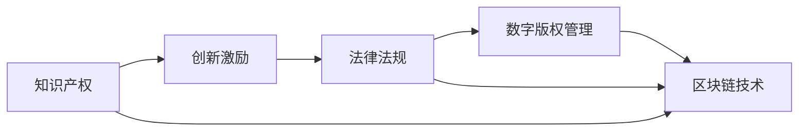

                 

# 知识的产权保护：创新激励与公共利益的平衡

> 关键词：知识产权, 创新激励, 公共利益, 法律法规, 数字版权管理, 区块链技术

## 1. 背景介绍

### 1.1 问题由来

在全球知识经济迅速发展的今天，知识产权保护已成为创新激励与公共利益平衡的关键。一方面，知识产权制度旨在保护创作者和创新者的合法权益，激发其进行原创性工作，推动技术进步与文化繁荣。另一方面，知识产权也需要平衡公众对知识共享的需求，促进知识的广泛传播与应用，推动社会整体福祉。

然而，随着数字技术的不断演进，传统知识产权制度面临诸多挑战。在线盗版、侵权行为层出不穷，如何有效打击盗版、保护知识产权，同时促进知识的自由流动与共享，成为亟待解决的问题。本文档将深入探讨知识的产权保护，并提出基于区块链技术的创新解决方案，以期在激发创新与维护公共利益之间找到平衡点。

### 1.2 问题核心关键点

本文的核心问题包括：

- 知识产权的定义与重要性
- 传统知识产权保护面临的挑战
- 数字时代知识共享与创新的双重需求
- 区块链技术在知识版权保护中的应用

## 2. 核心概念与联系

### 2.1 核心概念概述

1. **知识产权 (Intellectual Property Rights, IPRs)**：
   知识产权是指创作者对其原创作品（如文学、音乐、软件、设计等）的独占权利。主要包括版权、商标权、专利权、商业秘密等，旨在保护创作者的经济利益和精神权利。

2. **创新激励 (Innovation Incentives)**：
   创新激励是指通过知识产权保护，激励人们进行创新活动。确保创作者能够从其原创作品中获取收益，从而吸引更多资源投入到创造性工作中。

3. **公共利益 (Public Interest)**：
   公共利益是指社会公众从知识传播与应用中获得的利益，如教育普及、文化交流、科学进步等。知识共享有助于知识的广泛传播与应用，促进社会整体发展。

4. **法律法规 (Legislation)**：
   法律法规是知识产权保护的基础，包括版权法、商标法、专利法等。通过法律手段，保护知识产权，打击侵权行为，维护创新与公共利益。

5. **数字版权管理 (Digital Rights Management, DRM)**：
   数字版权管理是一种技术手段，用于保护数字作品的知识产权。通过加密、授权、监控等技术，限制数字作品的复制、分发和使用。

6. **区块链技术 (Blockchain Technology)**：
   区块链是一种分布式账本技术，通过去中心化、不可篡改、透明性等特性，提供了一种新型的知识产权保护机制。

### 2.2 核心概念原理和架构的 Mermaid 流程图(Mermaid 流程节点中不要有括号、逗号等特殊字符)



这个流程图展示了知识产权、创新激励、法律法规、数字版权管理与区块链技术之间的联系：

1. 知识产权是创新的基础，通过法律法规加以保护。
2. 数字版权管理技术进一步加强了知识产权的保护。
3. 区块链技术为知识产权保护提供了一种新的思路。

## 3. 核心算法原理 & 具体操作步骤

### 3.1 算法原理概述

知识产权保护的核心在于确保创作者对其原创作品的独占使用权，同时促进知识的广泛传播与应用。数字时代下，知识作品以数字形式存在，容易在网络上复制和分发，这使得传统版权保护措施面临诸多挑战。

区块链技术为知识产权保护提供了新的解决途径。区块链的分布式特性可以确保版权记录的透明性和不可篡改性，而智能合约技术可以实现自动化的版权管理与授权。

### 3.2 算法步骤详解

以下是基于区块链技术的知识产权保护的具体步骤：

1. **作品数字化**：
   创作者将作品数字化，通过区块链网络存储。

2. **版权注册**：
   创作者将作品上传至区块链平台，进行版权注册。平台通过智能合约自动进行版权登记，并生成唯一的版权标识（Hash值）。

3. **版权管理**：
   创作者可以定义作品的授权规则，包括授权范围、使用方式、授权期限等。智能合约会根据这些规则自动执行版权管理操作，如授权、限制、撤回等。

4. **版权监控与维权**：
   平台内置监控系统，实时监测版权使用情况，一旦发现侵权行为，平台自动触发维权机制。创作者可以通过区块链网络快速获取侵权证据，进行法律诉讼。

5. **版权交易**：
   创作者可以将版权授权给他人使用，获得收益。平台内置市场机制，进行版权交易，保障交易双方权益。

### 3.3 算法优缺点

#### 优点：

1. **透明性**：
   区块链技术的分布式账本和不可篡改特性，使得版权记录透明、可信，减少了版权纠纷。

2. **自动化**：
   智能合约的自动执行功能，减少了版权管理的人为干预，提高了效率。

3. **去中心化**：
   区块链的去中心化特性，降低了单点故障风险，增强了系统的可靠性。

4. **低成本**：
   数字版权的存储、管理、交易成本大幅降低，降低了创作者和用户的经济负担。

#### 缺点：

1. **技术门槛高**：
   区块链和智能合约技术门槛较高，需要专业人士进行部署和管理。

2. **网络安全风险**：
   区块链网络存在被攻击、篡改的风险，需要采取多种安全措施来保障数据安全。

3. **普及率低**：
   当前区块链技术的普及率不高，许多创作者和用户对区块链技术了解不足，接受度较低。

### 3.4 算法应用领域

区块链技术在知识产权保护中的应用领域非常广泛，涵盖以下几个方面：

1. **版权登记与交易**：
   通过区块链进行版权登记，保障创作者权益；平台内置市场机制，方便版权交易。

2. **音乐、影视作品的版权管理**：
   音乐、影视作品数字化后，通过区块链进行版权管理，减少侵权行为。

3. **开源软件的版权保护**：
   开源软件版权通过区块链进行授权和监控，确保开源协议的有效执行。

4. **文化艺术品版权保护**：
   通过区块链进行文化艺术品版权登记，保障创作者权益，减少盗版。

## 4. 数学模型和公式 & 详细讲解 & 举例说明（备注：数学公式请使用latex格式，latex嵌入文中独立段落使用 $$，段落内使用 $)

### 4.1 数学模型构建

知识产权保护涉及版权登记、版权授权、版权监控、版权交易等多个环节。我们可以通过构建数学模型来量化这些环节的效率和收益。

设 $C$ 为版权保护的成本，$R$ 为版权授权带来的收益，$L$ 为版权监控和维权的成本，$S$ 为版权交易的收益。则知识产权保护的总收益 $T$ 可表示为：

$$
T = R - C - L + S
$$

### 4.2 公式推导过程

以版权授权为例，智能合约的授权规则可以表示为：

$$
\text{授权} = \text{版权标识} \wedge \text{授权范围} \wedge \text{授权期限}
$$

其中 $\wedge$ 表示逻辑与，版权标识为区块链生成的唯一标识，授权范围和期限由创作者定义。智能合约自动根据规则执行授权操作，确保版权的有效管理。

### 4.3 案例分析与讲解

假设某创作者 A 将作品上传至区块链平台，进行版权登记。智能合约自动生成版权标识，并允许创作者定义授权规则。创作者 A 授权另一创作者 B 使用其作品，智能合约自动更新版权授权状态，创作者 B 根据授权规则使用作品，创作者 A 获得收益。平台内置监控系统，实时监测版权使用情况，一旦发现侵权行为，平台自动触发维权机制，创作者 A 通过区块链网络快速获取侵权证据，进行法律诉讼。

## 5. 项目实践：代码实例和详细解释说明

### 5.1 开发环境搭建

要实现基于区块链技术的知识产权保护系统，需要以下开发环境：

1. **区块链平台**：
   选择合适的区块链平台，如以太坊、Hyperledger、EOS等。

2. **编程语言**：
   使用 Solidity 或智能合约脚本语言进行区块链开发。

3. **开发工具**：
   安装区块链开发工具，如 Truffle、Remix、MyEtherWallet 等。

### 5.2 源代码详细实现

以下是一个简单的基于 Solidity 的版权授权智能合约：

```solidity
pragma solidity ^0.8.0;

contract Copyright {
    address public creator;
    uint256 public created;
    uint256 public duration;
    bool public enabled;
    mapping(address => uint256) public balances;
    mapping(address => bool) public authorized;
    
    constructor() public {
        creator = msg.sender;
        created = block.timestamp;
        duration = 365 * 24 * 3600;
        enabled = true;
        balances[creator] = 0;
        authorized[creator] = true;
    }
    
    function grant(uint256 amount) public {
        balances[msg.sender] += amount;
    }
    
    function revoke() public {
        enabled = false;
    }
    
    function checkAuthorized(address user) public view returns (bool) {
        return authorized[user];
    }
    
    function transfer(address user, uint256 amount) public {
        require(enabled, "Contract is no longer active");
        require(amount <= balances[msg.sender], "Insufficient balance");
        balances[msg.sender] -= amount;
        balances[user] += amount;
    }
}
```

这个智能合约实现了版权授权和余额管理功能。创作者上传作品后，可以在合约中定义授权规则，授权其他创作者使用其作品。一旦授权，智能合约自动更新授权状态，创作者可以实时获取作品的版权信息和使用情况。

### 5.3 代码解读与分析

**版权注册模块**：
- `constructor` 方法：创建合约时，自动记录创作者信息、版权创建时间、有效期等关键数据。

**版权授权模块**：
- `grant` 方法：创作者授权其他创作者使用作品，增加对应作者的余额。
- `revoke` 方法：创作者撤销授权，禁用版权使用。

**版权监控与维权模块**：
- `checkAuthorized` 方法：检查指定创作者是否被授权使用作品。
- `transfer` 方法：创作者向其他创作者转让作品，自动更新余额和授权状态。

**版权交易模块**：
- 通过区块链平台内置的市场机制，创作者可以进行版权交易，获得收益。

### 5.4 运行结果展示

通过上述智能合约，创作者可以在区块链网络中快速注册版权，授权其他创作者使用作品，实时获取版权信息和使用情况，维护版权权益。平台内置的市场机制进一步提高了版权交易的效率和透明度，保障了交易双方的权益。

## 6. 实际应用场景

### 6.4 未来应用展望

区块链技术在知识产权保护中的应用前景广阔，未来将进一步拓展到以下几个领域：

1. **内容创作与分享**：
   音乐、影视、文学等创作者可以通过区块链进行版权登记和授权，减少侵权行为，促进内容的创作与分享。

2. **文化艺术品保护**：
   博物馆、拍卖行等机构可以通过区块链保护文化艺术品版权，减少盗版，提升艺术品价值。

3. **开源软件与技术分享**：
   开源软件开发者可以通过区块链进行代码授权和监控，确保开源协议的有效执行。

4. **知识产权交易平台**：
   构建基于区块链的知识产权交易平台，方便创作者和用户进行版权交易，保障交易双方权益。

## 7. 工具和资源推荐

### 7.1 学习资源推荐

1. **Blockchain Basics**：
   在线课程，介绍区块链的基本概念和应用场景。

2. **Solidity Cookbook**：
   Solidity 编程指南，包含大量智能合约开发案例。

3. **Intellectual Property Rights in the Digital Age**：
   相关书籍，系统介绍数字时代知识产权保护的法律与技术问题。

4. **Creative Commons**：
   开源版权协议，促进知识共享与创新。

5. **MIT Technology Review**：
   科技杂志，定期发布关于知识产权保护的最新研究和实践进展。

### 7.2 开发工具推荐

1. **Truffle**：
   智能合约开发框架，提供IDE、测试网络等开发工具。

2. **Remix**：
   区块链开发平台，提供在线IDE和测试工具。

3. **MyEtherWallet**：
   以太坊钱包，方便管理区块链资产。

4. **IPFS**：
   分布式存储技术，增强数据的安全性和可访问性。

5. **Stellar**：
   区块链平台，提供跨链交易和资产管理功能。

### 7.3 相关论文推荐

1. **Decentralized Knowledge Sharing and Innovation**：
   讨论区块链在知识共享与创新中的应用。

2. **Smart Contracts for Digital Rights Management**：
   研究智能合约在数字版权管理中的应用。

3. **Blockchain and Intellectual Property Law**：
   探讨区块链技术对知识产权法的挑战与影响。

4. **Content Governance and Blockchain Technology**：
   分析区块链在内容治理中的应用。

5. **Copyright and Privacy on Blockchain**：
   讨论区块链对版权和隐私保护的影响。

## 8. 总结：未来发展趋势与挑战

### 8.1 研究成果总结

基于区块链技术的知识产权保护，为数字时代的内容创新与知识共享提供了新的解决方案。该技术通过透明性、自动化、去中心化等特性，提高了版权管理的效率和透明度，保障了创作者的合法权益。

### 8.2 未来发展趋势

未来，区块链技术在知识产权保护中的应用将更加广泛和深入：

1. **普及率提升**：
   随着区块链技术的普及和教育，创作者和用户将更广泛地接受和应用区块链技术。

2. **技术迭代**：
   智能合约、分布式账本等区块链技术将不断迭代优化，提高系统的安全性和效率。

3. **跨链合作**：
   跨链技术将增强不同区块链平台之间的互联互通，提高版权管理和交易的便捷性。

4. **法律法规完善**：
   伴随区块链技术的发展，相关法律法规也将不断完善，确保版权保护的合法性和公正性。

### 8.3 面临的挑战

尽管区块链技术在知识产权保护中展现出了巨大潜力，但仍面临诸多挑战：

1. **技术门槛**：
   区块链和智能合约技术的复杂性，对开发人员提出了较高要求。

2. **网络安全**：
   区块链网络存在被攻击、篡改的风险，需要采取多种安全措施。

3. **标准化**：
   不同区块链平台之间的互操作性较差，缺乏统一的标准和协议。

4. **法律风险**：
   区块链技术的法律问题尚未完全明确，存在法律风险。

### 8.4 研究展望

未来，需要从多个方面推动区块链技术在知识产权保护中的应用：

1. **技术优化**：
   提升区块链和智能合约的技术水平，降低技术门槛，提高系统安全性和效率。

2. **法律保障**：
   制定和完善相关法律法规，明确区块链技术的法律地位和权利义务。

3. **标准化**：
   推动区块链技术的标准化，增强平台之间的互操作性。

4. **教育普及**：
   加强区块链技术的教育和培训，提升创作者和用户对技术的理解和应用能力。

通过不断优化技术、完善法规、推动标准化和普及教育，区块链技术将在知识产权保护中发挥更大作用，促进知识共享与创新。

## 9. 附录：常见问题与解答

**Q1: 什么是区块链技术？**

A: 区块链是一种分布式账本技术，通过去中心化、不可篡改、透明性等特性，提供了一种新型的知识产权保护机制。

**Q2: 智能合约和区块链的关系是什么？**

A: 智能合约是运行在区块链上的程序，通过区块链的分布式特性，自动执行版权管理与授权操作，保障创作者和用户的权益。

**Q3: 区块链技术在知识产权保护中面临哪些挑战？**

A: 区块链技术在知识产权保护中面临技术门槛高、网络安全风险、普及率低、法律风险等多重挑战。

**Q4: 如何提升区块链技术在知识产权保护中的应用？**

A: 需要优化技术、完善法律保障、推动标准化和普及教育，才能更好地发挥区块链技术在知识产权保护中的作用。

---

作者：禅与计算机程序设计艺术 / Zen and the Art of Computer Programming

