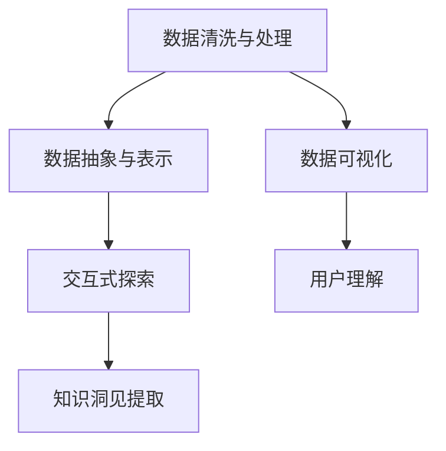

                 

# 知识的可视化：数据可视化技术在理解中的应用

## 1. 背景介绍

### 1.1 问题由来
在信息爆炸的今天，数据已不再是一种简单的工具，而是一种全新的知识形态。无论是科学研究、商业分析，还是日常决策，数据都已经成为了不可或缺的核心资产。如何更好地理解和利用数据，成为当今社会亟待解决的重要问题。

数据可视化作为一种有效的数据呈现手段，通过对复杂数据进行图形化展示，使得用户能够直观地发现数据中的规律、趋势和模式，从而获得更深层次的理解。无论是在科学研究、商业分析还是日常生活中，数据可视化都起到了至关重要的作用。

然而，传统的数据可视化往往侧重于对已有数据的简单呈现和描述，难以帮助用户深入理解数据的含义和内在联系。为了更好地挖掘数据背后的深层知识和洞见，需要将数据可视化的技术深度融入理解过程，实现知识的可视化。

### 1.2 问题核心关键点
知识的可视化旨在通过数据可视化技术，将数据背后蕴含的复杂信息转化为直观、易于理解的形式，从而帮助用户更深刻地理解数据的内涵和意义。其核心关键点包括：

- 数据清洗和处理：预处理数据，确保数据的完整性和一致性。
- 数据抽象与表示：通过合适的图表和表示形式，将数据中的关键信息凸显出来。
- 交互式探索：提供丰富的交互功能，让用户能够动态探索数据的多维特性。
- 知识洞见提取：基于可视化的结果，提炼出数据中蕴含的洞见和规律。

在理解和应用上述关键点的过程中，还需要考虑以下几个因素：

- 用户的认知负荷：避免信息过载，将复杂信息分层次展现。
- 数据的维度：处理高维数据，简化复杂度。
- 技术的可实现性：确保可视化过程的技术可行性和高效性。

### 1.3 问题研究意义
知识的可视化不仅有助于数据驱动决策的形成，还能显著提升用户对数据的理解和洞察能力。具体而言，知识的可视化：

- 帮助用户发现数据中的规律和趋势，从而做出更明智的决策。
- 减少用户的认知负荷，快速获取关键信息。
- 提供互动式探索方式，增强用户对数据的理解和记忆。
- 促进跨领域知识的融合和应用，提升创新能力。

## 2. 核心概念与联系

### 2.1 核心概念概述

为了更好地理解知识的可视化过程，我们先来梳理一下核心概念和它们之间的联系。

#### 2.1.1 数据清洗与处理

数据清洗是指对原始数据进行清洗、整理和预处理，确保数据的完整性和一致性。常见数据清洗的方法包括：

- 数据去重：删除重复数据，确保数据的唯一性。
- 数据填充：补齐缺失数据，保证数据的完整性。
- 数据转换：将数据转换为统一的格式，便于后续处理。

#### 2.1.2 数据抽象与表示

数据抽象是指将原始数据进行简化和抽象，突出其关键特征和信息。常见的数据抽象与表示方法包括：

- 统计图表：如直方图、饼图、散点图等，展示数据的分布和关系。
- 地图与热力图：展示数据的地理分布和密度。
- 时间序列图：展示数据随时间的变化趋势。

#### 2.1.3 交互式探索

交互式探索是指通过交互界面和功能，使用户能够动态探索数据的多维特性。常见的交互式探索方法包括：

- 动态过滤：根据用户需求动态过滤数据，提高探索效率。
- 缩放与平移：支持用户对数据的动态缩放和平移，实现更细致的观察。
- 数据聚合：支持用户对数据的聚合操作，提取高层次的信息。

#### 2.1.4 知识洞见提取

知识洞见提取是指基于数据可视化的结果，提炼出数据中蕴含的洞见和规律。常见的知识洞见提取方法包括：

- 模式识别：识别数据中的模式和趋势，预测未来变化。
- 关联分析：分析数据间的关联关系，发现隐含的联系。
- 异常检测：识别数据中的异常值，发现潜在的异常情况。

以上四个核心概念共同构成了知识的可视化框架，通过数据清洗和处理、数据抽象与表示、交互式探索和知识洞见提取，实现了数据的可视化呈现和深层理解。

### 2.2 核心概念原理和架构的 Mermaid 流程图

下面是一个简化的 Mermaid 流程图，展示了知识可视化的主要过程和关键步骤：



在这个流程图中，数据清洗和处理是知识可视化的基础，通过数据抽象与表示，将数据的关键信息进行可视化展示。接着，通过交互式探索，用户可以动态探索数据的特性，从而更好地理解数据。最后，基于可视化的结果，进行知识洞见提取，帮助用户提炼出数据的深层含义。

## 3. 核心算法原理 & 具体操作步骤

### 3.1 算法原理概述

知识的可视化算法可以大致分为以下几个步骤：

1. **数据清洗与处理**：对原始数据进行清洗、整理和预处理，确保数据的完整性和一致性。
2. **数据抽象与表示**：通过选择合适的图表和表示形式，将数据中的关键信息凸显出来。
3. **交互式探索**：提供丰富的交互功能，让用户能够动态探索数据的多维特性。
4. **知识洞见提取**：基于可视化的结果，提炼出数据中蕴含的洞见和规律。

### 3.2 算法步骤详解

#### 3.2.1 数据清洗与处理

数据清洗与处理的目的是确保数据的完整性和一致性，以便于后续的分析和可视化。主要步骤包括：

- 数据去重：使用唯一标识符检测并删除重复数据。
- 数据填充：补齐缺失数据，使用均值、中位数或插值方法填充缺失值。
- 数据转换：将数据转换为统一的格式，如将日期格式转换为时间戳。

#### 3.2.2 数据抽象与表示

数据抽象与表示的目的是通过合适的图表和表示形式，将数据中的关键信息凸显出来。主要步骤包括：

- 选择适当的图表类型：根据数据特性选择直方图、散点图、饼图等合适的图表类型。
- 数据可视化：使用可视化工具将数据映射到图表上，生成可视化结果。
- 数据标注：对图表中的关键信息进行标注，帮助用户更好地理解数据。

#### 3.2.3 交互式探索

交互式探索的目的是通过交互界面和功能，使用户能够动态探索数据的多维特性。主要步骤包括：

- 交互界面设计：设计交互界面，支持用户进行动态探索。
- 交互功能实现：实现动态过滤、缩放、平移等交互功能。
- 数据聚合：支持用户对数据的聚合操作，提取高层次的信息。

#### 3.2.4 知识洞见提取

知识洞见提取的目的是基于数据可视化的结果，提炼出数据中蕴含的洞见和规律。主要步骤包括：

- 模式识别：使用统计方法或机器学习算法，识别数据中的模式和趋势。
- 关联分析：使用关联规则挖掘算法，分析数据间的关联关系。
- 异常检测：使用异常检测算法，识别数据中的异常值。

### 3.3 算法优缺点

#### 3.3.1 优点

- 直观性强：通过可视化手段，将复杂数据转化为直观的图形，有助于用户快速理解。
- 交互性强：支持动态探索，用户可以根据需求调整视图，提高探索效率。
- 灵活性强：支持多种图表类型和表示形式，能够适应不同类型的数据。

#### 3.3.2 缺点

- 数据依赖性强：数据清洗和处理的准确性直接影响可视化的效果。
- 交互复杂性高：交互界面和功能的设计和实现较为复杂。
- 知识洞见提取难度大：需要结合统计学和机器学习知识，提炼出有价值的信息。

### 3.4 算法应用领域

知识可视化技术在多个领域都有广泛的应用，包括但不限于：

- 科学研究：通过可视化展示科学数据，帮助科学家发现数据中的规律和趋势。
- 商业分析：通过可视化展示商业数据，帮助企业做出明智的决策。
- 医疗健康：通过可视化展示医疗数据，帮助医生诊断疾病、制定治疗方案。
- 教育培训：通过可视化展示教育数据，帮助学生理解知识、提高学习效果。
- 城市规划：通过可视化展示城市数据，帮助政府进行城市规划和建设。

## 4. 数学模型和公式 & 详细讲解 & 举例说明

### 4.1 数学模型构建

在知识可视化中，数学模型通常用于数据清洗、数据表示和知识洞见提取等环节。下面我们将分别介绍这几个环节的数学模型和公式。

#### 4.1.1 数据清洗与处理

数据清洗与处理的基本数学模型如下：

- 去重模型：使用哈希表检测重复数据。
- 填充模型：使用均值、中位数或插值方法填充缺失数据。
- 转换模型：使用时间戳函数将日期格式转换为时间戳。

#### 4.1.2 数据抽象与表示

数据抽象与表示通常使用图表类型和表示形式来展示数据。常见图表类型包括：

- 直方图：表示数据的分布情况，公式如下：
  $$
  \text{直方图}(x) = \sum_{i=1}^{n} f(x_i) \cdot \text{bin width}
  $$
- 散点图：表示两个变量之间的关系，公式如下：
  $$
  \text{散点图}(x,y) = \{(x_i, y_i)\}_{i=1}^{n}
  $$
- 饼图：表示数据的占比情况，公式如下：
  $$
  \text{饼图}(x) = \sum_{i=1}^{n} f(x_i) \cdot \text{扇形面积}
  $$

#### 4.1.3 知识洞见提取

知识洞见提取通常使用统计学和机器学习算法来识别数据中的模式和规律。常见算法包括：

- 模式识别算法：使用线性回归、时间序列分析等算法，识别数据中的模式和趋势。
- 关联分析算法：使用Apriori算法、FP-growth算法等，分析数据间的关联关系。
- 异常检测算法：使用孤立森林、One-class SVM等算法，识别数据中的异常值。

### 4.2 公式推导过程

#### 4.2.1 数据清洗与处理

数据清洗与处理的基本公式推导如下：

- 去重公式：
  $$
  \text{去重结果} = \text{原始数据} - \text{重复数据}
  $$
- 填充公式：
  $$
  \text{填充结果} = \text{原始数据} + \text{插值结果}
  $$
- 转换公式：
  $$
  \text{转换结果} = \text{时间戳函数}(日期)
  $$

#### 4.2.2 数据抽象与表示

数据抽象与表示的基本公式推导如下：

- 直方图公式：
  $$
  \text{直方图}(x) = \sum_{i=1}^{n} f(x_i) \cdot \text{bin width}
  $$
- 散点图公式：
  $$
  \text{散点图}(x,y) = \{(x_i, y_i)\}_{i=1}^{n}
  $$
- 饼图公式：
  $$
  \text{饼图}(x) = \sum_{i=1}^{n} f(x_i) \cdot \text{扇形面积}
  $$

#### 4.2.3 知识洞见提取

知识洞见提取的基本公式推导如下：

- 模式识别公式：
  $$
  \text{模式结果} = \text{数据} + \text{统计算法}(\text{数据})
  $$
- 关联分析公式：
  $$
  \text{关联规则} = \text{Apriori算法}(\text{数据})
  $$
- 异常检测公式：
  $$
  \text{异常结果} = \text{异常算法}(\text{数据})
  $$

### 4.3 案例分析与讲解

#### 4.3.1 案例背景

某电商公司想要了解用户的购买行为和偏好，以便更好地进行市场分析和用户推荐。公司收集了大量的用户购买数据，包括购买时间、购买商品、购买金额等。

#### 4.3.2 数据清洗与处理

首先，对原始数据进行清洗和处理：

- 去重：使用哈希表检测并删除重复购买数据。
- 填充：补齐缺失的购买时间和金额。
- 转换：将日期格式转换为时间戳。

#### 4.3.3 数据抽象与表示

接着，使用数据可视化技术展示数据的关键信息：

- 直方图：展示购买时间的分布情况，帮助分析用户的购买时间偏好。
- 散点图：展示购买金额和购买商品之间的关系，帮助分析用户的购买偏好。
- 饼图：展示不同商品类别的销售占比，帮助分析用户的购买偏好。

#### 4.3.4 交互式探索

然后，提供交互式探索功能，使用户能够动态探索数据的特性：

- 动态过滤：根据用户的过滤条件，动态展示购买数据。
- 缩放与平移：支持用户对数据的动态缩放和平移，实现更细致的观察。
- 数据聚合：支持用户对数据的聚合操作，提取高层次的信息。

#### 4.3.5 知识洞见提取

最后，基于可视化的结果，提炼出数据中蕴含的洞见和规律：

- 模式识别：使用时间序列分析算法，识别用户的购买行为模式。
- 关联分析：使用关联规则挖掘算法，分析不同商品之间的关联关系。
- 异常检测：使用孤立森林算法，识别异常购买行为。

## 5. 项目实践：代码实例和详细解释说明

### 5.1 开发环境搭建

在进行项目实践前，我们需要准备好开发环境。以下是使用Python进行matplotlib、pandas、numpy等库的开发环境配置流程：

1. 安装Anaconda：从官网下载并安装Anaconda，用于创建独立的Python环境。

2. 创建并激活虚拟环境：
```bash
conda create -n data-visualization python=3.8 
conda activate data-visualization
```

3. 安装相关库：
```bash
conda install matplotlib pandas numpy scikit-learn 
```

4. 安装matplotlib：
```bash
pip install matplotlib
```

5. 安装pandas：
```bash
pip install pandas
```

6. 安装numpy：
```bash
pip install numpy
```

7. 安装scikit-learn：
```bash
pip install scikit-learn
```

完成上述步骤后，即可在`data-visualization`环境中开始项目实践。

### 5.2 源代码详细实现

下面是一个简单的数据可视化项目代码实现，展示如何使用matplotlib进行数据清洗、抽象与表示：

```python
import matplotlib.pyplot as plt
import pandas as pd
import numpy as np

# 读取数据
data = pd.read_csv('purchase_data.csv')

# 数据清洗与处理
data = data.drop_duplicates()  # 去重
data = data.fillna(method='ffill')  # 填充缺失值
data['timestamp'] = pd.to_datetime(data['timestamp']).astype('int64')  # 转换日期格式为时间戳

# 数据抽象与表示
plt.figure(figsize=(10, 6))
plt.hist(data['timestamp'], bins=30, alpha=0.5, label='Purchase Time')
plt.legend()
plt.show()

# 交互式探索
plt.figure(figsize=(10, 6))
plt.scatter(data['amount'], data['category'], alpha=0.5)
plt.xlabel('Purchase Amount')
plt.ylabel('Purchase Category')
plt.legend()
plt.show()

# 知识洞见提取
from sklearn.cluster import KMeans
from sklearn.decomposition import PCA

# 特征选择
X = data[['amount', 'category']]
pca = PCA(n_components=2)
X_pca = pca.fit_transform(X)

# 聚类分析
kmeans = KMeans(n_clusters=3)
kmeans.fit(X_pca)
labels = kmeans.predict(X_pca)

# 可视化聚类结果
plt.figure(figsize=(10, 6))
plt.scatter(X_pca[:, 0], X_pca[:, 1], c=labels, cmap='viridis')
plt.xlabel('PCA1')
plt.ylabel('PCA2')
plt.show()
```

### 5.3 代码解读与分析

让我们再详细解读一下关键代码的实现细节：

**数据清洗与处理**：

- 使用pandas的`drop_duplicates`方法去重。
- 使用pandas的`fillna`方法填充缺失值，使用前向填充。
- 使用pandas的`to_datetime`方法将日期格式转换为时间戳。

**数据抽象与表示**：

- 使用matplotlib的`hist`方法绘制直方图。
- 使用matplotlib的`scatter`方法绘制散点图。

**交互式探索**：

- 使用matplotlib的`figure`方法设置画布大小。
- 使用matplotlib的`xlabel`和`ylabel`方法设置坐标轴标签。

**知识洞见提取**：

- 使用scikit-learn的`PCA`方法进行主成分分析，将数据降维。
- 使用scikit-learn的`KMeans`方法进行聚类分析，识别数据中的聚类中心。
- 使用matplotlib的`scatter`方法可视化聚类结果。

可以看到，通过以上步骤，我们成功地完成了数据的可视化展示和知识洞见的提取。通过实践，我们不仅能够更好地理解数据，还能够从中提炼出有价值的信息。

## 6. 实际应用场景

### 6.1 智能交通系统

智能交通系统可以通过数据可视化技术，实时监控和管理交通流量。具体而言：

- 通过可视化展示交通流量数据，帮助交通管理者了解交通拥堵情况。
- 使用交互式探索功能，支持交通管理者动态调整信号灯控制策略。
- 基于可视化结果，提炼出交通流量的模式和规律，优化交通管理方案。

### 6.2 智慧能源系统

智慧能源系统可以通过数据可视化技术，实时监测和管理能源数据。具体而言：

- 通过可视化展示能源消耗数据，帮助能源管理者了解能源消耗情况。
- 使用交互式探索功能，支持能源管理者动态调整能源使用策略。
- 基于可视化结果，提炼出能源消耗的模式和规律，优化能源管理方案。

### 6.3 智能制造系统

智能制造系统可以通过数据可视化技术，实时监测和管理生产数据。具体而言：

- 通过可视化展示生产数据，帮助生产管理者了解生产效率和质量情况。
- 使用交互式探索功能，支持生产管理者动态调整生产参数。
- 基于可视化结果，提炼出生产数据的模式和规律，优化生产管理方案。

### 6.4 未来应用展望

随着数据可视化技术的不断发展，其在多个领域的应用前景将更加广阔。未来，数据可视化技术将：

- 更加智能化：通过引入人工智能技术，实现更加智能化的数据处理和分析。
- 更加交互化：通过提供更加丰富和强大的交互功能，使用户能够更加深入地探索数据。
- 更加可视化：通过引入更加丰富的视觉元素，实现更加美观和易理解的数据可视化。

## 7. 工具和资源推荐

### 7.1 学习资源推荐

为了帮助开发者系统掌握数据可视化技术的理论基础和实践技巧，这里推荐一些优质的学习资源：

1. 《数据可视化之美》系列博文：由数据可视化专家撰写，深入浅出地介绍了数据可视化原理、工具和应用。

2. 《Python数据科学手册》：讲解了使用Python进行数据可视化的方法和工具，适合初学者入门。

3. 《数据可视化技术与应用》：介绍了一系列流行的数据可视化工具和库，如matplotlib、seaborn、plotly等。

4. 《数据可视化实战》：通过实际案例，展示如何利用Python进行高效的数据可视化。

5. 《数据可视化高级应用》：深入讲解了数据可视化的高级技术和方法，适合进阶学习。

通过对这些资源的学习实践，相信你一定能够快速掌握数据可视化技术的精髓，并用于解决实际的业务问题。

### 7.2 开发工具推荐

数据可视化工具的发展不断进步，提供了多种高效的开发环境和技术支持。以下是几款常用的数据可视化工具：

1. Tableau：一款强大的商业智能工具，支持丰富的数据可视化功能和交互式探索。

2. Power BI：微软推出的商业智能工具，支持多种数据源和图表类型。

3. D3.js：一款基于Web的可视化库，支持高度自定义和交互式探索。

4. Plotly：一款基于Web和Python的可视化库，支持多种图表类型和交互功能。

5. ggplot2：R语言中的可视化库，提供了丰富的统计图表和主题支持。

合理利用这些工具，可以显著提升数据可视化的开发效率，加快创新迭代的步伐。

### 7.3 相关论文推荐

数据可视化技术的发展离不开学界的持续研究。以下是几篇奠基性的相关论文，推荐阅读：

1. "A Systematic Visualization of Uncertain and Missing Data"：介绍了数据可视化的不确定性和缺失数据处理方法。

2. "Interactive Data Visualization for Exploring Spatial and Temporal Big Data"：展示了如何通过交互式可视化探索大空间和时间数据。

3. "Visualizing Data Through Art"：探讨了通过艺术形式进行数据可视化的可能性。

4. "The Visualization of Data-Driven Decision Making"：介绍了数据可视化在决策支持系统中的应用。

5. "A Survey of Data Visualization Techniques and Tools"：综述了数据可视化的最新进展和工具。

这些论文代表了数据可视化技术的发展脉络。通过学习这些前沿成果，可以帮助研究者把握学科前进方向，激发更多的创新灵感。

## 8. 总结：未来发展趋势与挑战

### 8.1 研究成果总结

本文对数据可视化技术的理论基础和实践技巧进行了全面的介绍。主要包括以下内容：

1. 数据清洗与处理：介绍了去重、填充和转换等基本方法。
2. 数据抽象与表示：介绍了直方图、散点图和饼图等常见图表类型。
3. 交互式探索：介绍了动态过滤、缩放和平移等交互功能。
4. 知识洞见提取：介绍了模式识别、关联分析和异常检测等高级方法。

通过对这些关键内容的讲解，帮助读者系统掌握数据可视化技术的应用。

### 8.2 未来发展趋势

数据可视化技术的发展将呈现以下几个趋势：

1. 智能化：通过引入人工智能技术，实现更加智能化的数据处理和分析。
2. 交互化：通过提供更加丰富和强大的交互功能，使用户能够更加深入地探索数据。
3. 可视化：通过引入更加丰富的视觉元素，实现更加美观和易理解的数据可视化。
4. 跨领域：通过与其他领域技术的结合，扩展数据可视化的应用场景。

### 8.3 面临的挑战

尽管数据可视化技术取得了不少进展，但在实际应用中也面临一些挑战：

1. 数据质量问题：数据质量的好坏直接影响到可视化的效果，需要投入大量时间和精力进行数据清洗和处理。
2. 交互复杂性：交互界面和功能的设计和实现较为复杂，需要综合考虑用户需求和系统性能。
3. 技术集成难度：数据可视化需要与其他技术进行集成，如机器学习、自然语言处理等，技术集成难度较大。

### 8.4 研究展望

面对数据可视化技术面临的挑战，未来的研究需要在以下几个方面寻求新的突破：

1. 数据预处理技术：开发更加高效的数据清洗和处理技术，提高数据质量和处理效率。
2. 交互技术：开发更加智能和自适应的交互界面和功能，提高用户使用体验。
3. 跨领域应用：将数据可视化技术与其他领域技术进行结合，拓展应用场景。

## 9. 附录：常见问题与解答

**Q1：数据可视化中的数据清洗与处理有哪些常见问题？**

A: 数据清洗与处理中的常见问题包括：

1. 数据不完整：部分数据缺失或重复，需要补充或去重。
2. 数据不一致：同一数据在不同数据源中存在差异，需要进行统一。
3. 数据噪音：数据中存在异常值或噪声，需要进行处理或剔除。

针对这些问题，常用的解决方法包括：

1. 数据补充：使用均值、中位数等方法补充缺失数据。
2. 数据统一：使用标准规范或转换规则统一数据格式。
3. 数据过滤：使用统计方法或规则过滤异常值和噪声。

**Q2：如何进行有效的数据抽象与表示？**

A: 进行有效的数据抽象与表示需要考虑以下几个因素：

1. 选择合适的图表类型：根据数据特性选择直方图、散点图、饼图等合适的图表类型。
2. 优化图表设计：通过调整坐标轴、颜色、字体等参数，优化图表设计。
3. 数据标注：对图表中的关键信息进行标注，帮助用户更好地理解数据。

针对这些问题，常用的解决方法包括：

1. 图表类型选择：使用数据类型和分布特征选择合适的图表类型。
2. 图表设计优化：使用工具或代码优化图表设计。
3. 数据标注：使用文本、图标等方式对关键信息进行标注。

**Q3：如何进行交互式探索？**

A: 进行交互式探索需要考虑以下几个因素：

1. 交互界面设计：设计交互界面，支持用户进行动态探索。
2. 交互功能实现：实现动态过滤、缩放、平移等交互功能。
3. 数据聚合：支持用户对数据的聚合操作，提取高层次的信息。

针对这些问题，常用的解决方法包括：

1. 交互界面设计：使用GUI或Web框架设计交互界面。
2. 交互功能实现：使用JavaScript、Python等工具实现交互功能。
3. 数据聚合：使用统计方法或算法提取高层次的信息。

**Q4：如何进行知识洞见提取？**

A: 进行知识洞见提取需要考虑以下几个因素：

1. 模式识别算法：使用统计方法或机器学习算法，识别数据中的模式和趋势。
2. 关联分析算法：使用关联规则挖掘算法，分析数据间的关联关系。
3. 异常检测算法：使用异常检测算法，识别数据中的异常值。

针对这些问题，常用的解决方法包括：

1. 模式识别算法：使用线性回归、时间序列分析等算法，识别数据中的模式和趋势。
2. 关联分析算法：使用Apriori算法、FP-growth算法等，分析数据间的关联关系。
3. 异常检测算法：使用孤立森林、One-class SVM等算法，识别数据中的异常值。

---

作者：禅与计算机程序设计艺术 / Zen and the Art of Computer Programming

