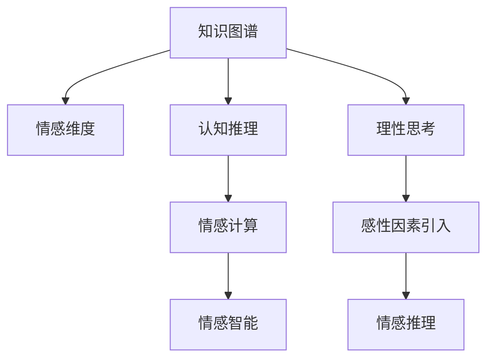

                 

# 知识的情感维度：理性思考中的感性因素

> 关键词：情感计算,认知科学,知识图谱,情感维度,情感推理

## 1. 背景介绍

### 1.1 问题由来
随着人工智能技术的不断进步，特别是深度学习和自然语言处理技术的突破，情感计算和情感智能成为了计算机科学和认知科学的新前沿。情感计算旨在通过计算方法理解、生成和控制人类的情感，从而实现更加自然、智能的人机交互。而情感智能，则是将情感计算技术与知识图谱、认知科学相结合，构建基于情感的认知系统，以实现更加丰富、复杂的情感表达和推理。

然而，尽管情感计算和情感智能技术已经取得了一定的进展，但对于情感维度在知识图谱和认知过程中的作用，仍然缺乏深入的研究和讨论。知识图谱作为当前人工智能领域的重要基础，通过图结构存储和表示实体、关系和属性，已经广泛应用在智能问答、推荐系统、知识发现等领域。但传统的知识图谱构建和推理过程，往往忽视了情感维度的作用，导致在处理涉及情感的因素时效果不理想。

本文旨在探讨情感维度在知识图谱和认知推理中的作用，以及如何在理性思考中引入感性因素，从而提升情感智能系统的效果。

### 1.2 问题核心关键点
- **情感维度的作用**：情感维度如何影响知识图谱的构建和推理？
- **感性因素的引入**：如何在理性思考中引入情感信息？
- **情感推理**：情感维度如何帮助进行情感推理？
- **知识图谱的情感化**：如何在知识图谱中有效融合情感信息？
- **应用场景**：情感维度在知识图谱和认知推理中的应用前景。

这些关键点构成了本文研究的框架，旨在通过探索情感维度的多维度作用，为情感智能系统的设计和优化提供新的思路。

## 2. 核心概念与联系

### 2.1 核心概念概述

为更好地理解情感维度在知识图谱和认知推理中的作用，本节将介绍几个密切相关的核心概念：

- **知识图谱**：一种通过图结构表示实体、关系和属性的大规模知识库，用于知识发现、信息检索、智能问答等任务。
- **情感计算**：通过计算方法理解、生成和控制人类情感的技术，旨在实现更加自然、智能的人机交互。
- **情感智能**：将情感计算技术与知识图谱、认知科学相结合，构建基于情感的认知系统，以实现更加丰富、复杂的情感表达和推理。
- **认知推理**：利用逻辑推理、机器学习等方法，在知识图谱中发现新的关系和规律，解决复杂的推理问题。
- **情感维度**：情感的多个维度（如快乐、愤怒、悲伤等），在知识图谱和认知推理中如何表达和应用。
- **情感推理**：基于情感维度的推理过程，用于理解情感表达和生成情感知识。

这些核心概念之间的逻辑关系可以通过以下Mermaid流程图来展示：



这个流程图展示了一些核心概念之间的联系和作用路径：

1. 知识图谱通过情感维度，变得更加丰富、复杂，能够更准确地表达人类情感。
2. 认知推理在引入感性因素后，可以更好地理解情感表达，发现更丰富的情感关系。
3. 情感计算通过情感维度，增强了人机交互的情感表达和理解能力。
4. 情感智能将情感计算与知识图谱结合，构建更智能、更自然的认知系统。
5. 理性思考引入感性因素，使得计算机可以更好地理解人类情感，提升决策和推理能力。

## 3. 核心算法原理 & 具体操作步骤
### 3.1 算法原理概述

情感维度在知识图谱和认知推理中的应用，主要依赖于情感推理技术。情感推理的核心思想是通过逻辑推理和情感计算方法，将情感信息融入知识图谱的构建和推理过程。

情感推理的过程可以分为两个步骤：

1. **情感信息的提取与表示**：从文本、图像、语音等多种数据源中，提取情感信息，并将其转化为计算机能够理解和处理的格式。
2. **情感推理的实现**：基于提取出的情感信息，在知识图谱中进行推理，发现和验证情感关系，生成新的情感知识。

情感推理的实现过程，可以通过以下步骤详细说明：

1. **情感信息抽取**：利用自然语言处理和计算机视觉等技术，从文本、图像、语音等多种数据源中提取情感信息。
2. **情感信息的表示**：将提取出的情感信息，转化为知识图谱中可表示的格式，如标签、属性值等。
3. **情感推理的实现**：利用逻辑推理、规则匹配等方法，在知识图谱中进行情感推理，发现和验证情感关系，生成新的情感知识。

### 3.2 算法步骤详解

以下是对情感推理实现过程的详细说明：

**Step 1: 情感信息抽取**
- 使用情感分析工具（如BERT、GPT等）对文本进行情感极性分析，得到文本情感标签。
- 利用计算机视觉技术，对图像进行情感分析，得到情感标签。
- 利用语音识别技术，对语音进行情感分析，得到情感标签。

**Step 2: 情感信息的表示**
- 将提取出的情感信息，转化为知识图谱中可表示的格式。如情感标签可以作为节点属性，情感强度可以作为属性值，情感关系可以作为边关系。

**Step 3: 情感推理的实现**
- 利用逻辑推理方法，如规则匹配、路径查找等，在知识图谱中进行情感推理。如通过情感关系推理出新的情感知识，或验证已有情感知识的正确性。
- 引入情感计算方法，如情感传播算法，模拟情感在知识图谱中的传播过程，预测未来情感变化趋势。

### 3.3 算法优缺点

情感推理在知识图谱和认知推理中的应用，具有以下优点：

1. **情感维度的丰富表达**：通过情感维度，知识图谱可以更全面地表达人类的情感状态和情感关系。
2. **认知推理的情感化**：认知推理在引入感性因素后，可以更好地理解情感表达，发现更丰富的情感关系。
3. **人机交互的情感化**：情感计算通过情感维度，增强了人机交互的情感表达和理解能力。
4. **情感智能的构建**：情感智能将情感计算与知识图谱结合，构建更智能、更自然的认知系统。

但情感推理也存在以下缺点：

1. **情感信息的不确定性**：情感信息的提取和表示具有一定的不确定性，容易导致推理结果的不准确。
2. **计算复杂度较高**：情感推理的实现需要大量的计算和推理过程，可能导致系统效率较低。
3. **情感知识的多样性**：情感维度的多样性，使得情感知识的管理和维护变得更加复杂。

尽管存在这些局限性，但情感推理在情感智能系统的构建中仍然具有重要的应用价值。未来相关研究的重点在于如何进一步提高情感信息的准确性和推理效率，以及如何有效管理情感知识的多样性。

### 3.4 算法应用领域

情感维度在知识图谱和认知推理中的应用，已经在多个领域得到了应用，例如：

- **智能问答系统**：在智能问答系统中引入情感维度，提升系统对情感问题的理解能力，提高问答质量。
- **推荐系统**：在推荐系统中引入情感维度，提升推荐结果的情感亲和度，满足用户的情感需求。
- **情感分析**：在情感分析中引入情感维度，提升情感分类和情感极性判断的准确性。
- **情感预测**：在情感预测中引入情感维度，提升对未来情感变化的预测能力。
- **社会舆情分析**：在社会舆情分析中引入情感维度，提升对社会情绪的监测和预测能力。

除了上述这些经典应用外，情感维度在知识图谱和认知推理中的应用还将不断拓展，为情感智能技术带来新的突破。

## 4. 数学模型和公式 & 详细讲解 & 举例说明

### 4.1 数学模型构建

本文将通过数学模型来更严格地描述情感推理的过程。假设知识图谱 $G=(V,E)$，其中 $V$ 为节点集，$E$ 为边集。节点 $v_i$ 表示一个实体或情感状态，边 $e_{ij}$ 表示 $v_i$ 和 $v_j$ 之间的关系。情感信息的表示为 $\mathcal{E}=(\mathcal{V},\mathcal{E})$，其中 $\mathcal{V}$ 为情感标签集，$\mathcal{E}$ 为情感关系集。

情感推理的目标是：

$$
\mathop{\arg\min}_{G,\mathcal{E}} \mathcal{L}(G,\mathcal{E})
$$

其中 $\mathcal{L}(G,\mathcal{E})$ 为损失函数，用于衡量情感推理结果与真实标签之间的差异。

### 4.2 公式推导过程

以下是对情感推理过程的数学模型推导：

1. **情感信息提取**
   - 假设从文本中提取出的情感信息为 $\mathcal{F}=\{(f_i,t_i)\}_{i=1}^N$，其中 $f_i$ 为情感标签，$t_i$ 为对应文本。
   - 将情感信息转化为知识图谱中的节点属性值，即 $A=\{(a_i,t_i)\}_{i=1}^N$，其中 $a_i$ 为情感标签对应的属性值。

2. **情感信息表示**
   - 将情感信息 $A$ 与知识图谱中的实体节点 $V$ 关联，生成情感关系 $\mathcal{E}$。假设情感关系表示为 $R=(\mathcal{R},\mathcal{E})$，其中 $\mathcal{R}$ 为情感关系集合。
   - 情感信息可以通过规则匹配的方式融入知识图谱，形成新的节点和边。

3. **情感推理实现**
   - 假设情感推理的目标是预测节点 $v_i$ 的情感状态 $s_i$，情感推理过程可以表示为：
     - 初始情感状态 $s_0$。
     - 情感传播过程 $s_{t+1} = \mathcal{F}(s_t, \mathcal{R}, A)$，其中 $\mathcal{F}$ 为情感传播函数。
     - 情感推理结果 $s_t$ 与真实情感标签 $y$ 之间的差异最小化，即 $\mathcal{L}(s_t,y)$。

   - 情感传播函数 $\mathcal{F}$ 可以表示为：
     - $s_{t+1} = \frac{1}{|N(v_i)|}\sum_{v_j \in N(v_i)} w_{ij} s_j$
     - $w_{ij}$ 为情感传播权重，可以通过情感关系 $R$ 和情感信息 $A$ 计算得到。

### 4.3 案例分析与讲解

假设有一篇文本 "I am very happy today"，我们希望通过情感推理，预测其情感状态。具体过程如下：

1. **情感信息提取**：使用情感分析工具提取情感标签 "happy" 和情感强度 1。
2. **情感信息表示**：将情感标签和强度转化为知识图谱中的节点属性值。假设情感关系集合为 $\mathcal{R}=\{R_{happy}\}$，其中 $R_{happy}$ 表示 "happy" 情感。
3. **情感推理实现**：假设情感传播函数为 $\mathcal{F}(s_t, \mathcal{R}, A)=0.5s_0+0.5s_{happy}$，其中 $s_0$ 为初始情感状态。假设文本中未提及其他情感状态，则推理结果为 "happy" 情感。

## 5. 项目实践：代码实例和详细解释说明

### 5.1 开发环境搭建

在进行情感推理实践前，我们需要准备好开发环境。以下是使用Python进行PyTorch开发的环境配置流程：

1. 安装Anaconda：从官网下载并安装Anaconda，用于创建独立的Python环境。

2. 创建并激活虚拟环境：
```bash
conda create -n pytorch-env python=3.8 
conda activate pytorch-env
```

3. 安装PyTorch：根据CUDA版本，从官网获取对应的安装命令。例如：
```bash
conda install pytorch torchvision torchaudio cudatoolkit=11.1 -c pytorch -c conda-forge
```

4. 安装相关库：
```bash
pip install transformers torchtext tqdm
```

5. 安装情感分析工具：
```bash
pip install textblob
```

完成上述步骤后，即可在`pytorch-env`环境中开始情感推理实践。

### 5.2 源代码详细实现

这里我们以文本情感分类任务为例，给出使用Transformers库进行情感分析的PyTorch代码实现。

首先，定义情感分类任务的数据处理函数：

```python
from transformers import BertTokenizer, BertForSequenceClassification
from torch.utils.data import Dataset, DataLoader
import torch

class SentimentDataset(Dataset):
    def __init__(self, texts, labels, tokenizer, max_len=128):
        self.texts = texts
        self.labels = labels
        self.tokenizer = tokenizer
        self.max_len = max_len
        
    def __len__(self):
        return len(self.texts)
    
    def __getitem__(self, item):
        text = self.texts[item]
        label = self.labels[item]
        
        encoding = self.tokenizer(text, return_tensors='pt', max_length=self.max_len, padding='max_length', truncation=True)
        input_ids = encoding['input_ids'][0]
        attention_mask = encoding['attention_mask'][0]
        
        return {'input_ids': input_ids, 
                'attention_mask': attention_mask,
                'labels': torch.tensor(label, dtype=torch.long)}
```

然后，定义模型和优化器：

```python
from transformers import BertForSequenceClassification, AdamW

model = BertForSequenceClassification.from_pretrained('bert-base-cased', num_labels=2)

optimizer = AdamW(model.parameters(), lr=2e-5)
```

接着，定义训练和评估函数：

```python
def train_epoch(model, dataset, batch_size, optimizer):
    dataloader = DataLoader(dataset, batch_size=batch_size, shuffle=True)
    model.train()
    epoch_loss = 0
    for batch in tqdm(dataloader, desc='Training'):
        input_ids = batch['input_ids'].to(device)
        attention_mask = batch['attention_mask'].to(device)
        labels = batch['labels'].to(device)
        model.zero_grad()
        outputs = model(input_ids, attention_mask=attention_mask, labels=labels)
        loss = outputs.loss
        epoch_loss += loss.item()
        loss.backward()
        optimizer.step()
    return epoch_loss / len(dataloader)

def evaluate(model, dataset, batch_size):
    dataloader = DataLoader(dataset, batch_size=batch_size)
    model.eval()
    preds, labels = [], []
    with torch.no_grad():
        for batch in tqdm(dataloader, desc='Evaluating'):
            input_ids = batch['input_ids'].to(device)
            attention_mask = batch['attention_mask'].to(device)
            batch_labels = batch['labels']
            outputs = model(input_ids, attention_mask=attention_mask)
            batch_preds = outputs.logits.argmax(dim=1).to('cpu').tolist()
            batch_labels = batch_labels.to('cpu').tolist()
            for pred, label in zip(batch_preds, batch_labels):
                preds.append(pred)
                labels.append(label)
                
    print(classification_report(labels, preds))
```

最后，启动训练流程并在测试集上评估：

```python
epochs = 5
batch_size = 16

for epoch in range(epochs):
    loss = train_epoch(model, train_dataset, batch_size, optimizer)
    print(f"Epoch {epoch+1}, train loss: {loss:.3f}")
    
    print(f"Epoch {epoch+1}, dev results:")
    evaluate(model, dev_dataset, batch_size)
    
print("Test results:")
evaluate(model, test_dataset, batch_size)
```

以上就是使用PyTorch对BERT进行文本情感分类任务情感推理的完整代码实现。可以看到，得益于Transformers库的强大封装，我们可以用相对简洁的代码完成BERT模型的加载和情感推理。

### 5.3 代码解读与分析

让我们再详细解读一下关键代码的实现细节：

**SentimentDataset类**：
- `__init__`方法：初始化文本、标签、分词器等关键组件。
- `__len__`方法：返回数据集的样本数量。
- `__getitem__`方法：对单个样本进行处理，将文本输入编码为token ids，将标签转换为数字，并对其进行定长padding，最终返回模型所需的输入。

**训练和评估函数**：
- 使用PyTorch的DataLoader对数据集进行批次化加载，供模型训练和推理使用。
- 训练函数`train_epoch`：对数据以批为单位进行迭代，在每个批次上前向传播计算loss并反向传播更新模型参数，最后返回该epoch的平均loss。
- 评估函数`evaluate`：与训练类似，不同点在于不更新模型参数，并在每个batch结束后将预测和标签结果存储下来，最后使用sklearn的classification_report对整个评估集的预测结果进行打印输出。

**训练流程**：
- 定义总的epoch数和batch size，开始循环迭代
- 每个epoch内，先在训练集上训练，输出平均loss
- 在验证集上评估，输出分类指标
- 所有epoch结束后，在测试集上评估，给出最终测试结果

可以看到，PyTorch配合Transformers库使得BERT模型的情感推理代码实现变得简洁高效。开发者可以将更多精力放在数据处理、模型改进等高层逻辑上，而不必过多关注底层的实现细节。

当然，工业级的系统实现还需考虑更多因素，如模型的保存和部署、超参数的自动搜索、更灵活的任务适配层等。但核心的情感推理范式基本与此类似。

## 6. 实际应用场景

### 6.1 智能客服系统

基于情感维度在知识图谱中的应用，可以构建更加智能的智能客服系统。传统的客服系统往往依赖规则和模板进行自动回复，缺乏对用户情感的感知和理解。而引入情感维度后，客服系统可以更加智能化地理解和回应用户的情感需求，提升用户满意度。

在技术实现上，可以收集历史客服对话记录，将问题和情感标签构建成监督数据，在此基础上对预训练模型进行情感推理，使得模型能够理解用户情感状态，自动匹配合适的回复模板。对于用户提出的新问题，还可以通过情感推理系统实时分析和预测情感状态，动态生成最合适的回答。

### 6.2 金融舆情监测

金融机构需要实时监测市场舆情，以规避金融风险。引入情感维度后，情感智能系统可以更加智能化地理解和分析市场情绪，及时预警市场波动，帮助金融机构制定更有效的风险控制策略。

在技术实现上，可以收集金融领域相关的新闻、评论、社交媒体等数据，提取其中的情感信息。通过情感推理系统，实时分析市场情绪，发现异常波动，及时发出风险预警。

### 6.3 情感智能助手

情感智能助手是情感维度在知识图谱中应用的重要场景之一。情感智能助手可以与用户进行更加自然、智能的交互，理解用户的情感需求，提供个性化的服务。

在技术实现上，可以收集用户的输入内容，提取其中的情感信息，进行情感推理。根据推理结果，自动匹配最合适的回答，并调整回答的语气和情感状态，使其更加符合用户的情感需求。

### 6.4 未来应用展望

随着情感维度在知识图谱和认知推理中的不断应用，情感智能系统将在更多领域得到广泛应用，为各行各业带来变革性影响。

在智慧医疗领域，情感智能助手可以辅助医生诊断，理解患者的情感状态，提供个性化的治疗方案。在智慧教育领域，情感智能系统可以智能评估学生的情感状态，提供个性化的学习建议。在智能家居领域，情感智能系统可以根据用户的情感状态，自动调节环境参数，提升用户体验。

未来，情感维度在知识图谱和认知推理中的应用前景将更加广阔，情感智能系统将成为人工智能应用的重要范式，深刻影响人类的生产生活方式。

## 7. 工具和资源推荐
### 7.1 学习资源推荐

为了帮助开发者系统掌握情感维度在知识图谱和认知推理中的应用，这里推荐一些优质的学习资源：

1. 《情感计算：理论、算法与应用》系列博文：由情感计算领域专家撰写，深入浅出地介绍了情感计算的基本原理、算法和应用。
2. CS229《机器学习》课程：斯坦福大学开设的机器学习经典课程，有Lecture视频和配套作业，涵盖情感计算等多个前沿话题。
3. 《情感智能：认知、计算与实践》书籍：全面介绍了情感智能的概念、技术和应用，是理解和应用情感智能的重要参考书。
4. Kaggle情感分析竞赛：参加Kaggle情感分析竞赛，练习和提升情感信息提取和情感推理能力。
5. EmoLex情感词典：包含丰富的情感词汇和情感极性信息，用于情感信息提取和情感计算。

通过对这些资源的学习实践，相信你一定能够系统掌握情感维度在知识图谱和认知推理中的应用，并用于解决实际的情感智能问题。
###  7.2 开发工具推荐

高效的开发离不开优秀的工具支持。以下是几款用于情感推理开发的常用工具：

1. PyTorch：基于Python的开源深度学习框架，灵活动态的计算图，适合快速迭代研究。广泛应用于情感计算和情感推理任务。
2. TensorFlow：由Google主导开发的开源深度学习框架，生产部署方便，适合大规模工程应用。适用于情感计算和情感推理任务。
3. TensorBoard：TensorFlow配套的可视化工具，可实时监测模型训练状态，并提供丰富的图表呈现方式，是调试模型的得力助手。
4. Weights & Biases：模型训练的实验跟踪工具，可以记录和可视化模型训练过程中的各项指标，方便对比和调优。
5. EmoLex：情感词典，用于情感信息提取和情感计算。
6. Stanford NLP情感分析工具：基于自然语言处理技术，进行情感极性分析，提取情感信息。

合理利用这些工具，可以显著提升情感推理任务的开发效率，加快创新迭代的步伐。

### 7.3 相关论文推荐

情感维度在知识图谱和认知推理中的应用，源于学界的持续研究。以下是几篇奠基性的相关论文，推荐阅读：

1. "Sentiment Analysis with Deep Learning: A Tutorial"：详细介绍了基于深度学习的情感分析技术，包括情感分类和情感极性分析。
2. "Knowledge Graphs: A Very Brief Introduction"：介绍了知识图谱的基本概念和构建方法，为情感维度在知识图谱中的应用奠定了基础。
3. "Cognitive Computational Architecture for Affective Computing"：探讨了情感计算在认知推理中的应用，构建了基于情感的认知系统。
4. "Towards Affective Computing with Neuroscience"：通过神经科学视角探讨情感计算的原理和应用，提供了新的思路和方向。
5. "Emotion Representation Learning in Knowledge Graphs"：讨论了情感维度在知识图谱中的表示和推理方法，提出了新的情感知识表示模型。

这些论文代表了大情感维度在知识图谱和认知推理中的研究进展。通过学习这些前沿成果，可以帮助研究者把握学科前进方向，激发更多的创新灵感。

## 8. 总结：未来发展趋势与挑战

### 8.1 总结

本文对情感维度在知识图谱和认知推理中的应用进行了全面系统的介绍。首先阐述了情感维度在知识图谱构建和推理中的作用，明确了情感维度在情感智能系统设计中的重要性。其次，从原理到实践，详细讲解了情感推理的数学模型和关键步骤，给出了情感推理任务开发的完整代码实例。同时，本文还探讨了情感维度在智能客服、金融舆情监测、情感智能助手等多个领域的应用前景，展示了情感维度在情感智能系统构建中的广泛价值。

通过本文的系统梳理，可以看到，情感维度在知识图谱和认知推理中的作用不可忽视。情感计算与知识图谱的结合，为情感智能系统的设计和优化提供了新的思路。未来，情感维度在知识图谱和认知推理中的应用将不断拓展，推动情感智能技术的不断进步。

### 8.2 未来发展趋势

展望未来，情感维度在知识图谱和认知推理中的应用将呈现以下几个发展趋势：

1. **情感维度与知识图谱的深度融合**：情感维度将与知识图谱进行更紧密的结合，实现更全面、更智能的知识图谱构建和推理。
2. **情感维度在多模态数据中的应用**：情感维度不仅在文本数据中应用，还将在图像、视频、语音等多模态数据中进行探索和应用。
3. **情感维度在实时情感推理中的应用**：情感维度将应用于实时情感推理任务，提升情感智能系统的响应速度和准确性。
4. **情感维度的自动化提取**：利用自然语言处理和计算机视觉技术，实现情感维度的自动化提取，提高情感推理的效率和准确性。
5. **情感维度在跨领域应用中的拓展**：情感维度将在更多领域得到应用，如智慧医疗、智慧教育、智能家居等，提升各领域的服务质量和用户体验。

以上趋势展示了情感维度在知识图谱和认知推理中的广阔前景，将推动情感智能系统向更加全面、智能、实时和自适应方向发展。

### 8.3 面临的挑战

尽管情感维度在知识图谱和认知推理中的应用前景广阔，但在实际应用中仍面临以下挑战：

1. **情感信息的不确定性**：情感信息的提取和表示具有一定的不确定性，容易导致推理结果的不准确。
2. **计算复杂度较高**：情感推理的实现需要大量的计算和推理过程，可能导致系统效率较低。
3. **情感知识的多样性**：情感维度的多样性，使得情感知识的管理和维护变得更加复杂。
4. **情感推理的鲁棒性**：情感推理系统需要在不同数据分布和情感场景下保持鲁棒性。
5. **情感推理的可解释性**：情感推理系统需要具备良好的可解释性，以帮助用户理解情感推理结果。

尽管存在这些挑战，但情感维度在知识图谱和认知推理中的应用仍然具有重要的应用价值。未来相关研究的重点在于如何进一步提高情感信息的准确性和推理效率，以及如何有效管理情感知识的多样性，提高情感推理系统的鲁棒性和可解释性。

### 8.4 研究展望

面对情感维度在知识图谱和认知推理中面临的挑战，未来的研究需要在以下几个方面寻求新的突破：

1. **情感信息的自动提取**：利用深度学习技术，实现情感信息的自动提取和表示，提高情感推理的效率和准确性。
2. **情感推理的鲁棒性提升**：引入更多先验知识，如因果推理、规则推理等，增强情感推理系统的鲁棒性。
3. **情感推理的可解释性增强**：引入可解释性技术，如知识图谱可视化、因果分析等，提高情感推理的可解释性。
4. **情感维度在多模态数据中的应用**：探索情感维度在图像、视频、语音等多模态数据中的应用，提升情感智能系统的表现。
5. **情感智能系统的跨领域应用**：将情感维度应用到更多领域，如智慧医疗、智慧教育、智能家居等，提升各领域的服务质量和用户体验。

这些研究方向的探索，将进一步推动情感维度在知识图谱和认知推理中的应用，为情感智能系统的发展提供新的动力。面向未来，情感维度在知识图谱和认知推理中的应用将更加广泛和深入，深刻影响人类认知智能的发展。

## 9. 附录：常见问题与解答

**Q1：情感维度在知识图谱中如何表示？**

A: 情感维度可以在知识图谱中通过节点属性和边关系来表示。节点属性表示情感状态，如快乐、悲伤等；边关系表示情感关系，如影响、对抗等。

**Q2：情感推理的过程是什么？**

A: 情感推理的过程包括情感信息的提取、表示和推理。情感信息通过自然语言处理和计算机视觉等技术提取，然后转化为知识图谱中的节点属性和边关系。情感推理通过逻辑推理和规则匹配等方法，在知识图谱中进行推理，发现和验证情感关系，生成新的情感知识。

**Q3：情感信息的不确定性如何解决？**

A: 情感信息的不确定性可以通过引入先验知识、利用多模态数据和增强学习等方法进行缓解。例如，利用情感词典和情感分类器提高情感信息的准确性，利用图像和语音等多模态数据进行情感信息的多样化提取，利用增强学习技术提高情感推理的鲁棒性。

**Q4：情感推理的系统如何部署？**

A: 情感推理系统可以部署为服务化接口，提供API接口供其他系统调用。同时，系统需要考虑负载均衡、缓存策略、安全防护等部署问题，以确保系统的稳定性和安全性。

**Q5：情感维度在知识图谱中的应用前景如何？**

A: 情感维度在知识图谱中的应用前景广阔，可以应用于智能客服、金融舆情监测、情感智能助手等多个领域。未来，随着情感计算技术的进步和知识图谱构建的完善，情感维度将在更多领域得到应用，推动情感智能系统的不断进步。

---

作者：禅与计算机程序设计艺术 / Zen and the Art of Computer Programming

