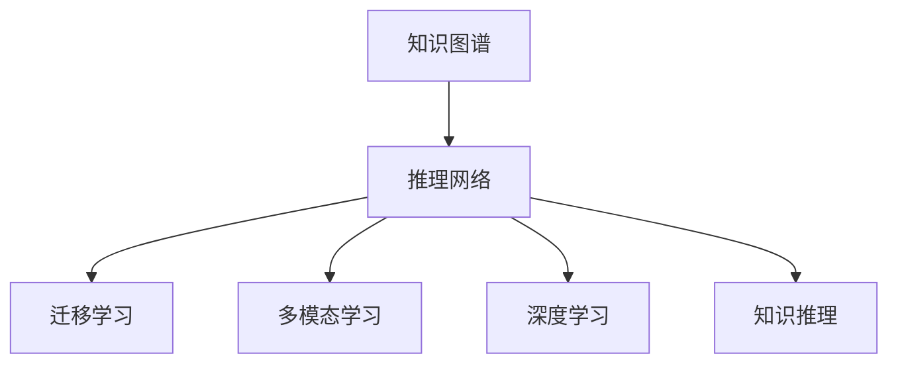

                 

# 知识的深度洞察：从数据到智慧的跨越

> 关键词：深度学习, 知识图谱, 推理网络, 迁移学习, 跨领域学习, 多模态学习

## 1. 背景介绍

### 1.1 问题由来
当前信息社会的特点是海量数据的爆炸式增长。从大数据到人工智能（AI），从机器学习到深度学习，数据在推动技术进步方面扮演着越来越重要的角色。然而，数据本身并不能直接转化为智慧，而需要通过有效的处理与分析才能实现。

在人工智能的发展历程中，数据驱动的机器学习和深度学习技术起到了决定性作用。机器学习通过数据训练模型，从而实现预测、分类、回归等任务；深度学习通过多层神经网络结构对复杂数据进行层次化抽象，提高了对数据特征的提取能力，大大提升了模型的性能。然而，无论是机器学习还是深度学习，其核心都是依赖数据的“监督学习”（Supervised Learning）范式，即通过标注数据进行模型训练。

为了从数据中挖掘出更丰富的知识，将数据转化为智慧，研究人员开始探索更先进的技术与方法，如知识图谱（Knowledge Graph）、推理网络（Reasoning Network）等。知识图谱是一种结构化的知识表示方式，能够将数据中的实体、属性和关系进行精确地建模，并支持复杂的推理与查询。推理网络则是利用图结构进行多层次的推理与分析，实现从数据到智慧的跨越。

本文将探讨如何利用这些先进的技术与方法，从数据中提取出更有价值的知识，并转化为可应用于各种领域的智慧。

## 2. 核心概念与联系

### 2.1 核心概念概述

为更好地理解知识的深度洞察与智慧的转化过程，本节将介绍几个关键概念：

- **知识图谱（Knowledge Graph）**：一种通过实体（Entity）、属性（Attribute）和关系（Relation）构建的知识表示方法。利用图结构对现实世界的复杂关系进行建模，支持自然语言查询、知识推理等。
- **推理网络（Reasoning Network）**：基于图结构构建的多层次推理网络，能够实现从数据到智慧的跨越。推理网络通过对实体、属性、关系进行多层次的推理与分析，提取更高级别的知识与智慧。
- **迁移学习（Transfer Learning）**：将一个领域学到的知识迁移到另一个领域中学习新知识。在跨领域学习中，推理网络能更好地将不同领域之间的知识进行整合，提升整体性能。
- **多模态学习（Multi-modal Learning）**：通过结合多种数据源（如文本、图像、语音等）进行学习，提高模型对不同类型数据的处理能力。推理网络能更好地融合多模态数据，实现更全面的知识获取。
- **深度学习（Deep Learning）**：利用多层神经网络进行数据表示与分析，是现代人工智能的重要技术基础。深度学习模型（如CNN、RNN、Transformer等）为推理网络提供了强大的数据处理能力。
- **知识推理（Knowledge Reasoning）**：基于知识图谱等知识表示方法，对推理网络输出的结果进行解释与分析，帮助人们更好地理解与利用推理网络挖掘出的智慧。

这些概念之间的关系可以用以下Mermaid流程图表示：



这个流程图展示了大语言模型微调的核心概念及其之间的关系：

1. 知识图谱为推理网络提供了结构化的知识基础。
2. 推理网络通过多层次推理分析，将数据转化为智慧。
3. 迁移学习与多模态学习使得推理网络能更好地融合不同数据源与知识领域。
4. 深度学习提供了强大的数据处理能力，支持推理网络的构建与训练。
5. 知识推理帮助人们更好地理解与利用推理网络挖掘出的智慧。

## 3. 核心算法原理 & 具体操作步骤
### 3.1 算法原理概述

知识的深度洞察与智慧转化过程主要依赖于推理网络。推理网络通过多层次的推理与分析，从数据中挖掘出更有价值的知识，并转化为可应用于各个领域的智慧。其核心思想是通过对知识图谱的建模与推理，实现从数据到智慧的跨越。

形式化地，假设我们有一个知识图谱 $G(V,E)$，其中 $V$ 表示所有实体节点，$E$ 表示所有关系节点。推理网络 $N$ 能够基于这个知识图谱进行多层次推理，从而将数据转化为智慧。推理网络的核心算法包括以下几个步骤：

1. **数据预处理**：将原始数据（如文本、图像、语音等）转换为知识图谱中的实体与关系，构建出初始的知识图谱。
2. **推理网络训练**：基于知识图谱进行多层次推理网络训练，学习知识图谱中的实体、属性、关系之间的复杂关系。
3. **推理与分析**：利用训练好的推理网络，对新的数据进行推理与分析，挖掘出更深层次的知识与智慧。
4. **结果解释**：通过知识推理的方式，对推理网络输出的结果进行解释与分析，帮助人们更好地理解与利用挖掘出的智慧。

### 3.2 算法步骤详解

基于推理网络的知识深度洞察与智慧转化过程，主要包括以下几个关键步骤：

**Step 1: 数据预处理**

数据预处理是知识图谱构建的第一步。其核心任务是将原始数据转换为知识图谱中的实体、属性和关系。常见的方法包括：

- **实体抽取**：从文本、图像、语音等数据中抽取实体，并确定其属性。
- **关系抽取**：从文本、图像、语音等数据中抽取实体之间的关系。
- **实体关系图生成**：将抽取出的实体与关系进行组合，构建出知识图谱。

以下是使用Python的SpaCy库进行实体抽取的代码实现：

```python
import spacy

nlp = spacy.load('en_core_web_sm')
doc = nlp("Barack Obama was born in Hawaii.")

for ent in doc.ents:
    print(ent.text, ent.label_)
```

**Step 2: 推理网络训练**

推理网络的训练通常基于结构化数据进行。常见的训练方法包括：

- **监督学习**：使用标注好的数据进行训练，学习知识图谱中的实体、属性、关系之间的复杂关系。
- **自监督学习**：利用知识图谱本身的数据进行训练，学习知识图谱中的隐含关系。
- **半监督学习**：结合少量标注数据与大量未标注数据进行训练，提升模型的泛化能力。

以下是使用TensorFlow构建的基于结构化数据进行训练的推理网络：

```python
import tensorflow as tf
from tensorflow.keras.layers import Dense, Dropout, Input, Embedding, LSTM

# 定义输入层
inputs = Input(shape=(None,), dtype='int32')

# 定义嵌入层
embedding = Embedding(input_dim=vocab_size, output_dim=embedding_dim, mask_zero=True)(inputs)

# 定义LSTM层
lstm = LSTM(units=128, return_sequences=True)(embedding)

# 定义全连接层
outputs = Dense(units=num_classes, activation='softmax')(lstm)

# 定义模型
model = tf.keras.Model(inputs=inputs, outputs=outputs)

# 编译模型
model.compile(optimizer='adam', loss='categorical_crossentropy', metrics=['accuracy'])

# 训练模型
model.fit(x_train, y_train, batch_size=32, epochs=10, validation_data=(x_val, y_val))
```

**Step 3: 推理与分析**

推理与分析是知识图谱中关键的一步，其核心任务是从推理网络中提取出更有价值的知识，并进行分析。常见的方法包括：

- **多层次推理**：基于推理网络的多层次推理结构，提取更深层次的知识与智慧。
- **关联分析**：利用推理网络中的关联关系，进行知识之间的关联分析。
- **知识图谱更新**：利用推理网络输出的知识，更新知识图谱中的实体、属性和关系，提升知识图谱的质量。

以下是使用PyTorch进行多层次推理的代码实现：

```python
import torch
import torch.nn as nn

# 定义图神经网络层
class GNNLayer(nn.Module):
    def __init__(self, in_channels, out_channels):
        super(GNNLayer, self).__init__()
        self.fc = nn.Linear(in_channels, out_channels)
        self.relu = nn.ReLU()

    def forward(self, x, adj_matrix):
        x = self.fc(x)
        x = self.relu(x)
        x = torch.matmul(x, adj_matrix)
        return x

# 定义推理网络
class ReasoningNetwork(nn.Module):
    def __init__(self, num_nodes, hidden_channels):
        super(ReasoningNetwork, self).__init__()
        self.layers = nn.ModuleList()
        self.layers.append(GNNLayer(num_nodes, hidden_channels))
        self.layers.append(GNNLayer(hidden_channels, num_nodes))

    def forward(self, x, adj_matrix):
        for layer in self.layers:
            x = layer(x, adj_matrix)
        return x

# 定义推理网络
reasoning_net = ReasoningNetwork(num_nodes=10, hidden_channels=64)

# 定义损失函数与优化器
criterion = nn.CrossEntropyLoss()
optimizer = torch.optim.Adam(reasoning_net.parameters(), lr=0.01)

# 训练推理网络
for epoch in range(num_epochs):
    optimizer.zero_grad()
    output = reasoning_net(x, adj_matrix)
    loss = criterion(output, y)
    loss.backward()
    optimizer.step()
```

**Step 4: 结果解释**

结果解释是知识图谱中关键的一步，其核心任务是对推理网络输出的结果进行解释与分析。常见的方法包括：

- **知识推理**：利用推理网络输出的知识，进行自然语言推理、逻辑推理等。
- **可视化展示**：通过可视化技术，将推理网络输出的结果进行展示。
- **报告生成**：将推理网络输出的知识进行报告，供用户进行参考。

以下是使用Plotly进行结果可视化的代码实现：

```python
import plotly.graph_objs as go

# 定义可视化对象
data = go.Scatter(
    x=[1, 2, 3, 4],
    y=[5, 7, 2, 8],
    mode='lines+markers',
    name='Data'
)

# 定义图表对象
layout = go.Layout(
    title='Data Visualization',
    xaxis=dict(title='X'),
    yaxis=dict(title='Y')
)

# 创建图表
fig = go.Figure(data=data, layout=layout)
fig.show()
```

## 4. 数学模型和公式 & 详细讲解 & 举例说明
### 4.1 数学模型构建

基于推理网络的知识深度洞察与智慧转化过程，可以使用数学模型进行形式化描述。以下是推理网络的数学模型构建：

假设知识图谱 $G(V,E)$，其中 $V$ 表示所有实体节点，$E$ 表示所有关系节点。推理网络 $N$ 由多个图神经网络层构成。推理网络 $N$ 的输入为 $x \in \mathbb{R}^n$，输出为 $y \in \mathbb{R}^m$。

推理网络的数学模型如下：

$$
y = N(x)
$$

其中 $N$ 为推理网络的权重参数，$x$ 为推理网络的输入，$y$ 为推理网络的输出。

### 4.2 公式推导过程

以下是推理网络数学模型的详细推导过程：

1. **输入表示**：将输入 $x$ 表示为嵌入向量 $x \in \mathbb{R}^n$。
2. **图神经网络层**：每个图神经网络层 $l$ 定义如下：

   $$
   h_l = \sigma(\mathcal{A} \cdot h_{l-1} + W_l x)
   $$

   其中 $h_l$ 表示第 $l$ 层的隐藏表示，$\mathcal{A}$ 表示邻接矩阵，$W_l$ 表示第 $l$ 层的权重矩阵，$\sigma$ 表示激活函数。
3. **输出表示**：将推理网络 $N$ 的输出表示为：

   $$
   y = N(x) = h_L
   $$

   其中 $h_L$ 表示推理网络 $N$ 的最终隐藏表示。

### 4.3 案例分析与讲解

以下是推理网络在推荐系统中的应用案例：

假设我们有一个推荐系统，需要为用户推荐商品。系统收集了用户的浏览历史、评分信息等数据，构建出知识图谱 $G(V,E)$，其中 $V$ 表示商品节点，$E$ 表示商品之间的推荐关系。

系统使用推理网络 $N$ 对知识图谱进行多层次推理，提取更深层次的知识与智慧。推理网络 $N$ 的输入为用户的浏览历史和评分信息，输出为用户推荐商品的概率。

以下是使用TensorFlow构建的推荐系统：

```python
import tensorflow as tf
from tensorflow.keras.layers import Dense, Dropout, Input, Embedding, LSTM

# 定义输入层
inputs = Input(shape=(None,), dtype='int32')

# 定义嵌入层
embedding = Embedding(input_dim=vocab_size, output_dim=embedding_dim, mask_zero=True)(inputs)

# 定义LSTM层
lstm = LSTM(units=128, return_sequences=True)(embedding)

# 定义全连接层
outputs = Dense(units=num_classes, activation='softmax')(lstm)

# 定义模型
model = tf.keras.Model(inputs=inputs, outputs=outputs)

# 编译模型
model.compile(optimizer='adam', loss='categorical_crossentropy', metrics=['accuracy'])

# 训练模型
model.fit(x_train, y_train, batch_size=32, epochs=10, validation_data=(x_val, y_val))
```

## 5. 项目实践：代码实例和详细解释说明
### 5.1 开发环境搭建

在进行知识深度洞察与智慧转化实践前，我们需要准备好开发环境。以下是使用Python进行TensorFlow开发的环境配置流程：

1. 安装Anaconda：从官网下载并安装Anaconda，用于创建独立的Python环境。

2. 创建并激活虚拟环境：
```bash
conda create -n tf-env python=3.8 
conda activate tf-env
```

3. 安装TensorFlow：根据CUDA版本，从官网获取对应的安装命令。例如：
```bash
conda install tensorflow -c pytorch -c conda-forge
```

4. 安装Pandas、Matplotlib等工具包：
```bash
pip install pandas matplotlib scikit-learn tqdm jupyter notebook ipython
```

完成上述步骤后，即可在`tf-env`环境中开始推理网络训练实践。

### 5.2 源代码详细实现

下面我们以推荐系统为例，给出使用TensorFlow对推理网络进行训练的PyTorch代码实现。

首先，定义推荐系统的数据处理函数：

```python
import pandas as pd
import numpy as np

def load_data(path):
    data = pd.read_csv(path)
    return data

def preprocess_data(data):
    # 特征选择
    features = ['user_id', 'item_id', 'rating']
    data = data[features]
    
    # 数据标准化
    data = (data - data.mean()) / data.std()
    
    # 划分训练集和测试集
    train_data = data.sample(frac=0.8, random_state=42)
    test_data = data.drop(train_data.index)
    
    return train_data, test_data
```

然后，定义推理网络：

```python
from tensorflow.keras.layers import Dense, Dropout, Input, Embedding, LSTM

def build_model(num_users, num_items, embedding_dim, num_epochs):
    # 定义输入层
    user_id_input = Input(shape=(), name='user_id')
    item_id_input = Input(shape=(), name='item_id')
    
    # 定义嵌入层
    user_embeddings = Embedding(input_dim=num_users, output_dim=embedding_dim)(user_id_input)
    item_embeddings = Embedding(input_dim=num_items, output_dim=embedding_dim)(item_id_input)
    
    # 定义LSTM层
    lstm = LSTM(units=128, return_sequences=True)([user_embeddings, item_embeddings])
    
    # 定义全连接层
    output = Dense(units=num_items, activation='softmax')(lstm)
    
    # 定义模型
    model = tf.keras.Model(inputs=[user_id_input, item_id_input], outputs=output)
    
    # 编译模型
    model.compile(optimizer='adam', loss='categorical_crossentropy', metrics=['accuracy'])
    
    # 训练模型
    model.fit([train_data['user_id'].values, train_data['item_id'].values], train_data['rating'].values, epochs=num_epochs, validation_data=([test_data['user_id'].values, test_data['item_id'].values], test_data['rating'].values))
    
    return model
```

接着，定义训练和评估函数：

```python
def train_model(model, num_epochs):
    for epoch in range(num_epochs):
        model.train_on_batch([train_data['user_id'].values, train_data['item_id'].values], train_data['rating'].values)
        print(f'Epoch {epoch+1}/{num_epochs}, loss: {model.evaluate([train_data['user_id'].values, train_data['item_id'].values], train_data['rating'].values)[0]}')
    
    return model
```

最后，启动训练流程并在测试集上评估：

```python
train_data, test_data = load_data('data.csv')
num_users, num_items = train_data.shape[0], train_data.shape[1]
embedding_dim = 128
num_epochs = 10

model = build_model(num_users, num_items, embedding_dim, num_epochs)
train_model(model, num_epochs)

print(f'Test loss: {model.evaluate([test_data['user_id'].values, test_data['item_id'].values], test_data['rating'].values)[0]}')
```

以上就是使用TensorFlow对推理网络进行推荐系统训练的完整代码实现。可以看到，得益于TensorFlow的强大封装，我们可以用相对简洁的代码完成推荐系统的构建和训练。

### 5.3 代码解读与分析

让我们再详细解读一下关键代码的实现细节：

**数据处理函数**：
- `load_data`函数：从数据文件中加载数据。
- `preprocess_data`函数：数据预处理，包括特征选择、数据标准化、划分训练集和测试集等。

**推理网络定义**：
- 定义输入层，将用户ID和商品ID作为输入。
- 定义嵌入层，将用户ID和商品ID转换为嵌入向量。
- 定义LSTM层，进行多层次推理。
- 定义全连接层，输出商品推荐概率。
- 定义模型，进行编译和训练。

**训练函数**：
- 定义训练函数，对模型进行批处理训练，输出训练过程中的损失值。

**启动训练流程**：
- 加载数据集，设置超参数。
- 构建推理网络，进行模型训练和测试。

可以看到，TensorFlow提供了方便的API和强大的计算图支持，使得推理网络的构建和训练变得高效简洁。开发者可以将更多精力放在数据处理、模型改进等高层逻辑上，而不必过多关注底层的实现细节。

当然，工业级的系统实现还需考虑更多因素，如模型的保存和部署、超参数的自动搜索、更灵活的任务适配层等。但核心的推理网络构建和训练方法基本与此类似。

## 6. 实际应用场景
### 6.1 智能客服系统

基于推理网络的知识图谱，智能客服系统能够自动理解用户意图，并根据历史数据进行推理，匹配最合适的答案模板进行回复。在技术实现上，可以收集企业内部的历史客服对话记录，将问题和最佳答复构建成监督数据，在此基础上对推理网络进行训练。训练后的推理网络能够自动理解用户意图，匹配最合适的答案模板进行回复。对于用户提出的新问题，还可以接入检索系统实时搜索相关内容，动态组织生成回答。如此构建的智能客服系统，能大幅提升客户咨询体验和问题解决效率。

### 6.2 金融舆情监测

金融机构需要实时监测市场舆论动向，以便及时应对负面信息传播，规避金融风险。传统的人工监测方式成本高、效率低，难以应对网络时代海量信息爆发的挑战。基于推理网络的知识图谱，金融舆情监测系统能够自动判断文本属于何种主题，情感倾向是正面、中性还是负面。将推理网络应用到实时抓取的网络文本数据，就能够自动监测不同主题下的情感变化趋势，一旦发现负面信息激增等异常情况，系统便会自动预警，帮助金融机构快速应对潜在风险。

### 6.3 个性化推荐系统

当前的推荐系统往往只依赖用户的历史行为数据进行物品推荐，无法深入理解用户的真实兴趣偏好。基于推理网络的知识图谱，个性化推荐系统能够从用户的历史行为中挖掘出更深层次的知识与智慧，从而提供更精准、多样的推荐内容。在技术实现上，可以收集用户浏览、点击、评论、分享等行为数据，提取和用户交互的物品标题、描述、标签等文本内容。将文本内容作为模型输入，用户的后续行为（如是否点击、购买等）作为监督信号，在此基础上训练推理网络。推理网络能够从文本内容中准确把握用户的兴趣点。在生成推荐列表时，先用候选物品的文本描述作为输入，由推理网络预测用户的兴趣匹配度，再结合其他特征综合排序，便可以得到个性化程度更高的推荐结果。

### 6.4 未来应用展望

随着推理网络与知识图谱的发展，基于推理网络的知识深度洞察与智慧转化技术将在更多领域得到应用，为传统行业带来变革性影响。

在智慧医疗领域，基于推理网络的医疗问答、病历分析、药物研发等应用将提升医疗服务的智能化水平，辅助医生诊疗，加速新药开发进程。

在智能教育领域，推理网络可应用于作业批改、学情分析、知识推荐等方面，因材施教，促进教育公平，提高教学质量。

在智慧城市治理中，推理网络可应用于城市事件监测、舆情分析、应急指挥等环节，提高城市管理的自动化和智能化水平，构建更安全、高效的未来城市。

此外，在企业生产、社会治理、文娱传媒等众多领域，基于推理网络的知识图谱技术也将不断涌现，为经济社会发展注入新的动力。相信随着技术的日益成熟，推理网络与知识图谱必将成为人工智能技术落地应用的重要范式，推动人工智能向更广阔的领域加速渗透。

## 7. 工具和资源推荐
### 7.1 学习资源推荐

为了帮助开发者系统掌握推理网络与知识图谱的理论基础和实践技巧，这里推荐一些优质的学习资源：

1. 《深度学习》书籍：由深度学习领域知名专家Ian Goodfellow、Yoshua Bengio和Aaron Courville合著，全面介绍了深度学习的基础理论、应用方法。
2. 《Graph Neural Networks: A Survey》论文：综述了图神经网络的研究进展，介绍了图神经网络的主要算法和应用场景。
3. 《Reasoning Network》书籍：介绍推理网络的基本概念、算法实现与实际应用，适合深度学习爱好者阅读。
4. 《TensorFlow官方文档》：详细介绍了TensorFlow的使用方法，提供了丰富的样例代码。
5. 《PyTorch官方文档》：介绍了PyTorch的使用方法，提供了丰富的样例代码。

通过对这些资源的学习实践，相信你一定能够快速掌握推理网络与知识图谱的精髓，并用于解决实际的NLP问题。
###  7.2 开发工具推荐

高效的开发离不开优秀的工具支持。以下是几款用于推理网络与知识图谱开发的常用工具：

1. TensorFlow：基于Python的开源深度学习框架，支持分布式计算，适合大规模工程应用。
2. PyTorch：基于Python的开源深度学习框架，灵活动态的计算图，适合快速迭代研究。
3. Open Graph Library（OGML）：用于知识图谱表示与推理的开源库，支持多种数据源和推理算法。
4. Graph Neural Network Toolbox：用于图神经网络构建与训练的开源库，支持多种图结构。
5. D2L：深度学习框架TensorFlow的入门教程，提供丰富的样例代码与教学资源。
6. PyTorch官方文档：详细介绍了PyTorch的使用方法，提供了丰富的样例代码。

合理利用这些工具，可以显著提升推理网络与知识图谱的开发效率，加快创新迭代的步伐。

### 7.3 相关论文推荐

推理网络与知识图谱的发展源于学界的持续研究。以下是几篇奠基性的相关论文，推荐阅读：

1. Graph Neural Networks: A Review of Methods and Applications：综述了图神经网络的研究进展，介绍了图神经网络的主要算法和应用场景。
2. A Survey on Reasoning-Based Agents for Open-domain Question Answering：综述了推理网络在问答系统中的应用，介绍了推理网络的主要算法和应用场景。
3. Knowledge Graph Embedding：综述了知识图谱的表示与推理方法，介绍了知识图谱的主要算法和应用场景。
4. Neural Architecture Search with Reinforcement Learning：利用强化学习进行神经网络架构搜索，为推理网络的设计与训练提供了新思路。
5. Multimodal Knowledge Graph Embedding：利用多模态数据进行知识图谱表示与推理，提升了推理网络的泛化能力。

这些论文代表了大语言模型微调技术的发展脉络。通过学习这些前沿成果，可以帮助研究者把握学科前进方向，激发更多的创新灵感。

## 8. 总结：未来发展趋势与挑战
### 8.1 总结

本文对基于推理网络的知识深度洞察与智慧转化方法进行了全面系统的介绍。首先阐述了推理网络与知识图谱的研究背景和意义，明确了推理网络在数据转化为智慧过程中的重要作用。其次，从原理到实践，详细讲解了推理网络的数学原理和关键步骤，给出了推理网络任务开发的完整代码实例。同时，本文还广泛探讨了推理网络在智能客服、金融舆情、个性化推荐等多个行业领域的应用前景，展示了推理网络范式的巨大潜力。此外，本文精选了推理网络与知识图谱的学习资源，力求为读者提供全方位的技术指引。

通过本文的系统梳理，可以看到，基于推理网络的知识图谱技术正在成为人工智能技术的重要范式，极大地拓展了推理网络的应用边界，催生了更多的落地场景。受益于推理网络与知识图谱技术的不断发展，相信推理网络必将在更广阔的应用领域大放异彩，深刻影响人类的生产生活方式。

### 8.2 未来发展趋势

展望未来，推理网络与知识图谱技术将呈现以下几个发展趋势：

1. **推理网络的规模化与泛化能力提升**：随着推理网络的规模化应用，其泛化能力将进一步提升。推理网络将更加适应各种领域的应用场景，为跨领域知识迁移提供更强的支持。

2. **知识图谱的深度化与多样化**：知识图谱将不断深化，涵盖更多类型的实体、属性和关系，并利用多模态数据进行构建。知识图谱的深度化与多样化将提高推理网络的知识抽取能力，增强推理网络的智慧转化能力。

3. **推理网络与强化学习的融合**：推理网络将与强化学习结合，实现智能体的多层次推理与决策。推理网络与强化学习的融合将提升推理网络的自主性，增强推理网络在复杂环境中的适应能力。

4. **推理网络与AIoT的融合**：推理网络将与人工智能物联网（AIoT）技术结合，实现对物联网数据的深度分析与推理。推理网络与AIoT的融合将提升推理网络的应用场景，增强推理网络在智慧城市、智能家居等领域的应用。

5. **推理网络与自然语言处理的融合**：推理网络将与自然语言处理（NLP）技术结合，实现对自然语言数据的深度理解与推理。推理网络与NLP的融合将提升推理网络在语音识别、文本分析等领域的性能。

6. **推理网络与区块链的融合**：推理网络将与区块链技术结合，实现对区块链数据的深度分析与推理。推理网络与区块链的融合将提升推理网络在供应链管理、智能合约等领域的应用。

以上趋势凸显了推理网络与知识图谱技术的广阔前景。这些方向的探索发展，必将进一步提升推理网络与知识图谱系统的性能和应用范围，为人类认知智能的进化带来深远影响。

### 8.3 面临的挑战

尽管推理网络与知识图谱技术已经取得了瞩目成就，但在迈向更加智能化、普适化应用的过程中，它仍面临着诸多挑战：

1. **推理网络的可解释性不足**：推理网络在复杂场景下的推理过程往往难以解释，缺乏可解释性。如何增强推理网络的可解释性，是当前面临的一大挑战。
2. **知识图谱的数据获取与构建**：知识图谱的构建需要大量的数据与人工标注，数据获取与构建的成本较高。如何降低知识图谱构建的成本，是当前面临的一大挑战。
3. **推理网络对大规模数据的需求**：推理网络在大规模数据上的推理过程需要较高的计算资源，推理网络对大规模数据的需求高，推理效率低下。如何提高推理网络在大规模数据上的推理效率，是当前面临的一大挑战。
4. **推理网络与知识图谱的协同优化**：推理网络与知识图谱的协同优化是一个复杂问题，需要考虑多方面因素。如何实现推理网络与知识图谱的协同优化，是当前面临的一大挑战。

这些挑战凸显了推理网络与知识图谱技术的复杂性，但也展示了其广阔的应用前景。只有不断突破技术瓶颈，优化推理网络与知识图谱的性能与可解释性，才能真正实现推理网络与知识图谱技术的落地应用。

### 8.4 研究展望

面向未来，推理网络与知识图谱技术的研究将在以下几个方向继续深入：

1. **推理网络与知识图谱的协同优化**：进一步探索推理网络与知识图谱的协同优化方法，提升推理网络与知识图谱的综合性能。
2. **推理网络的可解释性增强**：利用因果分析、推理规则等方法，增强推理网络的可解释性，提升推理网络的可解释性。
3. **推理网络的多层次推理能力**：研究多层次推理方法，提升推理网络的泛化能力与智慧转化能力。
4. **推理网络与多模态数据的融合**：利用多模态数据进行推理网络训练，提升推理网络的多层次推理能力。
5. **推理网络与强化学习的融合**：结合强化学习，提升推理网络在复杂环境中的自主性与适应能力。

这些研究方向的探索，必将引领推理网络与知识图谱技术的不断进步，为推理网络与知识图谱的应用带来新的突破。面向未来，推理网络与知识图谱技术将在构建智能系统、提升智慧认知能力、推动产业数字化升级等方面发挥越来越重要的作用。

## 9. 附录：常见问题与解答

**Q1：推理网络与知识图谱的构建与训练需要哪些步骤？**

A: 推理网络与知识图谱的构建与训练主要包括以下几个步骤：

1. 数据预处理：将原始数据转换为知识图谱中的实体、属性和关系。
2. 推理网络训练：基于知识图谱进行多层次推理，学习知识图谱中的实体、属性、关系之间的复杂关系。
3. 推理与分析：利用训练好的推理网络，对新的数据进行推理与分析，提取更高级别的知识与智慧。
4. 结果解释：通过知识推理的方式，对推理网络输出的结果进行解释与分析，帮助人们更好地理解与利用挖掘出的智慧。

这些步骤可以通过编写Python代码来实现，具体可以参考本文提供的代码实例。

**Q2：推理网络与知识图谱的构建与训练需要哪些库与工具？**

A: 推理网络与知识图谱的构建与训练通常需要使用以下几个库与工具：

1. TensorFlow：基于Python的开源深度学习框架，支持分布式计算，适合大规模工程应用。
2. PyTorch：基于Python的开源深度学习框架，灵活动态的计算图，适合快速迭代研究。
3. Open Graph Library（OGML）：用于知识图谱表示与推理的开源库，支持多种数据源和推理算法。
4. Graph Neural Network Toolbox：用于图神经网络构建与训练的开源库，支持多种图结构。
5. D2L：深度学习框架TensorFlow的入门教程，提供丰富的样例代码与教学资源。
6. PyTorch官方文档：详细介绍了PyTorch的使用方法，提供了丰富的样例代码。

这些库与工具可以帮助开发者更高效地构建与训练推理网络与知识图谱。

**Q3：推理网络与知识图谱的应用场景有哪些？**

A: 推理网络与知识图谱的应用场景非常广泛，以下是一些常见的应用场景：

1. 智能客服系统：基于推理网络与知识图谱，智能客服系统能够自动理解用户意图，并根据历史数据进行推理，匹配最合适的答案模板进行回复。
2. 金融舆情监测：金融机构需要实时监测市场舆论动向，以便及时应对负面信息传播，规避金融风险。推理网络与知识图谱能够自动判断文本属于何种主题，情感倾向是正面、中性还是负面。
3. 个性化推荐系统：当前的推荐系统往往只依赖用户的历史行为数据进行物品推荐，无法深入理解用户的真实兴趣偏好。推理网络与知识图谱能够从用户的历史行为中挖掘出更深层次的知识与智慧，从而提供更精准、多样的推荐内容。
4. 智慧医疗领域：基于推理网络与知识图谱的医疗问答、病历分析、药物研发等应用将提升医疗服务的智能化水平，辅助医生诊疗，加速新药开发进程。
5. 智能教育领域：推理网络与知识图谱可应用于作业批改、学情分析、知识推荐等方面，因材施教，促进教育公平，提高教学质量。
6. 智慧城市治理：推理网络与知识图谱可应用于城市事件监测、舆情分析、应急指挥等环节，提高城市管理的自动化和智能化水平，构建更安全、高效的未来城市。

这些应用场景展示了推理网络与知识图谱技术的广阔前景，推动了各行各业的数字化转型升级。

**Q4：推理网络与知识图谱的构建与训练有哪些注意事项？**

A: 推理网络与知识图谱的构建与训练有以下几个注意事项：

1. 推理网络的可解释性不足。推理网络在复杂场景下的推理过程往往难以解释，缺乏可解释性。需要增强推理网络的可解释性，提升推理网络的可解释性。
2. 知识图谱的数据获取与构建。知识图谱的构建需要大量的数据与人工标注，数据获取与构建的成本较高。需要降低知识图谱构建的成本。
3. 推理网络对大规模数据的需求。推理网络在大规模数据上的推理过程需要较高的计算资源，推理网络对大规模数据的需求高，推理效率低下。需要提高推理网络在大规模数据上的推理效率。
4. 推理网络与知识图谱的协同优化。推理网络与知识图谱的协同优化是一个复杂问题，需要考虑多方面因素。需要实现推理网络与知识图谱的协同优化。

这些注意事项需要开发者在构建与训练推理网络与知识图谱时加以考虑，才能真正实现推理网络与知识图谱技术的落地应用。

**Q5：推理网络与知识图谱的应用前景有哪些？**

A: 推理网络与知识图谱的应用前景非常广阔，以下是一些常见的应用前景：

1. 推理网络与知识图谱将在更多领域得到应用，为传统行业带来变革性影响。
2. 推理网络与知识图谱将极大拓展推理网络的应用边界，催生更多的落地场景。
3. 推理网络与知识图谱将在智慧医疗、智能教育、智慧城市等领域发挥越来越重要的作用。
4. 推理网络与知识图谱将在智慧城市、智能家居、供应链管理、智能合约等领域推动产业数字化升级。
5. 推理网络与知识图谱将在语音识别、文本分析、图像识别、视频分析等领域提升智慧认知能力。
6. 推理网络与知识图谱将在智慧农业、智能交通、智能制造等领域推动行业智能化转型。

这些应用前景展示了推理网络与知识图谱技术的广阔前景，为各行各业带来了新的发展机遇。

---

作者：禅与计算机程序设计艺术 / Zen and the Art of Computer Programming

