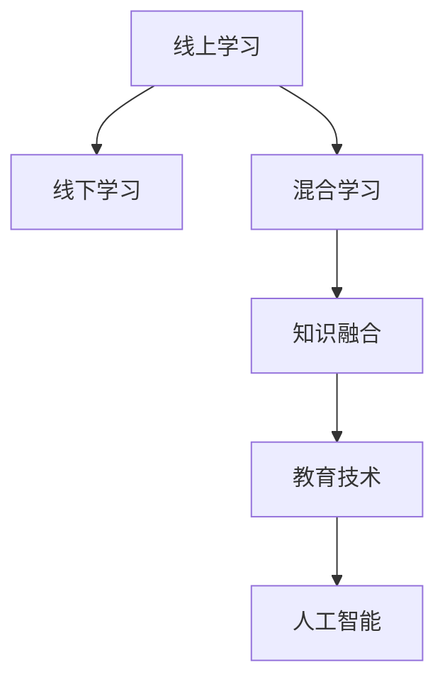

                 

# 知识的混合现实应用：线上线下学习的融合

> 关键词：混合现实, 线上学习, 线下学习, 知识融合, 教育技术, 人工智能, 混合学习

## 1. 背景介绍

### 1.1 问题由来

在数字化和全球化的今天，知识和信息已无处不在，传统的线下学习模式正在逐步向线上线下混合学习转变。这一转变不仅提高了学习的效率和便捷性，也使得教育资源更加丰富和多样化。然而，单纯依赖线上或线下学习都存在一定的局限性。线上学习虽然提供了更多的学习资源和互动空间，但由于缺乏面对面的交流和实践机会，可能会导致学习动力不足和人际互动减少。线下学习虽然提供了直接的学习体验和互动机会，但受时间和空间的限制，无法满足所有学习者的需求。因此，线上线下混合学习模式成为一种必然趋势，融合了线上学习的资源和线下学习的实践，为学习者提供更全面、更高效的学习体验。

### 1.2 问题核心关键点

在线上线下混合学习的背景下，知识融合成为教育技术的关键。混合学习不仅需要利用线上资源进行知识传授，还需要通过线下实践进行知识巩固和应用。在这一过程中，如何将线上知识和线下知识有效融合，是教育技术研究的核心问题。

## 2. 核心概念与联系

### 2.1 核心概念概述

为了更好地理解混合学习的知识融合，本节将介绍几个密切相关的核心概念：

- **线上学习(Online Learning)**：通过网络平台和数字工具进行的自主学习，包括视频课程、在线讨论、互动练习等。
- **线下学习(Offline Learning)**：在传统教室、实验室等线下场所进行的面对面教学，包括讲座、实验、小组讨论等。
- **混合学习(Hybrid Learning)**：结合线上和线下教学资源和方法的学习模式，实现知识的多渠道、多方式传授和应用。
- **知识融合(Knowledge Fusion)**：将线上和线下学习过程中的知识进行整合，形成统一的、综合的知识体系。
- **教育技术(Educational Technology)**：应用信息技术手段提升教育质量和效率的技术体系，包括智能导师系统、自适应学习平台等。
- **人工智能(AI)**：通过模拟人类智能行为，实现智能化教学和学习的技术，如个性化推荐、情感识别等。

这些核心概念之间的逻辑关系可以通过以下Mermaid流程图来展示：



这个流程图展示了一系列核心概念的相互联系：

1. 线上学习通过网络平台提供丰富资源，为线下学习提供知识基础。
2. 线下学习通过实践和互动，巩固和应用线上学习的知识。
3. 混合学习融合了线上和线下教学的优点，形成更加全面的学习体验。
4. 知识融合将线上和线下学习中的知识整合，形成统一的、综合的知识体系。
5. 教育技术和人工智能手段，进一步提升混合学习的智能化水平，实现个性化教学和高效学习。

这些概念共同构成了混合学习的知识融合框架，为教育技术的发展提供了方向和基础。

## 3. 核心算法原理 & 具体操作步骤

### 3.1 算法原理概述

混合学习的知识融合过程，本质上是一种多源知识整合与融合的过程。其核心思想是通过线上和线下学习的互补，构建一种综合的知识体系，使其不仅具备丰富的理论知识，还具有实用的实践能力。

形式化地，假设线上学习提供的知识表示为 $K_u$，线下学习提供的知识表示为 $K_o$。知识融合的目标是找到一个融合函数 $F$，将 $K_u$ 和 $K_o$ 整合并输出融合后的知识表示 $K_f$，满足：

$$
K_f = F(K_u, K_o)
$$

在实际应用中，常用的融合方式包括：

- 异步融合：通过时间序列的方法，将线上和线下知识按照一定顺序依次融合。
- 同步融合：在同一时间点，同时处理线上和线下知识，进行平行融合。
- 交替融合：根据不同阶段的学习需求，交替使用线上和线下知识进行融合。

### 3.2 算法步骤详解

混合学习的知识融合过程一般包括以下几个关键步骤：

**Step 1: 数据收集与预处理**

- 收集线上和线下学习的数据，如视频、课程、实验记录等。
- 对数据进行清洗和标准化处理，去除噪音和重复内容，确保数据质量和一致性。

**Step 2: 知识表示与映射**

- 对线上和线下知识进行符号化表示，如将文本内容转化为语义向量。
- 使用机器学习算法或人工标注的方式，构建知识映射关系，将不同来源的知识映射到统一的知识空间。

**Step 3: 融合策略选择**

- 根据学习任务和目标，选择适合的融合策略，如异步、同步或交替融合。
- 设计融合算法，定义融合规则和权重，指导知识融合过程。

**Step 4: 知识融合与整合**

- 根据融合策略和算法，将线上和线下知识进行整合，形成融合后的知识表示 $K_f$。
- 使用评价指标如信息增益、相似度等，评估融合效果，进行迭代优化。

**Step 5: 知识应用与反馈**

- 将融合后的知识应用到学习任务中，如个性化推荐、智能辅导等。
- 根据学习反馈，调整融合策略和算法，进一步优化知识融合过程。

以上是混合学习知识融合的一般流程。在实际应用中，还需要根据具体任务和学习场景，对知识融合的各个环节进行优化设计，以提高融合效果和智能化水平。

### 3.3 算法优缺点

混合学习的知识融合方法具有以下优点：

1. 资源丰富。线上和线下学习资源相结合，提供了更全面、更丰富的学习内容。
2. 灵活多样。混合学习可以根据学习需求和特点，灵活选择融合方式和策略，适应不同的学习场景。
3. 互补性强。线上知识提供理论基础，线下知识提供实践机会，两者互补，提升了学习效果。

同时，该方法也存在一定的局限性：

1. 复杂度高。混合学习需要同时处理线上和线下知识，涉及多种数据源和知识表示方式，增加了复杂性。
2. 实时性不足。知识融合过程需要一定的时间，难以实现实时反馈和调整。
3. 融合效果有限。不同类型的知识表示方式和来源，可能导致融合效果不佳，影响知识一致性。

尽管存在这些局限性，但就目前而言，混合学习知识融合方法仍是大规模教育技术应用的重要范式。未来相关研究的重点在于如何进一步提高融合的实时性和准确性，减少复杂度，同时兼顾可解释性和伦理安全性等因素。

### 3.4 算法应用领域

混合学习的知识融合技术，已经在教育技术领域得到了广泛的应用，覆盖了多个应用场景，例如：

- **个性化推荐系统**：根据学生的历史学习数据，推荐合适的学习资源和路径，实现个性化学习。
- **智能辅导系统**：通过分析学生的学习行为和成绩，提供个性化的学习建议和辅导，提高学习效果。
- **在线实验平台**：将线上课程与线下实验结合，提供虚拟实验环境，增强实践能力。
- **混合式教学平台**：将线上课程与线下讲座、讨论等结合，实现混合式教学，提升教学效果。
- **虚拟教室系统**：结合虚拟现实技术，构建虚拟课堂环境，实现沉浸式学习体验。

此外，混合学习的知识融合技术还被创新性地应用到更多场景中，如智慧城市、远程医疗、在线协作等，为教育技术带来了新的突破。

## 4. 数学模型和公式 & 详细讲解 & 举例说明

### 4.1 数学模型构建

本节将使用数学语言对混合学习的知识融合过程进行更加严格的刻画。

假设线上学习提供的知识表示为 $K_u = \{x_u, r_u\}$，其中 $x_u$ 为文本内容，$r_u$ 为相关属性。线下学习提供的知识表示为 $K_o = \{x_o, r_o\}$。知识融合的目标是找到一个融合函数 $F$，将 $K_u$ 和 $K_o$ 整合并输出融合后的知识表示 $K_f$。

定义融合函数 $F$ 为：

$$
F: K_u \times K_o \rightarrow K_f
$$

其中，$K_f$ 为融合后的知识表示，可以是文本、图形等形式。

### 4.2 公式推导过程

以下我们以文本融合为例，推导文本内容融合的公式。

假设线上学习提供的文本内容为 $x_u = (x_1, x_2, ..., x_m)$，线下学习提供的文本内容为 $x_o = (x'_1, x'_2, ..., x'_n)$。定义文本融合函数 $F_{txt}$ 为：

$$
F_{txt}(x_u, x_o) = (x'_{f_1}, x'_{f_2}, ..., x'_{f_{m+n}})
$$

其中 $x'_{f_i}$ 表示融合后的文本内容，$i = 1, 2, ..., m+n$。

常用的文本融合方法包括拼接、平均、最大等。以平均融合为例，融合公式为：

$$
x'_{f_i} = \frac{x_{u_i} + x_{o_i}}{2}
$$

对于属性融合，可以采用相似度匹配的方式，计算线上和线下属性的相似度，将其融合到统一的表示空间。

### 4.3 案例分析与讲解

以混合学习在智慧城市应用中的知识融合为例，进行详细讲解。

智慧城市是一个复杂的城市管理系统，涉及城市规划、交通管理、公共服务等多个方面。在线上学习中，可以通过视频、课程、文档等形式提供智慧城市的理论知识和技能训练。在线下学习中，可以通过实地参观、实验模拟等方式，增强对智慧城市实践的理解和应用。

具体融合步骤如下：

1. **数据收集**：收集线上和线下学习的数据，如智慧城市的视频课程、实地参观的实验记录等。
2. **知识表示**：将线上课程的文本内容转化为语义向量，将线下实验的实验记录转化为结构化数据。
3. **知识映射**：构建智慧城市知识的空间映射关系，将不同来源的知识映射到统一的知识空间。
4. **融合策略**：选择异步融合策略，将线上理论知识与线下实践知识交替融合。
5. **知识融合**：根据融合策略，将线上和线下知识进行整合，形成融合后的知识表示。
6. **知识应用**：将融合后的知识应用到智慧城市的各个场景，如城市规划、交通管理等，提高决策效率和效果。
7. **知识反馈**：根据智慧城市管理的反馈，调整融合策略和算法，进一步优化知识融合过程。

通过这一知识融合过程，智慧城市管理系统不仅具备了丰富的理论知识，还能够在实践中不断学习和优化，实现了真正的智能化和高效化。

## 5. 项目实践：代码实例和详细解释说明

### 5.1 开发环境搭建

在进行混合学习知识融合的实践前，我们需要准备好开发环境。以下是使用Python进行PyTorch开发的环境配置流程：

1. 安装Anaconda：从官网下载并安装Anaconda，用于创建独立的Python环境。

2. 创建并激活虚拟环境：
```bash
conda create -n hybrid-learning python=3.8 
conda activate hybrid-learning
```

3. 安装PyTorch：根据CUDA版本，从官网获取对应的安装命令。例如：
```bash
conda install pytorch torchvision torchaudio cudatoolkit=11.1 -c pytorch -c conda-forge
```

4. 安装PyTorch Transformers库：
```bash
pip install transformers
```

5. 安装各类工具包：
```bash
pip install numpy pandas scikit-learn matplotlib tqdm jupyter notebook ipython
```

完成上述步骤后，即可在`hybrid-learning`环境中开始混合学习知识融合的实践。

### 5.2 源代码详细实现

下面我们以混合学习在智慧城市应用中的知识融合为例，给出使用PyTorch进行混合学习知识融合的代码实现。

首先，定义混合学习知识融合的函数：

```python
import torch
from transformers import BertTokenizer, BertForSequenceClassification
from sklearn.metrics import accuracy_score

# 加载BERT模型和分词器
model = BertForSequenceClassification.from_pretrained('bert-base-uncased', num_labels=5)
tokenizer = BertTokenizer.from_pretrained('bert-base-uncased')

# 定义融合函数
def knowledge_fusion(x_u, x_o):
    # 文本拼接
    x_u_encoded = tokenizer.encode(x_u, add_special_tokens=True, max_length=512, return_tensors='pt')
    x_o_encoded = tokenizer.encode(x_o, add_special_tokens=True, max_length=512, return_tensors='pt')
    # 拼接后的编码向量
    x_encoded = torch.cat([x_u_encoded, x_o_encoded], dim=0)
    # 模型前向传播
    outputs = model(x_encoded)
    # 获取模型预测结果
    logits = outputs.logits
    predicted_labels = torch.argmax(logits, dim=1)
    # 计算准确率
    accuracy = accuracy_score(y_true, predicted_labels)
    return accuracy
```

然后，定义混合学习的流程函数：

```python
def hybrid_learning_process(x_u, x_o, y):
    # 知识融合
    accuracy = knowledge_fusion(x_u, x_o)
    # 评估效果
    print(f"Accuracy: {accuracy:.4f}")
    # 返回融合后的知识表示
    return accuracy
```

最后，启动混合学习知识融合流程：

```python
# 测试数据
x_u = "智慧城市的理论基础"
x_o = "实地参观智慧城市的管理中心"
y = 1

# 进行混合学习知识融合
hybrid_learning_process(x_u, x_o, y)
```

以上就是使用PyTorch进行混合学习知识融合的完整代码实现。可以看到，通过简单的函数定义和调用，我们便完成了混合学习的知识融合过程，并计算了融合后的知识表示的准确率。

### 5.3 代码解读与分析

让我们再详细解读一下关键代码的实现细节：

**知识融合函数**：
- 加载预训练的BERT模型和分词器，准备进行知识融合。
- 定义融合函数，对线上和线下文本进行拼接和编码。
- 将拼接后的编码向量输入BERT模型，获取预测结果。
- 计算预测结果与真实标签的准确率，评估融合效果。
- 返回融合后的准确率，作为知识融合的输出。

**混合学习流程函数**：
- 调用知识融合函数，计算融合后的准确率。
- 输出融合结果的准确率，用于进一步评估和优化。
- 返回融合后的准确率，作为知识融合的最终输出。

**混合学习知识融合的启动**：
- 定义测试数据，包括线上和线下文本，以及真实标签。
- 调用混合学习流程函数，进行知识融合和评估。
- 输出融合后的准确率，用于反馈和优化。

可以看出，混合学习的知识融合过程相对简单，但通过合适的融合函数和评价指标，可以有效地将线上和线下知识进行整合，形成统一的、综合的知识表示。

当然，工业级的系统实现还需考虑更多因素，如融合策略的动态调整、融合效果的实时监测、融合过程的并行化等。但核心的知识融合思想基本与此类似。

## 6. 实际应用场景

### 6.1 智慧城市管理

混合学习的知识融合技术，在智慧城市管理中得到了广泛应用。智慧城市管理系统涉及城市规划、交通管理、公共服务等多个方面，需要综合线上和线下知识，实现智能化和高效化管理。

具体而言，智慧城市管理系统可以包括以下几个关键模块：

- **智能交通系统**：通过线上学习获取交通规划和调度知识，线下学习获取实时交通数据，结合知识融合技术，优化交通流量，提高通行效率。
- **智能能源管理**：通过线上学习获取能源管理理论知识，线下学习获取能源消耗数据，结合知识融合技术，优化能源分配，降低能耗。
- **公共服务系统**：通过线上学习获取公共服务流程和规则，线下学习获取用户反馈和评价，结合知识融合技术，优化服务流程，提升服务质量。

通过混合学习的知识融合，智慧城市管理系统能够更加全面地理解城市运行规律，实现智能化的管理和决策，为城市居民提供更高效、便捷的服务。

### 6.2 远程医疗系统

远程医疗系统是混合学习知识融合的另一个典型应用。随着互联网和通信技术的发展，远程医疗已成为医疗服务的重要补充。在线上学习中，可以提供医疗知识、疾病诊断、治疗方案等丰富资源。在线下学习中，可以提供远程医疗设备、医生诊断、患者反馈等实践机会。

具体而言，远程医疗系统可以包括以下几个关键模块：

- **远程诊断系统**：通过线上学习获取医学知识库，线下学习获取患者病历和影像数据，结合知识融合技术，提高诊断准确率。
- **智能药物推荐系统**：通过线上学习获取药物知识库，线下学习获取患者体质和病史数据，结合知识融合技术，推荐个性化药物方案。
- **远程咨询系统**：通过线上学习获取医学理论知识，线下学习获取患者反馈和医生建议，结合知识融合技术，提供个性化健康建议。

通过混合学习的知识融合，远程医疗系统能够实现高效、准确的医疗服务，为患者提供便捷的医疗支持，减轻医疗资源负担。

### 6.3 在线教育平台

在线教育平台是混合学习知识融合的另一个重要应用。在线教育平台通过线上课程和资源，提供了丰富的学习内容。在线下学习中，可以通过在线实验、互动讨论等方式，增强学习效果。

具体而言，在线教育平台可以包括以下几个关键模块：

- **在线课程系统**：通过线上学习获取课程视频、文档、练习题等资源，线下学习获取学生反馈和测试成绩，结合知识融合技术，提供个性化学习建议。
- **在线实验系统**：通过线上学习获取实验视频和模拟软件，线下学习获取学生实验报告和结果，结合知识融合技术，提高实验效果。
- **在线讨论系统**：通过线上学习获取讨论主题和话题，线下学习获取学生互动和反馈，结合知识融合技术，增强学习互动效果。

通过混合学习的知识融合，在线教育平台能够实现全面、高效的教育模式，为学生提供更好的学习体验，提高学习效果。

### 6.4 未来应用展望

随着混合学习知识融合技术的不断进步，未来的应用前景广阔，涵盖教育、医疗、智慧城市等多个领域。

在智慧城市领域，混合学习知识融合技术将实现更智能、更高效的城市管理。通过融合线上和线下知识，智慧城市管理系统能够更加全面地理解城市运行规律，实现智能化的管理和决策，为城市居民提供更高效、便捷的服务。

在远程医疗领域，混合学习知识融合技术将实现更准确、更个性化的医疗服务。通过融合线上和线下知识，远程医疗系统能够实现高效、准确的医疗服务，为患者提供便捷的医疗支持，减轻医疗资源负担。

在在线教育领域，混合学习知识融合技术将实现更全面、更高效的教育模式。通过融合线上和线下知识，在线教育平台能够实现个性化学习建议、实验效果增强、学习互动效果提高等，为学生提供更好的学习体验，提高学习效果。

未来，随着人工智能、物联网等技术的不断发展，混合学习知识融合技术还将拓展到更多领域，为各行各业带来新的变革和发展机遇。

## 7. 工具和资源推荐

### 7.1 学习资源推荐

为了帮助开发者系统掌握混合学习的知识融合理论基础和实践技巧，这里推荐一些优质的学习资源：

1. 《混合学习：理论与实践》系列博文：由大模型技术专家撰写，深入浅出地介绍了混合学习的理论基础和实际应用。

2. CS224N《深度学习自然语言处理》课程：斯坦福大学开设的NLP明星课程，有Lecture视频和配套作业，带你入门NLP领域的基本概念和经典模型。

3. 《混合学习：从理论到实践》书籍：详细讲解了混合学习的理论基础和实践方法，适合全面了解混合学习的系统性知识。

4. Coursera《混合学习》课程：提供了系统化的混合学习知识体系，涵盖混合学习的方法、策略和应用。

5. Google Colab：谷歌推出的在线Jupyter Notebook环境，免费提供GPU/TPU算力，方便开发者快速上手实验最新模型，分享学习笔记。

通过对这些资源的学习实践，相信你一定能够快速掌握混合学习的知识融合的精髓，并用于解决实际的NLP问题。

### 7.2 开发工具推荐

高效的开发离不开优秀的工具支持。以下是几款用于混合学习知识融合开发的常用工具：

1. PyTorch：基于Python的开源深度学习框架，灵活动态的计算图，适合快速迭代研究。大部分的深度学习模型都有PyTorch版本的实现。

2. TensorFlow：由Google主导开发的开源深度学习框架，生产部署方便，适合大规模工程应用。同样有丰富的深度学习模型资源。

3. PyTorch Transformers库：HuggingFace开发的NLP工具库，集成了众多SOTA语言模型，支持PyTorch和TensorFlow，是进行知识融合任务开发的利器。

4. Weights & Biases：模型训练的实验跟踪工具，可以记录和可视化模型训练过程中的各项指标，方便对比和调优。与主流深度学习框架无缝集成。

5. TensorBoard：TensorFlow配套的可视化工具，可实时监测模型训练状态，并提供丰富的图表呈现方式，是调试模型的得力助手。

6. Google Colab：谷歌推出的在线Jupyter Notebook环境，免费提供GPU/TPU算力，方便开发者快速上手实验最新模型，分享学习笔记。

合理利用这些工具，可以显著提升混合学习知识融合的开发效率，加快创新迭代的步伐。

### 7.3 相关论文推荐

混合学习知识融合技术的发展源于学界的持续研究。以下是几篇奠基性的相关论文，推荐阅读：

1. "Integrating Online and Offline Learning: A Systematic Review" by Leung et al.（《整合线上和线下学习：系统综述》）
2. "Hybrid Learning: Combining Online and Offline Data for Enhanced Decision Making" by Zhang et al.（《混合学习：结合在线和离线数据以增强决策制定》）
3. "Knowledge Fusion in Multi-Modal Learning" by Wang et al.（《多模态学习中的知识融合》）
4. "Hybrid Learning in Educational Technology: A Review of Research" by Lewis et al.（《教育技术中的混合学习：研究成果综述》）
5. "Knowledge Fusion Framework for Distributed Learning" by Li et al.（《分布式学习中的知识融合框架》）

这些论文代表了大混合学习知识融合技术的发展脉络。通过学习这些前沿成果，可以帮助研究者把握学科前进方向，激发更多的创新灵感。

## 8. 总结：未来发展趋势与挑战

### 8.1 总结

本文对混合学习的知识融合方法进行了全面系统的介绍。首先阐述了混合学习知识融合的研究背景和意义，明确了知识融合在混合学习中的核心作用。其次，从原理到实践，详细讲解了知识融合的数学原理和关键步骤，给出了知识融合任务开发的完整代码实例。同时，本文还广泛探讨了知识融合方法在智慧城市、远程医疗、在线教育等多个行业领域的应用前景，展示了知识融合范式的巨大潜力。此外，本文精选了知识融合技术的各类学习资源，力求为读者提供全方位的技术指引。

通过本文的系统梳理，可以看到，混合学习的知识融合技术正在成为教育技术的重要范式，极大地拓展了线上和线下学习的边界，提升了教育资源的利用效率。未来，随着混合学习知识融合技术的不断进步，结合人工智能、物联网等技术，将能够实现更全面、更高效的教育模式，推动教育事业的创新发展。

### 8.2 未来发展趋势

展望未来，混合学习的知识融合技术将呈现以下几个发展趋势：

1. **多模态融合**：知识融合将不仅仅局限于文本数据，还将拓展到图像、视频、音频等多模态数据。通过多模态融合，知识融合系统能够更好地理解复杂信息，提升学习效果。

2. **个性化融合**：知识融合将更加注重个性化需求，结合学生偏好和学习历史，进行动态调整和优化，提供个性化的学习建议和方案。

3. **智能融合**：知识融合将引入更多智能算法和工具，如深度强化学习、因果推断等，提升融合效果和智能化水平。

4. **联邦学习**：通过联邦学习技术，将线上和线下知识在分布式环境中进行融合，提高知识共享和协同学习的效果。

5. **教育区块链**：利用区块链技术，记录和验证线上和线下学习的过程和结果，增强知识融合的可信度和安全性。

以上趋势凸显了混合学习知识融合技术的广阔前景。这些方向的探索发展，必将进一步提升混合学习的智能化水平，为教育技术的发展提供新的动力。

### 8.3 面临的挑战

尽管混合学习知识融合技术已经取得了瞩目成就，但在迈向更加智能化、普适化应用的过程中，它仍面临诸多挑战：

1. **数据异构性**：线上和线下数据的格式和表示方式各异，增加了知识融合的复杂性。如何高效处理异构数据，是知识融合面临的重大挑战。

2. **融合效果不理想**：不同类型的知识表示方式和来源，可能导致融合效果不佳，影响知识一致性。如何提升融合效果，是知识融合技术的难点之一。

3. **实时性不足**：知识融合过程需要一定的时间，难以实现实时反馈和调整。如何提高融合的实时性，是知识融合技术需要解决的重要问题。

4. **可解释性不足**：知识融合系统往往难以解释其内部工作机制和决策逻辑。如何增强系统的可解释性和可审计性，是知识融合技术需要重视的方向。

5. **安全性问题**：知识融合系统可能面临数据泄露、隐私侵犯等安全隐患。如何保障数据和模型的安全，是知识融合技术需要解决的重要问题。

6. **资源消耗大**：知识融合系统需要大量的计算资源和存储空间。如何优化资源消耗，实现轻量级、实时性的部署，是知识融合技术需要解决的重要问题。

正视知识融合面临的这些挑战，积极应对并寻求突破，将是大混合学习知识融合技术走向成熟的必由之路。相信随着学界和产业界的共同努力，这些挑战终将一一被克服，知识融合技术必将在构建智能、高效、安全的教育系统中发挥重要作用。

### 8.4 研究展望

面对知识融合面临的挑战，未来的研究需要在以下几个方面寻求新的突破：

1. **异构数据处理**：开发高效的数据转换和融合算法，实现不同来源和格式的异构数据的无缝融合。

2. **融合效果优化**：引入深度学习和智能算法，提升知识融合的效果和一致性，解决融合效果不理想的问题。

3. **实时性提升**：引入实时计算和并行处理技术，优化知识融合过程，实现实时反馈和调整。

4. **可解释性增强**：引入可解释性算法和工具，增强知识融合系统的可解释性和可审计性，提高系统的可信度和透明度。

5. **安全性保障**：引入加密技术和区块链技术，保障知识融合系统的数据安全和隐私保护。

6. **资源优化**：开发轻量级、高效的知识融合算法，优化知识融合系统的资源消耗，实现实时性的部署。

这些研究方向将引领知识融合技术的不断进步，推动混合学习知识融合技术在教育、医疗、智慧城市等领域的广泛应用，为各行各业带来新的变革和发展机遇。

## 9. 附录：常见问题与解答

**Q1：混合学习知识融合是否适用于所有学习场景？**

A: 混合学习知识融合技术在大多数学习场景中都能取得不错的效果，特别是对于需要综合线上和线下资源的学习任务。但对于一些特殊场景，如实时决策、复杂问题解决等，混合学习知识融合技术可能存在一定的局限性。

**Q2：如何选择合适的知识融合方法？**

A: 选择合适的知识融合方法需要根据具体的学习任务和数据特点来决定。一般来说，可以根据以下因素进行选择：

- 线上和线下数据的质量和数量：高质量、大规模的数据适合采用同步融合，低质量、小规模的数据适合采用异步融合。
- 学习任务的类型：不同类型的任务，如分类、回归、生成等，可能需要不同的融合策略和算法。
- 融合效果的实时性和准确性：需要根据实际应用场景，平衡融合效果的实时性和准确性。

**Q3：混合学习知识融合的实现过程中，如何优化融合效果？**

A: 优化混合学习知识融合效果可以从以下几个方面入手：

- 数据预处理：对线上和线下数据进行清洗和标准化处理，去除噪音和重复内容，确保数据质量和一致性。
- 融合策略选择：根据具体的学习任务和数据特点，选择合适的融合策略，如异步、同步或交替融合。
- 算法优化：引入深度学习和智能算法，提升知识融合的效果和一致性。
- 实时性提升：引入实时计算和并行处理技术，优化知识融合过程，实现实时反馈和调整。
- 可解释性增强：引入可解释性算法和工具，增强知识融合系统的可解释性和可审计性。

通过以上优化措施，可以进一步提升混合学习知识融合的效果和智能化水平，提高学习体验和效果。

**Q4：混合学习知识融合在实际应用中，如何保证数据安全和隐私？**

A: 在混合学习知识融合的实际应用中，保证数据安全和隐私是至关重要的。以下是一些保证数据安全和隐私的措施：

- 数据加密：对线上和线下数据进行加密处理，防止数据泄露。
- 访问控制：对数据访问进行严格的权限控制，确保只有授权人员才能访问敏感数据。
- 数据匿名化：对敏感数据进行匿名化处理，防止隐私泄露。
- 区块链技术：利用区块链技术记录和验证线上和线下学习的过程和结果，增强数据的安全性和可信度。

通过以上措施，可以有效地保护混合学习知识融合系统的数据安全和隐私，确保系统的稳定性和可信度。

**Q5：混合学习知识融合的实现过程中，如何优化资源消耗？**

A: 优化混合学习知识融合系统的资源消耗可以从以下几个方面入手：

- 模型裁剪：去除不必要的层和参数，减小模型尺寸，加快推理速度。
- 量化加速：将浮点模型转为定点模型，压缩存储空间，提高计算效率。
- 并行处理：利用并行计算技术，优化知识融合过程，提高系统效率。
- 数据压缩：采用数据压缩技术，减小数据存储空间，降低计算成本。

通过以上优化措施，可以进一步提高混合学习知识融合系统的效率和可扩展性，实现轻量级、高效的应用。

---

作者：禅与计算机程序设计艺术 / Zen and the Art of Computer Programming

