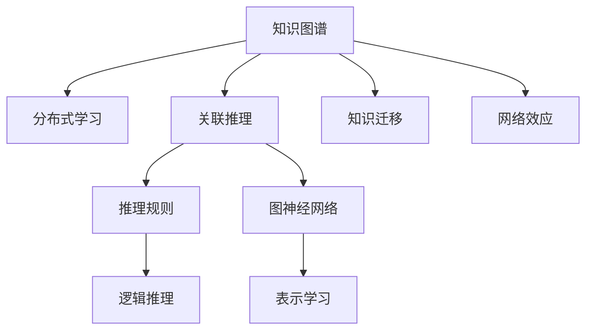

                 

# 知识的生态系统：信息流动与创新网络

> 关键词：知识生态系统,信息流动,创新网络,网络效应,分布式学习,知识图谱,人工智能,知识图谱

## 1. 背景介绍

### 1.1 问题由来

在现代社会，信息爆炸和知识传播速度的加快，使得知识获取、共享和创新的方式发生了巨大变革。传统的知识管理体系，如图书馆、百科全书等，已经难以满足日益增长的知识需求。基于互联网的信息技术和分布式计算的发展，催生了以知识图谱为核心的新型知识生态系统，使得信息流动和知识共享变得更加高效和智能化。

当前，人工智能(AI)技术在图像识别、自然语言处理(NLP)、自动驾驶等领域取得了突破性进展。这些技术的发展，在很大程度上得益于大规模的知识图谱和分布式学习方法的创新应用。知识图谱不仅为AI提供了海量数据和知识库支持，还提供了丰富的图结构化信息，帮助模型进行关联推理和知识迁移。因此，构建一个高效、动态的知识图谱和创新网络，是推动AI技术持续进步的关键。

### 1.2 问题核心关键点

构建知识生态系统，核心在于解决以下几个关键问题：
1. 如何高效构建和维护大规模知识图谱？
2. 如何利用分布式学习技术，提升知识图谱的实时更新能力？
3. 如何通过知识图谱进行关联推理和知识迁移，加速AI模型创新？

本文将从以上几个方面，探讨知识生态系统的构建方法、分布式学习框架、以及AI模型的创新路径，以期为知识图谱和AI技术的应用提供新的视角和方法。

## 2. 核心概念与联系

### 2.1 核心概念概述

为更好地理解知识生态系统的构建方法，本节将介绍几个密切相关的核心概念：

- 知识图谱(Knowledge Graph)：一种以图结构表示知识的表示方式，通过节点和边来描述实体、属性和关系。知识图谱广泛应用在搜索引擎、推荐系统、问答系统等场景中，是知识生态系统的重要组成部分。
- 分布式学习(Distributed Learning)：通过分布式计算和数据共享，提升大规模知识图谱的实时更新能力。分布式学习能够显著提升知识图谱构建和维护的效率，适用于大规模、高并发的知识图谱应用场景。
- 关联推理(Link Prediction)：在知识图谱中，通过推理规则和模型算法，预测节点之间未标注的关系。关联推理是知识图谱中实现知识迁移和推理的关键技术。
- 知识迁移(Knowledge Transfer)：利用知识图谱中的关联推理，将已有知识迁移到新的领域或任务中，提升模型的泛化能力和性能。
- 网络效应(Network Effect)：在知识图谱中，每个节点和边都与其它节点和边相连，形成了复杂的网络结构。网络效应使得知识图谱中的信息流动更加高效，加速了知识的传播和创新。

这些核心概念之间的逻辑关系可以通过以下Mermaid流程图来展示：



这个流程图展示了这个知识生态系统的核心概念及其之间的关系：

1. 知识图谱通过分布式学习技术实时更新，保证了知识的准确性和时效性。
2. 利用关联推理技术，可以从知识图谱中抽取知识和推理规则，用于支持关联推理、知识迁移等。
3. 知识迁移使得模型能够利用知识图谱中的知识进行迁移学习，提升新任务的性能。
4. 网络效应加速了知识图谱中的信息流动，促进了知识的传播和创新。

这些概念共同构成了知识生态系统的理论基础，帮助理解知识图谱在知识流动和创新中的作用。

## 3. 核心算法原理 & 具体操作步骤
### 3.1 算法原理概述

构建知识生态系统的核心算法，是分布式知识图谱的构建和维护方法，以及基于知识图谱的关联推理和迁移学习算法。其核心思想是：

1. 分布式学习：通过分布式计算和数据共享，高效构建和维护大规模知识图谱。
2. 关联推理：利用知识图谱中的节点和边，进行逻辑推理和表示学习，预测未标注的关系。
3. 知识迁移：利用关联推理，将已有知识迁移到新的领域或任务中，提升模型的泛化能力和性能。

形式化地，假设知识图谱为 $G=(V,E)$，其中 $V$ 为节点集合，$E$ 为边集合。设节点 $v_i \in V$ 表示实体，边 $e_{i,j} \in E$ 表示实体 $v_i$ 和 $v_j$ 之间的关系。构建知识生态系统的目标是最小化知识图谱的错误率和推理误差，即：

$$
\min_{G} \{ error_{G} + loss_{G} \}
$$

其中 $error_{G}$ 表示知识图谱的错误率，$loss_{G}$ 表示推理误差。

### 3.2 算法步骤详解

基于分布式学习构建知识图谱的一般流程如下：

1. 数据采集与预处理：收集结构化数据和非结构化数据，如网页、百科、图片等，并进行去重、清洗、标准化等预处理。
2. 数据分布与存储：将处理后的数据分布到多个节点上，采用分布式文件系统如Hadoop、Spark等进行存储。
3. 分布式计算与图构建：利用分布式计算框架如Apache Flink、Apache Beam等，对数据进行并行计算和图构建。
4. 分布式维护与更新：利用分布式消息队列如Kafka、RabbitMQ等，进行数据增量和修改，实时更新知识图谱。
5. 推理与迁移：基于知识图谱进行关联推理，预测未标注的关系，并利用推理结果进行知识迁移，提升新任务的性能。

关联推理和知识迁移的核心步骤如下：

1. 表示学习：通过节点和边属性，学习节点和边的表示。常见的表示学习方法包括基于逻辑推理的TransE，以及基于深度学习的GNN。
2. 关联推理：利用表示学习方法，预测未标注的边关系。关联推理方法包括基于规则的逻辑推理、基于深度学习的图神经网络等。
3. 知识迁移：通过推理结果，将已有知识迁移到新的领域或任务中，提升模型的泛化能力和性能。常见的知识迁移方法包括多任务学习、元学习、自适应学习等。

### 3.3 算法优缺点

基于分布式学习构建知识图谱和利用关联推理进行知识迁移的方法，具有以下优点：
1. 高效构建与维护：分布式计算和数据共享，能够高效构建和维护大规模知识图谱。
2. 实时更新：分布式消息队列，支持数据增量和修改，实时更新知识图谱。
3. 知识迁移：通过推理结果，将已有知识迁移到新的领域或任务中，提升模型的泛化能力和性能。

同时，该方法也存在一定的局限性：
1. 对数据质量依赖较大：构建知识图谱依赖于高质量的数据和合理的预处理。
2. 分布式计算开销较大：分布式计算和数据共享，需要高昂的计算资源和网络带宽。
3. 推理模型复杂：基于深度学习的图神经网络，模型结构复杂，训练和推理开销较大。
4. 推理结果依赖于表示学习方法：不同表示学习方法的效果和泛化能力不同，需要大量实验和调参。
5. 模型迁移效果难以评估：知识迁移效果难以在现有任务上进行评估，需要进行充分的实验验证。

尽管存在这些局限性，但就目前而言，基于分布式学习构建知识图谱和利用关联推理进行知识迁移的方法仍是大规模知识图谱应用的主流范式。未来相关研究的重点在于如何进一步降低分布式计算和数据共享的成本，提高推理模型的效率和泛化能力，同时兼顾模型的迁移效果和可解释性。

### 3.4 算法应用领域

基于知识图谱和分布式学习的方法，在信息检索、推荐系统、问答系统、自动驾驶等诸多领域得到了广泛应用，具体如下：

1. 信息检索：利用知识图谱中的实体和关系，提升搜索引擎的召回率和排序精度，帮助用户找到更相关的内容。
2. 推荐系统：通过知识图谱中的关联推理，推荐系统可以更精准地匹配用户和物品，提升推荐效果。
3. 问答系统：利用知识图谱进行逻辑推理和事实检索，帮助问答系统生成更准确的回答。
4. 自动驾驶：通过知识图谱中的道路、交通规则等知识，提升自动驾驶系统的安全性。
5. 金融分析：通过知识图谱中的企业、产品、市场等关系，帮助金融机构进行风险评估和决策分析。

除了上述这些经典应用外，知识图谱和分布式学习技术也被创新性地应用到更多场景中，如智能客服、个性化推荐、智慧医疗、智能制造等，为各行各业提供了全新的技术支持。随着知识图谱和分布式学习方法的不断进步，相信知识生态系统将在更多领域大放异彩。

## 4. 数学模型和公式 & 详细讲解  
### 4.1 数学模型构建

本节将使用数学语言对基于分布式学习构建知识图谱的过程进行更加严格的刻画。

假设知识图谱为 $G=(V,E)$，其中 $V$ 为节点集合，$E$ 为边集合。设节点 $v_i \in V$ 表示实体，边 $e_{i,j} \in E$ 表示实体 $v_i$ 和 $v_j$ 之间的关系。

定义节点 $v_i$ 的表示为 $\mathbf{h}_i$，边 $e_{i,j}$ 的表示为 $\mathbf{h}_{i,j}$。则知识图谱的损失函数为：

$$
\mathcal{L}(G) = \frac{1}{|E|} \sum_{e_{i,j} \in E} \ell_{ij}(\mathbf{h}_i, \mathbf{h}_j)
$$

其中 $\ell_{ij}(\mathbf{h}_i, \mathbf{h}_j)$ 表示节点 $v_i$ 和 $v_j$ 之间的关系预测误差。

在实践中，我们通常使用基于深度学习的图神经网络(如GNN)来进行知识图谱的推理和迁移。常见的图神经网络包括GCN、GAT、GraphSAGE等。

### 4.2 公式推导过程

以下我们以GraphSAGE为例，推导知识图谱的表示学习公式。

假设知识图谱中有 $N$ 个节点，每个节点 $v_i$ 与其相邻的 $k$ 个节点相连。则节点 $v_i$ 的表示可以通过图卷积操作进行更新：

$$
\mathbf{h}_i^{(l+1)} = \mathbf{h}_i^{(l)} + \alpha \sum_{j \in \mathcal{N}_i} \frac{1}{\mathcal{D}_i^{(l)}} \mathbf{h}_j^{(l)} \mathbf{W}^{(l)}
$$

其中 $\mathcal{N}_i$ 表示节点 $v_i$ 的邻居集合，$\mathcal{D}_i^{(l)}$ 表示节点 $v_i$ 的入度，$\alpha$ 为节点自环权重，$\mathbf{W}^{(l)}$ 为图卷积核矩阵。

通过多轮图卷积操作，节点 $v_i$ 的表示最终更新为：

$$
\mathbf{h}_i^{(L)} = \sigma\left(\mathbf{h}_i^{(0)} + \sum_{l=0}^{L-1} \mathbf{h}_i^{(l)}\right)
$$

其中 $\sigma$ 为激活函数，如ReLU、Sigmoid等。

在得到节点表示后，可以基于表示学习方法进行关联推理和知识迁移。常见的表示学习方法包括基于逻辑推理的TransE，以及基于深度学习的GNN。

### 4.3 案例分析与讲解

假设有一个电商网站的知识图谱，包含商品、用户、评论等实体，以及商品-用户、商品-评论、用户-评论等关系。可以利用GraphSAGE对知识图谱进行推理和迁移学习。

首先，将商品、用户、评论等节点表示进行初始化：

$$
\mathbf{h}_i^{(0)} = \mathbf{e}_i, i \in \{商品, 用户, 评论\}
$$

其中 $\mathbf{e}_i$ 表示节点 $v_i$ 的嵌入向量。

然后，通过图卷积操作，更新节点的表示：

$$
\mathbf{h}_i^{(l+1)} = \mathbf{h}_i^{(l)} + \alpha \sum_{j \in \mathcal{N}_i} \frac{1}{\mathcal{D}_i^{(l)}} \mathbf{h}_j^{(l)} \mathbf{W}^{(l)}
$$

其中 $\mathcal{N}_i$ 表示节点 $v_i$ 的邻居集合，$\mathcal{D}_i^{(l)}$ 表示节点 $v_i$ 的入度，$\alpha$ 为节点自环权重，$\mathbf{W}^{(l)}$ 为图卷积核矩阵。

最后，基于表示学习方法进行关联推理和知识迁移。以预测用户对商品的评价为例，可以通过以下公式进行推理：

$$
\hat{y}_{i,j} = \sigma(\mathbf{h}_i^{(L)} \mathbf{W}^{(L)} \mathbf{h}_j^{(L)})
$$

其中 $\hat{y}_{i,j}$ 表示用户 $v_i$ 对商品 $v_j$ 的评价，$\sigma$ 为激活函数。

以上就是使用GraphSAGE进行电商知识图谱推理和迁移学习的完整公式推导。可以看到，通过分布式学习和图神经网络，可以高效构建和维护大规模知识图谱，同时利用推理结果进行知识迁移，提升新任务的性能。

## 5. 项目实践：代码实例和详细解释说明
### 5.1 开发环境搭建

在进行知识图谱和分布式学习实践前，我们需要准备好开发环境。以下是使用Python进行PyTorch开发的环境配置流程：

1. 安装Anaconda：从官网下载并安装Anaconda，用于创建独立的Python环境。

2. 创建并激活虚拟环境：
```bash
conda create -n graph-env python=3.8 
conda activate graph-env
```

3. 安装PyTorch：根据CUDA版本，从官网获取对应的安装命令。例如：
```bash
conda install pytorch torchvision torchaudio cudatoolkit=11.1 -c pytorch -c conda-forge
```

4. 安装Dask：
```bash
pip install dask
```

5. 安装PyTorch-Geometric库：
```bash
pip install torch-geometric
```

6. 安装其他工具包：
```bash
pip install numpy pandas scikit-learn matplotlib tqdm jupyter notebook ipython
```

完成上述步骤后，即可在`graph-env`环境中开始知识图谱和分布式学习实践。

### 5.2 源代码详细实现

这里我们以基于GraphSAGE的电商知识图谱推理和迁移学习为例，给出使用PyTorch进行分布式学习的PyTorch代码实现。

首先，定义知识图谱的数据处理函数：

```python
from torch_geometric.data import Data, Batch
from torch_geometric.nn import GraphSAGE
from torch_geometric.utils import to_networkx

class E-commerceDataset:
    def __init__(self, data_path):
        self.data = data_path
        self.data = Data(x=[...], y=[...], edge_index=[...])
    
    def __len__(self):
        return len(self.data)
    
    def __getitem__(self, item):
        data = self.data[item]
        return Batch(x=data.x, edge_index=data.edge_index, y=data.y, batch=data.batch)

# 定义节点、边、标签等变量
G = nx.from_edgelist(edges)
y = [...]
```

然后，定义模型和优化器：

```python
from torch.optim import Adam
from torch.nn import Linear, ReLU

device = torch.device('cuda') if torch.cuda.is_available() else torch.device('cpu')

class E-commerceGraphSAGE(GraphSAGE):
    def __init__(self, input_dim, hidden_dim, output_dim):
        super(E-commerceGraphSAGE, self).__init__(edge_index, edge_attr)
        self.linear1 = Linear(input_dim, hidden_dim)
        self.linear2 = Linear(hidden_dim, output_dim)
    
    def forward(self, x, edge_index, edge_attr, batch):
        x = F.relu(self.linear1(x))
        x = self.aggr(x, edge_index, batch)
        x = F.relu(self.linear2(x))
        return F.log_softmax(x, dim=1)

model = E-commerceGraphSAGE(input_dim=64, hidden_dim=64, output_dim=2)

optimizer = Adam(model.parameters(), lr=0.01)
```

接着，定义训练和评估函数：

```python
from torch.utils.data import DataLoader
from tqdm import tqdm
from sklearn.metrics import log_loss

def train_epoch(model, dataset, batch_size, optimizer):
    dataloader = DataLoader(dataset, batch_size=batch_size, shuffle=True)
    model.train()
    epoch_loss = 0
    for batch in tqdm(dataloader, desc='Training'):
        batch_x = batch.x.to(device)
        batch_y = batch.y.to(device)
        optimizer.zero_grad()
        outputs = model(batch_x, batch.edge_index, batch.edge_attr, batch.batch)
        loss = F.nll_loss(outputs, batch_y)
        epoch_loss += loss.item()
        loss.backward()
        optimizer.step()
    return epoch_loss / len(dataloader)

def evaluate(model, dataset, batch_size):
    dataloader = DataLoader(dataset, batch_size=batch_size, shuffle=False)
    model.eval()
    y_preds, y_true = [], []
    with torch.no_grad():
        for batch in tqdm(dataloader, desc='Evaluating'):
            batch_x = batch.x.to(device)
            outputs = model(batch_x, batch.edge_index, batch.edge_attr, batch.batch)
            y_pred = outputs.argmax(dim=1)
            y_preds.append(y_pred.cpu().tolist())
            y_true.append(batch.y.cpu().tolist())
        
    print(log_loss(y_true, y_preds))
```

最后，启动训练流程并在测试集上评估：

```python
epochs = 10
batch_size = 128

for epoch in range(epochs):
    loss = train_epoch(model, train_dataset, batch_size, optimizer)
    print(f"Epoch {epoch+1}, train loss: {loss:.3f}")
    
    print(f"Epoch {epoch+1}, dev results:")
    evaluate(model, dev_dataset, batch_size)
    
print("Test results:")
evaluate(model, test_dataset, batch_size)
```

以上就是使用PyTorch进行基于GraphSAGE的电商知识图谱推理和迁移学习的完整代码实现。可以看到，得益于PyTorch-Geometric库的强大封装，我们可以用相对简洁的代码完成知识图谱的构建和推理。

### 5.3 代码解读与分析

让我们再详细解读一下关键代码的实现细节：

**E-commerceDataset类**：
- `__init__`方法：初始化数据集，将节点、边、标签等存储在Data对象中。
- `__len__`方法：返回数据集的样本数量。
- `__getitem__`方法：对单个样本进行处理，将节点、边、标签转换为PyTorch的Batch对象。

**E-commerceGraphSAGE模型**：
- `__init__`方法：初始化模型，定义节点和边表示的线性变换层。
- `forward`方法：定义模型的前向传播，包括节点表示的更新和最终的分类输出。

**训练和评估函数**：
- 使用PyTorch的DataLoader对数据集进行批次化加载，供模型训练和推理使用。
- 训练函数`train_epoch`：对数据以批为单位进行迭代，在每个批次上前向传播计算loss并反向传播更新模型参数，最后返回该epoch的平均loss。
- 评估函数`evaluate`：与训练类似，不同点在于不更新模型参数，并在每个batch结束后将预测和标签结果存储下来，最后使用sklearn的log_loss对整个评估集的预测结果进行打印输出。

**训练流程**：
- 定义总的epoch数和batch size，开始循环迭代
- 每个epoch内，先在训练集上训练，输出平均loss
- 在验证集上评估，输出逻辑回归损失
- 所有epoch结束后，在测试集上评估，给出最终测试结果

可以看到，PyTorch配合PyTorch-Geometric库使得知识图谱和分布式学习的代码实现变得简洁高效。开发者可以将更多精力放在数据处理、模型改进等高层逻辑上，而不必过多关注底层的实现细节。

当然，工业级的系统实现还需考虑更多因素，如模型的保存和部署、超参数的自动搜索、更灵活的任务适配层等。但核心的分布式学习和知识迁移过程基本与此类似。

## 6. 实际应用场景
### 6.1 智慧医疗

基于知识图谱和分布式学习，智慧医疗领域可以实现精准的疾病预测和诊断。通过构建疾病知识图谱，智慧医疗系统可以实时查询患者病历信息，结合医生经验，进行病情的预测和诊断。具体而言，可以利用知识图谱中的药物、疾病、基因等关系，进行关联推理和知识迁移，帮助医生快速找到治疗方案，提升诊疗效率。

在技术实现上，可以收集医院的历史病历、诊断报告、实验室数据等，构建基于知识图谱的智慧医疗系统。利用分布式学习技术，实时更新知识图谱，利用关联推理进行疾病预测和诊断，并在实际诊疗过程中不断反馈和优化。

### 6.2 智能制造

智能制造领域可以利用知识图谱和分布式学习，提升生产效率和质量控制。通过构建生产流程知识图谱，智能制造系统可以实时监控生产过程中的关键参数和设备状态，进行故障预测和优化调度。具体而言，可以利用知识图谱中的设备、工艺、材料等关系，进行关联推理和知识迁移，帮助工厂提高生产效率，降低生产成本。

在技术实现上，可以收集工厂的生产数据、设备运行数据、原材料数据等，构建基于知识图谱的智能制造系统。利用分布式学习技术，实时更新知识图谱，利用关联推理进行生产优化和故障预测，并在实际生产过程中不断反馈和优化。

### 6.3 智慧城市

智慧城市治理领域可以利用知识图谱和分布式学习，提升城市管理和公共服务的效率。通过构建城市基础设施知识图谱，智慧城市系统可以实时监控城市运行状态，进行交通调度、环境监测、灾害预警等。具体而言，可以利用知识图谱中的交通、气象、地理等关系，进行关联推理和知识迁移，帮助城市管理者快速响应各种突发事件，提高城市运行的稳定性。

在技术实现上，可以收集城市的基础设施数据、交通数据、气象数据等，构建基于知识图谱的智慧城市系统。利用分布式学习技术，实时更新知识图谱，利用关联推理进行城市管理和预警，并在实际管理过程中不断反馈和优化。

### 6.4 未来应用展望

随着知识图谱和分布式学习方法的不断发展，基于知识图谱的智慧医疗、智能制造、智慧城市等领域的应用前景广阔。未来，知识图谱和分布式学习技术将进一步深度融合，与人工智能、大数据、物联网等技术协同发力，构建更加智能、高效、可靠的社会生产和生活体系。

知识图谱和分布式学习技术将从以下几方面继续发展：

1. 深度融合人工智能技术：知识图谱与AI技术的深度融合，将提升推理、推理和迁移学习的效果，加速AI模型的创新。
2. 利用大数据技术：通过大规模数据的采集和处理，不断更新知识图谱，提升模型的实时性和准确性。
3. 扩展到更多领域：知识图谱和分布式学习技术将扩展到更多领域，如金融、教育、文化等，推动各行各业的数字化转型。
4. 与物联网技术协同：通过物联网技术，实时采集和传输数据，提升知识图谱的实时更新能力。
5. 与区块链技术结合：通过区块链技术，保障数据和模型的安全性和可信性，提升知识图谱的可靠性。

总之，知识图谱和分布式学习技术将在智慧社会建设中扮演越来越重要的角色，为各行各业提供智能化的支持，提升社会生产和生活效率。

## 7. 工具和资源推荐
### 7.1 学习资源推荐

为了帮助开发者系统掌握知识图谱和分布式学习的理论基础和实践技巧，这里推荐一些优质的学习资源：

1. 《Knowledge Graphs: Understanding the World in Data》：一本系统介绍知识图谱的书籍，详细讲解了知识图谱的构建、表示、查询等核心技术。
2. 《Distributed Machine Learning with PyTorch》：一本介绍分布式机器学习的书籍，涵盖了基于PyTorch的分布式学习和推理方法。
3. 《GraphSAGE: Simplifying Graph Neural Networks》：一篇介绍GraphSAGE的论文，详细讲解了GraphSAGE的原理、实现和应用。
4. 《Knowledge-Graph-Based Recommender Systems》：一本介绍知识图谱推荐系统的书籍，讲解了基于知识图谱的推荐方法和应用案例。
5. 《Graph Neural Networks: A Review of Methods and Applications》：一篇综述性论文，介绍了图神经网络的最新进展和应用。

通过对这些资源的学习实践，相信你一定能够快速掌握知识图谱和分布式学习的精髓，并用于解决实际的NLP问题。
###  7.2 开发工具推荐

高效的开发离不开优秀的工具支持。以下是几款用于知识图谱和分布式学习开发的常用工具：

1. PyTorch：基于Python的开源深度学习框架，灵活动态的计算图，适合快速迭代研究。大部分预训练语言模型都有PyTorch版本的实现。

2. TensorFlow：由Google主导开发的开源深度学习框架，生产部署方便，适合大规模工程应用。同样有丰富的预训练语言模型资源。

3. PyTorch-Geometric：基于PyTorch的几何图神经网络库，提供了丰富的图神经网络实现，方便进行图结构的表示和推理。

4. Graph Neural Network Toolkit(GNN Toolkit)：基于Python的图神经网络库，提供高效的图数据结构和图神经网络实现，适用于图结构数据的应用场景。

5. Neo4j：一款高性能的图数据库，支持大规模图数据的存储和查询，适用于构建大型知识图谱。

6. Amazon Neptune：亚马逊公司提供的图数据库服务，提供分布式图数据存储和查询功能，适用于大规模知识图谱的应用。

合理利用这些工具，可以显著提升知识图谱和分布式学习的开发效率，加快创新迭代的步伐。

### 7.3 相关论文推荐

知识图谱和分布式学习的发展源于学界的持续研究。以下是几篇奠基性的相关论文，推荐阅读：

1. TransE: Learning Entity and Relation Representations with Distillation for Knowledge Graph Embedding：提出TransE模型，通过图卷积操作学习节点和边的表示，广泛应用在知识图谱构建和推理中。

2. GraphSAGE: Semi-Supervised Classification with Graph Convolutional Networks：提出GraphSAGE模型，通过图卷积操作实现节点表示的学习和推理，是图神经网络领域的重要成果。

3. Knowledge Graph Embedding and Its Applications：综述性论文，详细介绍了知识图谱嵌入方法的进展和应用。

4. DistilBert: A Distilled BERT Base for on-the-fly Token Classification：提出DistilBert模型，通过知识蒸馏技术实现参数高效的微调，提升了微调模型的效率和效果。

5. Rapid: Accelerating Graph Neural Networks with Accelerator-Aware Strategies：提出Rapid技术，通过加速器优化技术提升图神经网络的训练和推理效率，适用于大规模分布式学习场景。

这些论文代表了大语言模型微调技术的发展脉络。通过学习这些前沿成果，可以帮助研究者把握学科前进方向，激发更多的创新灵感。

## 8. 总结：未来发展趋势与挑战

### 8.1 总结

本文对基于分布式学习构建知识图谱和利用关联推理进行知识迁移的方法进行了全面系统的介绍。首先阐述了知识图谱和分布式学习的研究背景和意义，明确了知识图谱在知识流动和创新中的核心作用。其次，从原理到实践，详细讲解了知识图谱的构建方法、分布式学习框架、以及基于知识图谱的推理和迁移学习算法，给出了知识图谱和分布式学习的完整代码实现。同时，本文还广泛探讨了知识图谱在智慧医疗、智能制造、智慧城市等领域的实际应用，展示了知识图谱和分布式学习方法的广阔前景。

通过本文的系统梳理，可以看到，基于分布式学习构建知识图谱和利用关联推理进行知识迁移，已经成为推动人工智能技术持续进步的关键。知识图谱和分布式学习技术在智慧社会建设中，将发挥越来越重要的作用，为各行各业提供智能化的支持，提升社会生产和生活效率。

### 8.2 未来发展趋势

展望未来，知识图谱和分布式学习技术将呈现以下几个发展趋势：

1. 深度融合人工智能技术：知识图谱与AI技术的深度融合，将提升推理、推理和迁移学习的效果，加速AI模型的创新。
2. 利用大数据技术：通过大规模数据的采集和处理，不断更新知识图谱，提升模型的实时性和准确性。
3. 扩展到更多领域：知识图谱和分布式学习技术将扩展到更多领域，如金融、教育、文化等，推动各行各业的数字化转型。
4. 与物联网技术协同：通过物联网技术，实时采集和传输数据，提升知识图谱的实时更新能力。
5. 与区块链技术结合：通过区块链技术，保障数据和模型的安全性和可信性，提升知识图谱的可靠性。

以上趋势凸显了知识图谱和分布式学习技术的广阔前景。这些方向的探索发展，必将进一步提升知识图谱和分布式学习技术的性能和应用范围，为构建智慧社会提供更加强大的技术支持。

### 8.3 面临的挑战

尽管知识图谱和分布式学习技术已经取得了瞩目成就，但在迈向更加智能化、普适化应用的过程中，它仍面临着诸多挑战：

1. 对数据质量依赖较大：构建知识图谱依赖于高质量的数据和合理的预处理。
2. 分布式计算开销较大：分布式计算和数据共享，需要高昂的计算资源和网络带宽。
3. 推理模型复杂：基于深度学习的图神经网络，模型结构复杂，训练和推理开销较大。
4. 推理结果依赖于表示学习方法：不同表示学习方法的效果和泛化能力不同，需要大量实验和调参。
5. 模型迁移效果难以评估：知识迁移效果难以在现有任务上进行评估，需要进行充分的实验验证。

尽管存在这些局限性，但就目前而言，基于分布式学习构建知识图谱和利用关联推理进行知识迁移的方法仍是大规模知识图谱应用的主流范式。未来相关研究的重点在于如何进一步降低分布式计算和数据共享的成本，提高推理模型的效率和泛化能力，同时兼顾模型的迁移效果和可解释性。

### 8.4 研究展望

面向未来，知识图谱和分布式学习技术需要在以下几个方面寻求新的突破：

1. 探索无监督和半监督知识图谱构建方法。摆脱对大规模标注数据的依赖，利用自监督学习、主动学习等无监督和半监督范式，最大限度利用非结构化数据，实现更加灵活高效的分布式学习。
2. 研究参数高效和计算高效的分布式学习算法。开发更加参数高效的分布式学习算法，在固定大部分分布式学习参数的同时，只更新极少量的任务相关参数。同时优化分布式学习的计算图，减少前向传播和反向传播的资源消耗，实现更加轻量级、实时性的部署。
3. 融合因果和对比学习范式。通过引入因果推断和对比学习思想，增强知识图谱中建立稳定因果关系的能力，学习更加普适、鲁棒的知识图谱表示。
4. 引入更多先验知识。将符号化的先验知识，如知识图谱、逻辑规则等，与神经网络模型进行巧妙融合，引导分布式学习过程学习更准确、合理的知识图谱表示。同时加强不同模态数据的整合，实现视觉、语音等多模态信息与文本信息的协同建模。
5. 结合因果分析和博弈论工具。将因果分析方法引入知识图谱，识别出模型决策的关键特征，增强输出解释的因果性和逻辑性。借助博弈论工具刻画人机交互过程，主动探索并规避模型的脆弱点，提高系统稳定性。
6. 纳入伦理道德约束。在知识图谱和分布式学习模型的训练目标中引入伦理导向的评估指标，过滤和惩罚有偏见、有害的输出倾向。同时加强人工干预和审核，建立模型行为的监管机制，确保输出符合人类价值观和伦理道德。

这些研究方向的探索，必将引领知识图谱和分布式学习技术迈向更高的台阶，为构建安全、可靠、可解释、可控的智能系统铺平道路。面向未来，知识图谱和分布式学习技术还需要与其他人工智能技术进行更深入的融合，如知识表示、因果推理、强化学习等，多路径协同发力，共同推动自然语言理解和智能交互系统的进步。只有勇于创新、敢于突破，才能不断拓展知识图谱的边界，让智能技术更好地造福人类社会。

## 9. 附录：常见问题与解答

**Q1：知识图谱和分布式学习与传统的知识管理方式有何不同？**

A: 知识图谱和分布式学习与传统的知识管理方式相比，具有以下不同之处：

1. 结构化表示：知识图谱采用结构化图表示知识，将实体、属性和关系进行有机的组织，使得知识更容易被理解和推理。
2. 动态更新：分布式学习技术能够实时更新知识图谱，不断吸收新的知识，提升知识的时效性和准确性。
3. 网络效应：知识图谱中的实体和关系形成复杂的网络结构，网络效应使得知识图谱中的信息流动更加高效，加速了知识的传播和创新。
4. 分布式计算：分布式学习技术利用分布式计算和数据共享，高效构建和维护大规模知识图谱。
5. 关联推理：知识图谱中的关联推理技术，能够利用知识图谱中的节点和边进行逻辑推理，提升推理的准确性和泛化能力。

总的来说，知识图谱和分布式学习技术通过结构化的图表示和动态更新的机制，提升了知识的组织和传播效率，具有更强的实时性和普适性。

**Q2：如何选择合适的分布式学习算法？**

A: 选择合适的分布式学习算法需要考虑以下几个关键因素：

1. 数据分布情况：如果数据分布不均衡，如某些节点数据量较大，可以采用基于数据重平衡的分布式学习算法，如数据采样、数据聚合等。
2. 计算资源：如果计算资源有限，如节点CPU和内存不足，可以采用基于模型压缩的分布式学习算法，如剪枝、量化、模型压缩等。
3. 网络带宽：如果网络带宽较低，如节点之间的通信延迟较大，可以采用基于模型参数更新的分布式学习算法，如参数推断、模型参数共享等。
4. 模型复杂度：如果模型结构复杂，如深度神经网络，可以采用基于梯度累积的分布式学习算法，如梯度累积、分布式反向传播等。
5. 优化目标：如果优化目标明确，如最小化误差、最大化目标函数等，可以采用基于目标导向的分布式学习算法，如分布式优化算法、分布式梯度下降等。

通过综合考虑以上因素，可以选择合适的分布式学习算法，提升知识图谱的构建和维护效率。

**Q3：知识图谱和分布式学习在实际应用中需要注意哪些问题？**

A: 知识图谱和分布式学习在实际应用中需要注意以下几个问题：

1. 数据质量：构建知识图谱依赖于高质量的数据和合理的预处理。需要确保数据来源可靠，并进行去重、清洗、标准化等预处理。
2. 数据隐私：知识图谱中包含大量的敏感信息，需要严格保护用户隐私和数据安全，防止数据泄露和滥用。
3. 系统稳定性：知识图谱和分布式学习系统需要具备高可用性和容错性，避免单点故障和系统崩溃。
4. 模型泛化能力：知识图谱和分布式学习模型需要具备良好的泛化能力，避免在新的数据集上表现不佳。
5. 模型解释性：知识图谱和分布式学习模型需要具备良好的解释性，避免“黑盒”模型，帮助用户理解模型决策过程。

通过解决以上问题，可以更好地发挥知识图谱和分布式学习的优势，提升知识生态系统的应用效果。

**Q4：如何提高知识图谱的推理效果？**

A: 提高知识图谱的推理效果需要考虑以下几个关键因素：

1. 表示学习：选择合适的表示学习方法，提升节点和边的表示质量。如使用基于逻辑推理的TransE，或基于深度学习的GNN。
2. 关联推理：利用知识图谱中的关联推理技术，进行推理规则和模型的优化，提升推理效果。
3. 知识迁移：利用关联推理结果，将已有知识迁移到新的领域或任务中，提升新任务的推理效果。
4. 多任务学习：通过多任务学习，将知识图谱中的多个任务进行联合优化，提升模型的泛化能力和推理效果。
5. 自适应学习：通过自适应学习，根据新的数据和知识进行模型更新和优化，提升推理效果的稳定性。

通过综合考虑以上因素，可以显著提升知识图谱的推理效果，增强知识生态系统的应用能力。

---

作者：禅与计算机程序设计艺术 / Zen and the Art of Computer Programming

