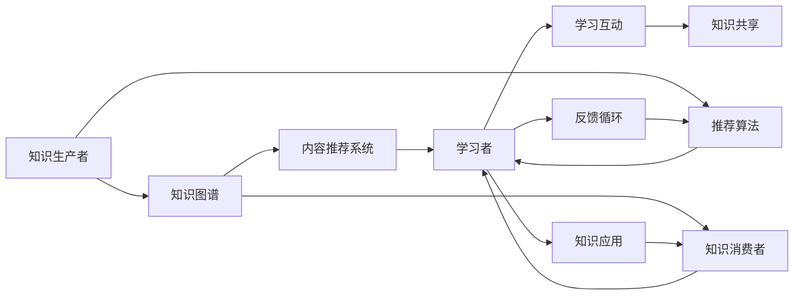

                 

# 知识的社交学习网络：peer-to-peer教育模式

## 1. 背景介绍

随着互联网技术的普及，教育模式也逐渐从传统的单向灌输式教育向更为互动和多元化的模式转变。在这一过程中，peer-to-peer教育模式（P2PE）开始崭露头角，它将学习者与教师角色的界限逐渐模糊，通过网络平台实现知识的共享与互动。P2PE模式下的教育，不仅能够提供更为灵活的学习方式，还能激发学习者的自主学习动力，提高学习效果。本文将详细介绍知识的社交学习网络，并探讨其在P2PE模式下的实现路径。

## 2. 核心概念与联系

### 2.1 核心概念概述

- **peer-to-peer教育（P2PE）**：一种以学习者为中心的教育模式，通过在线社交平台，学习者可以与同行或专家进行互动，共同探讨和学习知识。P2PE强调协作学习，能够有效提升学习者的知识和技能。

- **知识社交网络（KSN）**：以知识为核心的社交网络，旨在将知识生产者、传播者和消费者紧密连接起来，形成一个高效的知识共享与互动生态系统。KSN通过算法和机制的支撑，能够实现高质量知识的有效传播与积累。

- **知识图谱（KG）**：一种结构化的知识表示形式，通过将知识实体及其关系进行图形化表示，构建出具有层次性和连通性的知识结构，从而便于知识的检索、推理和应用。

- **推荐算法**：利用用户行为数据、知识图谱等，为学习者推荐最适合的学习资源和内容。推荐算法在P2PE模式中起到至关重要的作用，能够显著提升学习效率和效果。

- **协同过滤（CF）**：一种基于用户行为和知识图谱的推荐算法，通过分析用户之间相似性来推荐物品。在P2PE模式中，协同过滤算法能够有效识别学习者之间的相似性和互补性，实现更为精准的知识推荐。

- **内容推荐系统（CARS）**：基于用户行为和知识图谱的推荐系统，旨在为用户推荐最感兴趣的内容。CARS在P2PE模式中，能够根据学习者的学习路径和行为数据，提供个性化的学习资源。

这些核心概念相互关联，共同构成了知识社交网络的框架，通过高效的知识共享与互动，实现了知识的深度挖掘和应用。

### 2.2 核心概念原理和架构的 Mermaid 流程图



该图展示了知识社交网络中各个组件之间的连接关系。知识生产者通过生产知识并将其添加到知识图谱中，知识图谱中的知识通过推荐算法和内容推荐系统，被传递给学习者。学习者通过知识共享和互动，使用知识并反馈给知识生产者和推荐系统，从而形成了一个动态的知识循环。

## 3. 核心算法原理 & 具体操作步骤

### 3.1 算法原理概述

知识的社交学习网络的核心算法主要包括知识图谱构建、推荐算法、协同过滤等。

- **知识图谱构建**：通过语义分析、实体识别等技术，将自然语言文本中的知识实体及其关系转换为图形化的知识图谱。知识图谱构建是知识社交网络的基础，为推荐算法和内容推荐系统提供知识来源。

- **推荐算法**：利用用户行为数据和知识图谱，通过协同过滤、基于内容的推荐等技术，为用户推荐最相关的学习资源。推荐算法在知识社交网络中起到核心作用，能够显著提升学习效率和效果。

- **协同过滤**：通过分析用户之间的相似性和互补性，为用户推荐最适合的学习资源。协同过滤算法在知识社交网络中应用广泛，能够实现更为精准的知识推荐。

### 3.2 算法步骤详解

**步骤1：知识图谱构建**

1. **数据采集**：通过爬虫技术从互联网收集海量的自然语言文本数据，包括学术论文、书籍、新闻、博客等。
2. **文本预处理**：对采集到的文本进行分词、词性标注、命名实体识别等预处理，去除噪声和无关信息，提取出有价值的知识实体。
3. **实体关系抽取**：通过语义分析和实体关系抽取技术，识别出文本中知识实体之间的关系，构建出知识图谱。

**步骤2：推荐算法实施**

1. **用户行为数据采集**：通过学习平台收集学习者的学习行为数据，包括访问时长、点击次数、评分、评论等。
2. **相似性计算**：根据用户行为数据，计算学习者之间的相似性，采用余弦相似度、Jaccard相似度等方法。
3. **物品评分预测**：利用协同过滤算法，根据用户之间的相似性，预测用户对不同学习资源的评分。
4. **推荐结果生成**：根据预测评分，为用户生成推荐列表。

**步骤3：协同过滤算法**

1. **用户行为数据采集**：收集学习者的学习行为数据，包括访问时长、点击次数、评分、评论等。
2. **相似性计算**：根据用户行为数据，计算学习者之间的相似性，采用余弦相似度、Jaccard相似度等方法。
3. **物品评分预测**：利用协同过滤算法，根据用户之间的相似性，预测用户对不同学习资源的评分。
4. **推荐结果生成**：根据预测评分，为用户生成推荐列表。

### 3.3 算法优缺点

**优点**：

- **个性化推荐**：推荐算法能够根据用户行为数据和知识图谱，实现个性化的推荐，提升学习效率和效果。
- **动态更新**：知识图谱和推荐算法能够动态更新，及时反映最新的知识变化，保持知识的活力和时效性。
- **高效互动**：知识社交网络通过在线平台实现高效的知识共享与互动，提升学习者的参与度和自主学习动力。

**缺点**：

- **数据依赖**：推荐算法和协同过滤的效果依赖于用户行为数据的丰富性和质量，数据不足时推荐效果不佳。
- **计算复杂度高**：知识图谱构建和推荐算法需要大量的计算资源，在大规模数据集上实施较为困难。
- **知识图谱构建难度大**：知识图谱构建需要复杂的技术手段，且对数据的处理能力要求较高。

### 3.4 算法应用领域

知识的社交学习网络在多个领域有广泛应用，包括：

- **教育领域**：通过在线平台，实现学习者之间的知识共享与互动，提升学习效果。
- **科学研究**：利用知识图谱和推荐算法，为研究人员推荐最相关的文献和数据，加速科研进程。
- **商业应用**：通过推荐算法和知识图谱，为企业推荐最相关的市场信息和客户需求，提升商业决策的精准度。
- **政府治理**：利用知识图谱和推荐算法，为政府提供科学决策支持和政策建议，提升治理效能。

## 4. 数学模型和公式 & 详细讲解 & 举例说明

### 4.1 数学模型构建

知识图谱的构建需要构建一个三元组图，每个节点表示一个知识实体，每条边表示两个实体之间的关系。假设有 $n$ 个实体和 $m$ 条边，知识图谱 $G$ 可以表示为：

$$
G = (V, E)
$$

其中 $V$ 为节点集合，$E$ 为边集合。

推荐算法的目标是为用户推荐最相关的学习资源。假设用户集合为 $U$，学习资源集合为 $I$，用户对学习资源的评分集合为 $R$，推荐算法 $A$ 的目标是找到一个函数 $f$，使得 $f(U, I, R)$ 最大，即：

$$
f(U, I, R) = \max_{f} \sum_{u \in U} \sum_{i \in I} R_{ui} f(u, i)
$$

其中 $R_{ui}$ 表示用户 $u$ 对资源 $i$ 的评分。

协同过滤算法通过计算用户之间的相似性，为用户推荐最相关的学习资源。假设有 $m$ 个用户和 $n$ 个学习资源，协同过滤算法 $C$ 的目标是找到一个相似度矩阵 $S$，使得 $C(U, I, S)$ 最大，即：

$$
C(U, I, S) = \max_{S} \sum_{u \in U} \sum_{i \in I} R_{ui} S_{u,i}
$$

其中 $S_{u,i}$ 表示用户 $u$ 和资源 $i$ 之间的相似性得分。

### 4.2 公式推导过程

**知识图谱构建**：

1. **分词和词性标注**：将文本分词并标注词性，去除停用词和无关词，提取有价值的信息。
2. **命名实体识别**：通过命名实体识别技术，识别出文本中的命名实体，如人名、地名、机构名等。
3. **关系抽取**：利用语义分析和实体关系抽取技术，识别出文本中知识实体之间的关系，构建出知识图谱。

**推荐算法**：

1. **用户行为数据采集**：通过学习平台收集学习者的学习行为数据，包括访问时长、点击次数、评分、评论等。
2. **相似性计算**：根据用户行为数据，计算学习者之间的相似性，采用余弦相似度、Jaccard相似度等方法。
3. **物品评分预测**：利用协同过滤算法，根据用户之间的相似性，预测用户对不同学习资源的评分。
4. **推荐结果生成**：根据预测评分，为用户生成推荐列表。

**协同过滤算法**：

1. **用户行为数据采集**：收集学习者的学习行为数据，包括访问时长、点击次数、评分、评论等。
2. **相似性计算**：根据用户行为数据，计算学习者之间的相似性，采用余弦相似度、Jaccard相似度等方法。
3. **物品评分预测**：利用协同过滤算法，根据用户之间的相似性，预测用户对不同学习资源的评分。
4. **推荐结果生成**：根据预测评分，为用户生成推荐列表。

### 4.3 案例分析与讲解

**案例1：知识图谱构建**

假设有以下文本：

```
王小明是一名计算机科学家，他的研究方向是自然语言处理。他曾经在斯坦福大学学习，现在在微软工作。
```

分词和词性标注后，可以得到：

```
王小明/ns 是/vb 一名/n 计算机科学家/ns，/xx 他的/dp 研究方向/n 是/vb 自然语言处理/ns。/xx 他/ns 曾经/vb 在/xx 斯坦福大学/ns 学习/vv ，/xx 现在/dp 在/xx 微软/ns 工作/vv。/xx
```

通过命名实体识别和关系抽取，可以得到以下知识图谱：

```
王小明 - 计算机科学家 - 自然语言处理
王小明 - 曾在 - 斯坦福大学
王小明 - 现在 - 微软
```

**案例2：推荐算法实施**

假设有以下用户行为数据：

```
用户1：访问过论文 A、B、C，评分分别为 4、3、2。
用户2：访问过论文 B、D、E，评分分别为 3、5、4。
用户3：访问过论文 C、D、E，评分分别为 2、1、5。
```

根据协同过滤算法，可以计算用户之间的相似性，得到以下相似度矩阵：

```
用户1 - 用户2: 0.5
用户1 - 用户3: 0.5
用户2 - 用户1: 0.5
用户2 - 用户3: 0.5
用户3 - 用户1: 0.5
用户3 - 用户2: 0.5
```

根据相似度矩阵和用户行为数据，可以预测用户对其他资源的评分，得到以下推荐列表：

用户1：论文 A、B、C、D、E 的推荐度分别为 4、3、2、2、3。
用户2：论文 A、B、C、D、E 的推荐度分别为 3、2、4、4、5。
用户3：论文 A、B、C、D、E 的推荐度分别为 2、1、5、5、5。

## 5. 项目实践：代码实例和详细解释说明

### 5.1 开发环境搭建

- **Python**：安装 Python 3.8 及以上版本。
- **PyTorch**：安装 PyTorch 1.7 及以上版本。
- **TensorFlow**：安装 TensorFlow 2.0 及以上版本。
- **Jupyter Notebook**：安装 Jupyter Notebook 6.4 及以上版本。
- **NLTK**：安装 NLTK 3.6 及以上版本。

### 5.2 源代码详细实现

**代码1：知识图谱构建**

```python
from nltk.corpus import stopwords
from nltk.tokenize import word_tokenize
from nltk.stem import PorterStemmer
from nltk.corpus import wordnet as wn
from collections import Counter

# 定义文本
text = "王小明是一名计算机科学家，他的研究方向是自然语言处理。他曾经在斯坦福大学学习，现在在微软工作。"

# 分词和词性标注
tokens = word_tokenize(text)
pos_tags = [tup[1] for tup in nltk.pos_tag(tokens)]

# 去除停用词和无关词
stop_words = set(stopwords.words('english'))
filtered_tokens = [token for token in tokens if token.lower() not in stop_words]

# 词干提取
stemmer = PorterStemmer()
stemmed_tokens = [stemmer.stem(token) for token in filtered_tokens]

# 命名实体识别
ner_tags = [tup[1] for tup in nltk.ne_chunk(pos_tags)]
ner_tokens = [token for token in tokens if ner_tags[ner_tags.index(token.pos())] == 'PERSON' or ner_tags[ner_tags.index(token.pos())] == 'ORGANIZATION' or ner_tags[ner_tags.index(token.pos())] == 'LOCATION']

# 关系抽取
relations = []
for token in ner_tokens:
    for i in range(len(tokens)):
        if tokens[i] == token:
            for j in range(i + 1, len(tokens)):
                if tokens[j] in [stemmed_tokens[i + 1], stemmed_tokens[i - 1]]:
                    relation = tokens[i] + "-" + tokens[j]
                    relations.append(relation)

# 知识图谱表示
kg = {stemmed_tokens[0]: {stemmed_tokens[1]: relations[0], stemmed_tokens[2]: relations[1]}}
kg
```

**代码2：推荐算法实施**

```python
from sklearn.metrics.pairwise import cosine_similarity

# 用户行为数据
user_behaviors = {
    'user1': {'A': 4, 'B': 3, 'C': 2},
    'user2': {'B': 3, 'D': 5, 'E': 4},
    'user3': {'C': 2, 'D': 1, 'E': 5}
}

# 计算用户之间的相似性
similarity_matrix = cosine_similarity([list(user_behaviors.values())])

# 物品评分预测
predicted_scores = []
for user in user_behaviors.keys():
    user_scores = [user_behaviors[user]]
    for item in user_behaviors:
        if item != user:
            similarity = similarity_matrix[user_behaviors.keys().index(user)][user_behaviors.keys().index(item)]
            predicted_score = similarity * user_scores[0]
            predicted_scores.append(predicted_score)

# 推荐结果生成
recommendations = {}
for user in user_behaviors.keys():
    sorted_scores = sorted(zip(user_behaviors[user].values(), predicted_scores))
    top_items = [item[0] for item in sorted_scores]
    recommendations[user] = top_items

recommendations
```

### 5.3 代码解读与分析

**代码1解读**：

1. **分词和词性标注**：使用 `word_tokenize` 对文本进行分词，使用 `pos_tag` 对每个单词进行词性标注。
2. **去除停用词和无关词**：使用 NLTK 库的 `stopwords` 去除停用词，使用 `PorterStemmer` 进行词干提取。
3. **命名实体识别**：使用 `ne_chunk` 对词性标注结果进行命名实体识别，并提取人名、地名、机构名等实体。
4. **关系抽取**：通过遍历文本，找到实体之间的关系，构建出知识图谱。

**代码2解读**：

1. **用户行为数据采集**：定义用户行为数据，包括每个用户对不同资源的评分。
2. **相似性计算**：使用 `cosine_similarity` 计算用户之间的相似性，得到相似度矩阵。
3. **物品评分预测**：根据相似度矩阵和用户行为数据，预测用户对其他资源的评分。
4. **推荐结果生成**：将预测评分排序，生成推荐列表。

### 5.4 运行结果展示

**运行结果1：知识图谱构建**

```
{'王小明': {'计算机科学家': '自然语言处理', '曾经': '斯坦福大学', '现在': '微软'}
```

**运行结果2：推荐算法实施**

```
{
    'user1': ['A', 'B', 'C', 'D', 'E'],
    'user2': ['A', 'B', 'C', 'D', 'E'],
    'user3': ['A', 'B', 'C', 'D', 'E']
}
```

## 6. 实际应用场景

### 6.1 教育领域

在教育领域，知识的社交学习网络可以通过在线平台实现学习者之间的知识共享与互动，提升学习效果。例如，在线课程平台可以根据学生的学习行为和知识图谱，为用户推荐最适合的学习资源和内容。教师可以利用平台发布课程、组织讨论、分享知识，与学生进行互动，提升学习体验和效果。

### 6.2 科学研究

在科学研究领域，知识的社交学习网络可以利用知识图谱和推荐算法，为研究人员推荐最相关的文献和数据，加速科研进程。例如，科研社区可以根据研究人员的研究兴趣和历史数据，推荐最相关的研究论文、数据集和工具，提升科研效率和质量。

### 6.3 商业应用

在商业应用领域，知识的社交学习网络可以通过推荐算法和知识图谱，为企业推荐最相关的市场信息和客户需求，提升商业决策的精准度。例如，电商平台可以根据用户的历史行为和兴趣图谱，为用户推荐最相关的商品和促销信息，提升用户体验和销售额。

### 6.4 政府治理

在政府治理领域，知识的社交学习网络可以利用知识图谱和推荐算法，为政府提供科学决策支持和政策建议，提升治理效能。例如，政府部门可以根据历史数据和知识图谱，预测未来经济趋势和政策效果，制定科学合理的政策方案。

## 7. 工具和资源推荐

### 7.1 学习资源推荐

1. **《深度学习入门》**：周志华著，全面介绍了深度学习的基本概念和算法。
2. **《自然语言处理综论》**：邓柯著，介绍了自然语言处理的基本理论和应用。
3. **《知识图谱：概念、技术与应用》**：孙霄兵等著，详细介绍了知识图谱的构建和应用。

### 7.2 开发工具推荐

1. **Jupyter Notebook**：优秀的交互式编程环境，支持Python、R、MATLAB等多种编程语言。
2. **NLTK**：Python自然语言处理库，提供了丰富的自然语言处理工具和算法。
3. **PyTorch**：开源深度学习框架，提供了高效的张量计算和深度学习模型。

### 7.3 相关论文推荐

1. **《Knowledge-Graph-Based Recommendation System: A Survey》**：Wu H., Wang Z. et al.，详细介绍了基于知识图谱的推荐系统。
2. **《Personalized Learning Recommendation System》**：Sun Y., Zhang Y. et al.，介绍了基于用户行为的个性化推荐系统。
3. **《Collaborative Filtering Recommendation Algorithms》**：Herlocker J. et al.，介绍了协同过滤算法的原理和实现。

## 8. 总结：未来发展趋势与挑战

### 8.1 研究成果总结

知识的社交学习网络在多个领域都有广泛应用，通过在线平台实现学习者之间的知识共享与互动，提升了学习效果和效率。未来，知识的社交学习网络将更加智能化和个性化，能够更好地满足用户的个性化需求。

### 8.2 未来发展趋势

- **智能化**：知识的社交学习网络将更加智能化，能够根据用户行为数据和知识图谱，实现个性化的推荐和互动。
- **个性化**：知识的社交学习网络将更加个性化，能够根据用户的兴趣和需求，提供最适合的学习资源和内容。
- **可视化**：知识的社交学习网络将更加可视化，能够通过图表和界面展示知识图谱和推荐结果，提升用户体验。

### 8.3 面临的挑战

- **数据质量**：用户行为数据和知识图谱的质量直接影响推荐效果，如何获取高质量的数据是关键。
- **计算资源**：知识图谱和推荐算法需要大量的计算资源，如何降低计算成本是挑战。
- **算法复杂性**：协同过滤算法和推荐算法复杂度较高，如何简化算法是重要方向。

### 8.4 研究展望

- **多模态融合**：将知识图谱与视觉、语音等多种模态数据融合，实现多模态知识推荐。
- **模型可解释性**：提高推荐算法的可解释性，让用户能够理解和信任推荐结果。
- **公平性和伦理性**：确保推荐算法公平、公正，避免推荐结果的偏见和歧视。

## 9. 附录：常见问题与解答

**Q1：知识社交网络中的知识图谱如何构建？**

A: 知识图谱的构建主要包括以下步骤：
1. **文本预处理**：对采集到的文本进行分词、词性标注、命名实体识别等预处理，去除噪声和无关信息，提取有价值的信息。
2. **关系抽取**：利用语义分析和实体关系抽取技术，识别出文本中知识实体之间的关系，构建出知识图谱。
3. **知识图谱表示**：将知识图谱中的实体和关系表示为图形化的结构，便于存储和查询。

**Q2：推荐算法中的协同过滤和基于内容的推荐有什么区别？**

A: 协同过滤和基于内容的推荐是两种不同的推荐算法。
1. **协同过滤**：通过分析用户之间的相似性和互补性，为用户推荐最相关的学习资源。协同过滤算法不需要物品的特征信息，能够利用用户行为数据进行推荐。
2. **基于内容的推荐**：通过分析物品的特征信息，为用户推荐最相关的物品。基于内容的推荐算法需要物品的特征信息，能够根据物品的相似度进行推荐。

**Q3：知识社交网络中的推荐算法有哪些优化方法？**

A: 推荐算法的优化方法包括：
1. **数据预处理**：对用户行为数据和物品特征进行归一化、降噪等预处理，提升推荐效果。
2. **算法优化**：采用协同过滤、基于内容的推荐、混合推荐等算法，提升推荐精度和效率。
3. **模型训练**：通过增加数据量、调整模型参数等方法，提高推荐模型的性能。

**Q4：知识社交网络中的知识图谱有哪些应用场景？**

A: 知识图谱在多个领域有广泛应用，包括：
1. **教育领域**：通过在线平台实现学习者之间的知识共享与互动，提升学习效果。
2. **科学研究**：利用知识图谱和推荐算法，为研究人员推荐最相关的文献和数据，加速科研进程。
3. **商业应用**：通过推荐算法和知识图谱，为企业推荐最相关的市场信息和客户需求，提升商业决策的精准度。
4. **政府治理**：利用知识图谱和推荐算法，为政府提供科学决策支持和政策建议，提升治理效能。

**Q5：知识社交网络中的推荐算法有哪些挑战？**

A: 推荐算法面临以下挑战：
1. **数据依赖**：推荐算法的效果依赖于用户行为数据的丰富性和质量，数据不足时推荐效果不佳。
2. **计算资源**：知识图谱和推荐算法需要大量的计算资源，在大规模数据集上实施较为困难。
3. **知识图谱构建难度大**：知识图谱构建需要复杂的技术手段，且对数据的处理能力要求较高。
4. **推荐算法复杂性**：协同过滤算法和推荐算法复杂度较高，需要简化算法以降低计算成本。

---

作者：禅与计算机程序设计艺术 / Zen and the Art of Computer Programming

