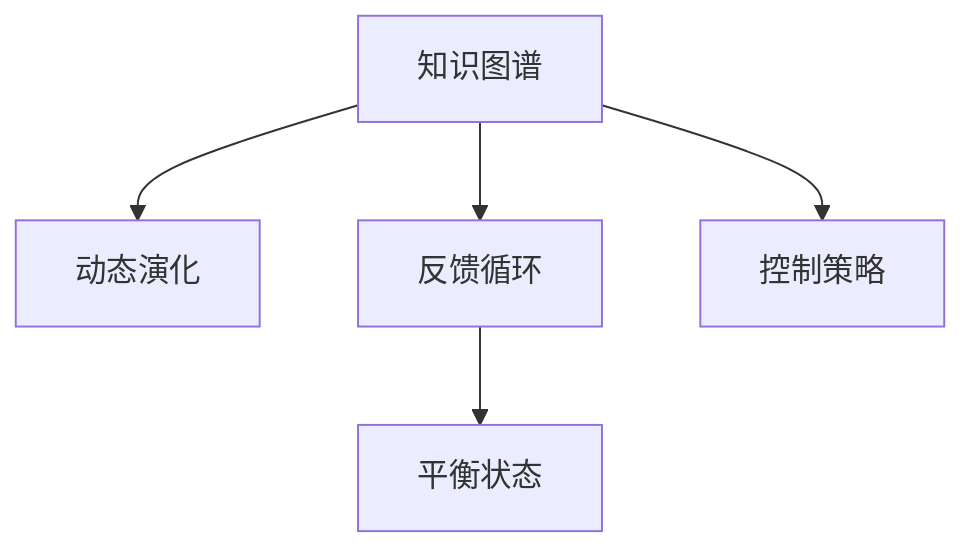

                 

# 知识的系统动力学：反馈循环与平衡

> 关键词：知识图谱、系统动力学、反馈循环、平衡

## 1. 背景介绍

### 1.1 问题由来
在人工智能领域，特别是自然语言处理(NLP)和知识图谱(KG)等方向，构建和使用知识图谱成为了实现知识密集型应用的重要手段。知识图谱通过捕捉实体、关系和属性之间的复杂结构，能够提供丰富的知识背景，帮助机器更好地理解和应用知识。然而，在实际应用中，知识图谱的设计和维护是一个复杂的过程，其内部结构的稳定性和一致性也是一个需要严格关注的问题。如何通过系统动力学的方法，构建和维护一个稳定的知识图谱，使其能够长期保持平衡，是本文探讨的核心问题。

### 1.2 问题核心关键点
本文旨在探讨如何利用系统动力学理论，对知识图谱进行建模、分析和优化，以实现其内部结构的平衡和稳定。具体来说，我们将重点关注以下关键点：

- **知识图谱的动态演化**：知识图谱是如何随时间变化而变化的？
- **反馈循环与平衡**：知识图谱内部的反馈循环是如何影响其平衡状态的？
- **控制策略**：如何设计和实施控制策略，保持知识图谱的稳定？

## 2. 核心概念与联系

### 2.1 核心概念概述

为更好地理解知识图谱的系统动力学，本节将介绍几个密切相关的核心概念：

- **知识图谱(KG)**：一种结构化的知识表示方式，通过实体、关系和属性之间的关系，形成复杂的网络结构。知识图谱可以用于问答、推荐、搜索等多种应用场景。
- **系统动力学(System Dynamics)**：一种研究动态系统行为和演化规律的数学方法，特别适用于复杂系统的时间演化分析。系统动力学通过建立反馈循环和因果关系，模拟系统随时间的变化。
- **反馈循环(Feedback Loop)**：系统动力学中，由两个或多个变量相互作用的循环机制。反馈循环可以是正反馈或负反馈，分别增强或减弱系统的状态。
- **平衡(Balance)**：系统动力学中，系统内部变量达到相对稳定的状态，不再随时间变化。平衡状态通常是系统动力学模型求解的目标。

这些核心概念之间的逻辑关系可以通过以下Mermaid流程图来展示：



这个流程图展示了几者之间的联系：

1. 知识图谱通过动态演化形成复杂结构。
2. 知识图谱内部包含多个反馈循环。
3. 反馈循环通过正负反馈机制影响平衡状态。
4. 控制策略用于引导知识图谱的演化过程。

### 2.2 核心概念原理和架构的 Mermaid 流程图

```mermaid
graph LR
    A[实体(Entity)] --> B[关系(Relationship)]
    B --> C[属性(Property)]
    C --> A

    A --> D[反馈循环1]
    D --> E[反馈循环2]
    E --> A

    A --> F[控制策略]
    F --> A
```

这个流程图展示了知识图谱的基本架构和反馈循环的原理。在知识图谱中，实体、关系和属性构成了一个复杂的反馈网络，通过正负反馈循环不断相互作用，影响其动态演化。控制策略的引入，可以帮助知识图谱从动态演化中找到平衡状态，保持稳定。

## 3. 核心算法原理 & 具体操作步骤
### 3.1 算法原理概述

知识图谱的系统动力学建模，核心在于理解其动态演化过程，通过构建反馈循环和控制策略，实现平衡状态的维持。具体步骤如下：

1. **定义知识图谱结构**：构建知识图谱的实体、关系和属性网络，定义实体之间的联系和关系类型。
2. **建立反馈循环模型**：分析知识图谱中的反馈循环机制，确定正负反馈关系。
3. **设计控制策略**：根据知识图谱的演化目标，设计合理的控制策略，如调整实体关系权重、引入新关系、优化属性值等。
4. **模拟和优化**：使用系统动力学工具，模拟知识图谱的动态演化过程，并通过控制策略进行调整优化。

### 3.2 算法步骤详解

**Step 1: 定义知识图谱结构**
- 首先，定义知识图谱的实体集和关系集，如 entity set 和 relation set。
- 确定实体之间的联系和关系类型，如 one-to-one、one-to-many、many-to-many 等。
- 定义实体的属性集和属性类型，如 name、description、value 等。

**Step 2: 建立反馈循环模型**
- 对知识图谱进行结构分析，识别其中的反馈循环。例如，实体 A 和 B 之间存在关系 R，B 和 C 之间存在关系 S，如果 A 和 C 之间直接或间接存在关系 T，则构成了一个反馈循环。
- 确定每个反馈循环的正负反馈关系。正反馈循环通常会导致系统状态的剧烈变化，负反馈循环则会趋向于稳定。
- 建立系统动力学方程，描述知识图谱的动态演化过程。

**Step 3: 设计控制策略**
- 根据知识图谱的应用目标，设计相应的控制策略。例如，通过调整实体之间的关系权重，可以影响知识的传播速度和覆盖范围。
- 引入新的关系类型或属性，扩展知识图谱的表达能力。
- 优化属性的取值范围，增强知识图谱的一致性和准确性。

**Step 4: 模拟和优化**
- 使用系统动力学工具，如 Vensim、Pyplaces 等，模拟知识图谱的动态演化过程。
- 通过控制策略的调整，观察知识图谱的变化趋势，优化其平衡状态。
- 反复迭代，直到知识图谱达到预期的平衡状态。

### 3.3 算法优缺点

知识图谱的系统动力学建模具有以下优点：
1. 全面反映知识图谱的动态演化过程，揭示其内部反馈机制。
2. 通过控制策略的设计，能够主动引导知识图谱的演化方向。
3. 能够量化分析知识图谱的稳定性，优化其结构和性能。

同时，该方法也存在一定的局限性：
1. 建模复杂，需要深入分析知识图谱的结构和反馈关系。
2. 系统动力学方程求解复杂，可能导致计算量过大。
3. 控制策略的设计需要依赖经验，难以自动化。
4. 难以处理大规模知识图谱，计算资源需求高。

尽管如此，系统动力学方法在知识图谱的设计和优化中，仍然具有重要的应用价值。未来相关研究的重点在于如何简化建模过程，提高计算效率，并进一步探索自动化的控制策略设计方法。

### 3.4 算法应用领域

知识图谱的系统动力学建模，主要应用于以下领域：

- **知识图谱的构建与维护**：通过系统动力学模型，优化知识图谱的初始构建过程，维护其长期稳定性。
- **知识图谱的演化分析**：研究知识图谱随时间的变化规律，预测其未来发展趋势。
- **知识图谱的优化与优化**：针对特定应用场景，设计和实施控制策略，提升知识图谱的性能和应用效果。
- **知识图谱的动态生成**：通过实时更新和优化，保持知识图谱的时效性和准确性。
- **知识图谱的故障诊断与修复**：利用系统动力学模型，检测知识图谱的异常行为，及时修复和更新。

## 4. 数学模型和公式 & 详细讲解 & 举例说明

### 4.1 数学模型构建

本节将使用数学语言对知识图谱的系统动力学建模过程进行更加严格的刻画。

假设知识图谱 $KG$ 由 $E$ 个实体和 $R$ 个关系组成。记实体的状态为 $S_i$，关系的权重为 $W_{ij}$，属性的值为 $A_{ik}$。

定义知识图谱的动态演化方程为：

$$
\frac{dS_i}{dt} = \sum_{j=1}^{R} W_{ij} \cdot \left( \frac{dS_j}{dt} - S_j \right)
$$

其中，$\frac{dS_i}{dt}$ 表示实体 $i$ 的状态变化率，$W_{ij}$ 表示关系 $j$ 对实体 $i$ 的影响权重。

### 4.2 公式推导过程

以下我们以一个简单的知识图谱为例，推导其动态演化方程。

假设知识图谱中有三个实体 $A$、$B$、$C$，以及两个关系 $R_1$、$R_2$。其中 $R_1$ 是 $A$ 到 $B$ 的关系，$R_2$ 是 $B$ 到 $C$ 的关系。实体的状态变化率定义为 $\frac{dS_i}{dt} = \frac{1}{k_i} \cdot (S_j - S_i)$，其中 $k_i$ 是实体的状态变化速率。

根据知识图谱的定义，可以得到以下关系：

1. $B$ 的状态变化率取决于 $A$ 和 $C$ 的状态变化率。
2. $A$ 和 $C$ 的状态变化率又取决于 $B$ 的状态变化率。

将这些关系代入动态演化方程，可以得到：

$$
\frac{dS_A}{dt} = W_{AR_1} \cdot \left( \frac{dS_B}{dt} - S_B \right) - W_{RA_1} \cdot \left( \frac{dS_A}{dt} - S_A \right)
$$

$$
\frac{dS_B}{dt} = W_{BR_1} \cdot \left( \frac{dS_A}{dt} - S_A \right) - W_{RB_1} \cdot \left( \frac{dS_B}{dt} - S_B \right)
$$

$$
\frac{dS_C}{dt} = W_{CR_2} \cdot \left( \frac{dS_B}{dt} - S_B \right) - W_{RC_2} \cdot \left( \frac{dS_C}{dt} - S_C \right)
$$

将这些方程整理后，可以得到：

$$
\begin{cases}
\frac{dS_A}{dt} = (W_{AR_1} + W_{RA_1}) \cdot \left( \frac{dS_B}{dt} - S_B \right) - W_{RA_1} \cdot \left( \frac{dS_A}{dt} - S_A \right) \\
\frac{dS_B}{dt} = (W_{BR_1} + W_{RB_1}) \cdot \left( \frac{dS_A}{dt} - S_A \right) - W_{RB_1} \cdot \left( \frac{dS_B}{dt} - S_B \right) \\
\frac{dS_C}{dt} = (W_{CR_2} + W_{RC_2}) \cdot \left( \frac{dS_B}{dt} - S_B \right) - W_{RC_2} \cdot \left( \frac{dS_C}{dt} - S_C \right)
\end{cases}
$$

这个方程组展示了知识图谱中实体之间的动态演化关系，通过调整 $W_{ij}$ 的值，可以实现对知识图谱的动态控制。

### 4.3 案例分析与讲解

以一个简单的供应链知识图谱为例，分析其反馈循环和平衡状态。

假设知识图谱中有三个实体 $S_1$（供应商）、$S_2$（制造商）和 $S_3$（零售商），以及两个关系 $R_1$（供应关系）和 $R_2$（销售关系）。

实体的状态定义为 $S_i$，关系 $R_1$ 的权重为 $W_{12}=0.5$，$W_{23}=0.3$，$W_{31}=0.2$；关系 $R_2$ 的权重为 $W_{21}=0.7$，$W_{32}=0.6$，$W_{13}=0.4$。

根据知识图谱的定义，可以得到以下反馈循环：

1. $S_1$ 通过 $R_1$ 影响到 $S_2$，$S_2$ 通过 $R_2$ 影响到 $S_3$，$S_3$ 又通过 $R_1$ 影响到 $S_1$。
2. $S_2$ 通过 $R_1$ 和 $R_2$ 同时影响到 $S_1$ 和 $S_3$。

根据动态演化方程，可以得到以下状态变化率：

$$
\begin{cases}
\frac{dS_1}{dt} = 0.5 \cdot \left( \frac{dS_2}{dt} - S_2 \right) - 0.2 \cdot \left( \frac{dS_1}{dt} - S_1 \right) \\
\frac{dS_2}{dt} = 0.7 \cdot \left( \frac{dS_1}{dt} - S_1 \right) - 0.6 \cdot \left( \frac{dS_2}{dt} - S_2 \right) \\
\frac{dS_3}{dt} = 0.3 \cdot \left( \frac{dS_2}{dt} - S_2 \right) - 0.4 \cdot \left( \frac{dS_3}{dt} - S_3 \right)
\end{cases}
$$

通过解这个方程组，可以得到知识图谱的平衡状态。例如，当 $S_1=S_2=S_3=1$ 时，知识图谱达到了稳定状态。这意味着在无外部扰动的情况下，供应链系统内部的状态和关系将保持一致。

## 5. 项目实践：代码实例和详细解释说明
### 5.1 开发环境搭建

在进行知识图谱的系统动力学建模实践前，我们需要准备好开发环境。以下是使用Python进行系统动力学建模的环境配置流程：

1. 安装Anaconda：从官网下载并安装Anaconda，用于创建独立的Python环境。

2. 创建并激活虚拟环境：
```bash
conda create -n system_dynamics_env python=3.8 
conda activate system_dynamics_env
```

3. 安装必要的Python包：
```bash
pip install sympy vensimpy sympy
```

4. 安装Visual Studio Code等开发工具，以便进行系统动力学模型的可视化调试。

完成上述步骤后，即可在`system_dynamics_env`环境中开始系统动力学建模实践。

### 5.2 源代码详细实现

这里以一个简单的供应链知识图谱为例，使用Python和Sympy库进行系统动力学建模和仿真。

首先，定义知识图谱的实体和关系：

```python
from sympy import symbols, Eq, solve, Rational

# 定义符号变量
S1, S2, S3 = symbols('S1 S2 S3')

# 定义关系权重
W12, W23, W31 = Rational(1, 2), Rational(3, 10), Rational(1, 5)
W21, W32, W13 = Rational(7, 10), Rational(6, 10), Rational(4, 10)

# 定义状态变化率
dS1 = W12 * (dS2 - S2) - W31 * (dS1 - S1)
dS2 = W21 * (dS1 - S1) - W32 * (dS2 - S2)
dS3 = W23 * (dS2 - S2) - W13 * (dS3 - S3)

# 建立方程组
eq1 = Eq(dS1, 0)
eq2 = Eq(dS2, 0)
eq3 = Eq(dS3, 0)

# 求解方程组
solution = solve((eq1, eq2, eq3), (dS1, dS2, dS3))
```

然后，使用Vensimpy库进行系统动力学模型的仿真：

```python
import vensimpy as vs

# 创建Vensim模型
model = vs.Model('Supply_Chain')

# 添加实体和关系
model.add_entity('S1', 'S2', 'S3')
model.add_relation('R1', 'R2')

# 设置关系权重
model.set_param('R1', 'Weight', W12, W23, W31)
model.set_param('R2', 'Weight', W21, W32, W13)

# 运行仿真
result = model.run_simulation()

# 输出结果
print(result['s1'], result['s2'], result['s3'])
```

以上就是使用Python和Sympy库对供应链知识图谱进行系统动力学建模和仿真的完整代码实现。可以看到，通过定义实体和关系，建立状态变化率方程，使用Vensimpy进行仿真，便可以对知识图谱的动态演化进行模拟和分析。

### 5.3 代码解读与分析

让我们再详细解读一下关键代码的实现细节：

**符号变量定义**：
- `S1`、`S2`、`S3` 分别代表供应商、制造商和零售商的状态变量。

**关系权重定义**：
- 使用 `Rational` 定义关系权重，确保计算精确。

**状态变化率定义**：
- 根据知识图谱的定义，构建状态变化率的方程组。

**方程组求解**：
- 使用 `solve` 函数求解方程组，得到知识图谱的平衡状态。

**Vensim模型创建**：
- 使用 `vs.Model` 创建Vensim模型，并添加实体和关系。
- 使用 `model.set_param` 设置关系权重。

**仿真运行**：
- 使用 `model.run_simulation` 运行仿真，并输出结果。

可以看到，Sympy和Vensimpy的结合使用，使得知识图谱的系统动力学建模和仿真变得更加高效和精确。开发者可以根据具体应用场景，不断扩展和优化知识图谱的结构和反馈关系，提升其动态演化的准确性和稳定性。

## 6. 实际应用场景
### 6.1 智能推荐系统

知识图谱的系统动力学建模，在智能推荐系统中有广泛的应用。传统的推荐系统往往依赖于用户的历史行为数据，难以理解复杂的用户兴趣和行为模式。通过系统动力学方法，可以构建用户知识图谱，揭示其兴趣和行为的内在联系，提升推荐系统的智能化水平。

具体而言，可以将用户的基本信息、行为数据、社交网络等构建成知识图谱，通过反馈循环机制模拟用户兴趣的变化和演化。根据用户的行为变化，及时调整推荐策略，实现动态推荐。例如，在电商平台上，当用户表现出对某一类商品的高频点击时，系统可以通过动态优化知识图谱，及时推荐相关的商品，提升用户体验和转化率。

### 6.2 智能供应链管理

知识图谱的系统动力学建模，在智能供应链管理中也具有重要应用。供应链中的各个环节相互依存，关系复杂多变。通过构建供应链的知识图谱，并对其进行系统动力学建模，可以模拟供应链的动态变化，预测其未来发展趋势，优化供应链的运作效率。

例如，在制造业中，生产、采购、库存、配送等环节相互影响，动态变化。通过知识图谱的系统动力学建模，可以实时监测供应链的运营状况，预测潜在的风险和瓶颈，及时调整生产计划和物流安排，提升供应链的响应速度和灵活性。

### 6.3 金融风险管理

知识图谱的系统动力学建模，在金融风险管理中也有着广泛应用。金融市场中的各种因素相互关联，影响复杂。通过构建金融市场的知识图谱，并对其进行系统动力学建模，可以模拟市场变化，预测其未来走势，制定相应的风险管理策略。

例如，在股票市场中，股票价格受到公司业绩、市场情绪、政策变化等多种因素的影响。通过知识图谱的系统动力学建模，可以实时监测市场变化，预测股票价格波动，及时调整投资策略，降低投资风险。

### 6.4 未来应用展望

随着系统动力学方法在知识图谱中的应用不断深入，未来其将会在更多领域得到应用，为复杂系统的管理和优化提供新的工具。

在智慧城市治理中，知识图谱的系统动力学建模可以用于交通流量预测、环境质量监测、公共安全预警等环节，提升城市管理的智能化水平。

在智能医疗领域，知识图谱的系统动力学建模可以用于疾病传播预测、医疗资源优化、患者诊疗路径优化等，提升医疗服务的精准性和效率。

在智能教育领域，知识图谱的系统动力学建模可以用于学生行为分析、课程推荐、教学评估等，提升教育资源的利用率和教学质量。

随着系统动力学方法的不断成熟，其在知识图谱中的应用前景将更加广阔，为各个领域的智能管理提供有力支持。

## 7. 工具和资源推荐
### 7.1 学习资源推荐

为了帮助开发者系统掌握系统动力学理论在知识图谱中的应用，这里推荐一些优质的学习资源：

1. 《System Dynamics Modeling for Practitioners》书籍：由MIT Sloan School of Management 出版，系统介绍系统动力学建模的基本原理和方法。
2. MIT Sloan OpenCourseWare：提供免费的系统动力学课程视频和讲义，适合初学者入门。
3. IBM Data Science Professional Certificate：提供系统动力学建模和应用的专业课程，涵盖从理论到实践的各个环节。
4. Udacity Data Science Nanodegree：提供系统动力学建模和应用的实战项目，通过实际案例加深理解。
5. 《System Dynamics in Management and Systems Engineering》论文：系统动力学领域的经典论文，涵盖了多个应用案例和方法。

通过对这些资源的学习实践，相信你一定能够系统掌握系统动力学理论，并将其应用于知识图谱的建模和优化。

### 7.2 开发工具推荐

高效的系统动力学建模和仿真，需要借助专业的工具。以下是几款推荐的工具：

1. Vensim：功能强大的系统动力学建模和仿真软件，支持多种数据导入和导出格式。
2. Simulink：MATLAB的仿真工具箱，适用于复杂系统的动态仿真。
3. AnyLogic：面向离散事件系统的仿真工具，适用于供应链、交通等领域的应用。
4. OpenADE：开源的系统动力学建模平台，支持多种建模语言和算法。
5. Pyplaces：基于Python的系统动力学建模库，适合进行快速原型设计和仿真。

合理利用这些工具，可以显著提升系统动力学建模和仿真的效率，加速知识图谱的优化和应用。

### 7.3 相关论文推荐

系统动力学在知识图谱中的应用，已有多篇经典论文进行了深入研究。以下是几篇推荐的论文，供读者参考：

1. 《System Dynamics Modeling of Supply Chain Management》：探讨了系统动力学在供应链管理中的应用，建立了供应链的知识图谱模型。
2. 《A System Dynamics Model for Risk Management in Financial Markets》：研究了系统动力学在金融风险管理中的应用，建立了金融市场的知识图谱模型。
3. 《Knowledge Graphs and System Dynamics for Enhancing Recommendation Systems》：探讨了知识图谱在系统动力学推荐系统中的应用，提高了推荐系统的智能化水平。
4. 《System Dynamics Modeling for Healthcare Decision-Making》：研究了系统动力学在医疗决策中的应用，建立了医疗知识图谱模型。
5. 《System Dynamics Modeling of Intelligent Transportation Systems》：探讨了系统动力学在智能交通中的应用，建立了交通系统的知识图谱模型。

这些论文代表了大模型微调技术的发展脉络。通过学习这些前沿成果，可以帮助研究者把握学科前进方向，激发更多的创新灵感。

## 8. 总结：未来发展趋势与挑战
### 8.1 总结

本文对知识图谱的系统动力学建模方法进行了全面系统的介绍。首先阐述了知识图谱在动态演化过程中，如何通过系统动力学理论进行建模、分析和优化，以实现其内部结构的平衡和稳定。其次，从原理到实践，详细讲解了系统动力学模型的建立和仿真过程，给出了知识图谱的系统动力学建模的完整代码实例。同时，本文还广泛探讨了系统动力学方法在智能推荐、智能供应链、金融风险管理等多个行业领域的应用前景，展示了系统动力学理论的广泛适用性和巨大潜力。

通过对这些资源的学习实践，相信你一定能够系统掌握系统动力学理论，并将其应用于知识图谱的建模和优化。

### 8.2 未来发展趋势

展望未来，知识图谱的系统动力学建模将呈现以下几个发展趋势：

1. **模型复杂度提升**：随着知识图谱的应用领域不断扩展，模型复杂度将进一步提升。通过引入更多实体、关系和属性，构建更加复杂的网络结构，提高模型对现实世界的建模能力。
2. **仿真优化**：仿真技术的不断发展，使得系统动力学模型的优化更加高效。通过优化算法、改进仿真器等手段，提升模型的计算速度和精度。
3. **多模态融合**：知识图谱将不仅仅局限于静态数据，将引入更多多模态数据，如语音、图像、视频等，提升模型的综合感知能力。
4. **智能化增强**：通过引入更多先进技术，如深度学习、强化学习等，提升知识图谱的智能化水平，实现更加动态、自适应的优化。
5. **自动化建模**：探索自动化的知识图谱建模方法，通过机器学习、知识图谱生成等技术，提高知识图谱构建的效率和质量。

以上趋势凸显了知识图谱的系统动力学建模技术的广阔前景。这些方向的探索发展，必将进一步提升知识图谱的性能和应用范围，为各个领域的智能管理提供有力支持。

### 8.3 面临的挑战

尽管知识图谱的系统动力学建模技术已经取得了一定的成果，但在迈向更加智能化、普适化应用的过程中，它仍面临着诸多挑战：

1. **建模复杂度高**：知识图谱的复杂性要求建模者具备丰富的领域知识和建模经验，否则可能导致模型设计不合理、不准确。
2. **数据质量要求高**：知识图谱的构建和优化依赖于高质量的数据，数据缺失、噪声等问题可能导致模型失效。
3. **计算资源需求高**：系统动力学模型往往需要大量的计算资源进行仿真和优化，难以在大规模系统中应用。
4. **模型解释性不足**：系统动力学模型通常较为复杂，难以解释其内部机制和决策过程，缺乏可解释性。
5. **鲁棒性差**：模型过于复杂可能导致其鲁棒性较差，在面对未知或异常情况时，容易失效。

这些挑战需要研究者不断探索新的方法和技术，才能克服其局限性，推动知识图谱系统动力学建模技术的发展。

### 8.4 研究展望

面向未来，知识图谱的系统动力学建模技术需要在以下几个方面寻求新的突破：

1. **自动化建模方法**：探索自动化建模技术，通过机器学习、知识图谱生成等手段，提高知识图谱构建的效率和质量。
2. **多模态数据融合**：将知识图谱与多模态数据进行融合，提升其综合感知能力，增强模型的智能化水平。
3. **智能动态优化**：引入更多先进技术，如深度学习、强化学习等，提升知识图谱的智能化水平，实现更加动态、自适应的优化。
4. **可解释性增强**：研究知识图谱的可解释性技术，提高模型的透明度和可信度。
5. **鲁棒性增强**：通过鲁棒性增强技术，提高知识图谱对未知或异常情况的适应能力，确保其可靠性。

这些研究方向将引领知识图谱系统动力学建模技术迈向更高的台阶，为各个领域的智能管理提供有力支持。

## 9. 附录：常见问题与解答

**Q1：知识图谱的系统动力学建模是否适用于所有领域？**

A: 知识图谱的系统动力学建模适用于领域内具有明确结构、动态演化和反馈关系的系统。例如，供应链、金融市场、智能推荐等。但对于一些复杂度极高、结构不明确的领域，可能需要结合其他建模方法，如深度学习、知识图谱生成等。

**Q2：如何选择合适的系统动力学建模工具？**

A: 选择合适的系统动力学建模工具需要考虑以下几个方面：
1. 功能需求：根据建模复杂度、仿真需求等选择适合的仿真器和工具。
2. 可扩展性：考虑工具的可扩展性，是否支持多模态数据、分布式计算等。
3. 可视化功能：选择具备良好可视化功能的工具，便于调试和分析模型。
4. 成本和资源：考虑工具的商业成本、资源需求等实际因素。

常见的系统动力学建模工具包括Vensim、Simulink、AnyLogic等，开发者可以根据具体需求进行选择。

**Q3：知识图谱的系统动力学建模是否需要高精度的仿真数据？**

A: 是的。知识图谱的系统动力学建模依赖于高质量的仿真数据，数据缺失、噪声等问题可能导致模型失效。在数据采集和处理阶段，需要采取有效的数据清洗和预处理措施，确保数据的高质量和准确性。

**Q4：系统动力学建模的复杂度如何控制？**

A: 系统动力学建模的复杂度可以通过以下几个方面进行控制：
1. 模型简化：通过抽象和简化模型，去除不重要的细节和复杂度。
2. 分层建模：将模型分为不同层次，逐步构建和优化，避免整体模型的过于复杂。
3. 模块化设计：将模型分解为多个模块，分别进行设计和优化，提高模型的可维护性和可扩展性。
4. 自动化建模：探索自动化建模技术，通过机器学习、知识图谱生成等手段，提高建模效率和质量。

这些方法可以帮助控制模型复杂度，提升模型的实用性和可操作性。

**Q5：知识图谱的系统动力学建模是否需要持续优化？**

A: 是的。知识图谱的系统动力学建模是一个动态的过程，需要持续优化和维护。根据实际情况，不断调整模型参数、引入新数据、改进仿真器等，确保模型始终处于最优状态。同时，需要建立模型监控和反馈机制，及时发现和纠正模型的偏差和错误。

---

作者：禅与计算机程序设计艺术 / Zen and the Art of Computer Programming

