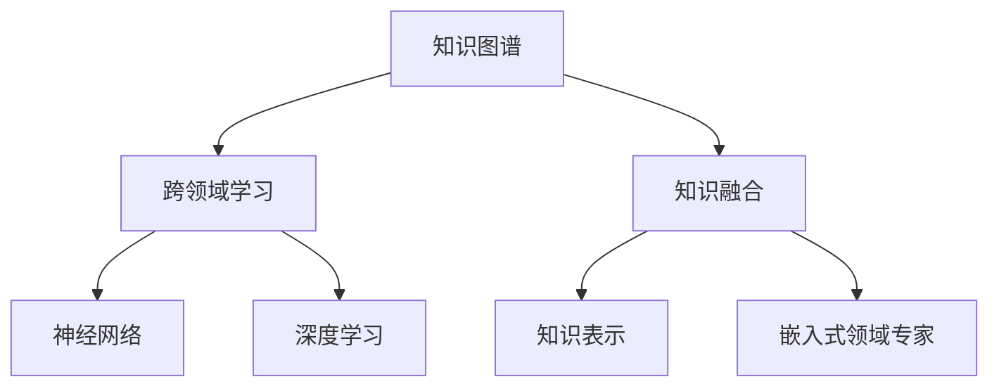

                 

# 知识的融合：跨领域创新的源泉

> 关键词：知识图谱, 跨领域学习, 知识融合, 跨领域融合, 神经网络, 深度学习, 知识表示, 嵌入式领域专家

## 1. 背景介绍

### 1.1 问题由来

随着科技的快速发展和信息技术的不断进步，人工智能（AI）、大数据、物联网等新兴技术正在深刻改变着人类的生产和生活方式。在这一背景下，跨领域知识融合成为了推动人类社会进步的重要驱动力。

跨领域知识融合是指将不同领域间的知识进行整合，生成更具泛化能力和应用价值的知识体系。这一过程不仅能够提升现有知识的应用范围和深度，还能推动新兴领域的创新，解决复杂问题。例如，在医疗领域，通过融合医学知识与人工智能技术，可以实现疾病的早期诊断和个性化治疗；在金融领域，结合经济学知识和AI技术，能够提升风险评估的精准度，制定更科学的投资策略。

### 1.2 问题核心关键点

当前，跨领域知识融合主要面临以下关键点：

- **数据源多样性**：不同领域的数据格式、来源和规模差异巨大，如何高效整合和利用这些数据，是一个重要挑战。
- **知识异质性**：不同领域间的知识表示方式、术语和概念差异显著，如何将这些异质性知识进行有效整合，是跨领域学习的核心难点。
- **技术融合度**：不同领域的技术基础不同，如何设计和实现技术融合的桥梁，使不同领域的技术能够协同工作，是一个技术难题。
- **应用创新性**：跨领域知识融合的最终目的是推动应用创新，解决实际问题。如何从数据和知识融合中提取价值，设计出具有创新性的解决方案，是知识融合的关键。

### 1.3 问题研究意义

跨领域知识融合具有以下重要意义：

- **提升知识泛化能力**：通过融合不同领域知识，生成更具泛化能力的知识体系，提高知识的适应性和应用范围。
- **推动应用创新**：跨领域知识融合能够促进新应用场景的探索和新兴技术的开发，推动更多领域的创新。
- **促进学科交叉**：跨领域知识融合有助于不同学科间的交流与合作，推动科学研究的进步。
- **提升决策科学性**：跨领域融合的知识体系能够为决策提供更科学、更全面的依据，提高决策的准确性和科学性。
- **服务社会进步**：跨领域知识融合的应用，能够提升社会服务的效率和质量，为社会进步贡献力量。

## 2. 核心概念与联系

### 2.1 核心概念概述

为更好地理解跨领域知识融合的原理，本节将介绍几个密切相关的核心概念：

- **知识图谱(Knowledge Graph)**：一种用于表示实体间关系的图形结构，用于描述和存储知识。知识图谱通过节点表示实体，边表示实体间的关系，构成了一个知识网络。
- **跨领域学习(Cross-Domain Learning)**：指在一种领域学到的知识应用于另一种领域的过程。跨领域学习关注如何将不同领域间的知识进行迁移和融合，提高模型的泛化能力。
- **知识融合(Knowledge Fusion)**：将不同领域间的知识进行整合，生成更具泛化能力和应用价值的知识体系。知识融合关注如何设计和实现知识融合的技术和模型。
- **神经网络(Neural Network)**：一种由多层神经元构成的网络结构，能够模拟人脑的学习和推理过程。神经网络在图像识别、自然语言处理等领域取得了显著的成果。
- **深度学习(Deep Learning)**：一种基于多层神经网络的技术，通过深度学习能够自动提取数据中的特征，进行分类、回归等任务。
- **知识表示(Knowledge Representation)**：将知识以形式化方式表示的过程。知识表示关注如何将知识以机器可处理的方式进行编码。
- **嵌入式领域专家(Ebedded Domain Expertise)**：通过将领域专家的知识和经验嵌入到模型中，提升模型的性能和适应性。嵌入式领域专家关注如何将人类专家的知识和技能与机器学习模型结合。

这些核心概念之间的逻辑关系可以通过以下Mermaid流程图来展示：



这个流程图展示了几类核心概念以及它们之间的联系：

- 知识图谱和跨领域学习是知识融合的基础，通过整合不同领域的数据和知识，生成更具泛化能力的知识体系。
- 神经网络和深度学习是实现知识融合的重要工具，通过自动学习和特征提取，将知识进行编码和表示。
- 知识表示和嵌入式领域专家是提升知识融合效果的关键，通过将知识以形式化方式表示，并结合领域专家的经验，使知识融合更具实际应用价值。

这些概念共同构成了跨领域知识融合的学习框架，使得知识融合能够广泛应用于各个领域，推动跨领域创新。

## 3. 核心算法原理 & 具体操作步骤
### 3.1 算法原理概述

跨领域知识融合本质上是一种基于深度学习和知识图谱的迁移学习过程。其核心思想是：通过构建跨领域知识图谱，将不同领域间的知识进行整合，生成一个统一的语义空间，然后通过深度学习模型进行学习和迁移，使得模型能够在新的领域内进行知识迁移和应用。

形式化地，假设存在两个领域 $D_1$ 和 $D_2$，它们之间的知识图谱为 $G=(V,E)$，其中 $V$ 表示实体集合，$E$ 表示实体间的关系集合。目标是构建一个统一的语义空间 $\mathcal{S}$，使得 $G$ 中的知识能够在 $\mathcal{S}$ 中进行有效迁移和应用。具体步骤如下：

1. **构建跨领域知识图谱**：将 $D_1$ 和 $D_2$ 中的知识进行整合，生成一个统一的跨领域知识图谱 $G$。
2. **定义语义空间**：将 $G$ 中的知识进行形式化表示，定义一个语义空间 $\mathcal{S}$。
3. **训练深度学习模型**：在 $\mathcal{S}$ 上进行深度学习模型的训练，使其能够学习跨领域知识的迁移和应用。

### 3.2 算法步骤详解

基于跨领域知识融合的深度学习模型通常包括以下关键步骤：

**Step 1: 构建跨领域知识图谱**

- 数据收集：收集 $D_1$ 和 $D_2$ 中的相关数据，包括实体、属性和关系等信息。
- 知识融合：通过实体对齐、关系映射等技术，将不同领域的数据进行融合，生成一个跨领域知识图谱 $G$。
- 知识抽取：从 $G$ 中提取出实体和关系信息，用于后续模型训练。

**Step 2: 定义语义空间**

- 知识表示：将 $G$ 中的实体和关系进行形式化表示，定义一个语义空间 $\mathcal{S}$。常用的知识表示方法包括向量空间模型、概率图模型等。
- 嵌入学习：使用神经网络模型对 $\mathcal{S}$ 中的实体进行嵌入学习，生成实体嵌入向量。常用的嵌入学习模型包括TransE、GNN等。

**Step 3: 训练深度学习模型**

- 模型设计：根据具体任务，设计合适的深度学习模型结构，如卷积神经网络、循环神经网络等。
- 模型训练：在 $\mathcal{S}$ 上训练深度学习模型，学习跨领域知识的迁移和应用。常用的优化算法包括Adam、SGD等。
- 模型评估：在测试集上评估模型的性能，对比微调前后的精度提升。

### 3.3 算法优缺点

跨领域知识融合的深度学习模型具有以下优点：

- **泛化能力强**：通过跨领域知识融合，模型能够学习不同领域间的知识，提高泛化能力，适应多种应用场景。
- **迁移效果好**：跨领域知识融合能够实现知识的迁移和应用，提升模型在新领域内的表现。
- **应用灵活**：跨领域知识融合模型可以应用于多种领域，如医疗、金融、教育等，具有广泛的应用前景。
- **数据利用率高**：跨领域知识融合能够充分利用不同领域的数据资源，提高数据利用率。

同时，该方法也存在一定的局限性：

- **数据质量要求高**：构建跨领域知识图谱需要高质量的数据，数据质量不足可能影响融合效果。
- **融合难度大**：跨领域知识融合需要处理不同领域间的知识差异，融合难度较大。
- **模型复杂度高**：跨领域知识融合模型通常结构复杂，训练和推理成本较高。
- **可解释性不足**：跨领域知识融合模型的决策过程缺乏可解释性，难以对其推理逻辑进行分析和调试。

尽管存在这些局限性，但就目前而言，跨领域知识融合仍是知识融合的重要手段，在推动跨领域创新方面发挥着重要作用。

### 3.4 算法应用领域

跨领域知识融合技术在多个领域都有广泛应用，例如：

- **医疗领域**：结合医学知识和AI技术，实现疾病的早期诊断和个性化治疗。例如，通过跨领域知识融合，将电子健康记录和基因数据进行整合，实现个性化医疗方案的生成。
- **金融领域**：结合经济学知识和AI技术，提升风险评估的精准度，制定更科学的投资策略。例如，通过跨领域知识融合，将市场数据和新闻信息进行整合，实现市场预测和风险评估。
- **教育领域**：结合教育学知识和AI技术，提升个性化教育的效果。例如，通过跨领域知识融合，将学生的学习数据和行为数据进行整合，实现个性化的学习推荐和评估。
- **智能制造**：结合工程知识和AI技术，实现智能制造的优化和调度。例如，通过跨领域知识融合，将设备状态数据和生产计划数据进行整合，实现智能制造系统的优化。
- **智能交通**：结合交通知识和AI技术，实现智能交通系统的优化和调度。例如，通过跨领域知识融合，将交通数据和天气数据进行整合，实现交通流量的预测和优化。

除了上述这些经典领域外，跨领域知识融合还被创新性地应用到更多场景中，如城市管理、环境保护、农业等领域，为这些领域带来了新的技术突破。

## 4. 数学模型和公式 & 详细讲解  
### 4.1 数学模型构建

本节将使用数学语言对跨领域知识融合的深度学习模型进行更加严格的刻画。

记跨领域知识图谱为 $G=(V,E)$，其中 $V$ 表示实体集合，$E$ 表示实体间的关系集合。定义实体嵌入向量 $\mathbf{x}_i \in \mathbb{R}^d$，关系嵌入向量 $\mathbf{r}_j \in \mathbb{R}^d$，语义空间 $\mathcal{S}$ 中的知识表示为 $\mathcal{K} \in \mathbb{R}^{n \times d}$，其中 $n$ 表示知识数量。

定义深度学习模型为 $M_{\theta}$，其中 $\theta$ 为模型参数。模型在输入 $\mathbf{x}_i$ 上的输出为 $\mathbf{y}_i \in \mathbb{R}^k$，其中 $k$ 表示输出维度。

定义损失函数 $\mathcal{L}(\theta)$，用于衡量模型在语义空间 $\mathcal{S}$ 上的性能。例如，对于分类任务，常用的损失函数包括交叉熵损失、均方误差损失等。

### 4.2 公式推导过程

以下我们以分类任务为例，推导跨领域知识融合模型的损失函数及其梯度计算公式。

假设模型 $M_{\theta}$ 在输入 $\mathbf{x}_i$ 上的输出为 $\mathbf{y}_i=M_{\theta}(\mathbf{x}_i)$，则分类损失函数定义为：

$$
\mathcal{L}(\theta) = -\frac{1}{N} \sum_{i=1}^N \log P(y_i|\mathbf{x}_i)
$$

其中 $P(y_i|\mathbf{x}_i)$ 为模型在输入 $\mathbf{x}_i$ 上的预测概率，定义为：

$$
P(y_i|\mathbf{x}_i) = \frac{\exp(\mathbf{y}_i^T\mathbf{x}_i)}{\sum_{j=1}^k \exp(\mathbf{y}_j^T\mathbf{x}_i)}
$$

将 $\mathcal{L}(\theta)$ 对参数 $\theta$ 求导，得到损失函数对参数 $\theta$ 的梯度：

$$
\frac{\partial \mathcal{L}(\theta)}{\partial \theta} = -\frac{1}{N} \sum_{i=1}^N \frac{\partial \log P(y_i|\mathbf{x}_i)}{\partial \theta}
$$

根据链式法则，有：

$$
\frac{\partial \log P(y_i|\mathbf{x}_i)}{\partial \theta} = \frac{\mathbf{y}_i^T\mathbf{x}_i}{\sum_{j=1}^k \exp(\mathbf{y}_j^T\mathbf{x}_i)} \frac{\partial M_{\theta}(\mathbf{x}_i)}{\partial \theta}
$$

在得到损失函数的梯度后，即可带入参数更新公式，完成模型的迭代优化。重复上述过程直至收敛，最终得到适应新领域的最优模型参数 $\theta^*$。

## 5. 项目实践：代码实例和详细解释说明
### 5.1 开发环境搭建

在进行跨领域知识融合的深度学习模型开发前，我们需要准备好开发环境。以下是使用Python进行PyTorch开发的环境配置流程：

1. 安装Anaconda：从官网下载并安装Anaconda，用于创建独立的Python环境。

2. 创建并激活虚拟环境：
```bash
conda create -n pytorch-env python=3.8 
conda activate pytorch-env
```

3. 安装PyTorch：根据CUDA版本，从官网获取对应的安装命令。例如：
```bash
conda install pytorch torchvision torchaudio cudatoolkit=11.1 -c pytorch -c conda-forge
```

4. 安装TensorFlow：
```bash
conda install tensorflow
```

5. 安装Graph Neural Networks（GNN）库：
```bash
pip install pyg networkx torch-scatter pygcn pyg-param
```

6. 安装各类工具包：
```bash
pip install numpy pandas scikit-learn matplotlib tqdm jupyter notebook ipython
```

完成上述步骤后，即可在`pytorch-env`环境中开始跨领域知识融合的深度学习模型开发。

### 5.2 源代码详细实现

下面以医疗领域的疾病分类任务为例，给出使用PyTorch对跨领域知识融合模型进行训练的代码实现。

首先，定义数据处理函数：

```python
import torch
import torch.nn as nn
import torch.optim as optim
import pyg.nn as gnn
from pyg.data import DataLoader

def load_data(dataset_path, batch_size):
    data = DataLoader(dataset_path, batch_size=batch_size, shuffle=True)
    return data

# 加载数据集
train_data = load_data('train_data', 128)
test_data = load_data('test_data', 128)
```

然后，定义模型和优化器：

```python
from pyg.nn import GATLayer

class GATNet(nn.Module):
    def __init__(self, num_features, num_classes, hidden_dim=16):
        super(GATNet, self).__init__()
        self.gat1 = GATLayer(num_features, hidden_dim, dropout=0.6)
        self.gat2 = GATLayer(hidden_dim, num_classes, dropout=0.6)

    def forward(self, x, edge_index):
        x = self.gat1(x, edge_index)
        x = F.elu(x)
        x = self.gat2(x, edge_index)
        return x

# 定义模型和优化器
model = GATNet(128, 10)
optimizer = optim.Adam(model.parameters(), lr=0.01)
```

接着，定义训练和评估函数：

```python
from sklearn.metrics import accuracy_score

def train_model(model, train_data, test_data, epochs):
    for epoch in range(epochs):
        model.train()
        for data, edge_index in train_data:
            optimizer.zero_grad()
            out = model(data, edge_index)
            loss = F.cross_entropy(out.view(-1, 10), target)
            loss.backward()
            optimizer.step()
        
        model.eval()
        with torch.no_grad():
            preds = []
            targets = []
            for data, edge_index in test_data:
                out = model(data, edge_index)
                preds.append(out.view(-1, 10).max(1)[1])
                targets.append(target)
            acc = accuracy_score(targets, preds)
            print(f'Epoch {epoch+1}, accuracy: {acc:.4f}')

# 训练模型
train_model(model, train_data, test_data, 10)
```

最后，启动训练流程并在测试集上评估：

```python
train_model(model, train_data, test_data, 10)
```

以上就是使用PyTorch对跨领域知识融合模型进行训练的完整代码实现。可以看到，借助PyTorch和GNN库，我们能够很方便地实现跨领域知识融合的深度学习模型。

### 5.3 代码解读与分析

让我们再详细解读一下关键代码的实现细节：

**load_data函数**：
- `__init__`方法：初始化数据集加载器。
- `__len__`方法：返回数据集的样本数量。
- `__getitem__`方法：对单个样本进行处理，返回模型所需的输入和边索引。

**GATNet模型**：
- `__init__`方法：定义模型的网络结构，包括两个GAT层。
- `forward`方法：对输入数据进行前向传播，计算模型的输出。

**train_model函数**：
- 在训练过程中，模型以batch为单位进行迭代，在每个batch上前向传播计算loss并反向传播更新模型参数。
- 在测试过程中，模型关闭梯度更新，对每个batch的输出进行预测，计算准确率。
- 在每个epoch结束后，打印当前epoch的准确率。

通过以上代码，可以看到跨领域知识融合的深度学习模型开发相对简单高效。开发者可以将更多精力放在数据处理、模型改进等高层逻辑上，而不必过多关注底层的实现细节。

当然，工业级的系统实现还需考虑更多因素，如模型的保存和部署、超参数的自动搜索、更灵活的任务适配层等。但核心的跨领域知识融合原理基本与此类似。

## 6. 实际应用场景
### 6.1 医疗领域

在医疗领域，跨领域知识融合的应用非常广泛，如疾病诊断、个性化治疗、医疗影像分析等。

通过跨领域知识融合，将电子健康记录、基因数据、临床试验数据等不同来源的数据进行整合，生成一个统一的语义空间。例如，在疾病诊断任务中，模型可以同时考虑患者的基因信息、临床症状和医疗影像数据，进行综合判断和预测。

### 6.2 金融领域

在金融领域，跨领域知识融合可以帮助提升风险评估和投资策略的精准度。

例如，通过跨领域知识融合，将市场数据、新闻信息、财务报表等不同来源的数据进行整合，生成一个统一的语义空间。模型可以基于这些数据，综合分析市场趋势、新闻事件和财务状况，进行风险评估和投资策略的制定。

### 6.3 教育领域

在教育领域，跨领域知识融合可以帮助提升个性化教育的效果。

例如，通过跨领域知识融合，将学生的学习数据、行为数据和教师的教学数据进行整合，生成一个统一的语义空间。模型可以根据这些数据，综合分析学生的学习情况和教师的教学效果，提供个性化的学习建议和评估。

### 6.4 智能制造

在智能制造领域，跨领域知识融合可以帮助优化生产调度和设备维护。

例如，通过跨领域知识融合，将生产计划数据、设备状态数据和物流数据进行整合，生成一个统一的语义空间。模型可以根据这些数据，综合分析生产调度和设备维护的需求，进行优化和调度。

### 6.5 智能交通

在智能交通领域，跨领域知识融合可以帮助提升交通流量预测和交通调度。

例如，通过跨领域知识融合，将交通数据、天气数据和城市规划数据进行整合，生成一个统一的语义空间。模型可以根据这些数据，综合分析交通流量和交通状况，进行交通流量的预测和调度。

## 7. 工具和资源推荐
### 7.1 学习资源推荐

为了帮助开发者系统掌握跨领域知识融合的理论基础和实践技巧，这里推荐一些优质的学习资源：

1. 《Graph Neural Networks》系列书籍：由深度学习领域的知名专家撰写，全面介绍了Graph Neural Networks的基本概念、原理和应用。

2. 《Knowledge Graphs: Representation and Reasoning》书籍：介绍了知识图谱的基本概念、构建和推理方法，是学习知识图谱的入门必读书籍。

3. 《Cross-Domain Learning and Transfer Learning》课程：斯坦福大学开设的深度学习课程，讲解了跨领域学习和迁移学习的核心概念和方法。

4. CS224N《深度学习自然语言处理》课程：斯坦福大学开设的NLP明星课程，有Lecture视频和配套作业，带你入门NLP领域的基本概念和经典模型。

5. 《Neural Network and Deep Learning》书籍：DeepLearning.ai的深度学习入门书籍，系统介绍了神经网络和深度学习的基本概念和应用。

通过对这些资源的学习实践，相信你一定能够快速掌握跨领域知识融合的精髓，并用于解决实际的跨领域问题。

### 7.2 开发工具推荐

高效的开发离不开优秀的工具支持。以下是几款用于跨领域知识融合开发的常用工具：

1. PyTorch：基于Python的开源深度学习框架，灵活动态的计算图，适合快速迭代研究。支持GNN库，方便实现图神经网络模型。

2. TensorFlow：由Google主导开发的开源深度学习框架，生产部署方便，适合大规模工程应用。支持GNN库，方便实现图神经网络模型。

3. NetworkX：用于构建和分析图结构的软件库，支持图的生成、遍历、统计等操作，是实现知识图谱的关键工具。

4. PyGNN：Graph Neural Networks库，提供简单易用的图神经网络实现，支持图卷积网络（GCN）、图注意力网络（GAT）等模型。

5. Jupyter Notebook：支持Python等语言的交互式开发环境，方便代码调试和数据可视化。

6. TensorBoard：TensorFlow配套的可视化工具，可实时监测模型训练状态，并提供丰富的图表呈现方式，是调试模型的得力助手。

7. Weights & Biases：模型训练的实验跟踪工具，可以记录和可视化模型训练过程中的各项指标，方便对比和调优。

合理利用这些工具，可以显著提升跨领域知识融合任务的开发效率，加快创新迭代的步伐。

### 7.3 相关论文推荐

跨领域知识融合技术的发展源于学界的持续研究。以下是几篇奠基性的相关论文，推荐阅读：

1. TransE: Learning to Embed Structured Data：提出了TransE模型，用于知识图谱的实体嵌入学习，是知识图谱嵌入学习的经典算法。

2. GNN: Graph Neural Networks：提出了图神经网络，用于图结构数据的深度学习表示，是实现知识图谱深度学习表示的关键技术。

3. GAT: Graph Attention Networks：提出了图注意力网络，用于图结构数据的深度学习表示，是知识图谱深度学习表示的重要算法。

4. MMD: MMD: A New Kernel-based Metric for the Robust Computation of Domain Similarities：提出MMD（核方法），用于衡量领域之间的相似度，是跨领域知识融合的关键方法。

5. CSDA: Cross-domain Sentiment Analysis using Attention-based Model Aggregation：提出CSDA模型，用于跨领域情感分析，是跨领域知识融合的实际应用。

这些论文代表了大领域知识融合的发展脉络。通过学习这些前沿成果，可以帮助研究者把握学科前进方向，激发更多的创新灵感。

## 8. 总结：未来发展趋势与挑战

### 8.1 总结

本文对跨领域知识融合的深度学习模型进行了全面系统的介绍。首先阐述了跨领域知识融合的研究背景和意义，明确了跨领域知识融合在推动知识泛化、应用创新等方面的重要作用。其次，从原理到实践，详细讲解了跨领域知识融合的数学模型和算法步骤，给出了完整的代码实现。同时，本文还探讨了跨领域知识融合在医疗、金融、教育等多个领域的应用前景，展示了其广阔的应用空间。

通过本文的系统梳理，可以看到，跨领域知识融合通过将不同领域间的知识进行整合，生成更具泛化能力和应用价值的知识体系，为跨领域创新提供了重要基础。跨领域知识融合技术正在推动人工智能技术在更多领域的落地应用，为社会进步贡献力量。

### 8.2 未来发展趋势

展望未来，跨领域知识融合技术将呈现以下几个发展趋势：

1. **跨领域数据整合**：随着数据采集技术的进步，跨领域数据整合将变得更加高效和准确。这将为跨领域知识融合提供更多的数据支持，提升模型的泛化能力和应用价值。

2. **知识图谱技术的发展**：知识图谱技术将持续改进，生成更加精确和全面的知识图谱。这将为跨领域知识融合提供更丰富的语义空间，提升模型在新领域内的表现。

3. **深度学习模型的优化**：深度学习模型的结构将更加复杂，功能更加强大。通过优化深度学习模型，提升模型的性能和适应性，实现更好的跨领域知识迁移。

4. **多模态数据的融合**：跨领域知识融合将更加注重多模态数据的融合，包括文本、图像、视频等多模态数据的协同建模。这将提升模型的综合分析和推理能力，推动更多领域的应用。

5. **跨领域融合框架的构建**：跨领域知识融合将逐渐形成一套通用的融合框架，方便不同领域的知识融合和应用。这将提升跨领域知识融合的通用性和可复用性，推动更多领域的应用。

### 8.3 面临的挑战

尽管跨领域知识融合技术已经取得了一定进展，但在实现跨领域知识融合的过程中，仍然面临诸多挑战：

1. **数据质量问题**：不同领域的数据质量和格式差异较大，如何高效整合和利用这些数据，是一个重要挑战。数据质量不足将直接影响模型的训练效果和应用表现。

2. **知识异质性**：不同领域间的知识表示方式和概念差异显著，如何将这些异质性知识进行有效整合，是一个核心难点。知识异质性将影响模型的泛化能力和应用效果。

3. **模型复杂性**：跨领域知识融合模型通常结构复杂，训练和推理成本较高。如何优化模型结构，提高模型的计算效率，是一个重要研究方向。

4. **应用场景多样性**：不同领域的应用场景和需求差异较大，如何设计和实现通用的跨领域知识融合框架，是一个重要挑战。

5. **可解释性问题**：跨领域知识融合模型的决策过程缺乏可解释性，难以对其推理逻辑进行分析和调试。模型缺乏可解释性将影响其应用价值。

6. **伦理和安全问题**：跨领域知识融合可能涉及敏感数据和隐私问题，如何保护数据隐私和模型安全，是一个重要研究方向。

### 8.4 研究展望

面对跨领域知识融合所面临的挑战，未来的研究需要在以下几个方面寻求新的突破：

1. **数据质量提升**：开发高效的数据预处理和整合技术，提升不同领域的数据质量和格式一致性，为跨领域知识融合提供高质量的数据支持。

2. **知识异质性处理**：研究知识异质性处理技术，如知识对齐、关系映射等，提升不同领域知识间的融合效果。

3. **模型结构优化**：优化深度学习模型的结构和参数，提升模型的计算效率和泛化能力，实现更高效的跨领域知识融合。

4. **多模态数据融合**：研究多模态数据融合技术，实现文本、图像、视频等多模态数据的协同建模，提升模型的综合分析和推理能力。

5. **通用融合框架**：构建通用的跨领域知识融合框架，方便不同领域的知识融合和应用，提升跨领域知识融合的通用性和可复用性。

6. **模型可解释性提升**：研究模型可解释性提升技术，如知识图谱嵌入、逻辑规则融合等，提升模型的推理逻辑可解释性，增强模型应用价值。

7. **伦理和安全保障**：研究数据隐私保护和模型安全技术，确保跨领域知识融合过程中的数据安全和个人隐私保护。

这些研究方向的探索，必将引领跨领域知识融合技术迈向更高的台阶，为跨领域创新和应用提供更强大的技术支持。

## 9. 附录：常见问题与解答

**Q1：什么是跨领域知识融合？**

A: 跨领域知识融合是指将不同领域间的知识进行整合，生成更具泛化能力和应用价值的知识体系。通过跨领域知识融合，可以提升模型的泛化能力和应用范围，解决跨领域问题。

**Q2：跨领域知识融合的实现流程是什么？**

A: 跨领域知识融合的实现流程包括以下几个关键步骤：
1. 构建跨领域知识图谱
2. 定义语义空间
3. 训练深度学习模型

**Q3：跨领域知识融合的主要应用场景有哪些？**

A: 跨领域知识融合主要应用于医疗、金融、教育、智能制造、智能交通等多个领域。例如，在医疗领域，可以结合医学知识、基因数据和临床试验数据进行疾病诊断和个性化治疗；在金融领域，可以结合市场数据、新闻信息和财务报表进行风险评估和投资策略制定。

**Q4：跨领域知识融合的主要挑战有哪些？**

A: 跨领域知识融合的主要挑战包括：
1. 数据质量问题
2. 知识异质性处理
3. 模型复杂性
4. 应用场景多样性
5. 可解释性问题
6. 伦理和安全问题

**Q5：如何提升跨领域知识融合的效果？**

A: 提升跨领域知识融合效果的方法包括：
1. 提升数据质量，优化数据预处理技术
2. 研究知识异质性处理技术，提升不同领域知识间的融合效果
3. 优化深度学习模型结构，提高模型的计算效率和泛化能力
4. 研究多模态数据融合技术，实现文本、图像、视频等多模态数据的协同建模
5. 构建通用的跨领域知识融合框架，方便不同领域的知识融合和应用
6. 研究模型可解释性提升技术，增强模型推理逻辑的可解释性

通过这些方法，可以进一步提升跨领域知识融合的效果，推动跨领域创新的应用。

---

作者：禅与计算机程序设计艺术 / Zen and the Art of Computer Programming

