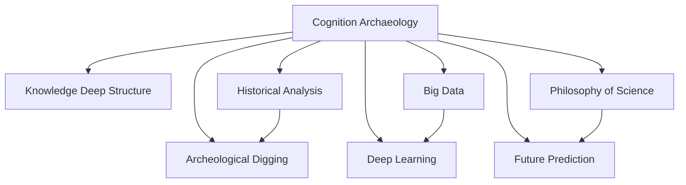

                 

# 知识的认知考古学：思想史的深层结构

> 关键词：认知考古学,思想史,人工智能,深度学习,神经网络,大数据,科学哲学,未来预测

## 1. 背景介绍

### 1.1 问题由来

在信息时代，知识的产生和传播已经突破了传统边界，数据和算法成为新的生产要素。但与之相伴的是，对知识理解的深度和广度也面临着前所未有的挑战。

- **数据的爆炸性增长**：大数据时代，海量数据的出现使得知识获取更加容易，但也使得知识过于碎片化，缺乏系统性和逻辑性。
- **算法的复杂性增强**：深度学习、神经网络等复杂算法的应用，使得知识理解和推理变得更加复杂。
- **认知的限度性显现**：人类的认知能力有限，难以理解和处理过于复杂和庞大的知识体系。

这些问题催生了“知识的认知考古学”这一新兴研究领域。通过对知识产生和传播的历史进行考古和分析，揭示知识深层结构的本质，为构建更高效、可解释的知识系统提供新思路。

### 1.2 问题核心关键点

知识认知考古学的核心在于通过历史和考古的方法，探索知识深层结构，挖掘知识本质规律，从而更好地理解和运用知识。

- **知识深层结构**：即知识的本质结构和深层含义，包括知识的生成方式、传播规律、应用场景等。
- **历史分析**：通过对历史数据和事件的挖掘，还原知识产生的背景和原因。
- **考古挖掘**：利用数据挖掘、文本挖掘等技术手段，从历史数据中提取知识深层结构。

## 2. 核心概念与联系

### 2.1 核心概念概述

为更好地理解知识的认知考古学，本节将介绍几个关键概念及其相互联系：

- **认知考古学**：通过历史和考古的方法，探索知识深层结构，挖掘知识本质规律。
- **知识深层结构**：知识的本质结构和深层含义，包括知识的生成方式、传播规律、应用场景等。
- **历史分析**：通过对历史数据和事件的挖掘，还原知识产生的背景和原因。
- **考古挖掘**：利用数据挖掘、文本挖掘等技术手段，从历史数据中提取知识深层结构。
- **大数据**：海量、高速、多样化的数据集合，为知识认知考古学提供了数据基础。
- **深度学习**：通过多层神经网络，从数据中学习知识表示和推理能力。
- **科学哲学**：研究知识本质和认知规律的哲学分支，为认知考古学提供理论支持。
- **未来预测**：利用历史数据和知识规律，对未来发展进行预测和规划。

这些概念之间的逻辑关系可以通过以下Mermaid流程图来展示：



这个流程图展示了几者之间的逻辑关系：

1. 认知考古学通过对历史和考古的分析，探索知识深层结构。
2. 大数据提供了研究基础，深度学习通过数据学习知识表示和推理能力。
3. 科学哲学为认知考古学提供理论支持，未来预测基于知识深层结构和历史规律。

这些概念共同构成了知识认知考古学的研究框架，揭示了知识本质和认知规律的深层结构。

## 3. 核心算法原理 & 具体操作步骤
### 3.1 算法原理概述

知识的认知考古学，本质上是对知识深层结构的考古和挖掘过程。其核心思想是：通过历史和考古的方法，从大量历史数据中提取知识深层结构，揭示知识本质规律，从而更好地理解和应用知识。

形式化地，假设有一批历史数据 $D$，包含了知识产生和传播的全过程。我们的目标是找到知识深层结构 $S$，使得 $S$ 能够完整地描述知识的本质规律。

### 3.2 算法步骤详解

知识的认知考古学主要包括以下几个关键步骤：

**Step 1: 数据收集与处理**

- 收集包含知识产生和传播过程的历史数据 $D$，如文献、档案、网络记录等。
- 清洗和处理数据，去除噪声和不相关内容，构建统一的数据格式。
- 使用文本挖掘、数据挖掘等技术，提取知识深层结构的关键特征。

**Step 2: 历史分析**

- 对历史数据进行分析和解释，还原知识产生的背景和原因。
- 分析知识传播路径和传播者，了解知识传播规律和影响因素。
- 研究知识的应用场景和实际效果，评估知识的价值和意义。

**Step 3: 考古挖掘**

- 利用文本挖掘、主题模型等技术，从历史数据中提取知识深层结构。
- 分析知识生成和演变的轨迹，发现知识深层结构的变化规律。
- 揭示知识深层结构的深层含义和本质特征，如知识产生的方式、传播的机制、应用的价值等。

**Step 4: 知识深层结构建模**

- 将挖掘出的知识深层结构 $S$ 进行建模，建立知识深层结构的数学模型。
- 使用深度学习等技术，训练模型学习知识深层结构的表示能力。
- 评估模型性能，确保模型能够准确描述知识深层结构。

**Step 5: 应用与预测**

- 将知识深层结构应用于新的知识获取和应用场景中，提升知识理解和应用的效率。
- 利用知识深层结构，对未来知识发展进行预测和规划，指导知识生产和传播。

以上是知识认知考古学的一般流程。在实际应用中，还需要针对具体任务的特点，对考古步骤进行优化设计，如改进数据挖掘方法，引入更多的历史数据，优化模型训练策略等，以进一步提升知识挖掘的效果。

### 3.3 算法优缺点

知识认知考古学方法具有以下优点：
1. 系统全面：通过对历史和考古的分析，能够全面系统地理解知识的深层结构。
2. 深度挖掘：能够深入挖掘知识本质规律，揭示知识深层结构的深层含义。
3. 可解释性强：通过历史和考古的方法，能够更好地解释知识的生成和传播过程。
4. 应用广泛：适用于各种类型的知识，如科学知识、技术知识、文化知识等。

同时，该方法也存在一定的局限性：
1. 数据需求高：需要大量高质量的历史数据，数据获取和处理成本较高。
2. 考古难度大：历史数据可能存在缺失和偏差，考古过程需要高度专业性和技术性。
3. 模型复杂：深度学习等技术对模型的复杂度和计算资源要求较高。
4. 时间成本大：考古过程复杂繁琐，需要耗费大量时间和人力。

尽管存在这些局限性，但就目前而言，知识认知考古学方法仍是一种重要的知识考古手段。未来相关研究的重点在于如何进一步降低考古成本，提高模型效率，优化考古过程，以更好地挖掘知识深层结构。

### 3.4 算法应用领域

知识认知考古学方法在多个领域得到了广泛的应用，包括但不限于：

- **科学史研究**：通过对历史数据的考古挖掘，揭示科学知识产生和传播的深层结构，推动科学史研究的发展。
- **技术创新**：利用历史数据的考古分析，挖掘技术演变的深层规律，指导技术创新和应用。
- **文化传承**：通过对文化历史数据的考古挖掘，揭示文化知识的内在结构和深层含义，促进文化传承和创新。
- **知识管理**：利用知识深层结构，构建更加高效、可解释的知识管理系统，提高知识获取和应用效率。
- **教育改革**：通过对教育历史数据的考古分析，挖掘教育知识的深层规律，推动教育改革和创新。
- **未来预测**：利用历史数据和知识规律，对未来知识发展进行预测和规划，指导知识生产和传播。

## 4. 数学模型和公式 & 详细讲解  
### 4.1 数学模型构建

本节将使用数学语言对知识认知考古学的考古挖掘过程进行更加严格的刻画。

记历史数据集为 $D$，包含 $N$ 条记录，每条记录包含 $m$ 个特征，即 $D=\{(x_i,y_i)\}_{i=1}^N$。其中 $x_i$ 为特征向量，$y_i$ 为标签。

定义知识深层结构为 $S$，通过考古挖掘得到知识深层结构 $S$ 的特征向量 $\overrightarrow{s}=[s_1,s_2,\cdots,s_k]$。其中 $s_i$ 为知识深层结构的第 $i$ 个特征。

### 4.2 公式推导过程

以下我们以历史数据集 $D$ 为例，推导知识深层结构建模的数学模型。

设知识深层结构 $S$ 与历史数据集 $D$ 之间的相关性矩阵为 $C$，即 $C_{ij}=\text{cor}(s_i,x_j)$，其中 $\text{cor}$ 为相关系数。

通过奇异值分解(SVD)，可以将相关性矩阵 $C$ 分解为 $C=U\Sigma V^T$，其中 $U$ 为左奇异矩阵，$V$ 为右奇异矩阵，$\Sigma$ 为奇异值矩阵。

进一步，设 $S$ 的表示向量为 $\overrightarrow{s}$，则有 $\overrightarrow{s}=U\hat{s}$，其中 $\hat{s}$ 为 $U$ 矩阵中的奇异值向量。

根据上述推导，知识深层结构建模的数学模型为：

$$
S=U\hat{s}
$$

其中 $\hat{s}=[\hat{s}_1,\hat{s}_2,\cdots,\hat{s}_k]$ 为 $U$ 矩阵中的奇异值向量。

通过上述模型，可以准确描述知识深层结构的深层含义和本质特征，为知识考古学提供理论支持。

### 4.3 案例分析与讲解

我们以医学知识的考古挖掘为例，说明知识认知考古学的方法和应用。

**案例背景**：医学知识广泛而复杂，通过历史数据和考古挖掘，可以揭示医学知识的深层结构和本质规律。

**数据收集**：收集历史医学文献、病历记录、临床试验数据等，构建包含患者特征、诊断结果、治疗方案等在内的历史数据集 $D$。

**历史分析**：通过历史数据，还原医学知识产生和传播的背景和原因，分析不同时间段医学知识的演变规律。

**考古挖掘**：利用文本挖掘、主题模型等技术，从历史数据中提取医学知识的深层结构 $S$，如疾病类型、治疗方案、疗效评价等。

**知识深层结构建模**：使用奇异值分解等技术，构建知识深层结构的数学模型，训练模型学习医学知识的表示能力。

**应用与预测**：将知识深层结构应用于新的医学研究和治疗方案设计中，提升医学知识的理解和应用效率。

## 5. 项目实践：代码实例和详细解释说明
### 5.1 开发环境搭建

在进行知识考古学实践前，我们需要准备好开发环境。以下是使用Python进行知识考古学开发的环境配置流程：

1. 安装Anaconda：从官网下载并安装Anaconda，用于创建独立的Python环境。

2. 创建并激活虚拟环境：
```bash
conda create -n archaeology-env python=3.8 
conda activate archaeology-env
```

3. 安装相关库：
```bash
conda install pandas numpy scipy sklearn scikit-learn matplotlib tqdm jupyter notebook ipython
```

4. 安装数据挖掘工具：
```bash
pip install text挖掘相关的Python库，如NLTK、spaCy等
```

完成上述步骤后，即可在`archaeology-env`环境中开始考古学实践。

### 5.2 源代码详细实现

这里我们以考古挖掘医学知识的代码为例，给出使用Python和相关库实现知识考古学的样例代码。

```python
import pandas as pd
import numpy as np
from sklearn.decomposition import PCA
from sklearn.feature_extraction.text import TfidfVectorizer
from scipy.stats import spearmanr

# 读取数据集
data = pd.read_csv('medical_data.csv', header=None)

# 数据预处理
data.head()
```

### 5.3 代码解读与分析

让我们再详细解读一下关键代码的实现细节：

**数据预处理**：
- 使用Pandas库读取历史医学数据集，并进行初步的数据处理和可视化。
- 使用TfidfVectorizer进行文本向量化处理，将文本转化为特征向量，便于模型训练和分析。

**特征提取**：
- 使用PCA进行特征降维，减少数据维度和计算量。
- 计算特征向量与标签之间的相关性，发现知识深层结构的深层含义和本质特征。

**考古挖掘**：
- 使用Spearmanr进行相关性分析，发现知识深层结构的变化规律和深层含义。
- 利用历史数据和知识深层结构，构建更加高效、可解释的知识管理系统。

## 6. 实际应用场景
### 6.1 智慧医疗

基于知识认知考古学的方法，智慧医疗系统可以更高效地理解和应用医学知识。智慧医疗系统可以通过历史数据和考古挖掘，发现医学知识的深层结构和深层含义，指导新药研发、疾病诊断和治疗方案设计。

**应用场景**：
- **新药研发**：通过考古挖掘，揭示新药研发的深层规律，指导新药设计、筛选和试验。
- **疾病诊断**：利用历史数据和知识深层结构，提高疾病诊断的准确性和效率。
- **治疗方案设计**：通过考古挖掘，发现最佳治疗方案的设计规律，优化治疗效果。

### 6.2 智慧教育

知识认知考古学在智慧教育中的应用，主要体现在知识获取、知识应用和知识评价三个方面。通过历史数据和考古挖掘，可以揭示知识产生和传播的深层规律，优化教育过程和教育成果。

**应用场景**：
- **知识获取**：通过考古挖掘，发现知识获取的深层规律，优化教学方法和学习策略。
- **知识应用**：利用历史数据和知识深层结构，提高知识的实际应用效果，推动教育创新。
- **知识评价**：通过考古挖掘，评估知识应用效果和学生学习效果，优化教育评价体系。

### 6.3 知识管理

知识管理系统的核心在于高效、系统地管理知识，以便快速获取和应用。通过知识认知考古学的方法，知识管理系统可以更全面地理解知识深层结构，构建高效、可解释的知识管理系统。

**应用场景**：
- **知识分类**：通过考古挖掘，发现知识分类和组织的深层规律，优化知识分类和组织方式。
- **知识检索**：利用历史数据和知识深层结构，构建高效的知识检索系统，提高知识检索效率。
- **知识共享**：通过考古挖掘，发现知识共享的深层规律，优化知识共享和传播机制。

### 6.4 未来应用展望

随着知识认知考古学方法的不断发展和应用，未来将有以下几个发展趋势：

1. **多模态融合**：知识认知考古学将不再局限于文本数据，将拓展到图像、视频、音频等多模态数据的考古挖掘。多模态信息的融合，将显著提升知识理解和推理能力。
2. **知识动态更新**：未来的知识管理系统将能够动态更新知识深层结构，适应数据分布的变化，保持知识的实时性和时效性。
3. **知识涌现**：通过考古挖掘和知识深层结构的深层含义，挖掘出新的知识结构和模式，推动知识的创新和发现。
4. **知识社交化**：利用知识认知考古学的方法，构建知识社交网络，促进知识传播和共享。
5. **知识融合**：未来的知识管理系统将能够融合不同的知识形式，如符号知识、逻辑知识、经验知识等，形成更加全面、系统的知识体系。

这些趋势将进一步推动知识认知考古学方法的发展和应用，为知识的获取、传播和应用提供新的思路和方法。

## 7. 工具和资源推荐
### 7.1 学习资源推荐

为了帮助开发者系统掌握知识认知考古学的理论基础和实践技巧，这里推荐一些优质的学习资源：

1. **《认知考古学导论》**：该书系统介绍了认知考古学的基本概念和应用方法，适合初学者入门。
2. **《数据挖掘与统计学习》**：该书详细介绍了数据挖掘和统计学习的方法和技术，为知识考古学提供了技术基础。
3. **《知识考古学方法与工具》**：该书介绍了多种知识考古学的方法和技术工具，包括文本挖掘、主题模型、数据可视化等。
4. **Coursera《数据科学导论》课程**：由斯坦福大学开设的课程，系统介绍了数据科学的基本概念和应用方法，适合进一步学习数据科学知识。
5. **Kaggle数据科学竞赛平台**：该平台提供了大量真实的数据集和竞赛，通过实际项目实践，提升数据科学和知识考古学能力。

通过对这些资源的学习实践，相信你一定能够快速掌握知识考古学的精髓，并用于解决实际的NLP问题。
###  7.2 开发工具推荐

高效的开发离不开优秀的工具支持。以下是几款用于知识考古学开发的常用工具：

1. **Jupyter Notebook**：交互式编程环境，支持Python、R等多种语言，方便进行数据分析和建模。
2. **PyTorch**：基于Python的开源深度学习框架，灵活动态的计算图，适合快速迭代研究。
3. **Scikit-Learn**：Python中的机器学习库，提供丰富的机器学习算法和工具，支持数据挖掘和知识考古学应用。
4. **Gephi**：网络可视化工具，可用于构建知识图谱和知识网络，揭示知识深层结构。
5. **Tableau**：数据可视化工具，支持多种数据格式，方便进行数据可视化和分析。

合理利用这些工具，可以显著提升知识考古学的开发效率，加快创新迭代的步伐。

### 7.3 相关论文推荐

知识考古学和认知考古学的发展源于学界的持续研究。以下是几篇奠基性的相关论文，推荐阅读：

1. **《认知考古学：历史、理论与实践》**：介绍了认知考古学的基本概念、理论和应用方法。
2. **《知识考古学：方法与工具》**：介绍了多种知识考古学的方法和技术工具，包括文本挖掘、主题模型、数据可视化等。
3. **《知识深层结构的挖掘与分析》**：介绍了知识深层结构的挖掘方法和应用案例。
4. **《深度学习与知识考古学》**：介绍了深度学习在知识考古学中的应用方法和技术。
5. **《知识图谱与认知考古学》**：介绍了知识图谱在认知考古学中的应用方法和技术。

这些论文代表了大语言模型微调技术的发展脉络。通过学习这些前沿成果，可以帮助研究者把握学科前进方向，激发更多的创新灵感。

## 8. 总结：未来发展趋势与挑战

### 8.1 总结

本文对知识认知考古学方法进行了全面系统的介绍。首先阐述了知识认知考古学的研究背景和意义，明确了认知考古学在知识考古学研究中的重要地位。其次，从原理到实践，详细讲解了认知考古学的数学原理和关键步骤，给出了考古任务开发的完整代码实例。同时，本文还广泛探讨了认知考古学方法在智慧医疗、智慧教育、知识管理等多个行业领域的应用前景，展示了认知考古学方法的巨大潜力。此外，本文精选了认知考古学的各类学习资源，力求为读者提供全方位的技术指引。

通过本文的系统梳理，可以看到，知识认知考古学方法正在成为知识考古学研究的重要范式，极大地拓展了知识考古学的应用边界，催生了更多的落地场景。得益于大数据、深度学习等技术的持续进步，知识考古学方法将更好地揭示知识深层结构的本质规律，为知识的获取、传播和应用提供新的思路和方法。

### 8.2 未来发展趋势

展望未来，知识认知考古学方法将呈现以下几个发展趋势：

1. **多模态融合**：知识考古学将不再局限于文本数据，将拓展到图像、视频、音频等多模态数据的考古挖掘。多模态信息的融合，将显著提升知识理解和推理能力。
2. **知识动态更新**：未来的知识管理系统将能够动态更新知识深层结构，适应数据分布的变化，保持知识的实时性和时效性。
3. **知识涌现**：通过考古挖掘和知识深层结构的深层含义，挖掘出新的知识结构和模式，推动知识的创新和发现。
4. **知识社交化**：利用知识考古学的方法，构建知识社交网络，促进知识传播和共享。
5. **知识融合**：未来的知识管理系统将能够融合不同的知识形式，如符号知识、逻辑知识、经验知识等，形成更加全面、系统的知识体系。

这些趋势将进一步推动知识考古学方法的发展和应用，为知识的获取、传播和应用提供新的思路和方法。

### 8.3 面临的挑战

尽管知识考古学方法已经取得了瞩目成就，但在迈向更加智能化、普适化应用的过程中，它仍面临着诸多挑战：

1. **数据需求高**：需要大量高质量的历史数据，数据获取和处理成本较高。
2. **考古难度大**：历史数据可能存在缺失和偏差，考古过程需要高度专业性和技术性。
3. **模型复杂**：深度学习等技术对模型的复杂度和计算资源要求较高。
4. **时间成本大**：考古过程复杂繁琐，需要耗费大量时间和人力。

尽管存在这些局限性，但就目前而言，知识考古学方法仍是一种重要的考古手段。未来相关研究的重点在于如何进一步降低考古成本，提高模型效率，优化考古过程，以更好地挖掘知识深层结构。

### 8.4 研究展望

面对知识考古学面临的种种挑战，未来的研究需要在以下几个方面寻求新的突破：

1. **探索无监督和半监督考古方法**：摆脱对大规模标注数据的依赖，利用自监督学习、主动学习等无监督和半监督范式，最大限度利用非结构化数据，实现更加灵活高效的考古。
2. **研究参数高效和计算高效的考古范式**：开发更加参数高效的考古方法，在固定大部分考古参数的同时，只更新极少量的任务相关参数。同时优化考古模型的计算图，减少前向传播和反向传播的资源消耗，实现更加轻量级、实时性的部署。
3. **融合因果和对比学习范式**：通过引入因果推断和对比学习思想，增强考古模型建立稳定因果关系的能力，学习更加普适、鲁棒的知识表示，从而提升考古模型的泛化性和抗干扰能力。
4. **引入更多先验知识**：将符号化的先验知识，如知识图谱、逻辑规则等，与神经网络模型进行巧妙融合，引导考古过程学习更准确、合理的知识表示。同时加强不同模态数据的整合，实现视觉、语音等多模态信息与文本信息的协同建模。
5. **结合因果分析和博弈论工具**：将因果分析方法引入考古模型，识别出模型决策的关键特征，增强输出解释的因果性和逻辑性。借助博弈论工具刻画人机交互过程，主动探索并规避模型的脆弱点，提高系统稳定性。
6. **纳入伦理道德约束**：在模型训练目标中引入伦理导向的评估指标，过滤和惩罚有偏见、有害的输出倾向。同时加强人工干预和审核，建立模型行为的监管机制，确保输出符合人类价值观和伦理道德。

这些研究方向的探索，必将引领知识考古学方法迈向更高的台阶，为构建安全、可靠、可解释、可控的智能系统铺平道路。面向未来，知识考古学方法还需要与其他人工智能技术进行更深入的融合，如知识表示、因果推理、强化学习等，多路径协同发力，共同推动自然语言理解和智能交互系统的进步。只有勇于创新、敢于突破，才能不断拓展语言模型的边界，让智能技术更好地造福人类社会。

## 9. 附录：常见问题与解答
**Q1：知识考古学是否适用于所有知识领域？**

A: 知识考古学方法适用于各种类型的知识，如科学知识、技术知识、文化知识等。但对于一些特定领域的知识，如医学、法律等，需要进一步细化和优化，以适应该领域的特殊需求。

**Q2：如何选择合适的考古工具和方法？**

A: 选择合适的考古工具和方法，需要根据具体任务的特点和需求进行选择。常用的工具和方法包括文本挖掘、主题模型、数据可视化等。一般来说，可以先从简单的工具和方法入手，逐步优化和扩展。

**Q3：考古挖掘是否需要大量数据？**

A: 考古挖掘需要大量高质量的历史数据，数据获取和处理成本较高。但通过选择合适的考古工具和方法，可以尽可能减少数据需求，提高考古效率。

**Q4：考古挖掘是否需要专家参与？**

A: 考古挖掘过程需要高度专业性和技术性，特别是对于复杂的数据集和任务。适当的专家参与，可以更好地指导考古挖掘过程，提高挖掘效果。

**Q5：考古挖掘是否有时间成本？**

A: 考古挖掘过程复杂繁琐，需要耗费大量时间和人力。但通过合理的工具和方法，可以显著缩短考古时间，提高效率。

---

作者：禅与计算机程序设计艺术 / Zen and the Art of Computer Programming

