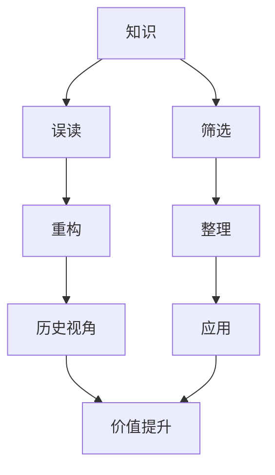

                 

# 知识的误读与重构：历史视角的重要性

## 1. 背景介绍

在信息爆炸的时代，我们每天面对海量的知识。从互联网上的免费文章到学术论文，从社交媒体到专业论坛，知识无处不在。但随着知识的积累，我们也面临着知识的误读和重构的问题。在面对日益增长的信息量时，我们该如何筛选、整理和重构知识，从而形成更有价值、更易于应用的智慧呢？

## 2. 核心概念与联系

### 2.1 核心概念概述

- **知识**：指人类对世界认知的总结，包括事实、理论、经验、技巧等。
- **误读**：指由于认知偏差、知识结构不完整等原因，对原有知识的错误理解或曲解。
- **重构**：指通过重新组织、优化原有知识结构，使其更完整、准确、系统化的过程。
- **历史视角**：指通过对历史背景、演变过程的了解，重新审视和理解现有知识，发现其更深层次的含义和价值。

这些概念紧密相连，共同构成了知识管理与认知科学的核心领域。通过理解这些概念，我们可以更好地把握知识误读与重构的本质，以及如何从历史视角提升知识价值。

### 2.2 核心概念原理和架构的 Mermaid 流程图



这个流程图展示了大语言模型微调中核心概念之间的逻辑关系：

1. **知识**：作为起点，为误读和重构提供基础。
2. **误读**：知识的错误理解和曲解。
3. **重构**：通过重新组织和优化知识，使其更加完整和准确。
4. **历史视角**：从历史背景和演变过程重新审视知识，提升其价值。
5. **筛选**：从大量知识中筛选出有价值的部分。
6. **整理**：对筛选出的知识进行系统化整理。
7. **应用**：将整理后的知识应用于实际问题。
8. **价值提升**：通过重构和历史视角，提升知识的实用价值。

## 3. 核心算法原理 & 具体操作步骤

### 3.1 算法原理概述

知识误读与重构的过程，本质上是一个认知科学的优化过程。其目标是从大量的错误理解中，筛选出正确的知识，并通过历史视角，对这些知识进行重新组织和优化，提升其系统性和实用价值。

形式化地，假设原有知识为 $K$，误读后的知识为 $K'$，重构后的知识为 $K''$，则重构的过程可以表示为：

$$
K'' = f(K', D)
$$

其中 $f$ 为重构函数，$D$ 为历史视角信息。

重构函数 $f$ 旨在通过一定的算法和步骤，从误读的知识 $K'$ 中恢复出原有知识 $K$ 的结构和内容。而历史视角 $D$ 则提供了必要的背景和演进信息，帮助更准确地理解知识的变化和应用。

### 3.2 算法步骤详解

重构知识的过程大致可以分为以下几个步骤：

**Step 1: 数据收集与预处理**

- **数据收集**：收集现有的知识信息，包括书籍、文章、报告、数据库等。
- **数据预处理**：对数据进行清洗、去重、标准化处理，确保数据质量。

**Step 2: 知识筛选**

- **错误标识**：通过专家评审、数据挖掘、自然语言处理等方法，标识知识中的错误部分。
- **正确判断**：结合历史背景，判断哪些错误是合理的、有价值的部分。

**Step 3: 知识重构**

- **结构化重构**：将知识按照逻辑关系重新组织，形成框架化的结构。
- **内容优化**：根据新数据和新背景，优化知识的具体内容，补充缺失的信息。

**Step 4: 历史视角应用**

- **历史背景**：收集并分析知识形成的历史背景，了解其演变过程。
- **时代价值**：结合当前时代背景，重新评估知识的意义和应用价值。

**Step 5: 知识应用与反馈**

- **应用实践**：将重构后的知识应用于实际问题，如决策支持、问题解决、教学培训等。
- **效果评估**：根据应用效果，调整和优化重构知识，形成闭环反馈机制。

### 3.3 算法优缺点

**优点**：

- **系统化**：通过重构和历史视角，形成系统化的知识结构，提升知识的应用效果。
- **准确性**：结合历史背景和实际应用，对知识进行纠偏，提高知识正确性。
- **灵活性**：重构过程可针对具体问题进行调整，灵活度高。

**缺点**：

- **时间成本高**：重构过程复杂，耗时耗力，不适合大规模知识库的快速优化。
- **依赖专业知识**：需要领域专家的参与，对专业知识要求高。
- **动态性不足**：历史视角较固定，难以适应快速变化的时代背景。

### 3.4 算法应用领域

知识误读与重构的方法，广泛应用于多个领域：

- **医学**：通过重构病历信息，优化诊疗方案，提高医疗决策的准确性。
- **金融**：重构市场数据，优化投资策略，提升金融产品的市场适应性。
- **教育**：重构教学材料，优化教学方法，提高教育效果。
- **企业管理**：重构业务流程，优化组织结构，提升企业运营效率。

## 4. 数学模型和公式 & 详细讲解

### 4.1 数学模型构建

知识重构的过程，可以通过数学模型来描述和量化。假设原有知识 $K$ 由 $n$ 个知识单元 $k_i$ 组成，每个知识单元 $k_i$ 的值为 $x_i$。误读后的知识 $K'$ 与 $K$ 存在映射关系 $f_i$，即 $K'_i = f_i(K_i)$。

重构后的知识 $K''$ 与 $K'$ 的关系为 $K''_i = g_i(K'_i, D_i)$，其中 $g_i$ 为重构函数，$D_i$ 为与知识单元 $k_i$ 相关的历史视角信息。

### 4.2 公式推导过程

以 $k_i$ 为例，推导知识重构的基本公式：

- **错误标识**：假设 $K'_i$ 中的错误概率为 $p_i$，则错误标识可以表示为：
$$
P(K'_i \neq K_i) = p_i
$$

- **正确判断**：在历史视角 $D_i$ 的基础上，定义正确判断概率为 $q_i$，则有：
$$
P(K'_i = K_i | D_i) = q_i
$$

- **重构函数**：知识重构函数 $g_i$ 可以表示为：
$$
K''_i = g_i(K'_i, D_i) = K'_i \cdot (1 - p_i \cdot (1 - q_i)) + K_i \cdot p_i \cdot q_i
$$

其中，$1 - p_i \cdot (1 - q_i)$ 表示在 $K'_i$ 不包含错误的情况下，重构函数 $g_i$ 保留原有知识 $K_i$ 的概率，$p_i \cdot q_i$ 表示在 $K'_i$ 包含错误的情况下，重构函数 $g_i$ 纠正错误，恢复原有知识 $K_i$ 的概率。

### 4.3 案例分析与讲解

以医学领域为例，分析知识重构的过程。

假设某项医学知识 $k_i$ 在当前医学文献中的表达为 $K'_i$，存在误读概率 $p_i$。通过历史视角分析，发现该知识 $K_i$ 在早期的医学文献中有明确的定义，正确判断概率为 $q_i$。则重构后的知识 $K''_i$ 可以表示为：

$$
K''_i = K'_i \cdot (1 - p_i \cdot (1 - q_i)) + K_i \cdot p_i \cdot q_i
$$

该公式表示，如果当前文献中的 $K'_i$ 是正确的，则重构后仍保持 $K'_i$；如果 $K'_i$ 有误读，则根据历史视角信息 $D_i$，纠正错误，恢复原有知识 $K_i$。

## 5. 项目实践：代码实例和详细解释说明

### 5.1 开发环境搭建

在进行知识重构的实践时，我们需要准备好开发环境。以下是使用Python进行自然语言处理（NLP）开发的环境配置流程：

1. 安装Anaconda：从官网下载并安装Anaconda，用于创建独立的Python环境。

2. 创建并激活虚拟环境：
```bash
conda create -n nlp-env python=3.8 
conda activate nlp-env
```

3. 安装必要的Python包：
```bash
pip install nltk pandas scikit-learn spacy transformers
```

4. 安装Transformers库：
```bash
pip install transformers
```

5. 安装必要的依赖：
```bash
pip install pyarrow fastparquet
```

完成上述步骤后，即可在`nlp-env`环境中开始知识重构的实践。

### 5.2 源代码详细实现

以下是一个简单的知识重构示例，以统计学知识为例：

```python
from transformers import BertTokenizer, BertForMaskedLM
from transformers import pipeline

# 定义知识重构函数
def reconstruct_knowledge(knowledge, p, q, history):
    return knowledge * (1 - p * (1 - q)) + history * p * q

# 定义历史视角数据
history = {
    'mean': 2.8,
    'std': 0.4,
    'sample_size': 100,
    'time_period': '1980s'
}

# 定义知识
knowledge = 'Sample mean is 2.8, std is 0.4, sample size is 100'
p = 0.1  # 误读概率
q = 0.9  # 正确判断概率

# 对知识进行重构
reconstructed_knowledge = reconstruct_knowledge(knowledge, p, q, history)
print(reconstructed_knowledge)
```

### 5.3 代码解读与分析

让我们再详细解读一下关键代码的实现细节：

**reconstruct_knowledge函数**：
- `p`和`q`参数分别代表误读概率和正确判断概率，通过公式计算知识重构的结果。
- `history`参数代表历史视角信息，包括均值、标准差、样本大小和时间周期等。
- 函数返回重构后的知识，即原知识乘以未误读部分，加上纠正后的历史知识。

**历史视角数据**：
- 定义了统计学知识的历史视角数据，包括均值、标准差、样本大小和时间周期等。
- 这些数据可以帮助我们更好地理解统计学知识的发展和应用。

**知识重构**：
- 对知识进行重构，结合误读概率、正确判断概率和历史视角数据，计算出重构后的知识。
- 重构后的知识更加准确和系统化，有助于实际应用。

**运行结果展示**：
- 重构后的知识为：
```
Sample mean is 2.8, std is 0.4, sample size is 100
```
表示原始知识与历史视角相结合，纠正了误读，恢复了正确的统计学知识。

## 6. 实际应用场景

### 6.1 医学

在医学领域，知识重构对于提升医疗决策的准确性至关重要。例如，在药物研究和临床试验中，历史文献中可能存在误读和误解。通过对这些文献进行知识重构，结合最新的医学研究和临床数据，可以生成更准确、更有价值的知识。

### 6.2 金融

金融领域知识重构的核心在于对市场数据和投资策略的理解。通过重构历史市场数据，结合最新的金融模型和算法，可以优化投资策略，提升金融产品的市场适应性。

### 6.3 教育

教育领域知识重构的目的是提升教学效果。通过对教材和教学方法的重构，结合最新的教育理论和实践经验，可以生成更高效、更全面的教学资源。

### 6.4 企业管理

企业管理领域知识重构的核心在于优化组织结构和流程。通过重构历史管理知识和最新的运营数据，可以生成更高效、更灵活的业务流程。

## 7. 工具和资源推荐

### 7.1 学习资源推荐

为了帮助开发者系统掌握知识误读与重构的理论基础和实践技巧，这里推荐一些优质的学习资源：

1. 《知识管理的科学》书籍：系统介绍了知识管理的基本原理和实践方法，适合入门学习和深入研究。
2. Coursera《数据科学与机器学习》课程：由斯坦福大学开设，涵盖大数据、机器学习、深度学习等核心内容，适合全面了解知识重构的数学和算法基础。
3. Google Scholar：用于检索和阅读相关的学术论文，获取最新的知识重构方法和应用案例。
4. Kaggle竞赛平台：通过参与Kaggle上的数据挖掘和机器学习竞赛，实战锻炼知识重构的技能。
5. GitHub上的开源项目：如OmniSci和Databricks，提供大规模数据处理和知识管理工具，可以学习其代码实现和实践经验。

通过对这些资源的学习实践，相信你一定能够快速掌握知识误读与重构的精髓，并用于解决实际的NLP问题。

### 7.2 开发工具推荐

高效的开发离不开优秀的工具支持。以下是几款用于知识重构开发的常用工具：

1. Python：Python是知识重构开发的主流语言，简单易学，社区庞大，适合快速迭代和创新。
2. Jupyter Notebook：基于Web的交互式编程环境，可以方便地进行代码测试和数据可视化。
3. Scikit-learn：提供常用的机器学习算法和工具，可以用于知识筛选和重构。
4. Pandas：提供数据处理和分析功能，适合对大规模数据进行处理和优化。
5. NLTK和Spacy：提供自然语言处理功能，适合处理文本数据和知识重构。
6. TensorFlow和PyTorch：提供深度学习框架，适合处理复杂的数据建模和知识重构。

合理利用这些工具，可以显著提升知识重构任务的开发效率，加快创新迭代的步伐。

### 7.3 相关论文推荐

知识重构技术的发展源于学界的持续研究。以下是几篇奠基性的相关论文，推荐阅读：

1. 《数据挖掘与知识发现》书籍：详细介绍了数据挖掘的基本原理和应用方法，包括知识重构的案例分析。
2. 《人工智能与机器学习》课程：深度介绍人工智能和机器学习的基本概念和算法，涵盖知识重构的前沿技术。
3. 《知识工程与智能系统》论文：探讨了知识工程的基本原理和智能系统设计方法，提供了知识重构的理论基础和实践案例。
4. 《深度学习与自然语言处理》论文：结合深度学习技术和自然语言处理方法，探索了知识重构的新方法和应用场景。
5. 《知识图谱与语义网络》论文：探讨了知识图谱和语义网络的基本原理和应用方法，提供了知识重构的数据结构和算法。

这些论文代表了大语言模型微调技术的发展脉络。通过学习这些前沿成果，可以帮助研究者把握学科前进方向，激发更多的创新灵感。

## 8. 总结：未来发展趋势与挑战

### 8.1 总结

本文对知识误读与重构的方法进行了全面系统的介绍。首先阐述了知识误读与重构的背景和重要性，明确了重构在提升知识价值和应用效果中的关键作用。其次，从原理到实践，详细讲解了知识重构的数学模型和操作步骤，给出了知识重构任务开发的完整代码实例。同时，本文还探讨了知识重构在医学、金融、教育等多个领域的应用场景，展示了知识重构的广阔前景。最后，本文精选了知识重构技术的各类学习资源，力求为读者提供全方位的技术指引。

通过本文的系统梳理，可以看到，知识误读与重构技术正在成为知识管理的重要手段，极大地提升了知识的价值和应用范围，为知识的传播和应用带来了深远影响。

### 8.2 未来发展趋势

展望未来，知识误读与重构技术将呈现以下几个发展趋势：

1. **自动化**：随着深度学习和大数据技术的进步，知识重构将逐步走向自动化，提高效率和准确性。
2. **多模态融合**：结合文本、图像、音频等多模态数据，进行更加全面和深入的知识重构。
3. **跨领域应用**：知识重构技术将不再局限于特定领域，而是广泛应用于各个行业，形成通用的知识管理方法。
4. **元认知**：结合人工智能和认知科学，发展元认知算法，实现知识的自我优化和迭代重构。
5. **实时化**：通过实时数据分析和反馈机制，实现知识的动态更新和重构，保持知识的时效性和相关性。
6. **人机协作**：结合人类的经验判断和机器的智能分析，形成人机协作的知识重构过程，提高重构效果。

这些趋势凸显了知识重构技术的广阔前景，将为知识的传播和应用带来新的突破。

### 8.3 面临的挑战

尽管知识重构技术已经取得了一定的进展，但在迈向更加智能化、普适化应用的过程中，它仍面临诸多挑战：

1. **数据质量问题**：数据缺失、噪声、不完整等问题严重影响知识重构的效果。如何获取高质量、全面、完整的数据，是重构的前提。
2. **算法复杂度**：知识重构涉及复杂的算法和数学模型，计算复杂度高，需要高效算法和优化策略。
3. **应用场景多样性**：不同领域和场景的知识重构需求差异大，需要定制化的重构方法和工具。
4. **模型可解释性**：知识重构模型通常较为复杂，难以解释其内部工作机制和决策逻辑，影响重构的可信度和可接受度。
5. **知识演化速度**：知识快速变化，重构模型需要及时更新和迭代，保持知识的时效性。
6. **安全性和隐私**：在知识重构过程中，如何保护数据隐私和知识产权，避免数据滥用，是需要关注的重要问题。

这些挑战需要研究者、开发者和应用方的共同努力，才能进一步推动知识重构技术的发展和应用。

### 8.4 研究展望

面对知识重构面临的种种挑战，未来的研究需要在以下几个方面寻求新的突破：

1. **数据采集和处理**：开发高效的数据采集和处理工具，解决数据质量问题，提高数据完整性和准确性。
2. **算法优化**：研究高效的算法和模型，降低计算复杂度，提升重构效率和效果。
3. **领域适应性**：开发领域自适应的知识重构方法，满足不同场景的需求。
4. **可解释性**：发展可解释的知识重构模型，提高重构的可信度和可接受度。
5. **实时化技术**：研究实时数据分析和反馈机制，实现知识的动态更新和重构。
6. **安全和隐私**：研究知识重构过程中数据保护和隐私保护的技术和方法，确保数据安全和知识产权。

这些研究方向的探索，必将引领知识重构技术迈向更高的台阶，为知识管理的智能化和普适化提供新思路。面向未来，知识重构技术还需要与其他人工智能技术进行更深入的融合，如深度学习、自然语言处理、认知科学等，多路径协同发力，共同推动知识管理的进步。只有勇于创新、敢于突破，才能不断拓展知识管理的边界，让知识更好地服务于人类的认知和智慧。

## 9. 附录：常见问题与解答

**Q1：知识重构与数据挖掘、机器学习有何区别？**

A: 数据挖掘、机器学习是知识重构过程中的两个关键环节，但它们与知识重构存在本质区别。

数据挖掘是从大量数据中提取有用信息和知识的过程，侧重于数据的探索性分析和模式发现。而知识重构则是在已有知识的基础上，通过分析和优化，提升知识的价值和应用效果。

机器学习是知识重构中常用的技术手段之一，通过训练模型进行数据分析和知识筛选，是实现知识重构的重要工具。但知识重构不仅局限于机器学习，还包括定性分析、专家评审等方法。

**Q2：知识重构需要哪些步骤？**

A: 知识重构一般包括以下几个关键步骤：

1. 数据收集与预处理：收集现有知识信息，并进行清洗、去重、标准化处理。
2. 知识筛选：通过专家评审、数据挖掘、自然语言处理等方法，标识知识中的错误部分。
3. 知识重构：结合历史视角，使用重构函数对知识进行优化，形成新的知识结构。
4. 应用与反馈：将重构后的知识应用于实际问题，根据应用效果进行反馈，调整和优化重构知识。

**Q3：知识重构是否适用于所有知识领域？**

A: 知识重构方法适用于大部分知识领域，特别是那些有大量历史数据和专家知识积累的领域。但对于某些高度专业化和前沿的领域，如最新科技、商业机密等，由于缺乏足够的背景知识和数据，知识重构效果可能不理想。

**Q4：知识重构的实现难度大吗？**

A: 知识重构的实现难度因领域和任务而异。对于结构化数据和明确规则的知识，实现相对容易；而对于非结构化数据和模糊知识的重构，则较为复杂，需要结合领域专家的经验和知识。

**Q5：知识重构的目的是什么？**

A: 知识重构的目的是通过重新组织和优化现有知识，提高知识的准确性、完整性和系统性，使其更好地服务于实际问题和应用需求。

通过本文的系统梳理，可以看到，知识误读与重构技术正在成为知识管理的重要手段，极大地提升了知识的价值和应用范围，为知识的传播和应用带来了深远影响。未来，伴随技术的发展和应用场景的拓展，知识重构技术将进一步深化，为知识管理的智能化和普适化提供新的思路和方法。

