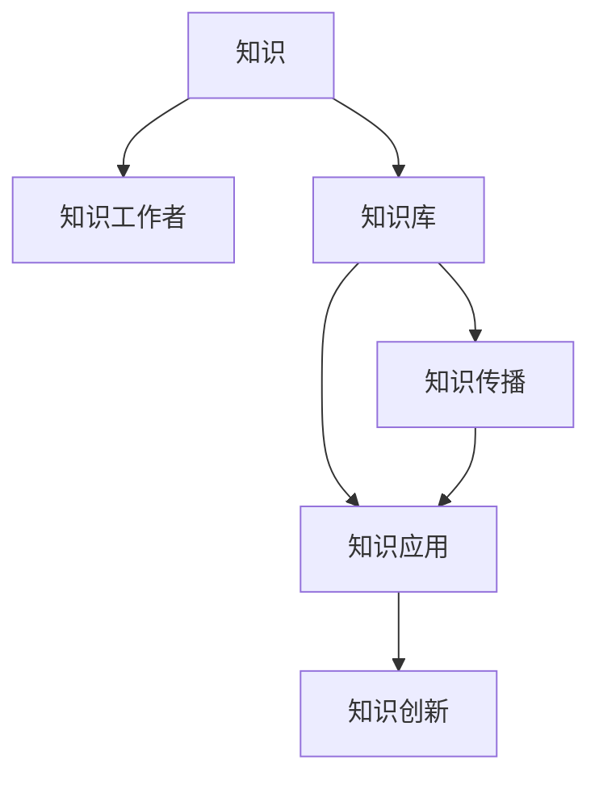
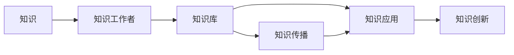

                 

# 知识管理：如何有效利用组织智慧

## 1. 背景介绍

在当今快速变化和不确定性的商业环境中，组织拥有丰富的智慧资源，包括经验、技能、诀窍和知识。然而，这些智慧往往分散在员工的头脑中，未能有效整合与利用，导致企业难以应对市场的挑战和机遇。有效利用组织智慧，是提升企业竞争力、推动创新和增长不可或缺的一环。本文将深入探讨知识管理的核心概念、原理与应用实践，帮助企业解锁组织智慧的潜力。

### 1.1 问题由来

随着信息技术的飞速发展和知识经济的崛起，传统知识管理策略面临着前所未有的挑战。过去以文档管理和文件存档为核心的方法，已经无法满足现代企业对知识共享和创新的需求。企业需要一种更系统、更智能的知识管理方法，能够有效地收集、存储、传播和利用组织智慧，以保持竞争优势。

### 1.2 问题核心关键点

知识管理的核心在于将组织内的智慧资源进行系统化的管理与利用。主要包括以下几个方面：

1. **知识收集**：从日常工作、项目实践、客户交流等多个渠道收集知识。
2. **知识存储**：将知识以结构化的方式存入知识库或文档管理系统，便于检索和复用。
3. **知识传播**：通过内部网络、培训、会议等渠道，将知识有效地传播给相关人员。
4. **知识应用**：将知识转化为具体行动或决策，推动业务创新和改进。
5. **知识创新**：通过知识组合和创新，生成新的产品、服务和解决方案。

## 2. 核心概念与联系

### 2.1 核心概念概述

知识管理涉及多个核心概念，它们之间相互关联，共同构成了一个完整的知识管理体系。

1. **知识**：组织内所有形式的信息、经验、技能和洞察力。
2. **知识工作者**：具备创造、分享和应用知识能力的人员。
3. **知识库**：用于存储和检索知识的工具，如数据库、文档管理系统等。
4. **知识传播**：通过沟通、培训、协作等方式，将知识传递给需要的人员。
5. **知识应用**：将知识应用于实际业务流程中，解决具体问题或推动改进。
6. **知识创新**：通过知识的组合和创造，产生新的产品、服务和解决方案。

这些概念之间的关系可以通过以下Mermaid流程图来展示：



这个流程图展示了知识管理的各个环节及其相互关系：

1. 知识由知识工作者创造。
2. 知识被存储在知识库中。
3. 知识通过传播环节被分享和使用。
4. 知识被应用于实际业务。
5. 通过知识的组合和创新，产生新的价值。

### 2.2 核心概念原理和架构的 Mermaid 流程图



这个图展示了知识管理的基本流程：

1. 知识工作者创造知识。
2. 知识被存入知识库。
3. 知识库的知识通过传播渠道分享。
4. 知识被应用于业务中。
5. 知识创新带来新的价值。

## 3. 核心算法原理 & 具体操作步骤

### 3.1 算法原理概述

知识管理的核心算法包括知识收集、存储、传播和应用。通过这些算法，企业能够高效地利用组织智慧，驱动业务创新和发展。

### 3.2 算法步骤详解

#### 3.2.1 知识收集

知识收集是知识管理的第一步，涉及从各个渠道获取知识的过程。常见的知识收集方法包括：

1. **文档和资料**：员工日常工作中的文档、会议记录、项目报告等。
2. **员工访谈**：通过面对面或线上访谈，收集员工的实践经验和见解。
3. **客户反馈**：收集客户意见和市场反馈，了解客户需求和痛点。
4. **外部资源**：从行业报告、专利、期刊等外部资源获取新知识和趋势。

#### 3.2.2 知识存储

知识存储是将收集到的知识以结构化方式存入知识库或文档管理系统，以便于检索和复用。常见的知识存储方法包括：

1. **文档管理系统**：如SharePoint、Confluence等，用于存储文档、图片、视频等。
2. **知识库系统**：如IBM Watson Knowledge Center、KMWorld等，提供更高级的搜索、分类和关联功能。
3. **数据库系统**：如MySQL、MongoDB等，用于存储结构化数据。

#### 3.2.3 知识传播

知识传播是知识管理的核心环节，通过有效的传播，知识得以被广泛应用和创新。常见的知识传播方法包括：

1. **内部网络**：如企业内部的wiki、论坛、聊天室等，促进知识共享和讨论。
2. **培训和研讨会**：通过定期培训和研讨会，传播最新的知识和技能。
3. **文档和指南**：编写和分发文档、操作指南等，帮助员工快速获取知识。
4. **内部博客和新闻**：通过企业内部博客和新闻平台，传播成功的实践和经验。

#### 3.2.4 知识应用

知识应用是将知识转化为具体行动或决策，推动业务创新和改进的过程。常见的知识应用方法包括：

1. **项目和流程改进**：通过知识应用，改进项目流程，提升效率和质量。
2. **产品和服务创新**：将知识转化为新产品、服务和解决方案，满足客户需求。
3. **战略制定和执行**：利用知识进行战略规划和执行，推动企业发展。
4. **决策支持**：利用知识进行数据分析和决策支持，提高决策质量。

#### 3.2.5 知识创新

知识创新是通过知识组合和创造，产生新的产品、服务和解决方案的过程。常见的知识创新方法包括：

1. **跨领域知识融合**：将不同领域的知识进行融合，产生新的创新点。
2. **逆向工程**：通过逆向工程，分析和改进现有产品或服务。
3. **用户共创**：与客户合作，共同创造新产品和服务。
4. **技术创新**：通过技术研发和创新，开发新的技术和解决方案。

### 3.3 算法优缺点

知识管理算法在提升组织智慧利用效率方面具有以下优点：

1. **系统化**：通过系统化的流程和工具，确保知识管理的有序性和规范性。
2. **高效率**：通过自动化和智能化工具，提高知识收集、存储和传播的效率。
3. **高复用性**：知识可以跨部门、跨项目复用，避免重复劳动和资源浪费。
4. **知识共享**：促进知识的广泛传播和共享，提升组织整体智慧水平。

然而，知识管理算法也存在一些缺点：

1. **数据质量**：知识管理依赖高质量的数据输入，数据质量差可能导致错误决策。
2. **文化障碍**：知识管理需要改变组织文化，可能遇到员工的抵触和阻力。
3. **工具依赖**：知识管理高度依赖工具和技术，工具不适应可能导致效率低下。
4. **复杂度**：知识管理流程复杂，需要系统化的规划和实施。

### 3.4 算法应用领域

知识管理算法在多个领域得到了广泛应用，包括但不限于：

1. **医疗**：通过知识管理，优化诊疗流程，提升医疗服务质量。
2. **金融**：通过知识管理，提升风险管理和金融分析能力。
3. **制造业**：通过知识管理，优化生产流程，提升产品质量和效率。
4. **零售**：通过知识管理，提升客户体验和销售效率。
5. **教育**：通过知识管理，提升教学质量和学习效果。

## 4. 数学模型和公式 & 详细讲解 & 举例说明

### 4.1 数学模型构建

知识管理的数学模型主要涉及知识的收集、存储、传播和应用过程的数学表示。以知识收集为例，可以构建以下数学模型：

设知识库为 $K$，知识工作者为 $W$，知识收集函数为 $f$，则知识收集过程可以表示为：

$$
K = f(W)
$$

其中 $f$ 描述了知识收集的具体过程，包括从不同渠道获取知识的方法和步骤。

### 4.2 公式推导过程

知识库 $K$ 的存储和检索过程可以表示为：

$$
K = S(R)
$$

其中 $S$ 表示知识存储函数，$R$ 表示知识检索函数。通过 $S$ 函数，知识被存储在知识库中，通过 $R$ 函数，知识被检索出来。

### 4.3 案例分析与讲解

以医疗领域为例，知识管理的具体流程可以如下表示：

1. **知识收集**：
   - 医护人员在日常诊疗中记录病历、报告和反馈。
   - 专家通过面谈和研讨会，收集临床经验和见解。
   - 医院收集行业报告和期刊，了解最新医疗趋势。

2. **知识存储**：
   - 病历、报告等文档存入电子病历系统（如EHR）。
   - 临床经验和见解存入知识库系统，便于检索和复用。
   - 医疗趋势存入数据库，便于数据分析和决策支持。

3. **知识传播**：
   - 医护人员在内部网络（如医院内部论坛）上分享病历和见解。
   - 通过定期的培训和研讨会，传播最新的医疗知识和技能。
   - 编制和分发操作指南，帮助新入职员工快速上手。

4. **知识应用**：
   - 通过病历数据，优化诊疗流程，提高诊断准确性和效率。
   - 根据临床经验和趋势，开发新的诊疗方案和药物。
   - 通过数据分析，制定和执行医疗战略，提升整体服务质量。

5. **知识创新**：
   - 跨领域融合，开发新的医疗设备和治疗方法。
   - 逆向工程现有技术，改进和优化现有医疗设备。
   - 与患者合作，共同创造更好的医疗体验和服务。

## 5. 项目实践：代码实例和详细解释说明

### 5.1 开发环境搭建

知识管理的开发环境需要支持多种数据存储、处理和分析工具。以下是常用的开发环境搭建流程：

1. **安装Python**：从官网下载并安装Python，Python是知识管理开发的主要编程语言。
2. **安装Pandas**：用于数据处理和分析，可以从官网下载并安装。
3. **安装NLTK**：用于自然语言处理，可以从官网下载并安装。
4. **安装Scikit-learn**：用于机器学习和数据挖掘，可以从官网下载并安装。
5. **安装TensorFlow**：用于深度学习和数据分析，可以从官网下载并安装。
6. **安装PyTorch**：用于深度学习和神经网络，可以从官网下载并安装。

### 5.2 源代码详细实现

以下是一个简单的知识管理系统的代码实现，包括知识收集、存储、传播和应用过程。

```python
import pandas as pd
import nltk
from sklearn.feature_extraction.text import CountVectorizer
from sklearn.decomposition import NMF

# 知识收集
def collect_knowledge():
    # 从文档系统中收集数据
    df_doc = pd.read_csv('doc_data.csv')
    # 从网络论坛中收集数据
    df_forum = pd.read_csv('forum_data.csv')
    # 从专家访谈中收集数据
    df_interview = pd.read_csv('interview_data.csv')
    # 合并数据
    df = pd.concat([df_doc, df_forum, df_interview], ignore_index=True)
    return df

# 知识存储
def store_knowledge(df):
    # 将数据存储到文档系统中
    df.to_csv('stored_doc.csv', index=False)
    # 将数据存储到知识库系统中
    df.to_sql('stored_kb', conn, if_exists='append', index=False)

# 知识传播
def propagate_knowledge(df):
    # 在内部网络中发布数据
    nltk.download('stopwords')
    vectorizer = CountVectorizer(stop_words='english')
    X = vectorizer.fit_transform(df['text'])
    feature_names = vectorizer.get_feature_names()
    Y = df['label']
    # 使用NMF进行主题建模
    nmf = NMF(n_components=3)
    Y_hat = nmf.fit_transform(X)
    # 在内部网络中发布主题模型结果
    with open('topic_modeling_results.txt', 'w') as f:
        f.write('Topic Modeling Results:\n')
        for i in range(len(df)):
            f.write('Topic {}: {}\n'.format(i+1, ', '.join(Y_hat[i].feature_names_)))
    # 将主题模型结果存储到知识库系统中
    nmf.save_latest('topic_modeling_kb')
    nmf.load_latest('topic_modeling_kb')

# 知识应用
def apply_knowledge(df):
    # 在实际项目中应用知识
    # 将知识应用到项目中
    df['applied_knowledge'] = df['text'].apply(lambda x: 'Knowledge applied in project: ' + x)
    # 将应用后的知识存储到知识库系统中
    df.to_sql('applied_kb', conn, if_exists='append', index=False)

# 知识创新
def innovate_knowledge(df):
    # 跨领域知识融合
    df['innovation'] = df['text'].apply(lambda x: 'Innovation: ' + x)
    # 将创新知识存储到知识库系统中
    df.to_sql('innovation_kb', conn, if_exists='append', index=False)
```

### 5.3 代码解读与分析

上述代码展示了知识管理系统的基本流程，包括知识收集、存储、传播和应用过程。

1. **知识收集**：通过读取文档、论坛和访谈数据，收集知识。
2. **知识存储**：将收集到的知识存储到文档系统和知识库系统中。
3. **知识传播**：通过自然语言处理和主题建模，传播知识。
4. **知识应用**：在实际项目中应用知识。
5. **知识创新**：通过跨领域融合，产生新的知识。

## 6. 实际应用场景

### 6.1 医疗领域

在医疗领域，知识管理的应用可以显著提升诊疗质量和效率。例如：

- **病历数据管理**：通过知识管理，将病历数据结构化存储和检索，提高诊疗效率和质量。
- **临床经验分享**：通过知识管理平台，医护人员可以分享临床经验和见解，提升整体医疗水平。
- **疾病研究**：通过知识管理，汇总和分析疾病数据，推动新药研发和治疗方法创新。

### 6.2 金融领域

在金融领域，知识管理可以提升风险管理和决策支持能力。例如：

- **市场分析**：通过知识管理，汇总市场数据和分析报告，提供决策支持。
- **风险评估**：通过知识管理，分析历史数据和风险模型，提升风险评估能力。
- **合规管理**：通过知识管理，汇总法规和合规要求，确保合规性。

### 6.3 制造业

在制造业领域，知识管理可以优化生产流程和提升产品质量。例如：

- **生产流程改进**：通过知识管理，分析生产数据和案例，优化生产流程。
- **质量控制**：通过知识管理，汇总质量数据和检测报告，提升产品质量。
- **设备维护**：通过知识管理，汇总设备数据和维护记录，优化设备维护策略。

### 6.4 未来应用展望

随着知识管理的不断发展，未来将涌现更多智能化的应用场景。例如：

- **智能问答系统**：通过自然语言处理和知识管理，构建智能问答系统，提供24/7的知识服务。
- **个性化推荐系统**：通过知识管理，分析用户数据和行为，提供个性化的产品和服务推荐。
- **智能协作工具**：通过知识管理，构建智能协作工具，提高团队协作效率和创新能力。

## 7. 工具和资源推荐

### 7.1 学习资源推荐

为了帮助企业系统掌握知识管理的核心概念和实践技巧，以下是一些优质的学习资源：

1. **《知识管理概论》书籍**：全面介绍知识管理的原理、方法和实践，是入门知识管理的经典书籍。
2. **Coursera《知识管理》课程**：斯坦福大学开设的在线课程，提供系统的知识管理理论和方法。
3. **KMWorld网站**：知识管理领域的权威网站，提供最新的知识管理新闻、案例和工具。
4. **Harvard Business Review《知识管理》文章**：哈佛商业评论的知识管理专题文章，涵盖最新的研究和管理实践。

### 7.2 开发工具推荐

知识管理的开发需要多种工具和平台的支持。以下是一些常用的工具推荐：

1. **Microsoft SharePoint**：文档管理和知识库系统，支持结构化文档存储和检索。
2. **Confluence**：企业内部协作平台，支持文档、图片、视频等多种内容的存储和共享。
3. **Google Docs**：在线文档和协作平台，便于知识收集和传播。
4. **JIRA**：项目管理和协作工具，支持知识传播和应用。
5. **Slack**：团队协作工具，支持内部沟通和知识传播。

### 7.3 相关论文推荐

知识管理的理论和实践不断发展，以下是一些奠基性的相关论文，推荐阅读：

1. **《Knowledge Management: Creating the Future Organization》**：作者：Davenport，提出知识管理的基本框架和实践方法。
2. **《The Knowledge-Creating Company: Harnessing Human Creativity》**：作者：Brockman，讨论如何通过知识管理促进组织创新。
3. **《Knowledge Management: Breaking the Chain of Forgetting》**：作者：Grainge，探讨知识管理如何打破遗忘的链条。
4. **《Knowledge Management: A Model for the Information Age》**：作者：Winter，提出知识管理的模型和流程。

## 8. 总结：未来发展趋势与挑战

### 8.1 总结

本文对知识管理的核心概念、原理与应用实践进行了全面系统的介绍。通过探讨知识收集、存储、传播和应用过程，帮助企业系统地掌握知识管理的精髓，解锁组织智慧的潜力。

### 8.2 未来发展趋势

展望未来，知识管理将呈现以下几个发展趋势：

1. **智能化**：通过人工智能技术，提升知识收集、存储和传播的智能化水平。
2. **个性化**：通过大数据分析，提供个性化的知识服务。
3. **协同化**：通过协作工具和平台，促进跨部门、跨团队的协同工作。
4. **可视化**：通过数据可视化工具，提升知识传播和应用的直观性和可视化水平。

### 8.3 面临的挑战

尽管知识管理在提升组织智慧利用效率方面取得了显著成果，但仍面临以下挑战：

1. **数据质量**：知识管理依赖高质量的数据输入，数据质量差可能导致错误决策。
2. **文化障碍**：知识管理需要改变组织文化，可能遇到员工的抵触和阻力。
3. **工具依赖**：知识管理高度依赖工具和技术，工具不适应可能导致效率低下。
4. **复杂度**：知识管理流程复杂，需要系统化的规划和实施。

### 8.4 研究展望

未来，知识管理的研究方向可以从以下几个方面进行：

1. **大数据与人工智能**：通过大数据和人工智能技术，提升知识管理的智能化水平。
2. **社交网络分析**：通过社交网络分析，优化知识传播和协作过程。
3. **跨领域知识融合**：通过跨领域知识融合，提升知识创新的能力。
4. **用户行为分析**：通过用户行为分析，提升个性化知识服务的效果。

总之，知识管理是一个复杂但极具潜力的领域，需要系统化、智能化的方法才能发挥其最大价值。企业需要不断探索和实践，才能充分利用组织智慧，驱动业务的持续发展和创新。

## 9. 附录：常见问题与解答

**Q1：知识管理是否适用于所有行业和企业？**

A: 知识管理适用于几乎所有行业和企业，尤其是那些依赖知识和创意驱动的企业。知识管理通过系统化的管理与利用组织智慧，能够显著提升企业的创新能力和竞争力。

**Q2：知识管理的实施难度大吗？**

A: 知识管理的实施难度较大，需要企业具备系统化的规划、完善的组织文化和先进的技术支持。但是，一旦实施成功，知识管理能够带来显著的业务改进和创新。

**Q3：知识管理如何与其他管理工具集成？**

A: 知识管理可以与其他管理工具如ERP、CRM、项目管理工具等集成，提供更加全面的业务支持和管理功能。通过API接口和数据同步机制，实现系统间的无缝集成。

**Q4：知识管理的经济效益如何？**

A: 知识管理能够带来显著的经济效益，包括提升生产效率、降低成本、增加收入等。通过优化流程、改进决策、增强创新能力，企业能够在激烈的市场竞争中保持优势。

**Q5：知识管理的未来发展方向是什么？**

A: 知识管理的未来发展方向包括智能化、个性化、协同化和可视化等，通过先进的技术和科学的管理方法，提升知识管理的效率和效果。

总之，知识管理是企业实现智慧利用和创新发展的重要手段。通过系统化、智能化的管理，企业能够充分挖掘组织智慧的潜力，推动业务持续发展和创新。

---

作者：禅与计算机程序设计艺术 / Zen and the Art of Computer Programming

