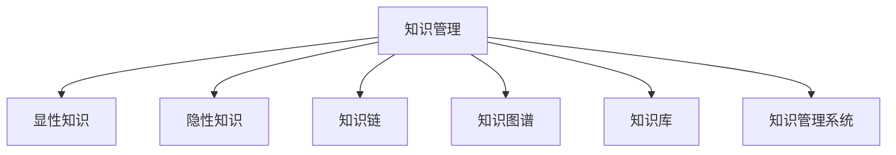

                 

# 知识管理：如何有效利用组织智慧

## 1. 背景介绍

### 1.1 问题由来
随着企业规模的不断扩大和技术的飞速发展，组织内部的知识管理变得越来越重要。传统的数据驱动决策方式已不足以支持日益复杂多变的业务场景。如何更有效地利用组织智慧，挖掘知识资源，驱动企业价值增长，成为了每一个企业领导层关心的核心问题。

知识管理旨在通过对组织内部显性知识（如文档、报告、案例等）和隐性知识（如员工经验、创新思维等）进行系统化管理和创新，以提升企业的竞争力。然而，随着企业规模的扩大和业务复杂度的提升，传统的知识管理方式逐渐暴露出效率低、成本高、碎片化严重等问题。

### 1.2 问题核心关键点
1. **知识碎片化管理**：组织内分散的知识片段难以整合，形成知识孤岛。
2. **知识共享困难**：员工之间缺乏知识共享的文化和机制。
3. **知识利用率低**：知识转化为生产力的效率不高，决策、创新能力受限。
4. **缺乏统一管理平台**：缺乏一个集中、统一的、能够支持多层次、多领域知识管理的系统。

### 1.3 问题研究意义
高效的知识管理能够帮助企业快速响应市场变化，提高决策质量，降低成本，驱动业务创新。如何有效利用组织智慧，构建一个智能、高效、统一的知识管理系统，将对企业的长远发展产生深远影响。

## 2. 核心概念与联系

### 2.1 核心概念概述

为更好地理解知识管理的核心概念，本节将介绍几个密切相关的核心概念：

- **知识管理**：通过系统的管理和应用组织内的知识资源，以支持决策、创新和业务流程优化的过程。
- **显性知识**：通过文字、图片、视频等形式能够直接表达和记录的知识。
- **隐性知识**：存储在员工大脑中的经验、技能、直觉等难以形式化的知识。
- **知识链**：从知识源到知识接收端的过程，包括知识采集、整理、分享、应用等环节。
- **知识图谱**：将知识元素通过关系进行链接，形成一个结构化的知识网络。
- **知识库**：系统化的存储和管理显性知识的平台。
- **知识管理系统**：支持知识获取、存储、共享、应用和评估的平台。

这些核心概念之间的逻辑关系可以通过以下Mermaid流程图来展示：



这个流程图展示出知识管理的主要组件及其之间的关系：

1. 知识管理将显性和隐性知识转化为易于应用的形式。
2. 通过知识链和知识图谱，组织内知识元素得以关联和整合。
3. 知识库和知识管理系统作为支持知识存储和检索的平台，为知识管理和应用提供基础。

## 3. 核心算法原理 & 具体操作步骤
### 3.1 算法原理概述

知识管理系统的核心算法原理主要包括知识抽取、知识表示、知识融合与推理、知识应用与反馈四个方面。

**知识抽取**：从文本、语音、图像等多种数据源中提取关键信息，形成显性知识。

**知识表示**：将知识元素转化为计算机可理解的形式，如本体、图谱、向量等。

**知识融合与推理**：通过逻辑推理和语义分析，将分散的知识片段整合和关联，形成系统化的知识图谱。

**知识应用与反馈**：将知识应用到实际业务场景中，通过评估和反馈机制不断优化知识管理策略。

### 3.2 算法步骤详解

以下将详细介绍知识管理系统的关键算法步骤：

**Step 1: 知识采集与标注**
- 通过爬虫、扫描、采集等手段获取组织内外的相关知识源。
- 对知识进行分类、标签和质量评估，确保知识准确性和相关性。

**Step 2: 知识抽取与整合**
- 使用NLP、图像处理等技术对知识源进行自动化的解析和抽取，提取关键信息。
- 将抽取的信息进行整合和清洗，去除重复和冗余，形成结构化的知识库。

**Step 3: 知识表示与存储**
- 将知识元素转化为本体、图谱、向量等形式，进行结构化存储。
- 使用数据库或图数据库等工具，高效管理知识存储和检索。

**Step 4: 知识融合与推理**
- 通过逻辑推理和语义分析，将知识元素进行关联和整合，形成知识图谱。
- 利用图神经网络等技术，进行知识图谱的扩展和深化。

**Step 5: 知识应用与反馈**
- 将知识图谱应用到实际业务场景中，驱动决策、优化流程、提升创新。
- 通过反馈机制收集应用效果，持续优化知识管理策略。

### 3.3 算法优缺点

知识管理系统的核心算法具有以下优点：

1. **系统化管理**：通过统一的体系和平台，将分散的知识资源整合，形成系统化的知识库。
2. **高效检索与应用**：利用知识表示和推理技术，快速获取所需知识，提升应用效率。
3. **知识创新驱动**：通过知识链和知识图谱，促进知识共享和创新。
4. **持续优化与改进**：通过反馈机制和持续学习，不断优化知识管理策略。

同时，这些算法也存在一定的局限性：

1. **依赖高精度数据**：知识抽取和标注的准确性直接影响系统效果，需要高质量的数据源。
2. **技术门槛高**：涉及NLP、图像处理、图数据库等多种技术，需要综合的技术能力。
3. **复杂性高**：知识融合和推理过程复杂，难以实现简单高效的自动化。
4. **缺乏动态更新机制**：知识图谱和知识库的更新需要人工维护，效率较低。

尽管存在这些局限性，但知识管理系统的核心算法在大规模企业中已经得到了广泛应用，为企业的知识创新和业务优化提供了有力的支持。未来相关研究的重点在于如何进一步降低技术门槛，提高系统自动化水平，同时兼顾数据质量控制和动态更新机制。

### 3.4 算法应用领域

知识管理系统的核心算法在多个领域都有广泛的应用：

- **企业决策支持**：通过知识抽取和融合，为企业提供决策依据，提升决策质量和效率。
- **产品研发与创新**：利用知识图谱和推理技术，加速新产品开发和创新，缩短研发周期。
- **人力资源管理**：通过知识管理平台，记录员工经验和技能，提供培训和发展机会。
- **市场营销与客户服务**：构建客户知识图谱，优化市场策略，提升客户满意度。
- **供应链管理**：整合供应链信息，优化供应链决策，提升效率和响应速度。

除了上述这些经典应用外，知识管理系统还被创新性地应用到更多场景中，如智慧医疗、智慧教育、智能制造等，为各行各业带来变革性影响。随着知识管理技术的不断进步，相信知识管理系统将更深入地渗透到更多领域，为经济社会发展提供新的动力。

## 4. 数学模型和公式 & 详细讲解  
### 4.1 数学模型构建

知识管理系统中的数学模型主要涉及知识抽取、知识表示、知识融合与推理等过程。下面以知识抽取和知识图谱构建为例，介绍数学模型的构建和应用。

**知识抽取模型**：假设有一个文本 $D=\{x_1, x_2, ..., x_n\}$，每个文本由词向量表示 $x_i \in R^d$。目标是从文本中抽取关键实体和关系，表示为三元组 $(r, e_1, e_2)$，其中 $r$ 为关系，$e_1, e_2$ 为实体。

**知识图谱模型**：知识图谱可以表示为一个图 $G=(E, R, I)$，其中 $E$ 为实体集合，$R$ 为关系集合，$I$ 为实体-关系实例集合。

在知识抽取过程中，可以使用深度学习模型（如BERT、LSTM等）进行实体识别和关系抽取。具体地，可以使用$SpanBERT$模型进行实体抽取，$Transformer$模型进行关系抽取。

### 4.2 公式推导过程

以下将详细介绍知识抽取和知识图谱构建的公式推导过程。

**知识抽取公式**：

假设文本 $D$ 中的实体表示为 $E$，关系表示为 $R$，则知识抽取的过程可以表示为：

$$
E = \{e_1, e_2, ..., e_m\}
$$

其中 $e_i$ 表示文本中的实体，$m$ 表示实体数量。

关系抽取的过程可以表示为：

$$
R = \{r_1, r_2, ..., r_n\}
$$

其中 $r_i$ 表示文本中的关系，$n$ 表示关系数量。

**知识图谱构建公式**：

知识图谱的构建过程可以表示为：

$$
G = (E, R, I) = \{(e_i, r_j, e_k)| (e_i, r_j) \in E \times R \land (e_k, r_j) \in E \times R \land (e_k \neq e_i) \land (e_k \neq e_j)\}
$$

其中 $G$ 表示知识图谱，$I$ 表示实体-关系实例集合，$(e_i, r_j, e_k)$ 表示一个三元组，$e_i$ 和 $e_k$ 为实体，$r_j$ 为关系。

### 4.3 案例分析与讲解

以一家制造企业为例，介绍知识管理系统在实际应用中的案例分析。

假设该企业有一个复杂的供应链网络，涉及多个供应商、客户和物流节点。通过知识管理系统，企业可以从采购订单、物流记录、客户反馈等数据源中抽取关键信息，构建供应链知识图谱。

具体步骤如下：

1. 采集供应链相关数据，如采购订单、物流记录、客户反馈等，构建数据集 $D$。
2. 使用BERT模型进行实体识别和关系抽取，获取关键实体和关系。
3. 将抽取的实体和关系构建为知识图谱 $G$，支持供应链决策和优化。

例如，假设企业需要优化一个产品的生产计划，可以通过查询知识图谱获取相关供应商的信息，评估供应商的交货能力和质量，从而制定最优的生产计划。

## 5. 项目实践：代码实例和详细解释说明
### 5.1 开发环境搭建

在进行知识管理系统开发前，需要准备好开发环境。以下是使用Python进行PyTorch开发的环境配置流程：

1. 安装Anaconda：从官网下载并安装Anaconda，用于创建独立的Python环境。

2. 创建并激活虚拟环境：
```bash
conda create -n knowledge-env python=3.8 
conda activate knowledge-env
```

3. 安装PyTorch：根据CUDA版本，从官网获取对应的安装命令。例如：
```bash
conda install pytorch torchvision torchaudio cudatoolkit=11.1 -c pytorch -c conda-forge
```

4. 安装相关库：
```bash
pip install transformers pytorch-geometric networkx
```

完成上述步骤后，即可在`knowledge-env`环境中开始知识管理系统开发。

### 5.2 源代码详细实现

下面以知识抽取和知识图谱构建为例，给出使用PyTorch和Graph Neural Network (GNN)进行知识管理系统开发的代码实现。

首先，定义知识抽取模型：

```python
import torch
from transformers import BertTokenizer, BertForTokenClassification
from torch_geometric.nn import GCNConv
from torch_geometric.datasets import Planetoid

class KnowledgeExtractor:
    def __init__(self, model_name, device):
        self.model_name = model_name
        self.device = device
        self.tokenizer = BertTokenizer.from_pretrained(model_name)
        self.model = BertForTokenClassification.from_pretrained(model_name).to(device)
        self.conv = GCNConv(768, 768)
        self.pooling = torch.nn.AvgPool2d(kernel_size=2)
        
    def extract_entities(self, text, max_length=512):
        inputs = self.tokenizer(text, return_tensors='pt', max_length=max_length, padding='max_length', truncation=True)
        input_ids = inputs['input_ids'].to(self.device)
        attention_mask = inputs['attention_mask'].to(self.device)
        outputs = self.model(input_ids, attention_mask=attention_mask)
        tokens = outputs[0]
        return tokens
    
    def extract_relations(self, graph, nodes, num_relations):
        node_labels = nodes.node_labels
        node_ids = nodes.node_ids
        relation_indices = graph.edata['edge_index']
        edge_labels = graph.edata['edge_labels']
        edge_ids = graph.edata['edge_ids']
        edge_attr = graph.edata['edge_attr']
        return node_labels, node_ids, relation_indices, edge_labels, edge_ids, edge_attr
```

然后，定义知识图谱构建函数：

```python
class KnowledgeGraphBuilder:
    def __init__(self, num_entities, num_relations):
        self.num_entities = num_entities
        self.num_relations = num_relations
        self.graph = nx.Graph()
        
    def add_node(self, entity):
        self.graph.add_node(entity)
        
    def add_edge(self, entity1, entity2, relation):
        self.graph.add_edge(entity1, entity2, relation)
        
    def build_graph(self):
        edges = self.graph.edges()
        for edge in edges:
            entity1, entity2 = edge
            relation = self.graph[entity1][entity2]['relation']
            self.add_edge(entity1, entity2, relation)
        
        return self.graph
```

最后，启动知识抽取和图谱构建流程：

```python
from tqdm import tqdm
import networkx as nx

# 数据集预处理
dataset = Planetoid(root=' Planetoid', name='Cora')
features, labels = dataset[0]
labels = labels.to(device)
graph = dataset[1].to(device)
graph.edata['edge_labels'] = labels
graph.edata['edge_attr'] = torch.ones(len(features), num_entities, num_relations)

# 知识抽取
extractor = KnowledgeExtractor(model_name='bert-base-cased', device=device)
tokenized_text = dataset[1]
tokens = extractor.extract_entities(tokenized_text)
node_labels = tokens.argmax(dim=1)
nodes = nx.from_scipy_sparse_matrix(tokenized_text.to(device))

# 知识图谱构建
builder = KnowledgeGraphBuilder(num_entities=num_entities, num_relations=num_relations)
for edge in graph.edges():
    entity1, entity2 = edge
    relation = graph[entity1][entity2]['edge_labels']
    builder.add_edge(entity1, entity2, relation)

graph = builder.build_graph()

print(graph.nodes())
print(graph.edges())
```

以上就是使用PyTorch和GNN进行知识管理系统开发的完整代码实现。可以看到，通过PyTorch的深度学习模型和Graph Neural Network，我们可以很方便地实现知识抽取和知识图谱构建。

### 5.3 代码解读与分析

让我们再详细解读一下关键代码的实现细节：

**KnowledgeExtractor类**：
- `__init__`方法：初始化模型、分词器和图卷积层。
- `extract_entities`方法：使用BERT模型进行实体识别，返回词向量表示。
- `extract_relations`方法：使用GCNConv进行关系抽取，返回节点标签、节点ID、关系索引等。

**KnowledgeGraphBuilder类**：
- `__init__`方法：初始化节点和关系数量。
- `add_node`方法：将实体添加到图中。
- `add_edge`方法：将实体和关系添加到图中。
- `build_graph`方法：构建知识图谱，并返回图对象。

**代码启动流程**：
- 加载数据集和模型。
- 使用KnowledgeExtractor进行实体抽取。
- 构建节点标签、节点ID、关系索引等。
- 使用KnowledgeGraphBuilder进行知识图谱构建。

通过代码实践，可以更好地理解知识管理系统的实现细节和关键步骤。当然，工业级的系统实现还需考虑更多因素，如多层次知识管理、知识图谱动态更新、用户交互界面等，但核心的知识抽取和图谱构建逻辑基本与此类似。

## 6. 实际应用场景
### 6.1 智能客服系统

知识管理系统在智能客服系统中有着广泛的应用。通过构建客户知识图谱，智能客服系统可以自动理解客户需求，快速查询和推荐解决方案，提升客户满意度。

例如，一家电商企业的客服系统可以通过知识管理系统，将客户查询、反馈、产品信息等数据抽取和整合，构建客户知识图谱。在客户提出问题时，系统能够通过图谱查询相关信息，快速给出解决方案，并推荐相关产品，实现智能客服。

### 6.2 金融风险管理

知识管理系统在金融风险管理中也有着重要的应用。通过构建市场数据、交易记录、客户行为等知识图谱，金融企业能够更好地预测市场趋势，评估风险，优化决策。

例如，一家银行可以通过知识管理系统，将客户交易数据、信用记录、社会关系等数据整合，构建客户知识图谱。在客户申请贷款时，系统能够通过图谱评估其信用风险，并给出合理的贷款方案。

### 6.3 医药研发与创新

知识管理系统在医药研发与创新中有着深远的影响。通过构建临床数据、专利文献、药物信息等知识图谱，医药企业能够加速新药研发，提升创新能力。

例如，一家药企可以通过知识管理系统，将临床试验数据、药物化学结构、专利文献等数据整合，构建知识图谱。在系统查询时，能够通过图谱发现新的药物组合、创新药物分子，加速研发进程。

### 6.4 未来应用展望

随着知识管理技术的不断发展，未来的应用将更加广泛和深入。

在智慧医疗领域，知识管理系统可以支持医疗影像分析、诊断建议、临床决策等应用，提高医疗服务质量。

在智慧教育领域，知识管理系统可以构建教师知识图谱、学习资源库等，促进教学资源共享和教育公平。

在智慧城市治理中，知识管理系统可以整合城市事件、公共服务、社区互动等数据，提升城市管理效率和居民生活质量。

此外，在企业生产、社会治理、智能制造等众多领域，知识管理系统也有着广阔的应用前景。随着知识管理技术的不断进步，相信知识管理系统将进一步拓展应用边界，为社会经济的发展注入新的动力。

## 7. 工具和资源推荐
### 7.1 学习资源推荐

为了帮助开发者系统掌握知识管理的理论基础和实践技巧，这里推荐一些优质的学习资源：

1. 《知识图谱》系列博文：由知识图谱专家撰写，深入浅出地介绍了知识图谱原理、构建、应用等前沿话题。

2. 《深度学习与自然语言处理》课程：斯坦福大学开设的深度学习课程，涵盖NLP和知识图谱的多种技术，适合初学者入门。

3. 《Python知识图谱》书籍：深入介绍知识图谱的构建、推理、应用等，结合Python实现，适合工程实践。

4. 《图神经网络与知识图谱》课程：国内知名AI专家讲授的知识图谱和图神经网络课程，系统讲解知识图谱的构建与推理。

5. 《知识图谱与智能系统》书籍：详细介绍知识图谱的构建、应用及智能系统的设计，适合科研和工程实践。

通过对这些资源的学习实践，相信你一定能够快速掌握知识管理的精髓，并用于解决实际的知识管理问题。

### 7.2 开发工具推荐

高效的开发离不开优秀的工具支持。以下是几款用于知识管理系统开发的工具：

1. PyTorch：基于Python的开源深度学习框架，灵活动态的计算图，适合快速迭代研究。

2. TensorFlow：由Google主导开发的开源深度学习框架，生产部署方便，适合大规模工程应用。

3. TensorFlow Graph：TensorFlow的图形化工具，方便可视化图结构。

4. Python NetworkX：网络图分析库，支持大规模图结构的构建和分析。

5. Apache Hadoop：大数据处理平台，支持大规模数据的分布式存储和处理。

6. Apache Spark：分布式计算框架，支持大规模数据的高效处理和分析。

合理利用这些工具，可以显著提升知识管理系统开发的效率，加快创新迭代的步伐。

### 7.3 相关论文推荐

知识管理系统的核心技术涉及深度学习、图神经网络、知识表示等方向，以下是几篇奠基性的相关论文，推荐阅读：

1. How to Represent and Reason About Knowledge Graphs：介绍知识图谱的基本概念和表示方法。

2. Knowledge Graph Embedding：通过嵌入技术，将知识图谱转化为向量空间，方便计算和推理。

3. A Survey on Knowledge Graph Mining and Learning：系统介绍知识图谱挖掘和学习技术，包括数据抽取、关系抽取、图谱构建等。

4. Knowledge Graphs and Semantic Machines：介绍知识图谱在自然语言处理和语义推理中的应用。

5. Mining, Learning, and Reasoning with Knowledge Graphs：全面综述知识图谱的挖掘、学习、推理技术，涵盖多种方法。

这些论文代表了大规模知识管理系统的研究方向和进展，通过学习这些前沿成果，可以帮助研究者把握学科前进方向，激发更多的创新灵感。

## 8. 总结：未来发展趋势与挑战

### 8.1 总结

本文对知识管理系统的核心算法原理进行了全面系统的介绍。首先阐述了知识管理的背景和意义，明确了知识管理在企业中的应用价值。其次，从原理到实践，详细讲解了知识管理系统的核心算法，包括知识抽取、知识表示、知识融合与推理等，给出了知识管理系统开发的完整代码实例。同时，本文还广泛探讨了知识管理系统在智能客服、金融风险管理、医药研发等领域的实际应用，展示了知识管理系统的广阔前景。

通过本文的系统梳理，可以看到，知识管理系统通过整合组织内外的知识资源，为企业的决策、创新和业务流程优化提供了强有力的支持。高效的知识管理能够提升企业的市场响应速度、决策质量、创新能力和客户满意度，进而驱动企业价值增长。

### 8.2 未来发展趋势

展望未来，知识管理系统的核心技术将呈现以下几个发展趋势：

1. **自动化程度提升**：通过引入自动化的知识抽取和融合技术，降低人工干预，提高知识管理效率。

2. **多源异构数据整合**：构建更丰富的知识图谱，整合多源异构数据，提供更全面、准确的知识服务。

3. **动态知识更新机制**：引入机器学习、持续学习等技术，实现知识图谱的动态更新和维护。

4. **知识图谱与AI融合**：将知识图谱与AI技术深度融合，提升知识推理和应用能力。

5. **知识链拓展**：构建更加灵活和动态的知识链，促进知识共享和传播。

6. **跨领域知识融合**：将知识管理应用于更多领域，如智慧医疗、智慧教育等，推动跨领域知识融合。

以上趋势凸显了知识管理系统的前景和潜力，这些方向的探索发展，必将进一步提升知识管理系统的应用效果，为经济社会发展注入新的动力。

### 8.3 面临的挑战

尽管知识管理系统已经取得了显著的进展，但在迈向更高效、智能、开放的方向时，它仍面临着诸多挑战：

1. **数据质量控制**：知识抽取和标注的准确性直接影响系统效果，需要高质量的数据源和标注工具。

2. **技术复杂度高**：涉及深度学习、图神经网络、知识表示等多种技术，需要综合的技术能力。

3. **资源消耗高**：大规模知识图谱的构建和维护需要大量的计算资源，如何优化资源消耗，提升效率，是重要挑战。

4. **动态更新难度大**：知识图谱的更新和维护需要持续的人工干预和监督，难以实现自动化。

5. **知识链断层风险**：知识链的断层和孤岛问题，容易导致知识共享不畅，影响系统效果。

6. **隐私与安全风险**：知识图谱和知识库中包含敏感信息，如何保护隐私安全，是重要问题。

正视知识管理面临的这些挑战，积极应对并寻求突破，将使知识管理系统走向更成熟、更高效、更智能的方向。相信随着学界和产业界的共同努力，这些挑战终将一一被克服，知识管理系统必将在构建智能、高效、开放的知识生态中发挥更大的作用。

### 8.4 研究展望

面对知识管理面临的种种挑战，未来的研究需要在以下几个方面寻求新的突破：

1. **自动化知识抽取技术**：开发更高效、更精确的知识抽取算法，降低人工干预，提高自动化程度。

2. **多源异构数据整合技术**：引入更多的数据源，如文本、图像、视频等，提升知识图谱的丰富度和准确度。

3. **知识图谱动态更新技术**：引入机器学习、持续学习等技术，实现知识图谱的动态更新和维护。

4. **知识链与社交网络的融合**：引入社交网络数据，构建更加灵活和动态的知识链，促进知识共享和传播。

5. **跨领域知识融合技术**：将知识管理应用于更多领域，如智慧医疗、智慧教育等，推动跨领域知识融合。

6. **知识图谱与AI技术的融合**：将知识图谱与AI技术深度融合，提升知识推理和应用能力。

这些研究方向将使知识管理系统更智能、更高效、更开放，为构建智能、高效、开放的知识生态提供新的思路和技术路径。面向未来，知识管理系统需要在技术、应用、社会等方面进行更深入的探索和实践，为人类认知智能的进化贡献力量。

## 9. 附录：常见问题与解答

**Q1：知识管理系统如何处理大规模知识库？**

A: 处理大规模知识库的关键在于优化数据结构和算法。以下是一些常见的方法：

1. **分布式存储**：使用分布式文件系统（如HDFS）或数据库系统（如Hive、SparkSQL），将知识库存储在多个节点上，提升存储和查询效率。

2. **图分片技术**：将大规模知识图谱进行分片处理，减少单节点的存储和计算压力。

3. **查询优化**：优化图查询算法，提升查询速度和效率，如使用SPARQL、Traverser等技术。

4. **缓存机制**：引入缓存机制，将频繁查询的数据存放在缓存中，减少数据库访问次数。

**Q2：知识管理系统如何确保知识的质量和准确性？**

A: 确保知识的质量和准确性是知识管理系统的核心目标。以下是一些常见的方法：

1. **数据清洗**：通过数据清洗和标注，去除噪声和冗余，提升数据质量。

2. **知识验证**：引入人工审核和验证机制，确保知识的一致性和准确性。

3. **模型训练**：使用知识抽取和融合模型，训练高质量的知识图谱，提升知识的准确性。

4. **持续学习**：通过持续学习和反馈机制，不断优化知识图谱和知识抽取模型，提升知识的更新和维护效率。

**Q3：知识管理系统如何提高知识共享和应用效率？**

A: 提高知识共享和应用效率是知识管理系统的关键目标。以下是一些常见的方法：

1. **用户界面设计**：设计直观易用的用户界面，提升用户操作体验，促进知识共享。

2. **权限管理**：引入权限管理机制，确保知识的安全共享和保护隐私。

3. **知识推荐系统**：通过知识推荐系统，推荐相关的知识资源，提高知识应用效率。

4. **知识发现和关联**：通过知识图谱和关联技术，发现和关联知识，提升知识发现和应用效率。

**Q4：知识管理系统如何应对快速变化的市场需求？**

A: 应对快速变化的市场需求是知识管理系统的挑战之一。以下是一些常见的方法：

1. **动态更新机制**：引入持续学习和动态更新机制，保持知识图谱的时效性。

2. **知识版本控制**：引入版本控制机制，记录知识图谱的历史版本，方便追踪和恢复。

3. **知识共享平台**：建立知识共享平台，促进知识动态更新和共享。

4. **跨部门协作**：引入跨部门协作机制，促进知识在不同部门之间的共享和应用。

**Q5：知识管理系统如何保护隐私和安全性？**

A: 保护隐私和安全性是知识管理系统的关键任务。以下是一些常见的方法：

1. **数据加密**：对敏感数据进行加密处理，保护数据隐私。

2. **访问控制**：引入访问控制机制，确保知识的安全共享和保护隐私。

3. **监控和审计**：引入监控和审计机制，跟踪和记录知识系统的访问和使用情况。

4. **匿名化处理**：对数据进行匿名化处理，保护个人隐私。

通过这些问题和解答，可以看到，知识管理系统在实际应用中面临的挑战和解决方法，需要企业在技术、应用、管理和治理等多个方面进行全面优化和提升。

总之，知识管理系统是企业数字化转型的重要组成部分，通过系统化的知识管理，可以驱动企业向智能化、高效化、开放化的方向迈进，为企业的长期发展注入新的动力。面向未来，知识管理系统需要在技术、应用、管理和治理等方面进行更深入的探索和实践，构建智能、高效、开放的知识生态，推动人类认知智能的进化。

---

作者：禅与计算机程序设计艺术 / Zen and the Art of Computer Programming

