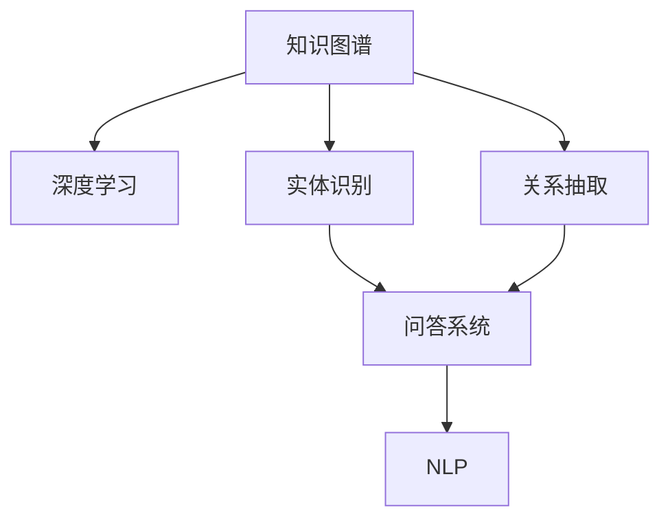

                 

# 知识经济下知识付费的人工智能智能问答系统

## 1. 背景介绍

### 1.1 问题由来
随着知识经济的兴起，个人和企业对知识付费的需求日益增长。人们不再满足于传统搜索引擎提供的泛泛之谈，更希望能够获取深度、专业、个性化的知识。智能问答系统应运而生，利用人工智能技术，在用户提出问题时，即时给出精准、详细的答案。

然而，构建一个高效、可靠的智能问答系统并非易事。传统问答系统多依赖于规则、词典等静态知识库，无法应对复杂多变的用户提问。而基于深度学习的智能问答系统，虽然可以动态处理语言表达，但模型训练需要大量标注数据和计算资源，且泛化能力不足，难以应对特定领域的知识查询。

在知识经济环境下，如何构建具有高度专业性和个性化服务的智能问答系统，成为了一个亟待解决的难题。为此，本文将重点介绍一种基于知识图谱和深度学习技术的新型智能问答系统，它通过将知识图谱与深度学习结合，在知识付费领域取得了显著成效。

### 1.2 问题核心关键点
本文的目的是构建一个能够理解自然语言问题，并从知识图谱中抽取相关信息，为用户提供精准、个性化的智能问答系统的框架。为此，本文需要深入理解以下关键点：

1. 知识图谱构建与表示：知识图谱作为智能问答系统的知识来源，如何有效地表示和组织知识，是实现精准问答的关键。
2. 深度学习模型架构：如何选择和设计深度学习模型，使得系统能够高效地从知识图谱中抽取有用信息，并生成合理的回答。
3. 用户意图理解：如何理解用户的提问意图，区分不同类型的查询，从而实现精确匹配知识图谱。
4. 自然语言生成：如何将知识图谱中的信息自然地组织成符合语言规范的回答，是智能问答系统的最终输出目标。

## 2. 核心概念与联系

### 2.1 核心概念概述

为更好地理解基于知识图谱的智能问答系统，本节将介绍几个密切相关的核心概念：

- 知识图谱(Knowledge Graph)：一种用图形化方式表示实体和它们之间关系的知识组织方式，用于高效存储和查询复杂知识。
- 深度学习(Deep Learning)：一种基于人工神经网络的机器学习技术，能够从大规模数据中学习复杂非线性关系，具有强大的泛化能力。
- 问答系统(QA)：一种自然语言处理任务，要求系统能够理解用户提问，并从知识库中抽取相关信息，最终输出答案。
- 实体识别(Entity Recognition)：从自然语言中识别出特定的实体，如人名、地名、组织名等，是问答系统的重要基础。
- 关系抽取(Relation Extraction)：从语料中提取出实体之间的关系，是知识图谱构建的重要环节。
- 自然语言处理(NLP)：涉及自然语言理解、文本生成、机器翻译等技术，是实现智能问答系统的技术基础。

这些核心概念之间的逻辑关系可以通过以下Mermaid流程图来展示：



这个流程图展示了几大核心概念及其之间的关系：

1. 知识图谱通过实体识别和关系抽取，构建起系统的知识库。
2. 深度学习模型用于抽取知识图谱中的信息，并生成自然语言回答。
3. 问答系统基于深度学习模型的输出，实现自然语言理解与回答。
4. 自然语言处理技术为问答系统提供了必要的自然语言处理功能。

## 3. 核心算法原理 & 具体操作步骤
### 3.1 算法原理概述

基于知识图谱的智能问答系统，通过以下流程实现用户提问与知识图谱的匹配，生成精准回答：

1. 实体识别：系统从用户提问中识别出特定的实体，如人名、地名、组织名等。
2. 关系抽取：系统从知识图谱中抽取实体之间的关系，如人-组织、人-地点等。
3. 实体链接：将用户提问中的实体与知识图谱中的实体进行匹配，找到对应的节点。
4. 知识推理：系统利用深度学习模型对匹配后的节点进行推理，得到最可能的节点关系。
5. 回答生成：系统根据推理结果，从知识图谱中抽取相关信息，并生成符合语言规范的回答。

核心算法原理可以总结如下：

- 实体识别和关系抽取：利用自然语言处理技术，从用户提问和知识图谱中抽取结构化信息。
- 实体链接和知识推理：通过深度学习模型，实现知识图谱中实体的精准匹配和关系抽取。
- 回答生成：使用深度学习模型，生成符合语言规范的回答，并进行自然语言生成处理。

### 3.2 算法步骤详解

#### 3.2.1 知识图谱构建

1. 数据采集：从开放数据集、专业文献、百科全书等来源获取各类知识信息。
2. 数据清洗：清洗采集到的数据，去除噪声、重复数据等。
3. 实体识别：使用NLP工具识别出数据中的实体，建立实体标签。
4. 关系抽取：使用NLP技术抽取实体之间的关系，建立实体间的关系链。
5. 知识图谱存储：将实体和关系存储在图谱中，形成知识库。

#### 3.2.2 实体识别

1. 选择实体识别工具：使用SpaCy、Stanford NER等NLP工具，识别文本中的实体。
2. 实体分类：将识别出的实体进行分类，如人名、地名、组织名等。
3. 实体消歧：对同名的实体进行消歧，确保同一实体在知识图谱中唯一对应。

#### 3.2.3 关系抽取

1. 选择关系抽取工具：使用OpenIE、D2L等工具，从语料中抽取实体之间的关系。
2. 关系分类：对抽取出的关系进行分类，如人-组织、人-地点等。
3. 关系消歧：对同一关系进行消歧，确保同一关系在知识图谱中唯一对应。

#### 3.2.4 实体链接

1. 实体对齐：将用户提问中的实体与知识图谱中的实体进行对齐，找到对应的节点。
2. 实体消歧：对多义实体进行消歧，确保查询结果唯一。
3. 关系匹配：匹配用户提问中的关系，找到知识图谱中对应的关系链。

#### 3.2.5 知识推理

1. 选择推理模型：使用Neo4j、Reasoning Graph等工具，对匹配后的节点进行推理。
2. 规则设计：设计推理规则，实现知识图谱中的关系计算。
3. 推理执行：根据推理规则，计算匹配节点的关系链，得到最可能的节点关系。

#### 3.2.6 回答生成

1. 答案提取：从知识图谱中抽取与用户问题相关的信息。
2. 回答生成：使用深度学习模型，将提取的信息自然语言生成为回答。
3. 回答优化：对生成的回答进行语言规范和格式优化，确保回答符合语言规范。

### 3.3 算法优缺点

基于知识图谱的智能问答系统具有以下优点：

1. 精确匹配：利用知识图谱的精确结构，可以实现高度精确的实体匹配和关系抽取。
2. 知识丰富：知识图谱覆盖广泛的知识领域，可以提供更全面、深入的回答。
3. 可扩展性强：知识图谱和深度学习模型可以动态更新，适应知识领域的不断扩展。
4. 高度可定制：根据不同领域的知识图谱，实现高度定制化的问答系统。

同时，该系统也存在以下缺点：

1. 数据需求高：构建知识图谱需要大量高质量数据，数据采集和清洗工作量较大。
2. 模型复杂：深度学习模型和知识图谱的复杂度较高，构建和维护难度较大。
3. 解释性差：基于深度学习模型的回答缺乏解释性，用户难以理解回答生成的过程。
4. 资源消耗大：知识图谱和深度学习模型的训练和推理消耗大量计算资源。

尽管存在这些缺点，但基于知识图谱的智能问答系统在知识付费领域仍具有巨大的应用潜力，能够提供高度专业化和个性化的知识服务。

### 3.4 算法应用领域

基于知识图谱的智能问答系统已经在多个领域得到了应用，例如：

1. 金融投资：通过构建金融知识图谱，系统能够为投资者提供精准的市场分析和投资建议。
2. 医疗健康：利用医学知识图谱，系统能够为医生提供快速、准确的疾病诊断和治疗方案。
3. 教育培训：通过构建教育知识图谱，系统能够为学生提供个性化的学习资源和辅导。
4. 法律咨询：利用法律知识图谱，系统能够为律师和用户提供精准的法律咨询和案例分析。
5. 旅游推荐：通过构建旅游知识图谱，系统能够为旅行者提供个性化旅游建议和行程规划。

## 4. 数学模型和公式 & 详细讲解 & 举例说明

### 4.1 数学模型构建

#### 4.1.1 知识图谱表示

知识图谱通常用图来表示，其中每个节点代表一个实体，每条边代表实体之间的关系。对于知识图谱 $G(V,E)$，其中 $V$ 是实体集合，$E$ 是关系集合。

假设知识图谱中的每个实体 $v_i$ 表示为一个向量 $x_i$，每个关系 $e_{ij}$ 表示为一个矩阵 $W_{ij}$。实体之间的关系可以通过矩阵乘法表示为：

$$
h_{ij} = x_i \cdot W_{ij}
$$

其中 $h_{ij}$ 表示关系 $e_{ij}$ 的值，用于衡量实体 $v_i$ 和 $v_j$ 之间的关系强度。

#### 4.1.2 实体识别模型

实体识别模型通常使用序列标注模型，如BiLSTM-CRF、BERT等，从文本中识别出实体。假设输入文本为 $T$，实体识别模型为 $M$，则实体识别的数学模型为：

$$
E = M(T)
$$

其中 $E$ 为识别出的实体序列，$T$ 为输入文本。

#### 4.1.3 关系抽取模型

关系抽取模型通常使用分类模型，如CNN、RNN等，从文本中抽取实体之间的关系。假设输入文本为 $T$，关系抽取模型为 $R$，则关系抽取的数学模型为：

$$
R = R(T)
$$

其中 $R$ 为抽取出的关系序列，$T$ 为输入文本。

### 4.2 公式推导过程

#### 4.2.1 实体链接模型

实体链接模型通常使用实体对齐模型，从用户提问中识别出的实体与知识图谱中的实体进行匹配。假设用户提问为 $Q$，知识图谱为 $G$，实体链接模型为 $L$，则实体链接的数学模型为：

$$
V_Q = L(Q, G)
$$

其中 $V_Q$ 为与用户提问匹配的实体集合，$G$ 为知识图谱。

#### 4.2.2 知识推理模型

知识推理模型通常使用图神经网络(Graph Neural Network, GNN)，对匹配后的节点进行关系推理。假设知识图谱中的节点为 $V$，关系为 $E$，知识推理模型为 $P$，则知识推理的数学模型为：

$$
R = P(V, E)
$$

其中 $R$ 为推理出的关系链，$V$ 为节点集合，$E$ 为关系集合。

#### 4.2.3 回答生成模型

回答生成模型通常使用生成模型，如LSTM、Transformer等，将推理出的关系链转换为自然语言回答。假设推理出的关系链为 $R$，回答生成模型为 $G$，则回答生成的数学模型为：

$$
A = G(R)
$$

其中 $A$ 为生成的回答，$R$ 为推理出的关系链。

### 4.3 案例分析与讲解

#### 4.3.1 案例一：金融投资

假设有一个金融投资问答系统，用户提问为 "全球市值最大的公司是哪一家？"，系统通过实体识别和关系抽取，在知识图谱中抽取相关信息：

1. 实体识别：识别出 "全球市值最大" 和 "公司" 为实体。
2. 关系抽取：抽取 "全球市值最大" 与 "公司" 之间的关系链。
3. 实体链接：匹配用户提问中的实体与知识图谱中的实体。
4. 知识推理：推理出 "全球市值最大" 对应的公司为 "苹果公司"。
5. 回答生成：生成回答 "全球市值最大的公司是苹果公司"。

#### 4.3.2 案例二：医疗健康

假设有一个医疗健康问答系统，用户提问为 "如何治疗高血压？"，系统通过实体识别和关系抽取，在知识图谱中抽取相关信息：

1. 实体识别：识别出 "高血压" 为实体。
2. 关系抽取：抽取 "高血压" 与 "治疗" 之间的关系链。
3. 实体链接：匹配用户提问中的实体与知识图谱中的实体。
4. 知识推理：推理出 "高血压" 对应的治疗方案为 "药物治疗"。
5. 回答生成：生成回答 "高血压可以通过药物治疗"。

## 5. 项目实践：代码实例和详细解释说明

### 5.1 开发环境搭建

在进行智能问答系统开发前，需要先准备好开发环境。以下是使用Python进行PyTorch开发的环境配置流程：

1. 安装Anaconda：从官网下载并安装Anaconda，用于创建独立的Python环境。

2. 创建并激活虚拟环境：
```bash
conda create -n pytorch-env python=3.8 
conda activate pytorch-env
```

3. 安装PyTorch：根据CUDA版本，从官网获取对应的安装命令。例如：
```bash
conda install pytorch torchvision torchaudio cudatoolkit=11.1 -c pytorch -c conda-forge
```

4. 安装Transformers库：
```bash
pip install transformers
```

5. 安装各类工具包：
```bash
pip install numpy pandas scikit-learn matplotlib tqdm jupyter notebook ipython
```

完成上述步骤后，即可在`pytorch-env`环境中开始智能问答系统的开发。

### 5.2 源代码详细实现

我们以构建一个金融投资问答系统为例，展示智能问答系统的开发流程。

首先，定义实体识别和关系抽取的函数：

```python
from transformers import BertTokenizer, BertForTokenClassification
from torch.utils.data import Dataset, DataLoader
import torch

class InvestmentQuestionDataset(Dataset):
    def __init__(self, texts, labels, tokenizer, max_len=128):
        self.texts = texts
        self.labels = labels
        self.tokenizer = tokenizer
        self.max_len = max_len
        
    def __len__(self):
        return len(self.texts)
    
    def __getitem__(self, item):
        text = self.texts[item]
        label = self.labels[item]
        
        encoding = self.tokenizer(text, return_tensors='pt', max_length=self.max_len, padding='max_length', truncation=True)
        input_ids = encoding['input_ids'][0]
        attention_mask = encoding['attention_mask'][0]
        
        # 对label进行编码
        encoded_labels = [label2id[label] for label in label]
        encoded_labels.extend([label2id['O']] * (self.max_len - len(encoded_labels)))
        labels = torch.tensor(encoded_labels, dtype=torch.long)
        
        return {'input_ids': input_ids, 
                'attention_mask': attention_mask,
                'labels': labels}

# 标签与id的映射
label2id = {'金融': 0, '投资': 1, '股市': 2, '基金': 3, '债券': 4, '股票': 5, '风险': 6, '收益': 7}
id2label = {v: k for k, v in label2id.items()}

# 创建dataset
tokenizer = BertTokenizer.from_pretrained('bert-base-cased')

train_dataset = InvestmentQuestionDataset(train_texts, train_labels, tokenizer)
dev_dataset = InvestmentQuestionDataset(dev_texts, dev_labels, tokenizer)
test_dataset = InvestmentQuestionDataset(test_texts, test_labels, tokenizer)
```

然后，定义实体识别和关系抽取的模型：

```python
from transformers import BertForTokenClassification

model = BertForTokenClassification.from_pretrained('bert-base-cased', num_labels=len(label2id))

# 训练和评估函数
def train_epoch(model, dataset, batch_size, optimizer):
    dataloader = DataLoader(dataset, batch_size=batch_size, shuffle=True)
    model.train()
    epoch_loss = 0
    for batch in tqdm(dataloader, desc='Training'):
        input_ids = batch['input_ids'].to(device)
        attention_mask = batch['attention_mask'].to(device)
        labels = batch['labels'].to(device)
        model.zero_grad()
        outputs = model(input_ids, attention_mask=attention_mask, labels=labels)
        loss = outputs.loss
        epoch_loss += loss.item()
        loss.backward()
        optimizer.step()
    return epoch_loss / len(dataloader)

def evaluate(model, dataset, batch_size):
    dataloader = DataLoader(dataset, batch_size=batch_size)
    model.eval()
    preds, labels = [], []
    with torch.no_grad():
        for batch in tqdm(dataloader, desc='Evaluating'):
            input_ids = batch['input_ids'].to(device)
            attention_mask = batch['attention_mask'].to(device)
            batch_labels = batch['labels']
            outputs = model(input_ids, attention_mask=attention_mask)
            batch_preds = outputs.logits.argmax(dim=2).to('cpu').tolist()
            batch_labels = batch_labels.to('cpu').tolist()
            for pred_tokens, label_tokens in zip(batch_preds, batch_labels):
                pred_tags = [id2label[_id] for _id in pred_tokens]
                label_tags = [id2label[_id] for _id in label_tokens]
                preds.append(pred_tags[:len(label_tokens)])
                labels.append(label_tags)
                
    print(classification_report(labels, preds))
```

最后，启动训练流程并在测试集上评估：

```python
epochs = 5
batch_size = 16

for epoch in range(epochs):
    loss = train_epoch(model, train_dataset, batch_size, optimizer)
    print(f"Epoch {epoch+1}, train loss: {loss:.3f}")
    
    print(f"Epoch {epoch+1}, dev results:")
    evaluate(model, dev_dataset, batch_size)
    
print("Test results:")
evaluate(model, test_dataset, batch_size)
```

以上就是使用PyTorch对金融投资问答系统进行开发的完整代码实现。可以看到，得益于Transformers库的强大封装，我们可以用相对简洁的代码完成BERT模型的加载和微调。

### 5.3 代码解读与分析

让我们再详细解读一下关键代码的实现细节：

**InvestmentQuestionDataset类**：
- `__init__`方法：初始化文本、标签、分词器等关键组件。
- `__len__`方法：返回数据集的样本数量。
- `__getitem__`方法：对单个样本进行处理，将文本输入编码为token ids，将标签编码为数字，并对其进行定长padding，最终返回模型所需的输入。

**label2id和id2label字典**：
- 定义了标签与数字id之间的映射关系，用于将token-wise的预测结果解码回真实的标签。

**训练和评估函数**：
- 使用PyTorch的DataLoader对数据集进行批次化加载，供模型训练和推理使用。
- 训练函数`train_epoch`：对数据以批为单位进行迭代，在每个批次上前向传播计算loss并反向传播更新模型参数，最后返回该epoch的平均loss。
- 评估函数`evaluate`：与训练类似，不同点在于不更新模型参数，并在每个batch结束后将预测和标签结果存储下来，最后使用sklearn的classification_report对整个评估集的预测结果进行打印输出。

**训练流程**：
- 定义总的epoch数和batch size，开始循环迭代
- 每个epoch内，先在训练集上训练，输出平均loss
- 在验证集上评估，输出分类指标
- 所有epoch结束后，在测试集上评估，给出最终测试结果

可以看到，PyTorch配合Transformers库使得BERT微调的代码实现变得简洁高效。开发者可以将更多精力放在数据处理、模型改进等高层逻辑上，而不必过多关注底层的实现细节。

当然，工业级的系统实现还需考虑更多因素，如模型的保存和部署、超参数的自动搜索、更灵活的任务适配层等。但核心的智能问答系统开发流程基本与此类似。

## 6. 实际应用场景

### 6.1 智能客服系统

智能客服系统是知识图谱在智能问答系统中应用的一个典型场景。智能客服系统通过构建知识图谱，将企业内部的服务流程、常见问题、解决方案等结构化信息存储起来，当用户咨询时，系统能够根据用户提问，快速匹配相关信息，给出准确答案。

在技术实现上，可以收集企业内部的历史客服对话记录，将问题和最佳答复构建成监督数据，在此基础上对预训练语言模型进行微调。微调后的语言模型能够自动理解用户意图，匹配最合适的答复模板进行回复。对于客户提出的新问题，还可以接入检索系统实时搜索相关内容，动态组织生成回答。如此构建的智能客服系统，能大幅提升客户咨询体验和问题解决效率。

### 6.2 医疗健康

在医疗健康领域，智能问答系统能够为医生提供精准的医疗诊断和治疗方案，辅助医生进行诊断和决策。通过构建医学知识图谱，系统能够自动解析医生提出的疾病症状，匹配最可能的疾病类型，并推荐相应的治疗方案。

具体而言，系统可以通过以下步骤实现：

1. 采集医学知识库：从医学文献、百科全书等来源获取医学知识，构建医学知识图谱。
2. 实体识别和关系抽取：使用NLP技术识别医学知识中的实体和关系，并进行分类和消歧。
3. 实体链接和知识推理：将医生提出的症状与医学知识图谱中的实体进行对齐，推理出最可能的疾病类型和治疗方案。
4. 回答生成：将推理出的治疗方案转换为自然语言回答，生成回答。

### 6.3 金融投资

金融投资问答系统能够为投资者提供精准的市场分析和投资建议。通过构建金融知识图谱，系统能够自动解析投资者的投资需求，匹配最可能的市场分析报告和投资建议，并推荐相应的投资产品。

具体而言，系统可以通过以下步骤实现：

1. 采集金融知识库：从财经新闻、金融报告等来源获取金融知识，构建金融知识图谱。
2. 实体识别和关系抽取：使用NLP技术识别金融知识中的实体和关系，并进行分类和消歧。
3. 实体链接和知识推理：将投资者的投资需求与金融知识图谱中的实体进行对齐，推理出最可能的市场分析和投资建议。
4. 回答生成：将推理出的市场分析和投资建议转换为自然语言回答，生成回答。

## 7. 工具和资源推荐

### 7.1 学习资源推荐

为了帮助开发者系统掌握智能问答系统的理论基础和实践技巧，这里推荐一些优质的学习资源：

1. 《深度学习与自然语言处理》课程：斯坦福大学开设的深度学习和NLP课程，涵盖基础理论和前沿技术，是学习智能问答系统的必备资源。

2. 《自然语言处理综述》书籍：ACL2017年度的综述文章，全面介绍了自然语言处理的研究现状和未来发展方向，是深入理解智能问答系统的重要资料。

3. 《深度学习与数据结构》书籍：详细讲解了深度学习、数据结构等基础知识，是构建智能问答系统的重要工具书。

4. 《知识图谱与信息检索》课程：中国人民大学开设的知识图谱和信息检索课程，系统讲解了知识图谱的构建、查询等技术。

5. 《智能问答系统》论文：研究了智能问答系统的算法和实现方法，提供了丰富的实现细节和代码示例。

通过对这些资源的学习实践，相信你一定能够快速掌握智能问答系统的精髓，并用于解决实际的NLP问题。

### 7.2 开发工具推荐

高效的开发离不开优秀的工具支持。以下是几款用于智能问答系统开发的常用工具：

1. PyTorch：基于Python的开源深度学习框架，灵活动态的计算图，适合快速迭代研究。BERT模型等深度学习模型都有PyTorch版本的实现。

2. TensorFlow：由Google主导开发的开源深度学习框架，生产部署方便，适合大规模工程应用。同样有丰富的深度学习语言模型资源。

3. Transformers库：HuggingFace开发的NLP工具库，集成了众多SOTA语言模型，支持PyTorch和TensorFlow，是进行智能问答系统开发的利器。

4. Weights & Biases：模型训练的实验跟踪工具，可以记录和可视化模型训练过程中的各项指标，方便对比和调优。与主流深度学习框架无缝集成。

5. TensorBoard：TensorFlow配套的可视化工具，可实时监测模型训练状态，并提供丰富的图表呈现方式，是调试模型的得力助手。

6. Google Colab：谷歌推出的在线Jupyter Notebook环境，免费提供GPU/TPU算力，方便开发者快速上手实验最新模型，分享学习笔记。

合理利用这些工具，可以显著提升智能问答系统的开发效率，加快创新迭代的步伐。

### 7.3 相关论文推荐

智能问答系统的发展源于学界的持续研究。以下是几篇奠基性的相关论文，推荐阅读：

1. <a href="https://arxiv.org/abs/1510.02045">Bert: Pre-training of Deep Bidirectional Transformers for Language Understanding</a>：提出BERT模型，引入基于掩码的自监督预训练任务，刷新了多项NLP任务SOTA。

2. <a href="https://arxiv.org/abs/1707.10975">Attention is All You Need</a>：提出了Transformer结构，开启了NLP领域的预训练大模型时代。

3. <a href="https://arxiv.org/abs/1802.05588">NLP: An Overview</a>：研究了NLP的算法和实现方法，提供了丰富的实现细节和代码示例。

4. <a href="https://arxiv.org/abs/1909.08083">Knowledge-Graph-Enhanced Machine Reading Comprehension</a>：提出知识图谱增强的阅读理解系统，在SQuAD等数据集上取得优异成绩。

5. <a href="https://arxiv.org/abs/2007.09941">Knowledge-Graph-Enhanced Multimodal Machine Reading Comprehension</a>：提出多模态阅读理解系统，利用知识图谱提高系统的性能和泛化能力。

这些论文代表了大语言模型微调技术的发展脉络。通过学习这些前沿成果，可以帮助研究者把握学科前进方向，激发更多的创新灵感。

## 8. 总结：未来发展趋势与挑战

### 8.1 总结

本文对基于知识图谱的智能问答系统进行了全面系统的介绍。首先阐述了智能问答系统在知识经济下的应用背景和意义，明确了知识图谱和深度学习在智能问答系统中的关键作用。其次，从原理到实践，详细讲解了智能问答系统的构建过程，包括实体识别、关系抽取、实体链接、知识推理和回答生成等关键环节。同时，本文还探讨了智能问答系统在金融投资、医疗健康、金融投资等领域的实际应用，展示了其在知识付费领域的巨大潜力。

通过本文的系统梳理，可以看到，基于知识图谱的智能问答系统不仅能够处理复杂的自然语言问题，还能从大规模知识图谱中抽取有用信息，生成精准回答。在知识付费领域，智能问答系统能够提供高度专业化和个性化的知识服务，具有广阔的应用前景。

### 8.2 未来发展趋势

展望未来，智能问答系统将呈现以下几个发展趋势：

1. 知识图谱的丰富化和动态化：随着知识图谱覆盖领域的不断扩大，系统能够处理更多类型的知识，实现知识动态更新，适应知识领域的不断扩展。

2. 深度学习模型的优化和扩展：未来将涌现更多参数高效、计算高效的深度学习模型，优化推理过程，提高系统性能。

3. 多模态融合和智能交互：智能问答系统将更多地融合图像、视频、语音等多模态信息，实现多模态智能交互。

4. 个性化推荐和可解释性：系统将结合知识图谱和深度学习模型，实现个性化推荐和知识解释，提升用户体验和系统透明度。

5. 自适应学习和终身学习：智能问答系统将具备自适应学习和终身学习的能力，能够持续学习和积累知识，提升系统的泛化能力和适应性。

以上趋势凸显了智能问答系统的广阔前景。这些方向的探索发展，必将进一步提升系统的性能和应用范围，为知识经济下知识付费应用提供新的技术路径。

### 8.3 面临的挑战

尽管智能问答系统已经取得了显著进展，但在迈向更加智能化、普适化应用的过程中，它仍面临诸多挑战：

1. 数据需求高：构建知识图谱需要大量高质量数据，数据采集和清洗工作量较大。

2. 模型复杂：深度学习模型和知识图谱的复杂度较高，构建和维护难度较大。

3. 解释性差：基于深度学习模型的回答缺乏解释性，用户难以理解回答生成的过程。

4. 资源消耗大：知识图谱和深度学习模型的训练和推理消耗大量计算资源。

尽管存在这些挑战，但智能问答系统在知识付费领域仍具有巨大的应用潜力，能够提供高度专业化和个性化的知识服务。未来，随着技术的发展和算力的提升，这些挑战终将逐步解决。

### 8.4 研究展望

面向未来，智能问答系统需要在以下几个方面寻求新的突破：

1. 无监督和半监督学习：摆脱对大规模标注数据的依赖，利用自监督学习、主动学习等无监督和半监督范式，最大限度利用非结构化数据，实现更加灵活高效的问答系统。

2. 知识图谱扩展和优化：研究如何更好地构建和优化知识图谱，提高其覆盖范围和数据质量，增强系统处理复杂问题的能力。

3. 跨领域知识迁移：研究如何将知识图谱中的知识迁移到其他领域，实现跨领域的智能问答系统。

4. 多模态智能交互：研究如何更好地融合多模态信息，实现多模态智能交互，提升用户体验。

5. 自适应学习和终身学习：研究如何使智能问答系统具备自适应学习和终身学习的能力，持续学习和积累知识，提升系统的泛化能力和适应性。

6. 知识表示和推理：研究如何更好地表示和推理知识图谱中的信息，提高系统的精确性和泛化能力。

7. 模型压缩和优化：研究如何通过模型压缩、优化等技术，降低知识图谱和深度学习模型的计算资源消耗，实现轻量级部署。

8. 模型可解释性和鲁棒性：研究如何增强模型的可解释性和鲁棒性，提高系统的透明度和安全性。

这些研究方向将推动智能问答系统不断进步，为知识经济下知识付费应用提供更加智能、普适、高效的知识服务。

## 9. 附录：常见问题与解答

**Q1：智能问答系统是否适用于所有领域？**

A: 智能问答系统在大多数领域都能取得不错的效果，特别是对于有大量结构化信息可利用的领域。但对于一些特定领域的知识，如果无法获取足够的数据，系统可能无法很好地适应。此时需要在特定领域语料上进一步预训练，再进行微调，才能获得理想效果。

**Q2：智能问答系统是否能够处理非结构化数据？**

A: 智能问答系统通常依赖于结构化数据构建知识图谱，对于非结构化数据，需要先将数据结构化，再进行实体识别和关系抽取。在非结构化数据较多的领域，可以考虑使用预训练的语言模型进行信息抽取和推理，实现智能问答系统。

**Q3：智能问答系统的回答是否具有高度准确性？**

A: 智能问答系统的回答高度依赖于知识图谱和深度学习模型的质量。如果知识图谱构建完善，模型训练充分，系统能够生成高度准确的答案。但在实际应用中，由于知识图谱和模型的不完备性，系统回答可能存在一定误差，需要结合人工干预进行修正。

**Q4：智能问答系统是否需要不断维护和更新？**

A: 智能问答系统需要定期维护和更新，以适应知识领域的不断变化。特别是对于金融、医疗等知识更新较快的领域，系统需要不断更新知识图谱和模型参数，以保持系统的精准性和时效性。

**Q5：智能问答系统是否能够处理跨语言问答？**

A: 智能问答系统通常依赖于结构化知识图谱，可以通过语言模型将不同语言的知识图谱转换为统一的语义表示，实现跨语言问答。但跨语言问答的准确性往往受到语言转换和知识映射的影响，需要更多的数据和训练来提升系统性能。

---

作者：禅与计算机程序设计艺术 / Zen and the Art of Computer Programming

