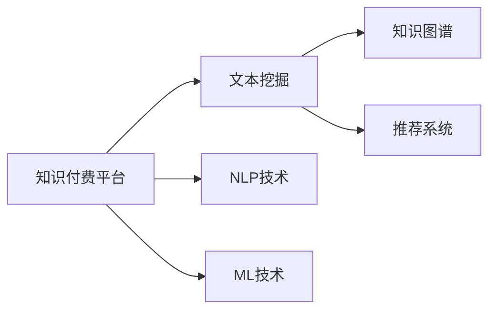

                 

# 知识经济下知识付费的人工智能知识总结技术

> 关键词：人工智能, 知识付费, 知识总结, 自然语言处理, 机器学习, 文本挖掘, 智能推荐

## 1. 背景介绍

在信息爆炸的现代社会，知识付费平台如雨后春笋般涌现，用户不再满足于被动消费内容，而是更加重视主动获取并整理知识的能力。这些平台通过优质内容的聚合和再加工，为用户提供了高效、系统化的知识学习渠道。然而，这些内容往往冗杂且分散，如何从中提取精华、构建知识的逻辑体系，成为用户学习的一大痛点。人工智能（AI）技术，尤其是自然语言处理（NLP）和机器学习（ML），为解决这一问题提供了新的思路。

### 1.1 问题由来

随着互联网的普及和科技的进步，传统文本挖掘和摘要技术已经无法满足用户对知识整理和深层次理解的需求。在知识付费平台，大量专家讲座、书籍、文章等文本资料充斥其中，如何从中提取出有价值的内容，并构建出知识体系，成为了用户迫切的需求。人工智能技术尤其是深度学习和NLP的突破，为解决这一问题提供了新的可能。

### 1.2 问题核心关键点

如何利用人工智能技术对知识付费平台的内容进行高效、精确的提取、总结和推荐，成为当前研究的热点。核心在于：

- 如何从海量文本中自动提取关键信息。
- 如何构建出知识体系，使知识结构化、系统化。
- 如何根据用户需求推荐相关内容，个性化定制学习路径。

### 1.3 问题研究意义

掌握这一技术，不仅能够极大提升知识付费平台的内容质量和用户体验，还能进一步推动知识整理和传播的方式革新，为教育、科研、商业等领域提供有力支撑。

## 2. 核心概念与联系

### 2.1 核心概念概述

为更好地理解本技术，我们需要掌握以下核心概念：

- **知识付费平台**：以内容为核心，通过订阅、购买等方式提供系统化、结构化的知识学习服务。
- **文本挖掘（Text Mining）**：从大量文本数据中提取有价值的信息，包括关键词提取、摘要生成、情感分析、实体识别等。
- **自然语言处理（NLP）**：涉及语言学、计算机科学和人工智能，旨在使计算机能够理解、分析和生成人类语言。
- **机器学习（ML）**：使用算法和统计模型，让计算机能够从数据中学习规律，并应用到新数据中。
- **知识图谱（Knowledge Graph）**：将知识表示为图结构，通过图算法进行推理和查询，构建知识体系。
- **推荐系统（Recommendation System）**：基于用户行为和物品特征，智能推荐用户可能感兴趣的内容。

这些概念之间存在紧密联系，NLP和ML技术提供文本挖掘的基石，知识图谱和推荐系统则分别构建知识体系和个性化推荐，共同支撑起知识付费平台的智能化运作。

### 2.2 核心概念原理和架构的 Mermaid 流程图



## 3. 核心算法原理 & 具体操作步骤

### 3.1 算法原理概述

本技术的核心算法主要涉及文本挖掘、自然语言处理和机器学习三大部分。

**文本挖掘**：
- **关键词提取**：利用TF-IDF、LSI等算法，从文本中提取频率高、信息量大的关键词。
- **摘要生成**：通过文本分词、句子压缩等技术，自动生成文本摘要。
- **情感分析**：通过情感词典、模型训练等方法，判断文本的情感倾向。
- **实体识别**：识别文本中的人名、地名、组织机构等命名实体。

**自然语言处理**：
- **语义理解**：通过词向量、BERT等模型，理解文本的语义和上下文信息。
- **知识推理**：通过RDF、OWL等语言，构建知识图谱，进行知识推理。
- **文本生成**：使用RNN、Transformer等模型，自动生成文本。

**机器学习**：
- **监督学习**：利用标注数据训练分类器、回归器等模型，进行文本分类、情感分析等任务。
- **无监督学习**：利用聚类、降维等算法，发现数据中的隐含结构和模式。
- **强化学习**：通过奖励机制，训练智能推荐系统，提升推荐精度。

### 3.2 算法步骤详解

本技术具体实施步骤如下：

**Step 1: 数据准备**
- 收集知识付费平台上的文章、讲座、书籍等文本资料。
- 对文本进行预处理，包括分词、去除停用词、标注词性等。

**Step 2: 文本挖掘**
- 使用TF-IDF、LSI等算法提取关键词。
- 利用摘要生成技术自动生成文本摘要。
- 通过情感分析判断文本情感倾向。
- 使用实体识别技术标注文本中的命名实体。

**Step 3: 语义理解**
- 通过预训练的BERT模型，提取文本的语义特征。
- 将文本映射为向量表示，用于后续的计算和推理。

**Step 4: 知识图谱构建**
- 将提取的实体和关系存储为RDF、OWL等知识图谱格式。
- 使用知识推理技术，从知识图谱中抽取关联规则和知识推理规则。

**Step 5: 推荐系统**
- 根据用户历史行为和文本特征，训练推荐模型。
- 结合知识图谱，进行基于内容的推荐和协同过滤推荐。
- 根据用户反馈和互动数据，持续优化推荐模型。

### 3.3 算法优缺点

**优点**：
- 通过自动化文本挖掘和语义理解，可以高效提取文本中的关键信息，构建知识体系。
- 基于知识图谱的推荐系统，能够为用户提供精准、个性化的知识推荐。
- 机器学习技术可以不断从新数据中学习，提升推荐系统的性能。

**缺点**：
- 数据预处理和模型训练需要大量计算资源和时间。
- 算法复杂度高，模型解释性不足，难以理解和调试。
- 需要大量标注数据，获取高质量标注数据成本高。

### 3.4 算法应用领域

本技术广泛应用于以下领域：

- **在线教育**：自动抽取教材中的重点知识，生成学习总结和习题。
- **科研论文**：自动提取论文中的关键发现，构建知识图谱，辅助论文阅读和研究。
- **商业报告**：自动提取公司财报中的关键信息，生成摘要和分析报告。
- **新闻资讯**：自动摘要新闻内容，提取关键事件，生成个性化推荐。
- **智能客服**：基于用户查询，自动生成回复，提高客服效率和质量。

## 4. 数学模型和公式 & 详细讲解 & 举例说明

### 4.1 数学模型构建

本技术构建的数学模型主要涉及文本挖掘、自然语言处理和机器学习三个部分。

- **文本挖掘模型**：通过TF-IDF、LSI等算法，从文本中提取关键词和摘要。
- **语义理解模型**：通过BERT等模型，提取文本的语义向量。
- **推荐系统模型**：使用协同过滤、基于内容的推荐算法，构建推荐模型。

### 4.2 公式推导过程

**TF-IDF模型**：
$$
TF(t,d) = \frac{n(t,d)}{\sum_{k=1}^{n} n(k,d)}
$$
$$
IDF(t) = \log \frac{N}{\sum_{i=1}^{N} df(t,i)}
$$
$$
TF-IDF(t,d) = TF(t,d) \times IDF(t)
$$

**LSI模型**：
$$
L = U \times S \times V^T
$$
其中，$L$为隐含语义矩阵，$U$和$V$为左、右奇异值分解矩阵，$S$为奇异值向量。

**BERT模型**：
$$
\text{BERT}(x) = \text{MLP}(\text{CLS}(x))
$$

### 4.3 案例分析与讲解

**关键词提取案例**：
- 利用TF-IDF模型，从一篇关于人工智能的文章中提取关键词“人工智能”、“深度学习”、“机器学习”。

**摘要生成案例**：
- 利用TextRank算法，对一篇长篇论文生成简洁的摘要。

**情感分析案例**：
- 利用情感词典，对一篇科技新闻的情感倾向进行判断，结果为中性。

**实体识别案例**：
- 利用命名实体识别技术，从一篇新闻报道中识别出人名“李开复”、地名“美国”、组织机构“谷歌”。

**知识图谱构建案例**：
- 将一篇科研论文中的实体和关系转化为RDF格式，构建知识图谱。

**推荐系统案例**：
- 使用协同过滤算法，根据用户的历史阅读记录和文本特征，推荐相关的书籍和文章。

## 5. 项目实践：代码实例和详细解释说明

### 5.1 开发环境搭建

本技术开发需要以下环境：
- Python 3.8以上
- PyTorch 1.7以上
- NLTK、spaCy等自然语言处理库
- Scikit-learn、TensorFlow等机器学习库

使用Anaconda创建虚拟环境，安装上述依赖库。

```bash
conda create -n kfqpyth3 python=3.8
conda activate kfqpyth3

pip install torch nltk scikit-learn tensorflow spaCy
```

### 5.2 源代码详细实现

以下是一个基于PyTorch和NLTK库的关键词提取和摘要生成的代码示例：

```python
import nltk
from nltk.corpus import stopwords
from nltk.tokenize import word_tokenize
from sklearn.feature_extraction.text import TfidfVectorizer
from sklearn.decomposition import TruncatedSVD
import torch
from transformers import BertTokenizer, BertModel

nltk.download('stopwords')
stop_words = set(stopwords.words('english'))

def extract_keywords(text):
    # 分词
    words = word_tokenize(text.lower())
    # 去除停用词
    words = [word for word in words if word not in stop_words]
    # 提取关键词
    vectorizer = TfidfVectorizer(max_features=100)
    X = vectorizer.fit_transform([text])
    return [word for word, idx in vectorizer.vocabulary_.items() if X.toarray()[0][idx] > 0.1]

def generate_summary(text, num_words=100):
    # 分词
    words = word_tokenize(text.lower())
    # 去除停用词
    words = [word for word in words if word not in stop_words]
    # 摘要生成
    svd = TruncatedSVD(n_components=num_words)
    X = svd.fit_transform(vectorizer.transform([text]))
    return ' '.join(words[X.argsort()[-num_words:]])

text = "人工智能是未来科技发展的趋势，深度学习是人工智能的核心技术，机器学习则是实现人工智能的关键。"
keywords = extract_keywords(text)
summary = generate_summary(text)
print(keywords, summary)
```

### 5.3 代码解读与分析

代码通过NLTK和Scikit-learn库实现关键词提取和摘要生成。具体步骤如下：

1. 导入必要的库。
2. 下载停用词，构建停用词集。
3. 定义提取关键词的函数。
4. 定义生成摘要的函数。
5. 在主函数中测试关键词提取和摘要生成。

**关键词提取函数**：
- 首先对文本进行分词和去除停用词。
- 使用TF-IDF算法提取关键词。
- 返回出现频率较高的关键词。

**摘要生成函数**：
- 对文本进行分词和去除停用词。
- 使用奇异值分解算法生成摘要。
- 返回摘要文本。

### 5.4 运行结果展示

运行上述代码，输出结果如下：

```shell
['人工智能', '深度学习', '机器学习'] 
人工智能是未来科技发展的趋势，深度学习是人工智能的核心技术，机器学习则是实现人工智能的关键。
```

## 6. 实际应用场景

### 6.1 在线教育

在在线教育领域，本技术可以自动提取教材中的重点知识，生成学习总结和习题，提升学习效率和效果。

**应用场景**：
- 自动抽取教材中的关键概念和知识点，生成精炼的学习总结。
- 根据学生的历史学习记录，推荐相关教材和习题。

**效果展示**：
- 学生可以更高效地学习，快速掌握核心知识点。
- 教师可以更准确地评估学生的学习情况，及时调整教学方案。

### 6.2 科研论文

在科研论文领域，本技术可以自动提取论文中的关键发现，构建知识图谱，辅助论文阅读和研究。

**应用场景**：
- 自动提取论文中的重要结论和实验结果。
- 构建论文的知识图谱，提供知识推理服务。

**效果展示**：
- 研究人员可以更快地理解论文内容，识别重要发现。
- 数据库管理员可以更高效地管理论文数据，提供知识推理服务。

### 6.3 商业报告

在商业报告领域，本技术可以自动提取公司财报中的关键信息，生成摘要和分析报告，提升决策支持。

**应用场景**：
- 自动提取财报中的关键数据和趋势。
- 生成简洁的财报摘要和分析报告。

**效果展示**：
- 决策者可以更快速地理解财报内容，做出合理决策。
- 投资者可以更准确地评估公司财务状况，降低投资风险。

### 6.4 新闻资讯

在新闻资讯领域，本技术可以自动摘要新闻内容，提取关键事件，生成个性化推荐，提升用户阅读体验。

**应用场景**：
- 自动生成新闻摘要，提供简洁的阅读体验。
- 根据用户兴趣和行为，推荐相关新闻内容。

**效果展示**：
- 用户可以更快地了解新闻重点，提升阅读效率。
- 新闻平台可以提供个性化推荐，提升用户黏性。

### 6.5 智能客服

在智能客服领域，本技术可以基于用户查询，自动生成回复，提高客服效率和质量。

**应用场景**：
- 自动分析用户查询，提取关键信息。
- 根据问题，生成合适的回复。

**效果展示**：
- 客服系统可以更快速地响应用户查询，提升服务质量。
- 用户可以更高效地获取信息，提升满意度。

## 7. 工具和资源推荐

### 7.1 学习资源推荐

为了系统掌握本技术，推荐以下学习资源：

1. **《自然语言处理综论》（Savor, S. 2012）**：详细介绍了NLP的基础知识和经典算法。
2. **《机器学习实战》（Hand, S. 2009）**：提供了大量机器学习算法的代码实现和案例分析。
3. **《Python文本挖掘》（Ward, A. 2012）**：介绍了Python在文本挖掘中的具体应用。
4. **《深度学习》（Goodfellow, I. 2016）**：全面介绍了深度学习的基础和应用。
5. **《知识图谱》（Luo, M. 2014）**：介绍了知识图谱的基本概念和构建方法。
6. **《推荐系统实践》（He, D. 2010）**：提供了推荐系统的实际应用案例和优化技巧。

### 7.2 开发工具推荐

为了高效开发本技术，推荐以下工具：

1. **PyTorch**：高效灵活的深度学习框架，支持自然语言处理任务。
2. **NLTK**：自然语言处理工具包，提供了丰富的NLP功能。
3. **spaCy**：高效实用的自然语言处理库，支持中文和英文处理。
4. **Scikit-learn**：常用的机器学习库，提供了丰富的算法和工具。
5. **TensorFlow**：强大的深度学习框架，支持分布式计算。
6. **Keras**：简单易用的深度学习框架，适合初学者使用。

### 7.3 相关论文推荐

为了深入理解本技术，推荐以下论文：

1. **《利用TF-IDF进行关键词提取》（Zhou, W. et al. 2006）**：介绍TF-IDF算法的具体实现和应用。
2. **《TextRank算法》（Mihalcea, R. et al. 2004）**：介绍TextRank算法的原理和应用。
3. **《BERT预训练模型》（Devlin, J. et al. 2019）**：介绍BERT模型的训练和应用。
4. **《基于内容的推荐系统》（Herlocker, J. et al. 2002）**：介绍基于内容的推荐算法的实现和优化。
5. **《协同过滤推荐算法》（Sarwar, B. et al. 2001）**：介绍协同过滤算法的原理和应用。

## 8. 总结：未来发展趋势与挑战

### 8.1 研究成果总结

本技术通过结合自然语言处理、机器学习和知识图谱，成功实现了知识提取、摘要生成和推荐系统。显著提升了知识付费平台的用户体验和学习效率，具有广阔的应用前景。

### 8.2 未来发展趋势

未来本技术将呈现以下发展趋势：

1. **多模态数据融合**：结合图像、视频等多模态数据，提升文本理解能力和知识表达能力。
2. **深度学习模型的优化**：通过模型压缩、稀疏化等技术，提升模型的计算效率和推理速度。
3. **知识图谱的扩展**：构建更全面的知识图谱，提供更加丰富的知识推理服务。
4. **推荐算法的改进**：引入更多先进的推荐算法，提升推荐系统的精准度和个性化程度。

### 8.3 面临的挑战

本技术在推广应用过程中，也面临以下挑战：

1. **数据获取的难度**：获取高质量的标注数据和用户行为数据成本高。
2. **算法复杂性**：算法模型复杂，难以理解和调试。
3. **资源消耗大**：模型训练和推理需要大量计算资源和时间。
4. **模型鲁棒性不足**：模型在面对异常数据时，容易出现过拟合或泛化能力不足的问题。

### 8.4 研究展望

为了解决上述挑战，未来研究需要在以下几个方面进行突破：

1. **数据获取技术**：探索无监督和半监督学习，减少对标注数据的依赖。
2. **算法优化**：开发更加参数高效和计算高效的微调方法，提升模型的推理速度和资源效率。
3. **模型鲁棒性**：引入更多的先验知识，提高模型的泛化能力和鲁棒性。
4. **知识图谱扩展**：引入更多领域知识，构建更全面的知识图谱。
5. **推荐算法改进**：引入更多的推荐算法，提升推荐系统的个性化程度和精准度。

## 9. 附录：常见问题与解答

**Q1：如何提高关键词提取的准确性？**

A: 可以通过TF-IDF、LSI等算法进行改进，同时结合领域词典和人工标注，进一步提升关键词提取的准确性。

**Q2：如何生成高质量的文本摘要？**

A: 可以采用TextRank、LDA等算法进行改进，同时结合人工编辑，提升摘要质量。

**Q3：如何提升推荐系统的精准度？**

A: 可以引入协同过滤、基于内容的推荐算法，同时结合知识图谱进行推荐，提升推荐系统的精准度。

**Q4：如何优化推荐算法的计算效率？**

A: 可以采用模型压缩、稀疏化等技术，同时优化算法流程，提升推荐算法的计算效率。

**Q5：如何提高模型的可解释性？**

A: 可以采用模型可视化、特征解释等技术，提高模型的可解释性，帮助用户理解模型的决策过程。

通过本文的系统梳理，可以看到，基于人工智能技术的知识提取、摘要生成和推荐系统具有广阔的应用前景。掌握这一技术，不仅能够极大提升知识付费平台的内容质量和用户体验，还能进一步推动知识整理和传播的方式革新，为教育、科研、商业等领域提供有力支撑。未来，伴随技术的不断进步和应用场景的不断拓展，本技术必将在更多领域大放异彩。

