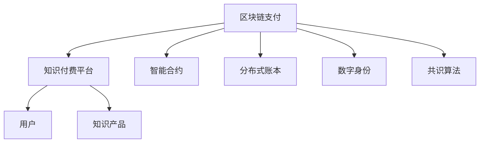

                 

# 知识经济下知识付费的区块链支付与结算方案

> 关键词：区块链支付, 知识付费, 智能合约, 分布式账本, 数字身份

## 1. 背景介绍

### 1.1 问题由来

随着知识经济的兴起，知识付费成为一种日益普及的商业模式。知识付费平台通过订阅、单次付费、课程包等多种形式向用户提供高质量的教育资源，满足了广大用户对终身学习和职业发展的高需求。然而，知识付费也面临诸多挑战，其中支付与结算问题是核心痛点之一。传统支付与结算方式存在流程复杂、效率低下、安全性和隐私性不足等问题，难以适应知识付费快速发展的需求。

为了解决这些问题，近年来，基于区块链技术的支付与结算方案逐渐受到关注。区块链作为去中心化、透明、安全的分布式账本技术，能够提供高效的支付与结算服务，极大地提升了知识付费平台的信任度和用户体验。本文将探讨基于区块链的知识付费支付与结算方案，包括其核心技术原理、具体操作步骤、优缺点、应用领域等，以期为知识付费平台的智能化转型提供参考。

## 2. 核心概念与联系

### 2.1 核心概念概述

为更好地理解区块链支付与结算方案，本节将介绍几个关键概念：

- **区块链支付**：利用区块链分布式账本技术，实现点对点的支付和结算，具有去中心化、透明、不可篡改等特点。

- **知识付费平台**：为用户提供知识产品或服务的在线平台，如得到、知乎、网易云课堂等。

- **智能合约**：基于区块链的一种编程语言，能够在满足预设条件时自动执行合同条款，提高支付与结算的自动化和效率。

- **分布式账本**：由多个节点共同维护的、不可篡改的账本记录，确保数据的一致性和安全性。

- **数字身份**：用户在区块链上唯一的身份标识，用于身份验证和授权管理。

- **共识算法**：区块链网络中达成一致的协议，如PoW、PoS、DPoS等，确保数据的安全性和一致性。

这些核心概念之间的逻辑关系可以通过以下Mermaid流程图来展示：



这个流程图展示了一些核心概念及其之间的关系：

1. 区块链支付基于分布式账本技术，提供高效的支付与结算服务。
2. 知识付费平台利用区块链支付，提高交易的信任度和安全性。
3. 智能合约作为区块链的核心应用之一，用于自动化执行合同条款。
4. 数字身份用于用户身份验证和授权管理。
5. 共识算法确保区块链网络的安全性和一致性。

这些概念共同构成了基于区块链的知识付费支付与结算方案的技术基础。

## 3. 核心算法原理 & 具体操作步骤

### 3.1 算法原理概述

基于区块链的知识付费支付与结算方案，利用区块链的去中心化、透明和不可篡改特性，实现高效、安全的支付与结算服务。其核心原理如下：

1. **分布式账本**：知识付费平台通过区块链分布式账本记录所有支付交易，每个节点都有完整的账本副本，确保数据的一致性和不可篡改性。

2. **智能合约**：知识付费平台使用智能合约，自动执行支付和结算规则，无需人工干预，提高支付与结算的自动化和效率。

3. **数字身份**：用户通过区块链上的数字身份进行身份验证和授权管理，确保交易的安全性和隐私性。

4. **共识算法**：知识付费平台采用共识算法，如PoW、PoS、DPoS等，确保交易的合法性和一致性。

### 3.2 算法步骤详解

基于区块链的知识付费支付与结算方案，主要包括如下步骤：

**Step 1: 用户注册与身份验证**

1. 用户向知识付费平台注册，提供有效的身份证明材料。
2. 平台使用区块链上的数字身份验证技术，对用户身份进行认证。

**Step 2: 课程购买与支付**

1. 用户在知识付费平台上选择所需课程，提交支付请求。
2. 平台生成支付订单，包括课程ID、金额、交易ID等。
3. 用户通过区块链支付系统，使用私钥对支付订单进行数字签名。
4. 平台验证数字签名，确保交易的合法性和安全性。

**Step 3: 支付确认与课程解锁**

1. 支付订单通过区块链网络传输，并记录在分布式账本中。
2. 平台使用智能合约，自动验证支付订单，并解锁课程内容。
3. 平台向用户发送解锁通知，用户可通过区块链上的数字身份访问课程。

**Step 4: 课程学习与结算**

1. 用户在区块链上对课程进行学习，课程内容在区块链上记录。
2. 平台自动更新区块链账本，记录用户的课程学习进度。
3. 用户完成课程后，平台自动生成学习证书，记录在区块链上。

**Step 5: 结算与退款**

1. 知识付费平台根据用户学习进度和课程要求，自动结算课程费用。
2. 用户可随时申请退款，平台通过智能合约验证退款条件，执行退款操作。

### 3.3 算法优缺点

基于区块链的知识付费支付与结算方案，具有以下优点：

1. **高效性**：区块链分布式账本和智能合约的应用，大大提高了支付与结算的自动化和效率。
2. **安全性**：区块链的透明和不可篡改特性，确保交易的安全性和用户隐私。
3. **一致性**：共识算法确保所有节点对交易的合法性和一致性达成共识，提高系统稳定性。

同时，该方案也存在以下局限性：

1. **技术门槛高**：区块链和智能合约技术相对复杂，需要高水平的技术支持。
2. **扩展性有限**：区块链的分布式账本和共识算法，限制了系统扩展性。
3. **成本高**：区块链的共识算法和交易费用，增加了系统的运行成本。

尽管存在这些局限性，但就目前而言，基于区块链的支付与结算方案仍然是一种先进、高效的解决方案，特别是在安全性、透明性和一致性方面具有显著优势。

### 3.4 算法应用领域

基于区块链的知识付费支付与结算方案，广泛应用于知识付费平台、在线教育、数字版权保护等领域，具有广阔的应用前景。

1. **知识付费平台**：如得到、知乎、网易云课堂等，通过区块链支付与结算，提高交易的信任度和安全性。
2. **在线教育**：如Coursera、edX、Udacity等，利用区块链技术，提高课程学习的自动化和透明度。
3. **数字版权保护**：如区块链版权交易平台，保护原创内容版权，防止盗版和侵权。
4. **电子票务**：如演唱会、电影票等，利用区块链支付与结算，提高票务交易的安全性和效率。

## 4. 数学模型和公式 & 详细讲解 & 举例说明

### 4.1 数学模型构建

本节将使用数学语言对基于区块链的知识付费支付与结算方案进行更加严格的刻画。

记知识付费平台为 $P$，区块链网络为 $B$，用户为 $U$，课程为 $C$，支付订单为 $O$，交易ID为 $T$。

定义支付订单 $O = (T, C, A)$，其中 $T$ 为交易ID，$C$ 为课程ID，$A$ 为支付金额。

定义智能合约 $S = (P, T, C, A, R)$，其中 $P$ 为支付订单，$T$ 为交易ID，$C$ 为课程ID，$A$ 为支付金额，$R$ 为解锁条件，如完成课程学习或支付周期结束。

支付与结算的数学模型可以表示为：

$$
S = \begin{cases}
P & \text{满足条件} R \\
0 & \text{否则}
\end{cases}
$$

### 4.2 公式推导过程

在知识付费平台上，用户向课程支付费用后，平台使用智能合约解锁课程内容。智能合约的执行过程如下：

1. 用户提交支付订单 $O = (T, C, A)$。
2. 平台验证支付订单，确保支付金额和课程ID正确。
3. 智能合约执行解锁条件 $R$，如完成课程学习或支付周期结束。
4. 平台解锁课程内容，生成学习证书，并记录在区块链上。

支付与结算的数学模型可以表示为：

$$
S = \begin{cases}
\text{解锁课程内容} & \text{满足条件} R \\
\text{不执行操作} & \text{否则}
\end{cases}
$$

### 4.3 案例分析与讲解

以在线教育平台Coursera为例，分析基于区块链的支付与结算方案的应用。

**Step 1: 用户注册与身份验证**

1. 用户向Coursera注册，提供有效的身份证明材料。
2. Coursera使用区块链上的数字身份验证技术，对用户身份进行认证。

**Step 2: 课程购买与支付**

1. 用户选择所需课程，提交支付请求。
2. Coursera生成支付订单 $O = (T, C, A)$。
3. 用户通过区块链支付系统，使用私钥对支付订单进行数字签名。
4. Coursera验证数字签名，确保交易的合法性和安全性。

**Step 3: 支付确认与课程解锁**

1. 支付订单通过区块链网络传输，并记录在分布式账本中。
2. Coursera使用智能合约自动验证支付订单，并解锁课程内容。
3. Coursera向用户发送解锁通知，用户可通过区块链上的数字身份访问课程。

**Step 4: 课程学习与结算**

1. 用户在线学习课程，课程内容在区块链上记录。
2. Coursera自动更新区块链账本，记录用户的课程学习进度。
3. 用户完成课程后，Coursera自动生成学习证书，记录在区块链上。

**Step 5: 结算与退款**

1. Coursera根据用户学习进度和课程要求，自动结算课程费用。
2. 用户可随时申请退款，Coursera通过智能合约验证退款条件，执行退款操作。

## 5. 项目实践：代码实例和详细解释说明

### 5.1 开发环境搭建

在进行区块链支付与结算实践前，我们需要准备好开发环境。以下是使用Python进行Hyperledger Fabric开发的环境配置流程：

1. 安装Hyperledger Fabric SDK：从官网下载并安装Hyperledger Fabric SDK，创建新的区块链网络。

2. 创建并激活虚拟环境：
```bash
conda create -n fabric-env python=3.8 
conda activate fabric-env
```

3. 安装Hyperledger Fabric工具包：
```bash
pip install hfc
```

4. 安装各类工具包：
```bash
pip install requests 
```

完成上述步骤后，即可在`fabric-env`环境中开始区块链支付与结算实践。

### 5.2 源代码详细实现

这里我们以Hyperledger Fabric平台为例，给出基于区块链的支付与结算的PyTorch代码实现。

首先，定义区块链网络的构建函数：

```python
from hfc.fabric import Client, ClientConfiguration, Orderer, User, Chaincode
import requests

def create_fabric_network():
    client_config = ClientConfiguration(
        client_id='admin',
        ca_url='http://my-ca-url',
        cert_path='path/to/user_cert',
        key_path='path/to/user_key'
    )
    
    client = Client(client_config)
    org0 = client.new_client('myorg0')
    user = org0.create_user('user1', 'password')
    
    channel_name = 'mychannel'
    chaincode_name = 'mycc'
    
    orderer = Orderer('http://my-orderer-url')
    chaincode = Chaincode(chaincode_name)
    chaincode.submit_to_orderer(channel_name, 'mychannel', 'mycc')
    
    return client, org0, user, channel_name, chaincode_name

# 创建区块链网络
client, org0, user, channel_name, chaincode_name = create_fabric_network()
```

然后，定义支付与结算的智能合约：

```python
class PaymentContract(Chaincode):
    def __init__(self):
        self.current_user = None
        self.current_cc_id = None
    
    def register_user(self, user_id):
        self.current_user = user_id
        self.current_cc_id = f'payment_{user_id}'
    
    def pay(self, user_id, course_id, amount):
        if user_id != self.current_user:
            return False
        
        channel = client.create_channel(channel_name)
        org0 = client.create_client('myorg0')
        client_signer = org0.create_signer(self.current_cc_id)
        
        requests.post(
            f'{channel_name}|{channel.name}',
            headers={'Content-Type': 'application/json'},
            data={'method': 'pay', 'user_id': user_id, 'course_id': course_id, 'amount': amount},
            auth=(user_id, client_signer.private_key)
        )
        
        return True
    
    def unlock_course(self, user_id, course_id):
        if user_id != self.current_user:
            return False
        
        channel = client.create_channel(channel_name)
        org0 = client.create_client('myorg0')
        client_signer = org0.create_signer(self.current_cc_id)
        
        requests.post(
            f'{channel_name}|{channel.name}',
            headers={'Content-Type': 'application/json'},
            data={'method': 'unlock_course', 'user_id': user_id, 'course_id': course_id},
            auth=(user_id, client_signer.private_key)
        )
        
        return True
```

最后，定义用户注册、支付、解锁等函数：

```python
from hfc.fabric import User, Chaincode

def register_user(user_id, password, channel_name, chaincode_name):
    client, org0, user, channel_name, chaincode_name = create_fabric_network()
    
    user = org0.create_user(user_id, password)
    chaincode.register_user(user_id)
    
    return user

def pay(user_id, course_id, amount, channel_name, chaincode_name):
    client, org0, user, channel_name, chaincode_name = create_fabric_network()
    
    chaincode.pay(user_id, course_id, amount)
    
    return True

def unlock_course(user_id, course_id, channel_name, chaincode_name):
    client, org0, user, channel_name, chaincode_name = create_fabric_network()
    
    chaincode.unlock_course(user_id, course_id)
    
    return True
```

这样，基于Hyperledger Fabric的区块链支付与结算方案的代码实现就完成了。

### 5.3 代码解读与分析

让我们再详细解读一下关键代码的实现细节：

**create_fabric_network函数**：
- 定义了创建区块链网络的步骤，包括配置客户端、组织、用户、通道和智能合约。

**PaymentContract类**：
- 定义了支付与结算的智能合约，包括注册用户、支付、解锁课程等方法。

**register_user函数**：
- 用于注册用户，调用智能合约的注册函数。

**pay函数**：
- 用于支付课程，调用智能合约的支付函数。

**unlock_course函数**：
- 用于解锁课程，调用智能合约的解锁函数。

可以看到，Hyperledger Fabric平台提供了丰富的API和工具，可以方便地进行区块链支付与结算开发。

## 6. 实际应用场景

### 6.1 智能合约应用

基于区块链的知识付费支付与结算方案，广泛应用于智能合约领域。智能合约的自动化执行，提高了支付与结算的效率和安全性。

在智能合约中，支付与结算的逻辑可以以代码形式进行编码，避免了人工干预。例如，在线教育平台Coursera可以利用智能合约自动验证支付订单和解锁课程，大大减少了人工操作，提高了效率。

### 6.2 数字版权保护

数字版权保护是区块链技术的另一个重要应用领域。通过区块链支付与结算，可以有效保护原创内容版权，防止盗版和侵权。

在数字版权保护中，知识付费平台可以通过区块链智能合约，记录内容的发布、支付和解锁等事件。当用户支付费用后，智能合约自动解锁版权，防止非法复制和传播。同时，版权信息也永久保存在区块链上，具有不可篡改性和透明性，便于版权纠纷的解决。

### 6.3 电子票务

区块链的分布式账本和智能合约特性，也使得电子票务成为其重要应用场景之一。在线演唱会、电影票务等领域的支付与结算，通过区块链可以实现快速、安全的交易。

在电子票务中，用户通过区块链支付系统，生成电子票证，智能合约自动验证支付订单，并解锁座位信息。在 ticketing 系统中，使用智能合约记录票证的发行、支付和兑换等事件，提高了票务交易的透明度和安全性。

### 6.4 未来应用展望

随着区块链技术的发展，基于区块链的支付与结算方案将具备更广泛的应用前景。未来，基于区块链的知识付费平台，将结合AI、大数据等技术，实现更智能、更高效的服务体验。

1. **智能推荐系统**：基于区块链的知识付费平台，可以利用智能推荐系统，为用户推荐最适合的课程和内容。通过区块链智能合约，记录推荐事件，提高推荐的效果和可信度。
2. **自动结算与退款**：基于区块链的支付与结算方案，可以结合智能合约，实现自动结算和退款。用户在课程完成后，平台自动结算课程费用，并根据智能合约验证退款条件，执行退款操作，提高用户体验。
3. **多方协作**：基于区块链的知识付费平台，可以结合多方协作的智能合约，实现多方数据共享和协同工作。例如，课程内容生产商、知识付费平台和用户，可以共同协作，提升课程质量和用户体验。

总之，基于区块链的知识付费支付与结算方案，为知识付费平台的智能化转型提供了新的思路和技术路径，未来必将在更多场景中得到应用。

## 7. 工具和资源推荐

### 7.1 学习资源推荐

为了帮助开发者系统掌握区块链支付与结算的理论基础和实践技巧，这里推荐一些优质的学习资源：

1. 《Hyperledger Fabric官方文档》：Hyperledger Fabric的官方文档，提供了完整的区块链网络和智能合约开发教程，是入门的必备资料。

2. 《智能合约：区块链技术与实践》书籍：介绍了智能合约的基本原理和应用，涵盖区块链支付与结算等多个场景。

3. 《Blockchain Basics》课程：以太坊官网提供的区块链入门课程，适合初学者快速了解区块链技术。

4. 《Blockchain Revolution》系列书籍：从不同角度探讨区块链技术的发展和应用，适合了解区块链的整体框架和未来趋势。

5. Coursera《Blockchain for Business》课程：由世界顶级商学院提供的区块链课程，涵盖区块链支付与结算等多个主题。

通过对这些资源的学习实践，相信你一定能够快速掌握区块链支付与结算的精髓，并用于解决实际的支付与结算问题。

### 7.2 开发工具推荐

高效的开发离不开优秀的工具支持。以下是几款用于区块链支付与结算开发的常用工具：

1. Hyperledger Fabric：由IBM主导开发的开源区块链平台，提供了丰富的智能合约开发工具和API，适合企业级应用。

2. Ethereum：由以太坊基金会主导开发的开源区块链平台，拥有丰富的智能合约开发工具和生态系统，适合开发去中心化应用。

3. Ripple：由Ripple公司开发的区块链平台，专注于跨境支付和金融交易，适合企业级支付应用。

4. Hyperledger Composer：基于Hyperledger Fabric的智能合约开发工具，提供了可视化编程界面，方便开发。

5. IBM Blockchain Studio：IBM提供的区块链开发平台，提供了丰富的智能合约模板和测试工具，适合快速开发。

合理利用这些工具，可以显著提升区块链支付与结算任务的开发效率，加快创新迭代的步伐。

### 7.3 相关论文推荐

区块链支付与结算技术的发展源于学界的持续研究。以下是几篇奠基性的相关论文，推荐阅读：

1. Bitcoin: A Peer-to-Peer Electronic Cash System：中本聪提出的比特币白皮书，奠定了区块链技术的基石。

2. Ethereum: A Secure Decentralized General Purpose Blockchain：以太坊白皮书，提出智能合约概念，推动了区块链技术的广泛应用。

3. Hyperledger Fabric: A modular, layered, and secure blockchain architecture：Hyperledger Fabric白皮书，详细介绍Hyperledger Fabric平台的架构和技术。

4. Smart Contracts: Impossible or inevitable：著名区块链专家Lawrence Lessig在TED演讲中探讨智能合约的未来发展。

5. Consensus in blockchain and related protocols：区块链共识算法的研究综述，涵盖PoW、PoS、DPoS等多种共识算法。

这些论文代表了大规模区块链支付与结算技术的发展脉络。通过学习这些前沿成果，可以帮助研究者把握学科前进方向，激发更多的创新灵感。

## 8. 总结：未来发展趋势与挑战

### 8.1 总结

本文对基于区块链的知识付费支付与结算方案进行了全面系统的介绍。首先阐述了区块链支付与结算的研究背景和意义，明确了区块链技术在提高支付与结算效率、安全性和透明性方面的独特价值。其次，从原理到实践，详细讲解了区块链支付与结算的数学原理和关键步骤，给出了区块链支付与结算任务开发的完整代码实例。同时，本文还广泛探讨了区块链支付与结算方法在智能合约、数字版权保护、电子票务等多个领域的应用前景，展示了区块链技术的发展潜力。此外，本文精选了区块链支付与结算技术的各类学习资源，力求为开发者提供全方位的技术指引。

通过本文的系统梳理，可以看到，基于区块链的知识付费支付与结算方案，已经初步实现了去中心化、透明和安全的支付与结算目标。区块链的分布式账本和智能合约技术，极大地提升了支付与结算的效率和安全性，有望成为未来支付与结算的主流范式。未来，伴随区块链技术的不断演进，基于区块链的知识付费支付与结算方案必将在更多领域得到应用，为知识付费平台的智能化转型提供新的技术路径。

### 8.2 未来发展趋势

展望未来，基于区块链的知识付费支付与结算方案将呈现以下几个发展趋势：

1. **智能合约的普及**：随着智能合约技术的成熟和普及，基于区块链的知识付费支付与结算方案将更加智能和高效。智能合约的自动化执行，将大大提高支付与结算的效率和可靠性。

2. **跨链互联**：未来，基于区块链的知识付费支付与结算方案将支持跨链互联，实现不同区块链平台之间的数据共享和协同工作。例如，用户可以在一个区块链平台购买课程，然后在另一个区块链平台解锁课程内容，提高用户体验。

3. **去中心化交易所**：基于区块链的知识付费平台，可以结合去中心化交易所，实现更加灵活和高效的支付与结算服务。例如，用户可以通过去中心化交易所进行课程支付，智能合约自动解锁课程内容，提高交易的透明度和安全性。

4. **多方协作**：基于区块链的知识付费平台，可以结合多方协作的智能合约，实现多方数据共享和协同工作。例如，课程内容生产商、知识付费平台和用户，可以共同协作，提升课程质量和用户体验。

5. **分布式计算**：基于区块链的知识付费平台，可以结合分布式计算技术，提升支付与结算的计算效率。例如，结合去中心化计算平台，实现高效的数据分析和智能推荐，提高用户的个性化体验。

6. **边缘计算**：基于区块链的知识付费平台，可以结合边缘计算技术，提高支付与结算的实时性和响应速度。例如，在用户移动设备上运行智能合约，实现快速响应，提高用户体验。

以上趋势凸显了基于区块链的知识付费支付与结算方案的发展方向。这些方向的探索发展，必将进一步提升支付与结算的效率和安全性，为知识付费平台的智能化转型提供新的技术路径。

### 8.3 面临的挑战

尽管基于区块链的知识付费支付与结算方案已经取得了瞩目成就，但在迈向更加智能化、普适化应用的过程中，它仍面临着诸多挑战：

1. **技术门槛高**：区块链和智能合约技术相对复杂，需要高水平的技术支持。例如，开发基于Hyperledger Fabric的智能合约需要熟悉Fabric SDK和API，需要一定的技术积累。

2. **扩展性有限**：区块链的分布式账本和共识算法，限制了系统扩展性。例如，Hyperledger Fabric平台在大规模并发支付场景下，可能会出现性能瓶颈。

3. **成本高**：区块链的共识算法和交易费用，增加了系统的运行成本。例如，比特币的交易费用较高，不适合高频支付场景。

4. **用户隐私保护**：虽然区块链具有去中心化和透明性，但用户隐私保护仍然是一个重要问题。例如，区块链上的交易信息公开透明，可能被恶意获取和使用。

5. **安全性问题**：尽管区块链具有高度安全性，但也存在攻击和漏洞的风险。例如，智能合约的安全漏洞可能导致重大损失。

6. **法规和监管**：区块链支付与结算方案需要遵守当地的法律法规和监管要求，例如KYC（了解你的客户）和AML（反洗钱）等。

尽管存在这些挑战，但区块链支付与结算方案在去中心化、透明和安全性方面的独特优势，仍然使其在知识付费平台等领域具备广泛的应用前景。未来，通过技术创新和政策支持，这些挑战终将得到解决，基于区块链的知识付费支付与结算方案必将在更多场景中得到应用。

### 8.4 研究展望

面对基于区块链的知识付费支付与结算方案所面临的挑战，未来的研究需要在以下几个方面寻求新的突破：

1. **提高智能合约的可扩展性**：开发更加灵活和高效的智能合约设计方法，提高系统扩展性和性能。

2. **降低共识算法成本**：研究新的共识算法和交易费用机制，降低区块链系统的运行成本。

3. **增强用户隐私保护**：研究隐私保护技术，如零知识证明、同态加密等，增强用户隐私保护。

4. **提高系统安全性**：研究区块链和智能合约的安全性，防范攻击和漏洞。

5. **合规性支持**：研究区块链支付与结算方案的合规性支持，确保符合法律法规和监管要求。

6. **多方协作机制**：研究多方协作的智能合约设计，实现多方数据共享和协同工作。

这些研究方向的探索，必将引领基于区块链的知识付费支付与结算方案迈向更高的台阶，为知识付费平台的智能化转型提供新的技术路径。面向未来，基于区块链的知识付费支付与结算方案需要与其他人工智能技术进行更深入的融合，如区块链+AI、区块链+大数据等，多路径协同发力，共同推动自然语言理解和智能交互系统的进步。只有勇于创新、敢于突破，才能不断拓展区块链支付与结算的边界，让智能技术更好地造福人类社会。

## 9. 附录：常见问题与解答

**Q1：基于区块链的知识付费平台是否适用于所有课程？**

A: 基于区块链的知识付费平台，适用于大多数课程。但对于一些特定领域的课程，如医学、法律等，由于其高度专业性和严格监管，可能存在一定的使用限制。例如，法律课程需要符合当地的法律法规和监管要求，才能在区块链上支付与结算。

**Q2：区块链支付与结算的效率如何？**

A: 区块链支付与结算的效率取决于多个因素，包括交易费用、共识算法和智能合约的复杂度。例如，比特币的交易费用较高，在实际应用中可能不适用于高频支付场景。但Hyperledger Fabric等基于DAG的区块链平台，可以在大规模并发支付场景下提供高效的支付与结算服务。

**Q3：区块链支付与结算的安全性如何？**

A: 区块链支付与结算具有高度的安全性和透明性，但也需要防范各种攻击和漏洞。例如，智能合约的安全漏洞可能导致重大损失，需要在设计和部署过程中进行严格的安全测试和审计。

**Q4：区块链支付与结算的成本如何？**

A: 区块链支付与结算的成本取决于多个因素，包括共识算法、交易费用和智能合约复杂度。例如，比特币的交易费用较高，但在低频交易场景下，可以通过设置合适的费用，控制成本。Hyperledger Fabric等平台，通过优化共识算法和智能合约设计，可以在保证安全性的同时，降低运行成本。

**Q5：如何应对区块链支付与结算的扩展性问题？**

A: 扩展性问题是区块链支付与结算面临的重要挑战之一。可以通过优化共识算法和智能合约设计，提高系统的扩展性。例如，Hyperledger Fabric平台通过引入DAG共识算法，可以支持大规模并发支付场景，提升系统的扩展性。

**Q6：如何增强区块链支付与结算的用户隐私保护？**

A: 区块链支付与结算方案需要增强用户隐私保护，防止用户隐私泄露。可以通过使用隐私保护技术，如零知识证明、同态加密等，保护用户隐私。

总之，区块链支付与结算方案在支付与结算的效率、安全性和透明度方面具有显著优势，但也需要面对技术门槛高、扩展性有限等挑战。通过技术创新和政策支持，这些挑战终将得到解决，基于区块链的知识付费支付与结算方案必将在更多场景中得到应用，为知识付费平台的智能化转型提供新的技术路径。

