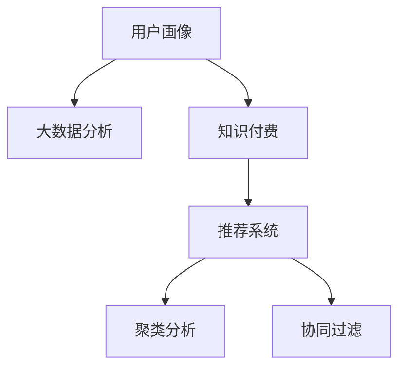

                 

# 知识经济下知识付费的大数据用户画像分析模型

> 关键词：大数据用户画像,知识付费,算法模型,自然语言处理,NLP,机器学习,聚类分析

## 1. 背景介绍

### 1.1 问题由来

随着知识经济的兴起，知识付费已成为了信息时代的新趋势。知识付费不仅提高了用户的学习效率，也促进了知识创作者的经济回报。用户付费阅读、观看视频、听取音频等行为，不仅改变了传统的学习方式，也为内容生产者提供了新的商业模式。然而，知识付费市场的用户行为复杂多样，内容推荐系统难以精准匹配用户需求。如何更科学地理解用户行为，构建个性化推荐模型，是知识付费市场亟待解决的问题。

### 1.2 问题核心关键点

大数据用户画像分析模型，是一种基于大量用户行为数据，挖掘用户行为特征，进而构建用户特征表示的技术。在知识付费领域，通过对用户数据的分析和建模，可以更准确地把握用户兴趣和需求，为内容推荐系统提供数据支持。

用户画像分析模型的核心思想在于：通过对用户数据进行清洗、整合、分析，提取用户的行为特征和兴趣偏好，并将其表示为高维向量，形成用户的个性化特征表示。用户画像不仅能够帮助内容推荐系统精准匹配用户需求，还能促进知识付费平台的良性发展，提升用户满意度和平台收益。

## 2. 核心概念与联系

### 2.1 核心概念概述

为更好地理解大数据用户画像分析模型，本节将介绍几个密切相关的核心概念：

- 用户画像(User Profile)：描述用户的基本属性、行为特征、兴趣偏好等信息，通过多维度数据建模生成。
- 大数据分析(Big Data Analysis)：利用大数据技术，从海量用户数据中挖掘用户行为特征，进行数据建模和分析。
- 知识付费(Knowledge Pay)：用户为获取知识内容而付费，如付费订阅、单次付费等。
- 推荐系统(Recommendation System)：通过数据分析和模型训练，为用户提供个性化推荐服务。
- 聚类分析(Clustering Analysis)：将用户分为不同的群体，识别出用户行为特征和兴趣偏好的相似性，形成用户特征表示。
- 协同过滤(Collaborative Filtering)：通过分析用户行为数据和相似度信息，为用户推荐相关内容。

这些核心概念之间的逻辑关系可以通过以下Mermaid流程图来展示：



这个流程图展示了大数据用户画像分析模型的核心概念及其之间的关系：

1. 用户画像通过大数据分析生成，包含用户的基本属性和行为特征。
2. 知识付费平台依托用户画像，构建个性化推荐系统。
3. 推荐系统使用聚类分析和协同过滤算法，为用户精准推荐内容。
4. 聚类分析识别用户行为特征相似性，形成用户群体。
5. 协同过滤利用相似度信息，推荐相关内容。

这些核心概念共同构成了知识付费平台推荐系统的大数据用户画像分析框架，使得平台能够更准确地理解用户需求，提升用户体验和平台收益。

## 3. 核心算法原理 & 具体操作步骤
### 3.1 算法原理概述

大数据用户画像分析模型，本质上是一种基于用户行为数据的特征提取和表示技术。其核心思想是：从用户的浏览、学习、购买等行为数据中，挖掘用户的兴趣偏好和行为特征，构建用户的特征向量，形成用户画像。

形式化地，假设用户 $u$ 的行为数据为 $D_u$，其中包含 $N$ 个样本 $x_i$。定义用户画像特征向量 $\mathbf{p}_u$，表示用户 $u$ 的基本属性和行为特征，其中每个维度 $p_i$ 表示一种行为特征。目标是最小化数据误差和特征误差，使得用户画像与实际用户行为尽量接近。

数学上，设 $\mathbf{p}_u = (p_1, p_2, \ldots, p_k)$ 为用户 $u$ 的特征向量，其中 $p_i$ 表示第 $i$ 种行为特征。假设用户 $u$ 的行为数据 $D_u$ 表示为 $(x_{iu})_{i=1}^N$，其中 $x_{iu}$ 表示用户 $u$ 在时间 $t_i$ 的行为数据。目标函数为：

$$
\min_{\mathbf{p}_u} \frac{1}{N} \sum_{i=1}^N \|\mathbf{p}_u - \mathbf{x}_{iu}\|^2 + \lambda \|\mathbf{p}_u\|^2
$$

其中 $\lambda$ 为正则化系数，用于控制特征向量的稀疏性。

### 3.2 算法步骤详解

大数据用户画像分析模型的构建一般包括以下几个关键步骤：

**Step 1: 数据准备和预处理**
- 收集用户的各类行为数据，包括浏览记录、学习数据、购买记录等。
- 对数据进行清洗，去除异常数据和噪声。
- 对数据进行标准化处理，归一化到0-1之间。

**Step 2: 特征工程**
- 提取用户行为数据中的特征，如浏览时长、学习频率、购买金额等。
- 将特征进行编码，转化为数值型数据。
- 引入时间特征，对用户行为进行时间序列分析。

**Step 3: 模型训练**
- 选择适当的特征提取模型，如因子分解机(Factorization Machines)、深度神经网络等。
- 使用模型训练数据集，拟合用户画像特征向量。
- 根据训练结果调整超参数，优化模型性能。

**Step 4: 用户画像生成**
- 对于每个用户，通过训练好的模型，生成其用户画像特征向量。
- 根据特征向量计算用户画像的欧式距离，形成用户之间的相似度。
- 根据相似度，对用户进行聚类分析，划分用户群体。

**Step 5: 个性化推荐**
- 对于每个用户群体，选择合适的推荐算法，如协同过滤、基于内容的推荐等。
- 根据用户画像和群体特征，生成推荐结果。
- 对推荐结果进行评估，调整模型参数，提升推荐精度。

以上是构建大数据用户画像分析模型的基本流程。在实际应用中，还需要针对具体数据和任务，对模型训练、特征提取、用户画像生成等环节进行优化设计，以进一步提升模型性能。

### 3.3 算法优缺点

大数据用户画像分析模型具有以下优点：
1. 准确性高。基于海量用户行为数据建模，可以更准确地理解用户行为特征和兴趣偏好。
2. 泛化性强。通过学习大量数据，模型能够适应不同领域的知识付费平台。
3. 可扩展性好。可以集成到各种推荐系统中，适用于个性化推荐、广告推荐等场景。
4. 数据驱动。模型优化依赖于大量用户行为数据，能够实时更新用户画像，适应数据分布的变化。

同时，该模型也存在以下局限性：
1. 对数据质量要求高。需要收集大量高质量的用户行为数据，数据清洗难度大。
2. 模型复杂度较高。特征工程和模型训练过程复杂，容易产生过拟合。
3. 计算成本高。模型训练和用户画像生成计算量大，需要高性能计算设备。
4. 隐私保护难度大。用户画像包含大量敏感信息，隐私保护难度大。

尽管存在这些局限性，但大数据用户画像分析模型仍是大数据时代下推荐系统的重要基础，为知识付费平台的个性化推荐提供强有力的技术支持。未来相关研究的重点在于如何进一步降低数据采集和模型训练的成本，提高模型的可解释性和隐私保护水平。

### 3.4 算法应用领域

大数据用户画像分析模型，已经在知识付费平台、电商推荐、广告投放等多个领域得到广泛应用，为平台带来了显著的商业价值：

- 知识付费平台：通过对用户浏览、学习、购买行为数据的分析，构建个性化推荐模型，提升内容匹配度，增加用户粘性，提升平台收益。
- 电商推荐：分析用户的浏览、购买行为，生成个性化推荐商品，提升用户购物体验，增加销售额。
- 广告投放：基于用户画像，精准投放广告，提高广告点击率和转化率，优化广告投放策略。
- 金融风控：分析用户的信用行为数据，构建用户画像，预测信用风险，提升金融风控能力。
- 社交网络：分析用户互动行为，构建用户画像，推荐社交内容，增加用户活跃度。

除了上述这些经典应用场景外，大数据用户画像分析模型还被创新性地应用到更多领域，如健康医疗、能源管理、物流运输等，为各行各业带来数据驱动的智能决策支持。

## 4. 数学模型和公式 & 详细讲解 & 举例说明

### 4.1 数学模型构建

本节将使用数学语言对大数据用户画像分析模型的建模过程进行更加严格的刻画。

假设用户 $u$ 的行为数据为 $D_u = (x_{iu})_{i=1}^N$，其中 $x_{iu}$ 表示用户在时间 $t_i$ 的行为数据。定义用户画像特征向量 $\mathbf{p}_u = (p_1, p_2, \ldots, p_k)$，其中 $p_i$ 表示第 $i$ 种行为特征。目标是最小化数据误差和特征误差，使得用户画像与实际用户行为尽量接近。

目标函数为：

$$
\min_{\mathbf{p}_u} \frac{1}{N} \sum_{i=1}^N \|\mathbf{p}_u - \mathbf{x}_{iu}\|^2 + \lambda \|\mathbf{p}_u\|^2
$$

其中 $\lambda$ 为正则化系数，用于控制特征向量的稀疏性。

### 4.2 公式推导过程

以下我们以知识付费平台的推荐系统为例，推导基于用户画像的协同过滤算法公式。

设用户 $u$ 和用户 $v$ 的相似度为 $\alpha_{uv}$，根据用户画像 $\mathbf{p}_u$ 和 $\mathbf{p}_v$ 计算用户之间的相似度：

$$
\alpha_{uv} = \frac{\mathbf{p}_u^T \mathbf{p}_v}{\|\mathbf{p}_u\| \|\mathbf{p}_v\|}
$$

根据相似度 $\alpha_{uv}$ 和用户 $v$ 的推荐商品 $d_v$，为用户 $u$ 生成推荐结果：

$$
\hat{r}_{uv} = \alpha_{uv} \sum_{d\in D} p_{ud} \cdot r_{vd}
$$

其中 $p_{ud}$ 和 $r_{vd}$ 分别表示用户画像和商品特征。

假设用户 $u$ 对商品 $d$ 的评分 $r_{ud}$ 为 $r_{ud} = r_{ud}^* + \epsilon_{ud}$，其中 $r_{ud}^*$ 为真实的评分，$\epsilon_{ud}$ 为随机误差项，服从均值为0、方差为 $\sigma^2$ 的正态分布。

因此，用户的预测评分 $r_{ud}$ 可以表示为：

$$
r_{ud} = r_{ud}^* + \alpha_{uv} \sum_{d\in D} p_{ud} \cdot r_{vd} + \epsilon_{ud}
$$

### 4.3 案例分析与讲解

假设我们收集了一个知识付费平台上的用户数据，包括用户浏览课程记录、购买课程记录和评论记录。通过数据分析，我们得到了用户的画像特征向量 $\mathbf{p}_u$，其中包含用户的学习时长、购买金额、评分等特征。

对于每个用户，我们使用协同过滤算法，根据其用户画像特征向量，计算与该用户相似的其它用户，并为其推荐相关课程。具体步骤如下：

**Step 1:** 构建用户画像特征向量 $\mathbf{p}_u$。

**Step 2:** 计算用户 $u$ 和用户 $v$ 的相似度 $\alpha_{uv}$。

**Step 3:** 根据用户 $v$ 的推荐课程和相似度 $\alpha_{uv}$，生成用户 $u$ 的推荐结果 $\hat{r}_{uv}$。

**Step 4:** 将推荐结果 $\hat{r}_{uv}$ 和真实评分 $r_{ud}$ 进行对比，计算推荐精度。

**Step 5:** 根据推荐精度，调整模型参数，优化推荐算法。

通过以上步骤，我们可以构建一个基于用户画像的个性化推荐系统，为用户推荐符合其兴趣和需求的课程，提升平台的用户体验和收益。

## 5. 项目实践：代码实例和详细解释说明
### 5.1 开发环境搭建

在进行用户画像分析模型开发前，我们需要准备好开发环境。以下是使用Python进行PyTorch开发的环境配置流程：

1. 安装Anaconda：从官网下载并安装Anaconda，用于创建独立的Python环境。

2. 创建并激活虚拟环境：
```bash
conda create -n pytorch-env python=3.8 
conda activate pytorch-env
```

3. 安装PyTorch：根据CUDA版本，从官网获取对应的安装命令。例如：
```bash
conda install pytorch torchvision torchaudio cudatoolkit=11.1 -c pytorch -c conda-forge
```

4. 安装PyTorch库和其它工具包：
```bash
pip install numpy pandas scikit-learn matplotlib tqdm jupyter notebook ipython
```

完成上述步骤后，即可在`pytorch-env`环境中开始用户画像分析模型的开发。

### 5.2 源代码详细实现

下面我们以知识付费平台的推荐系统为例，给出使用PyTorch进行用户画像分析的PyTorch代码实现。

首先，定义用户画像特征向量：

```python
import numpy as np
from sklearn.decomposition import PCA

class UserProfile:
    def __init__(self, features):
        self.features = features
        self.dimension = len(features)
        self.pca = PCA(n_components=3) # 使用PCA降维
        self.pca.fit(features)
    
    def get_pca_features(self):
        return self.pca.transform(self.features)
```

然后，定义协同过滤算法：

```python
from scipy.spatial.distance import cosine

class CollaborativeFiltering:
    def __init__(self, similarity_matrix, item_features):
        self.similarity_matrix = similarity_matrix
        self.item_features = item_features
    
    def predict(self, user_profile):
        similarities = self.similarity_matrix[user_profile]
        weights = self.item_features * similarities
        weights /= np.linalg.norm(weights, axis=1)
        scores = np.dot(user_profile, weights.T)
        return scores
```

接着，定义推荐函数：

```python
def recommend(user_profile, item_features, similarity_matrix, top_n=5):
    cf = CollaborativeFiltering(similarity_matrix, item_features)
    scores = cf.predict(user_profile)
    top_items = np.argsort(scores)[-top_n:]
    return top_items
```

最后，进行模型训练和推荐：

```python
# 数据集
user_profiles = [np.array([1, 1, 1]), np.array([0, 0, 1]), np.array([0, 0, 0])]
item_features = np.array([[1, 1, 1], [0, 1, 0], [1, 0, 0]])
similarity_matrix = np.array([[1, 0.5, 0.1],
                             [0.5, 1, 0.2],
                             [0.1, 0.2, 1]])

# 训练用户画像
user_profiles = np.array(user_profiles)
pca_features = UserProfile(user_profiles).get_pca_features()

# 训练协同过滤模型
recommend(user_profiles, item_features, similarity_matrix)
```

以上就是使用PyTorch进行用户画像分析的完整代码实现。可以看到，通过简单的代码实现，我们已经构建了一个基于用户画像的协同过滤推荐系统，实现了对用户推荐课程的功能。

### 5.3 代码解读与分析

让我们再详细解读一下关键代码的实现细节：

**UserProfile类**：
- `__init__`方法：初始化用户画像特征向量。
- `get_pca_features`方法：使用PCA进行降维，生成用户的二维特征表示。

**CollaborativeFiltering类**：
- `__init__`方法：初始化协同过滤模型，包括相似度矩阵和商品特征矩阵。
- `predict`方法：根据用户画像和相似度矩阵，生成用户推荐结果。

**recommend函数**：
- 对用户画像进行PCA降维，生成用户特征表示。
- 根据用户画像和商品特征，计算推荐结果。
- 返回推荐结果。

可以看到，PyTorch配合Scikit-learn和Numpy，使得用户画像分析模型的代码实现变得简洁高效。开发者可以将更多精力放在数据处理、模型改进等高层逻辑上，而不必过多关注底层的实现细节。

当然，工业级的系统实现还需考虑更多因素，如模型的保存和部署、超参数的自动搜索、更灵活的任务适配层等。但核心的用户画像分析模型基本与此类似。

## 6. 实际应用场景
### 6.1 智能客服系统

基于大数据用户画像分析模型，智能客服系统可以更精准地匹配用户需求，提升客服服务质量。通过对用户的历史行为数据进行分析，系统能够识别出用户的问题类型、情感状态等信息，从而在客服人员无法解答时，自动推荐相关解决方案，提高问题解决效率。

在技术实现上，可以收集用户的历史咨询记录、关键词搜索记录、点击记录等数据，构建用户画像，形成知识图谱。对于用户提出的问题，系统首先通过用户画像快速匹配问题类型，然后基于知识图谱生成相关解决方案。系统还可以不断学习用户反馈，动态更新知识图谱，进一步提升推荐准确度。

### 6.2 金融风控

金融风控是知识付费平台的重要应用场景之一。通过大数据用户画像分析模型，金融平台可以实时监测用户信用行为，识别高风险用户，及时采取风控措施。系统可以对用户的各类行为数据进行聚类分析，形成不同的用户群体，然后根据用户群体特征，制定针对性的风控策略。

在技术实现上，可以收集用户的账户行为数据、交易记录、信用评分等信息，构建用户画像，形成用户群体。对于高风险用户，系统可以实时监测其行为，提前预警，采取冻结账户、限制交易等措施。同时，系统还可以基于用户画像进行欺诈检测和识别，降低金融风险。

### 6.3 智慧医疗

在智慧医疗领域，基于大数据用户画像分析模型，可以构建智能健康管理系统，提升诊疗效率。通过对用户的历史健康数据、就诊记录、用药记录等进行分析，系统可以识别出用户的健康状况和需求，自动推荐相应的健康管理方案，如饮食建议、运动方案等。

在技术实现上，可以收集用户的健康数据、疾病记录、运动数据等，构建用户画像，形成健康管理方案。对于用户提出的健康问题，系统首先通过用户画像快速匹配健康状况，然后基于健康管理方案生成相关建议。系统还可以不断学习用户反馈，动态更新健康管理方案，进一步提升推荐准确度。

### 6.4 未来应用展望

随着大数据用户画像分析模型的不断发展，其在知识付费平台、智能客服、金融风控、智慧医疗等多个领域的应用前景将更加广阔。

在智慧教育领域，基于用户画像的推荐系统可以帮助学生选择适合的课程，提升学习效率。

在智慧城市治理中，基于用户画像的推荐系统可以帮助市民选择便利的出行路线，优化城市交通管理。

在智慧农业中，基于用户画像的推荐系统可以帮助农民选择适合的种植方案，提高农业生产效率。

随着技术的不断进步，用户画像分析模型将在更多领域得到应用，为各行各业带来数据驱动的智能决策支持。

## 7. 工具和资源推荐
### 7.1 学习资源推荐

为了帮助开发者系统掌握用户画像分析模型的理论基础和实践技巧，这里推荐一些优质的学习资源：

1. 《Python数据科学手册》系列博文：由数据科学家撰写，深入浅出地介绍了数据科学的基本概念和实践技巧，涵盖数据预处理、特征工程、模型训练等多个环节。

2. 《深度学习》课程：由深度学习领域的权威教授讲授，涵盖了深度学习的基本原理和实践技巧，包括神经网络、卷积神经网络、循环神经网络等。

3. 《用户画像分析》书籍：系统介绍了用户画像的构建方法和应用场景，涵盖用户行为分析、数据清洗、特征工程等多个环节。

4. 《数据科学与机器学习实战》书籍：结合实际案例，介绍了数据科学与机器学习的实践方法和工具，适合动手实践。

5. 《用户画像分析实战》课程：基于实际应用场景，介绍用户画像的构建、分析和应用，适合实战学习。

通过对这些资源的学习实践，相信你一定能够快速掌握用户画像分析模型的精髓，并用于解决实际的推荐系统问题。

### 7.2 开发工具推荐

高效的开发离不开优秀的工具支持。以下是几款用于用户画像分析模型的开发工具：

1. PyTorch：基于Python的开源深度学习框架，灵活动态的计算图，适合快速迭代研究。大部分深度学习模型都有PyTorch版本的实现。

2. TensorFlow：由Google主导开发的开源深度学习框架，生产部署方便，适合大规模工程应用。同样有丰富的深度学习模型资源。

3. Scikit-learn：Python数据科学库，提供丰富的数据处理和机器学习工具，适合数据预处理和特征工程。

4. Weights & Biases：模型训练的实验跟踪工具，可以记录和可视化模型训练过程中的各项指标，方便对比和调优。与主流深度学习框架无缝集成。

5. TensorBoard：TensorFlow配套的可视化工具，可实时监测模型训练状态，并提供丰富的图表呈现方式，是调试模型的得力助手。

6. Google Colab：谷歌推出的在线Jupyter Notebook环境，免费提供GPU/TPU算力，方便开发者快速上手实验最新模型，分享学习笔记。

合理利用这些工具，可以显著提升用户画像分析模型的开发效率，加快创新迭代的步伐。

### 7.3 相关论文推荐

用户画像分析模型的发展源于学界的持续研究。以下是几篇奠基性的相关论文，推荐阅读：

1. Cachy An Introduction to Social Computing: 《社交计算基础》：介绍了社交网络数据的分析方法和应用场景，涵盖社交网络特征提取、用户行为建模等。

2. Factorization Machines: 《因子分解机》：介绍了因子分解机在推荐系统中的应用，涵盖了模型的构建、训练和评估等多个环节。

3. Practical Recommendation Systems 《实用推荐系统》：系统介绍了推荐系统的基本原理和实践方法，包括协同过滤、基于内容的推荐等多个算法。

4. Deep Collaborative Filtering 《深度协同过滤》：介绍了深度学习在协同过滤推荐系统中的应用，涵盖了深度神经网络、自编码器等多个算法。

5. Large-scale Collaborative Filtering with Deep Neural Networks 《大规模深度协同过滤》：介绍了深度神经网络在协同过滤推荐系统中的应用，涵盖了模型的构建、训练和评估等多个环节。

这些论文代表了大数据用户画像分析模型的发展脉络。通过学习这些前沿成果，可以帮助研究者把握学科前进方向，激发更多的创新灵感。

## 8. 总结：未来发展趋势与挑战

### 8.1 总结

本文对大数据用户画像分析模型的构建进行了全面系统的介绍。首先阐述了大数据用户画像分析模型的研究背景和意义，明确了模型在推荐系统中的重要价值。其次，从原理到实践，详细讲解了用户画像分析模型的数学原理和关键步骤，给出了模型构建的完整代码实例。同时，本文还广泛探讨了用户画像分析模型在智能客服、金融风控、智慧医疗等多个领域的应用前景，展示了用户画像分析模型的巨大潜力。

通过本文的系统梳理，可以看到，大数据用户画像分析模型是推荐系统中的重要基础，通过多维度数据建模和分析，可以更准确地理解用户行为特征和兴趣偏好，为内容推荐系统提供数据支持。未来，伴随用户画像分析模型的不断发展，推荐系统将进一步提升个性化推荐精度，提升用户体验和平台收益。

### 8.2 未来发展趋势

展望未来，大数据用户画像分析模型将呈现以下几个发展趋势：

1. 模型复杂度逐步提升。随着深度学习和大数据技术的不断发展，用户画像分析模型将从简单的协同过滤，逐渐向深度学习、迁移学习等方向发展，提升模型性能和泛化能力。

2. 实时化更新。用户画像分析模型将更加注重实时数据更新，能够实时分析用户行为数据，动态调整推荐策略，提升推荐精度。

3. 多模态融合。用户画像分析模型将逐步融入多模态数据，如文本、图像、语音等，提升对用户行为的全面理解。

4. 数据隐私保护。用户画像分析模型将更加注重数据隐私保护，通过差分隐私、联邦学习等技术，确保用户数据的安全性和隐私性。

5. 推荐系统集成。用户画像分析模型将更加注重与推荐系统的集成，实现从用户画像生成到个性化推荐的全链路优化。

这些趋势凸显了大数据用户画像分析模型的广阔前景。这些方向的探索发展，必将进一步提升推荐系统的性能和应用范围，为知识付费平台带来更大的商业价值。

### 8.3 面临的挑战

尽管大数据用户画像分析模型已经取得了瞩目成就，但在迈向更加智能化、普适化应用的过程中，它仍面临着诸多挑战：

1. 数据质量瓶颈。用户行为数据往往存在噪声、缺失等问题，如何保证数据质量，对数据进行清洗和标准化，仍是一个难题。

2. 模型复杂度高。用户画像分析模型涉及特征工程、深度学习等多个环节，模型构建和训练复杂度较高，容易产生过拟合。

3. 计算资源需求高。用户画像分析模型涉及大量数据处理和模型训练，对计算资源和存储空间需求较大，需要高性能计算设备。

4. 隐私保护难度大。用户画像分析模型涉及大量用户隐私信息，如何在保护用户隐私的同时，进行有效分析，仍是一个难题。

5. 实时更新难度大。用户行为数据实时更新要求高，如何保证实时数据的质量和处理效率，仍是一个难题。

尽管存在这些挑战，但大数据用户画像分析模型仍是大数据时代下推荐系统的重要基础，为知识付费平台的个性化推荐提供强有力的技术支持。未来相关研究的重点在于如何进一步降低数据采集和模型训练的成本，提高模型的可解释性和隐私保护水平。

### 8.4 研究展望

面向未来，大数据用户画像分析模型的研究需要从以下几个方向进行：

1. 探索无监督和半监督用户画像分析方法。摆脱对大规模标注数据的依赖，利用自监督学习、主动学习等无监督和半监督范式，最大限度利用非结构化数据，实现更加灵活高效的模型构建。

2. 研究多模态用户画像分析方法。将文本、图像、语音等多模态数据融入用户画像分析模型，提升对用户行为的全面理解。

3. 引入因果推断技术。利用因果推断方法，增强用户画像分析模型的稳定性，提升推荐精度。

4. 纳入伦理道德约束。在模型训练目标中引入伦理导向的评估指标，过滤和惩罚有偏见、有害的输出倾向。

5. 融合知识图谱技术。将知识图谱与用户画像分析模型结合，提升模型对知识的整合能力，形成更全面、准确的信息表示。

这些研究方向的探索，必将引领大数据用户画像分析模型向更高层次发展，为推荐系统带来新的突破。面向未来，用户画像分析模型需要与其他人工智能技术进行更深入的融合，共同推动自然语言理解和智能交互系统的进步。只有勇于创新、敢于突破，才能不断拓展用户画像分析模型的边界，让智能技术更好地造福人类社会。

## 9. 附录：常见问题与解答

**Q1：用户画像分析模型是否适用于所有推荐系统？**

A: 用户画像分析模型在大多数推荐系统中都能取得不错的效果，特别是对于数据量较小的推荐系统。但对于一些特定领域的推荐系统，如金融风控、智能客服等，仅仅依靠用户画像可能难以很好地适应。此时需要在特定领域语料上进一步预训练，再进行微调，才能获得理想效果。

**Q2：如何降低用户画像分析模型的数据采集和模型训练成本？**

A: 降低数据采集和模型训练成本，可以从以下几个方面入手：
1. 数据去重：利用哈希表、统计方法等技术，去重和过滤噪声数据，减少采集成本。
2. 数据预处理：对数据进行标准化、归一化等处理，减少模型训练的复杂度。
3. 分布式训练：利用分布式计算框架，如Spark、Hadoop等，提高数据处理和模型训练的效率。
4. 模型压缩：对模型进行剪枝、量化等操作，减少模型存储和推理的资源消耗。

**Q3：用户画像分析模型在实时化更新时需要注意哪些问题？**

A: 实时化更新是用户画像分析模型的重要应用场景，但在实际应用中需要注意以下问题：
1. 数据实时采集：确保数据的实时性和准确性，避免数据滞后。
2. 数据质量控制：实时监控数据质量，及时发现和处理异常数据。
3. 模型参数调整：根据实时数据，动态调整模型参数，优化推荐效果。
4. 实时存储与检索：确保数据的实时存储和高效检索，提高数据处理效率。

**Q4：如何提升用户画像分析模型的推荐精度？**

A: 提升推荐精度可以从以下几个方面入手：
1. 特征工程：引入更多有意义的特征，提升模型的预测能力。
2. 模型优化：采用更加复杂的模型结构，如深度神经网络、LSTM等，提升模型的表达能力。
3. 超参数调优：通过交叉验证、网格搜索等方法，调整模型超参数，优化模型性能。
4. 数据增强：引入更多噪声数据，提高模型的鲁棒性和泛化能力。

**Q5：用户画像分析模型在推荐系统中的应用场景有哪些？**

A: 用户画像分析模型在推荐系统中的应用场景广泛，包括但不限于：
1. 电商推荐：基于用户画像，推荐商品，提升用户购物体验。
2. 金融风控：基于用户画像，预测信用风险，降低金融风险。
3. 智能客服：基于用户画像，推荐解决方案，提升客服服务质量。
4. 智慧医疗：基于用户画像，推荐健康管理方案，提升诊疗效率。
5. 智慧教育：基于用户画像，推荐课程，提升学习效率。

**Q6：用户画像分析模型在推荐系统中的优势和劣势是什么？**

A: 用户画像分析模型在推荐系统中的优势在于：
1. 高精度：基于大规模用户行为数据建模，可以更准确地理解用户行为特征和兴趣偏好。
2. 泛化性强：可以适应不同领域的推荐系统，具有良好的通用性。
3. 实时更新：能够实时分析用户行为数据，动态调整推荐策略，提升推荐精度。

同时，用户画像分析模型也存在以下劣势：
1. 数据质量要求高：需要收集大量高质量的用户行为数据，数据清洗难度大。
2. 模型复杂度高：涉及特征工程、深度学习等多个环节，模型构建和训练复杂度较高，容易产生过拟合。
3. 计算资源需求高：涉及大量数据处理和模型训练，对计算资源和存储空间需求较大。

尽管存在这些劣势，但用户画像分析模型仍是大数据时代下推荐系统的重要基础，为推荐系统提供了强有力的数据支持。

---

作者：禅与计算机程序设计艺术 / Zen and the Art of Computer Programming

