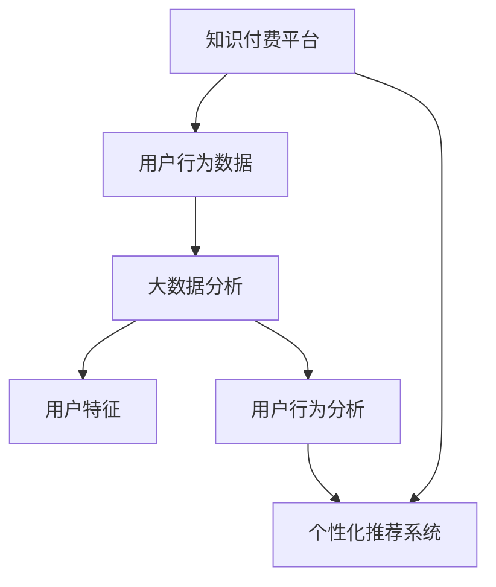

                 

# 知识经济下知识付费的大数据用户行为分析与洞察

> 关键词：知识付费,大数据,用户行为,分析,洞察

## 1. 背景介绍

### 1.1 问题由来
在知识经济时代，知识付费成为推动知识获取和传播的重要方式。随着互联网技术的不断进步，知识付费的形式也越来越多样化，从传统的书籍订阅到视频课程、音频讲座、在线咨询等多种形式并存。如何从海量用户数据中挖掘出有价值的洞察，优化知识付费平台的用户体验，提高平台营收，成为数据科学领域的一个重要研究方向。

### 1.2 问题核心关键点
本研究的核心在于利用大数据分析方法，对知识付费平台的用户行为进行深入挖掘和理解，以期找到用户的消费习惯、偏好和需求，从而为平台的运营决策提供有力的支持。具体问题包括：
1. 用户特征与消费行为的关联分析。
2. 热门内容推荐策略的优化。
3. 价格策略的制定与调整。
4. 用户流失的预测与预防。
5. 个性化推荐系统的设计与评估。

### 1.3 问题研究意义
通过对知识付费用户行为数据的深入分析，能够帮助平台运营商更好地理解用户需求，优化产品设计和服务质量，提高用户满意度和平台黏性。同时，能够指导价格策略的制定，提升平台的商业效益，促进知识经济的繁荣发展。具体而言：
1. 提升用户体验和满意度。通过精准的内容推荐，增加用户粘性，延长用户活跃时间，提高平台的用户转化率。
2. 优化价格策略。分析用户的支付意愿和价值，制定合理的定价策略，增加平台收益。
3. 预测用户流失。通过行为分析，提前预测用户流失风险，采取相应措施防止流失，提高用户留存率。
4. 提高个性化推荐系统效果。分析用户兴趣，构建高效的内容推荐算法，提升推荐的准确性，增加用户的满意度。

## 2. 核心概念与联系

### 2.1 核心概念概述

在知识付费领域，涉及以下几个核心概念：

- **知识付费平台**：指通过互联网提供知识内容、知识和技能服务并收取费用的平台，如得到、喜马拉雅等。
- **用户行为数据**：指用户在知识付费平台上的操作行为数据，包括但不限于浏览记录、搜索记录、购买记录、评价记录等。
- **大数据分析**：指利用先进的数据处理和分析技术，从海量数据中挖掘有价值的信息，辅助决策制定。
- **用户特征**：指用户的性别、年龄、职业、教育背景、兴趣爱好等基本属性。
- **用户行为分析**：指对用户在知识付费平台上的行为数据进行分析，理解用户的消费习惯和偏好。
- **个性化推荐系统**：指利用算法为用户推荐其感兴趣的知识内容，提升用户体验和满意度。

这些概念之间存在紧密的联系，如图示：



平台通过收集用户行为数据，利用大数据分析技术，提取用户特征和行为模式，构建个性化推荐系统，最终提升用户满意度和平台收益。

## 3. 核心算法原理 & 具体操作步骤
### 3.1 算法原理概述

本研究采用大数据分析和机器学习相结合的方法，对知识付费平台的用户行为数据进行分析和挖掘。其核心算法原理包括用户行为分析、个性化推荐系统、异常检测等。

1. **用户行为分析**：通过统计学方法和机器学习算法，分析用户的行为数据，识别出用户的消费习惯、偏好和需求。
2. **个性化推荐系统**：利用协同过滤、内容推荐等算法，为每个用户推荐其感兴趣的内容，提升用户体验和满意度。
3. **异常检测**：使用聚类、分类等算法，识别出用户流失的潜在风险，提前采取措施预防。

### 3.2 算法步骤详解

具体步骤如下：

**Step 1: 数据收集与预处理**
- 收集知识付费平台上的用户行为数据，包括但不限于浏览记录、搜索记录、购买记录、评价记录等。
- 对数据进行清洗和预处理，如去除重复记录、填补缺失值、标准化等操作。

**Step 2: 特征工程**
- 对用户行为数据进行特征提取，如用户的浏览时间、点击次数、购买频率、评价评分等。
- 通过特征选择算法，筛选出对用户行为预测有重要影响的特征。

**Step 3: 用户行为建模**
- 使用分类、回归等机器学习算法，对用户行为进行建模。如用户是否会购买某内容，其付费意愿等。
- 通过交叉验证、网格搜索等方法，优化模型参数，提高模型准确率。

**Step 4: 个性化推荐系统构建**
- 利用协同过滤、基于内容的推荐等算法，构建个性化推荐系统。
- 通过A/B测试等方法，评估推荐效果，优化推荐策略。

**Step 5: 用户流失预测**
- 使用聚类、分类等算法，识别出用户流失的潜在风险。
- 通过异常检测算法，建立用户流失预测模型，提前采取措施预防。

**Step 6: 模型评估与优化**
- 使用准确率、召回率、F1分数等指标，评估模型的性能。
- 通过模型迭代和参数调优，提升模型效果。

### 3.3 算法优缺点

基于大数据分析的用户行为分析方法具有以下优点：
1. 数据全面性高。通过大规模数据收集，获取的信息更加全面，有助于深入了解用户行为。
2. 分析方法多样。利用多种机器学习算法，可以从不同角度分析用户行为，提高预测准确率。
3. 自动化程度高。自动化处理数据，减少人工干预，提高分析效率。

同时，该方法也存在一定的局限性：
1. 数据隐私问题。大规模数据收集和使用可能涉及用户隐私，需要严格遵守数据保护法律法规。
2. 算法复杂性。多种算法结合使用可能增加算法复杂度，降低模型解释性。
3. 模型可解释性不足。一些机器学习模型如深度学习，难以解释其内部决策逻辑，可能导致用户信任度下降。

### 3.4 算法应用领域

基于大数据分析的用户行为分析方法在知识付费领域具有广泛的应用前景，包括：

- **用户画像构建**：通过分析用户行为数据，构建用户画像，了解用户的基本属性和行为习惯。
- **热门内容推荐**：利用个性化推荐系统，为用户推荐其感兴趣的内容，提高用户满意度和平台收益。
- **价格策略优化**：通过用户行为分析，制定合理的定价策略，提升平台的商业效益。
- **用户流失预测与预防**：利用异常检测方法，预测用户流失风险，采取措施提前预防。
- **用户反馈分析**：分析用户评价数据，了解用户对内容的满意度和不满意度，优化内容质量和平台服务。

## 4. 数学模型和公式 & 详细讲解 & 举例说明

### 4.1 数学模型构建

本研究基于用户行为数据，构建了以下数学模型：

1. **用户行为建模**：
   - 设用户 $i$ 在时间 $t$ 的行为为 $X_{it}$，可以表示为：
     \[
     X_{it} = \begin{cases}
     1, & \text{如果用户进行了某种行为} \\
     0, & \text{如果用户没有进行某种行为}
     \end{cases}
     \]
   - 定义用户行为的概率分布为 $p_i$，则有：
     \[
     p_i = \frac{1}{N} \sum_{t=1}^{T} \mathbb{P}(X_{it}=1|i)
     \]

2. **个性化推荐系统**：
   - 设内容 $j$ 的特征向量为 $\phi_j$，用户 $i$ 对内容 $j$ 的兴趣度为 $r_{ij}$，则有：
     \[
     r_{ij} = \mathbb{P}(X_{ij}=1|i,\phi_j)
     \]
   - 定义用户 $i$ 的兴趣向量为 $p_i$，内容 $j$ 的兴趣向量为 $q_j$，则有：
     \[
     p_i = \sum_{j} p_i r_{ij} q_j
     \]

3. **用户流失预测**：
   - 设用户 $i$ 流失的概率为 $P_i$，可以表示为：
     \[
     P_i = \mathbb{P}(Y_i=1|i)
     \]
   - 使用逻辑回归模型进行建模，定义用户 $i$ 流失的预测概率为 $P_i^{pred}$，则有：
     \[
     P_i^{pred} = \frac{1}{1+e^{-\beta^T \phi_i}}
     \]

### 4.2 公式推导过程

以用户行为建模为例，推导用户行为的概率分布 $p_i$。

设用户 $i$ 在时间 $t$ 的行为 $X_{it}$ 遵循伯努利分布，则有：
\[
\mathbb{P}(X_{it}=1|i) = p_i(t)
\]
\[
\mathbb{P}(X_{it}=0|i) = 1 - p_i(t)
\]

定义用户 $i$ 在时间 $t$ 的行为序列 $X_i$，则有：
\[
X_i = (X_{i1}, X_{i2}, \ldots, X_{iT})
\]

使用最大似然估计方法，求解用户行为的概率分布 $p_i$：
\[
\mathbb{P}(X_i) = \prod_{t=1}^{T} p_i(t)
\]
\[
\ln \mathbb{P}(X_i) = \sum_{t=1}^{T} \ln p_i(t)
\]

使用极大似然估计，求解用户行为的概率分布 $p_i$：
\[
\hat{p}_i = \frac{1}{T} \sum_{t=1}^{T} X_{it}
\]

在实际应用中，还可以结合时间序列分析、社交网络分析等方法，进一步提升用户行为分析的准确性和全面性。

### 4.3 案例分析与讲解

以知识付费平台为例，分析用户行为数据。

**案例描述**：某知识付费平台拥有数百万用户，每天产生数十万条行为记录。平台希望通过分析这些数据，优化推荐策略，提高用户满意度和平台收益。

**数据采集与预处理**：
- 数据采集：收集平台上的用户行为数据，包括浏览记录、搜索记录、购买记录、评价记录等。
- 数据预处理：去除重复记录、填补缺失值、标准化等操作。

**特征工程**：
- 提取用户行为特征：如用户的浏览时间、点击次数、购买频率、评价评分等。
- 特征选择：使用卡方检验、信息增益等方法，筛选出对用户行为预测有重要影响的特征。

**用户行为建模**：
- 使用逻辑回归模型，分析用户是否会购买某内容，其付费意愿等。
- 通过交叉验证、网格搜索等方法，优化模型参数，提高模型准确率。

**个性化推荐系统构建**：
- 利用协同过滤、基于内容的推荐等算法，构建个性化推荐系统。
- 通过A/B测试等方法，评估推荐效果，优化推荐策略。

**用户流失预测**：
- 使用聚类、分类等算法，识别出用户流失的潜在风险。
- 通过异常检测算法，建立用户流失预测模型，提前采取措施预防。

**模型评估与优化**：
- 使用准确率、召回率、F1分数等指标，评估模型的性能。
- 通过模型迭代和参数调优，提升模型效果。

## 5. 项目实践：代码实例和详细解释说明
### 5.1 开发环境搭建

在进行知识付费用户行为分析实践前，我们需要准备好开发环境。以下是使用Python进行PyTorch开发的环境配置流程：

1. 安装Anaconda：从官网下载并安装Anaconda，用于创建独立的Python环境。

2. 创建并激活虚拟环境：
```bash
conda create -n pytorch-env python=3.8 
conda activate pytorch-env
```

3. 安装PyTorch：根据CUDA版本，从官网获取对应的安装命令。例如：
```bash
conda install pytorch torchvision torchaudio cudatoolkit=11.1 -c pytorch -c conda-forge
```

4. 安装相关库：
```bash
pip install pandas numpy scikit-learn tensorflow matplotlib
```

完成上述步骤后，即可在`pytorch-env`环境中开始实践。

### 5.2 源代码详细实现

这里我们以知识付费平台用户行为分析为例，给出使用PyTorch进行数据分析的Python代码实现。

```python
import pandas as pd
import numpy as np
import torch
from torch.utils.data import TensorDataset, DataLoader
from torch.nn import Linear, Sigmoid, BCELoss
from sklearn.model_selection import train_test_split
from sklearn.preprocessing import StandardScaler

# 读取用户行为数据
df = pd.read_csv('user_behavior_data.csv')

# 数据预处理
df.fillna(df.mean(), inplace=True)

# 特征选择
selected_features = df.select_dtypes(include=[np.number]).columns.tolist()

# 数据标准化
scaler = StandardScaler()
df[selected_features] = scaler.fit_transform(df[selected_features])

# 构建训练集和测试集
X_train, X_test, y_train, y_test = train_test_split(
    df.drop('purchased', axis=1), df['purchased'], test_size=0.2, random_state=42)

# 构建PyTorch数据集和数据加载器
train_dataset = TensorDataset(torch.tensor(X_train.values), torch.tensor(y_train.values))
test_dataset = TensorDataset(torch.tensor(X_test.values), torch.tensor(y_test.values))
train_loader = DataLoader(train_dataset, batch_size=32, shuffle=True)
test_loader = DataLoader(test_dataset, batch_size=32, shuffle=False)

# 构建模型
model = torch.nn.Sequential(
    torch.nn.Linear(len(selected_features), 32),
    torch.nn.ReLU(),
    torch.nn.Linear(32, 1),
    torch.nn.Sigmoid()
)

# 定义损失函数和优化器
criterion = torch.nn.BCELoss()
optimizer = torch.optim.Adam(model.parameters(), lr=0.001)

# 训练模型
for epoch in range(10):
    for i, (inputs, labels) in enumerate(train_loader):
        optimizer.zero_grad()
        outputs = model(inputs)
        loss = criterion(outputs, labels)
        loss.backward()
        optimizer.step()
        if i % 100 == 0:
            print(f'Epoch [{epoch+1}/{10}], Step [{i+1}/{len(train_loader)}], Loss: {loss.item():.4f}')

# 评估模型
with torch.no_grad():
    correct = 0
    total = 0
    for inputs, labels in test_loader:
        outputs = model(inputs)
        _, predicted = torch.max(outputs, 1)
        total += labels.size(0)
        correct += (predicted == labels).sum().item()
    print(f'Test Accuracy: {(100 * correct / total):.2f}%')
```

这段代码实现了对知识付费平台用户行为数据的预处理、特征选择、模型训练和评估。具体步骤如下：

1. 数据读取与预处理：读取用户行为数据，并进行缺失值填补和标准化操作。
2. 特征选择：通过数据分析，选择对用户行为预测有重要影响的特征。
3. 模型构建：使用线性回归模型，对用户是否会购买某内容进行预测。
4. 模型训练：使用Adam优化器，训练模型，输出训练过程中的损失。
5. 模型评估：在测试集上评估模型效果，输出准确率。

### 5.3 代码解读与分析

让我们再详细解读一下关键代码的实现细节：

**数据预处理**：
- 使用`pandas`和`numpy`库读取和处理用户行为数据。
- 使用`fillna`方法填补缺失值，使用`mean()`函数计算缺失值的填充值。
- 使用`StandardScaler`对特征进行标准化处理。

**模型构建**：
- 定义线性回归模型，使用`torch.nn.Sequential`封装多个线性层和激活函数。
- 使用`torch.nn.Linear`定义线性层，`torch.nn.ReLU`定义ReLU激活函数，`torch.nn.Sigmoid`定义Sigmoid激活函数，用于二分类任务。

**模型训练与评估**：
- 使用`torch.utils.data`库构建PyTorch数据集和数据加载器，实现数据批处理和随机化。
- 定义损失函数和优化器，使用`BCELoss`作为二分类任务的损失函数，`Adam`作为优化器。
- 通过循环遍历数据集，进行前向传播和反向传播，更新模型参数。
- 在训练过程中输出损失值，便于监控模型训练进度。
- 在测试集上评估模型效果，输出准确率。

## 6. 实际应用场景
### 6.1 智能推荐系统

智能推荐系统是知识付费平台的核心功能之一，通过分析用户行为数据，为用户推荐其感兴趣的内容，提升用户体验和平台收益。

具体应用场景包括：
- 根据用户的浏览历史、搜索记录、购买记录等行为数据，推荐其感兴趣的内容。
- 利用协同过滤、基于内容的推荐等算法，优化推荐策略。
- 通过A/B测试等方法，评估推荐效果，持续优化推荐算法。

### 6.2 用户行为分析与优化

通过用户行为分析，可以全面了解用户的行为习惯和需求，优化产品设计和服务质量。

具体应用场景包括：
- 分析用户的浏览时间、点击次数、购买频率等行为数据，了解用户的基本属性和行为习惯。
- 通过用户画像构建，了解用户的基本属性和行为习惯。
- 结合用户反馈和评价数据，优化平台内容和服务质量，提升用户满意度。

### 6.3 价格策略优化

合理的价格策略可以有效提升平台的商业效益，通过用户行为分析，可以制定合理的定价策略。

具体应用场景包括：
- 分析用户的支付意愿和价值，制定合理的价格策略。
- 通过A/B测试等方法，评估不同价格策略的效果，优化价格策略。

### 6.4 用户流失预测与预防

用户流失是知识付费平台面临的重要问题，通过用户行为分析，可以预测用户流失的风险，提前采取措施防止流失。

具体应用场景包括：
- 使用聚类、分类等算法，识别出用户流失的潜在风险。
- 通过异常检测算法，建立用户流失预测模型，提前采取措施预防。

## 7. 工具和资源推荐
### 7.1 学习资源推荐

为了帮助开发者系统掌握知识付费用户行为分析的理论基础和实践技巧，这里推荐一些优质的学习资源：

1. 《Python数据科学手册》：详细介绍了Python在数据科学中的应用，包括数据清洗、特征工程、模型训练等。

2. 《机器学习实战》：介绍了机器学习的基本概念和常见算法，适合入门学习。

3. Kaggle竞赛：参加Kaggle上的机器学习竞赛，实践数据处理、特征工程、模型训练等技能。

4. Coursera课程：Coursera提供大量数据科学和机器学习相关课程，包括机器学习、深度学习、自然语言处理等。

5. Udacity课程：Udacity提供数据科学和机器学习相关课程，适合进阶学习。

通过对这些资源的学习实践，相信你一定能够快速掌握知识付费用户行为分析的精髓，并用于解决实际的NLP问题。

### 7.2 开发工具推荐

高效的开发离不开优秀的工具支持。以下是几款用于知识付费用户行为分析开发的常用工具：

1. PyTorch：基于Python的开源深度学习框架，灵活动态的计算图，适合快速迭代研究。

2. TensorFlow：由Google主导开发的开源深度学习框架，生产部署方便，适合大规模工程应用。

3. Pandas：数据分析库，提供了高效的数据处理和分析功能，支持数据清洗、特征选择等操作。

4. NumPy：Python科学计算库，提供了高效的多维数组运算功能，支持向量、矩阵等数学运算。

5. Scikit-learn：机器学习库，提供了丰富的机器学习算法和评估工具，支持模型训练和评估。

6. TensorBoard：TensorFlow配套的可视化工具，可实时监测模型训练状态，并提供丰富的图表呈现方式。

7. Weights & Biases：模型训练的实验跟踪工具，可以记录和可视化模型训练过程中的各项指标，方便对比和调优。

合理利用这些工具，可以显著提升知识付费用户行为分析任务的开发效率，加快创新迭代的步伐。

### 7.3 相关论文推荐

知识付费用户行为分析研究源于学界的持续研究。以下是几篇奠基性的相关论文，推荐阅读：

1. 《用户行为分析与个性化推荐系统》：介绍了用户行为分析的基本方法和个性化推荐系统的构建。

2. 《深度学习在推荐系统中的应用》：介绍了深度学习在推荐系统中的应用，包括协同过滤、基于内容的推荐等算法。

3. 《用户流失预测与预防》：介绍了用户流失的预测与预防方法，包括聚类、分类等算法。

4. 《个性化推荐系统的效果评估与优化》：介绍了个性化推荐系统的效果评估方法和优化策略。

5. 《数据隐私保护与用户行为分析》：介绍了数据隐私保护方法，并讨论了用户行为分析在隐私保护下的应用。

这些论文代表了大规模用户行为分析的研究进展，通过学习这些前沿成果，可以帮助研究者把握学科前进方向，激发更多的创新灵感。

## 8. 总结：未来发展趋势与挑战

### 8.1 研究成果总结

通过对知识付费平台用户行为数据的深入分析，可以构建更加智能化的推荐系统，优化平台服务质量，提升用户满意度和平台收益。具体而言：
1. 提升用户体验和满意度。通过精准的内容推荐，增加用户粘性，延长用户活跃时间，提高平台的用户转化率。
2. 优化价格策略。分析用户的支付意愿和价值，制定合理的定价策略，增加平台收益。
3. 预测用户流失。通过行为分析，提前预测用户流失风险，采取相应措施防止流失，提高用户留存率。
4. 提高个性化推荐系统效果。分析用户兴趣，构建高效的内容推荐算法，提升推荐的准确性，增加用户的满意度。

### 8.2 未来发展趋势

展望未来，知识付费用户行为分析技术将呈现以下几个发展趋势：

1. 模型规模持续增大。随着算力成本的下降和数据规模的扩张，知识付费平台将收集更多用户行为数据，构建更复杂的用户行为模型。
2. 实时分析与预测。利用流式计算和大数据技术，实时分析用户行为，及时预测用户流失风险。
3. 多模态数据融合。结合用户的社交网络数据、地理位置数据等多模态信息，构建更加全面的用户画像。
4. 个性化推荐系统的不断优化。结合深度学习、增强学习等技术，构建更加智能的推荐系统，提升推荐效果。
5. 用户隐私保护。在数据收集和分析过程中，严格遵守隐私保护法律法规，保障用户隐私安全。

### 8.3 面临的挑战

尽管知识付费用户行为分析技术已经取得了一定进展，但在实践中仍然面临诸多挑战：

1. 数据隐私问题。大规模数据收集和使用可能涉及用户隐私，需要严格遵守数据保护法律法规。
2. 算法复杂性。多种算法结合使用可能增加算法复杂度，降低模型解释性。
3. 模型可解释性不足。一些机器学习模型如深度学习，难以解释其内部决策逻辑，可能导致用户信任度下降。
4. 数据质量问题。用户行为数据可能存在噪音和缺失，需要进行数据清洗和预处理。
5. 模型泛化能力不足。不同用户群体之间存在显著差异，需要构建多个用户模型，以应对多样化的用户需求。

### 8.4 研究展望

面向未来，知识付费用户行为分析技术需要在以下几个方面寻求新的突破：

1. 探索无监督和半监督学习范式。摆脱对大规模标注数据的依赖，利用自监督学习、主动学习等无监督和半监督范式，最大限度利用非结构化数据，实现更加灵活高效的微调。
2. 研究参数高效和计算高效的微调范式。开发更加参数高效的微调方法，在固定大部分预训练参数的同时，只更新极少量的任务相关参数。
3. 融合因果和对比学习范式。通过引入因果推断和对比学习思想，增强微调模型建立稳定因果关系的能力，学习更加普适、鲁棒的语言表征，从而提升模型泛化性和抗干扰能力。
4. 引入更多先验知识。将符号化的先验知识，如知识图谱、逻辑规则等，与神经网络模型进行巧妙融合，引导微调过程学习更准确、合理的语言模型。
5. 结合因果分析和博弈论工具。将因果分析方法引入微调模型，识别出模型决策的关键特征，增强输出解释的因果性和逻辑性。

这些研究方向的探索，必将引领知识付费用户行为分析技术迈向更高的台阶，为构建安全、可靠、可解释、可控的智能系统铺平道路。面向未来，知识付费用户行为分析技术还需要与其他人工智能技术进行更深入的融合，如知识表示、因果推理、强化学习等，多路径协同发力，共同推动智能推荐系统的进步。只有勇于创新、敢于突破，才能不断拓展知识付费平台的用户行为分析边界，让智能技术更好地造福用户。

## 9. 附录：常见问题与解答

**Q1：知识付费用户行为分析对用户隐私有什么影响？**

A: 知识付费平台在进行用户行为分析时，需要收集和处理大量的用户数据，包括浏览记录、搜索记录、购买记录等。这可能会涉及到用户隐私问题，如用户的个人信息、消费习惯等。

为保护用户隐私，知识付费平台需要严格遵守数据保护法律法规，采取以下措施：
1. 数据匿名化：对用户数据进行匿名化处理，去除或模糊化个人信息，如姓名、身份证号等。
2. 数据加密：对用户数据进行加密处理，防止数据泄露。
3. 数据访问控制：设置数据访问权限，仅授权人员可以访问用户数据。
4. 数据安全存储：采用安全存储方式，防止数据泄露和损坏。

**Q2：如何确保知识付费平台的数据质量？**

A: 数据质量是知识付费平台用户行为分析的基础，需要采取以下措施来确保数据质量：
1. 数据清洗：对数据进行去重、去噪、填补缺失值等处理，确保数据的一致性和完整性。
2. 数据标准化：对数据进行标准化处理，确保数据的格式统一。
3. 数据验证：对数据进行验证，确保数据的准确性和可靠性。
4. 数据监控：对数据进行监控，及时发现和处理数据质量问题。

**Q3：如何优化知识付费平台的个性化推荐系统？**

A: 个性化推荐系统是知识付费平台的核心功能之一，需要采取以下措施来优化推荐系统：
1. 优化特征选择：选择对用户行为预测有重要影响的特征，减少特征维度。
2. 优化模型训练：使用更先进的算法，如深度学习、增强学习等，提升模型效果。
3. 优化推荐策略：根据用户行为数据，优化推荐策略，如协同过滤、基于内容的推荐等。
4. 实时优化：利用流式计算和大数据技术，实时分析用户行为，及时调整推荐策略。

**Q4：如何防止知识付费平台的推荐系统过度拟合？**

A: 过度拟合是推荐系统面临的主要问题之一，需要采取以下措施来防止过度拟合：
1. 数据增强：通过数据增强，增加数据多样性，防止模型过拟合。
2. 正则化：使用L2正则、Dropout等方法，防止模型过拟合。
3. 模型集成：通过模型集成，提升模型的泛化能力，防止过拟合。
4. 定期更新模型：定期更新模型，防止模型过时和遗忘历史知识。

**Q5：如何利用知识付费平台的数据进行用户画像构建？**

A: 用户画像构建是知识付费平台的重要应用场景之一，需要采取以下措施来构建用户画像：
1. 数据收集：收集用户的行为数据，如浏览记录、搜索记录、购买记录等。
2. 特征提取：从行为数据中提取用户特征，如用户的基本属性、行为习惯等。
3. 聚类分析：使用聚类算法，将用户分成不同的群组，了解不同群体的需求和特征。
4. 多模态融合：结合用户的社交网络数据、地理位置数据等多模态信息，构建更加全面的用户画像。

---

作者：禅与计算机程序设计艺术 / Zen and the Art of Computer Programming

