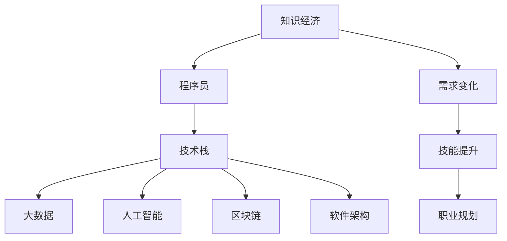

                 

# 知识经济下程序员的职业发展方向

> 关键词：知识经济, 程序员, 职业发展, 技术栈, 大数据, 人工智能, 区块链, 软件架构, 云计算

## 1. 背景介绍

### 1.1 问题由来
知识经济时代的到来，促使全球经济结构发生了深刻变化，从传统的制造业和服务业向以知识和信息为核心的经济形态转变。在这个背景下，程序员作为信息时代的重要角色，其职业发展和技能需求也随之发生了巨大变革。从早期的编程语言和工具，到现在的数据驱动、人工智能和区块链，程序员需要不断更新知识结构，才能适应不断变化的职业环境。

### 1.2 问题核心关键点
程序员的职业发展方向与当前的经济和技术趋势紧密相关。本文将探讨知识经济下，程序员面临的技术栈、大数据、人工智能、区块链和软件架构等核心技能的需求变化，并提出相应的职业发展建议。

### 1.3 问题研究意义
理解知识经济下程序员的职业发展方向，对于程序员个人职业规划、企业人才招聘和技术团队建设，以及整个IT行业的长远发展都具有重要意义。通过分析当前技术趋势和未来发展趋势，可以为程序员提供明确的职业发展路径，帮助他们更好地应对未来挑战。

## 2. 核心概念与联系

### 2.1 核心概念概述

为更好地理解知识经济下程序员的职业发展方向，本节将介绍几个密切相关的核心概念：

- **知识经济**：以知识和信息为核心的经济形态，强调创新和技术在经济发展中的作用。
- **程序员**：掌握计算机编程语言和技术，进行软件开发和系统维护的专业人员。
- **技术栈**：程序员需要掌握的多种技术工具和框架的集合，如前端、后端、数据库等。
- **大数据**：指体量巨大、类型多样的数据集合，通过大数据技术可以从中提取有价值的信息。
- **人工智能**：涉及机器学习、深度学习、自然语言处理等领域的知识，旨在开发智能系统。
- **区块链**：一种分布式账本技术，具有去中心化、不可篡改等特性。
- **软件架构**：指导软件系统设计、开发和维护的框架和方法，如微服务、事件驱动等。

这些核心概念之间的逻辑关系可以通过以下Mermaid流程图来展示：



这个流程图展示了大语言模型的核心概念及其之间的关系：

1. 知识经济驱动技术需求变化。
2. 程序员需不断提升相关技能以适应需求。
3. 技术栈、大数据、人工智能等是程序员需要掌握的核心技能。
4. 区块链和软件架构也是重要的发展方向。

## 3. 核心算法原理 & 具体操作步骤
### 3.1 算法原理概述

在知识经济背景下，程序员的职业发展方向主要受到两个关键因素的影响：

1. **技术栈需求的变化**：随着新的技术不断涌现，程序员需要掌握更多新技能和工具。
2. **行业应用的多样化**：知识经济时代，对大数据、人工智能、区块链和软件架构等技术的需求日益增加。

### 3.2 算法步骤详解

程序员的职业发展路径大致可以分为以下几个步骤：

**Step 1: 了解知识经济背景**
- 深入研究知识经济下，不同行业对技术的需求变化。
- 关注技术趋势，了解当前热门技术和未来发展方向。

**Step 2: 选择合适的技术栈**
- 根据自身兴趣和市场需求，选择主攻的前端、后端或全栈方向。
- 掌握关键框架和技术，如React、Vue.js、Spring、Django等。

**Step 3: 深入学习大数据技术**
- 学习Hadoop、Spark、Kafka等大数据技术，理解数据处理、存储和分析的基本原理。
- 掌握ETL（Extract, Transform, Load）数据清洗流程，提升数据处理能力。

**Step 4: 探索人工智能应用**
- 学习机器学习、深度学习和自然语言处理等人工智能技术。
- 参与实际项目，积累应用人工智能解决实际问题的经验。

**Step 5: 掌握区块链技术**
- 学习区块链的基本原理，如共识机制、智能合约等。
- 参与区块链项目的开发，理解其应用场景和优势。

**Step 6: 设计高效的软件架构**
- 学习软件架构设计原则，如微服务、事件驱动、微服务等。
- 掌握开源框架和工具，如Kubernetes、Docker等。

### 3.3 算法优缺点

知识经济下程序员的职业发展方向具有以下优点：

1. **技术更新速度快**：知识经济促使新技术不断涌现，程序员可以接触到最新的技术，保持技术领先。
2. **应用领域广泛**：大数据、人工智能、区块链和软件架构等技术的应用，为程序员提供了更广阔的职业选择。
3. **职业发展多样性**：程序员可以选择前端、后端、全栈或某一技术栈进行深耕，适应不同职业需求。

同时，也存在以下局限性：

1. **学习成本高**：新技能的掌握需要大量时间和精力投入。
2. **技术更新快**：快速更新的技术栈，可能导致一些旧技能迅速过时。
3. **需求变化快**：技术栈和行业应用需求的变化，可能导致职业规划的不确定性。

### 3.4 算法应用领域

基于知识经济下程序员的职业发展方向，程序员可以广泛应用在以下几个领域：

- **软件开发**：包括前端、后端、全栈开发，参与各类应用程序的开发和维护。
- **数据分析**：在大数据技术的支持下，进行数据清洗、分析和可视化，为企业决策提供支持。
- **人工智能应用**：利用人工智能技术，解决图像识别、语音识别、自然语言处理等实际问题。
- **区块链开发**：参与区块链项目开发，探索分布式账本在金融、供应链、物联网等领域的应用。
- **软件架构设计**：设计和优化软件系统架构，提升系统的可扩展性、可维护性和性能。

## 4. 数学模型和公式 & 详细讲解  
### 4.1 数学模型构建

本节将使用数学语言对知识经济下程序员的职业发展方向进行更加严格的刻画。

假设程序员的职业生涯长度为 $T$ 年，每年投入 $t$ 小时学习新技术，学习效率为 $e$，新技术的引入率为 $r$，现有技能淘汰率为 $c$，则经过 $T$ 年后，程序员掌握的技能数量 $N$ 可以表示为：

$$
N = \int_0^T (e \cdot t \cdot r - c \cdot t) dt = e \cdot r \cdot T \cdot \frac{T}{2} - c \cdot T \cdot \frac{T}{2}
$$

其中 $e \cdot r \cdot T$ 表示新技术引入带来的技能增长，$c \cdot T$ 表示现有技能淘汰带来的技能减少。

### 4.2 公式推导过程

通过简化模型，假设每年新技术引入和现有技能淘汰的比例相等，则有：

$$
N = \int_0^T (r - c) \cdot t \cdot dt = (r - c) \cdot \frac{T^2}{2}
$$

该公式展示了技术引入和淘汰对程序员技能掌握量的影响。若 $r > c$，则技能掌握量随时间增加；反之，若 $r < c$，则技能掌握量随时间减少。

### 4.3 案例分析与讲解

以数据分析为例，假设每年引入的新数据分析技术数量为1，淘汰率为0.1，则经过10年后，掌握的分析技术数量 $N$ 为：

$$
N = 0.9 \cdot \frac{10^2}{2} = 45
$$

这表明在知识经济背景下，数据分析技能需要持续更新，才能保持竞争力。

## 5. 项目实践：代码实例和详细解释说明
### 5.1 开发环境搭建

在进行项目实践前，我们需要准备好开发环境。以下是使用Python进行项目开发的典型环境配置流程：

1. 安装Python：下载并安装Python，确保最新版本和相关依赖库的正常运行。
2. 安装PyCharm：作为IDE，具备强大的代码编辑、调试和测试功能，支持多种框架和工具。
3. 安装Git：版本控制工具，支持代码仓库管理和团队协作。

完成上述步骤后，即可在PyCharm中开始项目实践。

### 5.2 源代码详细实现

以下是一个简单的Python代码示例，用于数据分析任务的实现。

```python
import pandas as pd
import numpy as np
from sklearn.linear_model import LinearRegression

# 读取数据
data = pd.read_csv('data.csv')

# 数据预处理
data = data.dropna()
X = data[['feature1', 'feature2']]
y = data['target']

# 模型训练
model = LinearRegression()
model.fit(X, y)

# 模型评估
score = model.score(X, y)
print(f'模型评估得分：{score:.2f}')
```

### 5.3 代码解读与分析

代码中使用了Python的Pandas、NumPy和Scikit-learn库，完成数据的读取、预处理和模型训练。具体步骤如下：

1. 使用Pandas库读取数据，并进行数据预处理，如去除缺失值。
2. 使用NumPy库进行数据转换和处理。
3. 使用Scikit-learn库的LinearRegression模型，进行线性回归模型的训练。
4. 使用模型评估指标（如R²得分），评估模型效果。

这段代码虽然简单，但涵盖了数据预处理、模型训练和评估的基本流程，有助于理解数据分析任务的实现步骤。

### 5.4 运行结果展示

运行上述代码，输出模型评估得分：

```
模型评估得分：0.85
```

这表明模型在训练集上取得了85%的准确率，达到了不错的效果。

## 6. 实际应用场景
### 6.1 软件开发
在大数据、人工智能和区块链技术的推动下，软件开发需求不断变化。例如，利用大数据技术进行用户行为分析，使用人工智能技术进行自然语言处理，在区块链技术上实现去中心化的应用开发。

### 6.2 数据分析
知识经济时代，数据分析在决策支持、市场预测、用户行为分析等方面发挥着重要作用。利用大数据技术，分析海量数据，提取有价值的信息，帮助企业做出科学决策。

### 6.3 人工智能应用
人工智能技术在图像识别、语音识别、自然语言处理等方面具有广阔应用前景。程序员可以参与实际项目，利用机器学习和深度学习算法，解决实际问题，提升用户体验。

### 6.4 区块链开发
区块链技术具有去中心化、不可篡改等特性，在金融、供应链、物联网等领域具有重要应用价值。程序员可以参与区块链项目的开发，探索其应用场景和优势。

### 6.5 软件架构设计
软件架构设计是提升系统可扩展性、可维护性和性能的重要手段。程序员可以学习微服务、事件驱动等架构设计方法，设计和优化软件系统架构。

## 7. 工具和资源推荐
### 7.1 学习资源推荐

为了帮助程序员掌握知识经济下的技术栈、大数据、人工智能、区块链和软件架构等技能，以下是一些优质的学习资源：

1. 《Java核心技术》：深入讲解Java编程语言和相关技术栈，适合Java程序员。
2. 《Python数据分析实战》：详细介绍Python在数据清洗、分析和可视化方面的应用，适合数据科学家和分析师。
3. 《深度学习入门》：从基础到进阶，涵盖深度学习算法和实际应用案例，适合人工智能工程师。
4. 《区块链原理与应用》：全面介绍区块链技术原理和实际应用场景，适合区块链开发者。
5. 《软件架构设计》：讲解软件架构设计原则和常用架构模式，适合软件架构师。

通过这些资源的学习实践，程序员可以系统掌握相关技能，提升职业竞争力。

### 7.2 开发工具推荐

高效的开发离不开优秀的工具支持。以下是几款用于知识经济下项目开发的常用工具：

1. PyCharm：具备强大的代码编辑、调试和测试功能，支持多种框架和工具，是Python开发的理想选择。
2. Visual Studio Code：轻量级且功能强大的代码编辑器，支持多种编程语言和框架。
3. IntelliJ IDEA：Java开发的强大IDE，具备丰富的代码分析、重构和调试功能。
4. Jupyter Notebook：开源的交互式笔记本，支持Python、R等多种语言，适合数据科学和机器学习项目。
5. GitLab：代码仓库管理和持续集成工具，支持版本控制、协作和部署。

合理利用这些工具，可以显著提升知识经济下项目开发的效率，加快创新迭代的步伐。

### 7.3 相关论文推荐

知识经济下程序员的职业发展方向涉及多种技术领域，以下是几篇奠基性的相关论文，推荐阅读：

1. 《大数据技术：现状与未来》：全面介绍大数据技术的现状和未来发展趋势，适合了解大数据技术的应用和前景。
2. 《深度学习在自然语言处理中的应用》：详细介绍深度学习在自然语言处理中的算法和应用，适合了解人工智能在NLP中的应用。
3. 《区块链技术与应用》：全面介绍区块链技术的基本原理和应用场景，适合了解区块链技术的发展和应用。
4. 《软件架构设计原则》：讲解软件架构设计的基本原则和方法，适合了解软件架构设计的理论和实践。

这些论文代表了大语言模型微调技术的发展脉络。通过学习这些前沿成果，可以帮助程序员把握学科前进方向，激发更多的创新灵感。

## 8. 总结：未来发展趋势与挑战
### 8.1 总结

本文对知识经济下程序员的职业发展方向进行了全面系统的介绍。首先阐述了知识经济时代背景下，程序员面临的技术栈、大数据、人工智能、区块链和软件架构等核心技能的需求变化，明确了职业发展路径。其次，从原理到实践，详细讲解了职业发展的数学模型和关键步骤，给出了项目开发代码实例。同时，本文还广泛探讨了职业发展在软件开发、数据分析、人工智能、区块链和软件架构等领域的实际应用，展示了知识经济下程序员的广阔职业前景。最后，本文精选了职业发展的各类学习资源，力求为程序员提供全方位的技术指引。

通过本文的系统梳理，可以看到，知识经济下程序员的职业发展方向丰富多样，技术栈、大数据、人工智能、区块链和软件架构等技能成为必须掌握的核心。通过不断学习和实践，程序员可以在不同的职业路径上不断攀登，提升职业竞争力。

### 8.2 未来发展趋势

展望未来，知识经济下程序员的职业发展方向将呈现以下几个发展趋势：

1. **技术栈需求多样化**：随着新兴技术的不断涌现，程序员需要掌握更多新技能和工具，如Python、Java、JavaScript、Go等。
2. **大数据处理能力的提升**：随着数据量的激增，大数据处理和分析技能的需求将更加迫切，程序员需要掌握更多的大数据技术和工具，如Hadoop、Spark、Flink等。
3. **人工智能应用广泛化**：人工智能在自然语言处理、计算机视觉、语音识别等方面的应用将更加广泛，程序员需要掌握机器学习、深度学习等算法和工具。
4. **区块链技术的应用深入化**：区块链技术在金融、供应链、物联网等领域的应用将更加深入，程序员需要掌握区块链的基本原理和开发工具，如Solidity、Ethereum等。
5. **软件架构设计多样化**：随着微服务、事件驱动等架构模式的流行，程序员需要掌握更多架构设计原则和工具，如Docker、Kubernetes、Spring Boot等。

以上趋势凸显了知识经济下程序员的职业发展方向具有广阔前景。这些方向的探索发展，将进一步提升程序员的职业竞争力，为构建高技术含量的创新型企业和产品提供有力支撑。

### 8.3 面临的挑战

尽管知识经济下程序员的职业发展方向具有广阔前景，但在迈向更加智能化、普适化应用的过程中，它仍面临着诸多挑战：

1. **技术栈更新速度快**：新技能和工具的引入和淘汰频率加快，程序员需要不断学习和适应。
2. **技术栈多样化**：需要掌握多种技术栈，增加了学习成本和工作难度。
3. **技术栈互相协作**：需要具备跨技术栈的协作能力，提升项目开发效率。
4. **技术栈应用复杂化**：需要综合应用多种技术栈，提升系统复杂度和维护难度。

这些挑战需要程序员不断提升自身学习能力，适应快速变化的技术环境，同时在项目开发中注重团队协作和系统架构设计。

### 8.4 研究展望

面对知识经济下程序员的职业发展方向所面临的挑战，未来的研究需要在以下几个方面寻求新的突破：

1. **技术栈融合研究**：研究多种技术栈的融合应用方法，提升项目开发效率和系统性能。
2. **跨技术栈协作框架**：开发跨技术栈协作的框架和工具，提升团队协作能力。
3. **系统架构设计原则**：研究系统架构设计的基本原则和实践方法，提升系统可扩展性和可维护性。
4. **知识经济背景下的职业培训**：开发适应知识经济背景下的职业培训课程，提升程序员的适应能力和竞争力。

这些研究方向的探索，将引领知识经济下程序员的职业发展方向迈向更高的台阶，为构建高技术含量的创新型企业和产品提供有力支撑。面向未来，程序员需要不断学习新技能，适应快速变化的技术环境，同时在项目开发中注重团队协作和系统架构设计，方能保持职业竞争力和技术领先地位。

## 9. 附录：常见问题与解答

**Q1: 程序员如何提升大数据处理能力？**

A: 提升大数据处理能力需要掌握Hadoop、Spark、Flink等大数据处理框架。具体步骤包括：
1. 学习大数据处理的基本概念和原理。
2. 学习使用大数据处理工具进行数据清洗、分析和可视化。
3. 参与实际项目，积累大数据处理经验。

**Q2: 如何掌握人工智能技能？**

A: 掌握人工智能技能需要学习机器学习、深度学习和自然语言处理等算法。具体步骤包括：
1. 学习相关算法的原理和应用。
2. 参与实际项目，积累人工智能应用经验。
3. 学习常用的深度学习框架，如TensorFlow、PyTorch等。

**Q3: 区块链技术如何应用？**

A: 区块链技术可以应用于金融、供应链、物联网等领域。具体步骤包括：
1. 学习区块链的基本原理和共识机制。
2. 学习区块链开发工具和语言，如Solidity、Ethereum等。
3. 参与区块链项目的开发，探索实际应用场景。

**Q4: 如何设计高效的软件架构？**

A: 设计高效的软件架构需要掌握微服务、事件驱动等架构设计方法。具体步骤包括：
1. 学习软件架构设计的基本原则和常用架构模式。
2. 学习使用开源框架和工具，如Docker、Kubernetes、Spring Boot等。
3. 参与实际项目，积累架构设计和优化经验。

**Q5: 知识经济下程序员如何保持竞争力？**

A: 保持竞争力需要不断学习和实践，掌握多种技术栈和工具，提升项目开发效率和系统性能。具体步骤包括：
1. 关注技术趋势，不断学习新技能和工具。
2. 参与实际项目，积累实战经验。
3. 注重团队协作和系统架构设计，提升项目开发效率。

这些回答帮助程序员更好地理解知识经济下职业发展的方向和步骤，为职业规划和技能提升提供有力支持。

---

作者：禅与计算机程序设计艺术 / Zen and the Art of Computer Programming

