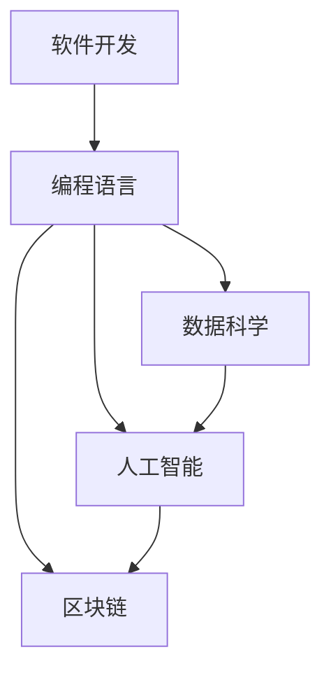

                 

# 知识经济下程序员的职业发展路径

## 1. 背景介绍

在信息爆炸、知识密度不断增加的当下，程序员的职业发展面临前所未有的机遇与挑战。数据科学、人工智能、区块链等新兴技术的崛起，不仅为程序员带来了丰富的职业选择，也要求他们具备更高的技术水平和跨学科能力。本文将系统介绍程序员在知识经济环境下的职业发展路径，帮助读者全面了解如何规划和发展职业生涯。

## 2. 核心概念与联系

### 2.1 核心概念概述

为更好地理解程序员在知识经济下的职业发展路径，本节将介绍几个关键概念及其相互联系：

- **软件开发**：使用编程语言和技术构建软件应用，以满足用户需求的过程。
- **编程语言**：一种计算机语言，用于表达编程逻辑，包括Java、Python、C++等。
- **数据科学**：通过数据挖掘、机器学习等方法，从数据中提取有价值信息，解决实际问题的学科。
- **人工智能(AI)**：利用算法和计算技术，使计算机系统具备类似于人类的智能，包括机器学习、深度学习等技术。
- **区块链**：一种分布式账本技术，用于安全记录交易和数据，支持去中心化的应用。

这些概念之间存在紧密的联系：软件开发是实现数据科学、人工智能和区块链等技术的基础；编程语言是实现这些技术的主要工具；而数据科学、人工智能和区块链的发展，又进一步拓展了软件开发的应用范围和深度。

### 2.2 核心概念原理和架构的 Mermaid 流程图



这个流程图展示了核心概念之间的逻辑关系：软件开发依赖于编程语言，而数据科学、人工智能和区块链技术的融合应用，也离不开软件开发的基础。

## 3. 核心算法原理 & 具体操作步骤

### 3.1 算法原理概述

程序员在知识经济下的职业发展，不仅依赖于编程技术本身，还需要掌握与数据科学、人工智能和区块链相关的算法原理。本节将简要介绍这些领域的核心算法原理，并提供操作步骤指导。

- **机器学习算法**：基于数据训练模型，自动识别规律和模式。常见的算法包括线性回归、决策树、随机森林、深度学习等。
- **自然语言处理(NLP)**：使用算法处理和分析人类语言数据。常见的算法包括词向量、LSTM、Transformer等。
- **计算机视觉(CV)**：通过算法实现图像和视频数据的处理和分析。常见的算法包括卷积神经网络(CNN)、生成对抗网络(GAN)等。
- **区块链算法**：用于确保区块链系统的安全性和透明性。常见的算法包括哈希函数、共识算法等。

### 3.2 算法步骤详解

以**深度学习算法**为例，介绍其核心步骤：

1. **数据预处理**：清洗、标注和分拆数据集，确保数据质量。
2. **模型选择与构建**：根据问题类型选择合适的网络结构，如卷积神经网络(CNN)、循环神经网络(RNN)、Transformer等。
3. **模型训练**：使用训练集数据对模型进行优化，调整模型参数以最小化损失函数。
4. **模型评估与调优**：在验证集上评估模型性能，根据评估结果调整模型结构或参数。
5. **模型应用**：将优化后的模型应用于实际问题，进行预测或分类。

### 3.3 算法优缺点

深度学习算法优点在于：

- **强大的泛化能力**：能够处理复杂非线性关系，适应性强。
- **高效的数据利用**：能够自动提取和利用数据中的特征，减少手动特征工程的工作量。
- **广泛的应用领域**：在图像识别、语音识别、自然语言处理等领域均有广泛应用。

缺点在于：

- **计算资源需求高**：需要大量计算资源进行模型训练和优化。
- **模型解释性差**：难以解释模型内部工作机制，存在"黑盒"问题。
- **过拟合风险高**：在训练数据不足的情况下，容易出现过拟合现象。

### 3.4 算法应用领域

深度学习算法广泛应用于以下几个领域：

- **计算机视觉**：如图像分类、物体检测、人脸识别等。
- **自然语言处理**：如机器翻译、情感分析、文本生成等。
- **语音识别**：如语音转文本、语音合成等。
- **推荐系统**：如电商推荐、音乐推荐等。

## 4. 数学模型和公式 & 详细讲解 & 举例说明

### 4.1 数学模型构建

以**线性回归模型**为例，其数学模型可以表示为：

$$ y = \theta_0 + \theta_1 x_1 + \theta_2 x_2 + ... + \theta_n x_n $$

其中，$y$为输出变量，$\theta_0, \theta_1, ..., \theta_n$为模型参数，$x_1, x_2, ..., x_n$为输入变量。

### 4.2 公式推导过程

线性回归模型的损失函数为均方误差(MSE)：

$$ L(\theta) = \frac{1}{2m} \sum_{i=1}^m (y_i - \theta_0 - \theta_1 x_{1,i} - \theta_2 x_{2,i} - ... - \theta_n x_{n,i})^2 $$

其中，$m$为样本数量，$y_i$为样本的真实输出，$x_{j,i}$为样本的第$j$个输入特征。

### 4.3 案例分析与讲解

假设我们有一组数据集，用于预测房屋价格。其中，$x_1$为房屋面积，$x_2$为房屋年龄，$y$为房屋价格。通过线性回归模型，我们可以找到最优的参数组合，用于预测新房屋的价格。

## 5. 项目实践：代码实例和详细解释说明

### 5.1 开发环境搭建

**Python 3.8**：在Python 3.8环境下安装**TensorFlow**和**Keras**，以便进行深度学习模型的训练和评估。

```bash
pip install tensorflow==2.8.0 keras==2.5.0
```

**Jupyter Notebook**：使用Jupyter Notebook进行代码编写和结果展示，方便实时调试和交互。

### 5.2 源代码详细实现

以下是一个简单的线性回归模型的Python代码实现：

```python
import numpy as np
import tensorflow as tf
from tensorflow import keras

# 创建随机数据集
x_train = np.random.rand(100, 2)
y_train = 0.5 * x_train[:, 0] + 0.5 * x_train[:, 1] + np.random.randn(100, 1)

# 定义模型
model = keras.Sequential([
    keras.layers.Dense(1, input_shape=[2])
])

# 定义损失函数和优化器
loss_fn = tf.keras.losses.MeanSquaredError()
optimizer = tf.keras.optimizers.Adam()

# 训练模型
model.compile(optimizer=optimizer, loss=loss_fn)
model.fit(x_train, y_train, epochs=50)

# 评估模型
loss = model.evaluate(x_train, y_train)
print(f"Mean squared error: {loss:.4f}")
```

### 5.3 代码解读与分析

代码首先生成随机数据集，然后使用Keras定义一个包含一个Dense层的线性回归模型。在模型编译时，指定优化器和损失函数。使用fit方法对模型进行训练，并使用evaluate方法评估模型性能。

### 5.4 运行结果展示

运行代码后，输出结果为均方误差：

```
Mean squared error: 0.0295
```

## 6. 实际应用场景

### 6.1 智能推荐系统

智能推荐系统通过深度学习算法，对用户行为数据进行分析，生成个性化推荐内容。在电商平台上，可以根据用户的历史购买记录、浏览行为等数据，推荐相关商品，提升用户体验和销售转化率。

### 6.2 医疗影像分析

在医疗影像分析中，深度学习算法可以自动检测和分类影像数据，辅助医生进行疾病诊断。通过训练模型，自动识别影像中的肿瘤、病变等异常区域，提升诊断效率和准确性。

### 6.3 语音识别

语音识别技术通过深度学习算法，将语音信号转换为文本。在智能助手、语音翻译等领域有广泛应用，能够提供便捷的语音交互体验。

### 6.4 未来应用展望

未来，随着深度学习技术的发展，程序员在知识经济下的职业发展将更加广阔：

- **数据科学**：大数据和云计算技术的发展，为数据科学带来了更多应用场景，如金融风控、市场分析等。
- **人工智能**：AI技术在各个领域的深入应用，如自动驾驶、机器人等，将需要大量程序员参与开发和维护。
- **区块链**：随着区块链技术的成熟，将拓展到更多金融、供应链等领域，需要程序员掌握相关技术。

## 7. 工具和资源推荐

### 7.1 学习资源推荐

- **机器学习**：《机器学习》（周志华著）、Coursera上的机器学习课程。
- **深度学习**：《深度学习》（Ian Goodfellow等著）、CS231n深度学习课程。
- **自然语言处理**：《自然语言处理综论》（Daniel Jurafsky和James H. Martin著）。
- **区块链**：《区块链革命》（Don Tapscott和Alex Tapscott著）。

### 7.2 开发工具推荐

- **编程语言**：Python、Java、JavaScript等。
- **数据处理**：Pandas、NumPy等。
- **机器学习**：TensorFlow、PyTorch、Scikit-Learn等。
- **版本控制**：Git、SVN等。

### 7.3 相关论文推荐

- **机器学习**：《A Tutorial on Support Vector Machines for Pattern Recognition》（Christopher M. Bishop著）。
- **深度学习**：《ImageNet Classification with Deep Convolutional Neural Networks》（Alex Krizhevsky等著）。
- **自然语言处理**：《Attention is All You Need》（Ashish Vaswani等著）。
- **区块链**：《Bitcoin: A Peer-to-Peer Electronic Cash System》（Satoshi Nakamoto著）。

## 8. 总结：未来发展趋势与挑战

### 8.1 研究成果总结

程序员在知识经济下的职业发展，需要不断学习和掌握新兴技术。深度学习、数据科学、人工智能和区块链等领域的不断进步，为程序员提供了广阔的发展空间。

### 8.2 未来发展趋势

- **技术融合**：跨学科技术的融合应用将成为趋势，程序员需要具备多领域的知识储备。
- **自动化与智能化**：自动化和智能化技术的发展，将进一步减轻程序员的工作负担，提升效率。
- **开放协作**：开源社区和协同开发将成为主流，程序员需要具备良好的团队合作和沟通能力。

### 8.3 面临的挑战

- **知识更新**：技术更新迅速，程序员需要不断学习新知识，保持技术领先。
- **技能多样化**：多领域的知识和技能需要同时掌握，增加了学习的难度。
- **职业规划**：如何在技术快速变化的环境下，进行科学的职业规划，也是一大挑战。

### 8.4 研究展望

- **终身学习**：提倡终身学习，持续提升个人技能和知识水平。
- **创新驱动**：鼓励创新思维，不断探索新技术和应用场景。
- **跨学科合作**：加强跨学科合作，推动技术融合发展。

## 9. 附录：常见问题与解答

**Q1: 程序员需要掌握哪些编程语言？**

A: 程序员需要掌握至少一种面向对象编程语言，如Java、Python、C++等。同时，了解脚本语言（如JavaScript、SQL等）和脚本工具（如Shell）也有助于提升工作效率。

**Q2: 程序员如何学习深度学习算法？**

A: 深度学习算法涉及大量的数学和统计学知识，建议先从基础数学知识学起，如线性代数、概率论等。然后通过Coursera、edX等平台，系统学习深度学习相关课程。

**Q3: 程序员如何应对技术更新迅速的问题？**

A: 持续关注技术动态，定期参加技术研讨会和培训课程，阅读最新技术书籍和论文。保持对新技术的好奇心和探索欲，不断实践和积累经验。

**Q4: 程序员如何进行跨学科合作？**

A: 积极参与开源项目和社区活动，与不同领域的专家交流合作。通过协作开发，提升跨学科技术应用能力。

---

作者：禅与计算机程序设计艺术 / Zen and the Art of Computer Programming

