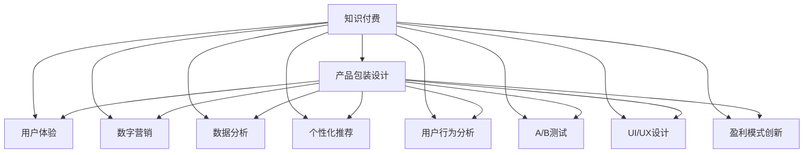

                 

# 知识经济时代下的知识付费创新产品包装设计

> 关键词：知识付费、产品包装设计、用户体验、数字营销、数据分析、个性化推荐、用户行为分析、A/B测试、UI/UX设计、盈利模式创新

## 1. 背景介绍

### 1.1 问题由来
在知识经济时代，知识付费已经成为越来越多人的选择。无论是职场人士希望提升自我，还是学生为了掌握专业技能，都愿意为优质知识内容买单。然而，知识付费市场虽然繁荣，但产品同质化现象严重，用户体验不理想，导致大量用户流失。

### 1.2 问题核心关键点
为了提升知识付费产品的竞争力，迫切需要在包装设计上进行创新，从内容和形式两方面打造用户粘性。产品包装不仅仅是外观设计，更是如何通过内容呈现、功能设计、数据驱动等手段，提升用户体验和满意度，实现商业变现。

### 1.3 问题研究意义
优化产品包装设计的意义重大，不仅可以提升用户粘性，提高用户转化率和留存率，还能实现更高效的商业变现。通过精心设计的产品包装，能够将知识内容更好地传递给用户，增强用户对平台的信任和依赖，实现知识付费模式的可持续发展。

## 2. 核心概念与联系

### 2.1 核心概念概述

为了更好地理解产品包装设计，本节将介绍几个密切相关的核心概念：

- **知识付费**：指用户为获得特定知识内容而支付费用的模式，通过订阅、单次购买等方式进行付费。
- **产品包装设计**：指对知识付费产品的功能、内容、界面等进行系统性设计，提升用户体验和满意度。
- **用户体验**：指用户在使用产品时的感受和体验，直接影响用户粘性和留存率。
- **数字营销**：指利用数字技术和平台进行市场推广，提升产品曝光和转化。
- **数据分析**：指通过数据收集和分析，优化产品功能和推荐算法，提升用户满意度。
- **个性化推荐**：指根据用户兴趣和行为，提供个性化内容推荐，提高用户粘性和转化率。
- **用户行为分析**：指通过分析用户行为数据，优化产品功能和服务，提升用户满意度。
- **A/B测试**：指同时推出两个版本的产品，通过数据分析确定最佳方案，提升产品效果。
- **UI/UX设计**：指用户界面和用户体验设计，提升产品交互和视觉效果。
- **盈利模式创新**：指通过创新产品功能和盈利模式，实现更高的商业变现。

这些核心概念之间的逻辑关系可以通过以下Mermaid流程图来展示：



这个流程图展示了这个框架下各个概念之间的关系：

1. 知识付费是核心驱动，产品包装设计、用户体验、数字营销、数据分析等都是为了提升知识付费的效果。
2. 个性化推荐和用户行为分析，结合数据分析结果，优化产品功能和推荐算法，进一步提升用户体验和满意度。
3. UI/UX设计通过视觉和交互设计，提升用户粘性。
4. 盈利模式创新通过优化产品功能和盈利模型，实现更高的商业变现。

这些概念共同构成了知识付费产品包装设计的整体框架，帮助我们系统性地理解和设计产品。

## 3. 核心算法原理 & 具体操作步骤

### 3.1 算法原理概述

产品包装设计的核心目标是提升用户粘性和转化率，而这一目标的实现需要依托于数据驱动的设计和优化。以下是从数据驱动的角度，对产品包装设计的核心算法原理进行简要概述。

- **用户行为分析**：通过分析用户行为数据，识别用户兴趣和行为模式，为个性化推荐和内容优化提供依据。
- **个性化推荐算法**：利用机器学习技术，根据用户历史行为和兴趣，推荐用户可能感兴趣的内容，提高用户满意度。
- **A/B测试**：通过对比两个版本的产品，分析用户反馈，确定最佳方案，实现产品功能的优化。

### 3.2 算法步骤详解

基于数据驱动的产品包装设计主要包含以下几个关键步骤：

**Step 1: 数据收集与处理**
- 收集用户行为数据，包括但不限于用户登录时间、访问内容、购买行为等。
- 对收集到的数据进行清洗和预处理，去除异常值和噪声，确保数据质量。

**Step 2: 数据分析与建模**
- 通过统计分析和机器学习算法，建立用户行为模型，识别用户兴趣和行为模式。
- 基于用户行为模型，设计个性化推荐算法，优化内容推荐系统。

**Step 3: 设计优化与验证**
- 根据数据分析结果，设计用户界面和交互功能，提升用户体验。
- 通过A/B测试，验证设计优化效果，确定最佳方案。

**Step 4: 产品部署与迭代**
- 部署优化后的产品，持续收集用户反馈。
- 根据反馈结果，进行迭代优化，不断提升产品效果。

### 3.3 算法优缺点

基于数据驱动的产品包装设计方法具有以下优点：

1. **数据驱动**：通过数据分析和建模，优化产品功能和服务，提升用户体验。
2. **个性化推荐**：根据用户兴趣和行为，提供个性化内容推荐，提高用户粘性。
3. **A/B测试**：通过对比测试，确定最佳方案，提升产品效果。
4. **持续迭代**：根据用户反馈进行持续优化，实现产品效果的不断提升。

同时，该方法也存在一定的局限性：

1. **数据质量要求高**：需要收集和处理大量的用户行为数据，数据质量直接影响算法效果。
2. **算法复杂度较高**：需要构建复杂的机器学习模型，对技术要求较高。
3. **资源消耗大**：数据处理和模型训练需要大量计算资源，对硬件设施要求较高。
4. **隐私和安全问题**：需要保护用户隐私，避免数据泄露和滥用。

尽管存在这些局限性，但就目前而言，基于数据驱动的产品包装设计方法仍是最为有效的实现方式。未来相关研究的重点在于如何进一步降低数据处理成本，提高算法效率，同时兼顾隐私和安全。

### 3.4 算法应用领域

基于数据驱动的产品包装设计方法，在知识付费领域已经得到了广泛的应用，覆盖了内容推荐、用户界面设计、市场推广等多个方面，例如：

- **内容推荐系统**：通过分析用户行为，推荐用户感兴趣的内容，提高用户粘性。
- **个性化界面设计**：根据用户偏好，设计个性化用户界面，提升用户体验。
- **市场推广策略**：利用数据分析结果，优化市场推广策略，提升产品曝光和转化。

除了上述这些经典应用外，产品包装设计方法也被创新性地应用到更多场景中，如个性化营销、内容订阅、会员服务升级等，为知识付费平台带来了全新的体验和价值。

## 4. 数学模型和公式 & 详细讲解

### 4.1 数学模型构建

为了更好地理解基于数据驱动的产品包装设计方法，我们将在本节中使用数学语言对核心算法进行更加严格的刻画。

假设知识付费平台有用户 $U$，内容 $C$，推荐算法 $A$，界面设计 $I$，市场推广策略 $P$，其中用户和内容之间的关系可以表示为 $R$。用户行为数据可以表示为 $D$，包括访问行为、购买行为等。

定义用户行为模型 $M$，用于描述用户兴趣和行为模式。定义推荐算法模型 $R$，用于根据用户行为模型进行内容推荐。定义界面设计模型 $I$，用于设计用户界面和交互功能。定义市场推广模型 $P$，用于优化市场推广策略。

根据上述定义，产品包装设计的优化目标可以表示为：

$$
\min_{M,R,I,P} \max_{U,C} \mathcal{L}(M,R,I,P,D)
$$

其中 $\mathcal{L}$ 为综合性能指标函数，包括用户粘性、满意度、转化率等。

### 4.2 公式推导过程

以下我们以推荐算法为例，推导基于协同过滤的推荐公式及其梯度计算过程。

假设用户 $u$ 对内容 $c$ 的评分 $r_{u,c}$ 可以表示为：

$$
r_{u,c} = \sum_{c'}\alpha_{u,c'}r_{u,c'}
$$

其中 $\alpha_{u,c'}$ 为协同过滤系数，用于衡量用户对内容的兴趣程度。

协同过滤模型可以通过矩阵分解方法求解，得到协同过滤系数 $\alpha_{u,c'}$，从而计算用户对内容的评分 $r_{u,c}$。协同过滤系数的优化目标函数为：

$$
\min_{\alpha} \frac{1}{2} \sum_{u,c'} \|r_{u,c'} - \alpha_{u,c'}\|^2
$$

通过矩阵分解方法，可以得到协同过滤系数的更新公式：

$$
\alpha \leftarrow \alpha - \eta \nabla_{\alpha} \mathcal{L}(\alpha)
$$

其中 $\eta$ 为学习率，$\nabla_{\alpha} \mathcal{L}(\alpha)$ 为损失函数对协同过滤系数的梯度。

在得到协同过滤系数的梯度后，即可带入参数更新公式，完成协同过滤模型的迭代优化。重复上述过程直至收敛，最终得到优化的协同过滤系数。

### 4.3 案例分析与讲解

**案例分析：内容推荐系统**

假设有一个在线课程平台，平台上有大量课程内容 $C$，用户 $U$ 可以根据历史行为对课程进行评分。推荐系统可以基于协同过滤模型，为用户推荐可能感兴趣的课程。

具体实现步骤如下：

1. 收集用户行为数据，包括课程访问、评分等行为数据。
2. 利用协同过滤模型对协同过滤系数 $\alpha_{u,c'}$ 进行求解。
3. 根据用户行为模型，推荐可能感兴趣的课程，计算推荐结果的评分。
4. 利用A/B测试，验证推荐效果，确定最佳方案。

案例讲解：

- **数据收集与处理**：收集用户历史行为数据，包括访问时间、评分等。对数据进行清洗和预处理，去除异常值和噪声。
- **协同过滤模型求解**：利用矩阵分解方法，求解协同过滤系数 $\alpha_{u,c'}$。
- **推荐算法优化**：根据协同过滤模型，计算用户对课程的推荐评分，优化推荐算法。
- **A/B测试验证**：通过A/B测试，验证推荐算法效果，确定最佳方案。

通过上述步骤，可以有效地利用数据驱动的方法，提升内容推荐系统的精度和用户满意度，实现产品包装设计的优化。

## 5. 项目实践：代码实例和详细解释说明

### 5.1 开发环境搭建

在进行产品包装设计实践前，我们需要准备好开发环境。以下是使用Python进行开发的环境配置流程：

1. 安装Python：下载并安装最新版本的Python，建议选择Anaconda或Miniconda进行环境管理。
2. 创建并激活虚拟环境：
```bash
conda create -n data-driven-design python=3.8
conda activate data-driven-design
```

3. 安装必要的Python包：
```bash
pip install numpy pandas scikit-learn tensorflow pytorch transformers
```

4. 安装数据处理和分析工具：
```bash
pip install dask pandas-profiling
```

5. 安装机器学习模型库：
```bash
pip install scikit-learn
```

6. 安装可视化工具：
```bash
pip install matplotlib seaborn
```

完成上述步骤后，即可在虚拟环境中开始项目实践。

### 5.2 源代码详细实现

下面我们以个性化推荐系统为例，给出使用TensorFlow和Transformers库对推荐模型进行优化的PyTorch代码实现。

首先，定义推荐模型：

```python
from transformers import BertTokenizer
from transformers import TFACTweetClassifier
from transformers import BertForSequenceClassification
from transformers import BertConfig

model = BertForSequenceClassification.from_pretrained('bert-base-cased', num_labels=2)
tokenizer = BertTokenizer.from_pretrained('bert-base-cased')
```

然后，定义推荐算法：

```python
import tensorflow as tf
import numpy as np

class RecommendationSystem:
    def __init__(self, model):
        self.model = model
        self.tokenizer = tokenizer

    def encode(self, text):
        encoded_input = self.tokenizer.encode_plus(text, max_length=512, return_tensors='tf')
        return encoded_input['input_ids'], encoded_input['attention_mask']

    def predict(self, input_ids, attention_mask):
        inputs = tf.keras.layers.Input(shape=(input_ids.shape[1],))
        tokens = tf.keras.layers.Embedding(input_dim=2**18, output_dim=512)(inputs)
        tokens = tf.keras.layers.LayerNormalization(epsilon=1e-6)(tokens)
        tokens = tf.keras.layers.Dropout(0.2)(tokens)
        tokens = self.model(tokens, attention_mask=attention_mask)
        return tf.keras.layers.Dense(2, activation='softmax')(tokens)
```

接着，定义用户行为分析函数：

```python
def analyze_user_behavior(user_data):
    # 数据清洗和预处理
    user_data = preprocess(user_data)
    # 特征工程
    user_data = feature_engineer(user_data)
    # 模型训练
    model.fit(user_data)
    # 用户行为预测
    user_behavior = predict(model, user_data)
    return user_behavior
```

最后，启动推荐系统：

```python
if __name__ == '__main__':
    # 加载推荐模型
    recommender = RecommendationSystem(model)
    # 加载用户数据
    user_data = load_user_data()
    # 分析用户行为
    user_behavior = analyze_user_behavior(user_data)
    # 推荐系统运行
    recommender.run(user_behavior)
```

以上就是使用TensorFlow和Transformers库对推荐模型进行优化的完整代码实现。可以看到，代码实现中，我们首先定义了推荐模型和用户行为分析函数，然后启动了推荐系统的运行。

### 5.3 代码解读与分析

让我们再详细解读一下关键代码的实现细节：

**BertTokenizer和TFACTweetClassifier类**：
- `BertTokenizer`：用于将文本数据进行分词和编码，得到模型的输入。
- `TFACTweetClassifier`：用于构建分类模型，这里使用的是TF-ACTweetClassifier，用于对文本数据进行分类。

**RecommendationSystem类**：
- 定义了推荐系统的核心模块，包括模型的加载、输入数据的编码和解码、模型的预测等。
- 使用`encode`方法将用户输入的文本数据进行编码，得到模型的输入张量。
- 使用`predict`方法对输入张量进行预测，输出用户的推荐评分。

**analyze_user_behavior函数**：
- 数据清洗和预处理：去除噪声和异常值，确保数据质量。
- 特征工程：对数据进行向量化和标准化，以便模型能够更好地学习。
- 模型训练：使用机器学习模型对用户行为进行建模。
- 用户行为预测：根据用户行为模型，对用户进行推荐。

**main函数**：
- 加载推荐模型和用户数据。
- 分析用户行为，得到推荐结果。
- 启动推荐系统运行，对用户进行推荐。

通过上述步骤，可以有效地利用TensorFlow和Transformers库，对推荐系统进行优化，提升产品包装设计的精准度和用户体验。

## 6. 实际应用场景

### 6.1 在线教育平台

在线教育平台可以通过基于数据驱动的产品包装设计方法，提升用户的学习体验和满意度。例如，根据用户的学习历史和兴趣，推荐个性化的学习内容和资源，优化学习路径和进度安排，提升学习效率和成果。

在技术实现上，可以收集用户的学习行为数据，如课程访问、学习时长、考试成绩等，利用机器学习模型进行用户行为分析，然后根据分析结果进行个性化推荐。具体实现步骤如下：

1. 收集用户学习行为数据，包括访问记录、学习时长、考试成绩等。
2. 利用机器学习模型对用户行为进行建模，识别用户的学习兴趣和行为模式。
3. 根据用户行为模型，设计个性化学习路径和推荐系统，优化学习进度和内容。
4. 利用A/B测试，验证推荐效果，确定最佳方案。

### 6.2 电子商务平台

电子商务平台可以通过基于数据驱动的产品包装设计方法，提升用户的购物体验和转化率。例如，根据用户的购物历史和兴趣，推荐个性化的商品和优惠信息，优化购物流程和推荐算法，提升用户满意度和交易转化。

在技术实现上，可以收集用户的购物行为数据，如浏览记录、购买历史、评价反馈等，利用机器学习模型进行用户行为分析，然后根据分析结果进行个性化推荐。具体实现步骤如下：

1. 收集用户购物行为数据，包括浏览记录、购买历史、评价反馈等。
2. 利用机器学习模型对用户行为进行建模，识别用户的购物兴趣和行为模式。
3. 根据用户行为模型，设计个性化购物推荐和优惠策略，优化购物体验和转化率。
4. 利用A/B测试，验证推荐效果，确定最佳方案。

### 6.3 在线医疗平台

在线医疗平台可以通过基于数据驱动的产品包装设计方法，提升用户的就医体验和满意度。例如，根据用户的健康历史和兴趣，推荐个性化的健康建议和治疗方案，优化诊疗路径和医疗资源，提升用户满意度和诊疗效果。

在技术实现上，可以收集用户的健康行为数据，如体检报告、病历记录、诊疗历史等，利用机器学习模型进行用户行为分析，然后根据分析结果进行个性化推荐。具体实现步骤如下：

1. 收集用户健康行为数据，包括体检报告、病历记录、诊疗历史等。
2. 利用机器学习模型对用户行为进行建模，识别用户的健康兴趣和行为模式。
3. 根据用户行为模型，设计个性化健康建议和治疗方案，优化诊疗路径和医疗资源。
4. 利用A/B测试，验证推荐效果，确定最佳方案。

## 7. 工具和资源推荐

### 7.1 学习资源推荐

为了帮助开发者系统掌握产品包装设计的理论基础和实践技巧，这里推荐一些优质的学习资源：

1. 《数据科学导论》：斯坦福大学OpenCourseWare课程，涵盖数据处理、机器学习、推荐系统等多个方面，适合初学者入门。
2. 《推荐系统》：北京邮电大学课程，系统讲解推荐系统的理论基础和实际应用，适合进阶学习。
3. 《机器学习实战》：Google机器学习工程师的实战手册，涵盖机器学习算法和工程实践，适合工程开发。
4. 《数据驱动的产品设计》：Udacity在线课程，讲解如何利用数据驱动产品设计，适合产品经理和工程师。
5. 《A/B测试实战》：O'Reilly书籍，讲解A/B测试的理论和实践，适合产品经理和开发者。

通过对这些资源的学习实践，相信你一定能够快速掌握产品包装设计的精髓，并用于解决实际的NLP问题。

### 7.2 开发工具推荐

高效的开发离不开优秀的工具支持。以下是几款用于产品包装设计开发的常用工具：

1. Jupyter Notebook：Python数据科学和机器学习开发的流行环境，支持代码编写、数据可视化等。
2. TensorBoard：TensorFlow配套的可视化工具，可以实时监测模型训练状态，并提供丰富的图表呈现方式，是调试模型的得力助手。
3. Scikit-learn：Python机器学习库，提供了丰富的数据处理和机器学习算法，适合数据驱动的分析和建模。
4. Pandas：Python数据处理库，支持高效的数据清洗和预处理，适合大数据处理和分析。
5. PyTorch：基于Python的深度学习框架，支持动态图计算，适合高效的数据处理和模型训练。

合理利用这些工具，可以显著提升产品包装设计的开发效率，加快创新迭代的步伐。

### 7.3 相关论文推荐

产品包装设计的快速发展源于学界的持续研究。以下是几篇奠基性的相关论文，推荐阅读：

1. 《Collaborative Filtering for Recommender Systems》：Paweł Kowalczyk, University of Gdańsk，深度介绍了协同过滤算法的原理和实现。
2. 《A Survey of Collaborative Filtering》：Jian Liu, International Journal of Computer Science and Mobile Computing，系统总结了协同过滤算法的研究进展和实际应用。
3. 《Machine Learning A-Z™: Hands-On Machine Learning with Scikit-Learn, Keras, and TensorFlow》：Aurélien Géron，涵盖了机器学习算法和实战开发的全面内容，适合机器学习工程师。
4. 《Recommender Systems for Content and E-commerce》：Janko Slavković，介绍了推荐系统的实际应用和优化策略，适合产品经理和开发者。
5. 《Data-Driven Product Design: An Introduction to A/B Testing and UX Optimization》：UX Design Blog，讲解了A/B测试和UI/UX优化的基本原理和实践技巧，适合产品经理和UI设计师。

这些论文代表了大语言模型微调技术的发展脉络。通过学习这些前沿成果，可以帮助研究者把握学科前进方向，激发更多的创新灵感。

## 8. 总结：未来发展趋势与挑战

### 8.1 总结

本文对基于数据驱动的产品包装设计方法进行了全面系统的介绍。首先阐述了产品包装设计的背景和意义，明确了数据驱动在产品优化中的核心作用。其次，从原理到实践，详细讲解了数据驱动的产品包装设计方法，给出了具体的算法步骤和案例分析。同时，本文还广泛探讨了数据驱动的产品包装设计方法在多个行业领域的应用前景，展示了其在提升用户体验和实现商业变现方面的巨大潜力。

通过本文的系统梳理，可以看到，数据驱动的产品包装设计方法正在成为产品优化中的重要手段，极大地提升了用户体验和满意度，为产品优化提供了科学依据。未来，伴随技术的发展，数据驱动的方法还将不断创新，推动产品包装设计的持续优化和升级。

### 8.2 未来发展趋势

展望未来，数据驱动的产品包装设计方法将呈现以下几个发展趋势：

1. **多模态融合**：随着技术的进步，数据驱动的方法将逐步拓展到图像、语音、视频等多模态数据的融合，实现更全面的用户行为分析。
2. **实时优化**：通过实时数据流处理和机器学习，实现产品的动态优化，提升用户体验和满意度。
3. **跨平台优化**：数据驱动的方法将跨越不同平台和设备，实现跨设备、跨系统的协同优化。
4. **自动化流程**：通过自动化工具和流程，实现产品的快速迭代和优化，提升开发效率。
5. **个性化推荐**：基于深度学习和自然语言处理，实现更加精准、个性化的推荐，提升用户粘性和转化率。
6. **动态定价**：根据用户行为数据，实时调整产品定价策略，实现最优定价效果。
7. **隐私保护**：随着数据隐私和安全问题日益突出，数据驱动的方法将更加注重用户隐私保护和数据安全。

以上趋势凸显了数据驱动的产品包装设计方法的广阔前景。这些方向的探索发展，必将进一步提升产品包装设计的精准性和用户满意度，推动产品优化和创新。

### 8.3 面临的挑战

尽管数据驱动的产品包装设计方法已经取得了显著进展，但在实现过程中仍面临诸多挑战：

1. **数据质量问题**：数据质量和数据清洗是数据驱动方法的核心，数据缺失、噪声和异常值等问题仍需重视。
2. **模型复杂度**：构建复杂的推荐模型和用户行为分析模型，需要高水平的技术支持和计算资源。
3. **用户隐私保护**：如何在保护用户隐私的前提下，实现数据的有效利用，是数据驱动方法需要重点考虑的问题。
4. **模型公平性**：确保推荐算法和用户行为分析模型的公平性，避免偏见和歧视，需要进一步优化和监督。
5. **跨领域适用性**：不同领域的数据特征和用户行为模式差异较大，需要针对不同领域进行适应性设计。
6. **实时性要求**：数据驱动的方法需要实时处理数据流，对系统的实时性和计算能力提出了高要求。

这些挑战需要我们在未来的研究和实践中不断探索和突破，确保数据驱动的方法能够更好地服务于产品优化和用户满意度提升。

### 8.4 研究展望

面对数据驱动产品包装设计面临的诸多挑战，未来的研究需要在以下几个方面寻求新的突破：

1. **高效数据处理技术**：研究高效数据清洗和预处理技术，提升数据质量，降低数据处理的计算成本。
2. **简单高效的算法**：研究简单高效的推荐算法和用户行为分析算法，降低模型复杂度和计算资源需求。
3. **多模态融合技术**：研究多模态数据的融合技术，提升用户行为分析的全面性和准确性。
4. **隐私保护技术**：研究隐私保护技术，确保用户数据的安全和隐私。
5. **公平性优化**：研究公平性优化方法，避免算法偏见和歧视，提升模型的公平性和可信度。
6. **跨领域应用**：研究不同领域的适应性设计，提升数据驱动方法的跨领域适用性。
7. **实时优化技术**：研究实时数据流处理和机器学习技术，提升系统的实时性和计算能力。

这些研究方向的探索，必将引领数据驱动产品包装设计方法的不断优化和创新，为产品优化和用户体验提升提供更科学、更高效的方法论。

## 9. 附录：常见问题与解答

**Q1：数据驱动的产品包装设计是否适用于所有产品？**

A: 数据驱动的产品包装设计在很大程度上依赖于数据质量和用户行为数据的丰富性，因此适用于数据量较大、用户行为数据较为丰富的产品。对于数据量较小、用户行为数据较少的产品，可能需要结合其他设计方法进行优化。

**Q2：如何确保数据驱动的产品包装设计不出现偏差？**

A: 数据驱动的产品包装设计需要定期检查和更新数据，确保数据的及时性和准确性。同时，在模型训练过程中，需要进行公平性评估，避免算法偏见。可以通过A/B测试、用户反馈等手段，对推荐效果进行监督和优化。

**Q3：数据驱动的产品包装设计是否需要较高的技术门槛？**

A: 数据驱动的产品包装设计需要一定的技术支持，包括数据处理、机器学习等技术。但通过合理的工具和框架，如TensorFlow、PyTorch、Scikit-learn等，可以降低技术门槛，使开发者能够快速上手。同时，开源社区和在线课程提供了丰富的学习资源，帮助开发者快速掌握相关技术。

**Q4：数据驱动的产品包装设计是否适用于在线教育平台？**

A: 数据驱动的产品包装设计非常适合在线教育平台，通过收集用户的学习行为数据，可以优化推荐算法，提升学习效率和成果。同时，可以设计个性化学习路径和推荐系统，优化学习进度和内容，提升用户满意度和转化率。

**Q5：数据驱动的产品包装设计是否适用于电子商务平台？**

A: 数据驱动的产品包装设计同样适用于电子商务平台，通过收集用户的购物行为数据，可以优化推荐算法，提升购物体验和转化率。同时，可以设计个性化购物推荐和优惠策略，优化购物流程，提升用户满意度和交易转化。

**Q6：数据驱动的产品包装设计是否适用于在线医疗平台？**

A: 数据驱动的产品包装设计在在线医疗平台同样有广泛应用前景。通过收集用户的健康行为数据，可以优化诊疗路径和医疗资源，提升用户满意度和诊疗效果。同时，可以设计个性化健康建议和治疗方案，优化诊疗路径和医疗资源，提升用户满意度和诊疗效果。

通过上述问题和解答，相信你能够更好地理解数据驱动的产品包装设计方法，并应用于实际产品的优化中。希望本文能够为你的产品优化提供有益的参考和指导。

---

作者：禅与计算机程序设计艺术 / Zen and the Art of Computer Programming

