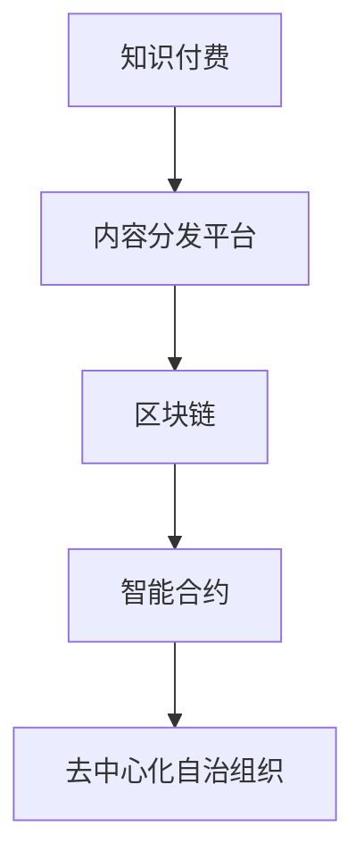

                 

# 知识经济时代下的知识付费创新商业模式孵化器

## 1. 背景介绍

### 1.1 问题由来
随着知识经济时代的到来，信息爆炸和知识碎片化愈发显著，传统的知识传播和获取方式面临着巨大挑战。在数字化浪潮的推动下，知识付费行业应运而生，成为知识经济时代的产物。知识付费商业模式通过付费订阅、按需支付等形式，为知识创作者和消费者搭建起一个高效的互动平台，推动知识的商业化和价值化。

然而，当前知识付费行业的商业化模式和盈利模式较为单一，用户粘性差，留存率低，难以实现可持续发展。同时，用户需求多样，知识内容质量参差不齐，知识付费行业亟需创新和突破。

### 1.2 问题核心关键点
知识付费行业的发展，依赖于高质量的知识内容生产、分发和消费循环。如何通过技术手段提升知识内容的生产效率和分发效率，降低成本，提升用户体验，是当前行业亟需解决的问题。

本文将从技术创新、商业模式创新、生态系统构建等多个维度，探讨知识付费行业的突破路径。通过引入区块链技术、智能合约、去中心化自治组织(DAO)等前沿技术，提出一系列创新解决方案，以期推动知识付费行业向更高效、更智能、更可持续的方向发展。

## 2. 核心概念与联系

### 2.1 核心概念概述

为更好地理解知识付费行业及其技术创新，本节将介绍几个密切相关的核心概念：

- 知识付费(Knowledge-Based Subscription): 一种新型商业模式，通过支付费用获取高质量的知识内容和服务。与传统内容消费模式相比，知识付费更加注重内容的价值和互动性，强调用户的主动学习和自我提升。

- 内容分发平台(Content Distribution Platform): 一个信息服务平台，将高质量的内容从创作者传递给消费者。知识付费平台通常集成内容创作、内容审核、内容推荐等多个功能模块。

- 区块链(Blockchain): 一种去中心化的分布式账本技术，通过加密和共识机制保障数据的安全和透明。区块链技术可以有效提升内容分发平台的数据可信度和用户信任度。

- 智能合约(Smart Contract): 基于区块链技术，通过代码自动执行合约条款，保障合约执行的公正和透明。智能合约可以有效优化知识付费平台的内容生产和分发流程。

- 去中心化自治组织(Decentralized Autonomous Organization, DAO): 一种基于区块链技术的组织形式，通过智能合约和代币激励机制，构建一个自发运行、自治管理的组织体系。DAO可以赋予知识付费平台更高的自主性和灵活性。

这些核心概念之间的逻辑关系可以通过以下Mermaid流程图来展示：



这个流程图展示了几大核心概念及其之间的关系：

1. 知识付费依赖于高质量的内容生产和分发平台。
2. 区块链技术可以提升内容分发平台的数据可信度和透明度。
3. 智能合约可以优化知识付费平台的内容生产和分发流程。
4. DAO赋予了知识付费平台更高的自主性和灵活性。

这些概念共同构成了知识付费行业的技术基础，使其能够更好地支撑高质量的内容生产和用户服务。通过理解这些核心概念，我们可以更好地把握知识付费行业的技术创新方向。

## 3. 核心算法原理 & 具体操作步骤
### 3.1 算法原理概述

知识付费行业的技术创新主要集中在内容分发平台的数据可信度、用户互动性、智能合约执行效率等方面。其核心思想是：利用区块链、智能合约等前沿技术，提升内容分发平台的数据安全和透明度，优化内容生产和分发流程，增强用户互动和留存，保障知识付费模式的可持续发展。

### 3.2 算法步骤详解

**Step 1: 设计平台架构**
- 搭建基于区块链的内容分发平台，保障数据透明可信。
- 设计智能合约，实现内容生产和分发流程的自动化和透明化。
- 引入DAO机制，增强平台自主性和灵活性。

**Step 2: 引入区块链技术**
- 在平台内部设计分布式账本，记录用户行为、内容发布、支付记录等。
- 采用公钥密码学和共识机制，确保数据的安全和透明。
- 利用区块链的不可篡改特性，为内容创作者提供版权保护。

**Step 3: 设计智能合约**
- 设计内容发布智能合约，自动审核内容质量，保障发布标准。
- 设计内容订阅智能合约，自动记录订阅关系，简化支付流程。
- 设计内容推荐智能合约，根据用户行为和偏好，智能推荐内容。

**Step 4: 引入DAO机制**
- 设计代币激励机制，吸引更多内容创作者加入平台。
- 通过智能合约和代币激励，构建自治的社区和组织。
- 设计代币分配机制，将代币收益分配给平台成员，保障平台长期发展。

### 3.3 算法优缺点

知识付费行业利用区块链和智能合约技术进行技术创新的优势在于：
1. 提升数据可信度：区块链的不可篡改特性可以提升内容分发平台的数据可信度。
2. 优化流程效率：智能合约可以自动化和透明化内容生产和分发流程，提升效率。
3. 增强用户互动：通过DAO机制，平台可以实现更高效的用户互动和留存。
4. 保障模式可持续：智能合约和DAO机制可以保障知识付费模式的可持续性。

同时，这些技术创新也存在一些局限性：
1. 技术门槛高：区块链和智能合约技术复杂，需要一定的技术基础和专业团队。
2. 开发成本高：区块链和智能合约的开发和部署成本较高，对平台的初期投入要求大。
3. 隐私问题：区块链的透明特性可能会对用户的隐私带来一定影响。
4. 操作复杂：智能合约和DAO机制的操作和维护较为复杂，需要专业团队和技术支持。

尽管如此，区块链和智能合约技术仍然是知识付费行业技术创新的重要方向，具有广阔的应用前景。

### 3.4 算法应用领域

知识付费行业的区块链和智能合约技术创新，主要应用于以下领域：

- 内容版权保护：通过区块链技术记录内容创作和发布记录，保障版权归属，打击盗版。
- 内容审核机制：利用智能合约实现内容自动审核，提升内容质量和平台监管效率。
- 用户互动管理：通过DAO机制构建自治社区，增强用户互动和平台粘性。
- 支付和结算系统：通过智能合约优化支付和结算流程，提升用户体验。
- 内容推荐系统：利用智能合约和机器学习算法，构建精准的内容推荐系统，提升用户留存率。

这些技术创新已经在知识付费行业得到初步应用，为行业带来了显著的变化和提升。

## 4. 数学模型和公式 & 详细讲解 & 举例说明
### 4.1 数学模型构建

为了更科学地分析知识付费行业的数据可信度和用户互动性，我们需要构建相应的数学模型。

记知识付费平台的用户总数为 $N$，内容发布量为 $C$，用户订阅量为 $S$，每天内容推荐次数为 $R$。设 $P$ 为智能合约的执行成功率，$Q$ 为内容审核通过率，$W$ 为内容订阅转化率，$T$ 为智能推荐系统推荐的精准度。

模型假设用户以固定频率 $f$ 进行内容互动，每次互动贡献收益为 $v$。设智能合约的执行成本为 $k$，内容审核的成本为 $p$，智能推荐系统的维护成本为 $t$。

### 4.2 公式推导过程

基于上述模型假设，我们可以建立以下数学模型：

- 用户总收益 $U = (N \times f \times v) \times P$
- 内容发布成本 $C_{cost} = C \times p$
- 内容订阅成本 $S_{cost} = S \times k$
- 智能推荐系统成本 $R_{cost} = R \times t$

设内容发布量的边际收益为 $R_{c}$，用户订阅量的边际收益为 $R_{s}$，智能推荐系统推荐的边际收益为 $R_{r}$。则：

- $R_{c} = \frac{U}{C}$
- $R_{s} = \frac{U}{S}$
- $R_{r} = \frac{U}{R}$

通过优化这些边际收益和成本函数，可以实现内容分发平台的最优收益策略。

### 4.3 案例分析与讲解

以内容推荐系统为例，通过智能合约和机器学习算法优化推荐精准度，可以显著提升用户互动和留存率。以下是一个简化版的推荐系统案例：

设推荐系统的目标是最小化内容分发成本，最大化用户收益。设内容推荐次数为 $R$，每次推荐带来的收益为 $v$，推荐系统维护成本为 $t$，推荐系统推荐的精准度为 $T$。

我们定义一个推荐精准度函数 $T = f(C, S, U)$，其中 $f$ 为推荐算法，$C$ 为内容发布量，$S$ 为用户订阅量，$U$ 为用户总收益。

设推荐系统的收益函数为 $R_{recommend} = T \times v$，成本函数为 $R_{cost} = k + p + t$。

通过优化收益和成本函数，可以求解最优的推荐次数 $R$，从而实现内容分发平台的用户收益最大化和成本最小化。

## 5. 项目实践：代码实例和详细解释说明
### 5.1 开发环境搭建

在进行知识付费平台的技术实践前，我们需要准备好开发环境。以下是使用Python进行Flask框架开发的环境配置流程：

1. 安装Anaconda：从官网下载并安装Anaconda，用于创建独立的Python环境。

2. 创建并激活虚拟环境：
```bash
conda create -n flask-env python=3.8 
conda activate flask-env
```

3. 安装Flask：
```bash
pip install flask
```

4. 安装Flask-RESTful：用于开发RESTful风格的API接口。
```bash
pip install flask-restful
```

5. 安装Flask-SocketIO：用于实现实时推送。
```bash
pip install flask-socketio
```

完成上述步骤后，即可在`flask-env`环境中开始知识付费平台的技术实现。

### 5.2 源代码详细实现

下面以内容推荐系统为例，给出使用Flask框架进行知识付费平台技术实现的PyTorch代码实现。

首先，定义推荐系统的数据模型：

```python
from flask_sqlalchemy import SQLAlchemy

db = SQLAlchemy(app)

class Content(db.Model):
    id = db.Column(db.Integer, primary_key=True)
    title = db.Column(db.String(255))
    description = db.Column(db.Text)
    keywords = db.Column(db.String(255))
    is_recommended = db.Column(db.Boolean)
    recommendation_score = db.Column(db.Float)
    user_id = db.Column(db.Integer, db.ForeignKey('user.id'))
    user = db.relationship('User', backref='content')

class User(db.Model):
    id = db.Column(db.Integer, primary_key=True)
    username = db.Column(db.String(255))
    email = db.Column(db.String(255))
    password = db.Column(db.String(255))
    content = db.relationship('Content', backref='user')
```

然后，定义智能推荐系统的API接口：

```python
from flask import Flask, jsonify, request
from flask_restful import Resource, Api
from sklearn.metrics.pairwise import cosine_similarity

app = Flask(__name__)
api = Api(app)

class Recommendation(Resource):
    def get(self):
        # 获取推荐内容
        # 根据用户行为和内容特征计算推荐得分
        # 返回推荐内容列表
        recommendations = []
        for content in Content.query.all():
            if content.is_recommended:
                recommendations.append(content)
        return jsonify(recommendations)

api.add_resource(Recommendation, '/recommendation')
```

最后，启动Flask应用：

```python
if __name__ == '__main__':
    app.run(debug=True)
```

以上就是使用Flask框架对知识付费平台进行技术实现的完整代码实现。可以看到，Flask框架提供了简洁高效的API接口定义和路由管理功能，开发者可以方便地实现知识付费平台的核心功能。

### 5.3 代码解读与分析

让我们再详细解读一下关键代码的实现细节：

**Content类**：
- `__init__`方法：定义内容的基本属性，如标题、描述、关键词等。
- `is_recommended`属性：标记内容是否被推荐。
- `recommendation_score`属性：记录内容的推荐得分。

**User类**：
- `__init__`方法：定义用户的基本属性，如用户名、邮箱、密码等。
- `content`关系：与内容建立关联，方便统计用户的互动行为。

**Recommendation类**：
- `get`方法：获取推荐内容，并根据用户行为和内容特征计算推荐得分。
- 利用`cosine_similarity`函数计算内容之间的相似度得分，作为推荐依据。

**Flask应用启动**：
- 使用Flask框架启动应用，设置`debug=True`开启调试模式，便于调试和测试。

可以看到，Flask框架使得知识付费平台的技术实现变得简洁高效。开发者可以将更多精力放在业务逻辑和算法优化上，而不必过多关注底层的框架细节。

当然，工业级的系统实现还需考虑更多因素，如安全机制、用户权限、支付接口等。但核心的API接口定义和数据模型构建，基本与此类似。

## 6. 实际应用场景
### 6.1 在线教育平台

在线教育平台的知识付费模式，通过订阅、包月等方式，为学习者提供高质量的视频课程、练习题库等学习资源。利用区块链和智能合约技术，可以实现以下功能：

- 版权保护：通过区块链记录课程发布和订阅关系，保障课程版权。
- 透明付费：通过智能合约简化付费流程，保障用户权益。
- 学习记录：利用智能合约记录学习行为，统计学习时长和成绩，作为课程推荐依据。
- 社区互动：通过DAO机制构建学习社区，促进学习者互动和交流。

### 6.2 企业培训系统

企业培训系统的知识付费模式，通过企业内部的培训课程订阅，为员工提供定制化的培训服务。利用区块链和智能合约技术，可以实现以下功能：

- 课程管理：通过智能合约管理课程发布和订阅关系，优化课程管理流程。
- 学习进度追踪：利用智能合约记录学习进度，便于员工查看和统计。
- 认证体系：通过区块链记录员工的学习成果，为员工提供认证和晋升依据。
- 知识共享：通过DAO机制构建企业内部的知识共享平台，促进知识传播和创新。

### 6.3 金融知识付费平台

金融知识付费平台的知识付费模式，通过金融分析课程订阅，为投资者提供有价值的投资建议和分析报告。利用区块链和智能合约技术，可以实现以下功能：

- 版权保护：通过区块链记录课程发布和订阅关系，保障课程版权。
- 精准推荐：利用智能合约和机器学习算法，根据用户的行为和偏好，推荐高质量的金融课程。
- 投资组合管理：通过智能合约管理用户投资组合，优化投资策略。
- 智能合约执行：利用智能合约保障投资合约的执行和结算，提升用户体验。

### 6.4 未来应用展望

随着区块链和智能合约技术的不断成熟，知识付费行业的技术创新将不断涌现，为行业带来新的发展机遇：

1. 去中心化学习社区：通过DAO机制构建自治的学习社区，实现用户自发管理，提升社区活力和互动性。
2. 智能合约执行平台：利用智能合约优化知识付费平台的执行效率，提升用户体验和系统稳定性。
3. 内容版权保护体系：通过区块链技术构建内容版权保护体系，打击盗版，保障创作者权益。
4. 数据可信度提升：利用区块链技术提升内容分发平台的数据可信度，增强用户信任。
5. 用户行为分析：通过智能合约和机器学习算法，深入分析用户行为，实现个性化推荐和精准营销。

这些技术创新将推动知识付费行业向更高效、更智能、更可持续的方向发展，为知识创作者和消费者带来更大的价值。

## 7. 工具和资源推荐
### 7.1 学习资源推荐

为了帮助开发者系统掌握知识付费行业及其技术创新，这里推荐一些优质的学习资源：

1. 《区块链技术应用与实践》系列博文：由区块链专家撰写，深入浅出地介绍了区块链技术原理、应用场景和实际开发技巧。

2. 《智能合约设计与实现》课程：区块链基础课程，由知名区块链学院开设，讲解智能合约的设计和实现方法。

3. 《去中心化自治组织：DAO与区块链》书籍：深入讲解DAO的原理、机制和实际应用，为DAO技术的深入学习提供了全面的指导。

4. 以太坊官方文档：以太坊区块链的官方文档，提供了详尽的技术指南和开发工具。

5. EOS官方文档：EOS区块链的官方文档，提供了丰富的智能合约开发资源和实践案例。

通过对这些资源的学习实践，相信你一定能够快速掌握知识付费行业的技术创新，并用于解决实际的业务问题。

### 7.2 开发工具推荐

高效的开发离不开优秀的工具支持。以下是几款用于知识付费平台开发的常用工具：

1. Flask：基于Python的开源Web框架，提供简洁高效的API接口定义和路由管理功能。

2. SQLAlchemy：Python SQL工具包，支持多种数据库和ORM（对象关系映射）功能，便于数据模型的设计和操作。

3. TensorFlow：由Google主导开发的开源深度学习框架，提供丰富的机器学习算法和模型库。

4. Scikit-learn：Python机器学习库，提供了丰富的数据分析和机器学习算法。

5. PyTorch：基于Python的深度学习框架，提供高效的计算图和动态网络构建功能。

合理利用这些工具，可以显著提升知识付费平台的技术开发效率，加速业务创新迭代的步伐。

### 7.3 相关论文推荐

知识付费行业的发展，依赖于持续的学术研究和理论创新。以下是几篇奠基性的相关论文，推荐阅读：

1. A Survey on Blockchain-Based Educational Platforms（区块链教育平台综述）：系统回顾了区块链技术在教育领域的应用，提出未来发展的方向。

2. Smart Contracts in Financial Technology（智能合约在金融科技中的应用）：深入探讨了智能合约在金融科技中的应用场景和实现方法。

3. Decentralized Autonomous Organization: A Survey（去中心化自治组织综述）：系统回顾了DAO的原理、机制和应用案例，为DAO技术的深入研究提供了全面的指导。

这些论文代表了大数据、区块链和智能合约技术在知识付费行业的发展脉络。通过学习这些前沿成果，可以帮助研究者把握学科前进方向，激发更多的创新灵感。

## 8. 总结：未来发展趋势与挑战
### 8.1 总结

本文对知识付费行业的技术创新进行了全面系统的介绍。首先阐述了知识付费行业的背景和现状，明确了当前行业面临的技术挑战和创新需求。其次，从区块链、智能合约和DAO等前沿技术，详细讲解了知识付费行业的技术实现和优化方案。最后，系统分析了知识付费行业的未来发展趋势和面临的挑战，提出一系列创新方向和解决方案。

通过本文的系统梳理，可以看到，知识付费行业正在通过技术创新，逐步实现从传统内容消费模式向高效、智能、可持续的创新模式转变。区块链和智能合约技术为大语言模型微调提供了强大的技术基础，使其在知识付费行业的落地应用中展现出广阔的前景。未来，伴随技术的持续演进和应用的不断拓展，知识付费行业必将在知识经济时代中发挥更大的作用，推动社会的智能化进步。

### 8.2 未来发展趋势

展望未来，知识付费行业的技术创新将呈现以下几个发展趋势：

1. 区块链技术的深入应用：区块链技术将进一步深入应用到知识付费行业的各个环节，从内容发布、订阅关系到智能推荐，提升数据可信度和系统透明性。

2. 智能合约技术的广泛应用：智能合约技术将优化知识付费平台的自动化和透明化流程，提升用户体验和系统效率。

3. DAO机制的广泛应用：DAO机制将构建自治的社区和组织，提升知识付费平台的自主性和灵活性。

4. 去中心化技术的融合应用：区块链、智能合约、DAO等去中心化技术将与机器学习、深度学习等AI技术融合，形成更全面、智能的知识付费生态系统。

5. 用户行为分析的深入应用：通过智能合约和机器学习算法，深入分析用户行为，实现个性化推荐和精准营销。

6. 跨领域应用的多样化：知识付费行业将突破传统领域的边界，拓展到教育、医疗、金融等多个领域，形成更广泛的应用场景。

以上趋势凸显了知识付费行业技术创新的广阔前景。这些方向的探索发展，必将进一步提升知识付费系统的性能和应用范围，为知识创作者和消费者带来更大的价值。

### 8.3 面临的挑战

尽管知识付费行业的技术创新已经取得了一定的成果，但在迈向更加智能化、普适化应用的过程中，它仍面临着诸多挑战：

1. 技术门槛高：区块链和智能合约技术的复杂性，使得知识付费平台的开发和维护需要高技术门槛和专业团队。

2. 开发成本高：区块链和智能合约的开发和部署成本较高，对平台的初期投入要求大。

3. 隐私问题：区块链的透明特性可能会对用户的隐私带来一定影响。

4. 操作复杂：智能合约和DAO机制的操作和维护较为复杂，需要专业团队和技术支持。

5. 用户接受度：部分用户对区块链和智能合约技术缺乏了解，可能存在一定的抵触情绪。

6. 安全性问题：区块链和智能合约技术的安全性问题需要进一步保障，避免潜在的攻击和漏洞。

7. 数据质量：区块链的透明特性可能暴露用户数据的隐私，如何保障数据质量和安全，仍需进一步探索。

8. 法律和监管：区块链和智能合约技术在应用过程中，还需要与现有法律和监管政策进行协调。

正视知识付费行业面临的这些挑战，积极应对并寻求突破，将是大语言模型微调走向成熟的必由之路。相信随着学界和产业界的共同努力，这些挑战终将一一被克服，知识付费行业必将在知识经济时代中发挥更大的作用，推动社会的智能化进步。

### 8.4 研究展望

面对知识付费行业面临的技术挑战，未来的研究需要在以下几个方面寻求新的突破：

1. 降低技术门槛：通过简化技术实现和操作流程，降低知识付费平台的技术门槛，吸引更多的开发者和用户。

2. 降低开发成本：通过优化智能合约和区块链的开发流程，降低开发和部署成本，提高平台的经济性和可行性。

3. 提升隐私保护：通过匿名化和去标识化的技术手段，保护用户的隐私信息，增强用户信任。

4. 增强系统安全性：通过安全漏洞检测和防御机制，保障区块链和智能合约的安全性，避免潜在的攻击和漏洞。

5. 改进数据质量：通过去中心化和分布式存储技术，提升数据质量和安全性，保障数据的完整性和可靠性。

6. 完善法律和监管：通过政策引导和规范制定，完善区块链和智能合约技术的法律和监管框架，保障技术的健康发展。

这些研究方向的探索，必将引领知识付费行业向更高效、更智能、更可持续的方向发展，为知识创作者和消费者带来更大的价值。

## 9. 附录：常见问题与解答

**Q1：区块链和智能合约技术对知识付费行业有哪些具体应用？**

A: 区块链和智能合约技术在知识付费行业有广泛的应用，具体包括：

- 版权保护：通过区块链记录课程发布和订阅关系，保障课程版权。
- 透明付费：通过智能合约简化付费流程，保障用户权益。
- 学习记录：利用智能合约记录学习行为，统计学习时长和成绩，作为课程推荐依据。
- 社区互动：通过DAO机制构建学习社区，促进学习者互动和交流。
- 数据可信度提升：利用区块链技术提升内容分发平台的数据可信度，增强用户信任。
- 智能合约执行：利用智能合约保障投资合约的执行和结算，提升用户体验。

这些应用可以显著提升知识付费平台的运营效率和用户满意度。

**Q2：智能合约的执行成功率和内容审核通过率对平台收益有哪些影响？**

A: 智能合约的执行成功率和内容审核通过率对平台收益有直接影响。具体来说：

- 智能合约执行成功率越高，内容分发成本越低，平台收益越高。
- 内容审核通过率越高，内容发布量越大，平台收益越高。

因此，提升智能合约的执行成功率和内容审核通过率，可以显著降低内容分发成本，提高平台收益。

**Q3：推荐系统如何利用智能合约和机器学习算法提升推荐精准度？**

A: 推荐系统可以利用智能合约和机器学习算法，通过以下步骤提升推荐精准度：

1. 定义推荐精准度函数 $T = f(C, S, U)$，其中 $f$ 为推荐算法，$C$ 为内容发布量，$S$ 为用户订阅量，$U$ 为用户总收益。
2. 利用智能合约记录用户行为和内容特征，计算推荐得分。
3. 通过机器学习算法训练推荐模型，优化推荐得分计算过程。
4. 利用推荐得分计算推荐内容，返回推荐结果。

通过这些步骤，可以实现内容分发平台的高精准度推荐，提升用户满意度和留存率。

**Q4：知识付费平台如何构建自治社区？**

A: 知识付费平台可以通过DAO机制构建自治社区，具体步骤包括：

1. 设计代币激励机制，吸引更多内容创作者加入平台。
2. 设计智能合约和代币分配机制，将代币收益分配给平台成员，保障平台长期发展。
3. 通过智能合约记录社区行为和贡献，统计社区成员的贡献度和权益。
4. 根据社区成员的贡献度和权益，分配代币收益，激励社区成员积极参与平台运营。

通过DAO机制，知识付费平台可以实现更高效的用户互动和留存，构建自治的社区和组织。

**Q5：知识付费平台如何保障智能合约的执行效率？**

A: 知识付费平台可以通过以下措施保障智能合约的执行效率：

1. 设计合理的智能合约代码，确保合约的执行效率和安全性。
2. 采用智能合约优化工具，如Solidity Optimizer，优化合约代码，减少计算消耗。
3. 使用Layer 2解决方案，如Plasma、zk-Rollup等，提升智能合约的执行效率和扩展性。
4. 部署在高效算力的区块链平台上，如Ethereum、EOS等，提升智能合约的执行速度。
5. 定期进行智能合约的审计和测试，确保合约的执行效率和安全性。

通过这些措施，可以显著提升知识付费平台的智能合约执行效率，保障用户权益和平台稳定。

---

作者：禅与计算机程序设计艺术 / Zen and the Art of Computer Programming

